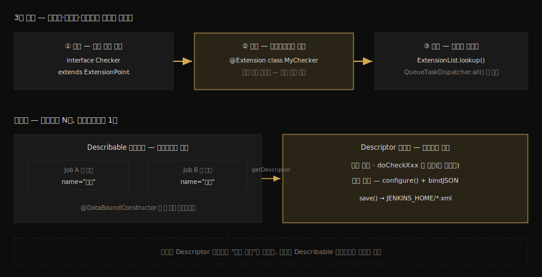

# Extension Point와 Describable 스펙

---

> 이 문서를 읽고 나면 ExtensionPoint 정의 → `@Extension` 구현 → ExtensionList 발견의 3단 계약을 설명하고, Describable과 Descriptor가 왜 둘로 나뉘는지(인스턴스 데이터 대 싱글턴 메타데이터) 말하며, GlobalConfiguration의 설정이 어디에 저장되는지 짚을 수 있습니다.

> **분담 안내** — RunListener·FlowExecutionListener처럼 이벤트를 *듣는* 확장의 활용은 [`05_operations/02-05a`](../05_operations/02-05a.RunListener와%20FlowExecutionListener.md)가 정본입니다. 이 문서는 듣기·더하기를 가리지 않고 모든 확장이 딛는 공통 *계약* — 정의·등록·발견의 메커니즘 — 을 다룹니다.

## 진입 — "꽂는다"의 계약

> 03-02에서 QueueTaskDispatcher를 만났습니다. 큐 코드를 한 줄도 안 고치고 배정 거부권을 "꽂는다"고 했는데, 그 꽂는 행위의 계약이 무엇인지는 미뤘습니다. 이 문서가 그 빚을 갚습니다.

엔진 묶음에서 확장점은 이미 여러 번 스쳐 갔습니다. [`03-02`](03-02.Executor%20배정%20알고리즘과%20TPS%20대조.md)의 `QueueTaskDispatcher`(배정 거부권), 같은 문서의 `LoadBalancer`(배정 전략 교체), 그리고 `06-01`에서 다룰 `QueueSorter`(큐 정렬)까지 — 셋 다 소스에 `implements ExtensionPoint`가 붙어 있습니다. Jenkins가 코어 수정 없이 행동을 바꾸는 표준 통로가 전부 이 한 계약 위에 있다는 뜻입니다.

이 계약은 자바 표준 SPI(`ServiceLoader`)와 같은 발상이지만, `META-INF/services` 텍스트 파일 대신 어노테이션으로 구현을 표시한다는 점이 다릅니다.

### 이 문서의 좌표

`05` 묶음의 스펙편입니다. 여기서 계약을 읽고, 짝 문서 [`05-02`](05-02.첫%20플러그인%20제작%20%28Maven%20HPI%29.md)에서 그 계약대로 생긴 플러그인 골격을 직접 만들어 돌립니다.

## 사전 지식

> 자바 SPI(ServiceLoader)로 구현체를 런타임에 갈아 끼워 본 경험이 있다면, 이 문서는 그 패턴의 Jenkins 방언 — 어노테이션 등록과 싱글턴 메타데이터 객체가 더해진 형태 — 입니다.

## 1. 3단 계약 — 정의, 등록, 발견

> 인터페이스가 ExtensionPoint를 상속해 "여기 꽂을 수 있다"를 선언하고, 구현체가 @Extension으로 자신을 등록하고, 소비자가 ExtensionList로 전부 모아 갑니다.

공식 문서의 최소 예가 계약 전체를 보여 줍니다(출처: jenkins.io/doc/developer/plugin-development/dependencies-and-class-loading):

```java
// ① 정의 — ExtensionPoint 상속이 "여기에 꽂아도 된다"는 선언
public interface Checker extends ExtensionPoint {
    boolean doesThisSeemOK(String input);
}

// ② 등록 — 다른 플러그인이 @Extension 으로 자기 구현을 표시
//    별도 등록 파일·설정 없이 어노테이션 하나가 등록의 전부
@Extension
public class MyChecker implements Checker {
    @Override
    public boolean doesThisSeemOK(String input) {
        return !input.contains("/");
    }
}
```

```java
// ③ 발견 — 소비자는 설치된 모든 구현을 한 줄로 모은다
//    어떤 플러그인이 꽂혀 있는지 소비자가 알 필요가 없다
for (Checker c : ExtensionList.lookup(Checker.class)) {
    if (!c.doesThisSeemOK(input)) { … }
}
```

세 줄짜리 계약이지만 효과가 큽니다. 정의자(코어 또는 API 플러그인)는 구현자가 누구인지 모르고, 구현자는 소비 시점을 모르고, 소비자는 목록만 받습니다. `@Extension`이 붙은 클래스는 빌드 시점에 인덱스로 기록되어 기동 때 클래스패스 전체를 뒤지는 비용 없이 모입니다. [`02-01`](02-01.Stapler%20URL%20라우팅%20스펙.md)에서 본 "객체를 노출하면 URL이 생긴다"와 같은 결의 설계입니다 — 등록 파일 대신 코드 자체가 선언이 됩니다.

`03-02`의 거부권 사슬을 이 눈으로 다시 보면, `QueueTaskDispatcher.all()` 순회가 곧 ③의 발견 단계였음이 보입니다. 큐는 어떤 플러그인이 거부권을 들고 있는지 모른 채 목록을 돌 뿐입니다.

## 2. Describable과 Descriptor — 왜 둘로 나뉘는가

> 사용자가 설정하는 확장(빌드 스텝 등)은 "Job마다 다른 설정값"과 "클래스당 하나뿐인 메타데이터"를 동시에 가져야 합니다. 앞이 Describable 인스턴스, 뒤가 Descriptor 싱글턴입니다.

`@Extension`만으로 끝나는 확장은 설정이 없는 것들입니다(리스너·정렬기 등). 그런데 빌드 스텝처럼 *사용자가 화면에서 고르고 값을 채우는* 확장은 요구가 둘로 갈라집니다:

1. Job A의 스텝은 `name="배포"`, Job B의 스텝은 `name="검증"` — 설정값은 *사용처마다 다른 인스턴스*여야 합니다.
2. "이 스텝의 표시 이름은 무엇인가", "입력값 검증 규칙은 무엇인가" — 이런 정보는 *클래스당 정확히 하나*면 됩니다.

Jenkins는 이 둘을 클래스 쌍으로 풉니다. 설정값을 드는 쪽이 `Describable`(인스턴스, Job 설정에 직렬화되어 저장), 메타데이터를 드는 쪽이 `Descriptor`(싱글턴, `@Extension`으로 등록)입니다. 둘은 `getDescriptor()`로 연결됩니다. 설정 화면이 "어떤 빌드 스텝들이 설치돼 있나"를 그릴 때는 Descriptor 목록을 쓰고, 저장된 Job을 실행할 때는 Describable 인스턴스를 씁니다.

JPA에 비유하면 Entity 인스턴스(행 데이터)와 EntityType 메타모델(클래스당 하나)의 관계와 같은 분리입니다. 단 이 비유는 역할 분리까지만 유효하고, Descriptor는 메타정보 제공을 넘어 폼 검증과 전역 설정 저장이라는 *능동적 일*까지 한다는 점이 다릅니다.

계약과 이중성을 한 장으로 모으면 다음과 같습니다:



## 3. 폼 바인딩 — 화면 값이 인스턴스가 되는 길

> 설정 화면의 입력값은 @DataBoundConstructor를 통해 Describable 인스턴스로 빚어지고, 검증은 Descriptor의 doCheckXxx가 맡습니다.

화면과 객체 사이의 다리는 어노테이션 규약입니다:

1. `@DataBoundConstructor`가 붙은 생성자의 파라미터 이름이 폼 필드 이름과 매칭되어, 제출 시 인스턴스가 만들어집니다. 필수값은 생성자로, 선택값은 `@DataBoundSetter`로 가르는 것이 관례입니다.
2. 폼 자체는 클래스 옆 `config.jelly` 뷰가 그립니다. `<f:entry field="name"><f:textbox/></f:entry>`의 `field`가 생성자 파라미터와 만납니다(출처: jenkins.io/doc/developer/security/form-validation).
3. 입력 검증은 Descriptor의 `doCheckXxx` 메서드가 맡습니다 — `do` 접두사에서 보이듯 이것도 [`02-01`](02-01.Stapler%20URL%20라우팅%20스펙.md)의 웹 메서드이고, 화면이 입력 중 호출하는 작은 HTTP 엔드포인트입니다.

전역 설정 쪽 바인딩도 같은 계열입니다. Descriptor의 `configure(StaplerRequest, JSONObject)`에서 `req.bindJSON(this, json)`으로 제출값을 받아 `save()`로 영속화합니다(출처: jenkins.io/doc/developer/forms/structured-form-submission). 라우팅(Stapler), 확장(@Extension), 폼(jelly)이 결국 한 몸이라는 사실이 이 절에서 모입니다.

## 4. GlobalConfiguration — 전역 설정 한 구획의 정체

> Manage Jenkins의 System 화면에 보이는 구획 하나하나가 GlobalConfiguration 구현체입니다. save()가 부르는 곳은 01-01에서 본 JENKINS_HOME의 XML입니다.

Job 단위가 아니라 서버 전역의 설정이 필요하면 `GlobalConfiguration`을 상속합니다. 이것 역시 `@Extension`으로 등록되는 Descriptor의 특수형이라, 구현체 하나가 곧 전역 설정 화면의 한 구획이 됩니다. 공식 아키타입 목록에 `global-configuration-plugin` 골격이 따로 있을 만큼 표준적인 형태입니다(출처: jenkins.io/doc/developer/tutorial/create).

저장 위치는 새로울 것이 없습니다. `save()`를 부르면 [`01-01`](01-01.로컬%20Docker%20Jenkins%20%2B%20소스%20디버깅%20환경.md) §4 표에서 본 `JENKINS_HOME`의 사이트 전역 `*.xml`로 내려갑니다. 화면 한 구획 = 클래스 하나 = XML 파일 하나의 대응이 잡히면, 운영 중 설정 파일을 추적하는 일이 수월해집니다.

## 5. 경계 — Listener도 같은 계약의 한 용도

> 02-05a의 RunListener들도 결국 @Extension으로 등록되는 ExtensionPoint 구현입니다. 계약은 하나, 용도가 둘입니다.

[`05_operations/02-05a`](../05_operations/02-05a.RunListener와%20FlowExecutionListener.md)가 다루는 리스너들은 빌드 수명주기 *이벤트를 구독*하는 용도이고, 이 문서와 `05-02`가 다루는 Builder류는 *기능을 제공*하는 용도입니다. 메커니즘 차원에서는 둘 다 §1의 3단 계약 위에 있습니다 — `RunListener`도 `ExtensionPoint`이고 `@Extension`으로 등록되며 코어가 목록을 돌며 호출합니다. "어떻게 꽂는가"는 이 문서, "들어서 무엇을 하는가"는 02-05a로 갈라 읽으면 중복 없이 잡힙니다.

## 면접에서 받을 만한 질문

> 확장 계약은 "프레임워크 설계" 면접 주제로 곧장 이어집니다. 아래 4개에 먼저 스스로 답해 보고, 자답이 끝나면 다음 절로 내려갑니다.

1. Jenkins의 확장 계약 3단계를 설명하고, 자바 표준 SPI(ServiceLoader)와 무엇이 같고 무엇이 다른지 말해 보십시오.
2. Describable과 Descriptor를 왜 둘로 나눕니까? 각각 몇 개 만들어지고 무엇을 듭니까?
3. `@DataBoundConstructor`와 `@DataBoundSetter`는 어떻게 나눠 씁니까? 폼 검증 메서드는 어디에 두며, 그 메서드의 정체는 무엇입니까?
4. GlobalConfiguration의 설정값은 어디에 저장되며, 화면·클래스·파일의 대응 관계는 어떻게 됩니까?

## 정답 (자답 후 펼치기)

> 위 §면접에서 받을 만한 질문의 4개에 *먼저 자답한 뒤* 아래를 읽으십시오. 자답 없이 먼저 읽으면 학습 효과가 0입니다.

### 정답 1 — 정의·등록·발견, 그리고 SPI와의 차이

첫째 정의 — 인터페이스(또는 추상 클래스)가 `ExtensionPoint`를 상속해 꽂을 자리를 선언합니다. 둘째 등록 — 구현체에 `@Extension`을 붙이면 빌드 시점 인덱스에 기록됩니다. 셋째 발견 — 소비자가 `ExtensionList.lookup()`으로 설치된 구현 전부를 모읍니다. SPI와 같은 점은 정의자·구현자·소비자의 삼자 분리라는 구조 자체입니다. 다른 점은 등록 수단으로, SPI가 `META-INF/services` 텍스트 파일에 FQCN을 적는 반면 Jenkins는 어노테이션 인덱스를 써서 등록 파일 관리가 없고, 구현이 코어가 아니라 플러그인 단위로 설치·제거된다는 운영 차원이 더해집니다.

### 정답 2 — N개의 데이터와 1개의 메타데이터

사용자가 설정하는 확장은 요구가 둘입니다. 설정값은 사용처(Job)마다 달라야 하므로 Describable 인스턴스가 N개 만들어져 각 Job 설정에 직렬화되고, 표시 이름·검증 규칙·전역 설정 같은 클래스 수준 정보는 하나면 충분하므로 Descriptor 싱글턴이 `@Extension`으로 한 번 등록됩니다. 설정 화면은 Descriptor 목록으로 "고를 수 있는 것들"을 그리고, 실행 시점에는 저장된 Describable 인스턴스의 값을 씁니다. 둘은 `getDescriptor()`로 연결됩니다.

### 정답 3 — 필수는 생성자, 선택은 세터, 검증은 웹 메서드

필수 입력은 `@DataBoundConstructor` 생성자 파라미터로 받고, 선택 입력은 `@DataBoundSetter`가 붙은 세터로 받습니다. 이렇게 가르면 필수값 없는 인스턴스가 타입 수준에서 못 만들어집니다. 검증은 Descriptor의 `doCheckXxx` 메서드에 둡니다. 이름의 `do` 접두사가 말하듯 이것은 Stapler 웹 메서드라서, 설정 화면이 입력 도중 HTTP로 호출해 즉석 피드백을 그립니다. 확장 계약과 URL 라우팅이 같은 객체 위에서 만나는 지점입니다.

### 정답 4 — 화면 한 구획 = 클래스 하나 = XML 하나

GlobalConfiguration 구현체는 `@Extension`으로 등록되는 Descriptor의 특수형으로, 구현체 하나가 Manage Jenkins 전역 설정 화면의 한 구획이 됩니다. `configure()`에서 `bindJSON`으로 제출값을 받고 `save()`를 부르면 `JENKINS_HOME` 바로 아래의 사이트 전역 XML 파일로 내려갑니다. 화면 구획·자바 클래스·XML 파일이 1:1:1로 대응하므로, 어떤 설정이 어느 파일에 있는지 역추적이 가능합니다.

## 관련 문서

> 이 문서의 계약은 짝 실습편에서 파일로 구현되고, 이미 만난 확장점들의 사후 설명이 됩니다.

- [05-02. 첫 플러그인 제작 (Maven HPI)](05-02.첫%20플러그인%20제작%20%28Maven%20HPI%29.md) — 이 계약이 Builder·DescriptorImpl·config.jelly 파일로 놓이는 실습 짝
- [03-02. Executor 배정 알고리즘과 TPS 대조](03-02.Executor%20배정%20알고리즘과%20TPS%20대조.md) § "1. 1단계 후보 선별" — QueueTaskDispatcher가 이 계약의 ③발견으로 호출되는 현장
- [05_operations 02-05a. RunListener와 FlowExecutionListener](../05_operations/02-05a.RunListener와%20FlowExecutionListener.md) — 같은 계약의 "듣기" 용도 정본
- [02-01. Stapler URL 라우팅 스펙](02-01.Stapler%20URL%20라우팅%20스펙.md) — doCheckXxx가 웹 메서드로 호출되는 라우팅 원리
