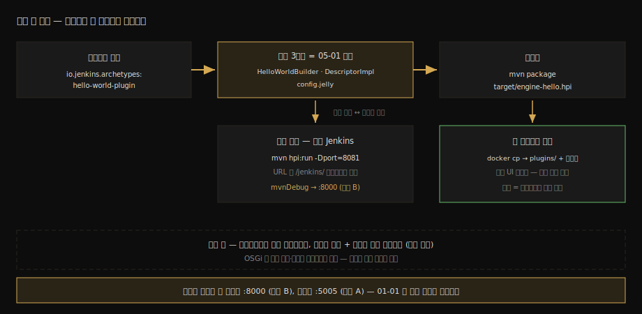

# 첫 플러그인 제작 (Maven HPI)

---

> 이 문서를 읽고 나면 아키타입으로 플러그인 골격을 생성하고, 골격의 세 파일(Builder·DescriptorImpl·config.jelly)을 [`05-01`](05-01.Extension%20Point와%20Describable%20스펙.md)의 계약에 대응시켜 읽으며, `hpi:run`으로 개발 루프를 돌리고 `mvnDebug`로 내 코드에 브레이크포인트를 걸고, 빌드한 `.hpi`를 본 컨테이너에 설치할 수 있습니다.

## 진입 — 계약을 파일로 만져 보기

> 05-01의 3단 계약과 Describable·Descriptor 이중성은 글로는 추상적입니다. 아키타입이 만들어 주는 골격은 그 계약이 디스크에 어떤 파일로 놓이는지를 보여 주는 살아 있는 교보재입니다.

REST에 없는 기능을 만들 수 있다는 것이 이 묶음 `05` 축의 약속이었습니다. 그 약속을 가장 작은 단위로 이행해 봅니다 — 빌드 스텝 하나를 가진 플러그인을 만들어, 개발 모드로 돌리고, 디버깅하고, 패키징해서 우리 컨테이너에 설치하는 한 바퀴입니다. 한 바퀴를 돌고 나면 `05-01`의 모든 추상 명사가 구체적인 파일 이름으로 바뀝니다.

### 이 문서의 좌표

`05` 묶음의 실습편입니다. [`01-01`](01-01.로컬%20Docker%20Jenkins%20%2B%20소스%20디버깅%20환경.md) §1에서 예고한 경로 B(`mvnDebug`, 포트 8000)가 처음으로 주력이 되는 자리이기도 합니다.

## 사전 지식

> Maven의 기본 수명주기(generate·package)를 알고 05-01을 읽었다면, 이 문서는 그 계약을 손으로 옮겨 적는 받아쓰기에 가깝습니다.

호스트에 Maven과 JDK가 필요합니다. 이 실습은 컨테이너가 아니라 호스트에서 빌드합니다 — 마지막 절에서 결과물만 컨테이너로 들어갑니다.

## 1. 골격 생성 — 아키타입 한 줄

> 공식 아키타입 필터 한 줄이면 빌드 스텝 예제가 포함된 플러그인 골격이 통째로 나옵니다.

Jenkins 프로젝트는 플러그인 골격을 Maven 아키타입으로 배포합니다(출처: jenkins.io/doc/developer/tutorial/create):

```bash
# -U: 아키타입 카탈로그 최신화 / -Dfilter: io.jenkins.archetypes 만 추려 보여 준다
mvn -U archetype:generate -Dfilter=io.jenkins.archetypes:
```

선택지에 `empty-plugin`(빈 골격), `global-configuration-plugin`(전역 설정 예제 — 05-01 §4의 골격판), `hello-world-plugin`(빌드 스텝 예제 포함) 등이 나옵니다. 빌드 스텝 예제가 든 `hello-world-plugin`을 고르고, `artifactId`는 `engine-hello`로 줍니다. 나머지 물음은 기본값으로 통과해도 됩니다.

생성이 끝나면 `engine-hello/` 디렉토리에 빌드 가능한 플러그인 프로젝트가 완성돼 있습니다. 코드를 한 줄도 쓰기 전에 이미 동작하는 플러그인이라는 점이 아키타입의 가치입니다.

## 2. 골격 해부 — 05-01 계약과의 1:1 대응

> 골격의 세 파일이 스펙편의 세 개념과 정확히 짝을 이룹니다. 이 표 하나가 이 문서의 절반입니다.

`hello-world-plugin` 아키타입이 만들어 주는 핵심 파일과 `05-01` 개념의 대응은 다음과 같습니다:

| 골격 파일 | 05-01의 개념 | 역할 |
|----------|-------------|------|
| `HelloWorldBuilder.java` | Describable 인스턴스 쪽 | 빌드 스텝 본체 — `@DataBoundConstructor`로 `name`을 받고 `perform()`에서 실행 |
| 같은 파일 안 `DescriptorImpl` | Descriptor 싱글턴 쪽 | `@Extension`으로 등록 — 표시 이름·`doCheckName` 폼 검증 |
| `config.jelly` | 폼 바인딩의 화면 쪽 | `<f:entry field="name">` — 생성자 파라미터와 필드명으로 만남 |

`HelloWorldBuilder.java`를 열어 세 군데만 확인하면 스펙이 닫힙니다. 클래스 선언부의 `Builder` 상속(빌드 스텝이라는 ExtensionPoint 계열), 생성자의 `@DataBoundConstructor`(폼 값이 인스턴스가 되는 길), 내부 클래스 `DescriptorImpl`의 `@Extension`(3단 계약의 등록). 같은 파일에 Describable과 Descriptor가 내부 클래스로 동거하는 배치가 Jenkins 플러그인의 표준 관습입니다.

이 문서가 도는 한 바퀴 전체를 지도로 먼저 봅니다:



## 3. 실습 1 — hpi:run 개발 루프

> 컨테이너도 설치도 없이, Maven 한 줄이 플러그인이 탑재된 임시 Jenkins를 띄워 줍니다. 개발 중 반복 루프는 이걸로 돕니다.

### 환경

- 호스트에서 `engine-hello/` 디렉토리, Maven + JDK
- 본 컨테이너(`jenkins-engine`)는 이 절에서 쓰지 않음 — 8080 포트 충돌을 피하려면 컨테이너를 잠시 내리거나 `-Dport`로 바꿉니다

### 실행과 확인

```bash
cd engine-hello
# 임시 Jenkins 를 띄우고 이 플러그인을 탑재한다 (출처: developer/tutorial/run)
# 본 컨테이너가 8080 을 쓰고 있다면 -Dport=8081 로 비킨다
mvn hpi:run -Dport=8081
```

**결과:**

```
…
INFO: Jenkins is fully up and running
(브라우저) http://localhost:8081/jenkins/ 접속 — 설정 마법사 없이 바로 화면
Freestyle Job 생성 → Add build step 목록에 "Say hello world" 등장
name=engine 으로 저장 후 빌드 → 콘솔: Hello, engine!
```

**분석:**

- 접속 URL에 `/jenkins/` 컨텍스트 경로가 붙는 것이 본 컨테이너와 다른 점입니다(출처: developer/handling-requests 예시의 `http://localhost:8080/jenkins/`). 개발 모드 전용 배치라 그렇습니다.
- 빌드 스텝 목록의 "Say hello world"는 `DescriptorImpl`의 표시 이름이 그려진 것입니다 — Descriptor 목록으로 화면을 그린다던 `05-01` §2가 눈앞에 있습니다.
- `name` 입력 칸에서 값을 지웠을 때 나오는 경고가 `doCheckName` 웹 메서드의 응답입니다.

## 4. 실습 2 — mvnDebug로 내 코드 멈추기

> 경로 A가 jenkins-core 를 멈추는 길이었다면, 경로 B는 내 플러그인 코드를 멈추는 길입니다. 포트만 8000으로 다릅니다.

```bash
# mvnDebug 는 JDWP 8000 포트를 열고 디버거 연결을 기다린 뒤 시작한다
# (출처: jenkins.io/doc/developer/development-environment/ide-configuration)
mvnDebug hpi:run -Dport=8081
```

IntelliJ에서 Remote JVM Debug 구성을 하나 더 만들어 `localhost:8000`으로 attach하고, `HelloWorldBuilder#perform`에 브레이크포인트를 건 뒤 위 실습의 Job을 다시 빌드합니다.

**결과:**

```
perform() 정지. 변수창:
  name = "engine"            ← @DataBoundConstructor 로 들어온 폼 값
  listener                   ← 콘솔 로그를 쓰는 통로
호출 스택 아래쪽에 Executor 프레임 — 03 묶음에서 배정받은 그 실행기가 호출자
```

**분석:**

- [`01-01`](01-01.로컬%20Docker%20Jenkins%20%2B%20소스%20디버깅%20환경.md) §1의 표가 실감으로 바뀝니다. 경로 A(5005)는 운영과 같은 WAR의 코어를, 경로 B(8000)는 소스에서 막 빌드한 내 코드를 멈춥니다. 디버깅 대상이 무엇이냐가 경로를 정합니다.
- 호출 스택에 Executor가 보입니다. `03-02`에서 배정을 끝낸 실행기가 결국 이 `perform()`을 부르는 호출자라는 것 — 묶음의 앞뒤가 한 스택에서 만납니다.

## 5. 실습 3 — 패키징과 본 컨테이너 설치

> 개발 루프 밖으로 나가는 출구는 .hpi 파일 하나입니다. 우리 컨테이너의 plugins/ 로 들어가면 진짜 설치입니다.

```bash
# 테스트까지 돌려 hpi 를 패키징한다 — 산출물은 target/engine-hello.hpi
mvn package
ls target/*.hpi
```

설치는 두 길이 있습니다. UI로는 Manage Jenkins → Plugins → Advanced settings의 업로드 항목에 `.hpi`를 올리고, 파일로는 [`01-01`](01-01.로컬%20Docker%20Jenkins%20%2B%20소스%20디버깅%20환경.md) §4 표에서 본 `JENKINS_HOME/plugins/`에 직접 넣고 재시작합니다:

```bash
# 파일 경로 설치 — 01-01 §4 의 plugins/ 가 바로 이 자리
docker cp target/engine-hello.hpi jenkins-engine:/var/jenkins_home/plugins/
docker restart jenkins-engine
```

**결과:**

```
재시작 후 본 컨테이너(8080)의 Freestyle Job 설정 → "Say hello world" 빌드 스텝 등장
Manage Jenkins → Plugins → Installed 에 engine-hello 표시
```

**분석:**

- `plugins/` 디렉토리에 파일을 넣는 것만으로 설치가 되는 이유는 기동 시 Jenkins가 그 디렉토리의 `.hpi`/`.jpi`를 풀어 로드하기 때문입니다(01-01 §4의 구조 그대로). UI 업로드도 결국 같은 자리에 파일을 놓는 행위입니다.
- 이제 같은 컨테이너에 경로 A(5005)로 attach해 코어와 내 플러그인을 *한 세션에서* 디버깅할 수도 있습니다 — 설치된 플러그인 코드는 그 JVM 안에서 돌기 때문입니다.

## 6. 파생 이론 — hpi 패키징과 클래스로더 격리

> .hpi 는 메타데이터와 의존성을 품은 jar 의 변형이고, 설치된 각 플러그인은 자기 클래스로더 안에서 돕니다. 플러그인끼리 함부로 서로의 클래스를 못 보는 이유입니다.

`.hpi`는 본질적으로 jar 패키징의 변형입니다 — 플러그인 메타데이터(manifest)와 자기 의존 라이브러리를 함께 품습니다. 로드될 때 각 플러그인은 *자기만의 클래스로더*를 받고, 그 부모로 코어와 선언한 의존 플러그인들이 연결됩니다(출처: jenkins.io/doc/developer/plugin-development/dependencies-and-class-loading). 그래서 의존을 선언하지 않은 다른 플러그인의 클래스는 보이지 않고, 같은 라이브러리의 다른 버전을 플러그인끼리 따로 품어도 충돌하지 않습니다.

OSGi 같은 완전한 동적 모듈 시스템과는 결이 다릅니다. 버전 범위 협상이나 서비스 레지스트리 없이, 선언된 의존 관계를 따라가는 계층형 클래스로더 위임이라는 단순한 구조입니다. README 면접 체크리스트의 "PluginClassLoader가 OSGi와 다른 점"에 대한 답이 이 단순함입니다 — 덜 유연한 대신 이해와 진단이 쉽고, `@Extension` 인덱스(05-01 §1)와 결합해 "설치 = 디렉토리에 파일 추가"라는 운영 단순성을 만듭니다.

## 면접에서 받을 만한 질문

> 플러그인 한 바퀴는 "프레임워크 위에서 개발해 본 경험"의 증거가 됩니다. 아래 4개에 먼저 스스로 답해 보고, 자답이 끝나면 다음 절로 내려갑니다.

1. `hello-world-plugin` 골격의 세 파일은 각각 05-01의 어떤 개념에 대응합니까?
2. `hpi:run`과 본 서버 설치는 개발 흐름에서 각각 언제 씁니까? 디버그 포트 8000과 5005는 무엇이 다릅니까?
3. `.hpi` 파일을 `plugins/` 디렉토리에 넣는 것만으로 설치가 되는 이유는 무엇입니까?
4. Jenkins의 플러그인 클래스로더 구조를 설명하고, OSGi와 무엇이 다른지 말해 보십시오.

## 정답 (자답 후 펼치기)

> 위 §면접에서 받을 만한 질문의 4개에 *먼저 자답한 뒤* 아래를 읽으십시오. 자답 없이 먼저 읽으면 학습 효과가 0입니다.

### 정답 1 — 세 파일과 세 개념

`HelloWorldBuilder.java` 본체가 Describable 인스턴스 쪽으로, `@DataBoundConstructor`로 폼 값을 받아 Job 설정마다 따로 저장되고 `perform()`으로 실행됩니다. 같은 파일의 내부 클래스 `DescriptorImpl`이 Descriptor 싱글턴 쪽으로, `@Extension`으로 등록되어 표시 이름과 `doCheckName` 검증을 듭니다. `config.jelly`가 폼 바인딩의 화면 쪽으로, `field` 속성이 생성자 파라미터 이름과 만나 제출값을 인스턴스로 잇습니다.

### 정답 2 — 개발 루프와 운영 검증, 그리고 두 포트

`hpi:run`은 코드 수정·재실행의 반복 루프용입니다. 임시 Jenkins에 플러그인을 탑재해 띄우므로 설치 절차가 없고, `mvnDebug hpi:run`이면 JDWP 8000이 열려 내 플러그인 코드에 브레이크포인트가 걸립니다. 본 서버 설치(`.hpi` 업로드 또는 `plugins/` 복사)는 운영과 같은 환경에서의 최종 확인용입니다. 8000은 소스에서 빌드해 띄운 개발 JVM(경로 B), 5005는 운영과 같은 WAR로 도는 컨테이너 JVM(경로 A)이라는 차이로, 디버깅 대상이 내 코드냐 코어냐에 따라 가립니다.

### 정답 3 — 기동 시 디렉토리 로드

Jenkins는 기동할 때 `JENKINS_HOME/plugins/`의 `.hpi`/`.jpi` 파일을 풀어 각각을 플러그인으로 로드합니다. UI의 업로드 설치도 결국 이 디렉토리에 파일을 놓는 행위라, 파일 복사 + 재시작과 같은 결과에 이릅니다. 설치라는 행위가 데이터베이스 등록이 아니라 디렉토리 상태라는 점이 JENKINS_HOME 백업·이전이 곧 서버 복제가 되는 이유이기도 합니다.

### 정답 4 — 계층 위임, 협상 없음

각 플러그인은 자기 클래스로더를 받고, 부모로 코어와 선언한 의존 플러그인이 연결됩니다. 클래스 탐색은 이 선언된 계층을 따라 위임될 뿐이라, 의존을 선언하지 않은 플러그인의 클래스는 보이지 않고 서로 다른 버전의 라이브러리를 각자 품어도 충돌하지 않습니다. OSGi와 다른 점은 동적 모듈 시스템의 장치들 — 버전 범위 협상, 서비스 레지스트리, 런타임 와이어링 — 이 없다는 것입니다. 그만큼 덜 유연하지만 구조가 단순해 진단이 쉽고, "설치 = 파일 추가"라는 운영 단순성을 지탱합니다.

## 관련 문서

> 실습 한 바퀴를 돌았으니 스펙으로 돌아가 개념을 다시 보거나, 환경의 두 경로 표로 돌아가 디버깅 지도를 완성합니다.

- [05-01. Extension Point와 Describable 스펙](05-01.Extension%20Point와%20Describable%20스펙.md) — 이 골격이 구현한 계약의 스펙 짝
- [01-01. 로컬 Docker Jenkins + 소스 디버깅 환경](01-01.로컬%20Docker%20Jenkins%20%2B%20소스%20디버깅%20환경.md) § "1. 디버깅 가능한 Jenkins를 띄우는 두 경로" — 경로 B가 이 문서에서 주력이 된 그 표
- [06-01. Script Console 심화 제어](06-01.Script%20Console%20심화%20제어.md) — 플러그인 없이 같은 확장점을 즉석에서 만지는 다음 축
