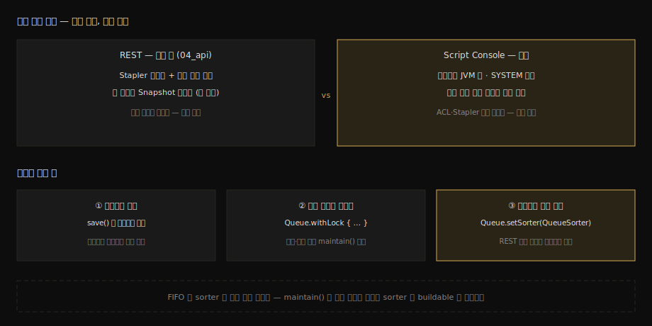

# Script Console 심화 제어

---

> 이 문서를 읽고 나면 Script Console 코드가 어떤 JVM 위치에서 어떤 권한으로 도는지 말하고, 복합 조작을 `Queue.withLock`으로 묶어야 하는 이유를 큐의 락 구조로 설명하며, REST는 물론 관리 레시피 모음에도 없는 제어 — `setSorter`로 큐 우선순위를 즉석에서 바꾸기 — 를 실습할 수 있습니다.

> **분담 안내** — Groovy로 Jenkins 내부를 *조회*하는 레시피는 [`05_operations/02-04a`](../05_operations/02-04a.Groovy로%20Jenkins%20내부%20조회하기.md), 노드 생성·executor 증감·큐 일괄 취소·크레덴셜 조회 같은 *관리 레시피 모음*은 [`05_operations/02-05a`](../05_operations/02-05a.RunListener와%20FlowExecutionListener.md) 후반부가 정본입니다. 이 문서는 레시피를 반복하지 않습니다 — 그 레시피들이 딛고 선 *엔진 규칙*과, 레시피 모음에 없는 우선순위 제어 한 가지만 다룹니다.

## 진입 — 바깥 문과 안방

> 04_api의 REST가 객체 그래프의 바깥 문이라면, Script Console은 안방입니다. 같은 객체를 만지지만 거치는 검문이 다르고, 그래서 지켜야 할 규칙도 다릅니다.

[`02-01`](02-01.Stapler%20URL%20라우팅%20스펙.md)에서 모든 REST 호출이 객체 그래프를 *바깥에서* 걸어 내려간다는 것을 봤습니다. Script Console은 그 그래프의 루트(`Jenkins.instance` — 런타임 클래스는 우리가 확인한 그 `Hudson`)를 컨트롤러 JVM *안에서* 직접 쥐는 Groovy 셸입니다. Stapler의 라우팅도, 권한 검사도, [`03-01`](03-01.Queue.Task%20라이프사이클%20소스편.md)에서 본 조회용 Snapshot도 거치지 않습니다 — 변이 중인 실물 객체를 맨손으로 만집니다.

그래서 강력하고, 같은 이유로 위험합니다. 02-04a와 02-05a의 레시피들을 복사해 쓰는 데는 아무 문제가 없지만, 레시피를 *변형*하거나 *조합*하는 순간부터는 엔진 규칙을 알아야 사고가 안 납니다. 이 문서의 본론이 그 규칙입니다.

### 이 문서의 좌표

`06` 묶음의 단독 편입니다. `05` 묶음이 확장을 *플러그인으로 패키징*하는 길이었다면, 여기는 같은 확장점을 *즉석에서, 휘발성으로* 만지는 길입니다.

## 사전 지식

> 02-04a의 Jenkins.instance 조회 패턴과 03-01의 락·Snapshot 구조를 알고 있다면, 이 문서는 그 둘을 "콘솔에서 안전하게 변이하기"라는 한 질문으로 묶은 것입니다.

## 1. 실행 환경의 정체 — 컨트롤러 JVM, SYSTEM 권한

> 콘솔 스크립트는 컨트롤러 JVM 안에서 SYSTEM 권한으로 돕니다. 권한 검사가 없다는 뜻이 아니라, 모든 검사를 통과한 신분으로 돈다는 뜻입니다.

Manage Jenkins → Script Console의 입력창에 적은 Groovy는 별도 프로세스가 아니라 *컨트롤러 JVM 그 자체*에서 실행됩니다. 실행 신분은 SYSTEM — 개별 사용자 권한이 아니라 Jenkins 내부 동작이 쓰는 최상위 신분입니다. 결과 세 가지가 따라옵니다:

1. `02-01`의 StaplerProxy 권한 길목도, Item 단위 ACL도 적용되지 않습니다. 크레덴셜 복호화 키(`01-01` §4의 `secrets/`)까지 닿는 코드가 그대로 돕니다.
2. 잘못 짠 무한 루프나 무거운 연산이 컨트롤러 스레드를 그대로 태웁니다. 격리가 없으므로 실수의 반경이 서버 전체입니다.
3. 감사 추적이 빈약합니다. 누가 어떤 스크립트를 돌렸는지는 REST 호출처럼 남지 않습니다.

이 세 가지가 "파괴적 실습은 로컬에서"라는 [`01-01`](01-01.로컬%20Docker%20Jenkins%20%2B%20소스%20디버깅%20환경.md)의 원칙이 콘솔에서 한층 더 강해지는 이유입니다. 망가지면 §7 복구 절차(컨테이너 재생성)로 돌아갑니다.

## 2. 엔진 규칙 — 레시피가 말해 주지 않는 두 가지

> 모델 변경은 메모리에 즉시 반영되지만 디스크 영속화는 save() 호출의 몫이고, 조회와 변경을 잇는 복합 조작은 withLock으로 묶어야 정합합니다.

### 2-1. 트랜잭션은 없다 — save()가 영속화의 전부

콘솔에서 `agent.setNumExecutors(4)` 같은 변경을 하면 메모리의 모델 객체는 그 즉시 바뀝니다. 그러나 [`01-01`](01-01.로컬%20Docker%20Jenkins%20%2B%20소스%20디버깅%20환경.md) §4에서 본 `JENKINS_HOME`의 XML은 자동으로 따라오지 않습니다 — 해당 객체의 `save()`를 불러야 디스크에 적힙니다. 그래서 02-05a 레시피들의 끝에 `save()`가 붙어 있는 것이고, 빠뜨리면 "분명 바꿨는데 재기동하니 원래대로"라는 미스터리가 생깁니다. 롤백도 없습니다. 절반쯤 적용하다 예외가 나면 그 절반이 그대로 남습니다 — DB 트랜잭션에 길든 직관을 여기서는 꺼야 합니다.

### 2-2. 복합 조작은 withLock — 사이에 maintain()이 끼어든다

[`03-01`](03-01.Queue.Task%20라이프사이클%20소스편.md) §4에서 본 구조를 떠올립니다. 큐의 개별 메서드(`cancel` 등)는 내부에서 스스로 락을 잡으므로 한 줄짜리 호출은 안전합니다. 문제는 *조회 → 판단 → 변경*을 잇는 복합 조작입니다. 내 스크립트의 조회와 변경 사이에 `maintain()`이 끼어들어 큐를 바꿔 버릴 수 있습니다 — 세어 봤을 때 5개였던 buildable이 취소하려는 순간 이미 실행으로 넘어갔을 수 있습니다.

이때 쓰라고 큐가 공개해 둔 것이 우리가 소스에서 확인한 정적 헬퍼 `Queue.withLock`입니다:

```groovy
import hudson.model.Queue

// 조회와 변경 사이에 maintain() 이 끼어들 수 없도록 한 락 안에서 묶는다
// 03-01 §4 의 그 ReentrantLock 을 이 블록이 쥔다
Queue.withLock {
    def q = Queue.getInstance()
    def stale = q.items.findAll { it.inQueueSince < System.currentTimeMillis() - 3600_000 }
    stale.each { q.cancel(it) }   // 판단 시점과 취소 시점의 큐가 같음을 보장
}
```

주의도 같은 자리에서 나옵니다. 이 블록이 도는 동안 큐 전이 전체가 멈추므로(03-01 실습에서 브레이크포인트로 체감한 그 정지), 블록 안에 느린 작업 — 원격 호출, 파일 IO — 을 넣으면 서버 전체의 빌드 배정이 그만큼 멈춥니다. 락 안은 짧게, 무거운 일은 락 밖에서 준비해 들어가는 것이 원칙입니다.

## 3. 우선순위 제어 — QueueSorter를 즉석에서 갈아 끼우기

> 큐 순서는 REST로 못 바꿉니다. 그러나 소스에서 확인했듯 Queue에는 public setSorter가 있고, QueueSorter는 콘솔에서 즉석 구현해 꽂을 수 있는 ExtensionPoint입니다.

`04_api` 27편을 통틀어 큐의 *순서*를 바꾸는 엔드포인트는 없습니다. 02-05a의 레시피 모음에도 없습니다. 그런데 `Queue.java` 소스에는 이렇게 적혀 있습니다 — `QueueSorter sorter` 필드와 public `getSorter()`/`setSorter(QueueSorter)`, 그리고 `maintain()`이 buildable 목록을 이 sorter로 정렬하는 호출. `QueueSorter` 자체는 `sortBuildableItems(List<BuildableItem>)` 하나만 구현하면 되는 추상 클래스이고, [`05-01`](05-01.Extension%20Point와%20Describable%20스펙.md)에서 배운 대로 `ExtensionPoint`를 구현하고 있습니다.

플러그인(Priority Sorter류)이 이 확장점을 정식으로 차지하는 방법이라면, 콘솔은 같은 자리를 *즉석에서, 재기동까지만* 차지하는 방법입니다:

```groovy
import hudson.model.Queue
import hudson.model.queue.QueueSorter

// 기본은 sorter = null (대기 시간순) — 되돌릴 때를 위해 현재 값을 적어 둔다
def before = Queue.getInstance().sorter

// 역순(LIFO) sorter — 나중에 들어온 buildable 이 먼저 배정되게 한다
// transient 필드라 재기동하면 사라지는 휘발성 교체라는 점이 플러그인과의 차이
Queue.getInstance().setSorter(new QueueSorter() {
    @Override
    void sortBuildableItems(List<Queue.BuildableItem> buildables) {
        buildables.sort { -it.inQueueSince }   // 적재 시각 내림차순 = LIFO
    }
})
```

이 한 줄의 의미를 `03` 묶음과 이어 두면 면접 재료가 됩니다. `maintain()`의 4단계(03-01 §5)에서 buildable 순회 *직전에* 이 sorter가 호출되므로, FIFO dispatch라는 기본 성질(04_api 05-04 §6-1)은 "sorter가 없을 때의 기본값"이었던 것입니다. 기본 동작과 확장점의 관계가 소스 한 줄로 정리됩니다.

안방의 위치와 규칙 셋을 한 장으로 모으면 다음과 같습니다:



## 4. 실습 기록 — 큐 순서 뒤집기

> 실행기 1개로 적체를 만들고, LIFO sorter를 꽂아 나중 빌드가 먼저 배정되는 것을 관찰한 뒤 원상 복구합니다.

### 환경

- [`01-01`](01-01.로컬%20Docker%20Jenkins%20%2B%20소스%20디버깅%20환경.md)의 `jenkins-engine`, built-in node 실행기 1 (03-01 실습 설정)
- 대상 Job: `engine-sleep` (sleep 60) — 적체를 만들 점유용 + 순서 관찰용

### 실습 1: LIFO sorter 설치와 순서 관찰

점유 빌드 1개를 걸고, 파라미터 없는 빌드 대신 식별 가능한 순서로 `engine-sleep`을 3회 연속 트리거해 buildable 적체(#2, #3, #4 후보)를 만듭니다. 콘솔에서 §3의 LIFO sorter를 설치한 뒤 점유 빌드를 중지합니다.

**결과:**

```
(sorter 설치 전 적재 순서)  #2 → #3 → #4
(점유 해제 후 실제 실행 순서)  #4 → #3 → #2   ← 나중 적재가 먼저 배정
(콘솔 확인)  Queue.getInstance().sorter  →  Script1$1@…  (익명 구현이 꽂혀 있음)
```

**분석:**

- 실행 순서가 적재 역순으로 뒤집혔습니다. `maintain()`이 배정 직전에 sorter를 부른다는 소스 독해가 동작으로 검증된 것입니다.
- 같은 Job의 연속 빌드라 동시 빌드 설정에 따라 병합·차단이 끼어들 수 있습니다(04_api 05-04 §7). 관찰이 헷갈리면 서로 다른 Job 3개로 바꿔 같은 실험을 합니다.
- 이 sorter는 `transient` 필드에 꽂힌 휘발성 교체라 재기동하면 사라집니다. 그래도 실습 직후에는 명시적으로 되돌립니다:

```groovy
// 기본 동작(대기 시간순)으로 복원 — 실습 흔적을 남기지 않는다
Queue.getInstance().setSorter(null)
```

## 면접에서 받을 만한 질문

> 콘솔은 "강한 도구를 안전하게 쓰는 법"이라는 운영 성숙도 질문으로 이어집니다. 아래 4개에 먼저 스스로 답해 보고, 자답이 끝나면 다음 절로 내려갑니다.

1. Script Console 코드와 REST 호출은 같은 객체 그래프를 만지는데, 무엇이 다릅니까? 세 가지 이상 들어 보십시오.
2. 콘솔에서 모델을 바꿨는데 재기동하니 원래대로 돌아와 있습니다. 무엇을 빠뜨린 것입니까?
3. 큐에 대한 조회·판단·변경을 잇는 스크립트는 왜 `Queue.withLock`으로 묶어야 하며, 그 블록 안에서 하지 말아야 할 일은 무엇입니까?
4. "Jenkins 큐는 FIFO"라는 명제를 QueueSorter 확장점과 연결해 더 정확하게 다시 말해 보십시오.

## 정답 (자답 후 펼치기)

> 위 §면접에서 받을 만한 질문의 4개에 *먼저 자답한 뒤* 아래를 읽으십시오. 자답 없이 먼저 읽으면 학습 효과가 0입니다.

### 정답 1 — 안방과 바깥 문의 차이

위치부터 다릅니다. REST는 Stapler 라우팅을 거쳐 바깥에서 들어오지만 콘솔은 컨트롤러 JVM 안에서 돕니다. 신분에서도 갈립니다. REST는 호출자의 권한으로 검사받지만 콘솔은 SYSTEM 신분이라 ACL·StaplerProxy 길목이 적용되지 않습니다. 읽는 대상 역시 차이가 납니다. REST의 큐 조회는 락 없는 Snapshot 복사본을 읽지만 콘솔은 변이 중인 실물 객체를 직접 만집니다. 흔적도 같지 않아, REST는 접근 로그가 남지만 콘솔 실행은 감사 추적이 빈약합니다. 강력함의 근원과 위험의 근원이 같은 목록입니다.

### 정답 2 — save() 누락

모델 변경은 메모리에 즉시 반영되지만 디스크 영속화는 자동이 아닙니다. 해당 객체의 `save()`를 호출해야 `JENKINS_HOME`의 XML로 내려가고, 재기동 시 Jenkins는 그 XML을 읽어 모델을 복원하므로 `save()` 없는 변경은 재기동과 함께 사라집니다. 트랜잭션·롤백도 없으므로, 여러 객체를 바꾸는 스크립트가 중간에 실패하면 일부만 적용된 상태가 남는다는 것까지 함께 알아야 합니다.

### 정답 3 — 끼어드는 maintain(), 그리고 락 안의 금기

큐의 개별 메서드는 자체적으로 락을 잡지만, 내 스크립트의 조회와 변경 *사이*는 보호되지 않아 그 틈에 `maintain()`이 큐를 바꿀 수 있습니다. `Queue.withLock`으로 묶으면 블록 전체가 큐의 단일 ReentrantLock을 쥐므로 판단 시점과 변경 시점의 큐가 같음이 보장됩니다. 대가는 그 시간 동안 큐 전이 전체가 멈춘다는 것이라, 블록 안에서 원격 호출·파일 IO 같은 느린 작업을 하면 서버 전체의 빌드 배정이 함께 멈춥니다. 락 안은 메모리 조작만, 짧게가 원칙입니다.

### 정답 4 — FIFO는 기본값이지 법칙이 아니다

정확한 명제는 "큐의 buildable dispatch는 sorter가 없을 때 대기 시간순(FIFO)이며, 그 순서는 QueueSorter 확장점으로 교체 가능하다"입니다. `maintain()`은 배정 직전에 설치된 sorter로 buildable 목록을 정렬하고, `Queue.setSorter`가 public이므로 플러그인(정식)이든 콘솔(휘발성)이든 이 자리를 차지할 수 있습니다. Priority Sorter류 플러그인이 하는 일의 정체가 바로 이 확장점 점유입니다.

## 관련 문서

> 이 문서는 레시피 정본 두 편의 아래층(엔진 규칙)을 채우고, 큐 락 구조와 확장 계약을 콘솔이라는 현장에서 재회시켰습니다.

- [05_operations 02-04a. Groovy로 Jenkins 내부 조회하기](../05_operations/02-04a.Groovy로%20Jenkins%20내부%20조회하기.md) — 조회 레시피 정본, 이 문서의 사전 지식
- [05_operations 02-05a. RunListener와 FlowExecutionListener](../05_operations/02-05a.RunListener와%20FlowExecutionListener.md) — 노드·큐·크레덴셜 관리 레시피 모음 정본
- [03-01. Queue.Task 라이프사이클 소스편](03-01.Queue.Task%20라이프사이클%20소스편.md) § "4. 단일 락과 Snapshot" — withLock이 쥐는 그 락의 구조
- [05-01. Extension Point와 Describable 스펙](05-01.Extension%20Point와%20Describable%20스펙.md) — QueueSorter가 구현하는 확장 계약
