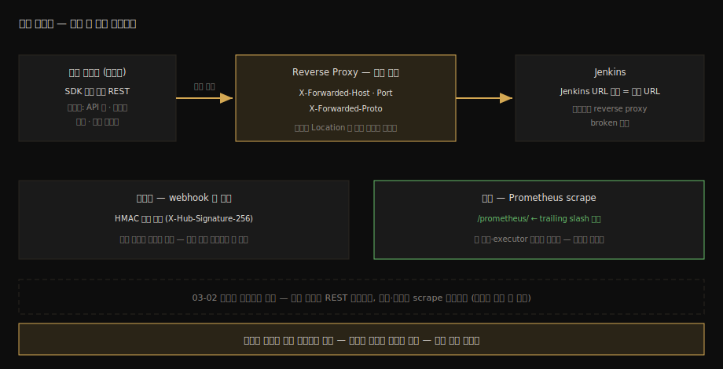

# 외부 SDK와 통합 아키텍처

---

> 이 문서를 읽고 나면 클라이언트 라이브러리와 직접 REST 사이의 선택 기준을 의존성 수명 관점으로 말하고, 프록시 뒤의 Jenkins가 `X-Forwarded-*` 헤더로 자기 URL을 재구성하는 계약을 설명하며, webhook 역방향 신뢰와 Prometheus 메트릭 노출까지 통합 아키텍처의 네 모서리를 그릴 수 있습니다.

> **분담 안내** — webhook 수신 설정과 연동 자체는 [`05_operations/02-06a`](../05_operations/02-06a.Webhook과%20외부%20연동.md), TLS 인증서 운영은 [`04_api/08-03`](../04_api/08-03.SSL%20적용과%20인증서%20관리.md)이 정본입니다. 이 문서는 그 부품들을 *호출자 아키텍처*의 시야로 묶습니다 — 무엇으로 호출하고, 중간의 프록시가 무엇을 보장해야 하고, 역방향 신뢰와 관측은 어떻게 세우는가.

## 진입 — 호출 한 발의 양옆을 보기

> 04_api는 "Jenkins에 무엇을 보낼까"를 다뤘습니다. 실제 통합에서는 그 양옆이 더 자주 문제가 됩니다 — 보내는 쪽의 코드(SDK냐 직접이냐)와, 중간에 선 프록시가 깨뜨리는 것들.

외부 시스템이 Jenkins와 통합될 때 트래픽은 네 방향으로 흐릅니다. 우리가 Jenkins를 호출하는 정방향, SCM·외부 시스템이 Jenkins를 찌르는 역방향(webhook), 그 둘 사이에 끼는 reverse proxy, 그리고 상태를 끌어가는 관측(metrics)입니다. `04_api`가 정방향의 *내용*을 끝냈으니, 이 문서는 네 방향의 *구조*를 마저 채웁니다.

이 시야가 필요해지는 순간은 명확합니다. 로컬에서 멀쩡하던 자동화가 운영의 프록시 뒤에서 `Location` 헤더가 깨져 동작하지 않을 때, 잘 돌던 클라이언트 라이브러리가 Jenkins 버전업 한 번에 멈출 때 — 전부 호출 한 발의 양옆에서 터지는 문제들입니다.

네 방향의 지형을 한 장으로 먼저 깔아 둡니다:



### 이 문서의 좌표

`07` 묶음의 단독 편이자 엔진 묶음의 마지막 본편입니다. 엔진 내부(02~04)·확장(05)·제어(06)를 지나, 다시 바깥 — 그러나 이번에는 구조를 아는 호출자의 바깥 — 으로 나옵니다.

## 사전 지식

> 04_api의 인증(토큰)과 빌드 트리거 응답(201 + Location), 그리고 02-01에서 본 그 Location의 출생지(sendRedirect)를 알고 있다면, 이 문서의 프록시 절이 정확히 그 지식 위에 얹힙니다.

## 1. SDK인가 직접 REST인가 — 의존성 수명으로 판단하기

> 클라이언트 라이브러리는 작성 비용을 줄여 주지만, Jenkins라는 빠르게 움직이는 대상을 따라가지 못하면 그 자체가 기술 부채가 됩니다. 판단축은 기능 폭이 아니라 유지 활동입니다.

자바 진영에서 이름이 알려진 선택지 둘의 유지 상태를 저장소에서 직접 확인하면 이렇습니다(2026-06 GitHub 기준):

| 선택지 | 마지막 커밋 활동 | 함의 |
|--------|----------------|------|
| `jenkinsci/java-client-api` | 2022-12 이후 멈춤 | 이후의 Jenkins 인증·API 변화를 라이브러리가 따라가지 않음 |
| `cdancy/jenkins-rest` | 2026-01 활동 | 유지되고 있으나 외부 개인 저장소 의존이라는 수명 리스크는 동일 구조 |
| 직접 REST (HTTP 클라이언트) | 해당 없음 | 추종 책임이 전부 우리 코드로 — 대신 의존성 수명 리스크 0 |

판단 기준을 세 줄로 정리할 수 있습니다:

1. 필요한 API의 폭 — 트리거·큐 추적·로그 적재처럼 *좁고 깊은* 사용이면 직접 REST의 작성 비용이 작습니다. 수십 종의 리소스를 폭넓게 다루면 라이브러리의 모델링이 값을 합니다.
2. 의존성 수명 리스크 — Jenkins의 인증·엔드포인트는 계속 변합니다(crumb 정책, Blue Ocean 폐기 등 `04_api`에서 본 역사 그대로). 라이브러리가 멈추면 그 변화를 우리가 라이브러리 *밖에서* 우회해야 하는 이중 부담이 생깁니다.
3. 에러·인증 처리의 일관성 — 회사 스택에 표준 HTTP 클라이언트와 재시도·로깅 규약이 이미 있다면, 라이브러리는 그 규약 밖의 섬이 됩니다.

TPS가 직접 REST를 택한 구조를 이 기준으로 읽으면 자연스럽습니다 — 필요한 엔드포인트가 좁고(트리거·큐·executor 조회·로그), 인증과 에러 처리를 자기 스택으로 통제해야 했기 때문입니다. 어느 쪽이 정답이라는 말이 아니라, 세 기준의 답이 선택을 만든다는 것이 이 절의 결론입니다.

## 2. Reverse Proxy 계약 — X-Forwarded 헤더 세 개

> 프록시 뒤의 Jenkins는 자기가 어떤 주소로 불리는지 모릅니다. X-Forwarded-Host·Port·Proto가 그걸 알려 주는 계약이고, 어기면 우리가 아는 그 Location 헤더부터 깨집니다.

[`02-01`](02-01.Stapler%20URL%20라우팅%20스펙.md) §3-3에서 `201 Created`의 `Location` 헤더가 `sendRedirect`로 만들어지는 것을 봤습니다. 그 리다이렉트 URL을 Jenkins는 *자기가 아는 자기 주소*로 짓습니다. 프록시 뒤에서는 이 자기 인식이 어긋납니다 — 클라이언트는 `https://jenkins.example.com`으로 불렀는데 Jenkins 자신은 `http://127.0.0.1:8080`으로 알고 있는 상태입니다.

공식 문서가 제시하는 해법은 둘 중 하나입니다(출처: jenkins.io/doc/book/system-administration/reverse-proxy-configuration-troubleshooting):

1. 프록시가 응답의 `Location` 헤더를 되돌아가며 재작성하거나,
2. 프록시가 요청에 `X-Forwarded-Host`·`X-Forwarded-Port`를 실어 보내고, Jenkins가 이를 읽어 리다이렉트·링크 생성에 쓰게 하거나. 프로토콜이 바뀌는 구성(밖은 HTTPS, 안은 HTTP)이면 `X-Forwarded-Proto`도 필수입니다.

여기에 전제 하나가 더 깔립니다 — System 설정의 Jenkins URL이 실제 접근 URL과 일치해야 하며, 어긋나면 Manage Jenkins 화면에 "It appears that your reverse proxy setup is broken" 경고가 뜹니다(출처: 같은 문서). 공식 nginx 예시가 `Host`·`X-Real-IP`·`X-Forwarded-For`·`X-Forwarded-Proto`를 세트로 싣고 websocket 에이전트용 `Upgrade`/`Connection` 헤더까지 챙기는 이유가 이 계약의 이행입니다.

호출자 관점의 체크리스트로 줄이면 이렇습니다:

- 트리거 응답의 `Location`이 내부 주소(`http://…:8080/…`)로 오면 → 프록시의 X-Forwarded 헤더 누락 또는 Jenkins URL 불일치부터 봅니다.
- 같은 증상이 로그인 리다이렉트·webhook 콜백 URL에서도 납니다 — 한 계약의 위반이 여러 얼굴로 나타나는 것입니다.

## 3. 역방향 신뢰 — webhook 서명 검증

> 정방향 인증은 우리 토큰이 책임지지만, 역방향(외부가 우리를 찌르는 쪽)의 신뢰는 공유 비밀 서명으로 세웁니다. 받은 본문을 같은 비밀로 다시 서명해 비교하는 구조입니다.

우리가 Jenkins를 부를 때의 신뢰는 `04_api/03-*`의 토큰이 책임집니다. 방향이 뒤집히면 — SCM이 Jenkins의 webhook 엔드포인트를 찌르거나, Jenkins가 외부 시스템의 콜백을 찌를 때 — 받는 쪽은 "이 요청이 정말 그쪽에서 왔는가"를 따로 세워야 합니다.

표준 패턴이 HMAC 서명입니다. 송신자와 수신자가 비밀 키를 공유하고, 송신자는 요청 본문을 키로 HMAC 서명해 헤더에 싣습니다(GitHub webhook의 `X-Hub-Signature-256`이 대표적인 실물). 수신자는 받은 본문을 같은 키로 다시 서명해 헤더 값과 비교합니다. 비교 시에는 타이밍 차이로 정보가 새지 않는 상수 시간 비교를 쓰는 것까지가 한 세트입니다 — `02-01`에서 본 crumb 검증 코드가 `MessageDigest.isEqual`을 쓰던 것과 같은 이유입니다.

이 구조의 함의는 두 가지입니다. 첫째, 서명은 *본문*에 걸리므로 프록시가 본문을 건드리면(압축 재인코딩 등) 검증이 깨집니다 — §2의 프록시 계약과 만나는 지점입니다. 둘째, 비밀 키의 보관처가 곧 신뢰의 뿌리이므로, Jenkins 쪽에서는 `04_api/08-*`의 크레덴셜 체계가 그 보관처가 됩니다. 수신 설정의 실제 절차는 [`05_operations/02-06a`](../05_operations/02-06a.Webhook과%20외부%20연동.md)로 위임합니다.

## 4. 관측 — Prometheus가 끌어가는 메트릭

> 폴링으로 상태를 묻는 대신, 메트릭 엔드포인트를 열어 두면 관측 시스템이 주기적으로 긁어 갑니다. prometheus 플러그인의 기본 자리는 /prometheus/ 이고, 끝의 슬래시까지가 주소입니다.

`04_api/09-02`의 health check(ping)가 "살아 있는가"라는 한 비트의 답이라면, 메트릭은 시계열입니다 — 큐 길이, executor 사용률, 빌드 소요의 흐름을 숫자로 노출합니다. prometheus 플러그인을 설치하면 Jenkins가 기본 `/prometheus/` 엔드포인트로 메트릭을 노출하고, Prometheus 서버가 이를 주기적으로 scrape합니다(출처: github.com/jenkinsci/prometheus-plugin README). 같은 출처가 짚는 함정 하나 — scrape 대상 주소는 *trailing slash까지* `/prometheus/`로 맞춰야 합니다.

이 노출이 엔진 묶음과 만나는 지점이 [`03-02`](03-02.Executor%20배정%20알고리즘과%20TPS%20대조.md)의 적재량 게이트입니다. 게이트의 판단 입력을 매번 REST 폴링(`/queue/api/json`·`/computer/api/json`)으로 묻는 대신, 이미 Prometheus가 긁어 둔 큐·executor 시계열을 쓰는 구성도 가능합니다. 폴링은 판단 시점의 정확한 값을, scrape는 추세와 알림(적체 경보)을 주는 — 용도가 다른 두 채널로 이해하면 됩니다.

### 실습 기록 — 메트릭 엔드포인트 열어 보기

[`05-02`](05-02.첫%20플러그인%20제작%20%28Maven%20HPI%29.md) §5의 설치 절차로 본 컨테이너에 prometheus 플러그인을 설치한 뒤 긁어 봅니다:

```bash
# trailing slash 까지가 주소다 — 빠뜨리면 scrape 도구가 실패한다
curl -s -u "${JENKINS_USER}:${API_TOKEN}" "${JENKINS_URL}/prometheus/" | head -20
```

**결과:**

```
# HELP default_jenkins_queue_size_value …
# TYPE default_jenkins_queue_size_value gauge
default_jenkins_queue_size_value 0.0
default_jenkins_executors_available …
…
```

**분석:**

- 출력 형식이 Prometheus exposition 포맷(HELP/TYPE 주석 + 이름 값)입니다. 큐 크기·executor 가용 수가 곧바로 보입니다 — `03` 묶음에서 디버거로 들여다본 그 상태들이 시계열 이름을 달고 나오는 셈입니다.
- 메트릭 이름의 접두사·구성은 플러그인 설정과 버전에 따라 다를 수 있으므로, 정확한 목록은 자기 환경의 출력에서 확인합니다.

## 면접에서 받을 만한 질문

> 통합 아키텍처는 "외부 시스템과 CI를 묶어 본 경험"을 검증하는 단골 주제입니다. 아래 4개에 먼저 스스로 답해 보고, 자답이 끝나면 다음 절로 내려갑니다.

1. Jenkins 연동에서 클라이언트 라이브러리 대신 직접 REST를 택할 수 있는 판단 기준을 세 가지 들어 보십시오.
2. 프록시 뒤의 Jenkins에서 빌드 트리거 응답의 `Location`이 내부 주소로 나옵니다. 원인 후보와 해법의 두 갈래를 설명해 보십시오.
3. webhook의 HMAC 서명 검증은 어떤 구조이며, 왜 상수 시간 비교까지가 한 세트입니까?
4. 적재량 게이트의 입력으로 REST 폴링과 Prometheus scrape는 각각 무엇에 적합합니까?

## 정답 (자답 후 펼치기)

> 위 §면접에서 받을 만한 질문의 4개에 *먼저 자답한 뒤* 아래를 읽으십시오. 자답 없이 먼저 읽으면 학습 효과가 0입니다.

### 정답 1 — 폭, 수명, 일관성

첫째, 필요한 API의 폭 — 트리거·큐·로그처럼 좁고 깊으면 직접 작성 비용이 작고, 폭넓으면 라이브러리의 모델링이 값을 합니다. 둘째, 의존성 수명 리스크 — Jenkins의 인증·엔드포인트는 계속 변하는데 라이브러리가 멈추면(java-client-api는 2022-12 이후 커밋이 멈춰 있습니다) 변화 추종을 라이브러리 밖에서 우회해야 하는 이중 부담이 생깁니다. 셋째, 처리 일관성 — 사내 표준 HTTP 클라이언트·재시도·로깅 규약이 있으면 라이브러리는 그 규약 밖의 섬이 됩니다. 세 기준의 답이 곧 선택입니다.

### 정답 2 — 자기 인식의 어긋남

원인은 Jenkins가 리다이렉트 URL을 자기가 아는 자기 주소로 짓는데, 프록시 뒤에서는 그 인식(내부 주소)이 외부 접근 주소와 어긋나기 때문입니다. 해법은 두 갈래입니다 — 프록시가 응답의 `Location`을 재작성하거나, 요청에 `X-Forwarded-Host`·`X-Forwarded-Port`(프로토콜이 바뀌면 `X-Forwarded-Proto`까지)를 실어 Jenkins가 그 값으로 URL을 재구성하게 하거나. 전제로 System 설정의 Jenkins URL이 접근 URL과 일치해야 하며, 어긋나면 "reverse proxy setup is broken" 경고가 뜹니다.

### 정답 3 — 본문 재서명 비교

송신자가 공유 비밀로 요청 본문을 HMAC 서명해 헤더(GitHub의 `X-Hub-Signature-256` 등)에 싣고, 수신자가 같은 비밀로 받은 본문을 다시 서명해 헤더 값과 비교하는 구조입니다. 비교를 일반 문자열 비교로 하면 일치 길이에 따라 응답 시간이 미세하게 달라져 서명을 한 바이트씩 맞춰 가는 타이밍 공격이 가능하므로, 상수 시간 비교까지 해야 검증이 완성됩니다. 서명이 본문에 걸리므로 중간 프록시가 본문을 변형하면 검증이 깨진다는 점도 같은 구조에서 나오는 함의입니다.

### 정답 4 — 시점의 정확성과 추세

REST 폴링은 판단 시점의 정확한 현재 값을 줍니다 — "지금 던져도 되는가"라는 게이트의 실시간 결정에 적합합니다. Prometheus scrape는 주기 수집된 시계열을 줍니다 — 적체의 추세, 시간대별 패턴, 임계 초과 알림에 적합합니다. 게이트의 즉시 판단은 폴링으로, 게이트 정책(quota 값 자체)의 조정과 적체 경보는 시계열로 — 두 채널을 용도로 가르는 것이 답입니다.

## 관련 문서

> 엔진 묶음의 마지막 본편입니다. 정방향 호출의 정본들과 역방향·관측의 정본으로 갈라져 나가고, 점검 문서가 묶음 전체를 닫습니다.

- [04_api 02-02. REST API 구조와 연동](../04_api/02-02.REST%20API%20구조와%20연동.md) — 정방향 호출 구조의 정본
- [05_operations 02-06a. Webhook과 외부 연동](../05_operations/02-06a.Webhook과%20외부%20연동.md) — 역방향 수신 설정의 정본
- [04_api 08-03. SSL 적용과 인증서 관리](../04_api/08-03.SSL%20적용과%20인증서%20관리.md) — 프록시 TLS 종단의 인증서 운영 정본
- [03-02. Executor 배정 알고리즘과 TPS 대조](03-02.Executor%20배정%20알고리즘과%20TPS%20대조.md) § "4. TPS 대조" — 메트릭·폴링이 입력이 되는 적재량 게이트
