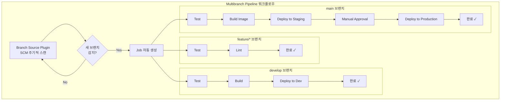
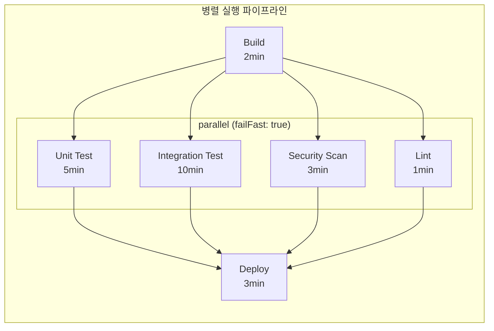
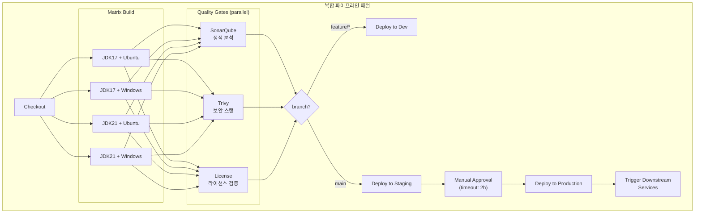

# Ch04. Pipeline Patterns

---

> **핵심 질문**: "브랜치마다 다른 파이프라인을 실행하려면 어떻게 설계하는가?"

실무에서 파이프라인은 단순히 "빌드 → 테스트 → 배포"로 끝나지 않는다. feature 브랜치에서는 테스트만 실행하고, main 브랜치에서는 프로덕션 배포까지 진행해야 하며, 릴리스 태그가 붙으면 아티팩트를 레지스트리에 퍼블리시해야 한다. 이 장에서는 이런 복잡한 요구사항을 Declarative Pipeline 문법으로 표현하는 패턴들을 다룬다. Multibranch Pipeline, 파라미터화 빌드, 조건부 실행, 병렬 실행, 승인 게이트, 그리고 이들을 조합하는 고급 패턴까지 살펴본다.

## 1. Multibranch Pipeline

Multibranch Pipeline은 저장소의 모든 브랜치를 자동으로 감지하여 각 브랜치별로 독립적인 파이프라인 Job을 생성하는 Jenkins의 Job 유형이다. 

- 일반 Pipeline Job은 하나의 브랜치(또는 고정된 SCM 설정)에 대해 단일 Job을 생성하지만, Multibranch Pipeline은 저장소 전체를 스캔하여 `Jenkinsfile`이 존재하는 모든 브랜치에 대해 자동으로 Job을 만들어낸다.
- 이 방식이 중요한 이유는 개발팀이 Git Flow나 GitHub Flow 같은 브랜치 전략을 사용할 때, 새 브랜치를 만들 때마다 수동으로 Jenkins Job을 생성할 필요가 없어지기 때문이다. 개발자가 `feature/login` 브랜치를 push하면 Jenkins가 자동으로 해당 브랜치의 파이프라인을 생성하고 실행한다.

### 동작 원리

Multibranch Pipeline의 핵심은 **Branch Source Plugin**이다. 이 플러그인은 주기적으로(기본 1분 간격) SCM을 스캔하여 브랜치 목록을 갱신한다. 동작 과정은 다음과 같다.

1. **SCM 스캔**: Branch Source Plugin이 설정된 저장소를 스캔하여 모든 브랜치와 PR을 탐색한다.
2. **Jenkinsfile 탐색**: 각 브랜치의 루트(또는 지정된 경로)에서 `Jenkinsfile`을 찾는다.
3. **Job 자동 생성**: `Jenkinsfile`이 존재하는 브랜치마다 하위 Job을 자동으로 생성한다.
4. **Job 자동 삭제**: 브랜치가 삭제되면 해당 Job도 자동으로 정리된다(Orphaned Item Strategy 설정에 따라).

이 자동화가 의미 있는 이유는 팀 규모가 커질수록 동시에 활성화되는 브랜치 수가 수십 개에 달하기 때문이다. 수동으로 Job을 관리하면 누락이나 설정 불일치가 발생하지만, Multibranch Pipeline은 모든 브랜치가 동일한 `Jenkinsfile`을 기반으로 일관된 파이프라인을 실행하도록 보장한다.

### PR 빌드

Multibranch Pipeline은 Pull Request가 생성되면 자동으로 빌드를 실행한다. GitHub Branch Source Plugin이나 GitLab Branch Source Plugin을 사용하면 PR이 열릴 때 해당 PR의 소스 브랜치를 타겟 브랜치에 머지한 상태로 빌드를 수행한다. 이렇게 하는 이유는 "이 PR이 머지되면 빌드가 깨지는가?"를 머지 전에 확인하기 위해서다.

빌드 결과는 GitHub/GitLab의 PR 페이지에 상태 체크로 표시되므로, 코드 리뷰어가 빌드 성공 여부를 즉시 확인할 수 있다. 이를 통해 "빌드가 깨진 코드를 머지하는 실수"를 구조적으로 방지할 수 있다.

### 브랜치별 다른 동작

같은 `Jenkinsfile`이라도 브랜치에 따라 다른 동작을 수행해야 하는 경우가 많다. 예를 들어 feature 브랜치에서는 테스트만 실행하고, main 브랜치에서는 Docker 이미지 빌드와 프로덕션 배포까지 수행해야 한다. 이를 `when { branch }` 지시어로 제어한다.

```groovy
pipeline {
    agent any
    stages {
        stage('Test') {
            steps {
                sh './gradlew test'
            }
        }
        stage('Build Image') {
            when { branch 'main' }
            steps {
                sh 'docker build -t myapp:${BUILD_NUMBER} .'
            }
        }
        stage('Deploy to Production') {
            when { branch 'main' }
            steps {
                sh './deploy.sh production'
            }
        }
    }
}
```

이 구조에서 `Test` 스테이지는 모든 브랜치에서 실행되지만, `Build Image`와 `Deploy to Production`은 main 브랜치에서만 실행된다. feature 브랜치에서는 테스트 통과 여부만 확인하고 끝나므로 불필요한 배포 시도가 발생하지 않는다.



위 다이어그램에서 핵심은 **하나의 Jenkinsfile로 브랜치마다 다른 스테이지를 실행**한다는 점이다. Branch Source Plugin이 저장소를 스캔하여 각 브랜치를 감지하고, 동일한 Jenkinsfile 내의 `when` 조건에 따라 feature 브랜치는 테스트/린트만, develop은 Dev 환경 배포까지, main은 프로덕션 배포까지 수행한다.

## 2. 파라미터화 빌드

### parameters {} 블록

파라미터화 빌드는 파이프라인 실행 시 사용자로부터 입력을 받아 동적으로 동작을 변경하는 패턴이다. 이 기능이 필요한 이유는 동일한 파이프라인을 다양한 환경이나 설정으로 실행해야 하는 상황이 빈번하기 때문이다. 배포 환경(dev/staging/prod) 선택, 특정 버전의 이미지 태그 지정, 테스트 스킵 여부 등을 파라미터로 제어할 수 있다.

```groovy
pipeline {
    agent any
    parameters {
        choice(name: 'DEPLOY_ENV'
               , choices: ['dev', 'staging', 'prod']
               , description: '배포할 환경을 선택하세요'
        )
        booleanParam(name: 'SKIP_TESTS'
                     , defaultValue: false
                     , description: '긴급 배포 시 테스트를 건너뜁니다'
        )
        string(name: 'IMAGE_TAG'
               			 , defaultValue: 'latest'
               			 , description: '배포할 Docker 이미지 태그'
        )
        text(name: 'RELEASE_NOTES'
             				 , defaultValue: ''
             				 , description: '릴리스 노트 (여러 줄 입력 가능)'
        )
    }
    stages {
        stage('Test') {
            when {
                expression { return !params.SKIP_TESTS }
            }
            steps {
                sh './gradlew test'
            }
        }
        stage('Deploy') {
            steps {
                sh "deploy.sh --env ${params.DEPLOY_ENV} --tag ${params.IMAGE_TAG}"
            }
        }
    }
}
```

- Jenkins는 `choice`, `booleanParam`, `string`, `text` 네 가지 기본 파라미터 타입을 제공한다. 
- `choice`는 드롭다운 선택으로 사용자가 미리 정의된 옵션 중 하나를 고르게 하여 오타를 방지한다. 
- `booleanParam`은 체크박스로 on/off 토글에 적합하다.
- `string`은 단일 행 텍스트 입력이고, `text`는 여러 줄 입력이 가능하여 릴리스 노트 같은 긴 텍스트에 사용한다.

파라미터화 빌드에서 주의할 점은 **첫 번째 실행에서는 파라미터가 적용되지 않는다**는 것이다. Jenkins는 파이프라인을 최초 실행할 때 `Jenkinsfile`을 파싱하여 파라미터 정의를 인식하므로, 첫 실행은 기본값으로 수행되고 두 번째 실행부터 "Build with Parameters" 버튼이 활성화된다.

### 실무 활용 패턴

프로덕션 배포에서 `DEPLOY_ENV`를 `prod`로 선택하면 추가 승인 단계를 요구하고, `dev`에서는 바로 배포하는 식으로 파라미터와 조건부 실행을 조합하는 것이 일반적이다. 또한 핫픽스 상황에서 `SKIP_TESTS`를 `true`로 설정하여 빠르게 배포하되, 이 옵션이 남용되지 않도록 알림을 보내는 것이 좋은 관행이다.

## 3. 조건부 실행

### when {} 블록의 종류

`when` 지시어는 스테이지의 실행 여부를 결정하는 조건을 정의한다. 파이프라인의 유연성을 높이는 핵심 도구이며, 다양한 조건 타입을 제공한다.

| 조건              | 설명                      | 사용 시나리오                |
| ----------------- | ------------------------- | ---------------------------- |
| `branch`          | 특정 브랜치에서만 실행    | main에서만 배포              |
| `tag`             | 특정 태그 패턴일 때 실행  | `v*` 태그에서 릴리스         |
| `environment`     | 환경 변수 값 비교         | `DEPLOY_ENV == 'prod'`일 때  |
| `expression`      | Groovy 표현식 평가        | 복잡한 조건 조합             |
| `changeset`       | 특정 파일 변경 시 실행    | `**/*.java` 변경 시에만 빌드 |
| `triggeredBy`     | 특정 트리거로 실행된 경우 | cron 트리거 시에만           |
| `allOf` / `anyOf` | 조건 조합 (AND/OR)        | 복합 조건                    |

### 실전 패턴

```groovy
pipeline {
    agent any
    stages {
        // 패턴 1: main 브랜치에서만 배포
        stage('Deploy') {
            when { branch 'main' }
            steps { sh './deploy.sh' }
        }

        // 패턴 2: 태그 푸시 시 릴리스 생성
        stage('Release') {
            when { tag pattern: "v\\d+\\.\\d+\\.\\d+", comparator: "REGEXP" }
            steps { sh './release.sh ${TAG_NAME}' }
        }

        // 패턴 3: 특정 파일 변경 시에만 빌드
        stage('Build Backend') {
            when { changeset "backend/**" }
            steps { sh 'cd backend && ./gradlew build' }
        }

        // 패턴 4: 복합 조건 - main이면서 테스트 스킵이 아닌 경우
        stage('Integration Test') {
            when {
                allOf {
                    branch 'main'
                    expression { return !params.SKIP_TESTS }
                }
            }
            steps { sh './gradlew integrationTest' }
        }

        // 패턴 5: beforeAgent 옵션으로 에이전트 할당 전 조건 평가
        stage('Heavy Build') {
            when {
                beforeAgent true
                branch 'release/*'
            }
            agent { label 'gpu-node' }
            steps { sh './heavy-build.sh' }
        }
    }
}
```

- `beforeAgent true`가 중요한 이유는 기본적으로 `when` 조건은 에이전트가 할당된 후에 평가되기 때문이다. GPU 노드처럼 비싼 리소스를 사용하는 스테이지에서는 에이전트 할당 전에 조건을 평가하여 불필요한 리소스 점유를 방지해야 한다.
- `changeset`은 모노레포에서 특히 유용하다. 백엔드 코드만 변경됐는데 프론트엔드 빌드까지 실행하면 시간과 리소스가 낭비되므로, 변경된 파일 경로를 기준으로 필요한 스테이지만 실행할 수 있다.

------

## 4. 병렬 실행

### parallel {} 블록

병렬 실행은 독립적인 작업을 동시에 수행하여 전체 파이프라인 소요 시간을 단축하는 패턴이다. 단위 테스트, 통합 테스트, 보안 스캔처럼 서로 의존성이 없는 작업은 순차적으로 실행할 이유가 없다. 순차 실행 시 각각 5분, 10분, 3분이 걸린다면 총 18분이지만, 병렬로 실행하면 가장 오래 걸리는 10분 만에 완료된다.

```groovy
pipeline {
    agent any
    stages {
        stage('Build') {
            steps {
                sh './gradlew assemble'
            }
        }
        stage('Tests') {
            failFast true
            parallel {
                stage('Unit Test') {
                    steps {
                        sh './gradlew test'
                    }
                }
                stage('Integration Test') {
                    agent { label 'docker' }
                    steps {
                        sh './gradlew integrationTest'
                    }
                }
                stage('Security Scan') {
                    steps {
                        sh 'trivy image myapp:${BUILD_NUMBER}'
                    }
                }
                stage('Lint') {
                    steps {
                        sh './gradlew checkstyleMain'
                    }
                }
            }
        }
        stage('Deploy') {
            steps {
                sh './deploy.sh'
            }
        }
    }
}
```

### failFast 전략

`failFast true`는 병렬 스테이지 중 하나라도 실패하면 나머지 실행 중인 스테이지를 즉시 중단하는 옵션이다. 이 옵션을 사용하는 이유는 빠른 피드백을 위해서다. 단위 테스트가 1분 만에 실패했는데 10분짜리 통합 테스트가 끝날 때까지 기다리는 것은 리소스 낭비이기 때문이다.

다만, 모든 실패를 한 번에 확인하고 싶은 경우에는 `failFast false`(기본값)를 사용한다. 예를 들어 린트 오류와 테스트 실패를 동시에 확인하여 한 번의 수정으로 모든 문제를 해결하려는 상황에서 유용하다.



위 다이어그램은 Build가 완료된 후 네 가지 검증 작업이 동시에 시작되고, 모두 완료된 후에야 Deploy가 실행되는 흐름을 보여준다. 순차 실행이었다면 총 21분(2+5+10+3+1+3)이 걸렸을 것이지만, 병렬 실행으로 15분(2+10+3)으로 단축된다. 가장 오래 걸리는 Integration Test(10분)가 전체 병렬 구간의 소요 시간을 결정한다.

### 병렬 실행 시 주의사항

병렬 스테이지에서 동일한 워크스페이스를 공유하면 파일 충돌이 발생할 수 있다. 예를 들어 두 스테이지가 동시에 같은 파일에 쓰면 레이스 컨디션이 생긴다. 이를 방지하려면 각 병렬 스테이지에 별도의 `agent`를 지정하거나, `dir()` 블록으로 작업 디렉토리를 분리해야 한다.

## 5. Input/Approval Gate

### input 스텝

`input` 스텝은 파이프라인 실행을 일시 중지하고 사용자의 수동 승인을 기다리는 메커니즘이다. 이 패턴이 필요한 이유는 프로덕션 배포처럼 되돌리기 어려운 작업 전에 사람의 판단을 개입시켜 실수를 방지하기 위해서다. 자동화와 수동 검증의 균형점이라고 할 수 있다.

### 프로덕션 배포 전 확인 패턴

가장 일반적인 패턴은 스테이징 환경에 배포하고 QA 팀이 검증한 후, 승인 버튼을 눌러야 프로덕션에 배포되는 흐름이다.

```groovy
pipeline {
    agent any
    stages {
        stage('Build & Test') {
            steps {
                sh './gradlew build test'
            }
        }
        stage('Deploy to Staging') {
            steps {
                sh './deploy.sh staging'
                echo 'Staging URL: https://staging.example.com'
            }
        }
        stage('Approval') {
            steps {
                timeout(time: 2, unit: 'HOURS') {
                    input(
                        message: '프로덕션 배포를 승인하시겠습니까?',
                        ok: '배포 승인',
                        submitter: 'devops-team,tech-lead',
                        parameters: [
                            string(name: 'APPROVAL_REASON',
                                   description: '승인 사유를 입력하세요')
                        ]
                    )
                }
            }
        }
        stage('Deploy to Production') {
            steps {
                sh './deploy.sh production'
            }
        }
    }
}
```

- `timeout`이 중요한 이유는 승인 없이 방치된 빌드가 에이전트를 점유하여 다른 빌드를 블로킹하는 상황을 방지하기 위해서다. 2시간 안에 승인이 없으면 파이프라인이 자동으로 실패 처리된다.
- `submitter`는 승인 권한이 있는 사용자나 그룹을 제한한다. 아무나 프로덕션 배포를 승인할 수 없도록 권한을 통제하는 것이 보안상 중요하다.

### 에이전트 점유 방지 패턴

`input`을 스테이지 내부의 `steps`에 넣으면 에이전트가 대기 시간 동안 점유된다. 이를 피하려면 `input`을 `stage` 레벨에서 사용하는 것이 좋다.

```groovy
stage('Approval') {
    agent none  // 에이전트를 할당하지 않아 리소스 점유 방지
    steps {
        input message: '프로덕션 배포를 승인하시겠습니까?'
    }
}
```

- `agent none`을 지정하면 이 스테이지는 에이전트 없이 Jenkins 컨트롤러에서 대기하므로, 빌드 에이전트 슬롯을 차지하지 않는다.

## 6. 고급 패턴 조합

### Matrix 빌드

Matrix 빌드는 여러 축(axis)의 조합으로 테스트를 실행하는 패턴이다. Java 라이브러리를 개발할 때 JDK 11/17/21과 Ubuntu/Windows에서 모두 동작하는지 확인해야 하는 경우, 수동으로 6개의 스테이지를 작성하는 대신 Matrix로 선언하면 Jenkins가 자동으로 조합을 생성한다.

```groovy
pipeline {
    agent none
    stages {
        stage('Test Matrix') {
            matrix {
                axes {
                    axis {
                        name 'JDK_VERSION'
                        values '11', '17', '21'
                    }
                    axis {
                        name 'OS'
                        values 'ubuntu', 'windows'
                    }
                }
                excludes {
                    exclude {
                        axis { name 'JDK_VERSION'; values '11' }
                        axis { name 'OS'; values 'windows' }
                    }
                }
                agent { label "${OS} && jdk-${JDK_VERSION}" }
                stages {
                    stage('Build & Test') {
                        steps {
                            sh './gradlew test'
                        }
                    }
                }
            }
        }
    }
}
```

- `excludes`를 사용하면 특정 조합을 제외할 수 있다. 위 예시에서는 JDK 11 + Windows 조합을 제외하여 지원 종료된 환경에서의 불필요한 테스트를 건너뛴다. 
- Matrix의 각 셀은 자동으로 병렬 실행되므로, 6개 조합(제외 1개 = 5개)이 동시에 수행되어 시간을 절약한다.

### Upstream/Downstream 트리거

마이크로서비스 아키텍처에서는 공통 라이브러리가 변경되면 해당 라이브러리를 사용하는 모든 서비스를 다시 빌드해야 한다. 이를 Upstream/Downstream 트리거로 자동화한다.

```groovy
// common-lib 파이프라인
pipeline {
    agent any
    stages {
        stage('Build') {
            steps {
                sh './gradlew publish'
            }
        }
    }
    post {
        success {
            // 다운스트림 프로젝트들 트리거
            build job: 'service-a', wait: false
            build job: 'service-b', wait: false
            build job: 'service-c', wait: false
        }
    }
}

// service-a 파이프라인
pipeline {
    agent any
    triggers {
        // common-lib 빌드 성공 시 자동 실행
        upstream(upstreamProjects: 'common-lib', threshold: hudson.model.Result.SUCCESS)
    }
    stages {
        stage('Build & Test') {
            steps {
                sh './gradlew build test'
            }
        }
    }
}
```

`wait: false`는 다운스트림 빌드 완료를 기다리지 않고 즉시 트리거만 발생시킨다. 3개의 서비스 빌드를 순차적으로 기다리면 전체 시간이 길어지므로, 트리거만 하고 각각 독립적으로 실행되게 하는 것이 효율적이다.

### 복합 파이프라인 패턴

실무에서는 위의 모든 패턴이 조합되어 사용된다. 아래 다이어그램은 실제 프로젝트에서 자주 볼 수 있는 복합 파이프라인의 전체 흐름을 보여준다.



이 다이어그램은 하나의 파이프라인 안에서 여러 패턴이 어떻게 조합되는지를 보여준다. Checkout 후 Matrix 빌드로 여러 환경에서 병렬 테스트를 수행하고, Quality Gate에서 정적 분석/보안 스캔/라이선스 검증을 병렬로 실행한다. 이후 브랜치에 따라 feature는 Dev 배포로, main은 Staging 배포 후 수동 승인을 거쳐 Production에 배포하고, 최종적으로 Downstream 서비스들을 트리거한다.


## 정리

| 패턴                 | 핵심 가치                   | 사용 시점                             |
| -------------------- | --------------------------- | ------------------------------------- |
| Multibranch Pipeline | 브랜치 자동 감지, 일관된 CI | 팀 규모 3명 이상, 브랜치 전략 사용 시 |
| 파라미터화 빌드      | 동적 입력, 유연한 실행      | 배포 환경 선택, 버전 지정 필요 시     |
| 조건부 실행 (when)   | 불필요한 스테이지 스킵      | 브랜치별/파일별 다른 동작 필요 시     |
| 병렬 실행 (parallel) | 파이프라인 시간 단축        | 독립적인 검증 작업이 여러 개일 때     |
| Input/Approval       | 수동 검증, 안전장치         | 프로덕션 배포 전, 파괴적 작업 전      |
| Matrix               | 다중 환경 테스트 자동화     | 라이브러리, 크로스 플랫폼 프로젝트    |
| Upstream/Downstream  | 의존성 체인 자동화          | 마이크로서비스, 공유 라이브러리       |

이 패턴들은 독립적으로 사용되기보다는 조합되어 프로젝트의 요구사항에 맞는 파이프라인을 구성한다. 핵심은 "자동화할 수 있는 것은 자동화하되, 사람의 판단이 필요한 지점에는 게이트를 둔다"는 원칙이다.