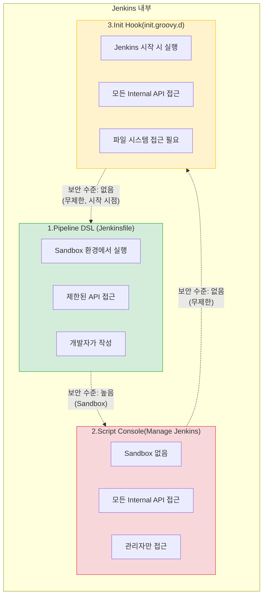
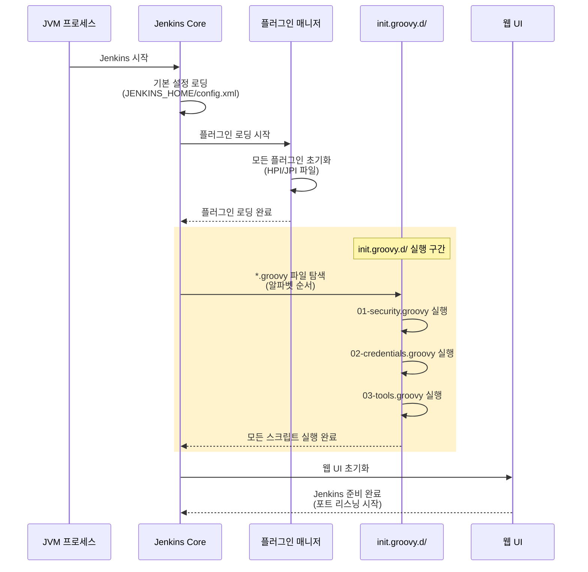
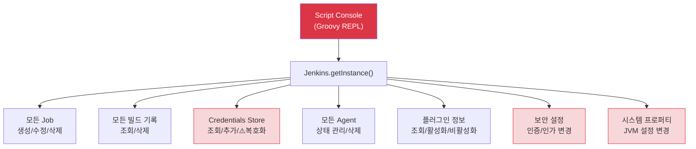

# Groovy 커스터마이징이란?

---

> **핵심 질문**: "Jenkins를 Groovy로 커스터마이징하는 것은 어디까지 가능하고, 어디부터 위험한가?"


## 1. Jenkins와 Groovy의 관계

> Jenkins는 Java로 작성된 애플리케이션이지만, 설정과 확장의 핵심 언어로 Groovy를 사용합니다. 
>
> 이 선택은 우연이 아닙니다. Groovy는 JVM 위에서 동작하므로 Jenkins의 모든 Java 클래스에 직접 접근할 수 있고, Java와 거의 동일한 문법을 가지면서도 스크립팅에 적합한 동적 타이핑을 지원합니다.

구체적으로 Groovy가 Jenkins에 적합한 이유는 세 가지입니다. 

1. **JVM 호환성입니다**. Groovy 코드는 JVM 바이트코드로 컴파일되므로 Jenkins의 Java 클래스를 `import`하여 직접 호출할 수 있습니다. 별도의 브릿지나 FFI(Foreign Function Interface)가 필요 없습니다. 
2. **문법적 간결함입니다**. Java에서 10줄이 필요한 코드를 Groovy에서는 3줄로 작성할 수 있습니다. 세미콜론 생략, 클로저, GString 같은 편의 기능이 관리 스크립트 작성에 생산성을 높여줍니다. 
3. **동적 타이핑입니다**. 런타임에 타입을 결정하므로 탐색적 스크립팅, 즉 "이 API가 무엇을 반환하는지 실행해보면서 확인하는" 작업에 유리합니다.

### Groovy가 사용되는 3가지 영역

Jenkins에서 Groovy는 명확히 구분되는 세 가지 영역에서 사용되며, 각 영역의 보안 수준과 실행 컨텍스트가 다릅니다.



**영역 1: Pipeline DSL (Jenkinsfile)**은 가장 일상적인 Groovy 사용처입니다. 

- 개발자가 `Jenkinsfile`에 `pipeline { ... }` 블록을 작성하면, Jenkins는 이것을 Groovy 코드로 해석하고 실행합니다. 
- 이 영역에서는 **Script Security Plugin**이 Sandbox를 적용하여 위험한 API 호출을 차단합니다. 
- 개발자가 `System.exit(0)`을 Pipeline에 넣어도 실행되지 않고 관리자 승인을 요구합니다.

**영역 2: Script Console (Manage Jenkins > Script Console)**은 Jenkins 관리자가 Groovy 코드를 직접 입력하여 실행하는 인터페이스입니다.

- 이 콘솔은 Sandbox가 적용되지 않으므로 Jenkins의 모든 Internal API에 무제한으로 접근할 수 있습니다. 
- 크레덴셜을 평문으로 읽을 수도 있고, 모든 Job을 삭제할 수도 있습니다. 강력하지만 그만큼 위험한 영역입니다.

**영역 3: Init Hook (JENKINS_HOME/init.groovy.d/)**은 Jenkins가 시작될 때 자동으로 실행되는 Groovy 스크립트입니다. 

- Script Console과 동일한 권한을 가지지만, 사용자가 직접 실행하는 것이 아니라 Jenkins 프로세스가 시작 시점에 자동으로 실행합니다. 
- 주로 초기 설정 자동화에 사용됩니다.

이 세 영역의 핵심적인 차이는 **누가 실행하느냐**와 **어떤 보안 경계 안에서 실행되느냐**입니다. Pipeline DSL은 개발자가 작성하고 Sandbox에서 실행되며, Script Console은 관리자가 직접 실행하고 보안 경계가 없으며, Init Hook은 시스템이 자동 실행하고 보안 경계가 없습니다.


## 2. Init Groovy Hook (전역 초기화 스크립트)

>  `JENKINS_HOME/init.groovy.d/` 디렉토리는 Jenkins의 "부팅 스크립트" 폴더입니다. 
>
> Jenkins 프로세스가 시작되면 이 디렉토리 안의 모든 `.groovy` 파일을 알파벳 순서로 실행합니다. 실행 시점은 플러그인 로딩 이후, 웹 UI가 준비되기 전입니다. 이 타이밍이 중요한데, 플러그인이 로딩된 상태이므로 플러그인 API를 호출할 수 있지만, 아직 사용자 요청을 받기 전이므로 초기 설정을 안전하게 적용할 수 있기 때문입니다.



- 왜 이 순서가 중요할까요? 만약 init.groovy.d가 플러그인 로딩 전에 실행된다면, 특정 플러그인의 API를 호출하는 스크립트가 `ClassNotFoundException`으로 실패할 것입니다. 
- 반대로 UI가 준비된 후에 실행된다면, 보안 설정이 적용되기 전에 사용자가 접근할 수 있는 시간 창이 열립니다. 
- 플러그인 로딩 직후, UI 준비 직전이라는 타이밍은 이 두 가지 문제를 모두 피하는 최적의 시점입니다.

### 파일 네이밍 컨벤션

init.groovy.d 안의 스크립트는 알파벳 순서로 실행되므로, 숫자 접두사를 붙여 실행 순서를 명시적으로 제어하는 것이 관례입니다.

```
JENKINS_HOME/init.groovy.d/
├── 01-security-realm.groovy      # 보안 설정 (가장 먼저)
├── 02-authorization.groovy       # 인가 전략
├── 03-csrf-protection.groovy     # CSRF 보호
├── 04-credentials.groovy         # 크레덴셜 등록
├── 05-global-tools.groovy        # 전역 도구 설정 (JDK, Maven)
└── 99-final-save.groovy          # 최종 저장
```

### 활용 사례와 코드 예시

**사례 1: 관리자 계정 자동 생성**

Docker 기반 Jenkins를 처음 시작할 때 관리자 계정을 자동으로 설정하는 가장 일반적인 사례입니다. 초기 설정 마법사를 건너뛰고 바로 사용 가능한 상태로 만들 수 있습니다.

```groovy
import jenkins.model.*
import hudson.security.*

def instance = Jenkins.getInstance()

// HudsonPrivateSecurityRealm: Jenkins 내장 사용자 DB를 사용하는 인증 방식
// false 파라미터는 "사용자 자가 등록 비허용"을 의미
def hudsonRealm = new HudsonPrivateSecurityRealm(false)
hudsonRealm.createAccount("admin", "admin-password")
instance.setSecurityRealm(hudsonRealm)

// FullControlOnceLoggedInAuthorizationStrategy:
// 로그인한 사용자에게 전체 권한, 비인증 사용자는 접근 불가
def strategy = new FullControlOnceLoggedInAuthorizationStrategy()
strategy.setAllowAnonymousRead(false)
instance.setAuthorizationStrategy(strategy)

instance.save()
println "[init] Admin account created and security configured."
```

- Jenkins Docker 이미지를 CI/CD 파이프라인으로 자동 배포할 때, 초기 설정 마법사를 수동으로 진행할 수 없기 때문입니다. 
- 특히 Kubernetes 환경에서 Pod이 재시작될 때마다 일관된 초기 상태를 보장해야 합니다.

**사례 2: CSRF 보호 및 Agent 프로토콜 설정**

```groovy
import jenkins.model.*
import hudson.security.csrf.DefaultCrumbIssuer
import jenkins.security.s2m.AdminWhitelistRule

def instance = Jenkins.getInstance()

// CSRF Protection 활성화 — 웹 UI에서의 CSRF 공격 방지
instance.setCrumbIssuer(new DefaultCrumbIssuer(true))

// Agent → Master 접근 제한 — Agent가 Master의 파일시스템에 접근하는 것을 차단
// 왜 중요한가: 악의적인 Agent가 Master의 크레덴셜이나 설정을 읽을 수 있기 때문
instance.getInjector().getInstance(AdminWhitelistRule.class)
    .setMasterKillSwitch(false)

instance.save()
println "[init] CSRF protection enabled, Agent protocol secured."
```

**사례 3: 크레덴셜 자동 등록 (환경변수 기반)**

```groovy
import jenkins.model.*
import com.cloudbees.plugins.credentials.*
import com.cloudbees.plugins.credentials.domains.*
import com.cloudbees.plugins.credentials.impl.*
import org.jenkinsci.plugins.plaincredentials.impl.*
import hudson.util.Secret

def env = System.getenv()

// 환경변수에서 크레덴셜 값을 읽어 Jenkins Credentials Store에 등록
// 왜 환경변수인가: Docker/K8s에서 Secret을 환경변수로 주입하는 것이 표준 패턴
def store = Jenkins.getInstance()
    .getExtensionList('com.cloudbees.plugins.credentials.SystemCredentialsProvider')[0]
    .getStore()

def domain = Domain.global()

// Git 접근용 Username/Password
if (env.containsKey('GIT_USER') && env.containsKey('GIT_TOKEN')) {
    def gitCred = new UsernamePasswordCredentialsImpl(
        CredentialsScope.GLOBAL,
        "git-credentials",           // credentials ID
        "Git Access Token",          // description
        env['GIT_USER'],             // username
        env['GIT_TOKEN']             // password
    )
    store.addCredentials(domain, gitCred)
    println "[init] Git credentials registered."
}

// Docker Registry 접근용 Secret Text
if (env.containsKey('DOCKER_REGISTRY_TOKEN')) {
    def dockerCred = new StringCredentialsImpl(
        CredentialsScope.GLOBAL,
        "docker-registry-token",
        "Docker Registry Token",
        Secret.fromString(env['DOCKER_REGISTRY_TOKEN'])
    )
    store.addCredentials(domain, dockerCred)
    println "[init] Docker registry credentials registered."
}
```

- JCasC(Configuration as Code)가 크레덴셜 등록을 지원하지만, 복잡한 조건부 로직(환경변수 존재 여부에 따른 분기)이 필요할 때는 init.groovy.d가 더 유연합니다. 
- 다만 환경변수에 비밀값을 넣는 것 자체의 보안 고려가 필요합니다. Kubernetes라면 Secret 리소스를, Docker라면 Docker Secret을 사용해야 합니다.


## 3. Script Console로 할 수 있는 것들

> Jenkins Script Console (Manage Jenkins > Script Console)은 **Jenkins 프로세스 내부에서 Groovy 코드를 직접 실행하는 REPL(Read-Eval-Print Loop)입니다.** 
>
> Jenkins의 모든 Java 객체에 접근할 수 있다는 것입니다. Jenkins 인스턴스, 모든 Job, 모든 빌드, 모든 크레덴셜, 모든 에이전트, 플러그인 설정까지 읽고 수정할 수 있습니다.



### 실용적 스크립트 예시

**빌드 기록 정리**: 디스크 공간이 부족할 때 오래된 빌드 기록을 대량 삭제합니다.

```groovy
import jenkins.model.*

def daysToKeep = 30

Jenkins.getInstance().getAllItems(hudson.model.Job.class).each { job ->
    job.getBuilds().each { build ->
        def buildDate = new Date(build.getTimeInMillis())
        def cutoffDate = new Date() - daysToKeep

        if (buildDate.before(cutoffDate)) {
            println "Deleting: ${job.fullName} #${build.number} (${buildDate})"
            build.delete()
        }
    }
}
println "Cleanup complete."
```

**Agent 상태 조회**: 모든 Agent의 온/오프라인 상태와 실행 중인 빌드를 확인합니다.

```groovy
import jenkins.model.*
import hudson.model.*

Jenkins.getInstance().getNodes().each { node ->
    def computer = node.toComputer()
    def status = computer?.isOnline() ? "ONLINE" : "OFFLINE"
    def executors = computer?.countBusy() ?: 0
    def total = computer?.countExecutors() ?: 0

    println "${node.displayName}: ${status} (${executors}/${total} executors busy)"

    if (!computer?.isOnline()) {
        println "  Offline cause: ${computer?.getOfflineCause()}"
    }
}
```

**플러그인 정보 조회**: 설치된 모든 플러그인의 버전과 업데이트 가능 여부를 확인합니다.

```groovy
import jenkins.model.*

Jenkins.getInstance().getPluginManager().getPlugins().sort { it.getShortName() }.each { plugin ->
    def update = plugin.hasUpdate() ? " [UPDATE AVAILABLE]" : ""
    println "${plugin.getShortName()} (${plugin.getVersion()})${update}"
}
```

### Script Console의 보안 위험

Script Console의 가장 심각한 보안 문제는 **크레덴셜 평문 노출**입니다. 다음 코드는 Jenkins에 저장된 모든 크레덴셜의 비밀값을 평문으로 출력할 수 있습니다.

```groovy
// ⚠️ 위험: 크레덴셜을 평문으로 노출하는 스크립트
// 이것이 가능하다는 사실 자체가 Script Console 접근 제한의 이유
import com.cloudbees.plugins.credentials.*
import com.cloudbees.plugins.credentials.impl.*

def creds = CredentialsProvider.lookupCredentials(
    com.cloudbees.plugins.credentials.common.StandardCredentials.class,
    Jenkins.getInstance(), null, null
)

creds.each { c ->
    println "ID: ${c.id}"
    if (c instanceof UsernamePasswordCredentialsImpl) {
        println "  Username: ${c.username}"
        println "  Password: ${c.password.plainText}"  // 평문 노출!
    }
}
```

- Jenkins는 크레덴셜을 암호화하여 저장하지만, 복호화 키가 Jenkins 프로세스 메모리에 있습니다. 
- Script Console은 그 프로세스 안에서 실행되므로 복호화 API를 직접 호출할 수 있습니다. 
- 이것은 설계 결함이 아니라, Jenkins가 빌드 중에 크레덴셜을 사용해야 하므로 프로세스가 복호화 능력을 갖추어야 하기 때문입니다. 
- 문제는 그 능력이 Script Console을 통해 관리자에게 노출된다는 것입니다.

따라서 Script Console 접근 권한은 **Jenkins 시스템 관리자 중에서도 극소수**에게만 부여해야 합니다. Matrix-based Security에서 "Administer" 권한과 "Run Scripts" 권한을 분리하여 관리하는 것이 권장됩니다.


## 핵심 요약

| 영역           | 보안 수준      | 주요 용도                   | 권장 대안                        |
| -------------- | -------------- | --------------------------- | -------------------------------- |
| Pipeline DSL   | Sandbox (높음) | 빌드/배포 파이프라인        | - (표준 사용법)                  |
| Script Console | 없음 (위험)    | 일회성 관리 작업, 디버깅    | 가능하면 JCasC/CLI               |
| init.groovy.d  | 없음 (위험)    | 초기 설정 자동화, 전역 Hook | JCasC 우선, Hook은 init.groovy.d |

Jenkins Groovy 커스터마이징의 핵심 판단 기준은 **"이것을 JCasC로 할 수 있는가?"**이다. 할 수 있으면 JCasC를 사용하고, 할 수 없으면 init.groovy.d를 사용하되 가능한 한 간결하게 작성한다. Script Console은 운영 중 긴급 상황이나 일회성 조사에만 사용하고, 실행 내용은 반드시 기록으로 남긴다.

전역 파이프라인 Hook은 JCasC로 구현할 수 없는 대표적인 영역이다. Shared Library Wrapper(opt-in)를 기본으로 하되, Jenkinsfile 수정이 불가능한 환경에서는 `RunListener`(init.groovy.d)로 모든 빌드에 강제 적용할 수 있다. "Groovy로 할 수 있다"와 "Groovy로 해야 한다"는 전혀 다른 질문이며, 이 구분을 아는 것이 Jenkins 운영 성숙도의 지표이다.
