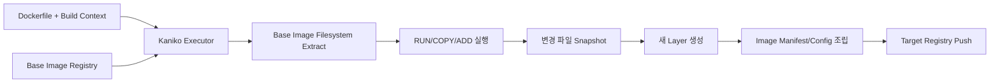
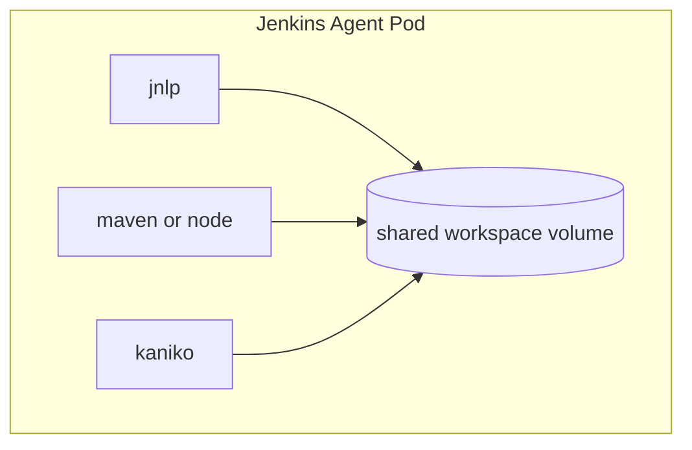
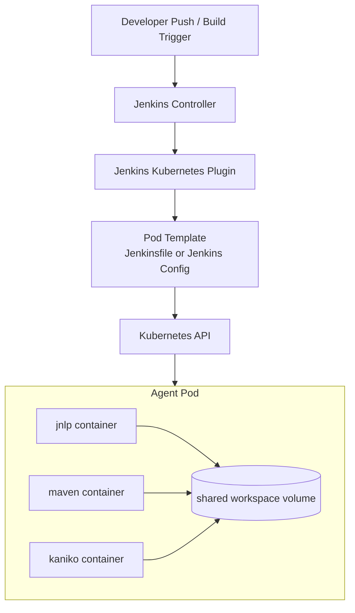
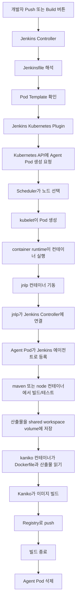

# Kaniko 심화
---
> 핵심은 두 가지를 분리해서 이해하는 것이다. 
>
> - **이미지 빌드**는 Kaniko가 담당하고, **Pod 생성과 실행**은 Kubernetes가 담당한다. 
> - Kaniko가 Docker daemon을 없앤다고 해서 Kubernetes가 컨테이너를 띄우는 기능까지 대신하는 것은 아니다.


## 1. Kaniko는 무엇을 대체하는가

> Kaniko는 Docker 명령 전체를 대체하지 않고, `docker build`와 `docker push`에 해당하는 부분만 executor 플래그로 대체한다.
>
> - 나머지 런타임 조작은 Kubernetes와 `kubectl`, Jenkins Pod 템플릿 설계로 해결한다.

Docker CLI에서 자주 쓰는 명령 기준으로 보면 다음처럼 이해하면 된다.

| 기존 Docker 방식 | Kaniko에서의 대응 | 설명 |
| --- | --- | --- |
| `docker build -t repo/app:tag .` | `/kaniko/executor --context=dir:///workspace --dockerfile=Dockerfile --destination=repo/app:tag` | Dockerfile을 읽어 이미지를 빌드한다 |
| `docker push repo/app:tag` | `--destination` 지정 시 executor가 빌드 후 바로 push | 별도 `docker push` 없이 한 번에 처리된다 |
| `docker login` | `/kaniko/.docker/config.json` 마운트 또는 클라우드 IAM 사용 | 레지스트리 인증 방식이 다르다 |
| `docker build --build-arg KEY=VALUE` | `--build-arg KEY=VALUE` | build arg 지원 |
| `docker build --target builder` | `--target builder` | 멀티 스테이지 타깃 지원 |
| `docker save` | `--tar-path image.tar --no-push` | tarball 저장 가능 |

반대로 아래 명령은 Kaniko의 영역이 아니다. 이 명령들은 **이미지 빌드가 아니라 컨테이너 런타임 조작**이다.

- `docker run`
- `docker exec`
- `docker ps`
- `docker logs`
- `docker network`
- `docker volume`

Kubernetes Jenkins 환경에서는 이런 작업을 보통 다음으로 대체한다.

- 컨테이너 실행: Jenkins Kubernetes Pod 템플릿의 sidecar 컨테이너
- 상태 확인: `kubectl get pod`, `kubectl describe pod`, `kubectl logs`
- 테스트용 의존 서비스: 같은 Pod 안의 보조 컨테이너 또는 별도 테스트 환경


## 2. Kaniko는 Docker daemon 없이 어떻게 이미지를 빌드하는가

> Kaniko의 핵심 아이디어는 Docker daemon에게 빌드를 맡기지 않고, **Kaniko 컨테이너 내부에서 직접 Dockerfile을 해석하고 레이어를 조립하는 것**이다.

동작 흐름은 다음과 같다.

1. `FROM`에 지정된 베이스 이미지를 레지스트리에서 가져온다.
2. 베이스 이미지의 파일시스템을 Kaniko 컨테이너 내부에 푼다.
3. Dockerfile의 `RUN`, `COPY`, `ADD` 같은 명령을 순서대로 실행한다.
4. 각 단계 뒤에 변경된 파일을 userspace에서 스냅샷한다.
5. 변경분으로 새 레이어를 만들고 이미지 메타데이터를 갱신한다.
6. 최종 결과를 OCI/Docker 이미지 형태로 레지스트리에 push한다.

즉, Docker daemon이 하던 **"레이어 계산 + 이미지 조립 + push"**를 Kaniko가 컨테이너 안에서 직접 수행하는 것이다.



여기서 중요한 포인트가 있다.

- Kaniko는 Docker daemon 소켓(`/var/run/docker.sock`)을 쓰지 않는다.
- `privileged` 권한도 보통 필요 없다.
- 대신 Dockerfile 각 단계의 변경 파일을 스스로 계산해야 하므로, 성능과 캐시 전략이 중요하다.


## 3. 그렇다면 Kubernetes에서는 누가 컨테이너를 띄우는가

>  이 부분이 가장 많이 헷갈린다. **Kaniko가 Pod를 띄우는 것이 아니다.**
>
> - Kubernetes에서 동적 Pod를 만드는 주체는 Jenkins의 Kubernetes Plugin과 Kubernetes control plane이다.

흐름을 순서대로 보면

1. Jenkins 파이프라인이 시작된다.
2. Jenkins Controller가 Kubernetes Plugin을 통해 Pod 스펙을 Kubernetes API 서버에 보낸다.
3. Kubernetes 스케줄러가 어느 노드에 Pod를 배치할지 결정한다.
4. 해당 노드의 kubelet이 컨테이너 런타임(containerd, CRI-O 등)에 컨테이너 실행을 요청한다.
5. Pod 안의 `jnlp` 컨테이너가 Jenkins Controller에 연결한다.
6. 같은 Pod 안의 `maven`, `node`, `kaniko` 같은 작업 컨테이너가 공유 워크스페이스를 사용해 빌드를 수행한다.

즉, 둘은 역할이 완전히 다르다.

- **Pod 생성**: Jenkins Kubernetes Plugin + Kubernetes API + kubelet + container runtime
- **이미지 빌드**: Pod 안에서 실행된 Kaniko


## 4. "Docker daemon 없이 k8s 동적 포드"의 정확한 의미

### 4-1. Jenkins 에이전트 Pod 자체

Jenkins의 동적 에이전트 Pod는 원래부터 `docker run`으로 뜨는 것이 아니다. 

- Jenkins Kubernetes Plugin이 Kubernetes API에 Pod YAML을 보내면 Kubernetes가 Pod를 만든다.
- 여기에는 Docker daemon이 직접 필요하지 않다. Kubernetes는 **v1.24부터 dockershim을 제거**했고, 현재는 CRI 기반 런타임(containerd, CRI-O 등) 위에서 Pod를 실행하는 방향이 기본이다.

즉, 에이전트 Pod의 생성 자체는 다음 경로로 이해해야 한다.

```text
Jenkins -> Kubernetes API -> Scheduler -> kubelet -> containerd/CRI-O -> Pod 실행
```

### 4-2. 그 Pod 안에서 애플리케이션 이미지를 빌드하는 단계

문제는 Pod가 뜬 뒤, 파이프라인 안에서 애플리케이션 이미지까지 빌드해야 할 때다. 전통 방식이라면 Pod 내부에서 아래 명령어를 실행하고 싶어진다.

```bash
docker build -t myapp:tag .
docker push registry/myapp:tag
```

- Kubernetes 보안 정책상 DinD는 `privileged`가 필요하고, DooD는 `docker.sock` 마운트가 필요하므로 둘 다 부담이 크다.

그래서 이 빌드 단계만 Kaniko로 바꾸는 것이다.

```bash
/kaniko/executor \
  --context=dir:///workspace \
  --dockerfile=Dockerfile \
  --destination=registry.example.com/myapp:${BUILD_NUMBER}
```

- 즉, "Docker daemon 없이 k8s 동적 포드"라는 말은 보통 정확히는: Kubernetes가 에이전트 Pod를 동적으로 만들고, 그 Pod 안에서 애플리케이션 이미지는 Kaniko가 daemon 없이 빌드한다라는 의미입니다.


## 5. Jenkins Kubernetes Pod에서 Kaniko가 실제로 붙는 구조

> 실무에서는 Kaniko만 단독으로 쓰기보다, 하나의 에이전트 Pod 안에 여러 컨테이너를 같이 넣는다.
>
> - `jnlp`: Jenkins 에이전트 통신
> - `builder` 또는 `maven`/`node`: 소스 빌드, 테스트
> - `kaniko`: 최종 컨테이너 이미지 빌드 및 push

이 컨테이너들은 같은 Pod 안에서 **공유 볼륨**을 쓴다. 보통 `emptyDir` 또는 workspace volume이 마운트된다. 그래서 `maven` 컨테이너가 만든 JAR 파일을 `kaniko` 컨테이너가 그대로 읽을 수 있다.



이 구조에서 Docker daemon이 없어도 되는 이유는 명확하다.

- 워크스페이스 공유는 Kubernetes volume이 담당한다.
- 컨테이너 생성은 kubelet + container runtime이 담당한다.
- 이미지 레이어 생성은 Kaniko가 담당한다.

서로 다른 계층의 기능을 합치면 Docker daemon 없이도 전체 파이프라인이 성립한다.


## 6. Jenkinsfile 예시로 보면 더 명확하다

```groovy
pipeline {
    agent {
        kubernetes {
            yaml '''
                apiVersion: v1
                kind: Pod
                spec:
                  containers:
                  
                  - name: maven
                    image: maven:3.9-eclipse-temurin-17
                    command: ['sleep']
                    args: ['infinity']
                    
                  - name: kaniko
                    image: gcr.io/kaniko-project/executor:debug
                    command: ['sleep']
                    args: ['infinity']
                    volumeMounts:
                    - name: docker-config
                      mountPath: /kaniko/.docker
                  volumes:
                  - name: docker-config
                    secret:
                      secretName: registry-credentials
                '''
        }
    }
    stages {
        stage('Build App') {
            steps {
                container('maven') {
                    sh 'mvn -B -ntp clean package -DskipTests'
                }
            }
        }
        stage('Build Image') {
            steps {
                container('kaniko') {
                    sh '''
                      /kaniko/executor \
                        --context=dir:///home/jenkins/agent \
                        --dockerfile=Dockerfile \
                        --destination=registry.example.com/myapp:${BUILD_NUMBER}
                    '''
                }
            }
        }
    }
}
```

### 6-1. `maven`, `kaniko` 컨테이너는 어디서 설치되는가

여기서 말하는 `maven`, `kaniko`는 Jenkins 서버에 패키지처럼 설치하는 것이 아니다.

- Jenkins Controller에 `maven`이나 Kaniko 바이너리를 직접 설치하는 구조가 아니다.
- Jenkinsfile 또는 Jenkins Pod Template에 **컨테이너 이미지 이름**을 적어 둔다.
- Jenkins Kubernetes Plugin이 그 Pod 스펙을 Kubernetes API에 전달한다.
- Kubernetes 노드가 레지스트리에서 이미지를 pull한 뒤 Pod 안에 컨테이너를 띄운다.

즉, "설치 위치"를 계층별로 나누면 다음처럼 이해하는 것이 정확하다.

| 대상 | 어디에 존재하는가 | 역할 |
| --- | --- | --- |
| Jenkins Controller | Jenkins 서버/Pod | 파이프라인 해석, Pod 생성 요청 |
| Kubernetes Plugin | Jenkins Controller 내부 플러그인 | Jenkins와 Kubernetes API 연결 |
| Pod Template | Jenkinsfile 또는 Jenkins 설정 | 어떤 컨테이너를 띄울지 선언 |
| `maven:3.9-...` 이미지 | 컨테이너 레지스트리 | Maven 실행 환경 제공 |
| `gcr.io/kaniko-project/executor:debug` 이미지 | 컨테이너 레지스트리 | Kaniko 실행 환경 제공 |
| 실제 `maven`, `kaniko` 컨테이너 | 빌드 시 생성된 Agent Pod 내부 | 실제 명령 실행 |

- `container('maven')`, `container('kaniko')`는 "Jenkins에 설치된 도구 호출"이 아니라, **Pod 안에 선언된 컨테이너 선택**이다.


## 7. Controller / Kubernetes / Pod Template / Container 관계

> - **Jenkins Controller**: Jenkinsfile을 읽고 전체 파이프라인을 조정한다.
> - **Kubernetes Plugin**: Controller가 Kubernetes에 빌드용 Pod를 요청하게 해 준다.
> - **Pod Template**: 어떤 컨테이너를 넣은 Pod를 만들지 정의하는 설계도다.
> - **Container**: 실제로 `mvn`, `npm`, `/kaniko/executor` 같은 명령이 실행되는 공간이다.



1. 개발자가 빌드를 트리거한다.
2. Jenkins Controller가 Jenkinsfile을 읽는다.
3. `agent { kubernetes { yaml ... } }` 또는 사전 등록된 Pod Template를 확인한다.
4. Jenkins Kubernetes Plugin이 그 템플릿으로 Kubernetes에 Agent Pod 생성을 요청한다.
5. Kubernetes가 Pod를 띄우고, 그 안에 `jnlp`, `maven`, `kaniko` 컨테이너를 함께 실행한다.
6. Jenkins는 `container('maven')`, `container('kaniko')` 블록을 통해 각 컨테이너 안에서 명령을 실행한다.

여기서 핵심은 다음이다.

- Controller는 컨테이너를 직접 실행하지 않는다.
- Pod Template는 실행 엔진이 아니라 선언서다.
- 실제 컨테이너 실행은 Kubernetes 노드의 container runtime이 담당한다.
- Kaniko는 그중 하나의 작업 컨테이너일 뿐이다.


## 8. 한 번의 빌드는 실제로 어떻게 흐르는가

> graph가 정적인 관계도라면, 아래 graph는 **빌드가 실제로 흘러가는 순서**를 보여 준다. `jnlp`가 어떤 위치에서 동작하는지도 같이 볼 수 있다.



이 흐름에서 각 요소의 역할은 다음처럼 보면 된다.

- `jnlp`: Pod를 Jenkins 작업 노드로 연결하는 통신 담당
- `maven`/`node`: 소스 코드 빌드와 테스트 담당
- `kaniko`: 최종 이미지 빌드와 push 담당
- shared workspace volume: 컨테이너 간 산출물 전달 담당

즉, `jnlp`는 직접 빌드하지 않고 **Jenkins와 Agent Pod를 연결하는 입구** 역할을 한다.


## 9. Kaniko를 쓸 때 꼭 알아야 할 운영 포인트

### 9-1. Kaniko는 빌드 전용이지 런타임 도구가 아니다

Kaniko는 이미지 빌드 도구다. 테스트를 위해 임시 컨테이너를 띄우는 용도로 쓰지 않는다. 예를 들어 integration test에서 DB를 올리고 싶다면:

- 같은 Pod 안에 `postgres` sidecar를 둔다
- 별도 테스트 네임스페이스에 종속 서비스를 띄운다
- Testcontainers를 쓰되, Kubernetes 친화적 대안을 고민한다

즉 "Docker CLI가 없으니 Kaniko로 대신 실행"이라는 사고는 틀리다.

### 9-2. 캐시 전략을 안 잡으면 생각보다 느릴 수 있다

Docker daemon 기반 빌드는 로컬 레이어 캐시가 강력하다. Kaniko는 그 캐시 경험이 다르다. 그래서 `--cache=true`, `--cache-repo` 같은 원격 캐시 전략을 별도로 설계해야 한다.

캐시가 없으면:

- 매 빌드마다 베이스 이미지 pull
- `RUN apt-get ...`, `RUN npm ci`, `RUN mvn dependency:go-offline` 같은 단계 재실행
- 빌드 시간 급증

즉, 보안 이점만 보고 Kaniko를 도입하고 캐시를 빼먹으면 CI 속도가 크게 나빠질 수 있다.

### 9-3. 스냅샷 방식과 성능은 trade-off다

Kaniko는 파일시스템 변경분을 snapshot해서 레이어를 만든다. 이때 snapshot 모드가 성능과 정확도에 영향을 준다.

- `full`: 가장 안전하지만 느리다
- `redo`: 더 빠를 수 있다
- `time`: 가장 공격적인 최적화지만 변경 감지 한계를 이해해야 한다

### 9-4. 공식 executor 이미지를 그대로 쓰는 편이 안전하다

Kaniko는 구현 특성상 "실행 파일만 빼서 다른 CI 이미지에 복사"하는 방식이 권장되지 않는다. Jenkins 에이전트 이미지 하나에 모든 도구를 우겨 넣는 대신:

- `maven` 컨테이너
- `node` 컨테이너
- `kaniko` 컨테이너

처럼 역할을 나눠 쓰는 편이 안정적이다.

### 9-5. 레지스트리 인증 설계가 중요하다

Kaniko는 `docker login` 세션을 쓰지 않으므로 인증 정보를 다른 방식으로 넣어야 한다.

대표 패턴은:

- Docker config secret을 `/kaniko/.docker/config.json`에 마운트
- GKE/GAR 같은 환경에서는 Workload Identity 사용
- EKS/ECR 같은 환경에서는 IRSA 또는 적절한 IAM 연계 사용

즉, Jenkins credential만 생각하면 부족하고 **Pod가 어떤 자격으로 registry에 push하는지**까지 설계해야 한다.

### 9-6. 멀티 아키텍처 이미지는 별도 전략이 필요하다

`docker buildx build --platform ...`처럼 한 번에 해결되는 경험을 기대하면 안 된다. Kaniko는 보통 아키텍처별 이미지를 따로 빌드하고, 나중에 manifest를 묶는 방식으로 접근한다.

그래서 ARM64와 AMD64를 동시에 지원해야 하면:

1. 아키텍처별 빌드 Pod를 나눈다
2. 각각 이미지를 push한다
3. manifest list를 조합한다

이 설계가 필요하다.

### 9-7. 2025년 6월 이후 유지보수 상태도 확인해야 한다

Kaniko 원본 GitHub 저장소는 **2025년 6월 3일에 archive**되었다. 즉, 현재도 역사적으로 매우 많이 쓰였고 기존 문서도 풍부하지만, 장기 운영 관점에서는 유지보수 리스크를 함께 평가해야 한다.

따라서 팀 차원에서는 다음 질문까지 같이 검토하는 편이 좋다.

- 지금 필요한 것은 "당장 DinD 제거"인가
- 아니면 "앞으로도 활발히 유지보수되는 빌드 체인"인가
- BuildKit, Buildah, Podman 계열이 더 맞는가

이건 "Kaniko가 작동하느냐"와는 별개의 운영 판단이다.


## 10. 참고 자료

- Kaniko README: https://github.com/GoogleContainerTools/kaniko/blob/main/README.md
- Jenkins Kubernetes Plugin: https://github.com/jenkinsci/kubernetes-plugin
- Kubernetes Container Runtimes: https://kubernetes.io/docs/setup/production-environment/container-runtimes/
