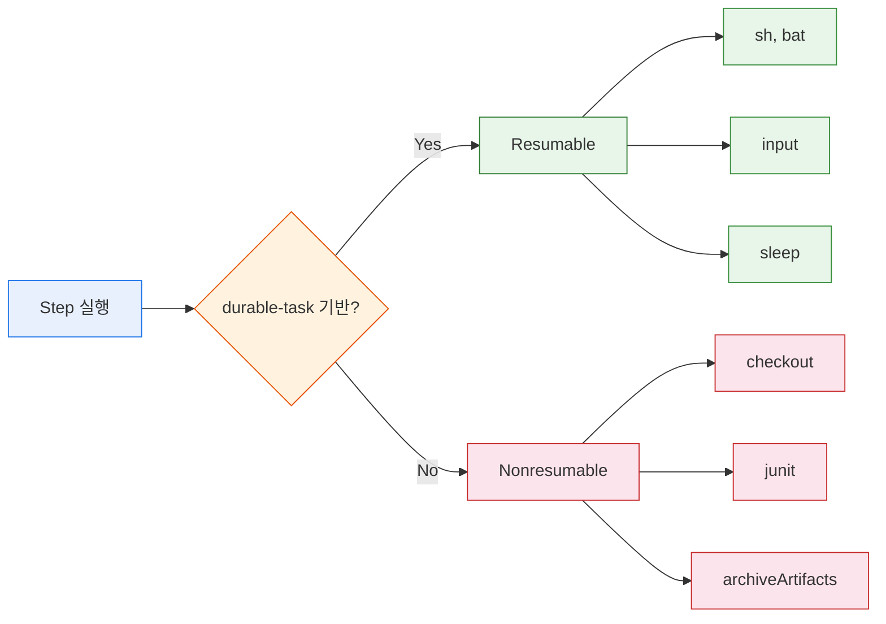
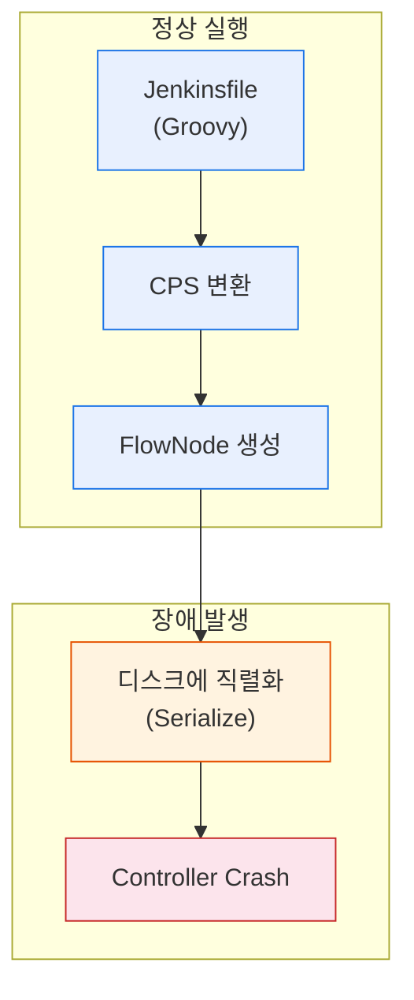
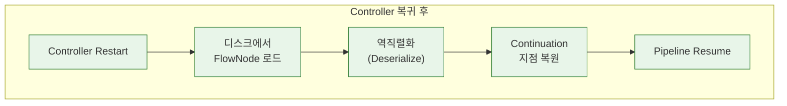
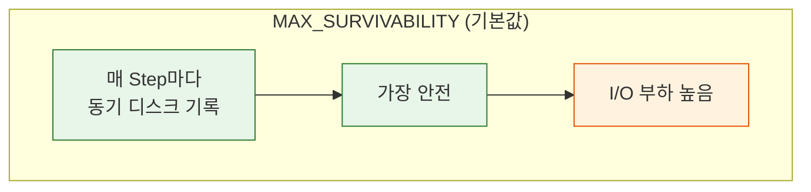
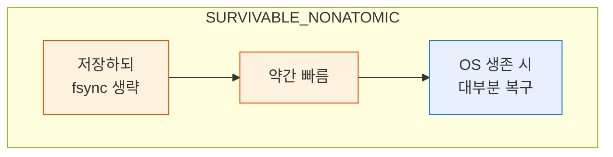
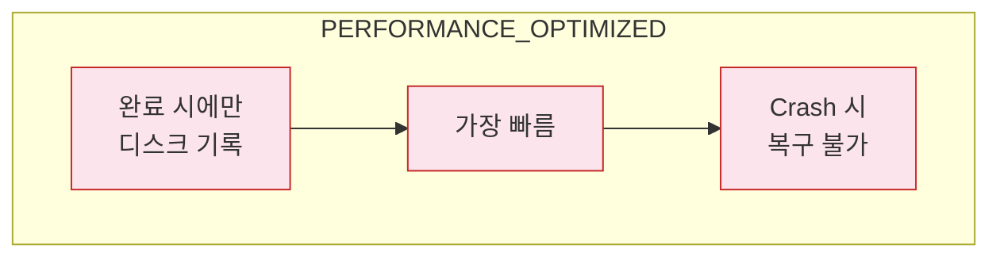
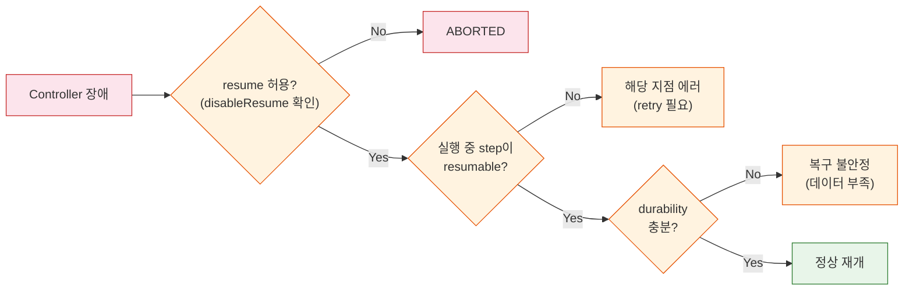

# Pipeline Resume과 Durability

---

> Jenkins Pipeline이 controller 장애를 견디는 원리와, 실무에서 durability 설정을 어떻게 조율해야 하는지 다룬다.


## 1. Pipeline이 "살아남는다"는 것의 의미

> **"Pipelines can survive both planned and unplanned restarts of the Jenkins controller."**
> (controller 프로세스가 종료되었다가 다시 시작되더라도 실행 중이던 파이프라인이 중단 지점에서 이어서 진행될 수 있다)
> https://www.jenkins.io/doc/book/pipeline/

Jenkins의 이전 세대인 Freestyle job에서는 불가능했던 능력이다. Freestyle job은 controller JVM 안에서 순차적으로 빌드 단계를 실행하므로, controller가 죽으면 해당 빌드는 그냥 사라진다. 로그만 남고 상태는 복구할 수 없다.

### CSP(Continutation-Passing Style) 변환

Jenkins Pipeline 플러그인은 사용자가 작성한 Groovy 스크립트를 CPS 형태로 변환한다. CPS 변환이란, 프로그램의 실행 흐름을 "다음에 무엇을 할 것인가"라는 continuation 객체의 연쇄로 바꾸는 것이다. 

- 일반적인 프로그래밍에서 함수가 값을 반환하면 호출자가 그 값을 받아서 다음 작업을 진행하지만, CPS에서는 함수가 "다음에 실행할 함수"를 인자로 받아서 직접 호출한다. 
- 이렇게 변환된 코드는 실행 상태를 객체로 표현할 수 있고, 그 객체를 디스크에 저장했다가 나중에 복원하는 것이 가능해진다 [4].

### 왜 이것이 중요한가?

1. CI/CD 파이프라인은 수 분에서 수 시간까지 실행될 수 있다. 대규모 빌드, 통합 테스트, 승인 대기(`input` step)를 포함하는 파이프라인은 몇 시간 동안 살아 있어야 한다. 그 사이에 controller를 업그레이드해야 할 수도 있고, 예기치 않은 OOM(Out of Memory)이 발생할 수도 있다. 
2. 이런 상황에서 파이프라인이 처음부터 다시 실행되어야 한다면, 이미 완료한 빌드와 테스트를 반복해야 하므로 시간과 자원이 낭비된다. Pipeline의 resume 능력은 이 문제를 구조적으로 해결한다. 
3. controller가 복귀하면 디스크에 저장된 실행 상태를 읽어서 중단 지점의 continuation부터 실행을 이어간다. 이것이 Jenkins가 "Pipeline은 Freestyle을 대체한다"고 주장하는 근거 중 하나이며, 엔터프라이즈 환경에서 Jenkins를 운영하는 팀이 반드시 이해해야 하는 메커니즘이다 [1] [4].

### Freestyle job과 Pipeline의 차이

**Freestyle job**: 빌드 단계(Build Step)를 controller JVM 스레드 안에서 순차 실행한다.

- 빌드 로그는 파일로 남지만, "현재 몇 번째 단계를 실행 중인가"라는 실행 상태는 JVM 메모리에만 존재한다. 
- controller 프로세스가 종료되면 그 메모리가 사라지고, 빌드는 복구 불가능한 상태가 된다. 

**Pipeline**: 실행 상태 자체를 디스크에 영속화하므로, JVM 메모리가 사라져도 디스크에서 상태를 복원할 수 있다. 

- 이것은 데이터베이스에서 WAL(Write-Ahead Log)을 통해 crash recovery를 구현하는 것과 유사한 패턴이다. 
- 먼저 "무엇을 할 것인지"를 디스크에 기록하고, 그 다음에 실제 작업을 수행한다. crash가 발생하면 디스크의 기록을 읽어서 마지막 상태를 복원한다.

Jenkins controller를 업그레이드하거나 플러그인을 설치할 때는 controller를 재시작해야 한다. 

- Freestyle job만 사용하는 환경에서는 "현재 실행 중인 빌드가 없을 때"를 기다려서 재시작해야 하는데, 빌드가 항상 돌아가는 바쁜 환경에서는 그 타이밍을 잡기가 어렵다. 
- Pipeline을 사용하면 Safe Restart 플러그인 [8]과 함께 "현재 실행 중인 파이프라인을 중단하지 않고 재시작"하는 운영이 가능해진다. 
- 물론 resume가 100% 보장되는 것은 아니며, 뒤에서 다룰 resumable/nonresumable step 구분과 durability 설정에 따라 달라진다.


## 2. Resumable Step과 Nonresumable Step

> 파이프라인이 resume될 수 있다는 것은 모든 step이 동일하게 resume를 지원한다는 뜻이 아니다. 
>
> - Jenkins Pipeline의 step은 크게 두 종류로 나뉜다. resumable step과 nonresumable step이다. 
> - 이 구분을 이해하지 못하면 controller 장애 후 파이프라인이 왜 어떤 지점에서는 이어가고 다른 지점에서는 실패하는지 설명할 수 없다.



### Resuable step

Resumable step의 대표적인 예는 `sh`, `bat`, `input`, `sleep`이다. 이 step들이 resumable한 이유는 durable-task 플러그인의 설계에 있다.

-  `sh` step을 실행하면 Jenkins controller는 agent 노드에 셸 프로세스를 시작시킨 뒤, 그 프로세스의 PID와 로그 파일 경로를 기록한다. 그리고 주기적으로 agent에 폴링하여 프로세스가 완료되었는지 확인한다. 
- 핵심은 셸 프로세스가 controller와 독립적으로 agent 위에서 실행된다는 점이다. controller가 죽더라도 agent의 셸 프로세스는 계속 돌아간다. controller가 복귀하면 기록해둔 PID를 기반으로 agent에 다시 연결하여 프로세스 상태를 확인하고, 완료되었으면 결과를 수집하며, 아직 실행 중이면 계속 폴링을 재개한다. 
- `input` step도 마찬가지다. 사용자의 입력을 기다리는 상태는 controller 메모리가 아니라 디스크에 직렬화되어 있으므로, controller가 재시작되어도 입력 대기 상태가 복원된다 [2] [7].

### nonresumable step

nonresumable step은 controller JVM 안에서 빠르게 실행되고 끝나는 step이다. 

- `checkout`, `junit`, `archiveArtifacts`, `stash`, `unstash` 같은 것들이 여기에 해당한다. 
- 이 step들은 실행 시간이 짧기 때문에(보통 수 초 이내) resume를 지원할 필요성이 낮다고 설계되었다. 
- 문제는 "짧다"는 것이 보장이 아니라 기대라는 점이다. 대규모 저장소의 `checkout`은 수 분이 걸릴 수 있고, 그 도중에 controller가 죽으면 해당 step은 복구할 수 없다. controller가 복귀했을 때 이 step이 실행 중이었다면, Jenkins는 해당 지점에서 에러를 발생시킨다 [2].

이 구분이 실무에서 중요한 이유는 파이프라인의 취약 지점을 예측할 수 있게 해주기 때문이다. 

- 파이프라인에서 controller 장애에 취약한 구간은 nonresumable step이 실행되는 순간이다. 
- `checkout scm`이 실행되는 몇 초, `junit` 리포트를 수집하는 몇 초가 resume 불가능한 "사각지대"다. 이 사각지대를 보호하는 방법은 뒤에서 다루겠지만, 핵심은 `retry` 블록으로 감싸는 것이다. 
- resumable step은 자체적으로 controller 장애를 견디므로 별도 보호가 필요 없지만, nonresumable step은 명시적인 재시도 전략이 필요하다.

### durable-task 플러그인

durable-task 플러그인의 동작 방식을 좀 더 깊이 들여다보면 resumable step의 견고함이 이해된다. 

- `sh` step을 실행할 때 durable-task 플러그인은 agent 노드에 제어 디렉토리(control directory)를 생성한다. 
- 이 디렉토리에는 셸 스크립트 파일, 로그 파일, 그리고 결과 코드 파일이 들어간다. 
- 셸 프로세스는 이 디렉토리 안의 스크립트를 실행하고, 표준 출력을 로그 파일에 기록하며, 완료되면 종료 코드를 결과 파일에 쓴다. 
- controller는 이 결과 파일의 존재 여부를 주기적으로 폴링하여 완료를 감지한다. 
- controller가 죽었다가 복귀해도, 결과 파일이 이미 만들어져 있으면 "완료됨"으로 판단하고, 아직 없으면 "실행 중"으로 판단하여 폴링을 재개한다. 
- 이 설계 덕분에 controller와 agent 사이에 일시적 네트워크 단절이 발생해도 step이 정상 완료될 수 있다 [7].

한편, `input` step의 resume 메커니즘은 또 다르다. 

- `input` step은 사용자 입력을 기다리는 동안 파이프라인 실행을 일시 정지(pause)시킨다. 
- 이 일시 정지 상태는 FlowNode로 직렬화되어 디스크에 저장된다. 
- controller가 재시작되면 이 FlowNode를 읽어서 "input 대기 중" 상태를 복원하고, Jenkins UI에 다시 입력 대기 화면을 표시한다. 
- 사용자가 승인 버튼을 클릭하면 파이프라인이 다음 step부터 이어간다. 이것은 프로덕션 배포 승인 워크플로우에서 특히 중요한데, 금요일 저녁에 승인 요청을 보내고 월요일 아침에 승인하는 사이에 controller 유지보수가 있어도 승인 상태가 유지되기 때문이다.


## 3. Pipeline 실행 모델: CPS Engine 내부

> Jenkins Pipeline의 resume 능력을 이해하려면 CPS 엔진의 내부 동작을 알아야 한다. 
>
> - 사용자가 Jenkinsfile에 Groovy 코드를 작성하면, Pipeline 플러그인은 이 코드를 그대로 실행하지 않는다. 
> - 먼저 CPS 변환기가 코드를 continuation-passing style로 변환한다. 
> - 이 변환 과정에서 각 step 호출 지점이 "여기서 멈추고, 나중에 이 continuation부터 이어갈 수 있다"는 형태로 재구성된다. 
> - 변환된 코드는 원본 Groovy와 의미적으로 동일하지만, 실행 상태를 외부에서 관찰하고 저장할 수 있는 구조로 바뀐다.





CPS 변환된 코드가 실행되면, 각 step마다 FlowNode라는 객체가 생성된다. 

- FlowNode는 파이프라인 실행 그래프의 노드이며, 해당 step의 시작, 종료, 입력값, 출력값, 로그 위치 등의 메타데이터를 담고 있다. 
- Jenkins는 이 FlowNode들을 `$JENKINS_HOME/jobs/<job>/builds/<build>/` 디렉토리 아래에 파일로 직렬화한다. 
- durability 설정에 따라 매 step마다 저장하거나(MAX_SURVIVABILITY), 주기적으로 저장하거나(SURVIVABLE_NONATOMIC), 거의 저장하지 않는다(PERFORMANCE_OPTIMIZED). 이 직렬화된 FlowNode 파일들이 파이프라인의 "체크포인트" 역할을 한다 [4] [5].

controller가 crash 후 복귀하면, Jenkins는 각 빌드 디렉토리에서 직렬화된 FlowNode 파일들을 읽어서 실행 그래프를 메모리에 복원한다. 

- 그리고 마지막으로 저장된 FlowNode가 가리키는 continuation 지점부터 실행을 재개한다. 
- 중요한 점은 "소스 코드의 몇 번째 줄"이 아니라 "continuation 객체" 단위로 복원한다는 것이다. 
- Groovy 소스 코드의 줄 번호는 복원에 사용되지 않는다. CPS 변환이 만들어낸 continuation 체인에서 마지막으로 완료된 continuation의 다음 continuation을 찾아서 실행한다. 이것이 "Pipeline이 중간부터 이어간다"의 정확한 의미다.

이 메커니즘이 왜 "계획된 재시작"과 "계획되지 않은 재시작" 모두를 처리할 수 있는지도 이해할 수 있다. 

- 계획된 재시작(Safe Restart 플러그인 등)은 현재 실행 중인 step이 끝날 때까지 기다린 뒤 controller를 종료하므로, 직렬화된 상태와 실제 실행 상태가 정확히 일치한다. 
- 계획되지 않은 재시작(OOM kill, 서버 다운 등)은 마지막으로 디스크에 기록된 시점의 상태로 복원하므로, 기록 이후에 발생한 진행 상황은 유실될 수 있다. 이것이 durability 설정이 중요한 이유이며, 다음 섹션에서 자세히 다룬다.

FlowNode의 디스크 저장 구조를 실제로 살펴보면 이해가 깊어진다. 

- `$JENKINS_HOME/jobs/<job>/builds/<build>/` 디렉토리 아래에는 `workflow/` 서브디렉토리가 있고, 여기에 `2.xml`, `3.xml`, `4.xml` 같은 숫자 이름의 XML 파일들이 만들어진다. 
- 각 파일이 하나의 FlowNode에 대응하며, 해당 step의 타입, 시작 시간, 부모 노드 ID, 그리고 step이 완료되었는지 여부 등을 담고 있다. 
- `program.dat` 파일은 CPS 프로그램의 현재 continuation 상태를 Java 직렬화 형식으로 저장한다. 
- controller가 복귀하면 이 `program.dat`를 역직렬화하여 continuation 지점을 복원하고, 각 FlowNode XML을 읽어서 실행 그래프를 재구성한다. 이 파일들이 손상되면 파이프라인 복구가 불가능하므로, `$JENKINS_HOME`이 위치한 디스크의 신뢰성이 resume의 전제 조건이 된다.

다음은 가장 기본적인 파이프라인 예시다. 각 `sh` step이 resumable step이므로, 이 파이프라인의 어느 지점에서 controller가 죽더라도 이론적으로 resume가 가능하다:

```groovy
pipeline {
    agent any

    stages {
        stage('Build') {
            steps {
                sh 'mvn clean compile'
            }
        }
        stage('Test') {
            steps {
                sh 'mvn test'
            }
        }
        stage('Package') {
            steps {
                sh 'mvn package -DskipTests'
            }
        }
    }
}
```

이 파이프라인에서 `sh 'mvn test'`가 실행되는 도중에 controller가 죽었다고 가정하자. 

- agent 위에서 `mvn test` 프로세스는 계속 돌아간다. 
- controller가 복귀하면 FlowNode를 역직렬화하여 "Test stage의 sh step이 실행 중이었다"는 것을 알아내고, agent에 연결하여 해당 프로세스의 상태를 확인한다. 
- 프로세스가 이미 완료되었으면 결과를 수집하고 다음 stage로 넘어간다. 아직 실행 중이면 완료를 기다린다.


## 4. Durability 설정과 성능 트레이드오프

> CPS 엔진이 FlowNode를 디스크에 얼마나 자주 저장하느냐가 durability 설정이다. 
>
> Jenkins는 세 가지 durability 레벨을 제공하며, 각 레벨은 안전성과 성능 사이의 트레이드오프를 명시적으로 표현한다 
>
> https://www.jenkins.io/doc/book/pipeline/scaling-pipeline/

### 4.1 MAX_SURVIVABILITY

**MAX_SURVIVABILITY**는 기본값이다. 



- 매 step이 시작되고 끝날 때마다 FlowNode를 디스크에 동기적으로 기록한다. 
- 이 말은 `sh` step이 시작되기 전에 "sh step을 시작한다"는 FlowNode가 디스크에 쓰이고, `sh` step이 완료된 후에 "sh step이 완료되었다"는 FlowNode가 디스크에 쓰인다는 뜻이다. 
- controller가 어느 시점에 죽더라도 마지막으로 완료된 step까지는 정확히 복원할 수 있다. 대신 디스크 I/O가 많다. 수백 개의 step을 가진 파이프라인이 수십 개 동시에 실행되면, `$JENKINS_HOME` 디렉토리가 위치한 디스크에 상당한 쓰기 부하가 발생한다. 
- NFS처럼 네트워크 파일시스템을 사용하는 환경에서는 이 부하가 파이프라인 실행 속도를 눈에 띄게 저하시킬 수 있다.

### 4.2 SURVIVABLE_NONATOMIC

**SURVIVABLE_NONATOMIC**은 FlowNode를 저장하되, 원자성(atomicity)을 보장하지 않는다. 



- 쉽게 말하면 "쓰기는 하지만 fsync를 강제하지 않는다"는 뜻이다. 운영체제의 파일시스템 캐시에 데이터가 있지만 아직 물리 디스크에 flush되지 않은 상태에서 서버가 꺼지면, 데이터가 유실될 수 있다. 
- 하지만 JVM만 죽고 OS는 살아 있는 경우(OOM kill 등)에는 파일시스템 캐시가 유효하므로 대부분 복구할 수 있다. MAX_SURVIVABILITY보다 디스크 I/O가 적고, 따라서 약간 더 빠르다.

### 4.3 PERFORMANCE_OPTIMIZED

**PERFORMANCE_OPTIMIZED**는 디스크 쓰기를 최소화한다. 



- FlowNode를 메모리에만 유지하고, 파이프라인이 완료되거나 특정 조건이 충족될 때만 디스크에 기록한다. 
- 가장 빠르지만, controller가 예기치 않게 죽으면 실행 중이던 파이프라인은 복구할 수 없다. 
- 이 모드는 "어차피 다시 돌리면 되는" 짧은 파이프라인이나, 성능이 극도로 중요한 대규모 CI 환경에서 사용한다. Jenkins 공식 문서도 이 모드를 "dirty shutdowns에서 running pipelines를 잃어도 괜찮은 경우"에만 사용하라고 권고한다 [5].

### 4.4 durability 설정

durability 설정은 Jenkinsfile의 `options` 블록에서 파이프라인 단위로 지정할 수 있다. 또는 Jenkins 전역 설정(Manage Jenkins > Configure System)에서 기본값을 변경할 수도 있다:

```groovy
pipeline {
    agent any

    options {
        durabilityHint('PERFORMANCE_OPTIMIZED')
    }

    stages {
        stage('Build') {
            steps {
                sh 'mvn clean package'
            }
        }
        stage('Test') {
            steps {
                sh 'mvn verify'
            }
        }
    }
}
```

- 어떤 레벨을 선택해야 하는가. 정답은 파이프라인의 성격에 따라 다르다. 프로덕션 배포 파이프라인처럼 중간에 멈추면 위험한 작업은 MAX_SURVIVABILITY를 유지해야 한다. 
- 개발 브랜치의 단위 테스트 파이프라인처럼 실패해도 다시 돌리면 그만인 작업은 PERFORMANCE_OPTIMIZED로 설정하여 Jenkins controller의 부하를 줄일 수 있다. 
- 대규모 Jenkins 인스턴스를 운영하는 팀에서는 이 설정 하나로 동시 실행 파이프라인 수를 상당히 늘릴 수 있다.

durability 설정을 전역으로 변경하는 것과 파이프라인 단위로 변경하는 것의 차이도 이해해야 한다. 

- Manage Jenkins > Configure System에서 전역 기본값을 PERFORMANCE_OPTIMIZED로 바꾸면, 모든 파이프라인에 일괄 적용된다. 이것은 위험하다. 프로덕션 배포 파이프라인까지 PERFORMANCE_OPTIMIZED로 동작하게 되기 때문이다. 
- 권장하는 접근법은 전역 기본값을 MAX_SURVIVABILITY로 유지하되, 성능이 중요한 개별 파이프라인의 `options` 블록에서만 durability를 낮추는 것이다. 이렇게 하면 "기본은 안전하게, 예외적으로 빠르게"라는 원칙이 적용된다.

실무에서 durability 설정이 성능에 미치는 영향은 파이프라인의 step 수에 비례한다. 

- 10개 step을 가진 단순한 파이프라인에서는 MAX_SURVIVABILITY와 PERFORMANCE_OPTIMIZED의 차이가 체감되지 않는다. 
- 하지만 `parallel` 블록 안에서 수백 개의 테스트를 개별 `sh` step으로 실행하는 파이프라인에서는 차이가 크다. 
- 각 step마다 디스크 동기 쓰기가 발생하므로, step 수가 많을수록 I/O 오버헤드가 누적된다. Jenkins 공식 문서에서 "대규모 파이프라인에서 성능 문제가 발생하면 durability 설정을 검토하라"고 권고하는 이유가 여기에 있다 [5].


## 5. Resume 제어 옵션

>  Jenkins Pipeline은 resume 동작을 세밀하게 제어하는 몇 가지 옵션을 제공한다. 
>
> - 이 옵션들은 `options` 블록에서 설정하며, 파이프라인의 특성에 맞게 resume 전략을 조정할 때 사용한다.

### 5-1. disalbeResume()

**`disableResume()`**은 controller restart 후 자동 resume를 비활성화한다. 

- 이 옵션이 설정된 파이프라인은 controller가 재시작되면 resume를 시도하지 않고 그냥 ABORTED 상태로 끝난다. 언제 이 옵션을 쓸까. 멱등성을 보장하기 어려운 파이프라인에서 사용한다. 
- Ex) API를 호출하여 결제를 처리하거나 DNS 레코드를 변경하는 파이프라인이 있다고 하자. 
  - 이런 파이프라인이 resume되면 이미 완료된 API 호출이 다시 실행될 수 있고, 이중 결제나 DNS 설정 꼬임이 발생할 수 있다. 
  - resume의 위험이 재실행의 비용보다 클 때 `disableResume()`을 사용한다.

### 5-2. disableRestartFromStage() 

**`disableRestartFromStage()`**는 수동 "Restart from Stage" 기능을 비활성화한다. 

- 이것은 자동 resume와 별개의 개념이다. 자동 resume는 controller crash 후 자동으로 이어가는 것이고, Restart from Stage는 사용자가 빌드 페이지에서 수동으로 특정 stage부터 다시 실행하는 기능이다. 
- 이 옵션도 멱등성 문제가 있을 때 사용하며, 팀원이 실수로 배포 파이프라인을 중간부터 재실행하는 사고를 방지하는 데에도 유용하다.

### 5-3. preserveStashes(buildCount: N)

**`preserveStashes(buildCount: N)`**은 `stash`로 저장한 데이터를 N개의 빌드 동안 보존하도록 설정한다. 

- 기본적으로 `stash` 데이터는 빌드가 완료되면 삭제된다. 하지만 Restart from Stage를 사용하면 이전 빌드의 `stash` 데이터가 필요할 수 있다. 
- `preserveStashes(buildCount: 5)`로 설정하면 최근 5개 빌드의 `stash` 데이터가 유지되어 Restart from Stage가 정상 동작한다. 
- 다만 `stash` 데이터가 디스크 공간을 차지하므로 너무 큰 값을 설정하면 안 된다 [3].

### 5-4. 예시코드

이 예시에서 `disableResume()`이 설정되어 있으므로, controller가 crash 후 복귀해도 이 파이프라인은 자동으로 이어가지 않는다. 

```groovy
pipeline {
    agent any

    options {
        disableResume()
        preserveStashes(buildCount: 5)
    }

    stages {
        stage('Checkout') {
            steps {
                checkout scm
            }
        }
        stage('Build') {
            steps {
                sh 'mvn clean package'
                stash includes: 'target/*.jar', name: 'build-artifacts'
            }
        }
        stage('Deploy') {
            steps {
                unstash 'build-artifacts'
                sh './deploy.sh'
            }
        }
    }
}
```

- `preserveStashes(buildCount: 5)`가 있으므로, 사용자가 수동으로 Restart from Stage를 사용할 때 이전 빌드의 stash 데이터를 활용할 수 있다. 단, `disableRestartFromStage()`는 설정하지 않았으므로 수동 재시작은 허용된다.

세 가지 옵션을 조합하는 전략도 있다. 

- `disableResume()` + `preserveStashes(buildCount: 5)`의 조합은 "자동 resume는 위험하니 막되, 수동 재시작은 허용하고 그때 stash 데이터도 사용 가능하게 한다"는 의미다. 
- `disableResume()` + `disableRestartFromStage()`의 조합은 "어떤 형태의 재개/재시작도 허용하지 않는다, 항상 처음부터 실행한다"는 가장 보수적인 전략이다. 이 보수적 전략은 멱등성 보장이 극도로 어려운 파이프라인(외부 시스템과의 복잡한 트랜잭션)에 적합하다.


## 6. Restart from Stage (수동 재시작)

Restart from Stage는 자동 resume과 완전히 다른 메커니즘이다. 자동 resume는 controller crash 후 CPS 엔진이 직렬화된 FlowNode를 복원하여 중단 지점에서 "같은 빌드"를 이어가는 것이다. 반면 Restart from Stage는 사용자가 빌드 페이지에서 "Restart from Stage" 버튼을 클릭하면, Jenkins가 새로운 build number를 생성하고 선택한 stage부터 "새로운 빌드"를 시작하는 것이다. 같은 빌드를 이어가는 것이 아니라, 새 빌드를 만들되 앞쪽 stage를 건너뛰는 것이다 [6].

이 기능에는 몇 가지 제약이 있다. 첫째, Declarative Pipeline에서만 사용할 수 있다. Scripted Pipeline에서는 지원되지 않는다. 둘째, top-level stage만 선택할 수 있다. `stage` 안에 중첩된 `stage`(nested stage)는 선택 대상이 아니다. 셋째, 선택한 stage 이전의 모든 stage는 건너뛰므로, 이전 stage에서 생성된 파일이나 환경 변수가 필요하다면 `stash`/`unstash`로 전달해야 한다. 그렇지 않으면 선택한 stage가 필요한 데이터 없이 실행되어 실패할 수 있다.

Restart from Stage의 실무적 가치는 "배포 stage만 다시 돌리기"같은 시나리오에서 발휘된다. 빌드와 테스트는 성공했지만 배포만 실패한 경우, 전체 파이프라인을 처음부터 돌릴 필요 없이 Deploy stage만 재시작할 수 있다. 다만 이 기능을 안전하게 사용하려면 각 stage가 독립적으로 실행 가능하도록 설계되어야 한다. stage 간 의존성이 높으면(예: Build stage가 생성한 artifact를 Deploy stage가 직접 참조) Restart from Stage가 실패하므로, `stash`/`unstash` 패턴으로 명시적 데이터 전달을 구현해야 한다. `preserveStashes` 옵션이 여기서 중요해지는 이유이기도 하다 [6].

자동 resume와 Restart from Stage의 차이를 혼동하는 경우가 많으므로 명확히 정리할 필요가 있다. 자동 resume는 controller crash라는 "사고" 상황에서 발생하는 자동 복구 메커니즘이다. 같은 build number, 같은 실행 컨텍스트에서 중단된 지점의 다음 continuation부터 이어간다. 환경 변수, workspace 상태, stash 데이터가 모두 원래 빌드의 것을 그대로 사용한다. 반면 Restart from Stage는 사용자가 의도적으로 실행하는 "재시도" 메커니즘이다. 새로운 build number가 부여되고, 선택한 stage 이전의 모든 stage는 건너뛴다. workspace가 초기화될 수 있으므로 이전 stage에서 생성한 파일이 없을 수 있다. 이 두 메커니즘이 요구하는 파이프라인 설계 원칙도 다르다. 자동 resume를 위해서는 각 step의 멱등성이 중요하고, Restart from Stage를 위해서는 stage 간 데이터 전달의 명시성(`stash`/`unstash`)이 중요하다.

Restart from Stage를 실무에서 활용하는 대표적인 패턴은 다음과 같다. 멀티 스테이지 배포 파이프라인에서 Build, Test는 성공했지만 Deploy가 외부 인프라 문제(Kubernetes API 서버 일시 장애 등)로 실패했다고 하자. 이때 전체 파이프라인을 재실행하면 빌드와 테스트에 소요되는 30분을 다시 기다려야 한다. Restart from Stage로 Deploy만 선택하면 이 30분을 절약할 수 있다. 단, Build stage에서 `stash`로 artifact를 저장해두어야 하고, `preserveStashes`로 해당 데이터가 보존되어야 한다. 이 패턴이 동작하려면 파이프라인 설계 시점에서 "나중에 특정 stage만 재시작할 수 있는가"를 고려해야 한다는 뜻이다.


## 7. 실무 시나리오별 동작 정리

실제 운영 환경에서 controller 장애가 발생하면 어떻게 되는지, 시나리오별로 정리해보자. 이 섹션은 앞에서 설명한 개념들이 실제로 어떻게 조합되는지 보여준다.

**Scenario A: `sh` 실행 중 controller 사망.** `sh 'mvn test'`가 agent에서 실행되고 있는 도중에 controller JVM이 OOM으로 죽었다. agent 위의 Maven 프로세스는 controller와 무관하게 계속 실행된다. controller가 복귀하면 FlowNode를 역직렬화하여 "Test stage의 sh step이 실행 중"임을 파악하고, durable-task 플러그인을 통해 agent에 재연결한다. Maven이 이미 완료되었으면 결과를 수집하고 다음 stage로 넘어간다. 아직 실행 중이면 완료를 기다린다. 단, agent도 함께 죽었다면(예: 같은 서버에서 agent를 실행하는 경우) 프로세스 자체가 사라지므로 resume가 실패한다. agent의 생존이 전제 조건이다 [2] [7].

**Scenario B: `checkout` 실행 중 사망.** `checkout scm`은 nonresumable step이다. 이 step이 실행되는 도중에 controller가 죽으면, 복귀 후 Jenkins는 해당 지점에서 에러를 발생시킨다. checkout은 보통 몇 초 안에 끝나므로 이 시점에 정확히 controller가 죽을 확률은 낮지만, 대규모 모노레포를 clone하는 경우에는 수 분이 걸릴 수 있어 위험이 증가한다. 이 시나리오의 해결책은 `retry` 블록이다. `retry(3) { checkout scm }`으로 감싸면, resume 후 에러가 발생해도 자동으로 재시도한다.

**Scenario C: `disableResume()` 사용 시.** controller가 crash 후 복귀했을 때, `disableResume()`이 설정된 파이프라인은 resume를 시도하지 않고 ABORTED로 마킹된다. 사용자는 빌드 페이지에서 수동으로 Restart from Stage를 사용하거나, 파이프라인을 처음부터 다시 트리거해야 한다. 이 동작은 의도적이다. 멱등성이 보장되지 않는 파이프라인에서 "자동으로 이어가기"의 위험을 차단하는 것이다. 배포, 결제, 인프라 변경 같은 부작용(side effect)이 있는 작업에서는 이 선택이 더 안전하다.

**Scenario D: PERFORMANCE_OPTIMIZED 설정.** durability를 PERFORMANCE_OPTIMIZED로 낮춘 파이프라인에서 controller가 crash하면, FlowNode가 메모리에만 있었으므로 디스크에서 복원할 데이터가 부족하다. Jenkins는 파이프라인을 복구하지 못하고 ABORTED나 불안정한 상태로 남긴다. 이 모드를 사용하는 파이프라인은 애초에 "crash 시 다시 돌리면 된다"는 전제 하에 설계되어야 한다. 프로덕션 배포 파이프라인에 이 모드를 사용하는 것은 위험하며, Jenkins 공식 문서도 이를 명시적으로 경고한다 [5].

**Scenario E: `input` 대기 중 controller 사망.** 프로덕션 배포 승인을 기다리는 `input` step이 실행 중에 controller가 재시작되었다. `input`은 resumable step이므로, controller 복귀 후 승인 대기 화면이 다시 나타난다. 사용자가 승인 버튼을 클릭하면 파이프라인이 다음 step으로 진행한다. 이 시나리오는 resume가 가장 자연스럽게 작동하는 사례다. `input` step은 본질적으로 "대기"가 목적이므로, 대기 상태의 직렬화와 복원이 설계의 핵심이기 때문이다. 주의할 점은 `input`에 `submitter` 파라미터로 특정 사용자만 승인할 수 있도록 제한했을 때, 이 제한이 resume 후에도 유지되는지 확인해야 한다는 것이다. CPS 엔진이 FlowNode를 정확히 복원한다면 submitter 제한도 함께 복원된다.

**Scenario F: parallel step 실행 중 controller 사망.** `parallel` 블록 안에서 여러 branch가 동시에 실행되고 있을 때 controller가 죽으면, 각 branch의 step이 resumable인지에 따라 개별적으로 resume 여부가 결정된다. 모든 branch가 `sh` step을 실행 중이었다면 각 agent에서 프로세스가 계속 돌아가므로 전체적으로 resume가 가능하다. 하지만 한 branch에서 `checkout`이 실행 중이었다면 그 branch만 에러가 발생하고, 다른 branch들은 정상 진행될 수 있다. parallel 실행의 resume는 "전체가 성공하거나 전체가 실패"가 아니라 branch 단위로 독립적으로 판단된다는 점을 이해해야 한다.



아래 표는 각 시나리오의 Jenkins 기본 동작을 요약한 것이다:

| 상황                                             | Jenkins 기본 동작                        | 비고                           |
| ------------------------------------------------ | ---------------------------------------- | ------------------------------ |
| controller 재시작 + resumable step + resume 허용 | 중간 흐름 재개 시도                      | agent 생존이 전제              |
| controller 재시작 + nonresumable step            | 해당 지점에서 실패 가능, retry 필요      | `checkout`, `junit` 등         |
| `disableResume()` 사용                           | 재개 안 함 (ABORTED)                     | 수동 재시작 또는 재트리거 필요 |
| 수동 Restart from Stage                          | 새 실행(새 build number), 선택 stage부터 | Declarative Pipeline 전용      |
| PERFORMANCE_OPTIMIZED + crash                    | 복구 불가능할 수 있음                    | 짧은 파이프라인에만 권장       |
| `input` 대기 중 + crash                          | 승인 대기 상태 복원                      | resumable step                 |
| parallel 실행 중 + crash                         | branch별 독립 판단                       | resumable branch만 재개        |


## 8. Agent 사망 시 동작: Controller 사망과의 차이

### Controller 사망과 Agent 사망은 근본적으로 다르다

Controller 사망은 CPS Engine 자체가 멈추는 사건이다. Pipeline의 오케스트레이션 주체가 사라지므로, FlowNode 체크포인트 역직렬화에 성공해야만 복구가 가능하다. 반면 Agent 사망은 성격이 전혀 다르다. Controller의 CPS Engine은 살아 있고 Pipeline 오케스트레이션도 계속 동작한다. 단지 작업을 실제로 수행하는 실행 노드와의 연결만 끊어진 것이다. 따라서 Controller 사망 시 핵심은 "resume가 되느냐"이고, Agent 사망 시 핵심은 "agent를 다시 붙일 수 있느냐, 혹은 step이 실패 처리되고 재시도할 수 있느냐"이다.

Agent가 죽으면 Controller는 즉시 이를 감지한다. 여기서 "agent가 죽는다"의 의미를 정확히 구분해야 한다. Agent 프로세스가 죽으면 **그 위에서 실행 중이던 `sh` 프로세스도 함께 죽는 것이 일반적이다.** 이것이 Controller 사망과의 결정적 차이다. Controller가 죽으면 agent의 `sh` 프로세스는 살아남을 수 있지만, agent가 죽으면 `sh` 프로세스 자체가 소멸한다.

예외적으로 agent와 Controller 사이의 **네트워크만 끊어진 경우**(agent 프로세스는 살아있음)에는 다른 경로를 탄다. 이 경우 agent 위의 `sh` 프로세스도 여전히 실행 중이다. 네트워크가 복구되어 reconnect에 성공하면, durable-task 플러그인이 agent workspace의 `.durable-task` 제어 디렉토리를 통해 실행 중이던 프로세스를 재추적(re-attach)한다. 프로세스가 살아 있으므로 sh step은 정상 완료될 수 있다. 하지만 이것은 "agent 사망"이 아니라 "네트워크 순단"에 가깝다.

실제로 agent가 죽는 대부분의 경우(OOM kill, VM 종료, K8s pod eviction 등)에는 프로세스도 함께 사라진다. Controller는 agent reconnect를 일정 시간 기다리지만, reconnect되어도 이전 프로세스는 이미 없다. 결국 `sh` step은 실패 처리되고, `retry` 블록이 있다면 **처음부터 다시 실행**된다. "이어서 진행"이 아니라 "재실행"이다.

K8s pod agent는 특히 주의가 필요하다. Pod가 사망하면 그 안의 workspace 디렉토리도 함께 사라진다. durable-task 플러그인이 추적하는 `.durable-task` 디렉토리도 소멸하므로, 새로 뜨는 pod가 이전 실행을 이어받을 방법이 없다. Controller가 살아 있어도, 실행 컨텍스트(workspace + 프로세스)가 사라졌으므로 pipeline은 결국 실패한다. 새 pod를 띄워서 해당 stage를 처음부터 재실행하는 수밖에 없다. 이것이 K8s 환경에서 "stage를 짧게, 각 step을 멱등하게" 설계하는 가장 직접적인 이유이다.

`disableResume()`는 Controller restart 이후의 동작을 제어하는 설정이다. Agent 사망과는 직접적인 관계가 없다. 다만 Agent 사망과 `disableResume()`가 동시에 발생하는 시나리오, 즉 전체 인프라 장애 상황이라면 이야기가 달라진다. Controller가 복귀한 후 resume도 차단되고 agent도 없다면, Pipeline은 ABORTED 처리되거나 agent를 기다리다 타임아웃이 난다. 이 경우 `timeout` 옵션을 설정해두지 않으면 Pipeline이 영구적으로 대기 상태에 빠질 수 있으므로, 반드시 Pipeline 수준 timeout을 설정해야 한다.

### Agent 사망 시나리오별 정리

| 상황                                             | 동작                                                         |
| ------------------------------------------------ | ------------------------------------------------------------ |
| 네트워크 순단 (agent 프로세스 생존) + sh 실행 중 | durable-task가 프로세스 재추적, 이어서 진행 (드문 경우)      |
| Agent 프로세스 사망 + sh 실행 중                 | **sh 프로세스도 함께 사망** → 실패 → retry로 처음부터 재실행 |
| K8s pod 사망                                     | workspace 소멸, 복구 불가, 새 pod에서 재실행 필요            |
| Agent 사망 + `disableResume()`                   | Controller 살아 있으므로 resume 설정 무관. Pipeline은 agent 재연결 대기 후 타임아웃/실패 |

따라서 agent 사망에 대한 방어 수단은 resume/durability 설정이 아니라 `retry`, `timeout`, agent reconnect 정책이다. Pipeline 수준에서 `timeout(time: 30, unit: 'MINUTES')`을 설정하면 agent가 영구 사망했을 때 무한 대기를 막을 수 있다. stage 내 step에 `retry(2)`를 적용하면 일시적인 agent 불안정으로 인한 실패를 자동으로 재시도한다. 이 두 가지 조합이 K8s 환경에서 agent 사망에 대응하는 기본 패턴이다 [4][7].

```groovy
pipeline {
    agent { kubernetes { /* pod template */ } }
    options {
        timeout(time: 30, unit: 'MINUTES')  // agent 사망 시 무한 대기 방지
    }
    stages {
        stage('Build') {
            steps {
                retry(2) {
                    sh '''
                        # idempotent build — agent 재시작 후 재실행되어도 안전
                        ./gradlew clean build
                    '''
                }
            }
        }
    }
}
```

> 참조: [Pipeline: Nodes and Processes Plugin](https://plugins.jenkins.io/workflow-durable-task-step/) [7], [Pipeline Best Practices](https://www.jenkins.io/doc/book/pipeline/pipeline-best-practices/) [4]


## 9. 운영 설계 원칙: 멱등성과 retry

> 지금까지 Jenkins Pipeline의 resume 메커니즘을 상세히 살펴보았다. 하지만 실무에서 가장 중요한 질문은 "resume가 되느냐"가 아니라 "resume 되어도 안전한가"이다. 
>
> - resume는 본질적으로 "중간부터 다시 실행"이므로, 같은 step이 두 번 실행될 가능성이 항상 존재한다. 
> - ex)`sh` step이 외부 API를 호출하여 리소스를 생성하는 작업이었는데, 호출은 성공했지만 결과를 Jenkins에 보고하기 전에 controller가 죽었다면, resume 후 같은 API 호출이 다시 실행된다. 이것이 멱등성(idempotency) 문제이다.

멱등성이란 "같은 작업을 여러 번 실행해도 결과가 한 번 실행한 것과 동일한 성질"을 말한다. `kubectl apply`는 멱등하다. 같은 매니페스트를 여러 번 apply해도 결과는 같다. 하지만 `curl -X POST /api/orders`는 멱등하지 않다. 호출할 때마다 새 주문이 생성된다. 파이프라인을 설계할 때는 모든 외부 시스템 호출이 멱등한지 점검해야 한다. 멱등하지 않은 호출이 포함된 stage는 `disableResume()`을 고려하거나, 호출 자체를 멱등하게 만드는 래퍼 스크립트를 작성해야 한다.

nonresumable step에 대한 방어는 `retry` 블록으로 구현한다. `checkout scm`이 controller crash로 실패하면, `retry(3) { checkout scm }`은 resume 후 같은 checkout을 최대 3번 재시도한다. checkout은 본질적으로 멱등하다. 같은 커밋을 여러 번 checkout해도 결과는 같으므로 `retry`로 감싸는 것이 안전하다. 반면 `junit`이나 `archiveArtifacts`도 nonresumable이지만, 이들은 보통 파이프라인 끝에 위치하므로 resume 시점에서 이미 지나간 경우가 많다.

장시간 실행되는 `sh` step도 멱등하게 설계해야 한다. 배포 스크립트가 1시간 동안 실행되는 도중에 controller가 죽었다가 복귀하면, agent에서 스크립트는 계속 돌아가고 있으므로 resume 후 정상 완료된다. 하지만 agent까지 죽었다면 스크립트는 처음부터 다시 실행된다. 이때 스크립트가 "이미 배포된 상태를 확인하고, 배포가 안 되어 있을 때만 배포하는" 멱등한 로직이라면 안전하다. `kubectl apply --server-side`가 좋은 예이다. 이미 존재하는 리소스에 대해 apply하면 변경이 있을 때만 업데이트하고, 없으면 아무 것도 하지 않는다.

K8s 환경에서 Jenkins를 운영할 때는 agent Pod의 생명주기도 고려해야 한다. Jenkins Kubernetes Plugin은 각 빌드마다 agent Pod를 동적으로 생성하고, 빌드가 끝나면 삭제한다. controller가 crash하면 agent Pod와의 연결이 끊어지고, Pod 자체가 eviction되거나 timeout으로 종료될 수 있다. 이 경우 resume가 성공하더라도 agent Pod가 이미 없으므로 step을 계속할 수 없다. 이 문제를 완화하려면 Pod template에 적절한 `activeDeadlineSeconds`를 설정하거나, 파이프라인 자체를 짧은 stage 단위로 분할하여 각 stage가 독립적인 Pod에서 실행되도록 설계하는 것이 좋다.

다음은 이런 원칙들을 적용한 실무 파이프라인 예시다:

```groovy
pipeline {
    agent any

    stages {
        stage('Checkout') {
            steps {
                // nonresumable step이므로 retry로 보호
                retry(3) {
                    checkout scm
                }
            }
        }

        stage('Build') {
            steps {
                // sh는 resumable — agent 생존 시 자동 복구
                sh 'mvn clean package -DskipTests'
            }
        }

        stage('Test') {
            steps {
                sh 'mvn verify'
            }
            post {
                always {
                    // junit도 nonresumable이지만 post에서는
                    // 파이프라인 흐름에 영향이 적음
                    junit 'target/surefire-reports/*.xml'
                }
            }
        }

        stage('Deploy') {
            steps {
                // 멱등한 배포 명령 사용
                sh '''
                    # kubectl apply는 멱등 — 중복 실행해도 안전
                    kubectl apply -f k8s/ --server-side

                    # 배포 상태 확인 (rollout이 이미 완료되어도 정상 반환)
                    kubectl rollout status deployment/my-app --timeout=300s
                '''
            }
        }

        stage('Smoke Test') {
            steps {
                // API 호출도 멱등하게 설계
                // GET 요청은 본질적으로 멱등
                sh '''
                    for i in $(seq 1 5); do
                        HTTP_CODE=$(curl -s -o /dev/null -w "%{http_code}" \
                            http://my-app.example.com/health)
                        if [ "$HTTP_CODE" = "200" ]; then
                            echo "Health check passed"
                            exit 0
                        fi
                        sleep 10
                    done
                    echo "Health check failed"
                    exit 1
                '''
            }
        }
    }
}
```

이 파이프라인에서 주목할 패턴은 세 가지다. 

1. `checkout scm`은 `retry(3)`으로 감싸서 nonresumable step의 취약성을 보호한다. 
2. 배포 단계에서 `kubectl apply --server-side`를 사용하여 중복 실행에 안전하다. 
3. smoke test에서 GET 요청을 사용하여 멱등성을 보장한다. 이런 패턴들이 조합되면, controller가 언제 죽더라도 파이프라인이 안전하게 resume되거나 재실행될 수 있는 구조가 완성된다.

이 원칙들을 조합하면 "resume-safe pipeline"이라는 설계 패턴이 완성된다. resume-safe pipeline은 다음 네 가지 속성을 갖는다. 첫째, 모든 nonresumable step이 `retry` 블록으로 감싸져 있다. 둘째, 외부 시스템 호출이 멱등하게 설계되어 있다. 셋째, stage 간 데이터 전달이 `stash`/`unstash`로 명시적으로 구현되어 있다. 넷째, durability 설정이 파이프라인의 중요도에 맞게 조정되어 있다. 이 네 가지를 모두 충족하는 파이프라인은 controller가 언제 어떻게 죽더라도 안전하게 복구되거나, 최소한 안전하게 실패한다.

실무에서 자주 놓치는 부분은 `post` 블록의 멱등성이다. `post { always { ... } }` 안에 Slack 알림을 보내는 코드가 있다고 하자. controller crash 후 resume되면 `post` 블록이 다시 실행될 수 있고, 알림이 중복 발송될 수 있다. Slack 알림 정도는 중복되어도 큰 문제가 아니지만, `post` 블록에서 외부 API를 호출하여 Jira 이슈를 생성하거나 배포 상태를 업데이트하는 경우에는 중복 실행이 문제가 된다. `post` 블록도 파이프라인의 일부이므로 멱등성 점검 대상에 포함해야 한다.

마지막으로, 팀 차원의 운영 프랙티스도 중요하다. Jenkins controller를 계획적으로 재시작할 때는 Safe Restart 플러그인 [8]을 사용하여 현재 실행 중인 파이프라인이 안전한 지점(resumable step 사이)에 도달한 후 재시작하는 것이 좋다. 예기치 않은 crash에 대비해서는 controller를 systemd service로 등록하여 자동 재시작되도록 설정하고, `$JENKINS_HOME` 디렉토리가 안정적인 스토리지(SSD, EBS 등)에 위치하도록 보장해야 한다. NFS 위에 `$JENKINS_HOME`을 두는 것은 durability 관점에서 위험할 수 있다. 네트워크 지연으로 FlowNode 파일 쓰기가 실패하면 resume 시 데이터가 불완전할 수 있기 때문이다.