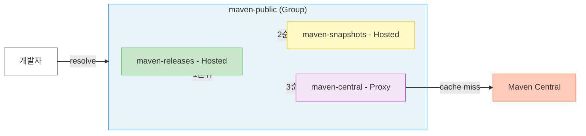
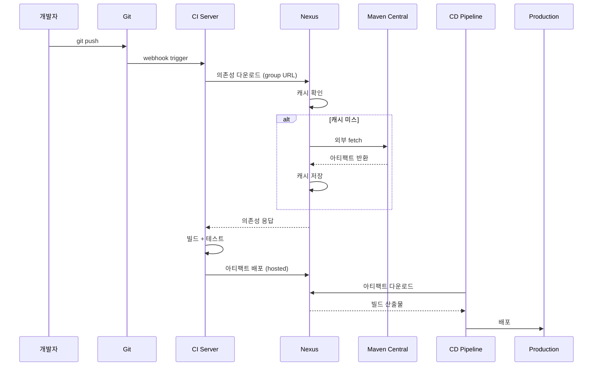

# 아티팩트 관리의 기초

---

> 아티팩트 저장소가 왜 필요한지부터 Nexus 3 내부 구조까지를 한 번에 본다. 도구 선택보다 모델을 먼저 잡는 장이다.

## 1. 아티팩트란 무엇인가

> 빌드 산출물은 소스와 다르게 다뤄야 한다. 저장 매체부터 버전 식별 체계까지 별도의 인프라가 필요하다.

소프트웨어를 빌드하면 결과물이 나온다. Java 프로젝트라면 JAR/WAR, Node.js라면 tarball, Go라면 단일 바이너리다. 이 빌드 산출물을 통틀어 **아티팩트(artifact)**라 부른다. Docker 이미지도 아티팩트이고, Helm chart도 아티팩트이며, Terraform 모듈도 결국 아티팩트에 해당한다.

여기서 한 가지 구분이 필요하다. 소스 코드는 Git에 저장하지만 아티팩트는 Git에 넣지 않는다. JAR 하나가 50MB라면 Git 히스토리가 순식간에 수 GB로 불어나고, `git clone`에 30분이 걸리는 사태가 벌어진다. Git은 텍스트 diff에 최적화돼 있지 바이너리 버전 관리에 적합하지 않다는 뜻이다. 결국 아티팩트는 아티팩트를 위한 저장소가 따로 필요해진다.

### 1.1 아티팩트의 종류

각 언어 생태계마다 아티팩트 형식이 다르다. 이 차이가 곧 아티팩트 저장소가 "포맷"을 구분하는 이유이기도 하다.

| 생태계 | 아티팩트 형식 | 확장자/형태 | 특징 |
|--------|-------------|-----------|------|
| Java/JVM | JAR, WAR, EAR | `.jar`, `.war` | ZIP 기반, 클래스파일 + 매니페스트 |
| JavaScript | npm package | `.tgz` | tarball, `package.json`이 메타데이터 |
| Python | wheel, sdist | `.whl`, `.tar.gz` | wheel은 사전 빌드, sdist는 소스 배포 |
| Go | 모듈 | 소스 zip | `go.sum`으로 무결성 검증 |
| Container | Docker/OCI image | layer + manifest | content-addressable, layer 공유 |
| IaC | Helm chart | `.tgz` | K8s 배포 단위, `Chart.yaml`이 메타데이터 |
| .NET | NuGet package | `.nupkg` | ZIP 기반, `.nuspec` 메타데이터 |
| 범용 | Raw file | 아무 파일 | 좌표 체계 없음, URL 경로가 식별자 |

JAR는 사실상 ZIP에 `.jar` 확장자를 붙인 것으로, 내부에 컴파일된 `.class`, `META-INF/MANIFEST.MF`, 리소스가 들어 있다. 실행 가능 JAR는 `Main-Class` 속성이 매니페스트에 선언돼 있어야 하고, Spring Boot의 fat JAR는 의존성까지 패키징해 50–100MB에 달한다.

Docker image는 다른 아티팩트와 구조부터 다르다. 단일 파일이 아니라 **manifest**(어떤 layer로 구성되는지)와 **layer**(파일시스템 차분)의 조합이다. 각 layer는 SHA256 해시로 식별되고 같은 내용의 layer는 여러 이미지가 공유한다. `openjdk:17-slim` 위에 10개 서비스를 올리면 base layer는 한 벌만 저장되는 셈이니, 스토리지 효율이 높다.

### 1.2 아티팩트의 생명주기

아티팩트에도 수명이 있다. 이걸 인식하지 못하면 저장소가 한없이 커지기만 한다.

```mermaid
graph LR
    BUILD["빌드 생성"] --> UPLOAD["저장소 업로드"]
    UPLOAD --> CONSUME["의존성으로 사용"]
    CONSUME --> PROMOTE["스테이징 → 릴리스 승격"]
    PROMOTE --> DEPLOY["프로덕션 배포"]
    DEPLOY --> ARCHIVE["보관/아카이브"]
    ARCHIVE --> CLEANUP["정리/삭제"]

    style BUILD fill:#e3f2fd,stroke:#1565C0,color:#333
    style UPLOAD fill:#e8f5e9,stroke:#2E7D32,color:#333
    style CONSUME fill:#fff9c4,stroke:#F9A825,color:#333
    style PROMOTE fill:#f3e5f5,stroke:#7B1FA2,color:#333
    style DEPLOY fill:#c8e6c9,stroke:#4CAF50,color:#333
    style ARCHIVE fill:#ffe0b2,stroke:#E65100,color:#333
    style CLEANUP fill:#ffcdd2,stroke:#C62828,color:#333
```

SNAPSHOT은 개발 중에 수십 번 올라갔다가 릴리스 후에는 더 이상 필요 없어진다. 30일 이상 아무도 다운로드하지 않은 SNAPSHOT은 삭제 후보로 봐도 무방하다. RELEASE는 프로덕션에서 사용 중이면 반드시 보존해야 하지만, EOL된 버전은 아카이브로 이동하거나 삭제할 수 있다. 이 생명주기를 자동화하는 것이 Nexus의 Cleanup Policy다.

### 1.3 소스 코드 vs 아티팩트

이 구분을 명확히 해두지 않으면 "Git에 JAR 넣으면 안 돼?" 같은 질문이 계속 나온다.

| 특성 | 소스 코드 (Git) | 아티팩트 (Nexus 등) |
|------|----------------|-------------------|
| 파일 유형 | 텍스트 | 바이너리 |
| 크기 | 수 KB/파일 | 수 MB ~ 수 GB/파일 |
| diff | 줄 단위 가능 | 불가능 |
| 버전 관리 | 브랜치, 태그, 커밋 | 좌표 체계 (GAV 등) |
| 접근 패턴 | 전체 히스토리 clone | 특정 버전만 다운로드 |
| 삭제 | 히스토리에 영원히 남음 | 삭제 가능 (공간 회수) |

Git LFS가 바이너리를 처리하긴 하지만, 이건 "Git의 한계를 우회하는 도구"이지 아티팩트 관리 솔루션이 아니다. GAV 좌표 기반 의존성 해결, 프록시 캐싱, 접근 제어 같은 기능이 LFS에는 없다.

## 2. 아티팩트 관리가 필요한 이유

> "그냥 슬랙에 올려서 공유하면 되지 않나"라는 질문에 대한 답이다. 시나리오로 한 번, 근본 문제로 한 번 본다.

3인 팀에서 주 1회 배포라면 슬랙 공유가 굴러갈 수도 있다. 다음 시나리오는 그 모델이 어디서 깨지는지를 시간 순으로 보여준다.

### 2.1 월·화·수 시나리오

월요일 오전 10시. 팀원 A가 공통 라이브러리 `common-utils`를 수정하고 로컬에서 `./gradlew build`를 실행한다. 생성된 `common-utils-1.0.jar`를 슬랙 `#dev-artifacts` 채널에 올린다. "utils 라이브러리 업데이트했어요."

월요일 오후 2시. 팀원 B가 그 JAR를 받아 자기 프로젝트의 `libs/`에 넣고, 잘 동작한다. 화요일 오전 A가 긴급 버그를 수정하고 같은 이름 JAR를 다시 슬랙에 올린다. 수요일 팀원 C가 채널을 스크롤하다 월요일 버전을 받는다. C의 프로젝트에서 버그가 재현되고 원인을 찾는 데 반나절이 날아간다.

2주 후. 프로덕션 장애가 터진다. "common-utils 어떤 버전 쓰고 있어?" 아무도 답하지 못한다. 슬랙에는 같은 이름 JAR가 세 개 올라와 있고 어떤 게 프로덕션에 들어간 건지 추적할 방법이 없다. 체크섬을 기록한 사람도 없다.

이 시나리오는 과장이 아니다. 아티팩트 저장소 없이 운영하는 팀에서 반복되는 패턴이다.

### 2.2 네 가지 근본 문제

위 시나리오는 다음 네 축에서 동시에 깨진다.

#### 버전 추적 불가

`payment-service-final.jar`, `payment-service-final-v2.jar`, `payment-service-진짜최종.jar`가 슬랙 채널에 쌓인다. 프로덕션에 어떤 버전이 올라갔는지 아무도 모른다. 장애가 터지면 "지난주 올렸던 그 JAR"을 찾는 데 30분이 걸린다.

#### 재현 가능한 빌드 붕괴

6개월 전 릴리스를 다시 빌드해야 하는 상황이 온다. 그때 사용한 의존성 라이브러리가 Maven Central에서 삭제됐거나 버전이 변경됐다면 동일 결과물을 다시 만들 수 없다. 아티팩트 저장소에 프록시 캐시가 있었다면 이 일은 일어나지 않는다.

#### 의존성 해결의 지옥

팀 A가 만든 공통 라이브러리를 팀 B가 사용한다. 슬랙으로 JAR를 주고받으면 Gradle/Maven이 의존성을 자동으로 해결하지 못한다. `libs/`에 수동으로 넣는 순간, 전이 의존성(transitive dependency) 관리는 포기한 셈이다. `common-utils`가 `guava:32.1`을 쓰는데, JAR만 넣으면 guava가 자동으로 딸려오지 않는다. guava JAR를 또 넣어야 하고, guava가 쓰는 라이브러리를 또 넣고… 끝이 없다.

#### 보안과 감사

누가 어떤 아티팩트를 언제 올렸는지 추적이 안 된다. 악성 코드가 포함된 패키지를 누가 올려도 알 길이 없다. 규제 산업(금융, 의료)에서는 이것만으로 감사에 걸린다. "이 바이너리가 어떤 소스에서 빌드됐는지 증명하라"는 질문에 답할 수 없으면 컴플라이언스 위반이다. SBOM(Software Bill of Materials) 요구가 강해지는 추세에서, 아티팩트 저장소의 메타데이터는 SBOM 생성의 기반이 된다.

## 3. 아티팩트 저장소의 세 가지 유형

> Nexus를 처음 잡을 때 제일 먼저 익혀야 할 모델이다. 이 구분을 이해하면 설정의 70%는 끝난다.

저장소는 크게 hosted, proxy, group 세 종류로 나뉜다. 같은 Nexus 인스턴스 안에서 역할이 다르고, 클라이언트는 보통 group만 바라본다.

### 3.1 Hosted Repository

내부에서 빌드한 아티팩트를 저장하는 곳이다. `mvn deploy`나 `npm publish`로 올리는 대상이 hosted다. 팀이 만든 공통 라이브러리, 서비스의 릴리스 아티팩트가 여기에 들어간다.

hosted는 RELEASE용과 SNAPSHOT용을 분리하는 것이 관례다. RELEASE는 한번 올리면 덮어쓸 수 없고(immutable), SNAPSHOT은 개발 중이므로 같은 버전을 반복 업로드할 수 있다. 분리하는 이유는 두 저장소의 **Write Policy**가 다르기 때문이다. RELEASE는 `ALLOW_ONCE`(한 번만 쓰기), SNAPSHOT은 `ALLOW`(반복 쓰기). 하나의 리포지토리에 하나의 Write Policy만 적용되므로 섞으면 둘 중 하나의 정책을 포기해야 한다.

### 3.2 Proxy Repository

외부 저장소를 캐싱하는 리포지토리다. Maven Central, npmjs.org, Docker Hub 같은 공개 저장소 앞에 캐싱 레이어를 두는 것이다.

비유하면 동네 편의점이다. 코카콜라 공장(Maven Central)에서 직접 사올 수도 있지만, 편의점(proxy)에 가면 이미 있다. 편의점에 없는 제품을 요청하면 편의점이 공장에서 가져다 놓고(캐싱), 다음 손님부터는 편의점 재고에서 바로 꺼내준다.

proxy의 효용은 다음 세 가지에서 나온다.

1. 빌드 속도 — 20명이 동시에 `mvn clean install`을 돌려도 외부 요청은 첫 한 번뿐이다.
2. 외부 장애 격리 — Maven Central이 다운돼도 캐시에 있으면 빌드가 멈추지 않는다.
3. 네트워크 비용 — 클라우드 환경에서 외부 트래픽(egress)은 돈이다.

### 3.3 Group Repository

hosted와 proxy를 하나로 묶어주는 가상 리포지토리다. 비유하자면 편의점·마트·온라인몰을 한 주소로 접근하는 것과 같다. 개발자는 `settings.xml`이나 `.npmrc`에 group URL 하나만 넣으면 된다. 내부 아티팩트든 외부 의존성이든 한 곳에서 해결되는 셈이다.

group의 **멤버 순서**가 중요하다. 같은 좌표의 아티팩트가 hosted에도 있고 proxy에도 있다면 순서가 앞인 쪽이 우선한다. 보통 hosted를 먼저, proxy를 나중에 배치한다. 내부 라이브러리가 우선되어야 dependency confusion 공격(외부에 같은 이름의 악성 패키지를 올리는 공격)을 막을 수 있기 때문이다.

## 4. 아티팩트 흐름 — 코드에서 프로덕션까지

> Nexus가 빌드와 배포 양쪽에서 모두 임계 경로에 놓인다는 사실을 보여준다.

개발자가 코드를 푸시하면 CI가 빌드하고, 빌드 결과물이 아티팩트 저장소에 올라가고, CD가 저장소에서 아티팩트를 꺼내 배포한다. 이 흐름을 끊김 없이 만드는 것이 아티팩트 관리의 핵심이다.

이 흐름에서 Nexus는 두 가지 역할을 동시에 수행한다. 빌드 시점에는 의존성 제공자(proxy)로, 배포 시점에는 아티팩트 저장소(hosted)로 동작한다. 이 이중 역할 때문에 Nexus가 죽으면 빌드도 배포도 전부 멈춘다. HA 구성이 중요한 이유가 여기에 있다.

## 5. Nexus vs Artifactory vs Harbor

> 아티팩트 저장소를 고를 때 후보는 보통 셋이다. 각각의 설계 철학이 다르므로 팀 상황에 맞는 선택이 필요하다.

| 항목 | Nexus Repository 3 | JFrog Artifactory | Harbor |
|------|--------------------|--------------------|--------|
| 라이선스 | OSS (무료) / Pro | OSS / Pro / Enterprise | 무료 (CNCF) |
| 지원 포맷 | Maven, npm, Docker, PyPI 등 20+ | 30+ (가장 많음) | Docker/OCI 전용 |
| 아키텍처 | Java/Karaf, 단일 노드 | Java, HA 지원 | Go, K8s 네이티브 |
| HA | Pro 라이선스 필요 | Pro 이상 | 기본 지원 |
| 보안 스캔 | Pro에서 Lifecycle (구 IQ Server) | Xray (내장, 유료) | Trivy (내장, 무료) |
| 메타데이터 | 기본 | Properties, Build Info 풍부 | OCI annotations |
| CLI 도구 | REST API | JFrog CLI (강력) | 없음 (docker CLI) |
| 가격 (연간) | OSS 무료, Pro ~$12K+ | OSS 무료, Pro ~$3K+ | 무료 |

선택 기준은 단순하게 정리할 수 있다. Docker 이미지만 관리한다면 Harbor가 깔끔하고, 다양한 포맷을 비용 없이 다루고 싶다면 Nexus OSS가 적합하다. 엔터프라이즈급 HA·Xray·빌드 통합이 필요하다면 Artifactory Pro다.

Nexus OSS를 선택하는 팀이 많은 이유는 가성비 때문이다. 무료이면서 Maven·npm·Docker·PyPI를 모두 지원하고, 설치가 단순하며, 메모리 2GB면 돌아간다. 중소 규모 팀에서 비용 대비 효용이 가장 크다. Artifactory는 메타데이터와 빌드 통합이 강점이지만 의미 있는 기능 대부분이 유료다. Harbor는 Docker/OCI 전용이라는 점이 명확한 차별점이며 K8s 네이티브로 설계돼 Trivy 기반 이미지 스캔이 무료로 포함된다.

## 6. Nexus Repository Manager 3 아키텍처

> 내부 구조를 한 번 훑어두면 운영 중 문제 진단이 훨씬 수월해진다.

### 6.1 런타임 — Karaf/OSGi 컨테이너

Nexus 3은 Java 애플리케이션이다. Apache Karaf(OSGi 컨테이너) 위에서 동작하며, 번들 단위로 기능이 로드된다. 시작 시간이 1–2분 걸리는 이유가 여기 있다. 수십 개의 OSGi 번들이 순차적으로 초기화되기 때문이다.

OSGi가 낯설다면 Java 세계의 "플러그인 시스템"이라고 보면 된다. 각 기능(Maven 포맷 지원, Docker 포맷 지원, 보안 모듈 등)이 독립된 번들로 패키징돼 있고, 런타임에 동적으로 로드/언로드할 수 있다. Nexus OSS와 Pro의 차이도 실은 로드되는 번들이 다른 것이다. Pro 라이선스를 적용하면 HA, Replication 같은 추가 번들이 활성화되는 구조다.

기본 JVM 힙은 `-Xms2703m -Xmx2703m`으로 설정돼 있다. 리포지토리 수가 50개를 넘거나 Docker 이미지를 대량으로 다루면 4–8GB로 늘려야 할 수 있다. Direct memory(`-XX:MaxDirectMemorySize`)도 별도로 할당되므로, 실제 메모리 사용량은 힙 설정의 1.5–2배로 잡아야 한다.

### 6.2 데이터베이스 — OrientDB에서 H2로

Nexus 3 초기 버전은 OrientDB를 내장 DB로 사용했다. 리포지토리 메타데이터, 사용자 정보, 보안 설정이 OrientDB에 저장됐다. 그러다 OrientDB 프로젝트의 유지보수 불확실성이 커지면서 H2 데이터베이스로 마이그레이션됐다(3.71.0+부터 H2가 기본). SAP 인수 후 커뮤니티 활동이 줄고 보안 패치 주기가 불안정해진 것이 결정적이었다. H2는 Java 생태계에서 오래 검증됐고 임베디드 모드 안정성이 뛰어나다. 마이그레이션 도구(`nexus-db-migrator`)가 기존 OrientDB 데이터를 H2로 변환해 준다.

H2 DB 파일은 `$NEXUS_DATA/db/`에 저장된다. 주요 데이터베이스는 세 개다.

- `component` — 아티팩트 메타데이터 (GAV 좌표, 체크섬, 파일 크기)
- `config` — 리포지토리 설정, 스케줄 태스크, Blob Store 설정
- `security` — 사용자, 역할, 권한, Realm 설정

### 6.3 Blob Store — 바이너리 저장소

실제 아티팩트 바이너리(JAR, Docker layer 등)는 DB가 아니라 Blob Store에 저장된다. 구현은 두 가지다.

- File — 로컬 파일시스템. 기본값이며 대부분의 환경에서 충분하다.
- S3 — AWS S3 호환 스토리지. 대용량이거나 내구성이 중요할 때 선택한다.

Blob Store와 DB의 관계를 이해해야 한다. DB에는 메타데이터(이름, 버전, 체크섬, 경로)가 들어가고 Blob Store에는 실제 파일이 들어간다. DB를 잃으면 Blob Store의 파일이 있어도 복구가 어렵다. 백업 시 DB와 Blob Store를 함께 백업해야 하는 이유다. 반대로 Blob Store 없이 DB만 있으면 "메타데이터는 있는데 파일이 없다"는 missing blob 오류가 발생한다.

File 구현을 좀 더 들여다보면, 아티팩트 하나당 두 파일이 생긴다. `.bytes`(실제 바이너리)와 `.properties`(SHA1, 크기, 생성 시간 등 메타데이터)다. 이 파일들은 해시 기반 디렉토리 구조로 분산 저장돼 단일 디렉토리에 파일이 몰리는 것을 방지한다.

### 6.4 보안 모델

Nexus의 보안은 세 계층으로 구성된다.

1. **Realm** — 인증 방식 (Local, LDAP, Docker Bearer Token 등). 여러 Realm을 동시에 활성화하고 순서대로 시도한다.
2. **Role** — 권한 묶음 (`nx-admin`, `nx-anonymous` 등). 역할 상속이 가능하다.
3. **Privilege** — 개별 권한 (리포지토리 읽기, 쓰기, 관리 등). Content Selector와 결합하면 경로 레벨까지 세밀하게 제어된다.

## 7. 저장소 설계 원칙

> 처음 구성할 때 따라야 할 원칙들이다. 한 번 정착되면 바꾸기 어려우므로 초기에 잡는다.

다섯 가지 원칙으로 정리된다.

1. 포맷별로 분리한다. Maven과 npm을 한 리포지토리에 섞지 않는다. 메타데이터 구조와 해석 규칙이 다르기 때문이다.
2. 환경별로 분리한다. development와 production 아티팩트를 같은 hosted에 넣지 않는다. SNAPSHOT은 dev, RELEASE는 prod 후보다.
3. proxy는 넉넉하게, hosted는 보수적으로 만든다. proxy는 외부 저장소마다 하나씩 만들어도 괜찮지만 hosted는 명확한 목적이 있을 때만 추가한다.
4. group으로 클라이언트를 단순하게 한다. 개발자가 알아야 할 URL은 group 하나뿐이어야 한다. 내부 구조를 클라이언트에 노출하지 않는다.
5. Blob Store를 포맷별로 분리한다. Docker 이미지는 수 GB 단위로 쌓이는데 Maven JAR와 같은 Blob Store에 넣으면 디스크 예측이 어렵다. 최소한 Docker는 별도 Blob Store가 권장된다.

## 8. 정리

| 개념 | 핵심 |
|------|------|
| 아티팩트 | 빌드 산출물. Git이 아닌 전용 저장소에 보관 |
| 생명주기 | 빌드 → 업로드 → 소비 → 승격 → 배포 → 아카이브 → 정리 |
| Hosted | 내부 빌드 결과물 저장. RELEASE(불변) + SNAPSHOT(가변) 분리 |
| Proxy | 외부 저장소 캐싱. 속도, 안정성, 비용 절감 |
| Group | hosted + proxy를 한 URL로 통합. 클라이언트 단순화 |
| Blob Store | 바이너리 실체 저장 (File 또는 S3) |
| DB | 메타데이터 저장 (H2). component/config/security |
| Nexus 3 | Java/Karaf/OSGi, 플러그인 구조, OSS/Pro 이중 라이선스 |
| Artifactory | 메타데이터 풍부, Xray 보안 스캔, JFrog CLI |
| Harbor | Docker/OCI 전용, Trivy 무료 스캔, K8s 네이티브 |
| 설계 원칙 | 포맷별·환경별 분리, group으로 단순화, Blob Store 분리 |

아티팩트 관리는 편의 기능이 아니라 소프트웨어 공급망의 기반 인프라다. 팀이 10명을 넘거나 서비스가 3개 이상이면 아티팩트 저장소 없이 운영하는 것 자체가 기술 부채를 쌓는 행위에 해당한다.

## 관련 문서

- [01-02.설치와 배포 환경](01-02.설치와 배포 환경.md) — 본 장에서 정의한 모델을 실제 인스턴스로 띄우는 방법
- [01-점검.핵심 질문과 답](01-점검.핵심 질문과 답.md) — 본 장 핵심 통찰을 Q&A로 점검
