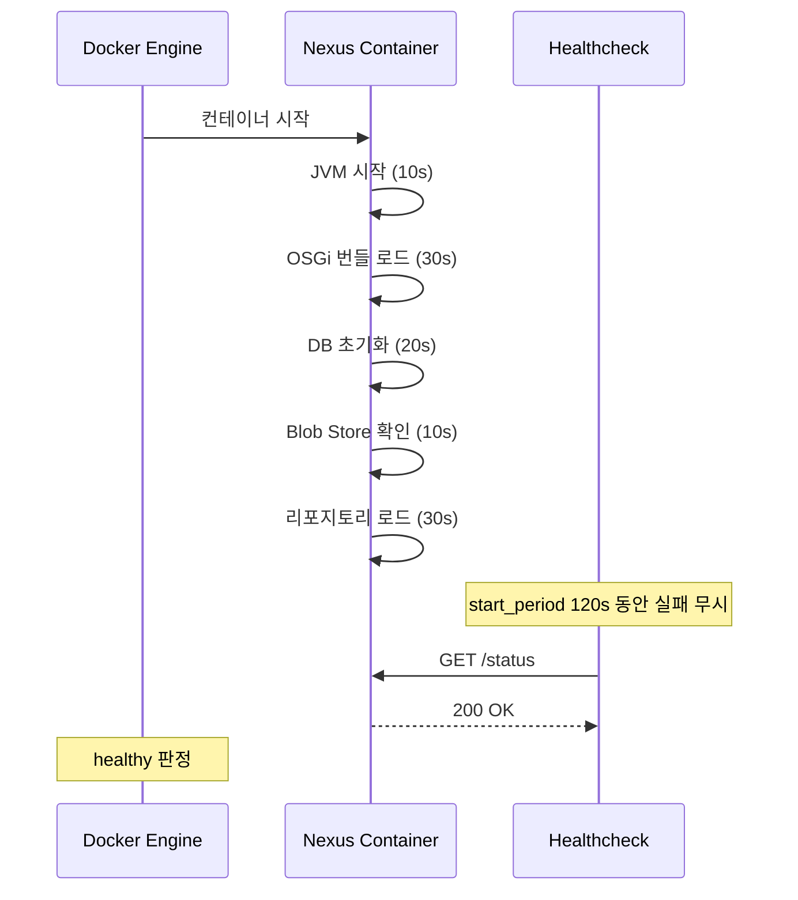
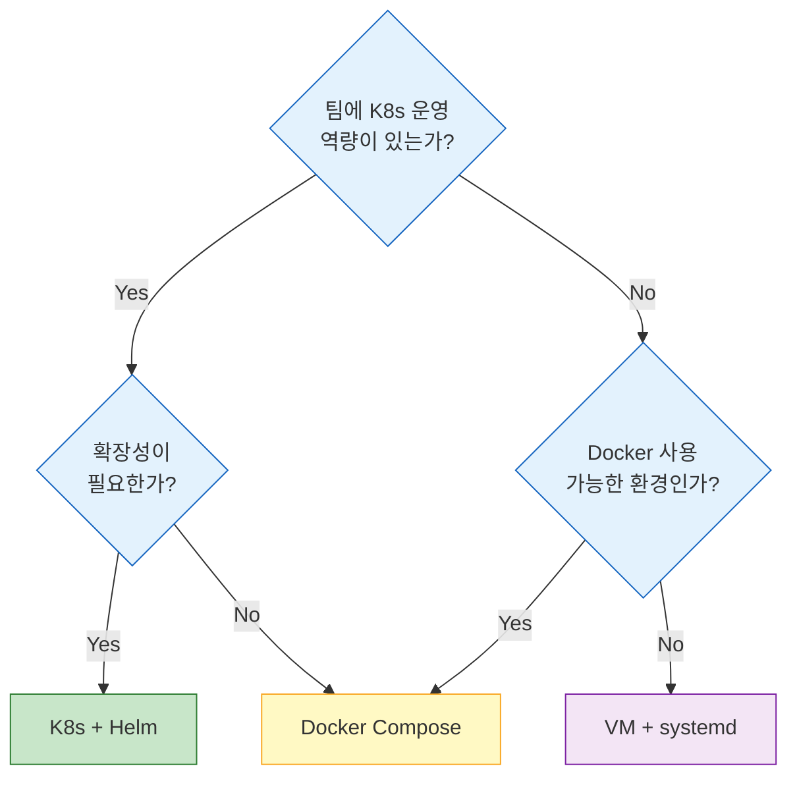

# 설치와 배포 환경

---

> Nexus를 VM·Docker·K8s 중 어디에 띄울지, JVM과 디스크는 어떻게 잡을지를 정한다. 모든 환경에서 공통으로 등장하는 함정도 함께 본다.


## 1. 시스템 요구사항

> 하드웨어 요구사항을 잘못 잡으면 운영 중 OOM이나 디스크 풀로 고생한다. 메모리 산정과 디스크 선택이 핵심이다.

| 항목 | 최소 | 권장 (50+ 사용자) |
|------|------|-------------------|
| JVM | Java 8 또는 11 (Nexus 번들 JRE 포함) | 번들 JRE 사용 |
| CPU | 4 core | 8+ core |
| RAM | 4GB (heap 2GB) | 8–16GB |
| 디스크 | 50GB | 500GB+ SSD (Blob Store 크기에 비례) |
| OS | Linux, macOS, Windows | Linux 권장 |

여기서 흔히 간과하는 것이 **MaxDirectMemorySize**다. Nexus는 JVM heap 외에 direct memory를 별도로 사용한다. Blob Store I/O에 NIO를 쓰기 때문인데, 이 값을 명시하지 않으면 JVM이 heap과 동일한 크기로 잡아서 실제 메모리 사용량이 예상의 두 배가 될 수 있다. 보통 heap의 2/3 정도가 적절하다.

디스크 선택도 성능에 직접 영향을 준다. Blob Store가 HDD 위에 있으면 아티팩트 업로드/다운로드에서 I/O 병목이 생기고, 특히 Docker 이미지처럼 레이어가 많은 대용량 아티팩트에서 체감이 크다. SSD를 쓸 수 없는 환경이라면 최소한 DB(`nexus-data/db/`)만이라도 SSD에 두자. H2 인덱스 조회가 응답 시간의 상당 부분을 차지하기 때문이다.

네트워크 측면에서는 Nexus가 proxy 리포지토리를 통해 외부 레지스트리(Maven Central, npmjs.org 등)와 통신하므로 아웃바운드 HTTP/HTTPS 접근이 가능해야 한다. 방화벽이나 사내 프록시 환경에서는 `nexus.properties`에 HTTP proxy를 추가하거나 `Administration → System → HTTP`에서 등록해야 외부 캐싱이 동작한다.


## 2. VM 설치 — 전통적이지만 확실한 방법

> 가장 단순한 설치다. tarball을 풀고 systemd로 묶으면 끝난다.

### 2.1 설치 과정

```bash
# 다운로드 및 압축 해제
cd /opt
wget https://download.sonatype.com/nexus/3/nexus-3.x.x-xx-unix.tar.gz
tar -xzf nexus-3.x.x-xx-unix.tar.gz

# 디렉토리 구조
# /opt/nexus-3.x.x-xx/    ← 애플리케이션 바이너리
# /opt/sonatype-work/      ← 데이터 (DB, Blob Store, 로그)

# 전용 사용자 생성 (root 실행 금지)
useradd -r -m -d /opt/sonatype-work nexus
chown -R nexus:nexus /opt/nexus-3.x.x-xx /opt/sonatype-work

# 실행
su - nexus -c '/opt/nexus-3.x.x-xx/bin/nexus run'
```

root로 실행하면 안 되는 이유는 명확하다. Nexus가 보안 취약점에 노출되면 공격자가 root 권한을 얻게 된다. 최소 권한 원칙(Principle of Least Privilege)의 기본이다.

실무에서 자주 겪는 실수 한 가지가 설치 디렉토리와 데이터 디렉토리를 같은 파티션에 두는 것이다. Blob Store가 커지면서 디스크를 가득 채우면 애플리케이션 바이너리가 있는 파티션까지 영향을 받아 Nexus가 시작조차 안 될 수 있다. `/opt/nexus-3.x.x-xx`(바이너리)와 `/opt/sonatype-work`(데이터)를 별도 파티션이나 볼륨에 마운트하는 것이 안전하다.

### 2.2 systemd 서비스 등록

프로덕션에서는 수동 실행이 아니라 systemd로 관리한다. 재부팅 시 자동 시작과 크래시 시 자동 재시작이 보장된다.

```ini
# /etc/systemd/system/nexus.service
[Unit]
Description=Nexus Repository Manager
After=network.target

[Service]
Type=forking
LimitNOFILE=65536
User=nexus
Group=nexus
ExecStart=/opt/nexus-3.x.x-xx/bin/nexus start
ExecStop=/opt/nexus-3.x.x-xx/bin/nexus stop
Restart=on-failure
RestartSec=10

[Install]
WantedBy=multi-user.target
```

`LimitNOFILE=65536`이 핵심이다. Nexus는 Blob Store 접근 시 많은 파일 디스크립터를 사용하는데, 기본값(1024)으로는 부족해서 `Too many open files` 에러가 발생할 수 있다.

### 2.3 JVM 튜닝

`/opt/nexus-3.x.x-xx/bin/nexus.vmoptions`에서 JVM 파라미터를 조정한다.

```text
-Xms2703m
-Xmx2703m
-XX:MaxDirectMemorySize=2703m
-XX:+UnlockDiagnosticVMOptions
-XX:+LogVMOutput
-XX:LogFile=../sonatype-work/nexus3/log/jvm.log
```

heap과 direct memory를 동일하게 설정하는 것이 Sonatype 공식 권장이다. 전체 OS 메모리의 절반 이상을 Nexus에 할당하지 않도록 주의해야 한다. OS 캐시와 다른 프로세스도 메모리를 필요로 하기 때문이다.

GC 설정도 성능에 영향을 미친다. Nexus 3.x 번들 JRE는 기본 G1GC를 사용하는데, heap이 4GB 이상이면 G1GC가 적절하고 그 이하라면 ParallelGC도 고려할 수 있다. 프로덕션에서는 GC 로그를 활성화해 OOM이나 긴 pause 원인을 추적할 수 있도록 `-Xlog:gc*:file=../sonatype-work/nexus3/log/gc.log`를 추가하자.


## 3. Docker 설치 — 이식성과 재현성

> 공식 이미지를 사용하면 기본 실행은 한 줄이지만, 프로덕션에 그대로 쓸 수는 없다. 메모리·볼륨·헬스체크가 함께 잡혀야 한다.

### 3.1 기본 실행과 그 한계

```bash
docker run -d \
  --name nexus \
  -p 8081:8081 \
  -v nexus-data:/nexus-data \
  sonatype/nexus3:latest
```

이 한 줄로 Nexus가 뜨긴 하지만 프로덕션에는 부족하다. JVM 파라미터, 볼륨 권한, 헬스체크가 빠져 있기 때문이다.

### 3.2 JVM 파라미터 설정

Docker 환경에서는 `INSTALL4J_ADD_VM_PARAMS` 환경변수로 JVM 파라미터를 전달한다.

```bash
docker run -d \
  --name nexus \
  -p 8081:8081 \
  -e INSTALL4J_ADD_VM_PARAMS="\
    -Xms1200m -Xmx1200m \
    -XX:MaxDirectMemorySize=2g \
    -Djava.util.prefs.userRoot=/nexus-data/javaprefs" \
  -v nexus-data:/nexus-data \
  sonatype/nexus3:latest
```

컨테이너 메모리 limit과 JVM heap을 맞추는 것이 중요하다. 컨테이너에 4GB를 할당했는데 heap을 3.5GB로 잡으면 direct memory + native memory가 500MB 안에서 해결돼야 한다. 이게 부족하면 OOM Killer가 컨테이너를 죽인다.

### 3.3 데이터 영속화

named volume과 bind mount 중 무엇을 쓸지 정해야 한다. Docker가 볼륨 생명주기를 관리해 주길 원하면 named volume이 편하고, 호스트의 특정 디렉토리를 사용하거나 백업 스크립트가 호스트 경로를 직접 참조해야 하면 bind mount가 낫다. K8s 환경이라면 어차피 PVC를 쓰므로 이 선택은 무의미해진다.

bind mount 사용 시 UID 문제를 조심해야 한다. Nexus 공식 이미지는 UID 200(`nexus` 사용자)으로 실행된다. 호스트 디렉토리의 소유자가 다르면 Permission denied로 시작조차 안 된다.

```bash
chown -R 200:200 /srv/nexus-data
```

### 3.4 시작 시간과 Healthcheck

Nexus 컨테이너가 뜨고 나서 실제로 요청을 받기까지 1–2분이 걸린다. 이 시간 동안 일어나는 일은 다음과 같다.

1. JVM 시작 및 클래스 로딩
2. OSGi 번들 초기화 (수십 개)
3. H2 데이터베이스 로드 및 검증
4. Blob Store 마운트 확인
5. 리포지토리 구성 로드
6. 스케줄러 태스크 초기화

이 과정이 끝나야 8081 포트가 200을 반환한다. Docker Compose에서 healthcheck를 설정할 때 `start_period`를 충분히 줘야 하는 이유다.

```yaml
healthcheck:
  test: ["CMD", "curl", "-f", "http://localhost:8081/service/rest/v1/status"]
  interval: 30s
  timeout: 10s
  retries: 5
  start_period: 120s
```

`start_period: 120s`는 "처음 2분은 healthcheck 실패해도 unhealthy로 판정하지 마라"는 의미다. 이걸 안 주면 Nexus가 아직 초기화 중인데 Docker가 unhealthy로 마킹하고 오케스트레이터가 재시작하는 무한 루프에 빠질 수 있다.




## 4. K8s 배포 — 확장성이 필요할 때

> 설정량은 늘지만 자동 복구와 선언적 관리를 얻는다. 단, Nexus OSS는 단일 노드 모델이라는 점은 변하지 않는다.

### 4.1 StatefulSet 기본 형태

```yaml
apiVersion: apps/v1
kind: StatefulSet
metadata:
  name: nexus
spec:
  serviceName: nexus
  replicas: 1
  template:
    spec:
      containers:
      - name: nexus
        image: sonatype/nexus3:latest
        ports:
        - containerPort: 8081
        resources:
          requests:
            memory: "4Gi"
            cpu: "2"
          limits:
            memory: "4Gi"
            cpu: "4"
        volumeMounts:
        - name: nexus-data
          mountPath: /nexus-data
  volumeClaimTemplates:
  - metadata:
      name: nexus-data
    spec:
      accessModes: ["ReadWriteOnce"]
      resources:
        requests:
          storage: 100Gi
```

Deployment가 아니라 StatefulSet을 쓰는 이유는 분명하다. Nexus는 상태를 가진 애플리케이션이고, PVC에 저장한 데이터에 Pod 재시작 후에도 다시 연결돼야 한다. Deployment + PVC 조합도 `replicas=1`이면 동작하지만, StatefulSet이 상태 있는 워크로드의 의도를 더 명확히 표현한다.

### 4.2 resource limits

`requests`와 `limits`의 memory를 같게 설정하는 점에 주목하자. JVM 기반 애플리케이션은 메모리 사용량이 예측 가능하므로 burstable보다 Guaranteed QoS 클래스가 적합하다. OOM Killer에 의한 예기치 않은 종료를 방지할 수 있다.

### 4.3 Ingress 설정

```yaml
apiVersion: networking.k8s.io/v1
kind: Ingress
metadata:
  name: nexus
  annotations:
    nginx.ingress.kubernetes.io/proxy-body-size: "0"
    nginx.ingress.kubernetes.io/proxy-read-timeout: "600"
spec:
  rules:
  - host: nexus.example.com
    http:
      paths:
      - path: /
        pathType: Prefix
        backend:
          service:
            name: nexus
            port:
              number: 8081
```

`proxy-body-size: "0"`은 업로드 크기 제한을 없앤다. Docker 이미지나 대용량 아티팩트를 push할 때 기본 1MB 제한에 걸리면 낭패다. `proxy-read-timeout: "600"`도 같은 맥락이다. 큰 파일 업로드 시 기본 60초로는 중간에 끊긴다.

### 4.4 Helm Chart 활용

직접 YAML을 짜는 대신 Sonatype 공식 Helm Chart도 쓸 수 있다. `sonatype/nexus-repository-manager` 차트가 공식 제공되며, `values.yaml`로 대부분의 설정을 조정한다.

```bash
helm repo add sonatype https://sonatype.github.io/helm3-charts/
helm install nexus sonatype/nexus-repository-manager \
  --set nexus.resources.requests.memory=4Gi \
  --set nexus.resources.limits.memory=4Gi \
  --set persistence.storageSize=100Gi
```

Helm Chart를 쓰면 Ingress, PVC, ConfigMap, readiness/liveness probe가 미리 구성돼 있어 빠뜨리는 설정이 줄어든다. 다만 Chart 버전과 Nexus 이미지 버전의 호환성을 반드시 확인해야 한다. Chart가 지원하지 않는 Nexus 버전을 강제로 쓰면 probe 경로가 달라져서 Pod이 계속 재시작되는 상황이 벌어진다.

### 4.5 K8s 운영 시 흔한 실수

| 문제 | 원인 | 해결 |
|------|------|------|
| Pod CrashLoopBackOff | JVM 메모리 > 컨테이너 limit | limits와 JVM heap+direct memory 합산 일치 확인 |
| PVC 용량 부족 | StorageClass에 `allowVolumeExpansion` 미설정 | SC 수정 후 `kubectl edit pvc`로 확장 |
| 업로드 실패 (413) | Ingress body size 제한 | `proxy-body-size: "0"` 설정 |
| 시작 시간 초과 | readinessProbe `initialDelaySeconds` 부족 | 120–180초로 설정 |
| DNS 기반 proxy 리포 실패 | CoreDNS에서 외부 도메인 resolve 불가 | CoreDNS upstream 설정 확인 |


## 5. 환경별 비교

> 정답은 팀 상황에 따라 다르다. 다만 단순성·이식성·복구 측면에서 Docker Compose가 무난한 출발점이다.



| 기준 | VM | Docker | K8s |
|------|-----|--------|-----|
| 설치 난이도 | 낮음 | 낮음 | 높음 |
| 이식성 | 낮음 | 높음 | 높음 |
| 업그레이드 | 수동 | 이미지 교체 | 롤링 업데이트 |
| 자동 복구 | systemd restart | restart policy | Pod 재스케줄링 |
| 모니터링 | 수동 구성 | docker stats | Prometheus 통합 |
| 적합한 팀 | 소규모, 보수적 | 대부분의 팀 | K8s 운영 경험 보유 |

대부분의 팀에는 Docker Compose면 충분하다. Nexus는 보통 `replicas=1`로 운영하고 K8s의 오토스케일링이 필요한 워크로드가 아니다. K8s를 이미 쓰고 있는 조직이라면 자연스럽게 K8s에 올리지만, Nexus 하나 때문에 K8s를 도입하는 것은 과한 결정이다.


## 6. Reverse Proxy 구성

> Nexus를 직접 인터넷에 노출하지 않는다. proxy를 두는 이유는 TLS·접근 제어·Docker 포트 분리 세 가지다.

| 이유 | 내용 |
|------|------|
| TLS 종단 | Java keystore보다 nginx/HAProxy가 인증서 갱신과 성능 면에서 유리 |
| 접근 제어 | IP 제한, rate limiting을 proxy 레벨에서 적용 |
| Docker 포트 분리 | hosted/proxy/group 별 포트(8082, 8083 등)를 호스트명으로 라우팅 |

```nginx
# /etc/nginx/conf.d/nexus.conf
server {
    listen 443 ssl;
    server_name nexus.example.com;

    ssl_certificate     /etc/ssl/certs/nexus.pem;
    ssl_certificate_key /etc/ssl/private/nexus.key;

    client_max_body_size 0;
    proxy_read_timeout 600;
    proxy_send_timeout 600;

    location / {
        proxy_pass http://localhost:8081;
        proxy_set_header Host $host;
        proxy_set_header X-Real-IP $remote_addr;
        proxy_set_header X-Forwarded-For $proxy_add_x_forwarded_for;
        proxy_set_header X-Forwarded-Proto $scheme;
    }
}
```

`client_max_body_size 0`이 핵심이다. nginx 기본값은 1MB인데 Docker 이미지 하나가 수백 MB일 수 있으니 제한을 해제해야 한다.

Docker Registry로 Nexus를 사용하는 경우, hosted/proxy/group 리포지토리마다 별도의 HTTP 포트를 할당한다. 예컨대 hosted는 8082, group은 8083 식이다. nginx에서 서브도메인 라우팅으로 깔끔하게 처리할 수 있다.

```nginx
server {
    listen 443 ssl;
    server_name docker-hosted.example.com;
    location / { proxy_pass http://localhost:8082; }
}

server {
    listen 443 ssl;
    server_name docker-group.example.com;
    location / { proxy_pass http://localhost:8083; }
}
```

이 방식이 포트 번호를 직접 노출하는 것보다 낫다. 개발자가 `docker login docker-hosted.example.com`으로 접속하면 되니 포트 번호를 외울 필요가 없고, TLS도 nginx에서 통합 관리된다.


## 7. 초기 설정

> 처음 시작하면 반드시 해야 할 설정이 있다. 빠뜨리면 보안 사고나 URL 오작동으로 이어진다.

### 7.1 admin 비밀번호

최초 admin 비밀번호는 파일에 생성된다.

```bash
# Docker
docker exec nexus cat /nexus-data/admin.password

# VM
cat /opt/sonatype-work/nexus3/admin.password
```

이 비밀번호로 로그인한 뒤 즉시 변경한다. 변경하면 `admin.password` 파일이 자동 삭제된다.

### 7.2 Anonymous Access

Nexus는 기본적으로 Anonymous Access를 활성화한다. 인증 없이도 아티팩트를 다운로드할 수 있다는 뜻이다. 내부 네트워크에서만 접근 가능한 환경이라면 켜두는 게 편하다. 개발자마다 `settings.xml`에 인증 정보를 넣지 않아도 되기 때문이다. 외부에서 접근 가능한 환경이라면 반드시 비활성화하고 인증을 강제해야 한다.

### 7.3 Base URL

Reverse proxy를 사용한다면 Nexus가 자신의 외부 URL을 알아야 한다. `Administration → System → HTTP`에서 Base URL을 `https://nexus.example.com`으로 설정한다. 빠뜨리면 Nexus가 생성하는 URL(Docker Registry pull 명령어 등)이 내부 IP로 나온다.


## 8. 업그레이드 전략

> downtime 없이 가는 길은 좁다. Blob Store 동시 접근 금지가 가장 중요한 제약이다.

### 8.1 VM 업그레이드

순서는 단순하다.

1. Nexus 중지
2. 데이터 백업 (`sonatype-work` 전체)
3. 새 버전 tarball 압축 해제 (기존 디렉토리 덮어쓰기 가능)
4. Nexus 시작

downtime이 불가피하다. 백업 없이 업그레이드하는 건 도박이니 절대 하지 않는다.

### 8.2 Docker 업그레이드

```bash
docker stop nexus
docker rm nexus
docker pull sonatype/nexus3:3.xx.x
docker run -d --name nexus -v nexus-data:/nexus-data ... sonatype/nexus3:3.xx.x
```

named volume에 데이터가 남으므로 컨테이너를 삭제해도 데이터는 보존된다. 하지만 업그레이드 전 volume 백업은 필수다.

blue-green 방식도 가능하다. 새 컨테이너를 다른 포트로 띄워 확인한 뒤 proxy를 전환하면 된다. 다만 Blob Store를 공유하면 동시 접근으로 데이터 손상 위험이 있다. 같은 Blob Store를 두 인스턴스가 동시에 사용해서는 안 된다.


## 9. 정리

| 항목 | 핵심 포인트 |
|------|------------|
| 시스템 요구사항 | heap + direct memory 합산을 OS 메모리의 50% 이내로 |
| VM 설치 | systemd 등록, 전용 사용자, `LimitNOFILE` 설정 필수 |
| Docker | `INSTALL4J_ADD_VM_PARAMS`로 JVM 설정, UID 200, `start_period: 120s` |
| K8s | StatefulSet + PVC, Guaranteed QoS, Ingress body size 0 |
| Reverse proxy | TLS 종단, `client_max_body_size 0`, X-Forwarded 헤더 |
| 초기 설정 | admin 비밀번호 변경, Anonymous Access 결정, Base URL |
| 업그레이드 | 반드시 백업 후 진행, 같은 Blob Store 동시 접근 금지 |

설치 자체는 어렵지 않다. 진짜 작업은 운영이다. JVM 튜닝, 디스크 모니터링, 백업 자동화, 업그레이드 계획이 설치만큼 중요하다.

설치 직후 첫 점검은 `/service/rest/v1/status`와 `/service/rest/v1/status/writable` 엔드포인트 호출이다. 전자는 읽기 가능 상태인지, 후자는 쓰기 가능 상태인지 확인해 준다. 모니터링 도구의 healthcheck 대상으로 두 엔드포인트를 등록해두면 장애를 빠르게 감지할 수 있다.


## 관련 문서

- [01-01.아티팩트 관리의 기초](01-01.아티팩트 관리의 기초.md) — Hosted/Proxy/Group 모델과 본 장에서 다룬 메모리 산정의 배경
- [01-점검.핵심 질문과 답](01-점검.핵심 질문과 답.md) — VM/Docker/K8s 선택, MaxDirectMemorySize, start_period 근거를 점검
