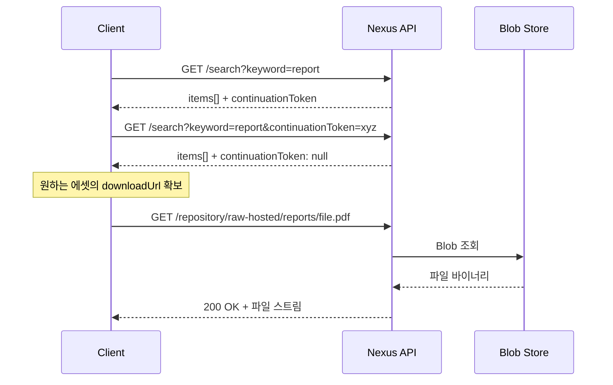
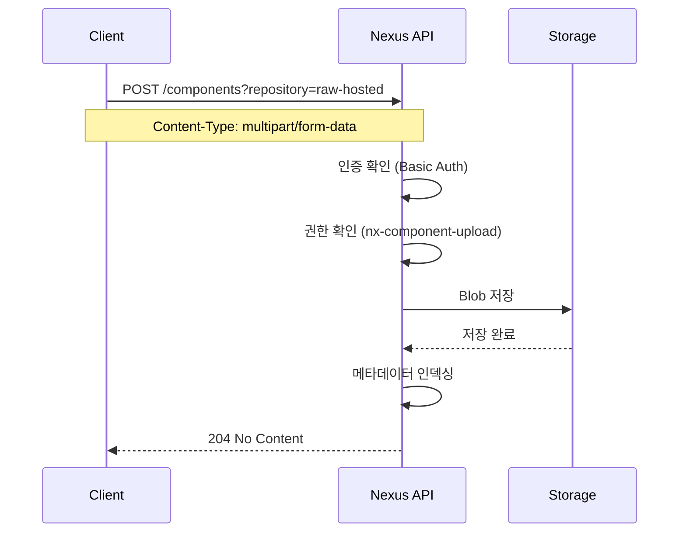

# REST API와 웹 통합

---

> 자동화·커스텀 UI·CI 연동의 출발점이다. continuationToken·multipart 업로드·CORS 세 함정을 알면 대부분 막히지 않는다.


## 1. 왜 REST API인가

> Nexus UI는 관리자에게 적합하지만 자동화와 커스텀 연동의 기반은 REST API다.

"우리 프로젝트에서 쓰는 라이브러리 버전 목록을 한눈에 보고 싶다"거나 "CI/CD에서 빌드 산출물을 자동으로 올리고 싶다"는 요구는 UI로 해결되지 않는다. Nexus는 v1 REST API를 제공하며, 모든 엔드포인트 명세는 Swagger UI에서 확인할 수 있다. 브라우저에서 `http://localhost:8081/service/rest/swagger.json`을 열거나 UI 메뉴의 `System → API`로 들어가면 인터랙티브 문서가 나온다.

API 기본 경로는 `/service/rest/v1/`이고 주요 리소스는 `repositories`, `components`, `assets`, `search`, `security/users`다.

Swagger UI는 단순 명세 뷰어를 넘어선다. `http://localhost:8081/#admin/system/api`에서 상단 Authorize 버튼에 admin 계정을 입력하면 페이지 안에서 바로 API를 호출할 수 있다. "Try it out"이 생성하는 curl 명령어는 인코딩과 헤더가 정확하게 들어가 있으므로 복사해서 스크립트에 옮기는 것이 빠른 출발점이다. 다만 Swagger UI 자체에 관리자 권한이 필요하다는 점을 기억한다. 개발 초기에 구조 파악은 admin으로, 실제 호출은 적절한 권한 계정으로 분리한다.


## 2. 인증 방식

> Basic Auth가 OSS의 기본이고, User Token은 Pro 전용이다. CI/CD에서는 토큰이 정답이지만 OSS라면 서비스 계정으로 대체한다.

### 2.1 Basic Auth

가장 단순한 방식이다. HTTP 헤더에 `Authorization: Basic <base64(user:password)>`를 넣으면 된다.

```bash
curl -u admin:admin123 http://localhost:8081/service/rest/v1/status
```

Base64는 인코딩이지 암호화가 아니다. HTTPS 없이 사용하면 네트워크 스니핑에 그대로 노출되므로 로컬 개발 외에는 반드시 HTTPS와 함께 쓴다.

CI/CD에서는 환경변수 주입이 표준이다. Jenkins라면 `withCredentials` 블록 안에서 `NEXUS_USER`, `NEXUS_PASS`를 바인딩하고 `curl -u $NEXUS_USER:$NEXUS_PASS`로 사용한다. 스크립트에 비밀번호를 하드코딩하면 안 된다.

### 2.2 User Token (Pro)

Nexus Pro에서는 비밀번호 대신 토큰 쌍(nameCode + passCode)을 발급받아 사용한다. 토큰은 비밀번호 변경과 독립적이고 개별 폐기가 가능하므로 CI/CD 서비스 계정에 적합하다.

| 구분 | Basic Auth | User Token (Pro) |
|------|-----------|-----------------|
| 인증 수단 | 사용자 비밀번호 | nameCode + passCode |
| 비밀번호 변경 시 | 모든 사용처 업데이트 필요 | 영향 없음 |
| 개별 폐기 | 불가 (비밀번호 변경만) | 가능 |
| 유출 대응 | 비밀번호 변경 → 전체 영향 | 토큰만 폐기 → 해당 서비스만 영향 |
| 적합 환경 | 로컬 개발, 소규모 팀 | CI/CD, 서비스 계정 |

OSS 환경이라면 서비스 전용 계정을 만들어 Vault나 AWS Secrets Manager로 비밀번호를 일원화하고, 변경 시 모든 CI 파이프라인에 자동 반영되게 만드는 것이 현실적인 대안이다.


## 3. 핵심 엔드포인트

> 상태·리포지토리·컴포넌트·에셋·검색·업로드·삭제 — 일곱 갈래가 전부다.

### 3.1 상태 확인

서버가 살아 있는지 확인하는 용도로 헬스체크 자동화에 쓴다.

```bash
# 200 OK면 정상, 503이면 아직 기동 중
curl -s -o /dev/null -w "%{http_code}" \
  http://localhost:8081/service/rest/v1/status

# 쓰기 가능 상태 (read-only 모드 감지)
curl -s -o /dev/null -w "%{http_code}" \
  http://localhost:8081/service/rest/v1/status/writable

# 상세 헬스체크
curl -u admin:admin123 \
  http://localhost:8081/service/rest/v1/status/check
```

로드밸런서 헬스체크에는 `/status`로 충분하지만, 배포 자동화에서 "Nexus가 완전히 준비되었는가"를 판단할 때는 `/status/writable`이 더 정확하다.

### 3.2 리포지토리 관리

```bash
# 전체 리포지토리 목록
curl -u admin:admin123 \
  http://localhost:8081/service/rest/v1/repositories

# 특정 리포지토리 상세
curl -u admin:admin123 \
  http://localhost:8081/service/rest/v1/repositories/maven-releases
```

응답은 JSON 배열이며 각 항목에 `name`, `format`, `type`(hosted/proxy/group), `url`이 포함된다. 이 목록으로 UI 드롭다운을 채우거나 특정 포맷의 리포지토리만 필터링한다.

리포지토리를 REST API로 생성하면 Infrastructure as Code가 된다. JSON으로 버전 관리하고 Git에 커밋할 수 있다.

```bash
curl -u admin:admin123 -X POST \
  "http://localhost:8081/service/rest/v1/repositories/maven/hosted" \
  -H "Content-Type: application/json" \
  -d '{
    "name": "maven-team-releases",
    "online": true,
    "storage": {
      "blobStoreName": "default",
      "strictContentTypeValidation": true,
      "writePolicy": "ALLOW_ONCE"
    },
    "maven": {
      "versionPolicy": "RELEASE",
      "layoutPolicy": "STRICT"
    }
  }'
```

Terraform Nexus Provider가 이 API를 래핑한 것이므로, Terraform을 쓰면 동일한 작업을 선언적으로 관리할 수 있다.

### 3.3 컴포넌트와 페이지네이션

컴포넌트는 하나의 논리적 패키지다. Maven이라면 `groupId:artifactId:version`, npm이라면 `패키지명:버전`이다.

```bash
curl -u admin:admin123 \
  "http://localhost:8081/service/rest/v1/components?repository=maven-releases"
```

응답에는 `items` 배열과 `continuationToken`이 함께 온다. 토큰이 null이 아니면 다음 페이지가 있다는 뜻이고, 다음 요청에 이 토큰을 그대로 넘긴다.

```bash
curl -u admin:admin123 \
  "http://localhost:8081/service/rest/v1/components?repository=maven-releases&continuationToken=abc123def"
```

왜 offset/limit이 아니라 continuationToken일까? Nexus 내부 DB(과거 OrientDB, 현재 H2)에서 offset 기반 페이지네이션은 깊은 페이지로 갈수록 성능이 급격히 나빠진다. 토큰 기반은 항상 일정한 성능을 보장하므로 수십만 개의 컴포넌트도 안정적으로 순회할 수 있다. 단점은 임의 페이지 점프가 불가능하고 순방향 순회만 된다는 점이다. UI 설계에서는 "더 보기" 또는 무한 스크롤 패턴을 채택하게 된다.

### 3.4 에셋

에셋은 컴포넌트에 속한 실제 파일이다. Maven 컴포넌트 하나에 `jar`, `pom`, `sources-jar` 같은 여러 에셋이 딸려 있을 수 있다. 에셋 API의 핵심은 `downloadUrl` 필드로, 이 URL로 직접 파일을 받을 수 있다.

```bash
# 에셋 목록
curl -u admin:admin123 \
  "http://localhost:8081/service/rest/v1/assets?repository=raw-hosted"

# 특정 에셋 상세 (체크섬, 크기, 최종 다운로드 시간)
curl -u admin:admin123 \
  "http://localhost:8081/service/rest/v1/assets/<asset-id>"
```

### 3.5 검색

검색 API는 리포지토리를 가로질러 컴포넌트를 찾는다.

```bash
# 키워드 검색
curl "http://localhost:8081/service/rest/v1/search?keyword=spring-boot"

# Maven 좌표로 검색
curl "http://localhost:8081/service/rest/v1/search?group=org.springframework&name=spring-core"

# 특정 리포지토리 내 검색
curl "http://localhost:8081/service/rest/v1/search?repository=maven-releases&keyword=utils"

# 에셋 직접 검색 (downloadUrl 포함)
curl "http://localhost:8081/service/rest/v1/search/assets?group=com.example&name=my-lib&version=1.0.0"

# Docker 이미지 검색
curl "http://localhost:8081/service/rest/v1/search?docker.imageName=my-app&docker.imageTag=latest"
```

`/search`와 `/search/assets`의 차이를 기억한다. 전자는 컴포넌트 수준 결과를 반환하고, 후자는 에셋 수준으로 `downloadUrl`을 직접 포함한다. 파일 다운로드가 목적이라면 후자가 한 단계를 줄여 준다.

`keyword`는 부분 매칭이지만 형태소 분석이나 퍼지 매칭은 없다. 정확한 결과가 필요하면 `group`, `name`, `version` 같은 필드 지정 검색이 훨씬 빠르다.

### 3.6 업로드

업로드는 `POST /components`에 `multipart/form-data`로 보낸다. 포맷마다 필드명이 다르다는 점이 함정이다.

```bash
# Raw 업로드
curl -u admin:admin123 \
  -X POST "http://localhost:8081/service/rest/v1/components?repository=raw-hosted" \
  -F "raw.directory=/reports/2024" \
  -F "raw.asset1=@./monthly-report.pdf" \
  -F "raw.asset1.filename=monthly-report.pdf"

# Maven 업로드
curl -u admin:admin123 \
  -X POST "http://localhost:8081/service/rest/v1/components?repository=maven-releases" \
  -F "maven2.groupId=com.example" \
  -F "maven2.artifactId=my-lib" \
  -F "maven2.version=1.0.0" \
  -F "maven2.asset1=@./my-lib-1.0.0.jar" \
  -F "maven2.asset1.extension=jar" \
  -F "maven2.asset2=@./my-lib-1.0.0.pom" \
  -F "maven2.asset2.extension=pom"
```

Raw는 `raw.directory`로 경로를, `raw.asset1`로 파일을, `raw.asset1.filename`으로 저장 파일명을 지정한다. 여러 파일은 `raw.asset2`, `raw.asset3`으로 번호를 늘린다. 각 포맷의 필드명은 Swagger 문서에서 확인하는 것이 가장 정확하다.

### 3.7 삭제

```bash
# 컴포넌트 삭제 (소속 에셋 모두 삭제)
curl -u admin:admin123 -X DELETE \
  "http://localhost:8081/service/rest/v1/components/<component-id>"

# 개별 에셋 삭제
curl -u admin:admin123 -X DELETE \
  "http://localhost:8081/service/rest/v1/assets/<asset-id>"
```

컴포넌트를 삭제하면 소속 에셋이 모두 사라지고, 에셋만 삭제하면 컴포넌트는 남되 해당 파일만 제거된다. 삭제 후에도 Blob Store에서는 즉시 회수되지 않을 수 있고 Compact Blob Store 태스크가 돌아야 디스크가 실제로 비워지는 경우가 있다.

ID를 모르면 검색 → 삭제 패턴을 쓴다.

```bash
COMPONENT_ID=$(curl -s -u admin:admin123 \
  "http://localhost:8081/service/rest/v1/search?name=old-lib&version=0.1.0" \
  | jq -r '.items[0].id')

curl -u admin:admin123 -X DELETE \
  "http://localhost:8081/service/rest/v1/components/$COMPONENT_ID"
```


## 4. REST API 흐름 시각화

> 검색 → 다운로드, 업로드 두 흐름을 시퀀스 다이어그램으로 본다.

### 4.1 검색에서 다운로드까지



### 4.2 파일 업로드 흐름



업로드 성공 시 응답이 204(No Content)다. 본문이 없으므로 생성된 컴포넌트 ID를 즉시 알 수 없다. 방금 올린 파일의 ID가 필요하면 검색 API로 다시 조회한다.


## 5. 페이지네이션 패턴

> continuationToken을 다루는 클라이언트 코드의 기본 패턴이다.

```bash
#!/bin/bash
NEXUS="http://localhost:8081"
REPO="raw-hosted"
TOKEN=""
PAGE=1

while true; do
  URL="$NEXUS/service/rest/v1/components?repository=$REPO"
  [ -n "$TOKEN" ] && URL="$URL&continuationToken=$TOKEN"

  RESPONSE=$(curl -s -u admin:admin123 "$URL")
  COUNT=$(echo "$RESPONSE" | jq '.items | length')
  echo "Page $PAGE: $COUNT items"

  TOKEN=$(echo "$RESPONSE" | jq -r '.continuationToken // empty')
  [ -z "$TOKEN" ] && break
  PAGE=$((PAGE + 1))
done
```

핵심은 `continuationToken`이 null이 될 때까지 반복한다는 것이다. JavaScript의 fetch, Python의 requests, Go의 net/http 어디서든 동일하다. 토큰이 불투명(opaque)하다는 점도 중요하다. 파싱하거나 조작하지 말고 그대로 넘긴다.


## 6. 웹 연동 시 고려사항

> 브라우저에서 직접 호출하려면 CORS와 FormData 두 함정을 넘어야 한다.

### 6.1 CORS

Nexus 자체에는 CORS 설정 옵션이 없다. 다음 세 가지 우회가 표준이다.

리버스 프록시(nginx, Apache)에서 CORS 헤더를 주입한다.

```nginx
location /nexus-api/ {
    proxy_pass http://localhost:8081/service/rest/;

    add_header Access-Control-Allow-Origin "https://app.company.com" always;
    add_header Access-Control-Allow-Methods "GET, POST, DELETE, PUT, OPTIONS" always;
    add_header Access-Control-Allow-Headers "Authorization, Content-Type" always;
    add_header Access-Control-Allow-Credentials "true" always;
    add_header Access-Control-Max-Age 86400 always;

    if ($request_method = OPTIONS) {
        return 204;
    }
}
```

`Access-Control-Allow-Origin`에 와일드카드(`*`)를 쓰면 편하지만 `Authorization` 헤더를 포함하는 요청에서는 동작하지 않는다. `credentials: 'include'`를 쓸 때는 반드시 구체 도메인을 명시한다.

백엔드 프록시 패턴이 가장 안전한 선택지다. 프론트엔드가 자기 서버의 `/api/nexus/*` 경로로 요청하면 서버가 Nexus에 대신 요청하고 결과를 돌려준다. 브라우저 입장에서는 같은 출처이므로 CORS 자체가 발생하지 않으며, 인증 정보를 서버 쪽에서만 관리할 수 있어 보안에서도 우수하다.

같은 도메인 서빙도 가능하다. nginx에서 `/app/*`은 정적 파일로, `/service/*`은 Nexus로 라우팅하면 동일 출처가 만들어진다.

### 6.2 Fetch API와 FormData

브라우저에서 Nexus API를 호출하는 JavaScript 코드의 기본 형태다.

```javascript
const formData = new FormData();
formData.append('raw.directory', '/uploads');
formData.append('raw.asset1', fileInput.files[0]);
formData.append('raw.asset1.filename', fileInput.files[0].name);

const response = await fetch(
  nexusUrl + '/service/rest/v1/components?repository=raw-hosted',
  {
    method: 'POST',
    headers: { 'Authorization': 'Basic ' + btoa('admin:admin123') },
    body: formData
    // Content-Type을 직접 설정하면 안 된다 - FormData가 boundary를 자동 생성한다
  }
);
```

FormData를 쓸 때 `Content-Type` 헤더를 수동 설정하지 않는 것이 중요하다. 브라우저가 `multipart/form-data; boundary=...`를 자동으로 만들어 주는데, 직접 지정하면 boundary가 누락되어 서버 파싱이 실패한다. 한 번쯤 일부러 넣어 보고 422 에러를 받으면 진짜 이해된다.


## 7. 대용량 파일 업로드

> 1GB 이상의 파일은 multipart 대신 PUT 직접 스트리밍이 낫다.

REST API 자체에 하드코딩된 파일 크기 제한은 없지만 실질적 제약은 다음 셋에서 온다.

1. JVM 힙 메모리 — 멀티파트 파싱 과정에서 메모리를 소비한다.
2. 리버스 프록시 설정 — nginx의 `client_max_body_size` 기본값 1MB는 반드시 늘린다.
3. 타임아웃 — 대용량 전송은 시간이 걸리므로 프록시·클라이언트 양쪽 타임아웃을 조정한다.

nginx 설정 예시:

```nginx
client_max_body_size 2G;
proxy_read_timeout 600;
proxy_send_timeout 600;
proxy_request_buffering off;
```

Raw 리포지토리는 `PUT /repository/{repo-name}/{path}` 경로로 파일을 직접 스트리밍할 수 있어 멀티파트 오버헤드를 피한다. Docker 이미지처럼 레이어 단위 분할 포맷은 자체 프로토콜을 쓰므로 REST API 크기 제한과 무관하다.


## 8. 자주 겪는 응답 코드

> 에러 메시지를 보고 첫 의심부터 한다.

| 코드 | 의미 | 첫 의심 |
|------|------|---------|
| 401 | Unauthorized | 인증 실패 또는 Anonymous 비활성. `curl -v`로 헤더 확인 |
| 403 | Forbidden | 인증은 됐지만 해당 리포지토리 권한 없음. 03-02 참고 |
| 405 | Method Not Allowed | proxy에 업로드 시도. 업로드는 hosted만 |
| 413 | Payload Too Large | 리버스 프록시 body size 제한. `client_max_body_size` 확인 |
| 422 | Unprocessable Entity | 업로드 필수 필드 누락 또는 포맷별 필드명 오류. Swagger 재확인 |
| 504 | Gateway Timeout | 프록시 타임아웃. `proxy_read_timeout` 증가 |


## 9. 정리

| 항목 | 내용 |
|------|------|
| API 기본 경로 | `/service/rest/v1/` |
| 인증 | Basic Auth(OSS), User Token(Pro) |
| 페이지네이션 | continuationToken (불투명, 순방향 전용) |
| 업로드 | `POST` multipart, 포맷별 필드명 상이, 응답 204 |
| 검색 | `/search` (컴포넌트), `/search/assets` (downloadUrl 포함) |
| 리포지토리 관리 | CRUD 가능, 관리자 권한 필요 |
| CORS | Nexus 자체 미지원 → 리버스 프록시 또는 백엔드 프록시 |
| Swagger | `/#admin/system/api` 또는 `/service/rest/swagger.json` |

REST API를 다루며 가장 중요한 교훈은 "Swagger 문서를 먼저 보라"다. 포맷마다 필드명이 다르고 버전에 따라 파라미터가 바뀌기도 한다. 처음 다룬다면 Raw 리포지토리로 시작해 업로드·검색·삭제 흐름을 한 바퀴 돌고 나서 Maven이나 Docker 같은 복잡한 포맷으로 넘어가는 것이 효율적이다.


## 관련 문서

- [02-01.리포지토리 포맷과 구성](02-01.리포지토리 포맷과 구성.md) — 업로드 시 사용하는 포맷별 필드명의 배경
- [03-02.접근 제어와 인증](03-02.접근 제어와 인증.md) — REST API 인증·권한 모델
- [03-점검.핵심 질문과 답](03-점검.핵심 질문과 답.md) — continuationToken·CORS·대용량 업로드 점검
