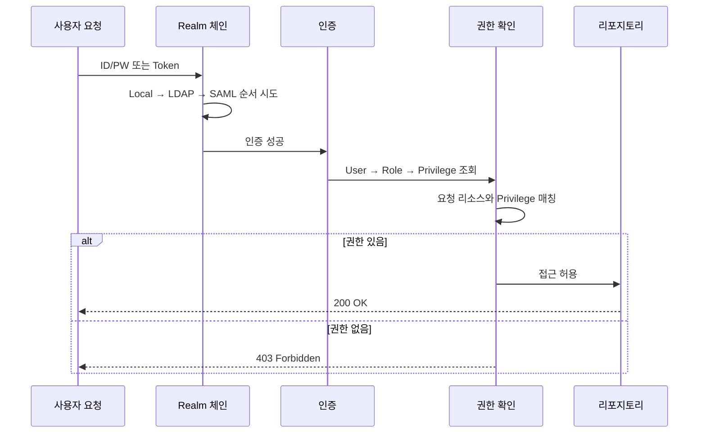
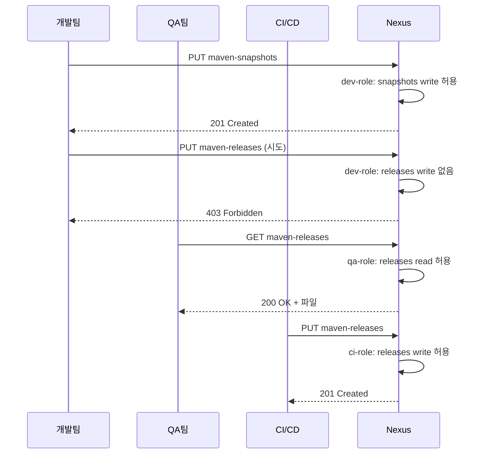

# 접근 제어와 인증

---

> Realm·User·Role·Privilege 네 계층을 알아야 "개발팀은 올리고 QA팀은 읽기만"이 구현된다. LDAP·Content Selector·Anonymous는 그 위에 얹힌다.


## 1. 보안 모델의 전체 그림

> 사용자에게 직접 권한을 주지 않는다. Role이라는 중간 계층으로 인덱싱한다.

Nexus의 접근 제어는 네 개념이 계층적으로 엮여 있다.

- Realm — "누가 인증할 수 있는가"를 결정하는 인증 메커니즘
- User — 인증된 주체 (Local 또는 External)
- Role — 권한 묶음
- Privilege — 구체적인 한 가지 행위 (특정 리포지토리의 read 등)

이 구조가 왜 이렇게 됐을까? 사용자에게 직접 권한을 부여하면 관리가 불가능해지기 때문이다. 개발자 30명에게 각각 5개 리포지토리 권한을 개별 할당했다고 하자. 리포지토리가 하나 추가되면 30명의 설정을 건드려야 한다. Role이라는 중간 계층이 있으면 Role 하나만 수정하면 그 Role을 가진 모든 사용자에게 반영된다.




## 2. Realm — 인증의 입구

> 여러 Realm을 동시에 켜고 순서대로 인증을 시도한다. 순서를 잘못 잡으면 LDAP 장애 시 로컬 admin도 못 들어온다.

### 2.1 기본 제공 Realm

| Realm | 역할 | 비고 |
|-------|------|------|
| Local Authenticating | 내부 DB의 사용자/비밀번호로 인증 | 초기 admin 계정이 여기 |
| Local Authorizing | 외부 Realm 사용자에게 내부 Role 매핑 | LDAP 사용 시 필수 동반 |
| LDAP | AD/OpenLDAP 연결 | 기업 환경 사실상 필수 |
| SAML | Okta/Azure AD/Keycloak SSO (Pro) | 브라우저 기반만, CLI 미지원 |
| Docker Token | Docker Bearer Token 인증 | Docker 리포 사용 시 필수 |

Local Authenticating Realm은 Nexus 내부 DB에 저장된 사용자로 인증하므로 별도 인프라 없이 동작한다. Local Authorizing Realm은 LDAP 같은 외부 인증을 쓰면서 세밀한 권한은 Nexus에서 관리할 때 필요하다. 이게 없으면 LDAP 사용자에게 Nexus 내부 Role을 할당할 수 없다.

Docker Token Realm은 함정이 자주 생긴다. 이게 비활성화돼 있으면 `docker login`은 성공하는데 `docker push`가 `unauthorized`로 실패한다. Docker 클라이언트가 Bearer Token 프로토콜을 쓰는데 그 토큰을 발급해줄 Realm이 없는 상태이기 때문이다.

### 2.2 Realm 순서가 중요한 이유

LDAP Realm이 Local보다 앞에 있으면 로컬 admin 계정도 LDAP에서 먼저 찾으려 시도한다. LDAP 서버가 다운되면 로컬 계정으로 로그인조차 못 하는 사태가 벌어진다. Local Authenticating Realm은 항상 첫 번째로 둔다.

권장 순서는 다음과 같다.

1. Local Authenticating Realm — 항상 최우선, 로컬 관리자 보호
2. Local Authorizing Realm — 외부 인증 사용자에게 내부 Role 매핑
3. Docker Bearer Token Realm — Docker 리포지토리 사용 시
4. LDAP Realm — 기업 디렉토리 연동
5. SAML Realm — SSO (Pro 전용)


## 3. 사용자(User)

> Local과 External(LDAP) 두 종류다. CI/CD에는 개인 계정이 아닌 서비스 계정을 만든다.

Local 사용자는 UI의 `Security → Users`에서 생성한다. User ID는 변경 불가, 비밀번호는 최소 8자 권장, Status는 Active/Disabled, Roles는 최소 1개 이상이다.

REST API로 자동 생성도 가능하다. 온보딩 자동화에 활용된다.

```bash
curl -u admin:admin123 -X POST \
  "http://localhost:8081/service/rest/v1/security/users" \
  -H "Content-Type: application/json" \
  -d '{
    "userId": "dev-hong",
    "firstName": "Gildong",
    "lastName": "Hong",
    "emailAddress": "hong@company.com",
    "password": "SecureP@ss123",
    "status": "active",
    "roles": ["dev-role"]
  }'
```

External 사용자는 LDAP에서 자동으로 가져오며 Nexus에서 비밀번호를 변경할 수 없다. 대신 Nexus 내부에서 추가 Role을 매핑할 수 있어 LDAP 그룹으로 기본 권한을 주고 Nexus에서 세밀한 조정을 하는 혼합 운영이 가능하다.


## 4. 역할(Role)

> 기본 Role은 손대지 않는다. 팀별로 커스텀 Role을 만들어 부여한다.

### 4.1 기본 Role

`nx-admin`은 모든 권한을 가진 슈퍼 관리자다. 프로덕션에서는 2~3명에게만 부여한다. 일반 개발자에게는 절대 주지 않는 것이 원칙이다.

`nx-anonymous`는 인증 없이 접근하는 사용자에게 적용된다. 기본적으로 일부 리포지토리 읽기 권한이 포함돼 있는데, 보안이 중요하다면 권한을 축소하거나 Anonymous Access를 비활성화한다.

### 4.2 커스텀 Role

실무에서는 팀별·환경별로 커스텀 Role을 만든다. 예시는 다음과 같다.

```text
역할: dev-team-role
포함 Privilege:
  nx-repository-view-maven2-maven-releases-read     (releases 읽기만)
  nx-repository-view-maven2-maven-releases-browse
  nx-repository-view-maven2-maven-snapshots-*       (snapshots 전체)
  nx-repository-view-npm-npm-hosted-*               (npm-hosted 전체)
```

릴리스 리포지토리에 쓰기 권한을 주지 않는 건 의도적이다. 릴리스는 CI/CD 파이프라인만 할 수 있도록 제한하는 패턴으로, "개발자가 실수로 로컬에서 릴리스를 배포하는" 사고를 구조적으로 방지한다.

### 4.3 Contained Roles (Pro)

Nexus Pro에서는 Role 안에 다른 Role을 포함할 수 있다.

```text
L1-base-read           모든 리포지토리 read/browse
  └─ L2-dev-backend    + maven-snapshots write, docker-hosted write
  └─ L2-dev-frontend   + npm-hosted write
       └─ L3-dev-lead  + maven-releases write (배포 권한)
```

2단계까지는 관리하기 수월하다. 3단계 이상부터는 "이 사용자가 실제로 어떤 권한을 갖는가?"를 파악하기 어려워진다. UI가 Role 트리를 한눈에 보여주지 않으므로 디버깅이 까다롭다. 역할 이름에 계층을 명시하는 컨벤션(`L1-...`, `L2-...`)이 도움이 된다.


## 5. 권한(Privilege)

> Apache Shiro 기반이라 와일드카드가 가능하다. 패턴 문자열을 외워두면 UI에서 헤매지 않는다.

### 5.1 권한 유형

- Repository View — 리포지토리의 컴포넌트/에셋 CRUD. `nx-repository-view-{format}-{repo}-{action}` 패턴
- Repository Admin — 리포지토리 설정 변경 권한. 일반 개발자 절대 금지
- Application — Nexus 시스템 기능 권한 (`nx-search-read`, `nx-apikey-all` 등)
- Wildcard — Shiro 표현식. `nexus:repository-view:maven2:*:read`처럼 한 줄로 광범위 부여

### 5.2 권한 네이밍 패턴

```text
패턴: nx-repository-view-{format}-{repo}-{action}

실제 문자열 예시:
nx-repository-view-maven2-maven-releases-read     # releases 읽기
nx-repository-view-maven2-maven-releases-browse   # 목록 조회
nx-repository-view-maven2-maven-releases-add      # 업로드
nx-repository-view-maven2-maven-releases-edit     # 수정
nx-repository-view-maven2-maven-releases-delete   # 삭제
nx-repository-view-maven2-maven-releases-*        # 전체
nx-repository-view-docker-docker-hosted-*         # docker-hosted 전체
nx-repository-view-raw-*-read                     # 모든 raw 리포지토리 읽기

관리 권한 예시:
nx-repository-admin-maven2-maven-releases-*       # 설정 변경
nx-blobstores-all                                 # 모든 Blob Store 관리
nx-tasks-all                                      # 모든 태스크 관리
nx-users-all                                      # 모든 사용자 관리
```

`read`와 `browse`의 차이가 헷갈릴 수 있다. `read`는 에셋 콘텐츠를 다운로드할 수 있는 권한이고, `browse`는 리포지토리 구조를 탐색(목록 조회)할 수 있는 권한이다. 파일을 다운로드하려면 보통 둘 다 필요하니 함께 부여한다.


## 6. Content Selector — 경로 기반 세밀 제어

> 리포지토리 단위 권한이 너무 거친 경우의 해결책이다. CSEL로 경로를 식별한 뒤 Privilege에 연결한다.

CSEL(Content Selector Expression Language)로 조건을 정의한다.

```text
# 특정 groupId
format == "maven2" and path =^ "/com/mycompany/"

# SNAPSHOT만 매칭
format == "maven2" and path =~ ".*-SNAPSHOT.*"

# Raw 특정 디렉토리
format == "raw" and path =^ "/team-a/"

# Docker 특정 네임스페이스
format == "docker" and path =^ "/v2/backend/"

# npm scope
format == "npm" and path =^ "/@mycompany/"

# 여러 조건 결합
format == "maven2" and (path =^ "/com/mycompany/" or path =^ "/com/partner/")
```

연산자는 `==`(같음), `=^`(시작 문자열), `=~`(정규식)이다. 적용은 3단계로 이뤄진다.

1. `Administration → Repository → Content Selectors`에서 셀렉터 생성. Preview로 매칭 결과 확인.
2. `Administration → Security → Privileges`에서 "Repository Content Selector" 타입의 Privilege 생성. 셀렉터·리포지토리·action 지정.
3. 그 Privilege를 Role에 추가하고 Role을 사용자에게 할당.

CSEL에는 NOT 연산자가 없다. "이 경로만 차단"은 정규식 lookahead로 우회할 수 있지만 유지보수가 어렵다. 차단이 목적이면 리포지토리를 분리하는 편이 더 실용적이다.

Content Selector가 없으면 권한을 리포지토리 단위로만 나눌 수 있어서 팀이 늘어날 때마다 리포지토리가 함께 증식한다. CSEL을 쓰면 하나의 리포지토리 안에서 경로 기반으로 접근을 분리할 수 있어 리포지토리 수를 적정 수준으로 유지한다. 다만 팀이 3~4개 이하라면 리포지토리 분리가 더 단순한 답일 수 있다.


## 7. Anonymous Access

> 익명 접근은 편의와 보안의 트레이드오프다. proxy만 허용하고 hosted는 차단하는 절충안이 표준이다.

Anonymous Access가 활성화되면 인증 없는 모든 요청에 `anonymous` 사용자와 `nx-anonymous` Role이 적용된다.

활성화가 합리적인 경우는 사내 네트워크 한정 + Maven Central 프록시 같은 시나리오다. `settings.xml`에 인증 정보를 안 넣어도 빌드가 돌므로 개발자 온보딩이 쉽다. 비활성화가 맞는 경우는 외부에서 접근 가능한 환경 또는 hosted만 있는 인스턴스다. 켜진 채로 인터넷에 노출되면 누구나 사내 코드를 받을 수 있다.

흔한 실수는 group 리포지토리에 익명 읽기를 허용하는 것이다. group이 hosted를 포함하면 간접적으로 사내 코드에 접근 가능해진다. 프록시만 포함된 익명 전용 group(`maven-public-anonymous`)을 분리하고 익명 읽기는 그 쪽에만 허용하는 패턴이 안전하다.

설정 검증은 curl 한 줄로 한다.

```bash
# 프록시 (허용 기대)
curl -s -o /dev/null -w "%{http_code}" \
  http://localhost:8081/repository/maven-central/org/springframework/spring-core/

# hosted (차단 기대)
curl -s -o /dev/null -w "%{http_code}" \
  http://localhost:8081/repository/maven-releases/com/mycompany/

# 200=접근 가능, 401=인증 필요, 403=권한 없음
```


## 8. 팀별 접근 제어 설계 예시

> 4개 팀 시나리오로 권한 매트릭스를 잡는다.

| 역할 | maven-snapshots | maven-releases | npm-hosted | docker-hosted | raw-hosted |
|------|:-:|:-:|:-:|:-:|:-:|
| dev-backend-role | read/write | read | — | read | read |
| dev-frontend-role | read | read | read/write | read | read |
| qa-role | read | read | read | read | read |
| ci-role | read/write | read/write | read/write | read/write | read/write |
| ops-role | read | read | read | read/write | read/write |

백엔드는 Maven snapshots에만 쓰기, 프론트엔드는 npm에만 쓰기, QA는 모든 곳 읽기, CI/CD는 모든 곳에 쓰기, Ops는 Docker·Raw에 쓰기. "내가 실수로 잘못된 리포지토리에 배포하는" 사고를 구조적으로 막는다.



설정 후 반드시 테스트한다. "아마 될 거야"라는 가정은 보안에서 가장 위험하다.

```bash
# dev-backend로 스냅샷 업로드 (성공해야 함)
curl -u dev-user:devpass -X POST \
  "http://localhost:8081/service/rest/v1/components?repository=maven-snapshots" \
  -F "maven2.groupId=com.example" -F "maven2.artifactId=test" \
  -F "maven2.version=1.0-SNAPSHOT" \
  -F "maven2.asset1=@./test.jar" -F "maven2.asset1.extension=jar"

# dev-backend로 릴리스 업로드 (403이어야 함)
curl -u dev-user:devpass -X POST \
  "http://localhost:8081/service/rest/v1/components?repository=maven-releases" \
  -F "maven2.groupId=com.example" -F "maven2.artifactId=test" \
  -F "maven2.version=1.0.0" \
  -F "maven2.asset1=@./test.jar" -F "maven2.asset1.extension=jar"
```


## 9. LDAP 연동 가이드

> 대부분의 기업 환경에서 가장 자주 다루는 통합이다. Bind DN·User Filter·그룹 매핑 세 군데를 정확히 잡는다.

### 9.1 연결 설정

`Administration → Security → LDAP → Create Connection`에서 설정한다.

```text
Name: company-ldap
Protocol: ldaps:// (TLS 권장)
Hostname: ldap.company.com
Port: 636 (LDAPS) 또는 389 (LDAP)
Search Base: dc=company,dc=com
Authentication Method: Simple
Bind DN: cn=nexus-bind,ou=service-accounts,dc=company,dc=com
Bind Password: ********
```

Bind DN에 개인 계정을 쓰지 않는다. 전용 서비스 계정을 만들어야 그 사람이 퇴사해도 LDAP 연동이 끊기지 않는다. 서비스 계정에는 LDAP 트리를 읽을 수 있는 최소한의 권한만 부여한다.

UI의 "Verify connection"으로 연결을, "Verify user mapping"으로 사용자 검색까지 확인한다. 연결은 되는데 매핑이 잘못된 경우가 흔하다.

### 9.2 사용자 매핑

```text
Base DN: ou=users,dc=company,dc=com
User Subtree: true
Object Class: inetOrgPerson (OpenLDAP) / user (AD)
User ID Attribute: uid (OpenLDAP) / sAMAccountName (AD)
Real Name Attribute: cn
Email Attribute: mail
User Filter: (memberOf=cn=nexus-users,ou=groups,dc=company,dc=com)
```

User Filter로 특정 LDAP 그룹 소속만 Nexus에 로그인하도록 제한할 수 있다. 전체 조직원이 아니라 Nexus 사용이 필요한 개발자/QA/Ops만 필터링하는 것이 보안상 좋다.

### 9.3 그룹 매핑

LDAP 그룹을 Nexus Role에 매핑하는 것이 핵심이다. "LDAP의 dev-group은 Nexus의 dev-role을 자동으로 받는다"는 식이면, 조직 변경 시 LDAP만 수정하면 Nexus 권한이 따라 바뀐다.

```text
Map LDAP Groups as Roles: checked
Group Type: Dynamic Groups (AD) / Static Groups (OpenLDAP)
Group Base DN: ou=groups,dc=company,dc=com
Group Object Class: groupOfUniqueNames (OpenLDAP) / group (AD)
Group ID Attribute: cn
Group Member Attribute: uniqueMember (OpenLDAP) / member (AD)
Group Member Format: uid=${username},ou=users,dc=company,dc=com
```

Group Member Format은 실제 LDAP 엔트리의 DN과 정확히 일치해야 한다. `ldapsearch`로 실제 DN을 확인한 뒤 설정하면 실수가 줄어든다.

```bash
ldapsearch -x -H ldap://ldap.company.com \
  -b "dc=company,dc=com" "(uid=hong)" dn
```

### 9.4 LDAP 캐시

Nexus는 성능을 위해 LDAP 조회 결과를 캐시한다. LDAP에서 그룹을 변경해도 즉시 반영되지 않을 수 있다. 퇴사자 LDAP 계정을 비활성화했는데 캐시 만료 전까지 Nexus에 접근 가능한 위험이 생긴다.

대응은 세 가지다.

1. 캐시 TTL을 짧게(예: 5분) 설정하되 LDAP 서버 부하를 모니터링한다.
2. 관리 UI에서 사용자 캐시를 수동 무효화한다.
3. 긴급 시 Nexus에서 해당 사용자를 직접 비활성화(Status: Disabled)해 캐시와 무관하게 즉시 차단한다.

```bash
curl -u admin:admin123 -X PUT \
  "http://localhost:8081/service/rest/v1/security/users/target-user" \
  -H "Content-Type: application/json" \
  -d '{"userId":"target-user","status":"disabled","roles":[]}'
```

### 9.5 트러블슈팅 체크리스트

LDAP이 동작하지 않을 때 위에서 아래로 따라간다.

1. 네트워크 — Nexus 서버에서 LDAP 서버로 `telnet ldap.company.com 636`이 되는가?
2. 인증서 — LDAPS 사용 시 Nexus JVM의 truststore에 LDAP 서버 CA가 등록돼 있는가?
3. Bind DN — Bind 계정으로 `ldapsearch`를 직접 실행해 결과가 나오는가?
4. User Filter — 로그인하려는 사용자가 User Filter 조건에 매칭되는가?
5. Realm 순서 — Local Authenticating과 Local Authorizing이 LDAP보다 앞에 있는가?
6. 캐시 — 설정 변경 후 캐시 만료를 기다렸는가? (또는 수동 무효화)


## 10. 보안 권장 사항

> 최소 권한·서비스 계정 분리·정기 감사·감사 로그 활용 네 가지가 운영의 뼈대다.

### 10.1 최소 권한 원칙

"혹시 필요할 수 있으니" 미리 권한을 주지 않는다. 필요할 때 요청받고 그때 추가한다. nx-admin은 실제 관리 업무를 하는 2~3명에게만 부여하고, 나머지는 필요한 최소 권한만 가진 커스텀 Role을 사용한다.

### 10.2 서비스 계정 분리

CI/CD에는 개인 계정이 아닌 전용 서비스 계정을 만든다. `ci-deployer`처럼 용도가 명확한 이름을 쓰고, 비밀번호는 CI 시크릿 매니저에만 저장한다. 개인 계정을 CI에 쓰면 그 사람이 퇴사할 때 파이프라인이 깨진다.

### 10.3 정기 감사

분기마다 사용자 목록과 Role 할당을 검토한다. 퇴사자 계정이 활성 상태로 남아 있거나, 부서 이동으로 불필요한 권한을 가진 사용자가 있을 수 있다. 자동화는 다음 패턴이다.

```bash
curl -s -u admin:admin123 \
  "http://localhost:8081/service/rest/v1/security/users" \
  | jq -r '.[] | [.userId, .status, (.roles | join(";"))] | @csv' \
  > nexus-users.csv
```

### 10.4 감사 로그 활용

Nexus는 `${NEXUS_DATA}/log/audit/`에 감사 로그를 기록한다. 누가 언제 어떤 리포지토리에 접근했는지, 어떤 설정을 변경했는지가 남는다. 보안 사고 시 핵심 증거가 되므로 보존 기간을 충분히 길게 잡고 외부 로그 수집 시스템(ELK, Loki)으로 전달한다.


## 11. 정리

| 개념 | 설명 | 핵심 포인트 |
|------|------|------------|
| Realm | 인증 메커니즘 | Local 항상 첫 번째, Docker Token Realm은 Docker 사용 시 필수 |
| User | 인증된 주체 | Local + External(LDAP), 서비스 계정 분리 |
| Role | 권한 묶음 | 팀별 커스텀 Role 필수, 중첩은 2단계까지 |
| Privilege | 개별 권한 | `nx-repository-view-{format}-{repo}-{action}` 패턴 |
| Content Selector | 경로 기반 세밀 제어 | CSEL, NOT 연산자 없음 |
| Anonymous | 미인증 접근 | 프록시만 허용, hosted 차단 |
| LDAP | 기업 디렉토리 연동 | 그룹→Role 매핑, 캐시 TTL 주의 |

접근 제어의 핵심은 "기본은 차단, 필요한 만큼만 열기"다. 처음에 모든 걸 열어두고 나중에 닫으려 하면 이미 의존하는 곳을 찾느라 고생한다. 처음에 다 닫고 요청이 올 때마다 열어주면 약간 번거롭지만 어떤 팀이 어떤 권한을 왜 필요로 하는지가 자연스럽게 문서화된다.


## 관련 문서

- [03-01.REST API와 웹 통합](03-01.REST API와 웹 통합.md) — REST API 호출 시 발생하는 401/403의 인증·권한 배경
- [02-01.리포지토리 포맷과 구성](02-01.리포지토리 포맷과 구성.md) — Content Selector가 작동하는 포맷별 경로 구조
- [03-점검.핵심 질문과 답](03-점검.핵심 질문과 답.md) — Realm 순서·LDAP 캐시·Anonymous 점검
