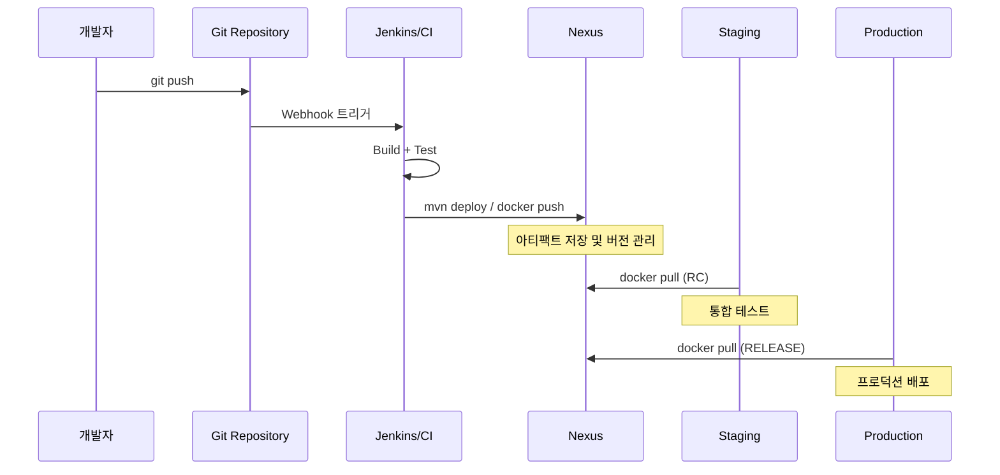
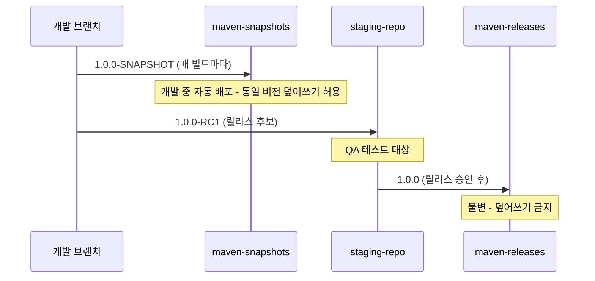

# CI/CD 파이프라인 연동

---

> Jenkins/GitHub Actions/GitLab CI 어디에서든 패턴은 같다. 인증 주입 → 빌드 도구 표준 deploy → SNAPSHOT/RC/RELEASE 프로모션 흐름.


## 1. CI/CD에서 아티팩트 저장소의 역할

> 빌드와 배포를 분리하는 계약이다. CI가 보증을 붙여 올리면 CD가 그 보증을 신뢰해 가져간다.

빌드 서버가 소스를 컴파일하면 결과물이 나온다. JAR, Docker 이미지, npm tarball — 어떤 형태든 이 산출물을 어디에 둘지가 첫 결정이다. 빌드 서버 로컬 디스크에 두면 다른 환경에서 접근할 수 없고 재시작 시 사라진다. Git에 바이너리를 넣는 건 더 나쁜 선택이다. 아티팩트 저장소가 이 빈자리를 메운다.

빌드 단계에서 저장소에 올리고(publish), 배포 단계에서 꺼내(pull) 사용하는 구조다. 이 분리 덕에 빌드와 배포가 독립적으로 동작한다. 빌드가 10번 실패해도 마지막 성공 아티팩트는 저장소에 안전히 보관돼 있다.



이 흐름에서 Nexus는 빌드와 배포 사이의 계약(contract) 역할이다. CI가 "이 버전은 빌드와 테스트를 통과했다"는 보증을 붙여 올리면, 배포 파이프라인은 그 보증을 믿고 가져다 쓴다. 저장소가 없으면 배포 시 다시 빌드해야 하는데, 같은 커밋이라도 의존성·타임스탬프 차이로 결과물이 미묘하게 달라진다. 빌드 재현성(build reproducibility)이 깨지는 것이다.


## 2. Jenkins + Nexus 연동

> Nexus Platform Plugin보다 빌드 도구 자체의 deploy 기능을 더 많이 쓴다. 이유는 로컬에서도 동일하게 동작하기 때문이다.

### 2.1 settings.xml 서버 인증

Maven이 Nexus에 접근하려면 인증 정보가 필요하다. `settings.xml`의 `<servers>`에 등록한다.

```xml
<settings>
  <servers>
    <server>
      <id>maven-releases</id>
      <username>deployer</username>
      <password>${env.NEXUS_PASSWORD}</password>
    </server>
    <server>
      <id>maven-snapshots</id>
      <username>deployer</username>
      <password>${env.NEXUS_PASSWORD}</password>
    </server>
  </servers>
</settings>
```

`<id>`가 핵심이다. `pom.xml`의 `<distributionManagement>`에서 지정한 리포지토리 ID와 정확히 일치해야 한다. ID가 어긋나면 401 Unauthorized가 나오는데, 인증 정보 자체가 틀렸다고 착각하기 쉽다.

password 평문은 금지다. 환경변수(`${env.NEXUS_PASSWORD}`) 참조나 Maven master password 암호화를 쓴다. CI 환경에서는 master password 파일 관리 부담이 있으므로 환경변수 주입이 실용적이다.

### 2.2 Jenkinsfile에서 mvn deploy

```groovy
pipeline {
    agent any

    environment {
        NEXUS_PASSWORD = credentials('nexus-deployer-password')
    }

    stages {
        stage('Build') { steps { sh 'mvn clean package -DskipTests' } }
        stage('Test')  { steps { sh 'mvn test' } }
        stage('Deploy to Nexus') {
            steps {
                sh """
                    mvn deploy \
                        -DskipTests \
                        -DaltDeploymentRepository=maven-snapshots::default::http://nexus:8081/repository/maven-snapshots/
                """
            }
        }
    }
}
```

`-DaltDeploymentRepository`는 `pom.xml`의 `distributionManagement`를 오버라이드한다. CI에서는 pom.xml 하드코딩 URL보다 파이프라인 주입이 유연하다.

멀티 모듈 프로젝트에서는 `mvn deploy`가 모든 모듈을 빌드하고 배포한다. 일부 모듈만 배포하려면 `-pl`을 쓰고 `-am`을 함께 둔다. 빌드 도중 일부 모듈만 배포된 불완전한 상태를 막으려면 `-DdeployAtEnd=true`(maven-deploy-plugin 2.8+)나 Nexus Pro의 Staging 기능을 활용한다.

### 2.3 nexusArtifactUploader

Maven이 아닌 빌드 도구를 쓰거나 빌드 결과물을 직접 올려야 할 때 유용하다.

```groovy
stage('Upload to Nexus') {
    steps {
        nexusArtifactUploader(
            nexusVersion: 'nexus3',
            protocol: 'http',
            nexusUrl: 'nexus:8081',
            groupId: 'com.example',
            version: '1.0.0-SNAPSHOT',
            repository: 'maven-snapshots',
            credentialsId: 'nexus-credentials',
            artifacts: [[
                artifactId: 'my-app',
                classifier: '',
                file: 'target/my-app-1.0.0-SNAPSHOT.jar',
                type: 'jar'
            ]]
        )
    }
}
```

`mvn deploy`와 `nexusArtifactUploader`의 결정적 차이는 **POM 메타데이터 동반 여부**다. `mvn deploy`는 빌드 라이프사이클의 일부로 POM·체크섬·classifier까지 함께 올리지만, `nexusArtifactUploader`는 파일 자체만 올린다. 후자는 다른 Maven 프로젝트에서 의존성으로 참조하기 어려우므로, Go·Rust·Python 빌드 결과물을 raw 리포지토리에 올릴 때 적합하다.

### 2.4 Credentials 관리

| 방식 | 보안 수준 | 용도 |
|------|----------|------|
| Jenkins Credentials Store | 중간 | 일반적인 경우 |
| HashiCorp Vault Plugin | 높음 | 엔터프라이즈 환경 |
| 환경변수 주입 | 낮음 | 개발/테스트 |
| Kubernetes Secrets | 높음 | K8s 기반 Jenkins |

`credentials()` 헬퍼는 콘솔 로그를 마스킹하지만 그것만으로 안전하다고 볼 수 없다. `sh 'env | sort'`나 `cat /proc/self/environ`을 실행하면 평문이 노출된다. 마스킹은 콘솔 로그에서만 유효하지 프로세스 메모리·파일시스템에는 평문이다. 악의적 PR이 환경변수를 외부로 전송하는 시나리오까지 방어하려면 Multibranch Pipeline에서 "Trust" 설정을 엄격히 관리하고 PR 빌드에는 프로덕션 시크릿을 주입하지 않는다.


## 3. Gradle + Nexus

> `maven-publish` 플러그인이 표준이다. Gradle 7+의 HTTP 차단을 풀려면 `isAllowInsecureProtocol`을 명시한다.

```kotlin
plugins {
    `maven-publish`
}

publishing {
    publications {
        create<MavenPublication>("mavenJava") {
            from(components["java"])
            groupId = "com.example"
            artifactId = "my-library"
            version = "1.0.0-SNAPSHOT"
        }
    }
    repositories {
        maven {
            name = "nexus"
            val releasesUrl = uri("http://localhost:8081/repository/maven-releases/")
            val snapshotsUrl = uri("http://localhost:8081/repository/maven-snapshots/")
            url = if (version.toString().endsWith("SNAPSHOT")) snapshotsUrl else releasesUrl
            credentials {
                username = project.findProperty("nexusUsername") as String? ?: "admin"
                password = project.findProperty("nexusPassword") as String? ?: "admin123"
            }
            isAllowInsecureProtocol = true
        }
    }
}
```

`gradle publish`로 배포한다. 인증 정보는 `gradle.properties`나 CI 환경변수로 전달한다. `gradle.properties`는 반드시 `.gitignore`에 추가한다. 실수로 커밋되면 단순 삭제로 끝나지 않고 `git filter-branch`나 BFG Repo-Cleaner로 히스토리를 다시 써야 한다.

```bash
gradle publish -PnexusUsername=$NEXUS_USER -PnexusPassword=$NEXUS_PASS
```


## 4. npm publish to Nexus

> `_auth` 토큰과 `publishConfig.registry` 두 가지를 정확히 분리해 잡는다.

```bash
# .npmrc
registry=http://localhost:8081/repository/npm-group/
//localhost:8081/repository/npm-hosted/:_auth=YWRtaW46YWRtaW4xMjM=
always-auth=true
```

`_auth`는 `username:password`의 Base64 인코딩이다(`echo -n 'admin:admin123' | base64`).

```json
{
  "name": "@example/my-package",
  "version": "1.0.0",
  "publishConfig": {
    "registry": "http://localhost:8081/repository/npm-hosted/"
  }
}
```

`.npmrc`의 `registry`는 install(다운로드) 경로, `publishConfig.registry`는 publish(업로드) 경로다. group은 읽기 전용이라 publish 받지 않으므로 publish 경로는 hosted를 직접 가리킨다. 이 둘을 혼동하면 publish는 성공하는데 install이 실패하는 상황이 생긴다.

CI에서 `.npmrc`를 안전하게 생성한다.

```bash
echo "//nexus:8081/repository/npm-hosted/:_auth=${NPM_AUTH_TOKEN}" > .npmrc
npm publish
rm .npmrc
```

### 4.1 Scoped 패키지

```bash
@company:registry=http://nexus:8081/repository/npm-hosted/
@vendor:registry=http://nexus:8081/repository/npm-proxy/
```

`@company` scope는 사내 hosted, `@vendor` scope는 외부 proxy로 분리한다. scope 분리 없이 group 하나로 통합하면 사내 패키지 이름이 외부와 충돌할 위험이 생긴다. 이 위험이 곧 dependency confusion 공격의 진입점이다.

### 4.2 npm 배포 트러블슈팅

| 증상 | 원인 | 해결 |
|------|------|------|
| 403 Forbidden | hosted deploy 권한 없음 | `nx-repository-view-npm-*-add` 권한 확인 |
| 400 Repository does not allow updating assets | 같은 버전 재배포 | Allow redeploy 정책 또는 버전 bump |
| UNABLE_TO_VERIFY_LEAF_SIGNATURE | HTTPS 인증서 문제 | `npm set strict-ssl false` (개발용) |
| E409 Conflict | 동시 publish 충돌 | CI 직렬화 또는 retry 추가 |


## 5. GitHub Actions / GitLab CI

> CI 도구가 바뀌어도 패턴은 같다. 시크릿 등록 → 빌드 도구 표준 deploy.

GitHub Actions:

```yaml
- name: Deploy to Nexus
  env:
    NEXUS_USERNAME: ${{ secrets.NEXUS_USERNAME }}
    NEXUS_PASSWORD: ${{ secrets.NEXUS_PASSWORD }}
  run: mvn deploy -s settings.xml -DskipTests
```

GitLab CI:

```yaml
deploy:
  stage: deploy
  script:
    - mvn deploy -s settings.xml -DskipTests
  variables:
    NEXUS_USERNAME: $NEXUS_USERNAME
    NEXUS_PASSWORD: $NEXUS_PASSWORD
  only:
    - main
```

GitLab CI Variables는 **Protected + Masked** 옵션을 함께 켠다. Protected는 protected 브랜치에서만 접근 가능하므로 feature 브랜치의 악의적 코드에서 토큰 탈취를 막고, Masked는 CI 로그에서 값을 `[MASKED]`로 치환한다. Masked는 base64 인코딩된 값에서만 제대로 동작하니 토큰 형식을 확인한다.

어느 CI든 핵심은 같다. 인증 정보 안전 주입, 빌드 도구의 표준 deploy, 환경별 리포지토리 지정. 평문 비밀번호가 파이프라인 설정 파일에 들어가면 안 된다는 원칙도 동일하다.


## 6. 버전 전략 — SNAPSHOT에서 RELEASE까지

> 한 번 빌드한 바이너리를 그대로 프로모션하는 것이 빌드 재현성의 출발점이다.



SNAPSHOT은 같은 버전을 계속 덮어쓸 수 있다. Nexus가 타임스탬프(`1.0.0-20240301.143052-1`)를 붙여 각 빌드를 구분한다. RC는 QA가 검증할 특정 후보로 `1.0.0-RC1`, `1.0.0-RC2`처럼 고유 버전이다. RELEASE는 `Disable Redeploy` 정책으로 한 번 올린 버전을 재업로드할 수 없다. 의도된 설계다 — 프로덕션 바이너리가 나중에 바뀌면 추적 불가능한 재앙이 된다.

### 6.1 프로모션 자동화 두 패턴

리포지토리 간 복사(Pro Staging)는 staging에 올린 후 검증이 끝나면 release로 이동(promote)한다. 동일 바이너리가 이동하므로 빌드 재현성이 보장된다.

버전 변경 후 재빌드는 OSS의 흔한 패턴이다. `-SNAPSHOT`을 떼고 다시 빌드해 releases에 올린다. 간단하지만 "SNAPSHOT에서 테스트한 바이너리와 RELEASE 바이너리가 정말 같은가?"라는 질문에 100% 확신할 수 없다는 약점이 있다.

Maven Release Plugin(`mvn release:prepare release:perform`)은 SNAPSHOT→RELEASE 전환을 자동화한다. `-SNAPSHOT` 제거 → 태그 생성 → 빌드·배포 → 다음 SNAPSHOT 버전 증가까지 일괄 처리한다. CI에서 쓰려면 Git 인증이 필요하고 중간 실패 시 롤백이 번거롭다는 점은 알아두자. Gradle에서는 `nebula.release`나 `axion-release-plugin`이 비슷한 역할을 한다.


## 7. 자주 만나는 함정

> 401 Unauthorized, SNAPSHOT 캐시, 타임아웃, Realm 누락이 대부분이다.

### 7.1 "401 Unauthorized" 디버깅 순서

1. `settings.xml`의 `<server>` ID와 `pom.xml`의 repository ID 일치 여부
2. 사용자에게 해당 리포지토리 쓰기 권한 부여 여부
3. Realm 활성화 여부 (npm은 npm Bearer Token Realm, Docker는 Docker Bearer Token Realm)
4. URL 정확성 (trailing slash 유무도 영향)

### 7.2 SNAPSHOT 타임스탬프 캐시

Maven이 SNAPSHOT을 `1.0.0-20260307.051234-1` 같은 타임스탬프 버전으로 변환해 저장한다. 로컬에서 `-SNAPSHOT` 의존성을 잡으면 보통 알아서 최신 타임스탬프를 가져오지만 캐시 때문에 이전 버전이 사용되는 경우가 있다. `mvn -U`(강제 업데이트) 플래그로 해결한다.

### 7.3 대용량 아티팩트 타임아웃

Docker 이미지·대용량 JAR 업로드 시 nginx 또는 로드밸런서 타임아웃에 걸린다. `client_max_body_size`와 `proxy_read_timeout`을 충분히 늘린다.

### 7.4 Realm 누락

npm·Docker push가 401을 반환하는데 인증 정보는 정확하다면 Realm을 의심한다. `Administration → Security → Realms`에서 npm Bearer Token Realm, Docker Bearer Token Realm을 활성화한다. Maven은 기본 Realm으로 동작하므로 이 문제를 안 겪는다.

### 7.5 CI 빌드 속도 최적화

Nexus를 proxy로 활용하면 Maven Central·npmjs.org에서 매번 다운로드하는 대신 로컬 네트워크에서 가져온다. Jenkins 에이전트와 Nexus가 같은 네트워크에 있으면 다운로드 시간이 수십 배 줄어든다. `node_modules`가 수백 MB인 프론트엔드 프로젝트에서 효과가 특히 크다.


## 8. 정리

| 빌드 도구 | 배포 명령 | 인증 방식 | 비고 |
|-----------|----------|----------|------|
| Maven | `mvn deploy` | settings.xml | POM 메타데이터 동반 |
| Gradle | `gradle publish` | gradle.properties / 환경변수 | `isAllowInsecureProtocol` 주의 |
| npm | `npm publish` | `.npmrc` `_auth` | Bearer Token Realm 활성화 필요 |
| Docker | `docker push` | `docker login` | 별도 포트(8082) 사용 |

CI/CD에서 Nexus를 쓸 때 기억할 셋이다. 인증 정보를 코드가 아니라 CI 시크릿 매니저에 두고, 빌드 도구의 표준 deploy 명령으로 CI 도구 의존성을 줄이며, SNAPSHOT→RC→RELEASE 프로모션 흐름을 정의해 "어떤 버전이 프로덕션에 올라갔는가"를 항상 추적 가능하게 만든다. 또한 CI 배포는 전용 서비스 계정(`ci-deployer`)으로 분리한다. 개인 계정으로 배포하면 퇴사·이동 시 파이프라인이 깨지고 감사 로그에서 책임 추적이 모호해진다.


## 관련 문서

- [04-02.Docker Registry로서의 Nexus](04-02.Docker Registry로서의 Nexus.md) — CI에서 Docker 이미지 push의 상세
- [03-02.접근 제어와 인증](03-02.접근 제어와 인증.md) — 서비스 계정과 최소 권한 부여
- [04-점검.핵심 질문과 답](04-점검.핵심 질문과 답.md) — `mvn deploy` vs uploader, 시크릿 위험, 프로모션 점검
