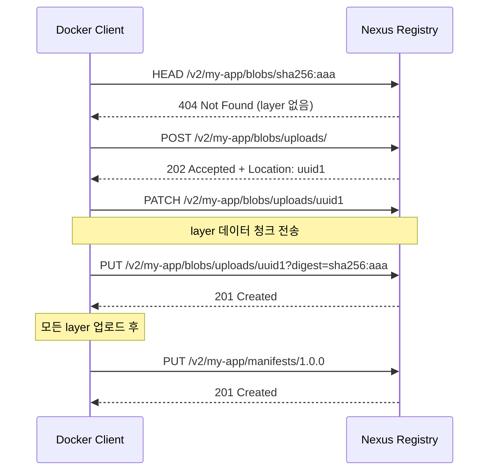
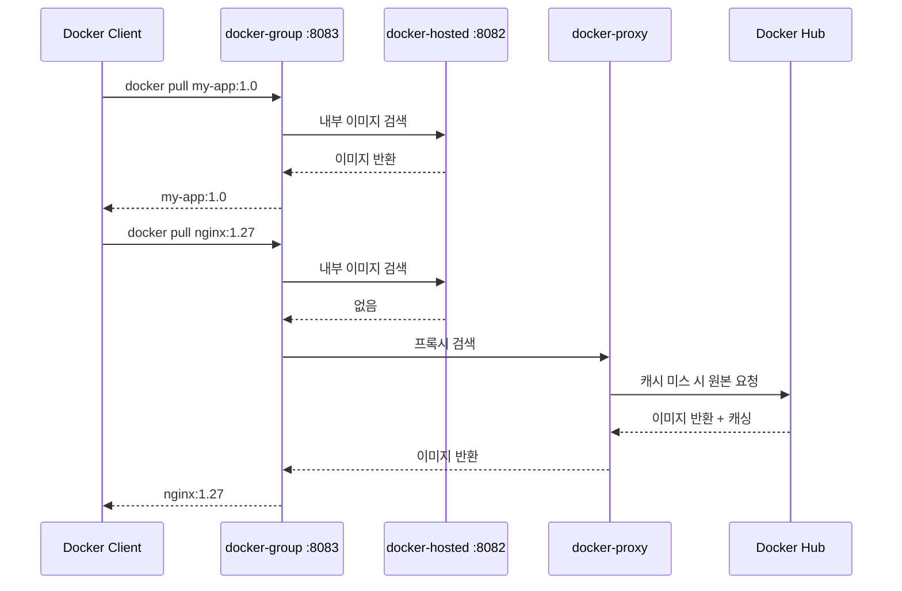
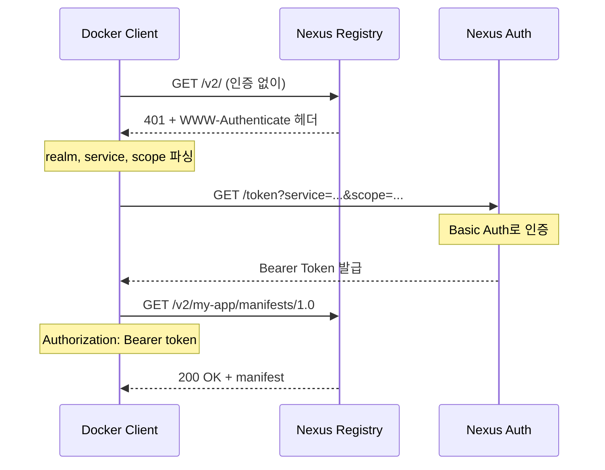

# Docker Registry로서의 Nexus

---

> hosted/proxy/group 3종 + 별도 포트 + Bearer Token Realm. 이 셋의 이유를 알면 운영이 잡힌다.


## 1. Docker Registry 개요

> Docker Hub rate limit과 사내 이미지 보관이라는 두 동기가 사내 레지스트리를 만든다.

Docker 이미지를 저장·배포하는 서비스를 Docker Registry라 부른다. Docker Hub가 가장 유명하지만 사내 환경에서는 자체 레지스트리가 필요한 경우가 많다. 민감한 코드가 포함됐거나, Docker Hub의 rate limit(익명 100회/6시간, 인증 200회/6시간)에 걸리기 시작하면 자체 레지스트리를 진지하게 검토하게 된다.

Docker Registry는 OCI Distribution Specification을 따른다. 이미지를 manifest(메타데이터)와 layer(파일시스템 데이터)로 나누어 저장하고, push/pull 시 HTTP API로 이 둘을 주고받는다. Nexus는 이 스펙을 구현한 레지스트리 중 하나로, Maven·npm과 같은 인프라에서 Docker 이미지까지 통합 관리할 수 있다는 점이 가장 큰 장점이다.

전용 솔루션(Harbor)이 아닌 Nexus를 선택하는 근거는 통합이다. 이미 Nexus로 Maven·npm을 관리한다면 별도 인프라 없이 사용자·접근 제어를 한 곳에서 관리할 수 있다. 반면 컨테이너 보안에 특화된 기능(취약점 스캔, 이미지 서명 UI)이 필요하면 Harbor가 더 적합하다.


## 2. Docker Registry HTTP API V2

> push/pull의 HTTP 흐름을 알아야 nginx 타임아웃·Body Size를 제대로 잡는다.

### 2.1 핵심 엔드포인트

```text
GET  /v2/                                       API 버전 확인 (ping)
GET  /v2/<name>/manifests/<reference>           manifest 조회 (pull 1단계)
PUT  /v2/<name>/manifests/<reference>           manifest 업로드 (push 마지막)
GET  /v2/<name>/blobs/<digest>                  layer 다운로드 (pull 2단계)
HEAD /v2/<name>/blobs/<digest>                  layer 존재 여부 확인
POST /v2/<name>/blobs/uploads/                  layer 업로드 시작
PATCH /v2/<name>/blobs/uploads/<uuid>           layer 데이터 전송
PUT  /v2/<name>/blobs/uploads/<uuid>?digest=    layer 업로드 완료
```

### 2.2 push 흐름



push는 layer 먼저, manifest 나중 순서다. manifest가 layer들의 digest를 참조하므로 layer가 모두 업로드된 후에 manifest가 들어간다. 이미 존재하는 layer는 HEAD로 확인 후 건너뛰므로 base image를 공유하는 이미지들은 변경된 layer만 전송된다.

### 2.3 pull 흐름

pull은 push의 역순이다. manifest를 먼저 받아 layer 목록을 확인하고 각 layer를 병렬로 다운로드한다.

```text
1. GET /v2/my-app/manifests/1.0.0   manifest 수신
2. GET /v2/my-app/blobs/sha256:aaa  layer 1 (병렬)
3. GET /v2/my-app/blobs/sha256:bbb  layer 2 (병렬)
4. GET /v2/my-app/blobs/sha256:ccc  layer 3 (병렬)
```

이 구조를 알아야 디버깅이 쉽다. nginx의 `proxy_read_timeout`이 짧으면 대형 layer 다운로드 중 끊기고, `client_max_body_size`가 작으면 layer 업로드가 실패한다. 어떤 단계에서 에러가 나는지 알아야 올바른 파라미터를 손댄다.


## 3. Nexus Docker 리포지토리 구성

> hosted + proxy + group 3종이 모두 등장한다. group 멤버 순서는 hosted 우선이다.

### 3.1 docker-hosted

팀에서 빌드한 이미지를 저장한다. `docker push` 대상이며 보통 8082를 할당한다.

설정 시 점검 포인트는 다음과 같다.

- HTTP connector port — Docker 클라이언트가 접근할 포트
- Enable Docker V1 API — 최신 클라이언트는 V2를 쓰므로 꺼도 무방
- Blob store — Docker 이미지는 용량이 크므로 전용 Blob Store 분리 권장

### 3.2 docker-proxy

Docker Hub에서 가져온 이미지를 캐싱한다. Remote URL은 `https://registry-1.docker.io`다. Docker Hub 인증을 넣으면 rate limit이 인증 기준으로 적용돼 더 여유가 생긴다. 팀원이 10명이어도 Nexus가 대신 가져오므로 실질적으로 1명분의 rate limit만 소모하는 셈이다.

### 3.3 docker-group

hosted와 proxy를 묶어 하나의 엔드포인트로 제공한다. 보통 8083을 할당한다.



group 멤버 순서는 hosted를 먼저, proxy를 나중에 둔다. Docker Hub에 같은 이름의 이미지가 있을 때 의도치 않게 외부 이미지가 반환되는 사고를 막는다.


## 4. 포트 분리가 필요한 이유

> Docker는 URL 경로가 아니라 호스트:포트로 레지스트리를 인식한다. 포트가 곧 리포지토리 식별자가 된다.

Maven은 `/repository/maven-releases/`처럼 경로로 리포지토리를 구분한다. Docker는 그렇지 않다. Docker 클라이언트가 `GET /v2/my-app/manifests/1.0`을 보낼 때 HTTP Host 헤더에는 `localhost:8082`만 들어간다. URL에는 리포지토리 이름이 없으므로 Nexus는 포트(정확히는 Repository Connector)를 보고 어느 리포지토리에 보낼지 결정한다.

| 리포지토리 | 포트 예시 | 용도 |
|-----------|----------|------|
| docker-hosted | 8082 | `docker push` 대상 |
| docker-group | 8083 | `docker pull` 통합 엔드포인트 |
| docker-proxy | (포트 없음) | group 경유, 직접 노출 불필요 |

docker-proxy에 별도 포트를 안 여는 이유는 단순하다. pull은 group 경유로 끝나고 push는 proxy에 할 수 없다. 디버깅 목적으로 proxy에도 포트를 열어 두면 캐싱 동작 확인이 쉬워지긴 한다.

Nexus Pro에서는 하나의 HTTPS 커넥터에서 경로 기반 라우팅을 지원하지만, OSS에서는 포트 분리가 유일한 답이다. 포트 부담은 nginx 서브도메인 라우팅으로 우회한다(§6).


## 5. Docker 클라이언트 설정

> 로컬에서는 insecure-registries로 시작하고 운영에서는 TLS로 옮긴다.

### 5.1 daemon.json

프로덕션에서는 TLS를 쓰지만 로컬 개발에서는 HTTP를 자주 쓴다. Docker는 기본적으로 HTTP 레지스트리를 거부하므로 `daemon.json`에 예외를 등록한다.

```json
{
  "insecure-registries": [
    "localhost:8082",
    "localhost:8083",
    "nexus.company.internal:8082",
    "nexus.company.internal:8083"
  ],
  "registry-mirrors": [
    "http://nexus.company.internal:8083"
  ]
}
```

파일 위치는 Linux의 `/etc/docker/daemon.json`, macOS/Windows의 Docker Desktop Settings → Docker Engine이다. 설정 후 데몬 재시작이 필요하다.

`registry-mirrors`를 설정하면 명시적 레지스트리 없는 pull(`docker pull nginx:latest`)이 Docker Hub 대신 Nexus docker-group을 먼저 거친다. 개발자가 별도 설정 없이 프록시 캐시 혜택을 받는 가장 깔끔한 방법이다.

### 5.2 push/pull 완전 예제

```bash
# 1. hosted 로그인 (push용)
docker login localhost:8082

# 2. 빌드
docker build -t my-app:latest .

# 3. Nexus 태깅 (registry/image:tag)
docker tag my-app:latest localhost:8082/my-app:1.0.0

# 4. push
docker push localhost:8082/my-app:1.0.0

# 5. group에서 pull (hosted + proxy 통합)
docker pull localhost:8083/my-app:1.0.0
docker pull localhost:8083/library/nginx:1.27-alpine

# 6. 이미지 목록 확인 (Registry HTTP API 직접 호출)
curl -s -u admin:admin123 http://localhost:8082/v2/_catalog
curl -s -u admin:admin123 http://localhost:8082/v2/my-app/tags/list
```

Docker Hub의 공식 이미지를 group 경유로 pull할 때는 `library/` 접두사가 필요한 경우가 있다. `nginx`는 실제로 `library/nginx`인데, Docker Hub에서는 생략해도 되지만 Nexus proxy를 거칠 땐 명시해야 동작하는 경우가 있다.

### 5.3 다이제스트 기반 pull

태그는 변경 가능(mutable)하다. `latest`가 어제와 오늘 다른 이미지를 가리킬 수 있다. 프로덕션에서 정확한 이미지를 보장하려면 다이제스트를 사용한다.

```bash
docker inspect --format='{{index .RepoDigests 0}}' localhost:8082/my-app:1.0.0
# 출력: localhost:8082/my-app@sha256:abc123...

docker pull localhost:8083/my-app@sha256:abc123...
```


## 6. nginx subdomain 라우팅

> 포트 번호를 외울 일이 없게 만든다. 표준 443 포트만으로 hosted/group을 구분한다.

```nginx
# docker-hosted.company.com → 8082
server {
    listen 443 ssl;
    server_name docker-hosted.company.com;

    ssl_certificate     /etc/ssl/certs/company.crt;
    ssl_certificate_key /etc/ssl/private/company.key;

    client_max_body_size 2G;
    chunked_transfer_encoding on;

    location / {
        proxy_pass http://nexus:8082;
        proxy_set_header Host $host;
        proxy_set_header X-Real-IP $remote_addr;
        proxy_set_header X-Forwarded-For $proxy_add_x_forwarded_for;
        proxy_set_header X-Forwarded-Proto $scheme;
        proxy_read_timeout 600;
        proxy_send_timeout 600;

        proxy_buffering off;
        proxy_request_buffering off;
    }
}

# docker-group.company.com → 8083
server {
    listen 443 ssl;
    server_name docker-group.company.com;
    ssl_certificate     /etc/ssl/certs/company.crt;
    ssl_certificate_key /etc/ssl/private/company.key;

    client_max_body_size 0;
    chunked_transfer_encoding on;

    location / {
        proxy_pass http://nexus:8083;
        proxy_set_header Host $host;
        proxy_read_timeout 600;
        proxy_send_timeout 600;
        proxy_buffering off;
    }
}
```

`proxy_buffering off`와 `proxy_request_buffering off`가 핵심이다. nginx가 layer 데이터를 버퍼에 모았다 전달하면 메모리를 과하게 쓴다. 스트리밍 모드로 바로 흘려 보내면 nginx 메모리 부담이 크게 줄어든다.

`client_max_body_size 2G`는 ML 모델이 포함된 Docker 이미지가 수 GB에 달하기도 하므로 넉넉히 잡는다. 부족하면 `413 Request Entity Too Large`가 나는데, Docker 클라이언트 쪽에서는 모호한 메시지로 표시돼 디버깅이 어렵다.


## 7. Docker Token Authentication

> Bearer Token Realm을 활성화하지 않으면 `docker login`은 되는데 `docker push`가 실패한다.



`Administration → Security → Realms`에서 "Docker Bearer Token Realm"을 Active 목록으로 옮긴다. 빠뜨리면 `docker login`은 성공하는데 `docker push`에서 인증 에러가 난다. WWW-Authenticate 헤더는 `curl -v`로 직접 확인할 수 있다.

```bash
curl -v http://localhost:8082/v2/ 2>&1 | grep -i www-authenticate
# Bearer realm="http://localhost:8082/v2/token",service="localhost:8082"
```


## 8. 레이어 캐싱과 스토리지 효율

> 베이스 이미지를 표준화할수록 layer 공유가 늘어 디스크가 절약된다.

Docker 이미지는 레이어 단위로 저장되며 layer는 SHA256 다이제스트로 식별된다. 동일한 base 이미지를 사용하는 두 서비스 이미지는 base layer를 공유한다.

```text
service-a:1.0  →  [base-layer] + [service-a-layer]
service-b:1.0  →  [base-layer] + [service-b-layer]
```

`base-layer`는 한 번만 저장된다. `ubuntu:22.04` 베이스(약 77MB)를 10개 서비스가 공유하면 770MB 대신 77MB만 저장된다. 90% 절약이 가능한 셈이다.

이미지를 삭제할 때는 주의한다. 특정 이미지의 태그만 삭제해도 다른 이미지가 같은 layer를 참조하면 디스크 공간이 회수되지 않는다. Cleanup Policy + Compact Blob Store가 참조 관계를 추적해 더 이상 참조되지 않는 layer만 삭제한다(05-01에서 다룬다).


## 9. 멀티 아키텍처 이미지 관리

> manifest list(fat manifest)는 하나의 태그가 여러 플랫폼 manifest를 가리키는 구조다. Cleanup이 까다로워진다.

ARM Mac과 x86 서버가 혼재하는 환경에서는 멀티 아키텍처 이미지가 필요하다. `docker buildx`로 하나의 태그로 여러 플랫폼을 지원하는 이미지를 빌드한다.

```bash
docker buildx create --name multiarch --use

docker buildx build \
  --platform linux/amd64,linux/arm64 \
  --tag localhost:8082/my-app:1.0.0 \
  --push .
```

Nexus에는 manifest list가 저장되고 그 아래 플랫폼별 manifest와 layer가 별도로 저장된다. `docker pull`할 때 클라이언트가 자기 플랫폼에 맞는 manifest를 자동 선택한다.

주의 포인트는 Cleanup이다. manifest list를 삭제하면 하위 platform manifest 참조가 끊기지만 dangling manifest가 남을 수 있고, 추가 정리 사이클이 필요할 수 있다. 또한 docker-proxy 캐시는 pull한 플랫폼의 layer만 캐싱하므로, amd64 서버에서 pull한 이미지를 arm64 개발자가 다시 pull하면 외부 요청이 추가로 나간다.


## 10. 실무 구성 팁

> Blob Store 분리, 캐시 범위, Anonymous pull 세 가지가 가장 자주 만지는 손잡이다.

### 10.1 Blob Store 분리

Docker 이미지는 Maven JAR보다 훨씬 크다. 같은 Blob Store에 넣으면 Docker가 디스크를 빠르게 잠식한다. Docker 전용 Blob Store를 만들어 디스크 사용량을 독립적으로 모니터링하고 필요하면 별도 디스크에 마운트한다.

### 10.2 Docker Hub 미러링 범위

docker-proxy가 Docker Hub 전체를 캐싱하면 디스크가 부족해진다. Cleanup Policy에서 "Last Downloaded 14일"을 걸어 최근 사용 이미지만 유지한다. 한 달 이상 아무도 pull하지 않으면 삭제해도 되고 다음에 필요할 때 다시 가져오면 된다.

### 10.3 Anonymous pull

사내 네트워크에서 인증 없이 pull하게 하려면 다음 셋이 필요하다.

1. `Administration → Security → Realms`에서 Docker Bearer Token Realm 활성화
2. `Administration → Security → Anonymous Access`에서 익명 접근 허용
3. 익명 사용자에게 해당 리포지토리 read 권한 부여

push는 반드시 인증을 요구하지만 pull은 사내에서 익명 허용하면 개발자 경험이 좋아진다.


## 11. 자주 만나는 문제

> 메시지만 보고 어디부터 의심할지를 정해 둔다.

| 메시지 | 가장 흔한 원인 |
|--------|---------------|
| `unauthorized: access to the requested resource is not authorized` | Docker Bearer Token Realm 비활성, push에 group 포트(8083) 사용 |
| `error parsing HTTP 404 response body` | nginx 프록시에서 `proxy_set_header Host $host` 누락 |
| `manifest unknown` (pull) | group 멤버 순서 또는 proxy Remote URL 오류 (`https://registry-1.docker.io`) |
| `denied: requested access to the resource is denied` (push) | group 포트로 push 시도. push는 hosted 포트만 허용 |


## 12. 정리

| 리포지토리 | 용도 | Docker 명령 | 포트 예시 |
|-----------|------|------------|----------|
| docker-hosted | 내부 이미지 저장 | `docker push` | 8082 |
| docker-proxy | Docker Hub 캐싱 | (group 경유) | — |
| docker-group | hosted + proxy 통합 | `docker pull` | 8083 |

핵심 포인트는 넷이다. 포트 분리 — Host 헤더 기반 인식 때문에 피할 수 없다. Bearer Token Realm 활성화 — 빠뜨리면 `docker login`만 되고 `docker push`가 실패한다. nginx 서브도메인 라우팅 — 표준 443 하나로 묶어 운영을 단순화한다. Registry HTTP API V2의 push/pull 흐름 — 어디서 끊겼는지를 빠르게 가늠하게 해 준다.


## 관련 문서

- [02-01.리포지토리 포맷과 구성](02-01.리포지토리 포맷과 구성.md) — Docker 포맷 일반과 클라이언트 설정 요약
- [04-01.CI-CD 파이프라인 연동](04-01.CI-CD 파이프라인 연동.md) — CI에서 Docker 이미지 push 패턴
- [04-점검.핵심 질문과 답](04-점검.핵심 질문과 답.md) — 포트 분리 근거·rate limit·멀티 아키텍처 점검
