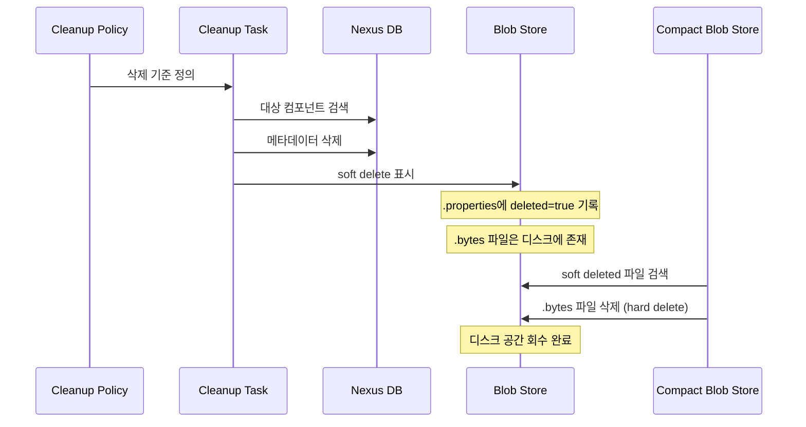
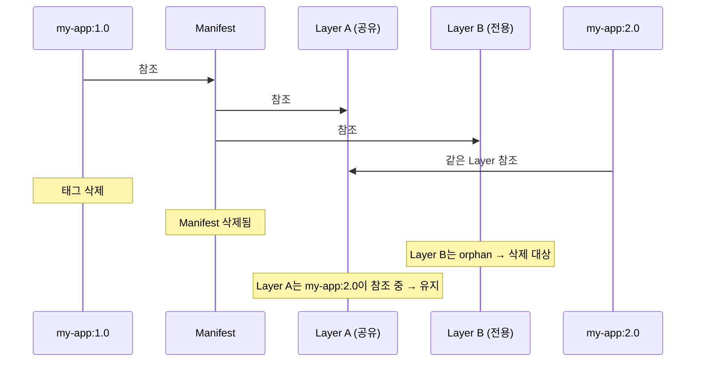
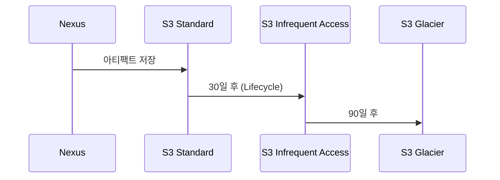

# 정리 정책과 스토리지 관리

---

> Cleanup → Compact 두 단계 모델, Blob Store 분리 전략, S3 전환의 트레이드오프. 디스크가 차기 전에 손을 대는 것이 새벽 3시 전화를 막는다.


## 1. 스토리지 증가 패턴

> 매 빌드마다 SNAPSHOT, 매 빌드마다 Docker 이미지 — CI가 본격 가동되면 디스크는 곡선이 아니라 절벽처럼 차오른다.

CI/CD가 돌면 아티팩트는 끊임없이 쌓인다. Maven SNAPSHOT은 매 커밋마다 배포되고, Docker 이미지는 매 빌드마다 새 태그를 찍으며, 프론트엔드는 매 PR마다 npm 패키지를 퍼블리시한다.

경험상 디스크 사용량은 초기에 완만하다가 CI가 본격 가동되면 급격히 올라간다. Docker 이미지는 layer 하나가 수십~수백 MB이므로 하루 10번 빌드만으로도 일주일에 수십 GB가 쌓인다. 디스크 90%를 넘기면 Nexus가 느려지고, 100%에 도달하면 write 실패로 CI 파이프라인 전체가 멈춘다. "디스크가 가득 찬 다음에 대응"하는 것과 "미리 정책을 설정하는 것"의 차이는 야근 여부를 가른다.


## 2. Blob Store 구조

> 메타데이터는 DB가, 바이너리는 Blob Store가 담는다. 둘이 일관된 스냅샷이어야 의미가 있다.

### 2.1 File Blob Store 내부

File Blob Store의 디렉토리 구조는 독특하다.

```text
${NEXUS_DATA}/blobs/default/
├── content/
│   ├── vol-01/
│   │   ├── chap-01/
│   │   │   ├── xxxxxxxx-xxxx-xxxx-xxxx-xxxxxxxxxxxx.properties
│   │   │   └── xxxxxxxx-xxxx-xxxx-xxxx-xxxxxxxxxxxx.bytes
│   │   └── chap-02/
│   └── vol-02/
├── metadata.properties
└── deletions-index
```

`.bytes`는 실제 아티팩트 데이터, `.properties`는 메타데이터(크기, SHA1, 생성 시간, deleted 여부)다. `vol-NN/chap-NN` 구조는 한 디렉토리에 너무 많은 파일이 몰리지 않도록 하는 샤딩이다.

soft delete가 일어나면 `.properties` 파일에 `deleted=true`와 `deletedDateTime`이 추가된다. 이 상태에서 `.bytes`는 디스크에 그대로 남으므로 디스크 사용량은 줄지 않는다. Compact Blob Store Task가 이 `.properties`를 스캔해 `deleted=true`인 항목의 `.bytes`를 실제로 삭제한다. 이것이 hard delete의 정체다.

이 구조를 직접 조작하면 안 된다. `rm`으로 `.bytes`를 지우면 DB와 정합성이 깨져 Nexus가 오류를 뿜는다. 반드시 Nexus API와 Task로 관리한다.

### 2.2 File vs S3 Blob Store

| 항목 | File Blob Store | S3 Blob Store |
|------|----------------|---------------|
| 저장 위치 | 로컬 파일시스템 | AWS S3 / S3 호환 |
| 성능 | 디스크 I/O (SSD 권장) | 네트워크 지연 50–200ms |
| 확장성 | 디스크 크기 한계 | 사실상 무제한 |
| 비용 | 디스크 구매·관리 | 사용량 기반 (저장 + 요청 + 전송) |
| 적합 환경 | 소규모, 온프레미스 | 대규모, 클라우드 |
| 백업 | 파일시스템 스냅샷 | S3 버전닝 / Cross-Region Replication |

Blob Store는 한 번 생성하면 타입을 변경할 수 없다. File에서 S3로 전환하려면 새 S3 Blob Store를 만들고 리포지토리의 Blob Store를 변경한 뒤 데이터를 마이그레이션해야 한다. 처음 설계 시 향후 스토리지 전략을 함께 고려한다.

### 2.3 분리 전략

```text
default          → Maven, npm, 기타
docker-blobs     → Docker 전용
archive-blobs    → 장기 보존 RELEASE (별도 대용량 디스크)
```

Docker 이미지가 Maven 아티팩트의 디스크를 잠식하는 일을 막을 수 있고, Docker 전용 Blob Store만 별도 대용량 디스크에 마운트하는 것도 가능하다. 모니터링 알람도 Blob Store 단위로 걸 수 있어 "Docker 스토리지 80% 도달" 같은 세분화된 알림이 가능하다.


## 3. Cleanup Policy

> 어떤 아티팩트를 삭제 대상으로 표시할지 정의한다. AND 조합이라 SNAPSHOT만 골라 정리할 수 있다.

### 3.1 정책 기준

| 기준 | 설명 | 적합 대상 |
|------|------|----------|
| Component Age | 배포된 지 N일 이상 | SNAPSHOT 정리 |
| Last Downloaded | 마지막 다운로드 후 N일 이상 | 미사용 아티팩트 |
| Release Type | Pre-release(SNAPSHOT) / Release | SNAPSHOT만 선택 |
| Asset Name Matcher | 이름 정규식 매칭 | 특정 패턴 |

기준은 AND 조합이다. "Component Age > 30일 AND Release Type = Pre-release"로 두면 30일 넘은 SNAPSHOT만 대상이 되고 RELEASE는 건드리지 않는다.

### 3.2 적용 단계

정책 생성은 `Administration → Repository → Cleanup Policies → Create Cleanup Policy`에서 한다. 이름은 한 번 정하면 변경할 수 없으므로 `cleanup-{format}-{target}-{period}` 패턴이 무난하다.

정책을 만든 것만으로는 아무 일도 일어나지 않는다. `Administration → Repository → Repositories → maven-snapshots → Cleanup → Cleanup Policy`에서 만든 정책을 선택해 연결한다. 하나의 리포지토리에 여러 정책을 연결하면 OR 조합으로 동작한다.

### 3.3 Preview로 검증

실제 삭제 전에 반드시 Preview를 돌린다.

- 정책 생성 직후 — 의도치 않은 RELEASE가 포함됐는지 확인한다
- 기준 조정 시 — Component Age를 30일에서 14일로 줄일 때 추가로 잡히는 규모를 본다
- 정기 점검 — 분기마다 Preview로 정리 효과를 확인한다

```bash
curl -u admin:admin123 -X POST \
  "http://localhost:8081/service/rest/v1/cleanup/preview" \
  -H "Content-Type: application/json" \
  -d '{
    "repository": "maven-snapshots",
    "criteriaLastDownloaded": 30,
    "criteriaReleaseType": "PRERELEASES"
  }'
```

Preview 시점과 실제 Cleanup Task 실행 시점 사이에 아티팩트가 다운로드되면 "Last Downloaded" 기준에서 빠질 수 있어 결과가 달라진다. 대략적인 규모 파악에는 충분하다.


## 4. Cleanup Task와 Compact Blob Store Task

> 두 단계로 나눈 핵심 이유는 안전성이다. soft delete가 복구 창(recovery window)을 만든다.



Cleanup Task가 DB 메타데이터를 제거하고 Blob의 `.properties`에 `deleted=true` 마크를 붙인다(soft delete). 이 시점에 Nexus UI/API에서는 보이지 않지만 디스크의 `.bytes`는 그대로다. 이후 Compact Blob Store Task가 `deleted=true` 항목의 `.bytes`를 실제로 삭제한다(hard delete).

두 단계로 나눈 첫 번째 이유는 복구 가능성이다. 잘못된 정책으로 필요한 아티팩트가 삭제됐을 때 hard delete 전이라면 DB 메타데이터를 복원해 복구할 여지가 있다. 두 번째 이유는 성능 분리다. Cleanup은 DB 쿼리 위주, Compact는 파일시스템 I/O 위주라 서로 다른 시간대로 분산하면 서비스 영향이 줄어든다.

이 2단계 패턴은 Nexus 고유의 발명이 아니다. PostgreSQL VACUUM이 dead tuple을 정리하는 것과 본질적으로 같은 문제를 푼다 — 즉시 삭제보다 "삭제 마크 → 나중 정리"가 동시성과 안전성에 유리하다.

### 4.1 태스크 스케줄링

```text
# Cleanup Task
이름:   Admin - Cleanup repositories using their associated policies
스케줄: 매일 새벽 2시

# Compact Blob Store Task (Blob Store별)
이름:   Admin - Compact blob store (default)
스케줄: 매일 새벽 4시

이름:   Admin - Compact blob store (docker-blobs)
스케줄: 매일 새벽 5시
```

Compact는 Cleanup보다 나중이어야 한다. Blob Store가 여러 개라면 각각 Compact Task를 만들고 시간을 분산해 I/O 부하 집중을 피한다.


## 5. Docker 이미지 정리의 특수성

> manifest와 layer의 다대다 참조 관계 때문에 한 번의 Cleanup으로 끝나지 않을 수 있다.



태그를 삭제해도 manifest가 참조하던 layer 중 다른 이미지가 사용 중인 layer는 삭제되지 않는다. Cleanup Task가 이 참조 관계를 추적한다.

manifest list(멀티 아키텍처)는 manifest list → platform manifest → layer라는 3단 참조다. manifest list만 삭제하면 하위 platform manifest가 orphan이 되고, 그 다음 정리 사이클에서야 layer가 orphan이 된다. Cleanup을 일주일에 2~3회 실행해야 완전히 정리되는 환경도 있다. Cleanup 후 디스크가 예상만큼 줄지 않으면 한 번 더 실행해 본다.

가장 디스크를 잡아먹는 건 dangling 이미지(태그 없어진 manifest)다. Nexus UI의 Browse에서 보이며, Cleanup의 1차 타깃이다.


## 6. 실무 정리 전략

> 포맷별 라이프사이클이 다르다. SNAPSHOT은 공격적으로, RELEASE는 보수적으로.

### 6.1 Maven SNAPSHOT

```text
정책: cleanup-maven-snapshots
기준: Component Age > 30일 AND Release Type = Pre-release
```

30일이면 대부분의 개발 주기를 커버한다. 한 달 넘게 참조되지 않는 SNAPSHOT은 RELEASE로 전환됐거나 폐기된 것이므로 삭제해도 안전하다. 장기 브랜치가 있다면 "Last Downloaded > 30일" 기준을 추가해 실제 사용 중인 SNAPSHOT은 보존한다.

### 6.2 Docker 이미지

```text
정책 1: cleanup-docker-untagged
기준: Asset Name Matcher = .*  (태그 없는 이미지)

정책 2: cleanup-docker-old
기준: Last Downloaded > 14일 AND Component Age > 30일
```

### 6.3 npm 패키지

npm은 semver를 엄격히 따르므로 특정 버전을 삭제하면 `package-lock.json`에 그 버전을 명시한 프로젝트의 빌드가 깨진다. RELEASE 버전은 가급적 삭제하지 않고 pre-release(`1.0.0-alpha.1` 등)만 정리한다.

```text
정책: cleanup-npm-prerelease
기준: Asset Name Matcher = .*-(alpha|beta|rc)\..*
      AND Last Downloaded > 60일
```

### 6.4 포맷별 정리 주기

| 포맷 | 대상 | 주기 | 기준 |
|------|------|------|------|
| Maven SNAPSHOT | 전체 | 매일 | 30일 미다운로드 |
| Maven RELEASE | 삭제 안 함 | — | 규제 환경에서는 영구 보존 |
| Docker hosted | untagged + 오래된 태그 | 매일 | 14일 미다운로드 |
| Docker proxy cache | 캐시 이미지 | 매주 | 7일 미다운로드 |
| npm | pre-release만 | 매주 | 60일 미다운로드 |


## 7. 스토리지 모니터링

> 70/85/95% 임계값으로 단계별 알림을 건다. Nexus 자체에는 디스크 알림이 없으므로 외부 도구와 연계한다.

### 7.1 Blob Store 상태 조회

```bash
# Blob Store 목록 및 상태
curl -u admin:admin123 \
  http://localhost:8081/service/rest/v1/blobstores

# 특정 Blob Store 쿼터 상태
curl -u admin:admin123 \
  http://localhost:8081/service/rest/v1/blobstores/default/quota-status
```

### 7.2 임계값 알림

```bash
#!/bin/bash
THRESHOLD_WARN=70
THRESHOLD_CRIT=85
BLOB_PATH="/opt/sonatype-work/nexus3/blobs"

USAGE=$(df "$BLOB_PATH" | tail -1 | awk '{print $5}' | sed 's/%//')

if [ "$USAGE" -ge "$THRESHOLD_CRIT" ]; then
  echo "CRITICAL: Nexus Blob Store at ${USAGE}%" | \
    mail -s "[CRITICAL] Nexus Storage Alert" ops-team@company.com
elif [ "$USAGE" -ge "$THRESHOLD_WARN" ]; then
  echo "WARNING: Nexus Blob Store at ${USAGE}%" | \
    mail -s "[WARNING] Nexus Storage Alert" ops-team@company.com
fi
```

| 임계값 | 단계 | 권장 행동 |
|--------|------|-----------|
| 70% | 경고 | 정리 정책 검토 시작 |
| 85% | 심각 | 즉시 수동 정리 또는 디스크 증설 |
| 95% | 긴급 | Nexus 중단 위험 |

본격적인 모니터링은 Prometheus + Grafana 조합이 적합하다(05-03에서 다룬다).


## 8. S3 Blob Store

> 디스크 한계가 보이면 S3 전환을 검토한다. 같은 리전이면 비용이 EBS보다 저렴할 수 있다.

### 8.1 생성

`Administration → Repository → Blob Stores → Create Blob Store → S3`에서 만든다.

```text
Name: s3-docker-blobs
Region: ap-northeast-2 (서울)
Bucket: company-nexus-docker
Prefix: docker-blobs/
Access Key ID: AKIA...
Secret Access Key: ********
```

S3 호환 스토리지(MinIO, Ceph)라면 Endpoint URL을 추가로 지정한다.

### 8.2 비용 감각

```text
시나리오: Docker 이미지 500GB, 일일 빌드 50회, 이미지 평균 200MB

저장 비용:
  S3 Standard         500GB × $0.025/GB = $12.50/월
  500GB SSD (gp3)     $40/월 + IOPS 비용

요청 비용 (일일):
  PUT 250회 × $0.005/1000 = $0.001
  GET 2,500회 × $0.0004/1000 = $0.001
  → 월 $0.06 (무시 가능)

데이터 전송:
  같은 리전 내       무료
  인터넷 전송        $0.09/GB
```

같은 리전이라면 S3가 EBS보다 저렴할 수 있다. 다만 네트워크 지연(50–200ms)이 추가되므로, 빈번한 접근이 필요한 데이터는 File Blob Store, 아카이브성은 S3로 분리하는 하이브리드 전략이 균형점이다.

### 8.3 수명 주기



Glacier로 이동한 아티팩트는 Nexus가 즉시 서빙할 수 없다(복구에 수 시간). 따라서 Cleanup Policy로 실제 미사용 아티팩트를 먼저 삭제하고, S3 Lifecycle은 보험 차원의 비용 최적화로 본다.


## 9. 자주 만나는 함정

> 네 가지가 반복적으로 운영자를 잡는다.

### 9.1 Cleanup 했는데 용량이 안 줄어요

Compact Blob Store Task까지 실행돼야 디스크가 회수된다. Cleanup만 하고 끝나는 건 가장 흔한 착각이다.

### 9.2 RELEASE를 실수로 삭제했어요

Cleanup Policy에서 Release Type 필터를 빠뜨리면 RELEASE까지 정리된다. "Component Age > 30일"만 있고 Release Type = Pre-release를 안 걸면 30일 지난 RELEASE도 대상이 된다. Preview에서 RELEASE가 한 건이라도 보이면 즉시 정책을 수정한다. 규제 환경의 RELEASE는 별도 Blob Store에 보관하고 Cleanup Policy를 아예 연결하지 않는 것이 표준이다.

### 9.3 Compact가 너무 오래 걸려요

Blob Store에 수십만 개의 blob이 있으면 Compact가 수 시간 걸릴 수 있다. 점검 항목은 다음 셋이다.

- Blob Store가 NFS 같은 네트워크 파일시스템에 있지 않은가? (로컬 디스크보다 10~100배 느림)
- HDD를 SSD로 교체할 수 있는가?
- Blob Store를 분리해 Compact 대상 범위를 줄일 수 있는가?

### 9.4 Blob Store에서 파일을 직접 삭제했어요

`rm`으로 `.bytes`를 지우면 DB와 정합성이 깨진다. 이미 했다면 "Repair - Reconcile component database from blob store" 태스크로 DB를 Blob Store에 맞추는 것이 차선이다. 모든 케이스를 완벽히 복구하지는 못하므로 처음부터 API/Task 사용 원칙을 지킨다.


## 10. 디스크 90% 긴급 대응

> docker-proxy 캐시 → SNAPSHOT 공격적 정리 → 임시 디스크 추가 순서로 점진적으로 부담을 푼다.

가장 빠른 효과는 docker-proxy 캐시 무효화다. 내부 아티팩트를 건드리지 않으므로 영향 범위가 작다.

```bash
curl -u admin:admin123 -X POST \
  "http://localhost:8081/service/rest/v1/repositories/docker-proxy/invalidate-cache"

# Compact 즉시 실행
curl -u admin:admin123 -X POST \
  "http://localhost:8081/service/rest/v1/tasks/run" \
  -H "Content-Type: application/json" \
  -d '{"id": "<compact-task-id>"}'
```

다음 단계는 SNAPSHOT과 untagged Docker 이미지를 대상으로 "Component Age > 7일" 같은 공격적 Cleanup Policy를 임시 적용하고 Cleanup + Compact를 수동 실행한다. 정상화 후 원래 정책으로 되돌린다 — 캘린더 리마인더를 걸어 두면 좋다.

위 조치로 부족하면 임시 디스크를 마운트해 Blob Store 경로를 변경하거나, 새 Blob Store를 추가 디스크에 생성해 일부 리포지토리를 이동한다. 어떤 상황에서도 Blob Store 디렉토리에서 파일을 직접 삭제하지 않는다. 정합성 깨진 Nexus 복구 시간이 디스크 정리 시간보다 몇 배 길다.


## 11. 정리

| 항목 | 핵심 |
|------|------|
| Blob Store 분리 | 포맷별·환경별로 분리해 모니터링·정리 단위 분할 |
| Cleanup Policy | Preview로 검증, Release Type 필터 누락 주의 |
| 2단계 삭제 | Cleanup(soft) → Compact(hard). 복구 창이 안전선 |
| Docker 정리 | manifest list 다단 참조, Cleanup 2~3회 반복 가능 |
| S3 전환 | 같은 리전이면 비용 우위. 네트워크 지연은 트레이드오프 |
| 모니터링 | 70/85/95% 단계 알림 |

스토리지 관리의 핵심 흐름은 다섯 단계다 — Blob Store 설계, Cleanup Policy 설정, 태스크 스케줄링, 모니터링, 확장 계획. 디스크 차기 전 대응과 차고 난 뒤 대응의 차이는 새벽 3시 전화 여부를 가른다.


## 관련 문서

- [02-02.프록시와 캐싱 전략](02-02.프록시와 캐싱 전략.md) — proxy 캐시 무효화와 Cleanup의 관계
- [05-02.백업 복구 업그레이드](05-02.백업 복구 업그레이드.md) — Blob Store 백업 전략
- [05-점검.핵심 질문과 답](05-점검.핵심 질문과 답.md) — 2단계 삭제·Docker 정리·긴급 대응 점검
