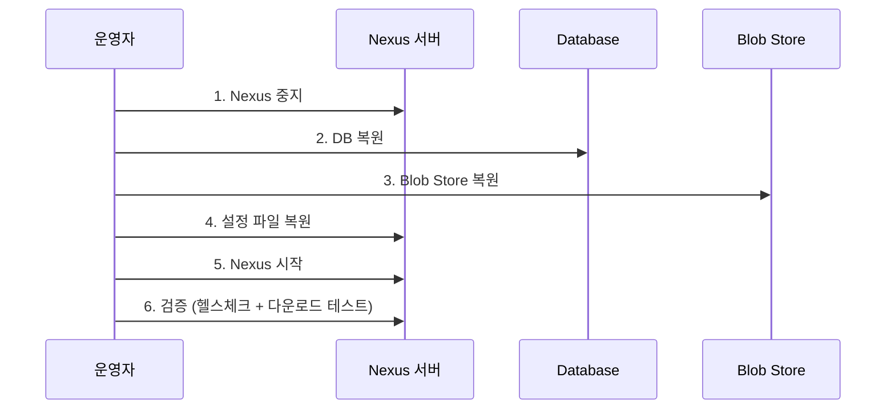
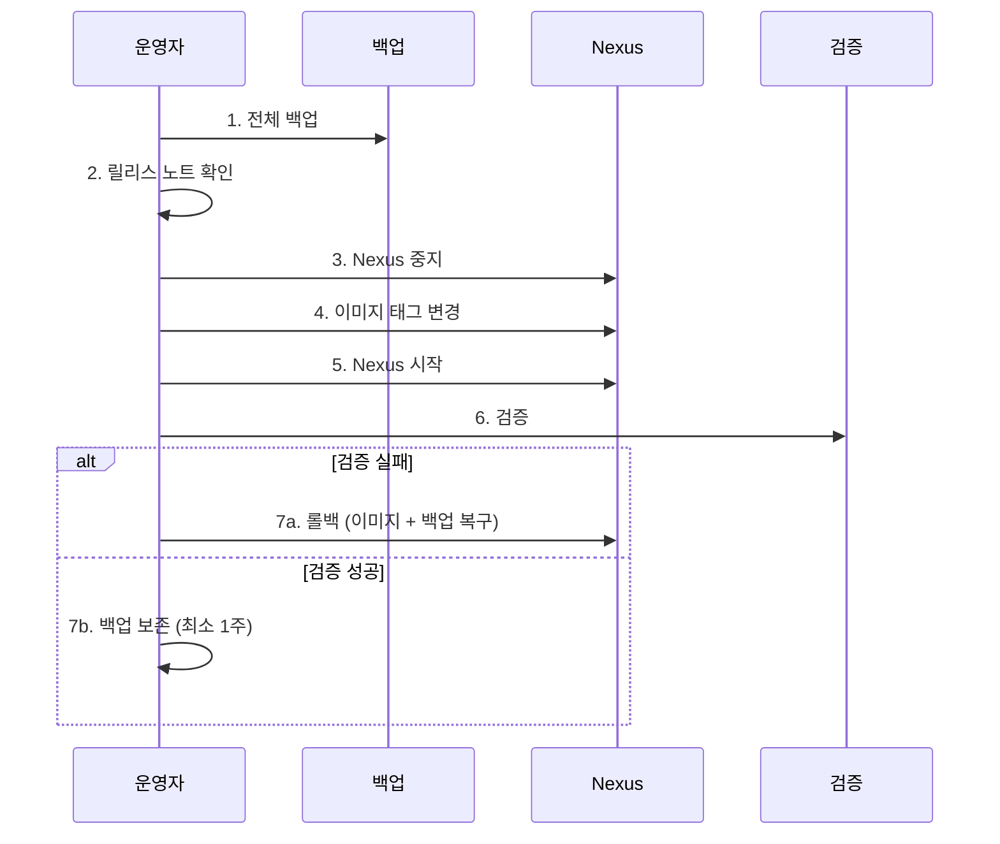

# 백업·복구·업그레이드

---

> Blob Store + DB + 설정 셋이 일관된 스냅샷이어야 의미가 있다. 테스트하지 않은 백업은 백업이 아니다.


## 1. 백업 대상

> 셋이 모두 필요하다. 하나라도 빠지면 복구가 불완전하거나 불가능하다.

| 구성 요소 | 위치 (Docker 기준) | 내용 | 중요도 |
|-----------|-------------------|------|--------|
| Blob Store | `nexus-data/blobs/` | 실제 아티팩트 바이너리 | 최고 — 없으면 모든 아티팩트 손실 |
| Database | `nexus-data/db/` | 메타데이터, 사용자, 권한, 설정 | 높음 — 없으면 아티팩트를 찾을 수 없음 |
| 설정 파일 | `nexus-data/etc/` | `nexus.properties`, 커스텀 설정 | 중간 — 재설정 가능하지만 번거로움 |

Blob Store와 DB의 관계가 핵심이다. Blob Store에 파일이 있어도 DB가 없으면 어떤 파일이 어떤 아티팩트인지 알 수 없고, DB만 있고 Blob Store가 없으면 메타데이터는 있지만 실제 파일을 제공할 수 없다. 둘은 반드시 함께 백업하고 함께 복구해야 정합성이 유지된다.

설정 파일(`etc/`)을 빠뜨리는 팀이 흔하다. 복구 후 모든 리포지토리 설정·Cleanup Policy·Scheduled Task·HTTP 프록시를 수작업으로 다시 만들어야 하므로 리포지토리가 10개 이상이면 수 시간이 걸린다. `etc/`도 백업 범위에 반드시 포함한다.

크기 비율도 알아 두면 백업 시간 산정에 도움이 된다. Blob Store가 전체의 95%를 차지하고, DB는 수백 MB~수 GB, 설정은 수 MB 이하다.


## 2. 백업 방법

> 정합성이 핵심이다. cold backup이 가장 확실하고, hot backup은 LVM/ZFS 스냅샷이나 순서 전략으로 보완한다.

### 2.1 DB Export Task (Nexus 내장)

`Administration → System → Tasks`에서 설정한다.

```text
태스크: Admin - Export databases for backup
파라미터: Location = /nexus-data/backup
스케줄: 매일 새벽 1시
```

이 태스크는 DB 메타데이터만 내보낸다. Blob Store는 백업하지 않으므로 별도로 챙겨야 완전한 복구가 된다. REST API로 수동 트리거(`POST /service/rest/v1/tasks/{taskId}/run`)도 가능하므로, "DB Export → 파일시스템 백업" 순서를 자동화할 때 활용한다.

### 2.2 파일시스템 백업

가장 단순하고 확실한 방법이다.

```bash
# Cold backup (정합성 보장, 다운타임 발생)
docker compose stop nexus
tar czf nexus-backup-$(date +%Y%m%d).tar.gz /path/to/nexus-data/
docker compose up -d nexus

# 또는 rsync로 증분 백업
rsync -avz --delete /path/to/nexus-data/ /backup/nexus-data/
```

Nexus를 멈추고 백업하면 정합성이 보장되지만 다운타임이 생긴다. 멈추지 않고 백업하면 다운타임은 없지만 백업 도중 쓰기가 발생하면 DB와 Blob Store 간 불일치가 생긴다. 30GB 규모라면 cold backup도 5–10분이면 끝나므로 이 다운타임이 허용되는 환경이라면 cold가 안전하다.

다운타임이 허용되지 않는 환경에서는 LVM 스냅샷이나 ZFS 스냅샷으로 hot backup의 정합성을 확보한다. 클라우드라면 EBS Snapshot(AWS)이나 Persistent Disk Snapshot(GCP)이 같은 역할을 한다. 스냅샷은 COW 방식이라 생성 자체는 밀리초다.

### 2.3 Docker volume 백업

named volume을 쓰는 경우의 표준 패턴이다.

```bash
docker run --rm \
  -v nexus-data:/source:ro \
  -v $(pwd)/backups:/backup \
  alpine tar czf /backup/nexus-data-$(date +%Y%m%d_%H%M%S).tar.gz -C /source .
```

`:ro`(read-only)로 마운트해도 Nexus 컨테이너의 쓰기를 막는 건 아니다. 안전하게 하려면 Nexus를 먼저 멈추는 편이 낫다.

### 2.4 S3 Blob Store

Blob Store가 S3에 있으면 S3 자체 기능으로 백업한다.

- S3 Versioning — 객체 삭제/덮어쓰기 시 이전 버전 보존
- Cross-Region Replication — 다른 리전으로 자동 복제
- S3 Object Lock — WORM(Write Once Read Many)으로 삭제 방지

DB는 별도 백업이 필요하다. DB는 Nexus 서버 로컬 디스크에 있으므로 DB Export Task나 파일시스템 백업으로 보호하고, Blob Store는 S3에 맡기는 구조다.


## 3. 복구 절차

> 핵심은 DB와 Blob Store를 같은 시점의 백업으로 복원하는 것이다.



### 3.1 복원 스크립트

```bash
# 1. Nexus 중지
docker compose stop nexus

# 2. 기존 데이터 보호 백업 (만약을 위해)
docker run --rm -v nexus-data:/data alpine sh -c \
  "cd /data && tar czf /tmp/before-restore.tar.gz ."

# 3. 백업에서 복원
docker run --rm \
  -v nexus-data:/target \
  -v $(pwd)/backups:/backup \
  alpine sh -c "rm -rf /target/* && tar xzf /backup/nexus-data-20260307.tar.gz -C /target"

# 4. Nexus 시작
docker compose up -d nexus

# 5. 헬스체크 (시작까지 1-2분)
sleep 120
curl -f http://localhost:8081/service/rest/v1/status
```

### 3.2 검증 체크리스트

Nexus 시작 후 다음을 확인한다.

- `/service/rest/v1/status`가 200 OK 반환
- 관리자 로그인 가능
- 주요 리포지토리가 Browse에 보이는지
- 최근 배포된 아티팩트가 다운로드 가능한지
- Cleanup Policy, Scheduled Tasks가 유지돼 있는지
- 사용자 계정과 권한 복원 여부

다운로드 가능 여부 검증이 가장 중요하다. DB만 복원되고 Blob Store가 불완전하면 메타데이터는 보이지만 실제 다운로드 시 404가 난다.


## 4. 업그레이드

> Docker 환경에서는 이미지 태그 변경 한 줄이지만, DB 마이그레이션이 동반되면 롤백 가능성이 사라진다. 사전 백업이 절대 조건이다.

### 4.1 버전 호환성

업그레이드 전 릴리스 노트를 반드시 확인한다. 마이너 버전(예: 3.68 → 3.69)은 대체로 호환되지만 메이저 변경이 포함되면 특별한 절차가 필요하다.

특히 주의할 변경사항이다.

- DB 엔진 변경 — OrientDB → H2 (Nexus 3.70+)
- API 변경 — 사용 중인 REST API 엔드포인트의 deprecation
- Java 버전 변경 — 최소 요구사항 상향
- 보안 변경 — 기본 비밀번호 정책, Realm 설정

### 4.2 절차



```bash
# 사전 준비
./scripts/backup.sh ./backups
docker inspect sonatype/nexus3 --format='{{.Config.Image}}' | head -1

# 실행
docker compose stop nexus
# docker-compose.yml 이미지 태그 수정
docker compose pull nexus
docker compose up -d nexus

# 첫 시작 시 DB 마이그레이션이 진행될 수 있으므로 로그 모니터링
docker compose logs -f nexus

# 검증
curl -f http://localhost:8081/service/rest/v1/status
```

### 4.3 롤백

업그레이드 후 문제가 생기면 단순히 이미지 태그만 되돌려서는 안 된다. 새 버전이 DB 스키마를 바꿨다면 이전 버전이 그 스키마를 읽지 못해 시작이 실패한다.

```bash
docker compose stop nexus
# docker-compose.yml에서 이전 이미지 태그로 복원
./scripts/restore.sh ./backups/nexus-data-20260307.tar.gz
docker compose up -d nexus
```

이미지와 백업 데이터를 함께 복원해야 안전하다. 빠른 롤백을 위해 사전 백업에 명확한 이름을 붙인다 — `nexus-data-pre-upgrade-3.68.0-to-3.69.0-20260307.tar.gz`처럼 이전/이후 버전과 날짜를 파일명에 포함하면 어떤 백업으로 돌아가야 하는지 즉시 보인다.

### 4.4 다운타임 최소화

OSS는 단일 노드이므로 다운타임이 불가피하다. 줄이는 방법은 다음 셋이다.

- 사전 pull — `docker compose pull nexus`로 이미지를 미리 받아 두면 전환 시 다운로드 시간이 사라진다
- 시간 선택 — CI 빌드가 없는 시간(새벽, 주말)에 실행
- 빠른 검증 — 자동화된 스모크 테스트로 검증 시간을 단축

Nexus Pro의 HA 클러스터로 롤링 업그레이드가 가능하지만 OSS에서는 불가능하다.

### 4.5 버전 점프 전략

Sonatype 권장은 마이너 버전 순차 업그레이드다. 3.60에서 3.70으로 가려면 3.60 → 3.65 → 3.70 순서가 안전하다. 각 마이너 버전의 DB 마이그레이션 스크립트가 이전 버전 스키마를 전제하기 때문이다. 패치 버전(3.69.0 → 3.69.1)은 자유롭게 올린다.

릴리스 노트의 Breaking Changes와 Upgrade Notes 섹션을 반드시 확인한다. 무시하고 올렸다가 deprecated API가 제거돼 CI 파이프라인이 깨지는 사고가 종종 일어난다.

### 4.6 체크리스트

| 단계 | 항목 |
|------|------|
| 사전 | 릴리스 노트 (Breaking Changes) 확인 |
| 사전 | 현재 버전 기록 |
| 사전 | 전체 백업 + 무결성 확인 |
| 사전 | 새 이미지 사전 pull |
| 실행 | Nexus 중지 → 이미지 변경 → 시작 |
| 검증 | 헬스체크 통과 |
| 검증 | 관리자 로그인 + 리포지토리 목록 |
| 검증 | CI에서 push/pull 테스트 |
| 사후 | DB 마이그레이션 로그에 에러 없음 |
| 사후 | 이전 백업 최소 1주 보존 |


## 5. 백업 자동화

> cron + 스크립트가 기본이다. 매주 자동 복구 검증까지 묶으면 "백업이 살아 있다"는 신뢰가 쌓인다.

### 5.1 cron 스케줄

```bash
# 매일 새벽 3시 백업
0 3 * * * /opt/nexus/scripts/backup.sh /opt/nexus/backups >> /var/log/nexus-backup.log 2>&1
```

스크립트 핵심 흐름은 다음 넷이다.

1. DB Export Task를 REST API로 트리거
2. Volume 데이터를 tar로 아카이브
3. 30일 이상 된 백업을 자동 삭제
4. 결과를 로그에 기록

### 5.2 복구 검증 자동화

백업했는데 복구가 안 되면 의미가 없다. 매주 자동 복구 테스트를 돌리는 것이 정답이다.

```bash
# 매주 일요일 새벽에 별도 환경에서 최신 백업을 복원하고 헬스체크
docker run --rm \
  -v $(pwd)/backups:/backup:ro \
  -v nexus-test-data:/nexus-data \
  -p 18081:8081 \
  sonatype/nexus3:3.69.0 &

sleep 180
curl -f http://localhost:18081/service/rest/v1/status
docker stop $(docker ps -q --filter ancestor=sonatype/nexus3)
```

이 테스트를 한 번도 안 해본 팀에서 실제 장애가 나면 백업 파일이 손상돼 있거나 복구 절차를 몰라서 RTO가 몇 시간으로 늘어난다. 복구 검증을 Jenkins 파이프라인에 묶고 결과를 Slack/이메일로 통보하면 별도 모니터링 인프라 없이도 백업 유효성이 지속 검증된다.


## 6. 백업 전략 설계

> RPO와 RTO를 먼저 정한다. "Nexus가 N시간 다운되면 무슨 일이 벌어지는가"라는 질문이 모든 결정을 지배한다.

### 6.1 RPO·RTO

- RPO(Recovery Point Objective) — 최대 허용 데이터 손실 시간. 1시간이면 매 시간 백업.
- RTO(Recovery Time Objective) — 최대 허용 복구 시간. 30분이면 자동화된 복구 스크립트 + 모니터링이 필수.

| 환경 | RPO | RTO | 백업 전략 |
|------|-----|-----|-----------|
| 개발/테스트 | 24시간 | 4시간 | 일일 백업, 수동 복구 |
| 스테이징 | 12시간 | 2시간 | 12시간 백업, 스크립트 복구 |
| 프로덕션 | 1시간 | 30분 | 시간별 증분, 자동 복구 |

CI 빌드가 로컬 캐시(`~/.m2`, `node_modules`)로 돌아갈 수 있다면 실제 영향이 제한적이고 RTO를 4시간으로 잡아도 된다. 컨테이너 기반 CI가 매번 깨끗한 환경으로 시작한다면 Nexus 다운이 곧 전체 개발팀 작업 중단이다. RPO도 SNAPSHOT 위주면 24시간으로 충분하지만 RELEASE가 포함된 환경은 더 짧아야 한다 — RELEASE 재빌드가 동일한 바이너리를 보장하지 않기 때문이다.

### 6.2 증분 백업

```bash
# 변경된 파일만 전송
rsync -avz --delete /var/nexus-data/ /backup/nexus-data/

# hard link 기반 일별 스냅샷
rsync -avz --delete --link-dest=/backup/latest \
  /var/nexus-data/ \
  /backup/$(date +%Y%m%d)/
ln -sfn /backup/$(date +%Y%m%d) /backup/latest
```

`--link-dest`는 변경되지 않은 파일을 이전 백업의 hard link로 잡으므로 디스크를 절약하면서 일별 스냅샷을 유지한다.

### 6.3 보관 정책

| 백업 유형 | 보관 기간 | 이유 |
|-----------|----------|------|
| 일일 | 최근 7일 | 최근 변경 추적 |
| 주간 | 최근 4주 | 주 단위 롤백 포인트 |
| 월간 | 최근 6개월 | 장기 보존, 감사 |
| 업그레이드 직전 | 다음 업그레이드 성공까지 | 롤백 가능성 |

`find /backup -name "nexus-data-*.tar.gz" -mtime +30 -delete`로 자동 삭제하되 월간 백업은 별도 디렉토리에 분리해 삭제 대상에서 제외한다.

### 6.4 원격 백업 (3-2-1 원칙)

로컬 디스크에만 백업을 두면 서버 장애 시 백업까지 함께 사라진다. 3개 복사본·2종 미디어·1개 오프사이트 원칙을 적용한다.

```bash
aws s3 cp /backup/nexus-data-$(date +%Y%m%d).tar.gz \
  s3://company-backups/nexus/ \
  --storage-class STANDARD_IA

rsync -avz /backup/ backup-server:/backup/nexus/
```

S3의 `STANDARD_IA`(Infrequent Access)는 자주 접근하지 않는 백업의 저장 비용을 절감한다.


## 7. 자주 만나는 함정

> "백업했는데 복구가 안 돼요" 사고는 거의 다 이 셋 중 하나에서 비롯된다.

### 7.1 DB Export만 했다

DB Export Task의 이름이 "Export databases for backup"이라 이것만 하면 전체 백업으로 착각한다. Blob Store까지 포함한 nexus-data 전체 백업이 되어야 완전한 복구가 가능하다.

### 7.2 hot backup의 정합성 불일치

Nexus 실행 중 백업하면 백업 시작과 종료 사이에 새 아티팩트가 배포될 수 있다. DB에는 메타데이터가 있는데 Blob Store 백업에는 파일이 없는 상황이 생긴다. 복구 후 해당 아티팩트 접근 시 404가 난다.

완벽한 정합성은 cold backup이다. hot backup이 필요하면 DB Export → Blob 백업 순서로 진행해 불일치 창을 최소화한다. DB에 있는데 Blob에 없는 불일치가, Blob에 있는데 DB에 없는 orphan blob보다 훨씬 치명적이다.

### 7.3 업그레이드 후 시작이 느려요

새 버전이 DB 마이그레이션을 수행하면 첫 시작이 평소보다 훨씬 오래 걸린다. 아티팩트가 많으면 수십 분 걸리기도 한다. "안 되는 건가?" 하고 강제 종료하면 DB가 손상된다. `docker compose logs -f nexus`로 마이그레이션 진행을 확인한다.


## 8. DR 사이트 (참고)

> "주 사이트 전체가 불능이 되어도 보조 사이트에서 서비스를 이어갈 수 있는가"의 문제다.

OSS에서 현실적인 DR 전략은 다음 셋의 조합이다.

1. S3 Blob Store + Cross-Region Replication으로 아티팩트를 보호
2. DB 백업을 매 시간 S3에 업로드
3. DR 사이트에 Nexus 설정이 완료된 Docker 환경을 미리 준비

장애 시 DB 복원 + Blob Store S3 엔드포인트 변경으로 30분 내 복구가 가능하다. DNS 전환(Route 53 failover)까지 자동화하면 개발자 측에서는 URL 변경 없이 DR 사이트를 사용할 수 있다. Nexus Pro Replication을 쓰면 더 깔끔하지만 라이선스 비용이 동반된다.


## 9. 정리

| 항목 | 방법 | 주기 | 비고 |
|------|------|------|------|
| DB 백업 | DB Export Task | 매일 | 메타데이터만 |
| 전체 백업 | Volume tar/rsync | 매일 | DB + Blob Store + 설정 |
| 복구 테스트 | 별도 환경 복원 | 매주 | 백업 유효성 검증 |
| 업그레이드 | 이미지 태그 변경 | 릴리스 주기 | 반드시 사전 백업 |

핵심 원칙은 하나다 — 테스트하지 않은 백업은 백업이 아니다. 매일 백업을 돌려도 실제 복원으로 서비스가 살아나는지 주기적으로 확인하지 않으면 장애 시 RTO가 무너진다. 백업 스크립트보다 복구 검증 자동화에 더 많은 시간을 투자하는 것이 옳은 우선순위다.


## 관련 문서

- [05-01.정리 정책과 스토리지 관리](05-01.정리 정책과 스토리지 관리.md) — Blob Store 구조와 분리 전략
- [05-점검.핵심 질문과 답](05-점검.핵심 질문과 답.md) — hot backup 정합성·롤백 불가 시나리오·RPO/RTO 점검
