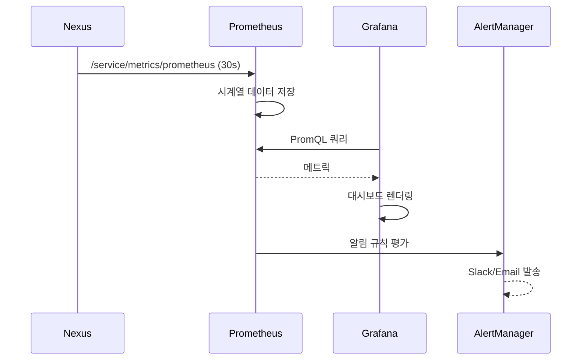
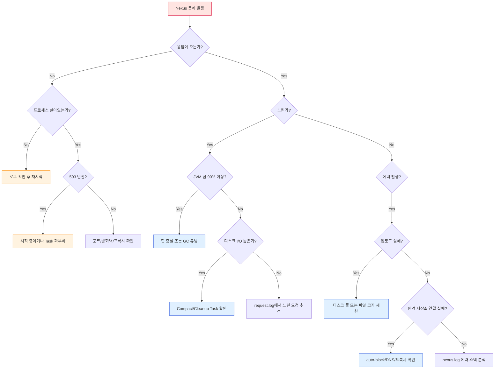

# 모니터링과 트러블슈팅

---

> 내장 Status·로그·Prometheus 메트릭의 3계층, 그리고 5분 타임박스 진단 절차. 장애의 80%는 JVM 힙과 디스크에서 갈린다.


## 1. Nexus 내장 모니터링

> 외부 도구를 붙이기 전, 첫 30초 안에 봐야 할 곳들이다.

### 1.1 System Status

`Administration → System → Status`에서 노드 상태를 확인한다. 단순해 보이지만 "Nexus가 정상적으로 떠 있는가?"라는 가장 기본적인 질문에 답을 준다.

```bash
# 기본 상태 (인증 불필요)
curl -s http://localhost:8081/service/rest/v1/status

# 쓰기 가능 상태 (시작 완료 여부)
curl -s http://localhost:8081/service/rest/v1/status/writable
```

시작 직후에는 `/status`는 200을 반환하지만 `/status/writable`은 503일 수 있다. Docker healthcheck나 Kubernetes readinessProbe에서 이 차이를 구분해야 한다.

### 1.2 System Information

`Administration → System → Support → System Information`에서 JVM·OS·메모리·디스크 정보를 한눈에 본다. 트러블슈팅의 출발점이다. 주목할 항목은 다음 셋이다.

- JVM Memory — 힙 사용량이 최대값의 90%를 넘기면 GC 압박이 시작된다
- File Descriptors — 열린 파일 수가 한계에 가까우면 연결 거부가 발생한다
- Blob Store — 각 Blob Store 사용량과 남은 공간

### 1.3 Scheduled Tasks와 성능 영향

`Administration → System → Tasks`에서 백그라운드 작업 상태를 본다. Nexus의 Scheduled Task는 메인 애플리케이션과 같은 JVM에서 실행된다. 별도 워커가 아니므로 무거운 Task가 돌면 사용자 요청 처리 리소스가 줄어든다.

| 작업 | 주기 | 주된 영향 |
|------|------|----------|
| Compact Blob Store | 일간 | 디스크 I/O 급증 |
| Rebuild repository index | 수동 | DB 락 경합, CPU + I/O |
| Cleanup unused components | 일간/주간 | DB·메모리 부담 |
| Download indexes (proxy) | 일간 | 네트워크 + 디스크 |

"왜 매일 오전 10시에 느려지지?"라는 질문의 답이 이 표에 있는 경우가 많다. Task 스케줄을 업무 시간 밖(새벽 2~5시)으로 옮기고 시간을 분산시키면 체감 성능이 개선된다.


## 2. 로그 시스템

> nexus.log와 request.log 둘을 구분해야 엉뚱한 곳에서 시간을 낭비하지 않는다.

### 2.1 nexus.log

애플리케이션 로그다. Nexus 내부에서 발생하는 에러 스택트레이스, 플러그인 로딩, 스케줄 작업 결과가 여기에 남는다.

```bash
docker logs -f nexus --tail 100
docker exec nexus tail -f /nexus-data/log/nexus.log
```

기본 레벨은 INFO인데 특정 문제 추적 시 런타임에 변경할 수 있다. 재시작 없이 변경 가능한 점이 운영 환경에서 큰 장점이다.

```bash
# 로거 레벨을 DEBUG로 변경
curl -u admin:admin123 -X PUT \
  'http://localhost:8081/service/rest/v1/logging/loggers/org.sonatype.nexus.repository.httpbridge' \
  -H 'Content-Type: application/json' \
  -d '"DEBUG"'

# 원래 레벨로 복원
curl -u admin:admin123 -X DELETE \
  'http://localhost:8081/service/rest/v1/logging/loggers/org.sonatype.nexus.repository.httpbridge'
```

DEBUG는 로그 양이 폭발적으로 증가하니 문제 재현 직전에 켜고 재현 후 즉시 끈다. 켜놓고 잊으면 디스크가 금방 찬다.

### 2.2 request.log

HTTP 접근 로그다. 응답 시간이 마지막 필드(밀리초)에 들어 있어 느린 요청 추적에 유용하다.

```text
192.168.1.10 - admin [07/Mar/2026:10:15:23 +0900] "GET /repository/maven-public/.../spring-core-6.1.0.jar HTTP/1.1" 200 1847552 234
```

마지막 234가 응답 시간(ms)이다.

```bash
# 3초 이상 걸린 요청
awk '$NF > 3000' /nexus-data/log/request.log

# 가장 느린 상위 20개
awk '{print $NF}' /nexus-data/log/request.log | sort -n | tail -20

# 시간대별 느린 요청 분포
awk '$NF > 3000 {print substr($4,2,14)}' /nexus-data/log/request.log \
  | sort | uniq -c | sort -rn | head
```

응답 시간이 기록되지 않는다면 `$NEXUS_DATA/etc/logback/logback-access.xml`에서 `%D`(밀리초) 또는 `%T`(초) 패턴 포함 여부를 확인한다.


## 3. Prometheus 메트릭 통합

> 시계열 분석과 임계값 알림은 Prometheus가 답이다. 단, 엔드포인트는 기본 비활성이라 명시적으로 켜야 한다.

### 3.1 엔드포인트 활성화

`nexus.properties`에 다음을 추가한다.

```properties
# /nexus-data/etc/nexus.properties
nexus.metrics.enabled=true
```

Docker 환경에서는 환경변수로 주입한다.

```yaml
services:
  nexus:
    environment:
      - INSTALL4J_ADD_VM_PARAMS=-Xms1024m -Xmx2048m -Dnexus.metrics.enabled=true
```

활성화 후 Prometheus 포맷 메트릭을 가져온다.

```bash
curl -u admin:admin123 \
  http://localhost:8081/service/metrics/prometheus
```

기본 비활성화로 둔 이유는 보안과 성능 양쪽이다. 메트릭이 내부 상태를 노출하고 수집 자체가 미세한 오버헤드를 발생시키기 때문이다. 프로덕션에서는 활성화하되 Basic Auth를 반드시 설정하고 Reverse Proxy ACL로 Prometheus 서버만 접근 가능하게 제한한다.

### 3.2 주요 메트릭

JVM 메트릭이 핵심이다. Nexus는 Java 애플리케이션이므로 JVM 상태가 곧 Nexus 상태다.

| 메트릭 | 설명 | 경고 기준 |
|--------|------|-----------|
| `jvm_memory_bytes_used{area="heap"}` | 힙 사용량 | 최대값의 85% |
| `jvm_gc_collection_seconds_sum` | GC 누적 시간 | 급격한 증가 |
| `jvm_threads_current` | 활성 스레드 수 | 500 이상 |
| `jvm_memory_bytes_used{area="nonheap"}` | 메타스페이스 등 | 지속 증가 |

HTTP 메트릭은 요청 패턴과 에러율을 본다.

| 메트릭 | 설명 | 활용 |
|--------|------|------|
| `http_requests_total` | 총 요청 수 | 트래픽 추이 |
| `http_request_duration_seconds` | 응답 시간 분포 | P95/P99 |
| `http_responses_total{status="5xx"}` | 서버 에러 수 | 에러율 알림 |

리포지토리 메트릭은 저장소 수준의 건강 상태를 보여준다.

| 메트릭 | 설명 |
|--------|------|
| `nexus_blobstore_total_size_bytes` | Blob Store 총 크기 |
| `nexus_blobstore_available_space_bytes` | 남은 공간 |
| `nexus_repository_component_count` | 컴포넌트 수 |

### 3.3 Prometheus 설정

```yaml
scrape_configs:
  - job_name: 'nexus'
    metrics_path: '/service/metrics/prometheus'
    basic_auth:
      username: admin
      password: admin123
    scrape_interval: 30s
    static_configs:
      - targets: ['nexus:8081']
        labels:
          instance: 'nexus-primary'
```

scrape_interval을 너무 짧게 잡으면 Nexus에 부하를 준다. 30초면 대부분의 운영 시나리오에서 충분하다.


## 4. Grafana 대시보드와 알림

> 다섯 패널과 세 알림이면 운영 모니터링의 80%를 커버한다.



### 4.1 핵심 패널

JVM 힙 사용량 (게이지):

```promql
jvm_memory_bytes_used{area="heap", job="nexus"}
  / jvm_memory_bytes_max{area="heap", job="nexus"} * 100
```

HTTP 요청률:

```promql
rate(http_requests_total{job="nexus"}[5m])
```

응답 시간 P95:

```promql
histogram_quantile(0.95,
  rate(http_request_duration_seconds_bucket{job="nexus"}[5m]))
```

Blob Store 사용량:

```promql
nexus_blobstore_total_size_bytes{job="nexus"}
  / (nexus_blobstore_total_size_bytes{job="nexus"}
     + nexus_blobstore_available_space_bytes{job="nexus"}) * 100
```

5xx 에러율:

```promql
rate(http_responses_total{job="nexus", status=~"5.."}[5m])
  / rate(http_responses_total{job="nexus"}[5m]) * 100
```

### 4.2 알림 규칙

```yaml
groups:
  - name: nexus
    rules:
      - alert: NexusHeapHigh
        expr: >
          jvm_memory_bytes_used{area="heap", job="nexus"}
          / jvm_memory_bytes_max{area="heap", job="nexus"} > 0.85
        for: 5m
        labels: { severity: warning }
        annotations:
          summary: "Nexus JVM 힙 사용량 85% 초과"

      - alert: NexusDiskLow
        expr: >
          nexus_blobstore_available_space_bytes{job="nexus"}
          < 5 * 1024 * 1024 * 1024
        for: 10m
        labels: { severity: critical }
        annotations:
          summary: "Nexus Blob Store 여유 공간 5GB 미만"

      - alert: NexusHighErrorRate
        expr: >
          rate(http_responses_total{job="nexus", status=~"5.."}[5m])
          / rate(http_responses_total{job="nexus"}[5m]) > 0.05
        for: 3m
        labels: { severity: critical }
        annotations:
          summary: "Nexus 5xx 에러율 5% 초과"
```


## 5. 트러블슈팅 의사결정 트리

> 문제 분류부터 한다. 분류가 끝나면 절반은 해결된 것이다.



### 5.1 느린 응답

가장 흔한 문제다. 원인의 대부분은 JVM 힙 부족이나 디스크 I/O다.

JVM 힙이 부족하면 GC가 자주 실행되고 Full GC 시 수 초간 애플리케이션이 멈춘다. "갑자기 멈췄다가 다시 된다"는 증상이면 GC를 의심한다.

```bash
# GC 로그 (JVM 옵션)
-XX:+UseG1GC
-Xlog:gc*:file=/nexus-data/log/gc.log:time,uptime:filecount=10,filesize=10m

# 현재 힙 상태
jcmd $(pgrep -f nexus) GC.heap_info
```

권장 힙 설정은 다음과 같다.

| 규모 | 컴포넌트 수 | `-Xms/-Xmx` | `MaxDirectMemorySize` |
|------|-------------|-------------|----------------------|
| 소규모 | < 10K | 1–2 GB | 1 GB |
| 중규모 | 10K–100K | 2–4 GB | 2 GB |
| 대규모 | 100K+ | 4–8 GB | 3 GB |

디스크 I/O는 Compact Blob Store나 Rebuild Index 같은 무거운 Task가 실행 중이면 치솟는다. `iostat`이나 `docker stats`로 확인한다.

### 5.2 OutOfMemoryError

두 종류가 있고 원인이 다르다.

- Java heap space — `-Xmx` 증설 필요
- Direct buffer memory — `-XX:MaxDirectMemorySize` 증설 필요. Nexus는 파일 I/O에 Direct Buffer를 많이 쓰므로 이 값을 간과하면 안 된다

컨테이너 메모리 제한과의 관계도 신경 쓴다. `Container Memory = Heap + DirectMemory + Metaspace + Thread Stacks + OS Overhead`다. Heap 4GB + Direct 2GB라면 컨테이너는 최소 8GB를 할당해야 여유가 생긴다. 실무 간이 공식은 `Xmx * 2 + 512MB`다.

### 5.3 업로드 실패

Blob Store 디스크가 가득 찼거나 파일 크기 제한에 걸린 경우다.

```bash
df -h /nexus-data
# nginx.conf에서 client_max_body_size 확인
```

### 5.4 원격 저장소 연결 실패

Proxy 리포지토리가 원격에 연결 못 하면 캐시에 없는 아티팩트를 받을 수 없다. Nexus에는 auto-block 기능이 있어 원격 실패가 일정 횟수 이상이면 자동 차단한다.

```bash
# auto-block 상태 확인
curl -u admin:admin123 \
  'http://localhost:8081/service/rest/v1/repositories/maven-central'
# blocked: true 이면 수동 해제 필요

# DNS 확인
nslookup repo1.maven.org
```


## 6. 5분 타임박스 진단 절차

> "Nexus가 갑자기 응답 불가"가 됐을 때 따라가는 순서다. 어기면 시간이 낭비된다.

### (1분) 프로세스 생존 확인

```bash
curl -s -o /dev/null -w '%{http_code}\n' \
  http://localhost:8081/service/rest/v1/status/writable
docker stats nexus
```

200이면 살아 있으나 느린 것이고, 연결 자체가 안 되면 프로세스가 죽었거나 포트가 막힌 것이다.

### (1분) 최근 에러 로그

```bash
docker logs nexus --tail 50
```

`OutOfMemoryError` → 힙 부족, `Cannot acquire lock` → DB 잠금, `BlobStoreException` → 디스크 문제. 이 단계에서 원인의 80%가 드러난다.

### (1분) JVM 상태

```bash
jcmd $(pgrep -f nexus) GC.heap_info
```

Old Gen이 90% 이상이면 Full GC 루프 가능성이 높다.

### (1분) 디스크와 Task

```bash
df -h /nexus-data
curl -u admin:admin123 http://localhost:8081/service/rest/v1/tasks
```

디스크 100%면 Nexus는 아무것도 못 한다. 실행 중인 Task도 함께 본다.

### (1분) 트래픽 패턴

```bash
awk '{print $1}' /nexus-data/log/request.log | tail -100 \
  | sort | uniq -c | sort -rn
```

특정 IP 폭주인지 전반 과부하인지 구분된다.

5단계로 해결되지 않으면 thread dump를 떠서 데드락이나 스레드 고갈을 확인한다. 모든 스레드가 WAITING 상태이고 특정 lock을 기다리면 데드락이 확정적이며 즉각 대응은 Nexus 재시작이다.

```bash
jcmd $(pgrep -f nexus) Thread.print
```


## 7. 성능 튜닝 체크리스트

> 한꺼번에 바꾸지 말고 하나씩 변경하면서 효과를 측정한다.

JVM 튜닝:

- G1GC 사용 (Nexus 3 기본값)
- Heap을 가용 메모리의 50–60%로
- `MaxDirectMemorySize`는 Heap의 50% 수준
- GC 로그 항상 활성화 (오버헤드 무시할 수준)

OS 튜닝:

- `ulimit -n 65536` (파일 디스크립터 확대)
- `vm.swappiness=1` (스왑 최소화)
- Blob Store 디렉토리는 SSD

Nexus 설정:

- Task 스케줄 — 피크 시간 회피, 시간대 분산
- Connection Pool — 원격 저장소 연결 수 조정
- HTTP 스레드 — `nexus.http.thread-pool-size` (기본 200)

네트워크 (Reverse Proxy):

- `proxy_read_timeout 600` (대용량 아티팩트)
- `client_max_body_size 1G` 이상


## 8. 중앙 로그 수집 (참고)

> Docker 로그 드라이버, Filebeat 사이드카, Fluent Bit DaemonSet 셋이 흔하다.

| 방법 | 장점 | 한계 |
|------|------|------|
| Docker `--log-driver=fluentd/gelf` | 설정 간단 | stdout만, request.log 누락, grok 파싱 필요 |
| Filebeat 사이드카 | nexus.log + request.log 동시 수집, 응답시간 필드 파싱 | 사이드카 운영 부담 |
| Fluent Bit DaemonSet (K8s) | 노드 레벨 일괄 수집, 메모리 효율 | 파일 기반 로그는 별도 sidecar 필요 |

실무에서는 Filebeat 사이드카가 무난하다. request.log의 응답 시간을 숫자 필드로 파싱하면 Kibana에서 느린 요청 대시보드를 만들 수 있고, nexus.log의 ERROR/WARN을 필터링한 알림도 가능하다. 비용이 우려되면 Fluent Bit으로 직접 Elasticsearch로 보내는 구성도 충분하다(Filebeat 대비 메모리 1/10).


## 9. 정리

| 계층 | 도구 | 용도 |
|------|------|------|
| 내장 | Status API, UI | 즉각적인 상태 확인 |
| 로그 | nexus.log, request.log | 문제 원인 추적 |
| 메트릭 | Prometheus + Grafana | 추이 분석, 알림 |

트러블슈팅은 Status API → JVM 힙 → 디스크 → Task → request.log → nexus.log 순서다. 핵심 기억사항은 다음과 같다 — Prometheus 엔드포인트는 기본 비활성, JVM Heap + DirectMemory + 여유분 = 컨테이너 메모리 제한, DEBUG 로그는 짧게만, Scheduled Task의 시간 분산만으로도 체감 성능이 개선되며, auto-block된 proxy는 자동 복구되지 않으므로 수동 확인이 필요하다.


## 관련 문서

- [05-01.정리 정책과 스토리지 관리](05-01.정리 정책과 스토리지 관리.md) — Compact/Cleanup Task가 모니터링 지표에 미치는 영향
- [05-04.프로덕션 운영 패턴](05-04.프로덕션 운영 패턴.md) — 모니터링·KPI를 운영 패턴 안에서 통합
- [05-점검.핵심 질문과 답](05-점검.핵심 질문과 답.md) — JVM 메모리 산정·5분 진단·Task 영향 점검
