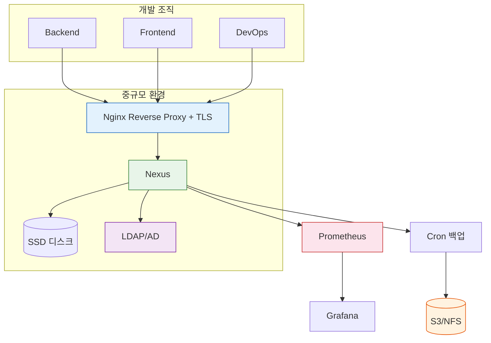
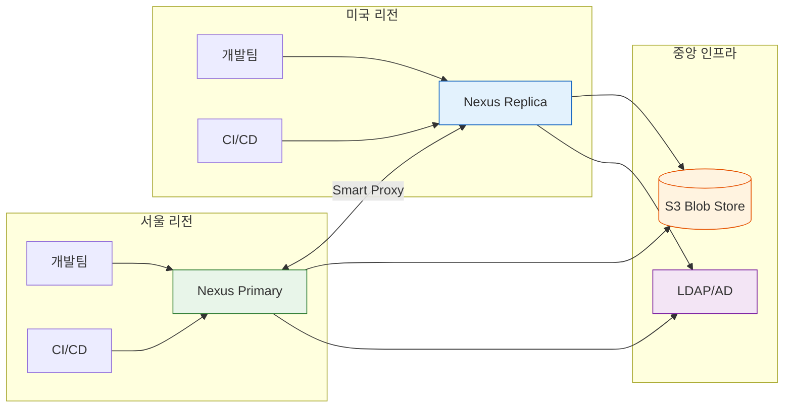
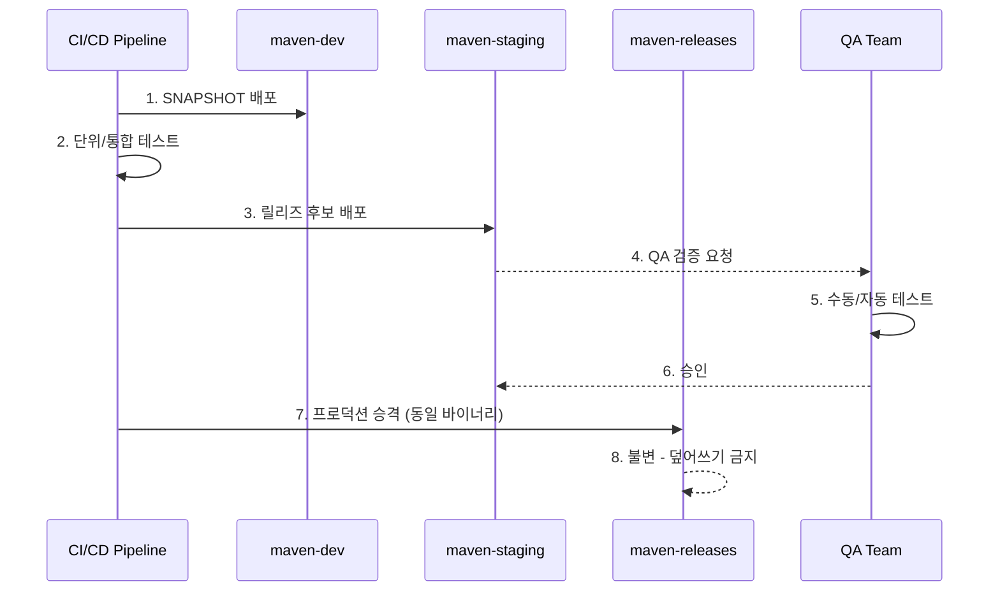
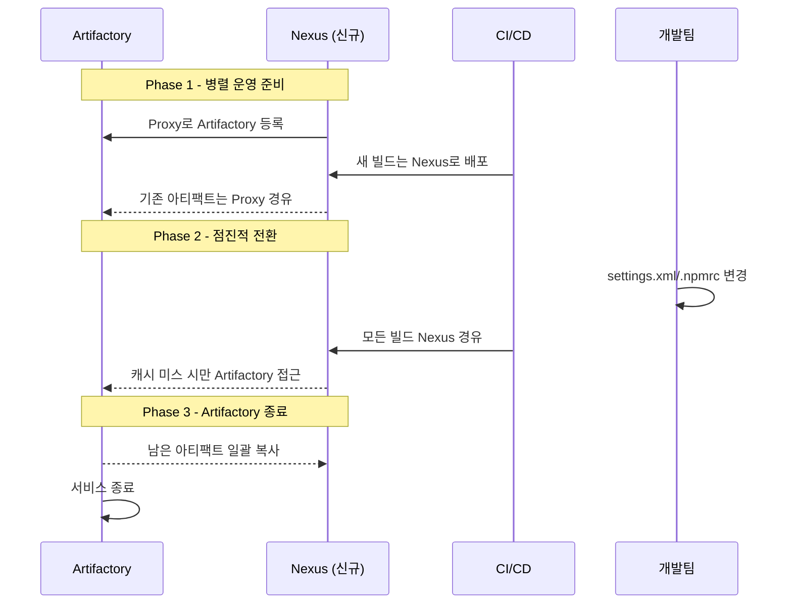

# 프로덕션 운영 패턴

---

> 10명 팀과 500명 조직의 운영 모델은 다르다. 규모별 아키텍처, OSS/Pro 분기, 거버넌스(Promotion·Firewall), IaC, 마이그레이션을 한 장에 모은다.


## 1. 규모별 운영 패턴

> 규모에 맞지 않는 아키텍처는 과소도 과잉도 문제를 일으킨다. 10명 팀에 HA는 과잉이고, 200명에 단일 인스턴스는 과소다.

### 1.1 소규모 (10–30명)

단일 Nexus 인스턴스로 충분하다. Docker Compose로 띄우고 기본 정리 정책만 설정하면 된다. HA를 논하는 건 과도한 엔지니어링이다.

핵심 설정 셋이다 — 기본 admin 비밀번호 변경, Proxy 리포지토리 설정(Maven Central, npm registry), Cleanup Policy 하나 이상 활성화. 백업은 cron + tar 수준이면 충분하고 모니터링은 Status API 헬스체크로 시작한다.

```yaml
services:
  nexus:
    image: sonatype/nexus3:latest
    ports:
      - "8081:8081"
    volumes:
      - nexus-data:/nexus-data
    environment:
      - INSTALL4J_ADD_VM_PARAMS=-Xms512m -Xmx1024m -XX:MaxDirectMemorySize=512m
    restart: unless-stopped
```

### 1.2 중규모 (30–100명)

여러 팀이 공유하면서 보안과 안정성 요구가 급격히 올라간다. 다음이 필요해진다.

- Reverse Proxy + TLS — Nginx/Traefik 앞단, HTTPS
- LDAP/AD 연동 — 사용자 관리 중앙화
- 자동 백업 — 일간 스냅샷 + 외부 저장소(S3, NFS)
- 모니터링 — Prometheus + Grafana
- 역할 기반 접근 제어 — 팀별 리포지토리 권한 분리

흔한 실수는 "아직 작은데 괜찮겠지"라며 보안 설정을 미루다 잘못된 아티팩트가 release 리포지토리에 올라가는 사고다. Write 권한은 처음부터 엄격하게 관리한다.



### 1.3 대규모 (100–500명)

단일 인스턴스의 한계가 보이는 시점이다. 동시 접속이 늘면서 응답 시간이 길어지고 Blob Store가 테라바이트 단위로 커진다. JVM 힙도 8GB 이상이 필요하며 GC 튜닝 없이는 Full GC의 stop-the-world가 사용자 경험을 해친다.

이 규모에서는 Nexus Pro의 HA 클러스터링이나 S3 Blob Store를 진지하게 검토한다. OSS로 버티려면 Reverse Proxy에서 읽기/쓰기를 분리하거나 용도별로 인스턴스를 나누는데(Maven 전용·Docker 전용·npm 전용), 인프라 비용과 운영 부담이 3배가 된다.

### 1.4 엔터프라이즈 (500명+)

글로벌 분산이 필요한 규모다. 서울에서 미국 Nexus에 접근하면 태평양 횡단 RTT 150ms × 의존성 100개 = 15초가 네트워크 지연으로만 사라진다. Nexus Pro의 Smart Proxy나 각 리전 별도 인스턴스 + 동기화 구조가 된다.




## 2. OSS vs Pro

> 무조건 Pro가 좋은 건 아니다. 조직의 규모와 요구사항이 결정한다.

| 기능 | OSS | Pro |
|------|-----|-----|
| 기본 리포지토리 (Maven, npm, Docker 등) | O | O |
| Proxy/Hosted/Group | O | O |
| REST API | O | O |
| LDAP/AD 연동 | O | O |
| Cleanup Policy | O | O |
| HA 클러스터링 | X | O |
| S3 Blob Store | X | O |
| SAML/SSO | X | O |
| Repository Firewall (취약점 스캔) | X | O |
| Tagging (아티팩트 태깅) | X | O |
| Smart Proxy (글로벌 분산) | X | O |
| Staging/Promotion | X | O |
| User Tokens (CI/CD 전용 토큰) | X | O |
| Content Replication (DR) | X | O |

판단 기준은 단순하다. HA 불필요, 100명 이하, 취약점 스캔을 별도 도구(Snyk, Trivy)로 한다면 OSS로 충분하다. 다음 중 하나라도 해당되면 Pro 검토 시점이다 — 다운타임 허용 불가, S3 Blob Store 필요, 아티팩트 Promotion 워크플로 필요, 글로벌 분산 필요.

### 2.1 HA가 Active-Active가 아닌 이유

Nexus Pro의 HA는 Active-Passive다. 한 노드가 모든 읽기/쓰기를 담당하고 나머지는 대기하다 장애 시 승격된다.

이유는 내부 데이터베이스 제약이다. OrientDB·H2는 단일 프로세스 전용 임베디드 DB라 두 노드가 동시에 쓰면 정합성이 깨진다. 외부 PostgreSQL을 쓰는 최신 버전에서도 캐시 레이어와 Blob Store 메타데이터 관리가 단일 writer를 전제로 설계돼 있다. Active-Active는 분산 락·캐시 무효화 전파·충돌 해소가 모두 필요한데, "아티팩트 저장소에 그 수준 처리량이 필요한가?"라는 현실 판단이 함께 깔려 있다. 대부분의 조직에서 Nexus 장애 시 요구되는 것은 "높은 처리량"이 아니라 "빠른 복구"이므로 Active-Passive가 적절한 선택이다.

읽기 트래픽만 분산하고 싶다면 Pro의 읽기 replica를 쓰거나, OSS에서 Reverse Proxy가 GET 요청을 여러 Nexus로 분산하되 각 인스턴스가 같은 Proxy 리포지토리를 바라보도록 구성한다.


## 3. 거버넌스 패턴

> "그냥 올리고 그냥 내려받는" 수준을 넘으면 거버넌스가 필요하다. 누가·언제·무엇을 릴리스했는지, 프로덕션에 나간 게 안전한지를 관리한다.

### 3.1 Promotion 패턴

dev → staging → prod로 같은 바이너리가 검증 단계를 거치면서 승격된다. 같은 SHA-256이 단계를 통과하므로 "테스트한 것과 프로덕션에 나간 것이 다르다"는 사고가 원천 차단된다.



OSS에서는 REST API + 스크립트로 구현한다. Pro의 Staging 기능은 UI에서 직접 승격/거부를 처리한다. 각 단계에서 다시 빌드하면 Promotion의 의미가 사라진다는 점을 잊지 않는다.

### 3.2 Firewall 패턴

외부에서 다운로드하는 오픈소스 컴포넌트의 알려진 취약점을 차단한다. Log4Shell(CVE-2021-44228) 같은 사태에서 Firewall이 있었다면 취약 버전 유입을 사전 차단할 수 있었다.

Pro의 Repository Firewall은 Sonatype 취약점 DB와 연동돼 실시간 차단한다. CVSS ≥ 9.0 같은 정책으로 자동 quarantine할 수 있고, NVD보다 빠른 데이터 반영이 강점이다.

OSS에서는 CI/CD 파이프라인에 Trivy·Grype·OWASP Dependency-Check를 넣어 빌드 시점에 검사한다. 차이는 명확하다 — Firewall은 "유입 시점 차단", CI 도구는 "빌드 시점 검출". 후자는 이미 캐시에 들어온 뒤 발견하므로 대응 속도가 느리다.

기존 캐시를 소급 검사하려면 Firewall의 "Audit" 모드를 켜서 전체 저장소를 스캔하고 취약 버전을 quarantine한 뒤 영향 프로젝트에 업그레이드를 요청하는 프로세스까지 갖춰야 완전한 방어가 된다.

### 3.3 Tagging 패턴

릴리스 후보에 태그를 부여해 추적한다. "이번 릴리스에 포함된 아티팩트가 정확히 무엇인가?"에 답할 수 있게 해 준다. Pro 기능이지만 OSS에서는 리포지토리 이름이나 메타데이터로 유사하게 구현한다.


## 4. IaC로 Nexus 관리

> UI 수동 변경은 drift의 시작이다. 모든 변경을 Git PR → 파이프라인 → API 호출 경로로 강제한다.

### 4.1 REST API + 스크립트

가장 직접적이다. Nexus REST API로 리포지토리·역할·Blob Store·정리 정책을 모두 프로비저닝할 수 있다.

```bash
#!/bin/bash
# nexus-setup.sh
NEXUS_URL="http://localhost:8081"
AUTH="admin:admin123"

# Blob Store 생성
curl -u $AUTH -X POST "$NEXUS_URL/service/rest/v1/blobstores/file" \
  -H 'Content-Type: application/json' \
  -d '{
    "name": "maven-store",
    "path": "/nexus-data/blobs/maven-store",
    "softQuota": {"type": "spaceRemainingQuota", "limit": 5368709120}
  }'

# 역할 생성
curl -u $AUTH -X POST "$NEXUS_URL/service/rest/v1/security/roles" \
  -H 'Content-Type: application/json' \
  -d '{
    "id": "ci-deployer",
    "name": "CI Deployer",
    "privileges": [
      "nx-repository-view-*-*-browse",
      "nx-repository-view-*-*-read",
      "nx-repository-view-maven2-maven-snapshots-add",
      "nx-repository-view-maven2-maven-snapshots-edit"
    ]
  }'
```

스크립트를 멱등(idempotent)하게 만들면 더 안전하다. 리소스 존재 여부를 확인하고 있으면 PUT(업데이트), 없으면 POST(생성)하는 분기다.

```bash
ensure_repo() {
  local name=$1; local payload=$2; local format=$3; local type=$4

  status=$(curl -s -o /dev/null -w '%{http_code}' \
    -u $AUTH "$NEXUS_URL/service/rest/v1/repositories/$format/$type/$name")

  if [ "$status" = "200" ]; then
    curl -s -u $AUTH -X PUT \
      "$NEXUS_URL/service/rest/v1/repositories/$format/$type/$name" \
      -H 'Content-Type: application/json' -d "$payload"
  else
    curl -s -u $AUTH -X POST \
      "$NEXUS_URL/service/rest/v1/repositories/$format/$type" \
      -H 'Content-Type: application/json' -d "$payload"
  fi
}
```

### 4.2 Ansible · Terraform

반복 실행이 필요하면 Ansible이 적합하다. 커뮤니티 롤이 있지만 공식이 아니므로 REST API 래퍼를 직접 만드는 팀도 많다. Terraform으로 Nexus를 관리하는 비공식 프로바이더(`datadrivers/nexus`)도 있다. 다른 인프라와 함께 Terraform으로 통합 관리하는 조직이라면 고려해 볼 만하지만 비공식이라 API 변경 시 깨질 수 있다는 리스크가 따른다.

### 4.3 Drift 감지

Drift는 코드의 정의 상태와 실제 Nexus 상태가 어긋나는 것이다. "잠깐만 이것만 바꿀게"라는 긴급 변경이 쌓이면 어느 순간 Git 정의 파일이 실제와 동떨어진다.

세 가지 감지 방법이 있다.

```bash
# 1) 주기적 비교 스크립트
ACTUAL=$(curl -s -u admin:$PASS $NEXUS_URL/service/rest/v1/repositories | jq 'sort_by(.name)')
EXPECTED=$(cat repos-definition.json | jq 'sort_by(.name)')
DIFF=$(diff <(echo "$ACTUAL") <(echo "$EXPECTED"))
if [ -n "$DIFF" ]; then
  echo "DRIFT DETECTED:" && echo "$DIFF"
  # Slack webhook 호출
fi
```

2번은 Terraform plan의 "changed outside of Terraform" 감지, 3번은 audit.log에서 수동 변경이 발생하는 순간 알림을 보내는 가장 선제적인 방식이다. 가장 근본적인 해결은 admin UI 접근을 최소 인원으로 제한하고 모든 변경을 Git PR 경로로 강제하는 것이다.


## 5. 보안 강화 패턴

> Nexus가 뚫리면 공급망 공격의 시작점이 된다. TLS·Content Trust·감사 로그가 기본 셋이다.

### 5.1 TLS

프로덕션에서 HTTP 노출은 있을 수 없다. Reverse Proxy 레벨에서 TLS를 처리한다.

```nginx
server {
    listen 443 ssl;
    server_name nexus.example.com;

    ssl_certificate     /etc/letsencrypt/live/nexus.example.com/fullchain.pem;
    ssl_certificate_key /etc/letsencrypt/live/nexus.example.com/privkey.pem;

    client_max_body_size 1G;

    location / {
        proxy_pass http://nexus:8081;
        proxy_set_header Host $host;
        proxy_set_header X-Real-IP $remote_addr;
        proxy_set_header X-Forwarded-For $proxy_add_x_forwarded_for;
        proxy_set_header X-Forwarded-Proto https;
        proxy_read_timeout 600;
    }
}
```

Let's Encrypt + certbot 자동 갱신을 설정하면 인증서 만료 사고를 예방한다. Docker라면 Traefik이 이 과정을 자동화해 준다.

### 5.2 Content Trust

Docker 이미지를 Nexus에 저장할 때 서명을 검증해 변조 이미지 유입을 막는다. CI/CD 파이프라인에서 빌드 → 서명 → 푸시 → 배포 시 검증의 흐름을 구성한다. Cosign이 DCT(Docker Content Trust)보다 최근 트렌드인데, Sigstore 생태계와 통합돼 키 관리가 더 간편하다.

### 5.3 감사 로그

Nexus는 `audit.log`에 관리 작업(사용자 생성, 역할 변경, 리포지토리 설정 변경)을 기록한다. 이 로그를 중앙 로그 시스템으로 보내 보관 기간을 충분히 확보한다. 규제 환경(금융, 의료)에서는 1년 이상 보관이 요구되기도 한다.


## 6. 마이그레이션 패턴

> Big Bang 전환은 롤백이 어렵다. 병렬 운영 + 점진적 전환이 가장 안전하다.

### 6.1 Artifactory → Nexus

가장 흔한 시나리오다. 두 제품의 리포지토리 구조가 달라 단순 파일 복사가 아닌 API 기반 추출/재배포로 진행한다. 기술적 과제는 셋이다.

1. 메타데이터 보존 — 체크섬·타임스탬프·프로퍼티(태그). Artifactory의 key-value Properties는 Nexus에 동일 개념이 없다.
2. 권한 매핑 — Artifactory Permission Target → Nexus Role/Privilege.
3. CI/CD 파이프라인 URL 변경 — DNS CNAME으로 충격을 줄일 수 있지만, Docker는 인증 토큰 형식이 달라 CNAME만으로는 부족하고 `docker login`부터 다시 해야 한다.



Phase 1에서 Nexus가 Artifactory를 Proxy로 바라보게 설정하면 개발자가 Nexus에 요청할 때 기존 아티팩트가 자동 캐싱된다. 명시적 마이그레이션(API로 전수 추출/재배포)보다 위험이 적은 이유는 실제 사용되는 아티팩트만 자연스럽게 이전되기 때문이다. 수년간 아무도 다운로드하지 않은 아티팩트까지 옮길 필요가 없다.

### 6.2 Nexus 2 → Nexus 3

Nexus 2는 더 이상 지원되지 않으므로 3으로의 업그레이드는 필수다. 내장 업그레이드 도구가 있지만 대규모 환경에서는 병렬 운영 + 점진적 전환이 더 안전하다.

```text
1. Nexus 3 설치
2. Nexus 2를 Remote로 등록 (Proxy)
3. CI/CD를 Nexus 3으로 전환
4. Nexus 2 종료
```

문제 시 CI/CD URL만 원래대로 돌리면 롤백된다.

### 6.3 파일 서버 / FTP → Nexus Raw

```bash
find /shared/artifacts -type f | while read file; do
  relative_path=${file#/shared/artifacts/}
  curl -u admin:admin123 --upload-file "$file" \
    "http://localhost:8081/repository/raw-hosted/$relative_path"
done
```

마이그레이션에서 가장 과소평가되는 작업은 CI/CD 파이프라인 변경이다. 아티팩트 이전보다 수십 개 프로젝트의 설정 파일 변경이 더 오래 걸린다.


## 7. Smart Proxy로 글로벌 분산할 때 캐시 일관성

> CDN과 비슷하지만 쓰기도 가능하다. TTL과 강제 무효화가 두 손잡이다.

Smart Proxy는 pull-through 캐시 방식이다. 원본 Nexus(upstream)에 아티팩트가 있고 각 리전의 Nexus가 처음 요청 시 원본에서 가져와 로컬에 캐싱한다.

일관성은 TTL 기반이다. 캐싱된 아티팩트의 메타데이터가 TTL을 초과하면 다음 요청 시 원본에 조건부 GET(If-Modified-Since 또는 If-None-Match/ETag)을 보내 변경 여부를 확인한다. releases는 immutable이라 TTL을 길게(24시간 이상) 잡아도 문제없다. snapshots는 같은 좌표에 새 빌드가 계속 올라오므로 짧게(1시간 이하) 설정해야 최신 버전이 잡힌다.

강제 동기화는 보안 패치 라이브러리를 즉시 전파해야 하거나 잘못 올라간 아티팩트를 모든 리전에서 제거해야 할 때 필요하다. 로컬 캐시 invalidate API를 호출한다. 다만 무효화는 "다음 요청 시 원본에서 다시 가져오겠다"이지 즉시 삭제가 아니다. 개발자 로컬 캐시(`~/.m2`)까지 정리해야 완전한 제거가 된다.


## 8. 운영 KPI와 성숙도

> Nexus를 "파일 올리는 곳"에서 "공급망의 중심 허브"로 발전시키는 네 축이다.

| 축 | 도구·프로세스 |
|----|--------------|
| 공급망 보안 | Firewall 또는 Trivy/Snyk, SBOM 자동 생성 (EO 14028 대응) |
| 거버넌스 자동화 | Promotion 파이프라인, Jira/Slack 승인 게이트 |
| 개발자 경험 | 패키지 검색 포탈, 온보딩 스크립트(`settings.xml`/`.npmrc` 자동 생성) |
| 운영 성숙도 | IaC 전환, Prometheus/Grafana, 용량 예측 자동화 |

도입 ROI 순서는 보안 → 개발자 경험 → 거버넌스 → 운영 성숙도다.


## 9. 정리

| 규모 | 인프라 | 보안 | 모니터링 | 거버넌스 |
|------|--------|------|----------|----------|
| 소규모 | Docker Compose | 비밀번호 변경 | Status API | 기본 Cleanup |
| 중규모 | Reverse Proxy + TLS | LDAP + RBAC | Prometheus | Cleanup + 백업 |
| 대규모 | HA 또는 분리 인스턴스 | SAML + 토큰 | 전체 스택 | Promotion |
| 엔터프라이즈 | 글로벌 분산 | Firewall + 감사 | 글로벌 대시보드 | 전체 거버넌스 |

OSS vs Pro 의사결정은 명확하다. 100명 이하·HA 불필요·취약점 스캔을 별도 도구로 한다면 OSS로 충분하다. 다운타임 허용 불가, S3 Blob Store, Promotion/Firewall 워크플로, 글로벌 분산 중 하나라도 해당되면 Pro 비용과 자체 구현 비용을 비교한다.

기억할 핵심은 다섯이다 — 규모에 맞지 않는 아키텍처는 과소도 과잉도 문제를 일으킨다, IaC가 재현성과 감사 추적 두 마리를 잡는다, Promotion은 같은 바이너리가 단계를 거친다는 원칙이 핵심이다, 마이그레이션은 병렬 + 점진적이 안전하다, TLS 없이 프로덕션 노출은 절대 금지다.


## 관련 문서

- [05-02.백업 복구 업그레이드](05-02.백업 복구 업그레이드.md) — DR과 마이그레이션의 백업 의존성
- [05-03.모니터링과 트러블슈팅](05-03.모니터링과 트러블슈팅.md) — 운영 KPI를 측정하는 메트릭·로그
- [05-점검.핵심 질문과 답](05-점검.핵심 질문과 답.md) — HA·Pro 분기·Drift·Smart Proxy 점검
