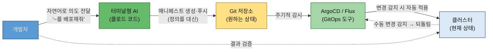

# GitOps에서 GitAIOps로
---
> **GitOps가 깃을 단일 진실 공급원으로 삼아 인프라를 선언적으로 관리하는 방법론임을 명령형과 대비해 설명할 수 있고, 그 GitOps가 "상태를 적용"은 자동화해도 "상태를 정의"는 사람에게 남긴다는 빈자리를 짚을 수 있으며, 그 빈자리를 AI가 채워 GitAIOps가 되는 흐름을 말할 수 있다.**


## 핵심 요약

> GitOps(적용 자동화) → 빈자리(정의는 사람의 몫) → GitAIOps(정의도 AI와 함께) — 이 책 전체를 관통하는 핵심 개념의 3단 논리입니다.

앞 절 〈개발자에게 인프라가 다가온 시대〉에서 AI가 쿠버네티스 생태계의 선택 부담을 덜어 주는 동료가 된다고 했습니다. 그 발상을 인프라 관리 방법론과 결합한 것이 이 장의 핵심 개념인 GitAIOps입니다. GitOps가 무엇인지, 어디까지 자동화하고 어디서 멈추는지, 그 멈춘 자리를 AI가 어떻게 잇는지 차례로 봅니다.


## 학습 목표

> 이 절을 읽고 나면 다음 세 가지를 할 수 있습니다.

1. GitOps의 선언형 관리를 명령형 배포와 대비해 네 단계 흐름(푸시 → 감시 → 적용 → 되돌림)으로 설명할 수 있습니다.
2. GitOps가 자동화하는 것("적용")과 자동화하지 못하는 것("정의")을 구분해 그 빈자리를 짚을 수 있습니다.
3. GitAIOps에서 AI가 맡는 네 가지 역할(매니페스트 작성·트러블슈팅·문서화·운영 점검)을 예시 프롬프트와 함께 말할 수 있습니다.


## 본문 정리

> GitOps의 정의 → 한계 → AI가 채우는 방식 순서로, 책 §1.3의 세 하위 절을 따라 정리합니다.

### 1. GitOps: 선언적 관리의 시작

> GitOps는 깃 저장소를 단일 진실 공급원으로 삼아, "원하는 상태"를 선언해 두면 도구가 현재 상태를 거기에 맞추는 방법론입니다.

GitOps는 깃 저장소를 Single Source of Truth(단일 진실 공급원)로 삼아, 원하는 인프라의 상태를 선언적으로 관리하는 방법론입니다. 핵심은 명령형과 선언형의 차이에 있습니다.

**전통적 배포는 명령형입니다.** 

- "이 서버에 SSH로 접속해서 이 스크립트를 실행하라" 
- 서버가 10대면 10번, 실행하면서 중간에 하나라도 실패하면 어디까지 적용됐는지 추적하기 어렵습니다. 

**GitOps는 선언형입니다.**

- 깃에 원하는 상태를 적어 두면, 도구가 현재 상태와 비교해 맞춥니다. 
- 누군가 클러스터에서 직접 무언가를 바꿔도 "깃에 선언된 상태와 다르다"고 감지해 원래 상태로 되돌립니다.


흐름은 네 단계입니다. 

1. ① 개발자가 매니페스트 파일(Deployment·Service 등)을 작성해 깃에 푸시합니다. 
2. ② ArgoCD나 Flux 같은 GitOps 도구가 깃 저장소를 주기적으로 감시합니다. 
3. ③ 새로운 변경이 감지되면 클러스터에 자동으로 적용합니다. 
4. ④ 누군가 클러스터에서 직접 무언가를 바꾸면, 도구가 "깃에 선언된 상태와 다르다"고 감지해 원래 상태로 되돌립니다.

이 방식의 장점은 세 가지입니다. 배포가 자동화되고, 모든 변경이 PR(Pull Request)로 기록돼 코드 리뷰와 승인을 거치며, 깃에 선언된 그대로 환경을 재현할 수 있습니다.

### 2. GitOps만으로는 부족한 이유

> GitOps는 "선언된 상태를 적용"하는 일은 자동화하지만, "그 상태를 정의"하는 일은 여전히 사람의 몫입니다.

GitOps는 깃에 선언된 상태를 클러스터에 자동으로 반영합니다. 하지만 그 상태를 '정의하는' 작업은 여전히 사람의 일입니다. 여기에 빈자리가 있습니다.

- Deployment 하나를 만들려면 YAML을 작성해야 하고, 이미지 경로·CPU/메모리 리소스 제한·헬스체크 경로 같은 것을 채워야 합니다. 
- 거기에 Service·ConfigMap·Secret·HPA까지 더하면 YAML이 다섯에서 여섯 개 필요합니다. 
- 헬름 차트를 쓰면 values.yaml로 옮겨 갈 뿐, 정의의 부담 자체는 사라지지 않습니다.

모니터링을 하려면 scrape 설정을 정의하고, 그라파나 대시보드를 구성하고, 알림 규칙(PrometheusRule)을 정의해야 합니다. 

- 로그 수집(Fluent Bit)을 Loki와 연결하고, 네트워크 모니터링·리소스 부족 진단까지 — 결국 "무엇을 어떻게 적을 것인가"라는 정의 작업이 사람에게 그대로 남습니다. 
- GitOps는 적용을 자동화했을 뿐, 정의를 자동화하지는 못합니다.

### 3. AI가 채우는 빈자리

> 터미널형 AI가 **"상태를 정의**"하는 빈자리를 채우면, GitOps는 GitAIOps가 됩니다.

AI 코딩 도구, 그 중에서도 터미널에서 직접 동작하는 에이전트형 AI가 그 빈자리를 채웁니다. 정의 작업을 자연어 대화로 옮기는 것입니다. §1의 GitOps 흐름과 견주면, 개발자와 Git 저장소 사이에 **터미널형 AI가 끼어들어 "정의"를 대신**하는 한 칸이 추가된 모습입니다. Git 이후의 감시·자동 적용·되돌림은 GitOps 그대로이고, 사람이 손으로 채우던 앞단(정의)만 AI와의 대화로 바뀝니다.



- **매니페스트 작성**: "Notiflex API 서버를 배포하는 Deployment를 만들어줘"라고 하면, AI가 현재 프로젝트의 Dockerfile과 디렉터리 구조를 보고 적절한 리소스 설정과 헬스체크를 포함한 YAML을 생성합니다. 한 줄씩 채우던 것을, 의도만 전달하면 AI가 매니페스트로 만듭니다.
- **트러블슈팅**: "Pod가 CrashLoopBackOff인데 원인 좀 찾아줘"라고 하면, kubectl로 Pod 상태를 확인하고 로그를 분석하고 이벤트를 살펴 원인과 수정안을 제시합니다. 사람이 여러 명령어를 순차로 실행하며 추적하던 과정을 대신합니다.
- **문서화**: AI와 함께 작업하면 그 과정 자체가 기록됩니다. "지금까지 작업한 내용을 정리해줘"라고 하면, 어떤 도구를 선택했고 어떤 설정을 적용했는지 정리해 줍니다.
- **운영**: "현재 클러스터 상태가 문서와 일치하는지 확인해줘"라고 하면, 실제 클러스터의 Pod·Service·ConfigMap을 조회해 문서에 기록된 상태와 비교하고 차이가 있으면 알려줍니다.

핵심은 AI 도구를 다룰 줄 아는 것이, 곧 인프라를 정의하는 역량이 된다는 점입니다. 

- 사람은 "이 프로젝트를 어떻게 갈 것인가" 같은 결정만 하면, 설치부터 설정·검증까지의 과정을 AI가 빠르게 수행합니다. 
- 이 책에서는 이 GitAIOps를 직접 체험합니다. 모든 실습은 클로드 코드에게 자연어로 지시하고, 그 결과를 깃에 커밋(commit)하면서 진행됩니다. 실습을 모두 마친 뒤 9장에서 돌아보면, 그동안 쌓인 코드와 설정 그리고 문서가 하나의 운영 표준이 되어 있을 것입니다.


## 심화 학습

> 책이 서술형으로 풀어낸 GitOps를 공식 표준(OpenGitOps 4원칙)과 실제 도구 설정(ArgoCD syncPolicy)으로 뒷받침합니다. 책 밖 조사 내용입니다.

### OpenGitOps 4원칙 — 책 설명의 표준 대응

GitOps라는 용어는 CNCF 산하 OpenGitOps 워킹 그룹이 v1.0 원칙 4개로 표준화해 두었습니다. 책의 서술이 이 4원칙과 어떻게 맞물리는지 대응시켜 보면 개념이 더 단단해집니다.

| # | OpenGitOps 원칙 | 정의 | 책 §1.3의 대응 서술 |
|---|----------------|------|--------------------|
| 1 | Declarative | 원하는 상태를 선언적으로 표현한다 | "깃에 원하는 상태를 적어 두면" — 명령형과의 대비 |
| 2 | Versioned and Immutable | 상태는 버전 관리되고 불변으로 저장된다 | "모든 변경이 PR로 기록"·"깃에 선언된 그대로 재현" |
| 3 | Pulled Automatically | 에이전트가 원하는 상태를 자동으로 끌어간다 | "GitOps 도구가 깃 저장소를 주기적으로 감시" |
| 4 | Continuously Reconciled | 실제 상태를 계속 관찰해 원하는 상태로 수렴시킨다 | "수동 변경을 감지해 원래 상태로 되돌림" |

- 3번 원칙이 Pulled(끌어감)라는 점이 중요합니다. CI가 클러스터에 접속해 밀어 넣는 push 모델과 달리, GitOps는 클러스터 안의 에이전트가 깃을 바라보고 끌어오는 pull 모델이라 클러스터 자격증명이 CI 밖으로 나가지 않습니다. 
- push vs pull 모델의 상세 비교는 형제 정독 노트 〈CICD 설계 패턴 기초〉 §4가 정본이므로 여기서는 반복하지 않습니다.

### "되돌림"의 실제 메커니즘 — ArgoCD selfHeal·prune

책이 ④단계로 설명한 "수동 변경 감지 → 되돌림"은 ArgoCD에서 자동으로 켜지는 동작이 아니라 명시적 옵션입니다. Application 매니페스트의 `syncPolicy`에 다음과 같이 선언해야 동작합니다:

```yaml
# ArgoCD Application 매니페스트 일부 — 보강 예시 (책 원문 아님)
spec:
  syncPolicy:
    automated:
      selfHeal: true   # 누가 kubectl로 직접 바꾸면 깃 상태로 되돌림 — 책의 ④단계
      prune: true      # 깃에서 매니페스트가 삭제되면 클러스터 리소스도 삭제
```

ArgoCD는 기본 약 3분 주기의 reconciliation 루프로 깃과 클러스터를 비교(drift detection)하고, `selfHeal: true`면 어긋남을 발견하는 즉시 깃 기준으로 재동기화합니다. 

- `prune`이 없으면 깃에서 지운 리소스가 클러스터에 남는(orphan) 것도 알아 둘 지점입니다. 
- HPA가 replicas를 조정하는 것처럼 정당한 변경까지 되돌리지 않으려면 `ignoreDifferences`로 특정 필드를 비교에서 제외합니다. 
- 3장에서 ArgoCD를 실제로 설치할 때 이 옵션들을 다시 만나게 됩니다.

이 셋이 **모두 기본 꺼짐**이라는 점이 함정입니다. `syncPolicy.automated` 블록 자체를 안 쓰면 자동 동기화가 아예 안 돌아 사람이 수동으로 Sync를 눌러야 하고, 블록을 켜도 그 안의 `selfHeal`·`prune`은 각각 다시 `true`로 명시해야 합니다. 즉 세 겹으로 꺼져 있어서, "ArgoCD를 깔았으니 되돌림도 되겠지"라고 가정하면 drift가 조용히 쌓입니다.

### push/pull 모델과 자격증명이 머무는 위치

§심화의 OpenGitOps 3번 원칙(Pulled)을 학습 중 더 파고들었더니, push/pull의 진짜 차이는 "화살표 방향"이 아니라 **클러스터 자격증명이 어디에 머무느냐**였습니다. push vs pull 상세 비교는 형제 노트 〈CICD 설계 패턴 기초〉 §4가 정본이므로, 여기서는 학습에서 정리한 요점만 남깁니다.

- **push (전통적 CI 배포)**: CI 시스템(GitHub Actions·젠킨스)이 클러스터 API에 `kubectl apply`를 *밀어넣습니다*. 그러려면 CI가 **클러스터 조작 자격증명(kubeconfig)을 쥐고** 있어야 하고, 그 자격증명이 **클러스터 밖(CI 시스템)에** 저장됩니다. CI가 털리면 클러스터 접근 권한도 샙니다.
- **pull (GitOps)**: 배포 대상 클러스터 *안*의 에이전트(ArgoCD)가 깃을 *당겨와* 스스로 반영합니다. 조작 권한은 클러스터 안 ServiceAccount로 존재하고, 깃에는 **읽기 권한만** 필요합니다. 자격증명이 클러스터 경계를 벗어나지 않습니다.

주의할 함정 하나 — "CI를 클러스터 *안*에 두면 pull과 같아지는가?"는 아닙니다. 위치가 아니라 *동작 방식*이 본질이라, 클러스터 안 젠킨스라도 여전히 push(자기가 apply를 밀어넣음)면 보안 이점이 줄고, drift 자동 교정(selfHeal)도 pull만의 것입니다. 또한 클러스터 안 Pod라고 자동으로 조작 권한이 생기는 것도 아니어서, ServiceAccount + RBAC로 권한을 명시적으로 부여해야 apply가 됩니다.


## 실무 적용 포인트

> GitOps의 빈자리 논리는 도구 도입 판단과 AI 활용 범위 설정에 그대로 쓰입니다.

### 이런 상황에서 사용하세요

- 팀에 GitOps 도입을 제안할 때 — **"적용 자동화 + PR 기록 + 재현성"** 세 장점이 설득의 뼈대가 됩니다.
- AI 코딩 도구의 활용 범위를 정할 때 — "정의는 AI와 함께, 결정과 검증은 사람이"라는 GitAIOps의 역할 분담이 기준이 됩니다.
- 장애 상황에서 클러스터를 직접 고치고 싶은 유혹이 들 때 — selfHeal이 켜져 있으면 수동 수정은 곧 되돌려지므로, 깃을 고치는 것이 유일한 정상 경로입니다.

### 주의할 점

- ⚠️ AI가 생성한 매니페스트도 PR 리뷰를 거쳐야 합니다 — GitAIOps에서도 깃이 단일 진실 공급원이고, 리뷰 게이트가 품질 방어선입니다.
- ⚠️ selfHeal·prune은 명시적으로 켜야 하는 옵션입니다 — "GitOps 도구를 깔았으니 되돌림도 되겠지"라고 가정하면 drift가 조용히 쌓입니다.
- ⚠️ reconciliation 주기(기본 약 3분) 사이의 어긋남은 즉시 잡히지 않습니다 — "되돌림"은 실시간이 아니라 루프 주기 단위로 동작합니다.


## 핵심 개념 체크리스트

- [ ] 명령형 배포와 선언형 관리의 차이를 서버 10대 시나리오로 설명할 수 있는가?
- [ ] GitOps 네 단계 흐름(푸시 → 감시 → 적용 → 되돌림)을 그릴 수 있는가?
- [ ] OpenGitOps 4원칙과 push/pull 모델의 차이를 말할 수 있는가?
- [ ] GitOps의 빈자리("정의")와 그것을 AI가 채우는 방식 네 가지를 나열할 수 있는가?


## 면접 관점 정리

> GitOps(적용 자동화) → 빈자리(정의는 사람) → GitAIOps(정의도 AI로) 세 박자로 답하면 이 책의 주제가 한 번에 정리됩니다.

GitAIOps는 GitOps에 AI를 더한 개념입니다. 

- 출발점인 GitOps는 깃을 단일 진실 공급원으로 삼아 선언된 상태를 클러스터에 자동 반영하는 방법론으로, 명령형 배포의 추적 어려움을 선언형으로 풀고 모든 변경을 PR로 남깁니다. 
- 그런데 GitOps가 자동화하는 것은 "적용"이지 "정의"가 아닙니다 — YAML과 대시보드와 알림 규칙을 무엇으로 채울지는 사람의 몫으로 남습니다. 
- 이 정의의 빈자리를 터미널형 AI가 자연어 대화로 채우면 GitAIOps가 됩니다. 매니페스트 작성·트러블슈팅·문서화·운영 점검이 모두 대화로 이뤄지고, 결과는 깃에 커밋돼 다시 GitOps의 흐름을 탑니다. 이 책의 모든 실습이 이 한 줄로 수렴합니다.


## 참고 자료

- OpenGitOps 4원칙 정본: [opengitops.dev](https://opengitops.dev/) · [PRINCIPLES.md (GitHub)](https://github.com/open-gitops/documents/blob/main/PRINCIPLES.md)
- ArgoCD 자동 동기화 공식 문서: [Automated Sync Policy — argo-cd.readthedocs.io](https://argo-cd.readthedocs.io/en/latest/user-guide/auto_sync/)
- push vs pull 배포 모델 상세: [cicd_cicd-patterns 01-01 §4](../cicd_cicd-patterns/01-01.Foundations%20of%20CICD%20Design%20Patterns.md)
- 다음 절 정독 노트: [01-03 이 책의 지도](./01-03.이%20책의%20지도%20—%20구성·Notiflex%20시나리오·가드레일.md)
