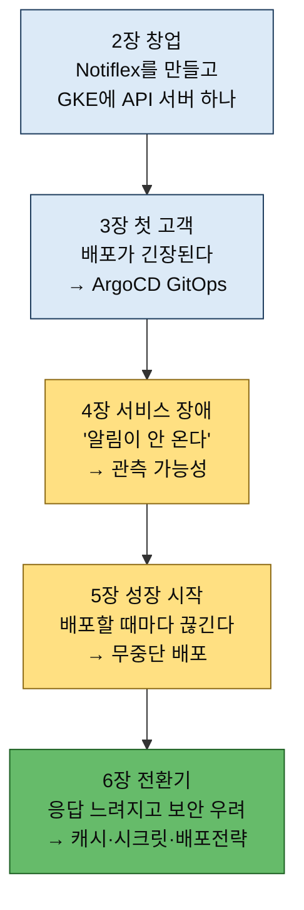

# 이 책의 지도 — 구성·Notiflex 시나리오·가드레일

---

> **이 책이 9개 장에 걸쳐 하나의 서비스(Notiflex)를 성장시키는 실습서임을 구성표로 설명할 수 있고, 두 개의 저장소(_Book_GitAIOps 가이드 + notiflex-platform 실습본)가 어떤 역할을 나눠 갖는지 말할 수 있으며, 클로드 코드가 아무 말이나 하지 않고 정해진 범위에서 동작하게 하는 가드레일(의사결정 가이드·행동 가드레일·결과 템플릿)의 구조를 답할 수 있다.**

앞 두 절에서 "왜 인프라를 다뤄야 하는가"(§1.1·§1.2)와 "어떻게 AI와 함께 다루는가"(§1.3 GitAIOps)를 봤습니다. 이 절은 그 여정의 지도입니다. 책이 어떤 순서로 흐르는지(§1.4), 무엇을 만드는지(§1.5 Notiflex), 그리고 AI가 어떻게 신뢰할 만하게 동작하는지(§1.6 가드레일)를 묶어 둡니다.

## 이 책의 구성과 실습 흐름

> 이 책은 이론서가 아니라, 따라 하면 하나의 서비스가 완성되는 실습서입니다. 9개 장에 걸쳐 하나의 서비스가 성장합니다.

이 책은 9개 장으로 구성되며, 하나의 서비스가 성장하는 과정을 따라갑니다. 각 장은 문제 상황으로 시작해 클로드 코드와 함께 해결하고, 그 결과를 깃에 커밋하며 진행됩니다.

| 구간 | 장 | 핵심 |
|------|-----|------|
| 도입 | 1장 | AI·인프라 시대의 배경, GitAIOps 개념, Notiflex 시나리오 |
| 환경 구성 | 2장 | GCP 계정·클로드 코드·gcloud·GKE 클러스터·첫 배포 |
| SMB | 3~5장 | GitOps(ArgoCD)·CI(GitHub Actions), 관측 가능성, 무중단 배포 |
| 전환기 | 6장 | 캐시(Valkey)·시크릿 관리·점진적 배포(Canary) |
| 엔터프라이즈 | 7~8장 | 규모 확장(멀티 노드풀·멀티테넌시)·위험 작업 통제 |
| 회고 | 9장 | GitAIOps: 살아있는 운영 표준 |

2장에서는 클라우드 환경을 세팅하고 첫 애플리케이션을 배포합니다. GCP 계정을 만들고, 클로드 코드를 설치하고, GKE 클러스터를 생성하고, Go로 작성한 API 서버를 빌드해 올립니다. 여기서부터 모든 작업을 클로드 코드에게 자연어로 지시합니다. 3~5장은 SMB(소규모 비즈니스) 수준의 인프라를 구축하고, 6장은 전환기로 캐시·보안·배포 전략을 정비하며, 7~8장은 엔터프라이즈 규모로 확장합니다. 9장에서 그동안 쌓인 코드·설정·문서를 AI에 분석시켜 하나의 운영 표준으로 정리합니다.

## 이 책의 저장소

> 가이드 저장소(_Book_GitAIOps)와 실습 저장소(notiflex-platform) 두 개가 역할을 나눠 갖습니다.

이 책은 두 개의 저장소를 제공합니다.

| 저장소 | 역할 |
|--------|------|
| `_Book_GitAIOps` | 가이드 저장소 — 가이드 문서·예시 가이드·장별 실행 지침. CLAUDE.md와 가드레일이 여기 들어 있음 |
| `notiflex-platform` | 실습 저장소 — 독자가 직접 생성하고 실습하며 채워 가는 결과물 |

가이드 저장소를 클론(clone)해 디렉터리로 이동한 뒤 클로드 코드를 실행하면 CLAUDE.md가 자동으로 로드됩니다. 어떤 질문을 해도 가드레일 시스템이 동작합니다(자세한 동작은 §1.6). 완성된 플랫폼 저장소를 보면, 책의 모든 실습을 마쳤을 때 완성되는 GitAIOps 플랫폼의 구조와 상태를 미리 확인할 수 있습니다.

- 가이드 저장소: `https://github.com/sysnet4admin/_Book_GitAIOps`
- 완성된 플랫폼 저장소: `https://github.com/sysnet4admin/notiflex-platform`

## Notiflex 스타트업 시나리오

> 모든 실습은 가상의 스타트업 Notiflex를 중심으로 진행됩니다. 서비스가 성장하면서 인프라도 함께 발전합니다.

이 책의 모든 실습은 하나의 가상 스타트업을 중심으로 진행됩니다. Notiflex는 B2B 알림 SaaS 플랫폼으로, 고객사의 서비스에서 발생하는 이벤트(회원가입·결제·배송 등)를 받아 이메일·SMS·푸시 알림으로 발송합니다. 고객사는 Notiflex API를 호출하기만 하면 되고, 알림 발송 흐름의 복잡한 처리는 Notiflex가 담당합니다.

기술 스택은 단순합니다. Go 표준 라이브러리로 작성한 API 서버, scratch 베이스의 컨테이너 이미지, GKE 위에서 동작합니다. 외부 프레임워크 없이 Go 표준 라이브러리만 사용합니다. 처음에는 이것으로 충분하지만, 서비스가 성장하면서 인프라도 함께 발전합니다. 그 성장 타임라인이 곧 책의 장 순서입니다.

타임라인의 한가운데 서는 사람이 바로 독자입니다. 여러분은 Notiflex의 DevOps 엔지니어로서, 혼자서(또는 소수의 팀원과) 이 서비스의 인프라를 책임집니다. 클러스터를 만들고, 배포 파이프라인을 구축하고, 모니터링을 설정하고, 장애에 대응하고, 서비스가 커지면 인프라도 함께 키워야 합니다. 다행히 능력 좋은 동료가 한 명 있습니다. 바로 클로드 코드입니다.

## 가드레일: 클로드 코드가 정확하게 동작하는 이유

> 클로드 코드는 아무 말이나 하는 AI가 아니라, CLAUDE.md가 정의한 가드레일 안에서 정해진 방식으로 동작합니다.

이 책에서 클로드 코드는 정해진 범위 안에서, 검증된 방식으로 동작합니다. 그것을 가능하게 하는 것이 가드레일 시스템입니다. 가이드 저장소 루트의 CLAUDE.md에는 독자의 의도와 입력이 어떤 참조 파일과 매핑되는지가 정의돼 있고, 클로드 코드는 작업 디렉터리의 이 파일을 자동으로 읽어 동작 규칙으로 삼습니다. 참조 파일은 세 종류입니다.

| 참조 파일 | 역할 |
|-----------|------|
| 의사 결정 가이드(decision-guides) | "왜 이 도구인가", "대안은 무엇인가"를 안내 |
| 행동 가드레일(prompt-guardrails) | 실행 직전 사전 조건과 단계별 점검 |
| 결과 템플릿(result-templates) | 검증 체크리스트로 실행 결과가 기대와 일치하는지 확인 |

이 세 참조 파일이 클로드 코드의 작업을 탐색 → 비교 → 실행의 3단계 흐름으로 묶습니다. 먼저 의사 결정 가이드로 "무엇을 왜 고를지"를 탐색하고, 대안을 비교한 뒤, 행동 가드레일이 건 사전 조건을 통과해야 실행하며, 결과 템플릿으로 실행 결과를 검증합니다. 덕분에 AI의 답이 그럴듯하지만 틀린 방향으로 새지 않고, 책이 의도한 경로 안에서 재현 가능하게 동작합니다. 2장부터 이 가드레일 위에서 실제 인프라를 만들기 시작합니다.
