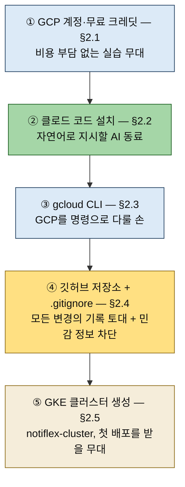

# 환경 구성 — GCP·클로드 코드·GKE 클러스터
---
> **첫 실습을 시작하기 전 갖춰야 할 환경 다섯 가지(GCP 계정·클로드 코드·gcloud CLI·깃허브 저장소·GKE 클러스터)가 각각 무엇을 위한 준비인지 설명할 수 있고, 왜 이 책이 GCP를 기준으로 삼되 AWS·Azure에도 같은 흐름이 적용되는지, 그리고 민감 정보(.env·service-account.json)를 왜 .gitignore로 먼저 막아 두는지 답할 수 있다.**


## 핵심 요약

> 2장 전반부(§2.1~§2.5)는 다섯 단계의 준비이자, GitAIOps의 토대 깔기입니다 — 비용 없이, AI와 함께, 깃에 안전하게 기록하며, 그 위에 클러스터를 세웁니다.

2장은 클라우드 환경을 세팅하고 첫 애플리케이션을 배포하는 장입니다. 그 전반부는 실습의 토대를 까는 다섯 단계의 준비입니다. 여기서부터 모든 작업을 클로드 코드에게 자연어로 지시하므로, 준비 단계 자체도 "무엇을 왜 깔고 있는지"를 알아 두면 뒤 장들이 수월해집니다.




## 학습 목표

> 이 절을 읽고 나면 다음 세 가지를 할 수 있습니다.

1. 다섯 준비 단계가 각각 무엇을 위한 것인지 "왜"와 함께 설명할 수 있습니다.
2. GCP 기준 실습이 AWS·Azure에도 통하는 이유(표준 쿠버네티스 + Helm/CRD)를 답할 수 있습니다.
3. 민감 정보를 `.gitignore`로 먼저 막는 이유와, 그것이 임시 방어선인 이유(뒤 장의 시크릿 관리로 격상)를 말할 수 있습니다.


## 실습으로 익히는 환경 구성

> §2.1~§2.5 다섯 준비 단계를, 책이 말한 내용과 실제로 친 명령·검증을 한 흐름으로 정리합니다. 실습은 서울 리전 `asia-northeast3`에서 진행했습니다(2026-07-04).

### 1. 계정·크레딧·도구 준비 (§2.1~§2.3)

첫 세 단계는 실습의 바탕을 까는 일입니다 — GCP 계정을 만들고, 자연어로 지시할 클로드 코드와 GCP를 명령으로 다룰 gcloud CLI를 설치합니다.

이 책의 실습은 GKE(Google Kubernetes Engine)를 기준으로 하고, 신규 가입 시 제공되는 무료 크레딧으로 전체를 완주하도록 설계돼 있습니다. 클라우드 비용이 학습의 진입 장벽이 되지 않게 하려는 의도입니다. 현행 조건은 기간 한정 무료 평가판 크레딧($300, 90일)인데, 조건·금액은 바뀔 수 있으므로 cloud.google.com/free에서 확인하고 시작하는 게 안전합니다. 

- 크레딧을 아끼려면 실습을 쉬는 날 클러스터(노드 VM)가 계속 소모하지 않도록, 뒤(§4 함정)에서 다룰 노드 풀 0 축소 전략을 처음부터 잡아 두면 완주가 편해집니다.

GCP를 기준으로 삼는다고 다른 클라우드를 배제하는 것은 아닙니다. 실습 대부분이 표준 쿠버네티스 위에서 Helm 차트와 CRD로 이뤄지기 때문에, 클라우드 매니지드 서비스 사이에서 1:1에 가깝게 호환됩니다. GCP에서 익힌 흐름이 AWS·Azure에서도 그대로 통한다는 뜻입니다.

클로드 코드를 설치할 때 한 가지 결정을 합니다. 책은 IDE 워크스페이스 기반보다 **터미널에서 직접 동작하는 방식**을 권장합니다. 

- 클로드 코드가 현재 작업 디렉터리의 구조와 파일을 보고 명령을 실행하며, 빌드·클러스터 생성·롤아웃 관찰의 연속을 한 흐름으로 이어 가기 때문입니다. 
- 설치 후에는 gcloud CLI로 계정·프로젝트·리전을 고정해, 매 명령마다 `--project`/`--region`을 반복하지 않도록 합니다.

```bash
gcloud auth login                                   # 브라우저로 계정 인증
gcloud config set project <프로젝트ID>
gcloud config set compute/region asia-northeast3
gcloud config set compute/zone asia-northeast3-a
```

### 2. 저장소 구성과 민감 정보 차단 (§2.4)

네 번째 단계는 깃허브 저장소 구성입니다. GitAIOps의 전제는 모든 변경이 깃에 기록되는 것이므로, 실습 결과를 담을 저장소가 출발점에 필요합니다.

이때 보안을 먼저 챙깁니다. `.env`, `.env.local`, `service-account.json` 같은 민감 정보 파일을 `.gitignore`에 등록해, 깃에 실수로 올라가지 않도록 막습니다. 클라우드 인증 키나 토큰이 공개 저장소에 노출되는 사고를 예방하는 첫 방어선입니다. 더 견고한 시크릿 관리(Sealed Secrets·Google Secret Manager)는 뒤 장에서 다루지만, 그전까지의 임시 보호는 `.gitignore`가 맡습니다. CLAUDE.md에도 토큰을 다룰 때의 주의가 정의돼, 클로드 코드가 민감 정보를 함부로 출력하거나 커밋하지 않도록 가드레일이 작동합니다.

`.gitignore`는 어디까지나 임시 방어선입니다. 이미 커밋된 시크릿은 `.gitignore`로 지워지지 않으므로, 유출됐다면 키 회전(rotate)이 정답입니다. 그래서 순서가 중요합니다 — 저장소를 먼저 채우고 나중에 막으면 히스토리에 민감 정보가 남으니, 첫 커밋 전에 `.gitignore`부터 둡니다.

### 3. GKE 클러스터 생성 — 명령과 검증 (§2.5)

다섯 번째 단계는 첫 배포를 받을 GKE 클러스터를 만드는 일입니다. 이름은 `notiflex-cluster`, 처음에는 `default-pool` 하나의 노드 풀로 단순하게 시작합니다. 책의 점진적 성장 원칙이 여기서 드러납니다 — 멀티 노드 풀·멀티 테넌시 같은 복잡한 구성은 서비스가 커지는 7~8장에서 붙이고, 지금은 최소로 출발합니다.

§2.5 본문은 "클러스터를 만들고 kubectl로 접근할 준비를 마친다"로 압축돼 있지만, 실제로는 **사전 점검 → 생성 → 자격증명 → 검증** 네 단계가 순서대로 필요합니다.

**① 사전 점검.** 클러스터를 만들기 전에 계정·프로젝트·리전이 맞는지, 결제와 필요한 API가 켜져 있는지 확인합니다. GKE는 결제 계정이 열려 있어야(billing enabled) 생성되고, `container.googleapis.com` API가 켜져 있어야 합니다.

```bash
gcloud config list                             # account·project·zone 확인
gcloud services enable container.googleapis.com cloudbuild.googleapis.com artifactregistry.googleapis.com
gcloud billing projects describe <프로젝트ID>    # billingEnabled: true 확인
```

**② 클러스터 생성(책 §2.5 명령 그대로).** 가드레일 `prompt-guardrails/ch2/2.5-gke-cluster.md`가 규정한 스펙을 그대로 실행합니다. 옵션 하나하나가 의도를 담습니다 — `--spot`은 선점형 VM으로 비용을 크게 낮추고(구글이 자원을 회수할 수 있는 대신 저렴), `--gateway-api=standard`는 5장에서 쓸 Gateway API를 미리 켜 두며, `--disk-size=30`은 노드 디스크를 최소로 잡아 크레딧을 아낍니다.

```bash
gcloud container clusters create notiflex-cluster \
  --zone=asia-northeast3-a \
  --machine-type=e2-medium \
  --num-nodes=2 \
  --spot \
  --gateway-api=standard \
  --disk-size=30
```

**결과:** 약 5~7분 뒤 `STATUS: RUNNING`. 노드 2개(e2-medium), GKE 버전 `1.35.5-gke.1163012`로 떴습니다.

**③ 자격증명·컨텍스트 정리.** 생성된 클러스터의 접속 정보를 kubeconfig(`~/.kube/config`)에 받아 오고, context 이름을 알아보기 쉽게 바꿉니다. `get-credentials`는 클러스터 엔드포인트와 자격증명을 kubeconfig에 써 넣고 current-context까지 바꿔 주는 명령입니다. kubectl이 "어느 클러스터에 말을 걸지"는 전부 이 kubeconfig가 결정하므로, 로컬에 다른 클러스터(minikube·kind 등)가 있으면 이 단계가 대상을 GKE로 확정합니다. 여러 클러스터를 오가는 상황(7장 멀티 테넌시, 회사·개인 클러스터 병행)에서는 context 확인이 사고 방지의 첫 습관이 됩니다.

```bash
gcloud container clusters get-credentials notiflex-cluster --zone=asia-northeast3-a
kubectl config rename-context "$(kubectl config current-context)" gke-sysnet4admin_book_gitaiops
```

**④ 검증.** "만들었다"로 끝내지 않고, 노드가 실제로 준비됐는지·Gateway API가 켜졌는지·스펙이 의도대로 들어갔는지를 눈으로 확인합니다.

```bash
kubectl get nodes -o wide          # 2개 모두 Ready
kubectl get gatewayclass           # gke-l7-* 4종 ACCEPTED=True (전파에 수 분)
gcloud container node-pools describe default-pool --cluster=notiflex-cluster \
  --zone=asia-northeast3-a --format="value(config.spot,config.machineType,config.diskSizeGb)"
# → True  e2-medium  30   (Spot·사양·디스크가 의도대로 들어갔는지 확인)
```

이 검증 명령들은 `result-templates/ch2/2.5-gke-cluster.md`의 체크리스트(노드 2개 Ready · Gateway API 활성화 · Spot VM 생성)와 1:1로 대응합니다 — 가드레일이 "무엇을 확인해야 성공인가"를 미리 정의해 둔 덕분입니다(§5 참조).

#### 왜 Standard인가 — Standard vs Autopilot

위에서 노드 풀(`default-pool`)을 직접 다룬 것은 GKE **Standard** 모드를 골랐기 때문입니다. GKE에는 노드를 직접 관리하는 Standard와 구글이 노드까지 관리해 주는 Autopilot, 두 운영 모드가 있습니다. 책이 Standard를 전제하는 이유는, 7장에서 워크로드별 멀티 노드 풀을 구성하려면 노드 제어권이 필요하기 때문입니다.

| 기준 | Standard | Autopilot |
|------|----------|-----------|
| 노드 관리 | 사용자가 노드 풀 크기·업그레이드 관리 | 구글이 노드 프로비저닝·관리 전담 |
| 과금 | 노드(VM) 단위 — 활용률과 무관 | Pod가 요청한 CPU·메모리 단위 |
| 어울리는 경우 | 노드 구성 제어가 필요할 때(멀티 노드풀·특수 하드웨어) | 운영 부담 최소화, 사용량 변동이 클 때 |

노드 풀 설계 자체가 학습 목표인 이 책에는 Standard가 맞고, 반대로 "노드는 신경 쓰기 싫고 앱만 올리고 싶다"면 Autopilot이 후보입니다. 한 가지 더 — Autopilot은 "노드를 자동 관리"라기보다 **제어 지점 자체가 노드에서 Pod로 옮겨간** 모델입니다. Standard에서는 사용자가 "노드 몇 대, 어떤 사양"을 정하고 그 위에 Pod가 스케줄되지만, Autopilot에서는 사용자가 **Pod의 리소스 요청(requests/limits)만 정하면** 구글이 그에 맞는 노드를 자동 프로비저닝해 붙입니다. 그래서 노드가 몇 대 떴는지 볼 필요조차 없고, 대신 Pod 리소스 값이 곧 과금·스케줄의 유일한 손잡이가 됩니다. "노드를 못 만지는 게 아니라, 노드를 만질 일 자체가 없어지는" 쪽이라 이해하면 두 모드의 차이가 선명해집니다.

### 4. 실습에서 겪은 함정 — 인증 플러그인·Gateway 전파·resize 지연

책 §2.5를 실제로 돌리며 만난, 책 본문·가이드에 없던 함정 세 가지입니다.

1. **`get-credentials` 후 kubectl이 곧바로 안 되고 `gke-gcloud-auth-plugin not found`** 로 막힙니다. 최신 kubectl(v1.26+)은 GKE 인증에 별도 플러그인이 필요한데, `get-credentials`는 kubeconfig만 써넣을 뿐 이 플러그인을 깔아 주지는 않습니다. `gcloud components install gke-gcloud-auth-plugin`으로 설치합니다. Homebrew로 설치한 gcloud면 실 바이너리가 `/opt/homebrew/share/google-cloud-sdk/bin/`에 들어가는데 PATH엔 `/opt/homebrew/bin`(심링크)만 걸려 있어, 그 SDK bin 경로를 PATH에 추가해야 인식됩니다. §2.5의 "kubeconfig를 받아 kubectl로 접근"과 실제 사이에 이 한 칸이 더 있습니다.
2. **클러스터 생성 직후 `kubectl get gatewayclass`가 `No resources found`** 로 뜹니다. `--gateway-api=standard`로 만들었어도 GatewayClass CRD·컨트롤러가 전파되는 데 수 분이 걸립니다. 설정이 틀린 게 아니라 전파 지연이므로, 잠시 기다리면 GatewayClass가 `ACCEPTED`로 올라옵니다. 생성 직후 한 번 조회해 비어 있다고 놀라지 않아도 됩니다.
3. **`resize --num-nodes=0`으로 노드를 줄인 뒤에도 클러스터 요약의 `currentNodeCount`가 잠시 1로 남습니다.** 실제 VM과 `kubectl get nodes`는 이미 0인데 요약 필드 갱신만 지연되는 것입니다. 비용은 실제 VM 기준이라 이미 멈췄으니, 요약 숫자를 보고 "아직 노드가 남았나" 오해하지 않습니다. 실습을 쉴 때 노드 풀을 0으로 줄이는 이 방식(클러스터·매니페스트·이미지는 보존, 노드 VM 과금만 중단)이 삭제·재생성보다 재개가 빠릅니다.

### 5. 저장소 가드레일이 이 실습을 어떻게 이끄는가

위 클러스터 생성 명령이 "책 §2.5 그대로"였던 이유가 여기에 있습니다. 

- 실습 저장소(`_Book_GitAIOps`)에는 클로드 코드가 자연어 지시를 실행할 때 참조하는 **가드레일**이 놓여 있습니다. 사람이 "GKE 클러스터 만들어줘"라고만 말해도 AI가 제멋대로 하지 않고, 미리 정의된 스펙·검증·정리 절차를 따르게 하는 장치입니다. 
- 이것이 §1.3에서 배운 **"정의는 사람, 적용은 자동"의 실습 버전**입니다 — 가드레일 파일이 곧 사람이 미리 못 박아 둔 "정의"이고, 클로드 코드가 그걸 참조해 명령을 실행하는 것이 "적용"입니다.

가드레일은 세 종류이고 역할이 갈립니다. 진입점은 저장소 루트의 `CLAUDE.md`입니다.

| 가드레일 | 역할 | §2.5 클러스터 생성에서 실제로 한 일 |
|----------|------|--------------------------------------|
| `CLAUDE.md` (라우터) | `mode: auto` 설정 + "독자 입력 → 참조 파일" 매칭 테이블. 자연어 입력을 유형(탐색·비교·실행)별로 알맞은 파일에 연결 | "GKE 클러스터 생성해줘" 입력을 실행 유형으로 판별해 `prompt-guardrails/ch2/2.5-gke-cluster.md`로 라우팅 |
| `prompt-guardrails/` | **실행 지침** — 사전 조건·정확한 명령·트러블슈팅·"질문해보기"를 규정 | 위 `create` 명령의 옵션 전체(`--spot`·`--gateway-api=standard`·`--disk-size=30`)와 Gateway 리소스 누수 정리 절차까지 못 박음 |
| `result-templates/` | **예상 결과 + 체크리스트** — "무엇을 확인해야 성공인가"를 정의 | `kubectl get nodes` 예상 출력과 체크리스트(노드 2개 Ready·Gateway 활성화·Spot 생성)를 제공 → ④ 검증의 기준 |
| `decision-guides/` | **탐색·비교** — 도구 선택지가 있는 챕터에서 추천·장단점 제시 | **2장에는 없음.** 2장은 GKE·Cloud Build처럼 선택지 없이 바로 실행하는 단계라 탐색 가이드가 불필요 |

- 세 종류가 유형별로 나뉜 것은 §1.3의 "탐색 → 비교 → 실행" 대화 흐름과 그대로 맞물립니다. "뭘 쓰면 돼?"(탐색)·"장단점은?"(비교)에는 `decision-guides/`가, "그걸로 진행해줘"(실행)에는 `prompt-guardrails/`가 답하고, 실행 결과의 합격 여부는 `result-templates/`가 판정합니다. 
- 2장이 `decision-guides/` 없이 흐르는 것은, 환경 구성 단계에는 고를 여지 없이 "정해진 대로 깔면 되는" 작업이 대부분이기 때문입니다. 도구 선택이 본격적으로 등장하는 3장(GitOps 도구)부터 `decision-guides/`가 채워집니다.

한 가지 더 — 가드레일은 **문서**라서 "어길 수 있는" 층입니다. AI가 참조를 건너뛰거나 다르게 해석할 여지가 있습니다. 

- 그래서 더 강한 강제가 필요한 지점(민감 명령 차단 등)은 `.claude/settings`의 permissions·hooks로 **기계적으로** 막습니다. 
- 이 층위 차이(가드레일 문서 = 권고, permissions/hooks = 강제)는 §1.3 노트에서 정리한 그대로이며, 2장 실습에서는 아직 문서 가드레일 층까지만 씁니다.


## 실무 적용 포인트

> 환경 구성의 순서와 방어선 배치는 실무 온보딩에서도 같은 패턴으로 반복됩니다.

### 이런 상황에서 사용하세요

- 새 프로젝트·새 팀에 합류해 클라우드 환경을 처음 잡을 때 — 계정 → 도구 → 저장소(+보안) → 클러스터 순서가 그대로 온보딩 체크리스트가 됩니다.
- 학습용 클라우드 계정을 만들 때 — 무료 크레딧 조건 확인과 유휴 리소스 정리 전략을 처음부터 세웁니다.
- 여러 클러스터를 오가며 작업할 때 — `kubectl config current-context` 확인을 습관으로 만듭니다.

### 주의할 점

- ⚠️ `.gitignore`는 임시 방어선입니다 — 이미 커밋된 시크릿은 .gitignore로 지워지지 않으므로, 유출 시 키 회전(rotate)이 정답입니다.
- ⚠️ 첫 커밋 전에 .gitignore부터 만드는 순서가 중요합니다 — 저장소를 먼저 채우고 나중에 막으면 히스토리에 민감 정보가 남을 수 있습니다.
- ⚠️ 무료 크레딧이라도 클러스터는 켜 둔 시간만큼 크레딧을 소모합니다 — 실습을 쉬는 날의 유휴 노드 정리 전략(§4 함정 3)을 처음부터 세워야 완주가 수월합니다.


## 핵심 개념 체크리스트

- [ ] 다섯 준비 단계와 각각의 "왜"를 설명할 수 있는가?
- [ ] GCP 실습이 AWS·Azure로 이식되는 근거(표준 쿠버네티스 + Helm/CRD)를 말할 수 있는가?
- [ ] `get-credentials`가 kubeconfig에 무엇을 써 넣는지 답할 수 있는가?
- [ ] Standard와 Autopilot의 제어 지점 차이(노드 vs Pod)를 말할 수 있는가?
- [ ] `.gitignore` 방어선의 역할과 한계(임시 보호 → 뒤 장의 시크릿 관리)를 구분할 수 있는가?


## 참고 자료

- GKE Standard vs Autopilot 공식 비교: [docs.cloud.google.com — Autopilot/Standard feature comparison](https://docs.cloud.google.com/kubernetes-engine/docs/resources/autopilot-standard-feature-comparison)
- `get-credentials` 공식 레퍼런스: [docs.cloud.google.com — gcloud container clusters get-credentials](https://docs.cloud.google.com/sdk/gcloud/reference/container/clusters/get-credentials)
- GCP 무료 크레딧 현행 조건: [cloud.google.com/free](https://cloud.google.com/free)
- 다음 절 정독 노트: [02-02 첫 배포와 마무리](./02-02.첫%20배포와%20마무리%20—%20빌드·매니페스트·커밋·스킬.md)
