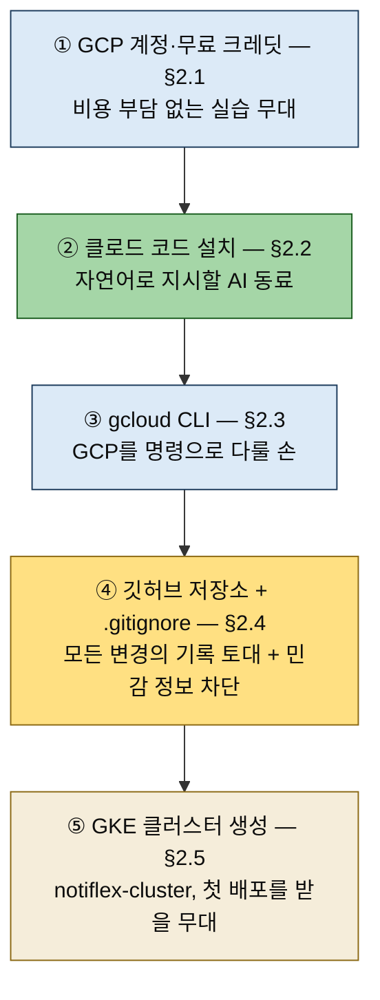

# 환경 구성 — GCP·클로드 코드·GKE 클러스터
---
> **첫 실습을 시작하기 전 갖춰야 할 환경 다섯 가지(GCP 계정·클로드 코드·gcloud CLI·깃허브 저장소·GKE 클러스터)가 각각 무엇을 위한 준비인지 설명할 수 있고, 왜 이 책이 GCP를 기준으로 삼되 AWS·Azure에도 같은 흐름이 적용되는지, 그리고 민감 정보(.env·service-account.json)를 왜 .gitignore로 먼저 막아 두는지 답할 수 있다.**


## 📌 핵심 요약

> 2장 전반부(§2.1~§2.5)는 다섯 단계의 준비이자, GitAIOps의 토대 깔기입니다 — 비용 없이, AI와 함께, 깃에 안전하게 기록하며, 그 위에 클러스터를 세웁니다.

2장은 클라우드 환경을 세팅하고 첫 애플리케이션을 배포하는 장입니다. 그 전반부는 실습의 토대를 까는 다섯 단계의 준비입니다. 여기서부터 모든 작업을 클로드 코드에게 자연어로 지시하므로, 준비 단계 자체도 "무엇을 왜 깔고 있는지"를 알아 두면 뒤 장들이 수월해집니다.




## 🎯 학습 목표

> 이 절을 읽고 나면 다음 세 가지를 할 수 있습니다.

1. 다섯 준비 단계가 각각 무엇을 위한 것인지 "왜"와 함께 설명할 수 있습니다.
2. GCP 기준 실습이 AWS·Azure에도 통하는 이유(표준 쿠버네티스 + Helm/CRD)를 답할 수 있습니다.
3. 민감 정보를 `.gitignore`로 먼저 막는 이유와, 그것이 임시 방어선인 이유(뒤 장의 시크릿 관리로 격상)를 말할 수 있습니다.


## 📖 본문 정리

> §2.1~§2.5 다섯 단계를 책 순서대로 정리합니다.

### 1. GCP 계정과 무료 크레딧

> 실습 전체를 무료 크레딧 범위에서 끝낼 수 있게, GCP 계정을 만들고 크레딧 활용 전략을 잡습니다.

첫 단계는 GCP 계정 생성입니다. 이 책의 실습은 GKE(Google Kubernetes Engine)를 기준으로 진행되며, 신규 가입 시 제공되는 무료 크레딧으로 전체 실습을 완주할 수 있도록 설계돼 있습니다. 클라우드 비용이 학습의 진입 장벽이 되지 않게 하려는 의도입니다.

이 책이 GCP를 기준으로 삼는다고 해서 다른 클라우드를 배제하는 것은 아닙니다. 실습의 대부분이 표준 쿠버네티스 위에서 Helm 차트와 CRD로 이뤄지기 때문에, 클라우드 매니지드 서비스 사이에서 1:1에 가깝게 호환됩니다. GCP에서 익힌 흐름이 AWS·Azure에서도 그대로 통한다는 뜻입니다.

### 2. 클로드 코드와 gcloud CLI 설치

> 인프라를 자연어로 지시할 도구(클로드 코드)와 GCP를 명령으로 다룰 도구(gcloud CLI)를 차례로 설치합니다.

두 번째·세 번째 단계는 도구 설치입니다. 클로드 코드는 이 책에서 모든 작업을 지시할 AI 동료이고, gcloud CLI는 GCP 리소스를 명령줄에서 다루는 공식 도구입니다.

클로드 코드를 설치할 때 한 가지 결정을 합니다. 책은 IDE 워크스페이스 기반보다 **터미널에서 직접 동작하는 방식**을 권장합니다. 클로드 코드가 현재 작업 디렉터리의 구조와 파일을 보고 명령을 실행하며, 빌드·클러스터 생성·롤아웃 관찰의 연속을 한 흐름으로 이어 가기 때문입니다. 설치 후에는 gcloud CLI로 GCP 프로젝트에 인증하고 기본 리전 같은 환경을 잡아 둡니다.

### 3. 깃허브 저장소 구성과 민감 정보 차단

> 작업 결과를 담을 저장소를 만들고, .env·service-account.json 같은 민감 정보를 .gitignore로 먼저 막아 둡니다.

네 번째 단계는 깃허브 저장소 구성입니다. GitAIOps의 전제는 모든 변경이 깃에 기록되는 것이므로, 실습 결과를 담을 저장소가 출발점에 필요합니다.

이때 보안을 먼저 챙깁니다. `.env`, `.env.local`, `service-account.json` 같은 민감 정보 파일을 `.gitignore`에 등록해, 깃에 실수로 올라가지 않도록 막습니다. 클라우드 인증 키나 토큰이 공개 저장소에 노출되는 사고를 예방하는 첫 방어선입니다. 더 견고한 시크릿 관리(Sealed Secrets·Google Secret Manager)는 뒤 장에서 다루지만, 그전까지의 임시 보호는 `.gitignore`가 맡습니다. CLAUDE.md에도 토큰을 다룰 때의 주의가 정의돼, 클로드 코드가 민감 정보를 함부로 출력하거나 커밋하지 않도록 가드레일이 작동합니다.

### 4. GKE 클러스터 생성

> 첫 배포를 받을 GKE 클러스터(notiflex-cluster)를 default-pool 단일 노드 풀로 단순하게 시작합니다.

다섯 번째 단계는 GKE 클러스터 생성입니다. Notiflex 서비스를 올릴 무대를 만드는 일입니다. 클러스터 이름은 `notiflex-cluster`이고, 처음에는 `default-pool` 하나의 노드 풀로 단순하게 시작합니다.

여기서 책의 점진적 성장 원칙이 드러납니다. 처음부터 멀티 노드 풀이나 멀티 테넌시 같은 복잡한 구성을 잡지 않고, 단일 노드 풀로 출발해 서비스가 커지면서 7~8장에서 확장합니다. 클러스터를 생성한 뒤에는 `kubectl`로 접근할 수 있게 인증 정보를 받아, 다음 절(§2.6)에서 첫 애플리케이션을 배포할 준비를 마칩니다.


## 🔍 심화 학습

> 책이 지나가듯 언급한 인증·클러스터 접근의 실제 명령 흐름과, GKE의 두 운영 모드를 보강합니다. 책 밖 조사 내용입니다.

### gcloud 인증에서 kubectl 연결까지 — 실제 명령 흐름

§2.3의 "인증하고 환경을 잡아 둔다"와 §2.5의 "인증 정보를 받아 kubectl로 접근한다"를 명령 수준으로 펼치면 다음 흐름입니다(보강 예시 — 책 원문 전사가 아닙니다):

```bash
# ① 브라우저로 GCP 계정 인증 — 이후 gcloud 명령이 이 자격으로 실행됨
gcloud auth login

# ② 기본 프로젝트·리전 고정 — 매 명령마다 --project/--region 반복을 없앰
gcloud config set project <프로젝트ID>
gcloud config set compute/region asia-northeast3

# ③ 클러스터 자격증명을 kubeconfig(~/.kube/config)에 기록
#    — 이 한 줄이 §2.5의 "kubectl로 접근할 수 있게 인증 정보를 받아"에 해당
gcloud container clusters get-credentials notiflex-cluster --region asia-northeast3

# ④ 연결 확인 — current-context가 notiflex-cluster를 가리켜야 함
kubectl config current-context
```

③의 `get-credentials`는 클러스터 엔드포인트와 자격증명을 `~/.kube/config`에 써 넣고 current-context까지 바꿔 주는 명령입니다. kubectl이 "어느 클러스터에 말을 걸지"는 전부 이 kubeconfig가 결정하므로, 여러 클러스터를 오가는 상황(이 책 7장의 멀티 테넌시, 혹은 회사·개인 클러스터 병행)에서는 context 확인이 사고 방지의 첫 습관이 됩니다.

### GKE의 두 운영 모드 — Standard vs Autopilot

GKE 클러스터에는 노드를 직접 관리하는 Standard 모드와 구글이 노드까지 관리해 주는 Autopilot 모드가 있습니다. 책은 노드 풀(`default-pool`)을 직접 다루므로 Standard 모드 전제입니다 — 7장에서 워크로드별 멀티 노드풀을 구성하려면 노드 제어권이 필요하기 때문입니다.

| 기준 | Standard | Autopilot |
|------|----------|-----------|
| 노드 관리 | 사용자가 노드 풀 크기·업그레이드 관리 | 구글이 노드 프로비저닝·관리 전담 |
| 과금 | 노드(VM) 단위 — 활용률과 무관 | Pod가 요청한 CPU·메모리 단위 |
| 어울리는 경우 | 노드 구성 제어가 필요할 때(멀티 노드풀·특수 하드웨어) | 운영 부담 최소화, 사용량 변동이 클 때 |

이 책처럼 노드 풀 설계 자체가 학습 목표라면 Standard가 맞고, 반대로 "노드는 신경 쓰기 싫고 앱만 올리고 싶다"면 Autopilot이 후보가 됩니다.

### 무료 크레딧의 실제 조건

GCP 신규 계정에는 기간 한정 무료 평가판 크레딧(현행 $300, 90일)이 제공됩니다. 조건과 금액은 바뀔 수 있으므로 [cloud.google.com/free](https://cloud.google.com/free)에서 현행 조건을 확인하고 시작하는 게 안전합니다. 실습을 쉬는 날에는 클러스터(노드 VM)가 크레딧을 계속 소모하지 않도록 노드 풀 크기를 0으로 줄이거나 클러스터를 삭제·재생성하는 전략도 함께 잡아 두면 완주가 편해집니다.


## 💡 실무 적용 포인트

> 환경 구성의 순서와 방어선 배치는 실무 온보딩에서도 같은 패턴으로 반복됩니다.

### 이런 상황에서 사용하세요

- 새 프로젝트·새 팀에 합류해 클라우드 환경을 처음 잡을 때 — 계정 → 도구 → 저장소(+보안) → 클러스터 순서가 그대로 온보딩 체크리스트가 됩니다.
- 학습용 클라우드 계정을 만들 때 — 무료 크레딧 조건 확인과 유휴 리소스 정리 전략을 처음부터 세웁니다.
- 여러 클러스터를 오가며 작업할 때 — `kubectl config current-context` 확인을 습관으로 만듭니다.

### 주의할 점

- ⚠️ `.gitignore`는 임시 방어선입니다 — 이미 커밋된 시크릿은 .gitignore로 지워지지 않으므로, 유출 시 키 회전(rotate)이 정답입니다.
- ⚠️ 첫 커밋 전에 .gitignore부터 만드는 순서가 중요합니다 — 저장소를 먼저 채우고 나중에 막으면 히스토리에 민감 정보가 남을 수 있습니다.
- ⚠️ 무료 크레딧이라도 클러스터는 켜 둔 시간만큼 크레딧을 소모합니다 — 실습을 쉬는 날의 유휴 노드 정리 전략(심화 학습 참조)을 처음부터 세워야 완주가 수월합니다.


## ✅ 핵심 개념 체크리스트

- [ ] 다섯 준비 단계와 각각의 "왜"를 설명할 수 있는가?
- [ ] GCP 실습이 AWS·Azure로 이식되는 근거(표준 쿠버네티스 + Helm/CRD)를 말할 수 있는가?
- [ ] `get-credentials`가 kubeconfig에 무엇을 써 넣는지 답할 수 있는가?
- [ ] `.gitignore` 방어선의 역할과 한계(임시 보호 → 뒤 장의 시크릿 관리)를 구분할 수 있는가?


## 면접 관점 정리

> 다섯 단계를 "왜 이 준비가 필요한가"로 엮으면, 환경 구성이 단순 설치가 아니라 GitAIOps의 토대 깔기임이 드러납니다.

| 단계 | 무엇을 | 왜 |
|------|--------|-----|
| §2.1 GCP 계정·무료 크레딧 | 클라우드 계정 + 크레딧 전략 | 비용 부담 없이 GKE 실습 완주 |
| §2.2 클로드 코드 | 터미널형 AI 설치 | 모든 작업을 자연어로 지시할 동료 확보 |
| §2.3 gcloud CLI | GCP 공식 명령 도구 | 프로젝트 인증·리전 설정 |
| §2.4 깃허브 저장소 | 결과 저장소 + .gitignore | GitAIOps의 깃 기록 토대 + 민감 정보 차단 |
| §2.5 GKE 클러스터 | notiflex-cluster (default-pool) | 첫 배포를 받을 무대, 단순하게 시작해 뒤에서 확장 |

다섯 단계는 따로 노는 설치 목록이 아니라 하나의 토대 깔기입니다. 비용 없이(§2.1), AI와 함께(§2.2), GCP를 명령으로 다루며(§2.3), 모든 변경을 깃에 안전하게 남기고(§2.4), 그 위에 클러스터를 세웁니다(§2.5). 이 토대가 갖춰지면, 다음 절에서 클로드 코드에게 "Notiflex를 배포해줘"라고 말하는 것으로 첫 배포가 시작됩니다.


## 🔗 참고 자료

- GKE Standard vs Autopilot 공식 비교: [docs.cloud.google.com — Autopilot/Standard feature comparison](https://docs.cloud.google.com/kubernetes-engine/docs/resources/autopilot-standard-feature-comparison)
- `get-credentials` 공식 레퍼런스: [docs.cloud.google.com — gcloud container clusters get-credentials](https://docs.cloud.google.com/sdk/gcloud/reference/container/clusters/get-credentials)
- GCP 무료 크레딧 현행 조건: [cloud.google.com/free](https://cloud.google.com/free)
- 다음 절 정독 노트: [02-02 첫 배포와 마무리](./02-02.첫%20배포와%20마무리%20—%20빌드·매니페스트·커밋·스킬.md)
