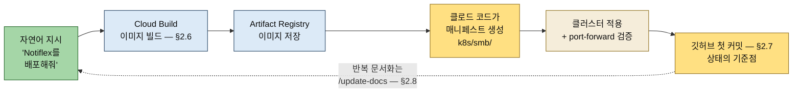

# 첫 배포와 마무리 — 빌드·매니페스트·커밋·스킬
---
> **Notiflex의 첫 배포가 "이미지 빌드(Cloud Build → Artifact Registry) → 매니페스트 생성(Namespace·Deployment·Service) → 클러스터 적용 → 깃 커밋" 흐름으로 이뤄짐을 설명할 수 있고, 그 매니페스트를 사람이 한 줄씩 쓰지 않고 클로드 코드가 생성한다는 점에서 이것이 GitAIOps의 첫 실습임을 말할 수 있으며, 반복되는 문서화를 /update-docs 슬래시 명령으로 자동화하는 이유를 답할 수 있다.**


## 📌 핵심 요약

> 2장 후반부는 GitAIOps의 첫 한 바퀴입니다 — 클로드 코드에게 자연어로 지시해 빌드·매니페스트·배포를 얻고, 그 결과를 검증해 깃에 기록합니다.

환경이 갖춰졌으니(§2.1~§2.5) 이제 실제로 배포합니다. 2장 후반부는 Notiflex API 서버를 빌드해 GKE에 올리고, 그 결과를 깃에 남긴 뒤, 작업 기록을 자동화하는 슬래시 명령까지 만드는 과정입니다.




## 🎯 학습 목표

> 이 절을 읽고 나면 다음 세 가지를 할 수 있습니다.

1. 첫 배포의 네 단계(빌드 → 매니페스트 → 적용 → 커밋)와 각 단계의 "왜"를 설명할 수 있습니다.
2. 빌드와 배포가 분리되는 구조(클러스터는 이미지를 실행)가 뒤 장의 CI·롤백·무중단 배포의 토대가 되는 이유를 답할 수 있습니다.
3. 반복 문서화를 커스텀 슬래시 명령으로 자동화하는 구조(`.claude/commands/`)를 말할 수 있습니다.


## 📖 본문 정리

> §2.6~§2.9를 책 순서대로 정리합니다.

### 1. 이미지 빌드와 Artifact Registry 저장

> 소스를 Cloud Build로 빌드해 컨테이너 이미지를 만들고, Artifact Registry에 저장합니다.

첫 배포의 출발은 컨테이너 이미지입니다. Notiflex API 서버 소스를 Cloud Build로 빌드하면, 완성된 이미지가 Artifact Registry에 저장됩니다. 예를 들어 `asia-northeast3-docker.pkg.dev/<프로젝트>/notiflex/api:v0.1.0` 같은 경로에 태그와 함께 올라갑니다.

이 단계가 의미 있는 이유는, 클러스터가 실행할 것이 소스 코드가 아니라 **이미지**이기 때문입니다. 빌드는 한 번 하고 그 산출물(이미지)을 레지스트리에 두면, 이후 배포는 그 이미지를 참조만 하면 됩니다. 빌드와 배포가 분리되는 이 구조가 뒤 장의 CI(3장)·롤백·무중단 배포(5장)의 토대가 됩니다.

### 2. 쿠버네티스 매니페스트 생성과 배포

> 클러스터에 올릴 Namespace·Deployment·Service 매니페스트를 클로드 코드가 생성하고, 클러스터에 적용합니다.

저장된 이미지를 클러스터에서 실행하려면 매니페스트가 필요합니다. 여기서 GitAIOps의 핵심 장면이 나옵니다 — 사람이 YAML을 한 줄씩 쓰는 대신, 클로드 코드에게 "배포할 매니페스트를 만들어줘"라고 하면 현재 프로젝트 구조를 보고 세 개의 매니페스트를 생성합니다.

| 매니페스트 | 역할 |
|-----------|------|
| `k8s/smb/namespace.yaml` | `notiflex` 네임스페이스 — 리소스를 담을 논리적 공간 |
| `k8s/smb/deployment.yaml` | `notiflex-api` Deployment — 이미지를 어떤 replicas로 실행할지 |
| `k8s/smb/service.yaml` | Service — Pod로 들어오는 트래픽을 라우팅 |

경로가 `k8s/smb/`인 점에 주목할 만합니다. SMB(소규모 비즈니스) 단계의 구성이라는 뜻으로, 뒤에서 엔터프라이즈 단계의 매니페스트와 디렉터리로 구분됩니다. 매니페스트를 클러스터에 적용하면 첫 배포가 완료되고, `port-forward`로 로컬에서 서비스 응답을 확인할 수 있습니다.

클로드 코드가 생성하는 Deployment의 뼈대를 감 잡아 두면 결과 검증이 쉬워집니다(보강 예시 — 책 원문 전사가 아닙니다):

```yaml
# k8s/smb/deployment.yaml 골격 — 보강 예시
apiVersion: apps/v1
kind: Deployment
metadata:
  name: notiflex-api
  namespace: notiflex          # namespace.yaml이 먼저 만든 논리 공간에 소속
spec:
  replicas: 2                  # Pod 하나가 죽어도 서비스가 유지되는 최소 여유
  selector:
    matchLabels:
      app: notiflex-api
  template:
    metadata:
      labels:
        app: notiflex-api      # Service가 이 라벨로 트래픽 대상을 찾음
    spec:
      containers:
        - name: api
          image: asia-northeast3-docker.pkg.dev/<프로젝트>/notiflex/api:v0.1.0
          ports:
            - containerPort: 8080
          resources:           # 리소스 요청/제한 — 노드 스케줄링과 과점유 방지의 근거
            requests:
              cpu: 100m
              memory: 64Mi
            limits:
              cpu: 250m
              memory: 128Mi
```

### 3. 깃허브 첫 커밋

> 빌드 설정·매니페스트를 깃에 커밋해, 이 시점의 상태를 GitAIOps의 단일 진실 공급원에 기록합니다.

배포가 동작하면 그 결과를 깃에 남깁니다. 매니페스트와 빌드 설정을 깃허브 저장소에 첫 커밋으로 올리는 단계입니다. GitOps의 원칙대로, 지금 클러스터에 떠 있는 상태가 곧 깃에 선언된 상태가 되도록 맞추는 것입니다.

이 첫 커밋이 중요한 이유는, 이후 모든 변경의 기준점이 되기 때문입니다. 3장에서 ArgoCD를 붙이면 이 저장소를 감시하며 자동 배포가 시작되고, 클러스터와 깃의 상태가 어긋나면 깃 기준으로 되돌립니다. 첫 커밋은 그 자동화가 따라갈 출발 상태를 박아 두는 일입니다.

### 4. 마무리: /update-docs 스킬 만들기

> 장마다 반복되는 작업 문서화를, 커스텀 슬래시 명령(/update-docs)으로 만들어 짧게 호출합니다.

각 장이 끝날 때마다 작업한 내용을 문서로 정리하는 일이 필요합니다. 매번 긴 프롬프트를 입력하는 대신, 클로드 코드의 커스텀 슬래시 명령으로 만들어 두면 `/update-docs`처럼 짧게 호출할 수 있습니다.

커스텀 슬래시 명령은 프로젝트 루트의 `.claude/commands/<이름>.md`에 단일 파일로 등록합니다. 파일에 작업을 정리하는 지침을 적어 두면, 이후 `/update-docs` 한 번으로 현재 작업 기준의 변경 사항을 문서로 저장합니다. 반복되는 메타 작업(문서화)을 자동화해, 인프라 작업 자체에 집중하게 하려는 장치입니다. 형태는 이런 골격입니다(보강 예시):

```markdown
<!-- .claude/commands/update-docs.md — 보강 예시 -->
현재 작업 디렉터리의 최근 변경 사항(git diff 기준)을 확인하고,
어떤 리소스를 왜 추가·수정했는지 docs/ 아래 작업 기록 문서에 정리해줘.
새 도구를 도입했다면 선택 이유와 대안 비교를 함께 남겨줘.
```

마지막 §2.9에서는 2장에서 동작한 가드레일을 돌아보며 장을 닫습니다.


## 🔍 심화 학습

> 빌드 도구·레지스트리·이미지 베이스 선택의 배경과, 완성본 저장소에서 확인되는 진화를 보강합니다. 책 밖 조사 내용입니다.

### 왜 Cloud Build이고, 왜 Artifact Registry인가

로컬 `docker build`로도 이미지는 만들어집니다. 그럼에도 Cloud Build를 쓰면 빌드가 내 노트북 환경이 아닌 재현 가능한 클라우드 환경에서 돌고, Artifact Registry 저장·취약점 스캔·이후 CI(3장 GitHub Actions) 연결이 한 생태계 안에서 이어집니다. "빌드도 코드처럼 선언하고 기록한다"는 GitAIOps 방향과 맞는 선택입니다.

레지스트리 쪽은 선택의 여지가 없어졌습니다. GCP의 옛 레지스트리인 Container Registry(gcr.io)는 공식 지원 종료 수순을 밟아 2025년에 단계적으로 차단됐고(3월 푸시 차단 → 5월 풀 차단), Artifact Registry가 유일한 후속입니다. 이미지 경로가 `gcr.io/...`가 아니라 `<리전>-docker.pkg.dev/...`인 것이 그 흔적입니다.

### scratch 이미지가 가능한 이유 — Go 정적 바이너리

완성본 저장소의 실제 Dockerfile은 2단계 빌드로 돼 있습니다([notiflex-platform/app/Dockerfile](https://github.com/sysnet4admin/notiflex-platform/blob/main/app/Dockerfile), 2026-07 확인):

```dockerfile
# 실제 완성본 Dockerfile — golang 빌더에서 컴파일하고 scratch로 복사
FROM golang:1.25-alpine AS builder
WORKDIR /app
COPY go.mod go.sum ./
COPY main.go .
RUN CGO_ENABLED=0 GOOS=linux go build -o notiflex-api .

FROM scratch
COPY --from=builder /app/notiflex-api /notiflex-api
EXPOSE 8080
ENTRYPOINT ["/notiflex-api"]
```

`scratch`는 OS도 셸도 없는 빈 이미지입니다. 여기에 바이너리 하나만 올려도 동작하는 이유는 `CGO_ENABLED=0`으로 빌드한 Go 바이너리가 C 라이브러리에 의존하지 않는 정적 실행 파일이기 때문입니다. 이미지가 수 MB 수준으로 작아지고, 셸·패키지 관리자가 없으니 공격 표면도 최소가 됩니다. §1.5에서 "Go 표준 라이브러리 + scratch"라고 소개한 기술 스택이 이 구조를 가리킵니다.

### 완성본에서는 deployment.yaml이 rollout.yaml로 진화한다

완성본 저장소의 `k8s/smb/` 디렉터리를 열어 보면 2장에서 만든 `deployment.yaml`이 보이지 않고 대신 `rollout.yaml`(Argo Rollouts)·`gateway.yaml`(Gateway API)·`service-preview.yaml` 등이 있습니다. 5장 무중단 배포(Blue/Green)에서 표준 Deployment가 Argo Rollouts의 Rollout 리소스로 교체되기 때문입니다. 완성본은 책의 *마지막* 상태라는 점 — 2장 시점의 파일 구성과 다르다는 점 — 을 알고 보면, 저장소가 곧 성장 타임라인의 종착지임이 보입니다.


## 💡 실무 적용 포인트

> 첫 배포 한 바퀴의 패턴은 실무의 신규 서비스 셋업에서 그대로 반복됩니다.

### 이런 상황에서 사용하세요

- 신규 서비스를 처음 클러스터에 올릴 때 — 이미지 빌드 → 레지스트리 → 매니페스트 → 적용 → 커밋 순서가 표준 체크리스트가 됩니다.
- AI가 생성한 매니페스트를 검토할 때 — 본문의 Deployment 골격(네임스페이스 소속·라벨 셀렉터·리소스 제한)이 검토 항목이 됩니다.
- 반복되는 프롬프트가 생겼을 때 — `.claude/commands/`로 슬래시 명령화하는 습관이 팀 전체의 재사용 자산이 됩니다.

### 주의할 점

- ⚠️ 이미지 태그를 `latest`로 두지 않습니다 — 버전 태그(v0.1.0)가 있어야 롤백 지점이 생기고, 3장 CI의 태그 전략과 이어집니다.
- ⚠️ 클러스터에 적용만 하고 커밋을 잊으면 GitOps 전제가 무너집니다 — "떠 있는 상태 = 깃에 선언된 상태"가 첫 커밋부터 지켜져야 3장 ArgoCD가 바로 탈 수 있습니다.
- ⚠️ AI가 생성한 매니페스트라도 리소스 요청/제한 값이 서비스 특성에 맞는지는 사람이 확인해야 합니다 — 잘못된 limits는 OOMKilled나 스로틀링으로 돌아옵니다.


## ✅ 핵심 개념 체크리스트

- [ ] 첫 배포의 네 단계와 각 단계의 산출물을 나열할 수 있는가?
- [ ] 빌드/배포 분리가 CI·롤백·무중단 배포의 토대가 되는 이유를 설명할 수 있는가?
- [ ] scratch 이미지가 Go에서 가능한 이유(CGO_ENABLED=0 정적 바이너리)를 답할 수 있는가?
- [ ] 커스텀 슬래시 명령의 등록 위치(`.claude/commands/<이름>.md`)와 용도를 말할 수 있는가?


## 면접 관점 정리

> 첫 배포의 네 단계가 모두 "클로드 코드 지시 → 결과를 깃에 기록"이라는 GitAIOps 한 바퀴로 묶인다는 점이 핵심입니다.

| 단계 | 핵심 | GitAIOps 관점 |
|------|------|--------------|
| §2.6 빌드 | Cloud Build → Artifact Registry 이미지 | 빌드/배포 분리, 클러스터는 이미지를 실행 |
| §2.6 매니페스트 | 클로드 코드가 Namespace·Deployment·Service 생성 | 정의 작업을 AI가 대신(GitAIOps의 첫 실습) |
| §2.7 첫 커밋 | 매니페스트를 깃에 기록 | 클러스터 상태 = 깃 선언 상태의 기준점 |
| §2.8 /update-docs | 문서화를 슬래시 명령으로 자동화 | 반복 메타 작업을 도구로 고정 |

2장 전체를 한 문장으로 줄이면, "환경을 갖추고(전반부) 클로드 코드와 함께 첫 배포를 돌린 뒤 깃에 기록한다(후반부)"입니다. 사람이 YAML을 직접 쓰지 않고 의도를 전달해 매니페스트를 얻고, 그 결과를 검증하고 커밋하는 흐름 — 이것이 [§1.3 GitAIOps](./01-02.GitOps에서%20GitAIOps로.md)에서 개념으로 설명한 것을 처음 손으로 체험하는 자리입니다. 3장부터는 여기에 ArgoCD를 붙여 이 한 바퀴를 자동으로 돌립니다.


## 🔗 참고 자료

- 완성본 저장소(Dockerfile·k8s 매니페스트 실물): [github.com/sysnet4admin/notiflex-platform](https://github.com/sysnet4admin/notiflex-platform)
- Container Registry → Artifact Registry 전환 공식 안내: [docs.cloud.google.com — Transition from Container Registry](https://docs.cloud.google.com/artifact-registry/docs/transition/transition-from-gcr)
- 클로드 코드 슬래시 명령 공식 문서: [docs.claude.com — Slash commands](https://docs.claude.com/en/docs/claude-code/slash-commands)
- 앞 절 정독 노트: [02-01 환경 구성](./02-01.환경%20구성%20—%20GCP·클로드%20코드·GKE%20클러스터.md)
