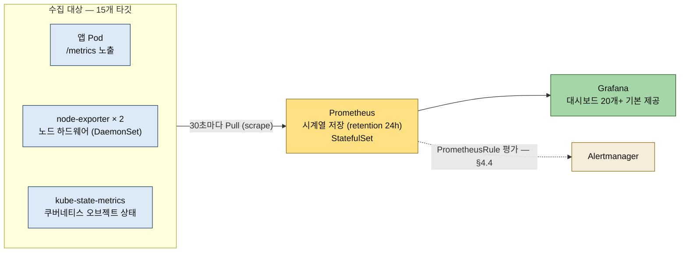

# 관측 가능성과 메트릭 — 프로메테우스·그라파나
---
> **관측 가능성이 메트릭·로그·트레이스 3요소로 이루어지고 4장이 그중 메트릭·로그에 알림을 더한다는 지도를 그릴 수 있고, 프로메테우스의 Pull 수집·PromQL·ServiceMonitor와 kube-prometheus-stack 한 차트로 5종이 설치되는 구조를 설명할 수 있으며, e2-medium 노드에 맞춰 Helm values로 리소스를 줄여 설치하고 15개 타깃 수집을 확인하는 흐름까지 답할 수 있다.**


## 📌 핵심 요약

> "Pod는 Running인데 서비스가 안 된다"는 새벽 연락에 답하려면 데이터가 필요합니다. 4장 전반부는 그 첫 축 — 메트릭 수집(프로메테우스)과 시각화(그라파나) — 를 Helm 차트 하나로 세웁니다.

3장에서 GitOps와 CI/CD 파이프라인을 완성했지만 서비스가 지금 잘 돌아가고 있는지 알 수 없습니다. 어느 날 새벽 '서비스가 안 됩니다'라는 연락이 오면 — Pod는 Running인데 CPU가 100%인지, 메모리가 부족한지, 어디서 에러가 나는지 아무것도 모릅니다. 4장은 클로드 코드에게 '모니터링 구축해줘'라고 말하는 것에서 시작해 메트릭·로그·알림을 한 번에 구축합니다.




## 🎯 학습 목표

> 이 절을 읽고 나면 다음 세 가지를 할 수 있습니다.

1. 관측 가능성 3요소(메트릭·로그·트레이스)가 각각 어떤 질문에 답하는 데이터인지 구분할 수 있습니다.
2. Push와 Pull 수집의 차이, node-exporter와 kube-state-metrics의 역할 분담, Prometheus가 StatefulSet인 이유를 설명할 수 있습니다.
3. kube-prometheus-stack을 values 파일로 리소스를 줄여 설치하고, targets API와 PromQL로 수집을 검증할 수 있습니다.


## 📖 본문 정리

> §4.1 개념 → §4.2 도구 선택·설치·확인 순서로 정리합니다.

### 1. 관측 가능성이란 (§4.1)

> 메트릭은 '무엇이 잘못됐는지', 로그는 '왜 잘못됐는지', 트레이스는 '어디서 느려졌는지'에 답하는 데이터입니다.

관측 가능성(observability)은 세 요소로 이루어집니다.

- 메트릭(metrics)은 숫자입니다 — 'CPU 90%, 초당 요청 500개, 에러율 2%'. 지금 상태가 정상인지 비정상인지 판단하는 데이터입니다.
- 로그(logs)는 텍스트입니다 — 'connection refused at line 42, timeout after 30s'. 무엇이 잘못되었는지 원인을 찾는 데이터입니다.
- 트레이스(traces)는 흐름입니다 — 하나의 요청이 어떤 서비스를 거쳐 어디서 느려졌는지를 추적하는 데이터입니다.

4장에서는 메트릭과 로그를 구축하고 여기에 알림(alerting)을 더합니다. 트레이스는 서비스 간 호출이 생기는 8장에서 추가합니다. 책은 노트로 네 번째 요소인 프로파일(profiles)도 소개합니다 — CPU·메모리를 어떤 함수가 얼마나 쓰는지 코드 수준에서 보여주는 축으로 Pyroscope가 대표적이며, 책에서는 다루지 않지만 성능 병목을 깊이 파고들 때 유용합니다.

### 2. 도구 선택 — 프로메테우스 + 그라파나 (§4.2.1~§4.2.2)

> Pull 수집·PromQL·ServiceMonitor가 프로메테우스의 세 기둥이고, kube-prometheus-stack 한 차트가 5종을 한 번에 설치합니다.

"클러스터에서 뭐가 돌아가고 있는지 어떻게 알 수 있어?"라고 물으면 클로드 코드가 Prometheus + Grafana를 추천합니다. Prometheus가 하는 일은 세 가지입니다 — Pull 기반 수집(30초마다 각 Pod의 `/metrics` 엔드포인트 조회), PromQL(시계열 데이터 전용 쿼리 언어 — `rate(http_requests_total[5m])`이면 최근 5분간 초당 요청 수), ServiceMonitor CRD(어떤 Service를 scrape할지 선언적으로 정의). Grafana는 그 데이터를 대시보드로 시각화하고, 나중에 Loki(로그)·Tempo(트레이스)도 같은 화면에서 통합 확인합니다. kube-prometheus-stack Helm 차트를 쓰면 Prometheus·Grafana·Alertmanager·node-exporter·kube-state-metrics가 한 번에 설치되며, 쿠버네티스 모니터링의 사실상 표준입니다.

Push vs Pull의 차이가 첫 관문입니다. Push는 각 앱이 모니터링 서버에 데이터를 보내는 방식이라 앱마다 전송 코드를 넣어야 하고 서버가 죽으면 데이터가 유실됩니다. Pull은 반대로 Prometheus가 30초마다 '너 지금 어때?'라고 각 Pod에 묻는 방식이라, 앱은 `/metrics` 엔드포인트에 현재 상태만 노출하면 됩니다. 대상이 능동적으로 보낼 필요가 없고, 새 Pod가 뜨면 자동으로 발견해 수집을 시작하며, 모니터링 서버 장애가 앱에 영향을 주지 않습니다.

수집기 두 종의 역할 분담도 짚어 둡니다 — node-exporter는 노드(VM) 수준(CPU·메모리·디스크 I/O)을 담당하며 DaemonSet(모든 노드에 정확히 1개씩 — Deployment가 '아무 노드에나 N개'라면 DaemonSet은 '모든 노드에 1개씩')으로 배포되고, kube-state-metrics는 쿠버네티스 API의 오브젝트 상태('Pod가 몇 개야?', 'replica 3인데 실제 3개 떠 있어?', '이 Pod는 왜 Pending이야?')를 숫자로 변환합니다. 즉 node-exporter → 하드웨어("이 노드 CPU가 90%야"), kube-state-metrics → 쿠버네티스("이 Pod가 CrashLoopBackOff야"), Prometheus → 둘을 수집·저장, Grafana → 시각화입니다.

대안 비교에서는 Notiflex 환경(e2-medium×2, 4GB) 판단이 결정적입니다.

| 구분 | Prometheus + Grafana | Datadog | Google Cloud Monitoring | CloudWatch |
|------|---------------------|---------|------------------------|------------|
| 추천도 | ★★★ | ★★ | ★★ | ★ |
| 비용 | 무료 | 호스트당 $15+/월 | 무료 티어(제한적) | AWS 전용 |
| 설치 | Helm 차트 한 줄 | 에이전트 설치 | GKE 자동 통합 | GKE 불편 |
| 커스텀 대시보드 | 무제한(Grafana) | 무제한 | 제한적 | 제한적 |
| 통합 | Loki·Tempo 연결 | 자체 APM 포함 | GCP 제한 | AWS 제한 |

학습 환경에서 SaaS 비용을 쓸 이유가 없고(Prometheus는 CPU 100m·Memory 256Mi면 충분), 더 중요한 근거는 통합성입니다 — 4.3에서 Loki를 추가하면 Grafana에서 로그를, 8.2에서 Tempo를 추가하면 트레이스를 같은 대시보드에서 봅니다. 장기 저장이 필요해지면 Thanos나 Cortex를 Prometheus 앞에 두고 오브젝트 스토리지(S3·GCS)에 백업하는 구조로 확장하되, 지금은 24시간 retention으로 충분합니다.

### 3. 설치 — Helm values로 리소스 다이어트 (§4.2.3)

> 기본값은 프로덕션용으로 넉넉하게 잡혀 있어, e2-medium 노드에 맞게 values 파일로 CPU·메모리를 줄여 설치합니다.

values 파일은 Helm 설치 시 기본값을 덮어쓰는 설정 파일입니다. 책이 작성한 `helm-values/kube-prometheus.yaml`은 컴포넌트별 requests를 낮춥니다:

```yaml
# helm-values/kube-prometheus.yaml — 책 §4.2.3 실습본
prometheus:
  prometheusSpec:
    resources:
      requests:
        cpu: 100m
        memory: 256Mi
    retention: 24h        # 24시간 지난 메트릭은 자동 삭제 — 디스크 절약
    storageSpec: {}
grafana:
  resources:
    requests:
      cpu: 50m
      memory: 128Mi
  adminPassword: notiflex-grafana
alertmanager:
  alertmanagerSpec:
    resources:
      requests:
        cpu: 25m
        memory: 64Mi
prometheusOperator:
  resources:
    requests:
      cpu: 25m
      memory: 64Mi
kubeStateMetrics:
  resources:
    requests:
      cpu: 10m
      memory: 32Mi
nodeExporter:
  resources:
    requests:
      cpu: 10m
      memory: 32Mi
```

retention 24h는 학습용 디스크 절약 설정이고 프로덕션은 보통 15~30일, 그 이상은 Thanos를 씁니다. "Helm이 왜 필요해? kubectl apply -f로는 안 돼?"라는 질문에 대한 답이 이 절의 백미입니다 — 할 수는 있지만 kube-prometheus-stack은 50개가 넘는 리소스(CRD·Deployment·Service·ConfigMap·ServiceMonitor·PrometheusRule)에 YAML 수천 줄이라, 'Prometheus 메모리를 256Mi로 바꾸고 싶다'는 한 줄 요구를 수천 줄 사이에서 정확히 찾아 수정하는 것은 유지보수가 사실상 불가능합니다. Helm은 복잡한 YAML 묶음을 차트(chart)라는 패키지로 만들고 사용자가 건드리고 싶은 값만 values 파일로 덮어쓰므로, `helm install ... -f my-values.yaml` 한 줄로 끝납니다.

설치는 네 명령입니다:

```bash
# monitoring 네임스페이스에 kube-prometheus-stack 설치 — 책 §4.2.3
kubectl create namespace monitoring
helm repo add prometheus-community https://prometheus-community.github.io/helm-charts
helm repo update
helm install kube-prometheus prometheus-community/kube-prometheus-stack \
    -n monitoring -f helm-values/kube-prometheus.yaml
```

60초 뒤 Pod 7개가 모두 Running입니다 — `prometheus-...-prometheus-0`(수집 엔진), `grafana`(대시보드 UI), `alertmanager-...-0`(알림 라우팅, 4.4에서 설정), `kube-prome-operator`(PrometheusRule·ServiceMonitor CRD 관리), `kube-state-metrics`, `node-exporter`×2(DaemonSet — 노드 2개에 각 1개). Prometheus가 StatefulSet인 이유도 여기서 나옵니다 — Deployment는 Pod 이름이 랜덤이고 죽으면 새 이름으로 생기지만, StatefulSet은 고정 이름(prometheus-0)에 고정 저장소(PVC)가 연결됩니다. 수집한 메트릭을 디스크에 저장하므로 재시작에도 데이터가 날아가면 안 되기 때문입니다.

### 4. 그라파나 접속과 메트릭 확인 (§4.2.4~§4.2.5)

> 대시보드는 이미 20개 이상 만들어져 있고, 뒤에서 Prometheus가 15개 타깃을 수집 중인 것을 API로 확인합니다.

`kubectl port-forward svc/kube-prometheus-grafana -n monitoring 3000:80 &` 후 `http://localhost:3000`에 admin / notiflex-grafana(values에서 설정한 값)로 로그인하면, kube-prometheus-stack이 설치 시 자동으로 만든 기본 대시보드가 20개 이상 들어 있습니다 — Kubernetes/Compute Resources/Cluster(클러스터 전체 CPU·메모리), Kubernetes/Compute Resources/Namespace(Pods), Node Exporter/Nodes(노드별 시스템 메트릭) 등 대부분의 K8s 모니터링 시나리오를 이미 커버합니다.

Prometheus 쪽 검증은 API로 합니다 — `port-forward svc/prometheus-operated 9090:9090` 후 `curl .../api/v1/targets | jq '.data.activeTargets | length'`가 15, `query?query=up`의 결과도 15로, 15개 타깃 모두 정상 scrape 중입니다. 수집된 데이터는 PromQL로 조회합니다. Grafana 대시보드의 그래프도 내부적으로는 이 PromQL을 실행한 결과입니다.

- `rate(container_cpu_usage_seconds_total{namespace="notiflex"}[5m])` — Notiflex Pod의 초당 CPU 사용률
- `container_memory_working_set_bytes{namespace="notiflex"}` — 메모리 사용량
- `kube_pod_status_phase{namespace="notiflex"}` — Pod 상태

마무리로 `helm-values/kube-prometheus.yaml`을 커밋합니다("feat: add Prometheus + Grafana monitoring stack"). monitoring 네임스페이스가 새로 생겨 Prometheus(30초 간격 수집)·Grafana·Alertmanager(4.4 예정)·kube-state-metrics·node-exporter×2가 argocd·notiflex 네임스페이스와 나란히 서게 됐습니다.


## 🔍 심화 학습

> 3요소 프레임의 원전과 Operator 패턴의 의미를 보강합니다. 책 밖 조사 내용입니다.

### "3 pillars"의 원전 — Peter Bourgon (2017)

메트릭·로그·트레이스 3요소 프레임은 Peter Bourgon이 2017년 2월 블로그 글 "Metrics, tracing, and logging"에서 정리해 업계 표준 어휘가 된 것입니다. 원전의 구분 기준이 책 설명보다 한 층 정밀합니다 — 메트릭은 집계 가능(aggregatable)한 원자 데이터, 로그는 이산 이벤트(discrete events), 트레이스는 요청 범위(request-scoped) 데이터라는 속성으로 가릅니다. '숫자/텍스트/흐름'이라는 책의 직관적 구분을 면접에서 한 단계 깊게 말하고 싶을 때 이 속성 축을 쓰면 됩니다. 모니터링과 관측 가능성의 개념 구분, Golden Signals·RED·USE 같은 시그널 모델은 이 저장소의 [06_observability 01-01 모니터링](../../../../06_observability/01_Foundations/01-01.모니터링.md)과 [01-03 시그널 모델](../../../../06_observability/01_Foundations/01-03.시그널%20모델%20—%20Golden%20Signals,%20RED,%20USE.md)이 정본이므로 그쪽으로 위임합니다.

### Prometheus Operator — 모니터링 설정도 선언형으로

kube-prometheus-stack의 실체는 Prometheus Operator입니다. Prometheus 원본은 scrape 대상을 자체 설정 파일(prometheus.yml)로 관리하는데, Operator는 그 설정을 ServiceMonitor·PrometheusRule 같은 쿠버네티스 CRD로 끌어올립니다. 그 덕분에 '무엇을 수집할지'와 '무엇을 경보할지'가 YAML 리소스가 되어 깃에 커밋되고 ArgoCD가 관리할 수 있게 됩니다 — 3장에서 만든 GitOps 체계에 모니터링 설정이 자연스럽게 올라타는 구조입니다. 4.4의 PrometheusRule이 바로 이 메커니즘 위에 서 있습니다.

### 차트 하나에 5종이 묶인 이유

kube-prometheus-stack 차트는 Prometheus Operator + Prometheus + Alertmanager + Grafana + 수집기(node-exporter·kube-state-metrics)에 기본 대시보드·알림 규칙 세트까지 포함한 배포판입니다. 컴포넌트를 따로 깔면 서로 연결(데이터소스 등록·룰 발견 라벨)을 수동으로 맞춰야 하는데, 차트가 그 배선을 다 해 둔 것입니다 — 4.4에서 만날 `release: kube-prometheus` 라벨 규칙이 그 배선의 한 예입니다. 공식 차트 저장소는 [prometheus-community/helm-charts](https://github.com/prometheus-community/helm-charts/tree/main/charts/kube-prometheus-stack)입니다.


## 💡 실무 적용 포인트

> 도구 선택 논리와 리소스 다이어트 패턴은 소규모 클러스터 모니터링 구축의 표준 경로입니다.

### 이런 상황에서 사용하세요

- 소규모 팀이 모니터링 스택을 고를 때 — 비용·설치·커스텀·통합 4축 비교표와 "통합성이 더 중요"라는 논리가 판단 틀이 됩니다.
- 작은 노드에 모니터링을 올릴 때 — 컴포넌트별 requests 다이어트 values가 시작점 템플릿이 됩니다.
- "Pod는 Running인데 왜 안 되지"를 진단할 때 — node-exporter(하드웨어)와 kube-state-metrics(오브젝트 상태)의 역할 구분이 어느 메트릭을 볼지 정해 줍니다.

### 주의할 점

- ⚠️ retention 24h는 학습용 설정입니다 — 장애 회고는 며칠 뒤에 하게 되므로 프로덕션은 15~30일 + 장기 보관은 Thanos 계열로 잡아야 합니다.
- ⚠️ adminPassword를 values 파일에 평문으로 두는 것도 학습용 타협입니다 — 이 파일이 깃에 커밋되므로 실무라면 Secret 참조로 바꿔야 합니다.
- ⚠️ Helm 설치분은 ArgoCD 관리 밖입니다 — 이 장 시점에서는 helm install이 직접 실행이므로, 클러스터 재생성 시 values 파일이 깃에 있다는 것이 복구의 근거가 됩니다.


## ✅ 핵심 개념 체크리스트

- [ ] 관측 가능성 3요소가 각각 어떤 질문에 답하는지 예시 문장과 함께 말할 수 있는가?
- [ ] Pull 수집의 세 가지 장점을 Push와 대비해 설명할 수 있는가?
- [ ] node-exporter와 kube-state-metrics의 역할 차이, 그리고 둘 다 왜 그 배포 형태(DaemonSet/Deployment)인지 답할 수 있는가?
- [ ] Prometheus가 StatefulSet인 이유를 말할 수 있는가?
- [ ] Helm values 파일이 해결하는 두 문제(규모·커스터마이즈)를 설명할 수 있는가?


## 면접 관점 정리

> "모니터링을 어떻게 구축했나"에는 3요소 지도 → 도구 선택 근거 → 검증 방법 순서로 답하면 됩니다.

| 질문 | 핵심 | 한 줄 답 |
|------|------|---------|
| 관측 가능성이란 | 3요소 | 메트릭(무엇이 잘못됐나)·로그(왜)·트레이스(어디서) — 4장은 앞의 둘 + 알림 |
| 왜 Prometheus인가 | Pull + 통합성 | 앱은 /metrics만 노출하면 자동 발견·수집되고, Grafana 하나에서 로그·트레이스까지 통합된다 |
| 설치를 어떻게 검증하나 | targets + PromQL | targets API로 scrape 대상 15개를 확인하고, PromQL로 실데이터를 조회한다 |

메트릭은 '에러가 발생했다'까지만 알려 줍니다. '어떤 에러인지'는 로그에서 찾아야 합니다 — 다음 절 [04-02 로그와 알림](./04-02.로그와%20알림%20—%20Loki·Fluent%20Bit·PrometheusRule.md)이 그 축을 세웁니다.


## 🔗 참고 자료

- 3 pillars 원전: [Peter Bourgon — Metrics, tracing, and logging (2017)](https://peter.bourgon.org/blog/2017/02/21/metrics-tracing-and-logging.html)
- Prometheus 공식 문서: [prometheus.io — Overview](https://prometheus.io/docs/introduction/overview/)
- kube-prometheus-stack 차트: [prometheus-community/helm-charts](https://github.com/prometheus-community/helm-charts/tree/main/charts/kube-prometheus-stack)
- 저자 values 실물: [notiflex-platform/helm-values/kube-prometheus.yaml](https://github.com/sysnet4admin/notiflex-platform/blob/main/helm-values/kube-prometheus.yaml)
- 모니터링 개념·시그널 모델 정본: [06_observability 01-01 모니터링](../../../../06_observability/01_Foundations/01-01.모니터링.md) · [01-03 시그널 모델](../../../../06_observability/01_Foundations/01-03.시그널%20모델%20—%20Golden%20Signals,%20RED,%20USE.md)
- 다음 절 정독 노트: [04-02 로그와 알림](./04-02.로그와%20알림%20—%20Loki·Fluent%20Bit·PrometheusRule.md)
