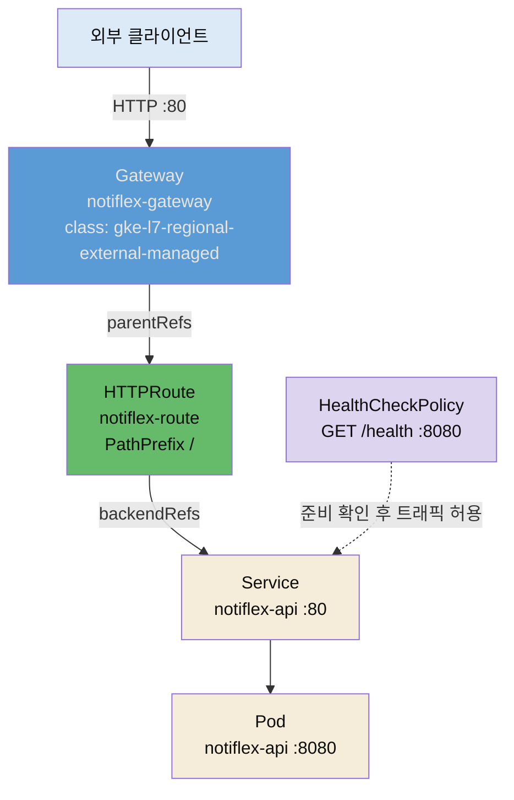

# Rolling Update의 한계와 Gateway API


## 📌 핵심 요약

3장에서 도입한 Rolling Update는 Pod를 한 개씩 교체하며 배포합니다. 무중단처럼 보이지만 실제로는 두 가지 빈틈이 남습니다. 하나는 교체 순간 이전 버전과 새 버전이 동시에 트래픽을 받아 응답이 섞이는 구간이고, 다른 하나는 새 Pod가 준비되기 전에 트래픽이 흘러들어 순간적으로 오류가 나는 구간입니다. 5장은 이 빈틈을 메우기 위해 트래픽을 세밀하게 제어할 수단부터 마련합니다. 그 수단이 **Gateway API**입니다.

Gateway API는 쿠버네티스의 표준 트래픽 진입 API로, 낡은 Ingress를 대체하는 후속 규격입니다. Ingress가 하나의 오브젝트에 인프라 설정과 라우팅 규칙을 뭉뚱그렸다면, Gateway API는 이를 **GatewayClass(인프라 제공자) → Gateway(플랫폼 운영자) → HTTPRoute(앱 개발자)** 세 계층으로 분리합니다. Notiflex는 GKE가 관리하는 `gke-l7-regional-external-managed` 클래스를 써서 별도 Ingress 컨트롤러 설치 없이 Google 관리형 L7 로드밸런서를 얻습니다. 여기에 `HealthCheckPolicy`로 헬스체크 경로(`/health`)와 포트(8080)를 명시해, 준비되지 않은 Pod로 트래픽이 새는 두 번째 빈틈을 막습니다.


## 🎯 학습 목표

이 노트를 다 읽으면 다음을 설명할 수 있습니다.

- Rolling Update가 "무중단"이라 불리면서도 남기는 두 가지 빈틈이 무엇인지 말할 수 있습니다.
- Ingress와 Gateway API의 근본 차이를 역할 분리(role-oriented) 관점에서 설명할 수 있습니다.
- GatewayClass·Gateway·HTTPRoute가 각각 누구의 책임이고 무엇을 선언하는지 구분할 수 있습니다.
- GKE에서 `HealthCheckPolicy`가 왜 필요하며 어떤 실패를 예방하는지 설명할 수 있습니다.


## 📖 본문 정리

### Rolling Update는 왜 서비스가 끊기는가

Rolling Update는 `maxSurge`(잠시 늘려도 되는 Pod 수)와 `maxUnavailable`(잠시 줄여도 되는 Pod 수) 만큼 Pod를 조금씩 교체합니다. Deployment 기본 전략이라 별도 설정 없이 동작하고, 겉보기에는 서비스가 계속 살아 있으니 무중단으로 느껴집니다. 그런데 교체가 진행되는 동안 클러스터에는 이전 버전 Pod와 새 버전 Pod가 **동시에** 존재합니다. 이때 두 가지 문제가 생깁니다.

- **버전 혼재**: 같은 사용자가 연속으로 요청을 보내도 한 번은 v1, 다음은 v2 Pod로 라우팅될 수 있습니다. API 응답 형식이 바뀌었다면 클라이언트가 깨집니다. Rolling Update에는 "전부 v1이거나 전부 v2" 같은 원자적 전환 개념이 없습니다.
- **준비 전 트래픽 유입**: 새 Pod가 뜨자마자 Service의 엔드포인트에 등록되면, 애플리케이션이 아직 초기화 중이어도 트래픽이 들어옵니다. `readinessProbe`가 이를 막아 주지만, 프로브 설정이 느슨하면 순간적으로 5xx가 발생합니다.

즉 Rolling Update는 "롤백은 되지만, 전환의 정밀 제어는 안 되는" 전략입니다. 5장은 이 한계를 트래픽 계층에서 먼저 손봅니다.

### 외부 트래픽 관리: Gateway API

트래픽을 세밀하게 나누려면 먼저 트래픽이 들어오는 문을 제대로 관리해야 합니다. 3~4장까지 Notiflex는 `Service`(ClusterIP/LoadBalancer)로 외부 노출을 처리했지만, 가중치 기반 분할이나 경로별 라우팅 같은 세밀한 제어에는 한계가 있습니다. 그래서 5장은 표준 트래픽 진입 규격인 Gateway API를 도입합니다.

Gateway API의 핵심은 **역할 분리**입니다. Ingress는 인프라 설정과 라우팅을 한 오브젝트에 담고, 부족한 기능은 벤더별 어노테이션으로 우회했습니다. 이 방식은 이식성이 낮고 규칙이 흩어집니다. Gateway API는 세 오브젝트로 관심사를 쪼갭니다.

- **GatewayClass**: 어떤 컨트롤러 구현을 쓸지 정의합니다. `StorageClass`가 스토리지 제공자를 고르는 것과 같은 역할입니다. Notiflex는 GKE가 제공하는 `gke-l7-regional-external-managed`를 씁니다. 이 클래스 하나로 Google 관리형 리전 L7 외부 로드밸런서가 뒤에 붙습니다.
- **Gateway**: 진입점을 인스턴스화합니다. 어떤 포트(80)와 프로토콜(HTTP)로 받을지, 어떤 네임스페이스의 라우트를 허용할지(`allowedRoutes`)를 선언합니다. 플랫폼 운영자의 책임입니다.
- **HTTPRoute**: 실제 라우팅 규칙입니다. "경로가 `/`로 시작하면 `notiflex-api` 서비스의 80 포트로 보낸다" 같은 규칙을 앱 개발자가 자기 네임스페이스에서 독립적으로 관리합니다.

Notiflex의 Gateway·HTTPRoute는 아래와 같습니다(저자 저장소 `k8s/smb/gateway.yaml` 실물).

```yaml
apiVersion: gateway.networking.k8s.io/v1
kind: Gateway
metadata:
  name: notiflex-gateway
  namespace: notiflex
spec:
  gatewayClassName: gke-l7-regional-external-managed  # GKE 관리형 L7 LB
  listeners:
  - name: http
    port: 80
    protocol: HTTP
    allowedRoutes:
      namespaces:
        from: Same        # 같은 네임스페이스의 라우트만 허용 (경계 통제)
---
apiVersion: gateway.networking.k8s.io/v1
kind: HTTPRoute
metadata:
  name: notiflex-route
  namespace: notiflex
spec:
  parentRefs:
  - name: notiflex-gateway   # 위 Gateway에 이 라우트를 붙임
  rules:
  - matches:
    - path:
        type: PathPrefix
        value: /
    backendRefs:
    - name: notiflex-api      # /로 시작하는 요청을 이 서비스로
      port: 80
```

### HealthCheckPolicy로 준비 전 트래픽 막기

Gateway API 표준만으로는 GKE 로드밸런서가 "어떤 경로로 헬스체크를 해야 하는지"를 정확히 알 수 없습니다. 기본값은 서비스 포트로 TCP 확인만 하는 수준이라, 애플리케이션이 살아 있는지까지는 보지 못합니다. GKE는 이를 보완하려고 `HealthCheckPolicy`라는 확장 오브젝트를 제공합니다.

```yaml
apiVersion: networking.gke.io/v1
kind: HealthCheckPolicy
metadata:
  name: notiflex-healthcheck
  namespace: notiflex
spec:
  default:
    checkIntervalSec: 15
    timeoutSec: 5
    healthyThreshold: 1     # 1회 성공하면 정상으로 판단
    unhealthyThreshold: 2   # 2회 실패하면 비정상으로 격리
    config:
      type: HTTP
      httpHealthCheck:
        port: 8080          # 앱이 실제로 듣는 포트
        requestPath: /health # 앱이 정의한 헬스 엔드포인트
  targetRef:
    group: ""
    kind: Service
    name: notiflex-api      # 이 서비스의 백엔드에 정책 적용
```

`requestPath: /health`와 `port: 8080`을 직접 지정하면, 로드밸런서가 애플리케이션 레벨에서 "정말 요청을 받을 준비가 됐는지"를 확인한 뒤에야 트래픽을 흘립니다. Rolling Update의 두 번째 빈틈(준비 전 트래픽 유입)을 트래픽 계층에서 막는 장치입니다.


## 🔍 심화 학습

> 이 절은 책 본문 밖에서 조사한 배경입니다. 표준 규격의 맥락을 더 넓게 잡기 위한 보강이며, 책 원문이 아닙니다.

### Ingress는 왜 "동결"되었는가

쿠버네티스 공식은 Ingress API를 사실상 **동결(frozen)** 상태로 두고 새 기능을 추가하지 않습니다. Ingress는 HTTP/HTTPS 위주였고, 가중치 분할·헤더 매칭 같은 세밀한 제어를 표준으로 담지 못해 각 컨트롤러가 어노테이션으로 확장했습니다. 그 결과 NGINX용 어노테이션과 GKE용 어노테이션이 서로 호환되지 않는 파편화가 생겼습니다. Gateway API는 이 기능들을 **스펙 레벨**로 끌어올려, 트래픽 분할(weighted backends)·헤더 매칭·리다이렉트를 표준 필드로 제공합니다. HTTP뿐 아니라 gRPC·TCP·UDP까지 다룬다는 점도 Ingress와의 근본 차이입니다.

- 출처: [Kubernetes Gateway API 개요 (techplained)](https://www.techplained.com/kubernetes-gateway-api)
- 출처: [Ingress vs Gateway API 실무 비교 (Tigera)](https://www.tigera.io/blog/is-it-time-to-migrate-a-practical-look-at-kubernetes-ingress-vs-gateway-api/)

### 역할 분리가 조직에 주는 이점

Gateway API의 3계층 분리는 단지 오브젝트를 쪼갠 게 아니라 **조직의 책임 경계**를 코드에 반영한 설계입니다. 인프라 제공자는 GatewayClass로 컨트롤러를 정하고, 플랫폼 팀은 Gateway로 진입점·TLS·포트를 통제하며, 앱 개발자는 자기 네임스페이스의 HTTPRoute만 자유롭게 바꿉니다. 앱 팀이 라우팅을 바꾸려고 플랫폼 팀에 매번 요청할 필요가 없어집니다. `allowedRoutes`로 "어떤 네임스페이스의 라우트를 이 Gateway에 붙일 수 있는지"를 통제하므로, 권한 위임과 경계 통제를 동시에 만족합니다.

- 출처: [Ingress vs Gateway API 역할 분리 (Plural)](https://www.plural.sh/blog/kubernetes-ingress-vs-gateway-api)


## 💡 실무 적용 포인트

- **무중단이라는 말을 의심하기**: "Rolling Update니까 무중단"이라는 통념은 정확하지 않습니다. 버전 혼재와 준비 전 유입이라는 두 빈틈을 먼저 확인하고, 필요하면 트래픽 제어(Gateway) + readiness 강화 + 원자적 전환(Blue/Green)까지 함께 설계해야 합니다.
- **어노테이션 파편화에서 탈출**: 기존 Ingress를 벤더 어노테이션으로 도배해 운영 중이라면, 같은 규칙을 Gateway API 표준 필드로 옮겨 이식성을 확보할 수 있습니다. 클라우드를 옮겨도 HTTPRoute는 거의 그대로 재사용됩니다.
- **헬스체크는 애플리케이션 레벨로**: TCP 헬스체크만 걸어 두면 프로세스는 살아 있지만 요청 처리는 못 하는 상태를 못 걸러냅니다. `/health` 같은 애플리케이션 엔드포인트를 만들고 `HealthCheckPolicy`(또는 readinessProbe)로 그 경로를 확인하게 하세요.
- **네임스페이스 경계를 라우트에 반영**: `allowedRoutes.namespaces.from: Same`처럼 라우트 허용 범위를 좁혀 두면, 다른 팀이 실수로 이 Gateway에 라우트를 붙이는 사고를 예방합니다.

### 트래픽 경로 한눈에 보기




## ✅ 핵심 개념 체크리스트

- [ ] Rolling Update가 남기는 두 빈틈(버전 혼재·준비 전 유입)을 설명할 수 있습니다.
- [ ] Ingress와 Gateway API의 차이를 역할 분리·표준 필드 관점에서 말할 수 있습니다.
- [ ] GatewayClass / Gateway / HTTPRoute의 책임 주체와 선언 내용을 구분할 수 있습니다.
- [ ] `gke-l7-regional-external-managed` 클래스가 무엇을 뒤에 붙여 주는지 압니다.
- [ ] `HealthCheckPolicy`가 어떤 실패(준비 전 유입)를 막는지, 어떤 필드로 경로·포트를 지정하는지 압니다.


## 면접 관점 정리

- **"Rolling Update가 무중단 배포라는데 맞나요?"** — 부분적으로만 맞습니다. 서비스는 계속 살아 있지만, 교체 중 이전/새 버전 Pod가 공존해 응답이 섞이고(버전 혼재), readiness가 느슨하면 준비 전 Pod로 트래픽이 새어 5xx가 납니다. 원자적 전환이 필요하면 Blue/Green을, 점진적 검증이 필요하면 Canary를 씁니다.
- **"Ingress 대신 Gateway API를 쓰는 이유는?"** — Ingress는 동결 상태라 새 기능이 안 들어오고, 세밀한 제어는 벤더 어노테이션으로 우회해 파편화됩니다. Gateway API는 가중치 분할·헤더 매칭을 표준 필드로 제공하고, GatewayClass/Gateway/HTTPRoute로 인프라·플랫폼·앱의 책임을 분리해 이식성과 권한 위임을 동시에 얻습니다.
- **"GKE에서 헬스체크 경로를 어떻게 지정하나요?"** — `HealthCheckPolicy`(`networking.gke.io/v1`)의 `httpHealthCheck.requestPath`와 `port`로 애플리케이션 엔드포인트를 직접 지정합니다. TCP 확인만으로는 프로세스는 살아 있으나 요청 처리는 못 하는 상태를 못 거르므로, `/health` 같은 앱 레벨 경로를 확인하게 만듭니다.


## 🔗 참고 자료

- 저자 저장소 (완성본): [sysnet4admin/notiflex-platform · k8s/smb/gateway.yaml](https://github.com/sysnet4admin/notiflex-platform/blob/main/k8s/smb/gateway.yaml)
- 저자 저장소: [k8s/smb/healthcheckpolicy.yaml](https://github.com/sysnet4admin/notiflex-platform/blob/main/k8s/smb/healthcheckpolicy.yaml)
- 저자 저장소: [docs/architecture-decisions.md · ADR-006 Gateway API](https://github.com/sysnet4admin/notiflex-platform/blob/main/docs/architecture-decisions.md)
- [Kubernetes Gateway API 개요 (techplained)](https://www.techplained.com/kubernetes-gateway-api)
- [Ingress vs Gateway API 실무 비교 (Tigera)](https://www.tigera.io/blog/is-it-time-to-migrate-a-practical-look-at-kubernetes-ingress-vs-gateway-api/)
- [Ingress vs Gateway API 역할 분리 (Plural)](https://www.plural.sh/blog/kubernetes-ingress-vs-gateway-api)
- 형제 노트: [05-02 Blue/Green 무중단 전환과 아키텍처 결정 기록](./05-02.Blue-Green%20무중단%20전환과%20아키텍처%20결정%20기록.md)
