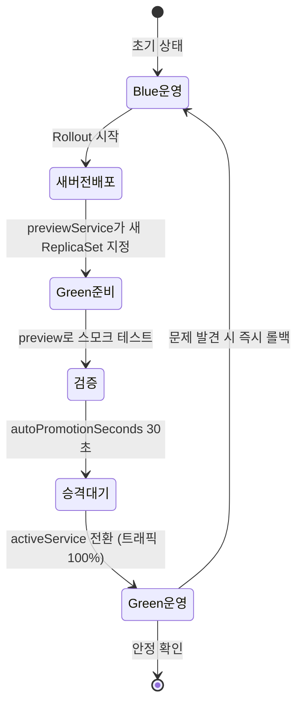

# Blue/Green 무중단 전환과 아키텍처 결정 기록


## 📌 핵심 요약

Gateway API로 트래픽 진입을 정돈했으니, 이제 배포 전략 자체를 원자적으로 바꿉니다. 5장의 무중단 전환 방식은 **Blue/Green**입니다. 같은 애플리케이션의 두 버전을 나란히 띄우고, 트래픽을 받는 쪽(active)과 검증만 받는 쪽(preview)을 분리한 뒤, 준비가 끝나면 트래픽을 **한 번에** 새 버전으로 넘깁니다. Rolling Update의 버전 혼재 문제가 사라지고, 문제가 생기면 active를 이전 버전으로 되돌리기만 하면 되니 롤백도 즉각적입니다.

Notiflex는 이 전략을 **Argo Rollouts**로 구현합니다. Deployment 대신 `Rollout` 오브젝트를 쓰고, `blueGreen` 전략에 `activeService`(운영 트래픽)와 `previewService`(검증 트래픽)를 지정합니다. `autoPromotionEnabled: true` + `autoPromotionSeconds: 30`으로 두면, 새 버전이 뜬 뒤 30초를 기다렸다가 자동으로 트래픽을 승격합니다. 5장은 여기에 더해 **왜 이 도구를 골랐는가**를 남기는 습관을 세웁니다. 그 그릇이 아키텍처 결정 기록(**ADR**, Architecture Decision Record)입니다. 도구 선택의 이유·대안·결과를 짧은 마크다운으로 깃에 함께 커밋해, 나중에 사람도 AI도 결정 근거를 되짚을 수 있게 합니다.


## 🎯 학습 목표

이 노트를 다 읽으면 다음을 설명할 수 있습니다.

- Blue/Green 배포가 Rolling Update와 무엇이 다르며 어떤 문제를 해결하는지 말할 수 있습니다.
- Argo Rollouts의 `Rollout` 오브젝트와 `activeService`/`previewService`의 역할을 구분할 수 있습니다.
- `autoPromotionEnabled`·`autoPromotionSeconds`가 승격 흐름을 어떻게 제어하는지 설명할 수 있습니다.
- ADR이 무엇이고, 도구 선택 근거를 깃에 기록하는 습관이 왜 중요한지 설명할 수 있습니다.


## 📖 본문 정리

### 무중단 전환: Blue/Green 배포

Blue/Green의 핵심은 **트래픽 전환을 원자적으로** 만드는 것입니다. 두 개의 완전한 환경(Blue=현재 운영, Green=새 버전)을 동시에 유지하다가, 스위치를 한 번에 넘기듯 트래픽 전체를 Green으로 보냅니다. 전환 전에는 Green이 운영 트래픽을 전혀 받지 않으므로, preview 서비스로 실제 배포 전에 스모크 테스트를 돌려 볼 수 있습니다. 전환 후 문제가 발견되면 다시 Blue로 스위치를 되돌리면 끝입니다.

Rolling Update와 비교하면 차이가 분명합니다.

| 구분 | Rolling Update | Blue/Green |
|------|----------------|------------|
| 전환 방식 | Pod 하나씩 점진 교체 | 트래픽 전체를 한 번에 전환 |
| 버전 혼재 | 발생 (교체 중 공존) | 없음 (active는 항상 한 버전) |
| 롤백 속도 | 역방향 롤아웃 필요 | active 서비스 스위치만 되돌림 |
| 자원 사용 | 소폭 증가(maxSurge) | 두 배(두 환경 동시 유지) |
| 사전 검증 | 어려움 | preview로 실제 트래픽 전에 검증 |

두 배의 자원을 잠시 쓴다는 비용을 감수하는 대신, 버전 혼재를 없애고 즉각 롤백을 얻는 거래입니다.

### Argo Rollouts로 구현하기

Argo Rollouts는 Deployment를 대체하는 `Rollout` CRD를 제공합니다. 스펙 대부분은 Deployment와 같고, `strategy`만 `blueGreen`(또는 `canary`)으로 바뀝니다. Blue/Green 전략의 뼈대는 아래와 같습니다(본문 예시 — 저자 완성본은 6장에서 Canary로 진화합니다).

```yaml
apiVersion: argoproj.io/v1alpha1
kind: Rollout
metadata:
  name: notiflex-api
  namespace: notiflex
spec:
  replicas: 2
  selector:
    matchLabels:
      app: notiflex-api
  template:
    # ... Pod 스펙은 Deployment와 동일 ...
  strategy:
    blueGreen:
      activeService: notiflex-api           # 운영 트래픽을 받는 서비스
      previewService: notiflex-api-preview  # 검증용 트래픽만 받는 서비스
      autoPromotionEnabled: true            # 준비되면 자동 승격
      autoPromotionSeconds: 30              # 30초 대기 후 트래픽 전환
```

`previewService`는 별도의 Service 오브젝트로, 새 ReplicaSet만 가리킵니다. 저자 저장소의 preview 서비스는 이렇게 단순합니다.

```yaml
apiVersion: v1
kind: Service
metadata:
  name: notiflex-api-preview
  namespace: notiflex
spec:
  selector:
    app: notiflex-api
  ports:
  - port: 80
    targetPort: 8080
```

배포가 시작되면 Argo Rollouts는 새 버전 ReplicaSet을 만들고 `previewService`가 그것을 가리키게 합니다. 이 시점에 `notiflex-api-preview`로 접속하면 아직 운영에 반영되지 않은 새 버전을 미리 확인할 수 있습니다. `autoPromotionSeconds: 30`이 지나면 `activeService`가 새 ReplicaSet으로 전환되고, 트래픽 전체가 새 버전으로 넘어갑니다. `autoPromotionEnabled: false`로 두면 이 승격이 멈춰 있고, `kubectl argo rollouts promote notiflex-api`로 사람이 직접 스위치를 넘겨야 합니다.

### 마무리: 아키텍처 결정 기록하기

5장의 Claude 협업 산출물은 **ADR(Architecture Decision Record)**입니다. 3장에서 ArgoCD를, 4장에서 Prometheus를, 5장에서 Gateway API와 Argo Rollouts를 골랐습니다. 이런 선택은 시간이 지나면 "왜 Flux가 아니라 ArgoCD였지?" 같은 질문으로 되돌아옵니다. 결정의 근거가 사람 머릿속에만 있으면 팀이 커질수록, 또 AI가 코드를 분석할수록 그 맥락이 사라집니다.

ADR은 결정 하나를 한두 페이지 마크다운으로 남기는 형식입니다. Notiflex는 `docs/architecture-decisions.md` 한 파일에 결정을 누적합니다. 저자 저장소의 실제 항목 두 개를 보면 형식이 분명합니다.

```markdown
## ADR-006: 외부 트래픽 — Gateway API (ch5.2)
**시점**: 2026-04 / **결정**: GKE Gateway API 채택 (vs Ingress, NGINX)
**이유**:
- GKE 네이티브 — 별도 Ingress Controller 설치 없이 관리형 L7 LB 사용
- HTTPRoute CRD — 트래픽 분할·헤더 기반 라우팅 등 세밀한 제어
- HealthCheckPolicy — /health 경로·포트를 직접 지정하여 정확한 헬스체크
- K8s 표준 API — 벤더 종속성 최소화

## ADR-007: 배포 전략 — Blue/Green (ch5.3)
**시점**: 2026-04 / **결정**: Argo Rollouts Blue/Green 채택 (vs Flagger, Istio)
**이유**:
- 즉각 롤백 — active/preview 서비스 전환으로 이전 버전 즉시 복귀
- ArgoCD 통합 — Rollout 상태를 ArgoCD UI에서 확인
- autoPromotionSeconds: 30 — 자동 승격으로 학습 환경에서 빠른 검증
- Deployment API 호환 — kubectl argo rollouts 플러그인으로 상태 확인
```

핵심은 **결정·대안·이유**를 함께 남긴다는 점입니다. "Argo Rollouts를 채택했다"만 있으면 반쪽입니다. "Flagger·Istio 대신 골랐고, 그 이유는 즉각 롤백과 ArgoCD 통합"까지 있어야 나중에 재검토할 때 판단 근거가 살아 있습니다. 이 파일이 깃에 함께 커밋되므로, 결정 이력이 코드 변경 이력과 같은 자리에서 추적됩니다.


## 🔍 심화 학습

> 이 절은 책 본문 밖에서 조사한 배경입니다. 도구·형식의 원전 맥락을 보강한 것이며, 책 원문이 아닙니다.

### ADR의 원전 — Michael Nygard(2011)

ADR은 2011년 Michael Nygard가 제안한 형식입니다. 큰 설계 문서는 아무도 안 읽어 "집단적 기억상실(collective amnesia)"에 빠진다는 문제의식에서 출발했습니다. 그래서 결정 하나당 한두 페이지짜리 작은 파일을 소스 코드 옆 버전 관리에 두자고 제안했습니다. 원본 형식은 네 부분입니다.

- **Status**: proposed / accepted / deprecated / superseded 같은 생애주기 상태
- **Context**: 결정을 부른 기술·조직·프로젝트상의 힘. 가치판단 없이 사실 위주로 적습니다.
- **Decision**: "We will…" 형태의 능동형 결정 진술
- **Consequences**: 결정이 적용된 뒤의 결과. 긍정·부정·중립을 모두 적습니다.

특히 **결정은 수정하지 않고 supersede한다**는 원칙이 중요합니다. 낡은 ADR을 지우는 대신 "superseded by ADR-N"으로 표시하고 새 기록을 추가합니다. 결정의 역사 자체가 자산이기 때문입니다. Notiflex의 `architecture-decisions.md`는 이 형식을 프로젝트에 맞게 압축한 변형입니다.

- 출처: [Documenting Architecture Decisions — Michael Nygard (2011)](https://www.cognitect.com/blog/2011/11/15/documenting-architecture-decisions)
- 출처: [Architecture Decision Record — Martin Fowler](https://martinfowler.com/bliki/ArchitectureDecisionRecord.html)

### Blue/Green과 Canary — analysis로 자동 판단

Argo Rollouts는 Blue/Green과 Canary 양쪽에서 **Analysis**를 붙일 수 있습니다. Prometheus·Datadog 같은 모니터링에서 오류율·지연 같은 지표를 실시간으로 읽어, 임계치를 넘으면 승격을 멈추거나 자동 롤백합니다. Blue/Green에서는 트래픽 전환 전에 `prePromotionAnalysis`로 Green을 검증하고, 전환 후 `postPromotionAnalysis`로 안정성을 확인하는 식으로 나눠 겁니다. Notiflex 학습 환경은 `autoPromotionSeconds`로 단순화했지만, 운영에서는 이 analysis가 무중단 배포의 안전판 역할을 합니다.

- 출처: [Argo Rollouts로 Blue/Green·Canary 자동화 (Akuity)](https://akuity.io/blog/automating-blue-green-and-canary-deployments-with-argo-rollouts)
- 출처: [Argo Rollouts Blue/Green 공식 문서](https://argo-rollouts.readthedocs.io/en/stable/features/bluegreen/)


## 💡 실무 적용 포인트

- **자원 두 배 비용을 계산하기**: Blue/Green은 전환 순간 두 환경을 동시에 유지하므로 순간 자원이 두 배로 뜁니다. 노드 오토스케일러가 이 급증을 받아낼 수 있는지, ResourceQuota에 걸리지 않는지 먼저 확인하세요.
- **preview로 실제 검증을 붙이기**: `previewService`를 만들어 두고 자동 승격 전에 스모크 테스트를 걸면, 운영 트래픽에 노출되기 전에 회귀를 잡습니다. 학습 환경이라 `autoPromotionSeconds`로 넘겼다면, 운영에서는 `autoPromotionEnabled: false` + analysis로 승격 게이트를 세우는 편이 안전합니다.
- **ADR은 결정하는 그 순간에 적기**: 나중에 몰아 쓰면 이유가 이미 휘발됩니다. 도구를 고른 그 커밋에 ADR 항목을 함께 넣으면, 결정과 근거가 같은 시점에 박제됩니다.
- **대안을 반드시 남기기**: "무엇을 골랐나"보다 "무엇 대신 골랐고 왜"가 재검토에서 더 값집니다. `vs Flagger, Istio`처럼 탈락한 후보와 그 이유를 한 줄이라도 남기세요.

### Blue/Green 전환 상태도




## ✅ 핵심 개념 체크리스트

- [ ] Blue/Green과 Rolling Update의 차이(원자적 전환·버전 혼재 없음·즉각 롤백·자원 두 배)를 말할 수 있습니다.
- [ ] `Rollout` 오브젝트가 Deployment와 무엇이 같고 무엇이 다른지 압니다.
- [ ] `activeService`와 `previewService`의 역할, `autoPromotionEnabled`/`autoPromotionSeconds`의 효과를 설명할 수 있습니다.
- [ ] ADR이 무엇이고 Status·Context·Decision·Consequences 네 부분을 압니다.
- [ ] 결정을 수정하지 않고 supersede하는 원칙과 그 이유(역사 보존)를 설명할 수 있습니다.


## 면접 관점 정리

- **"Blue/Green과 Rolling Update 중 언제 무엇을 쓰나요?"** — 버전 혼재를 절대 허용하면 안 되거나(예: API 스키마 변경) 즉각 롤백이 중요하면 Blue/Green이 낫습니다. 대신 전환 순간 자원이 두 배 필요합니다. 자원이 빠듯하고 점진적 검증이 목적이면 Canary를, 단순한 상황이면 Rolling Update를 씁니다.
- **"Argo Rollouts의 previewService는 왜 필요한가요?"** — active가 운영 트래픽을 받는 동안 preview는 새 버전만 가리켜, 트래픽 전환 전에 스모크 테스트나 자동 analysis로 새 버전을 검증할 수 있게 합니다. 검증을 통과해야만 승격되므로 운영 노출 전에 회귀를 잡습니다.
- **"ADR을 왜 쓰나요? 그냥 코드 주석이면 안 되나요?"** — 주석은 "무엇을 하는가"는 담지만 "왜 이 대안을 골랐는가"는 담기 어렵고 흩어집니다. ADR은 결정·대안·이유·결과를 한 파일에 누적해 깃으로 추적하고, 낡은 결정은 지우지 않고 supersede해 결정의 역사 자체를 자산으로 보존합니다. 팀이 커지거나 AI가 코드를 분석할 때 이 맥락이 살아 있는지가 유지보수성을 좌우합니다.


## 🔗 참고 자료

- 저자 저장소: [sysnet4admin/notiflex-platform · docs/architecture-decisions.md](https://github.com/sysnet4admin/notiflex-platform/blob/main/docs/architecture-decisions.md)
- 저자 저장소: [k8s/smb/service-preview.yaml](https://github.com/sysnet4admin/notiflex-platform/blob/main/k8s/smb/service-preview.yaml)
- 저자 저장소: [k8s/smb/rollout.yaml](https://github.com/sysnet4admin/notiflex-platform/blob/main/k8s/smb/rollout.yaml)
- [Documenting Architecture Decisions — Michael Nygard (2011)](https://www.cognitect.com/blog/2011/11/15/documenting-architecture-decisions)
- [Architecture Decision Record — Martin Fowler](https://martinfowler.com/bliki/ArchitectureDecisionRecord.html)
- [Argo Rollouts Blue/Green 공식 문서](https://argo-rollouts.readthedocs.io/en/stable/features/bluegreen/)
- [Argo Rollouts로 Blue/Green·Canary 자동화 (Akuity)](https://akuity.io/blog/automating-blue-green-and-canary-deployments-with-argo-rollouts)
- 형제 노트: [05-01 Rolling Update의 한계와 Gateway API](./05-01.Rolling%20Update의%20한계와%20Gateway%20API.md) · [06-02 점진적 배포 Canary와 claude-context](./06-02.점진적%20배포%20Canary와%20claude-context.md)
