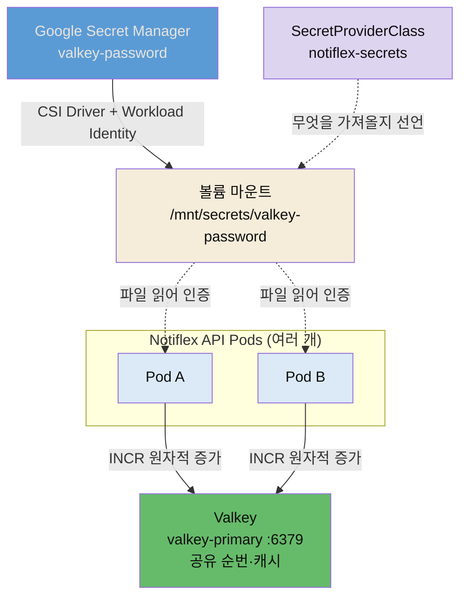

# Valkey 캐시와 Google Secret Manager


## 📌 핵심 요약

6장은 Notiflex를 엔터프라이즈 수준으로 끌어올리는 기반을 놓습니다. 그 첫 두 조각이 **상태 공유**와 **시크릿 관리**입니다.

Pod가 여러 개로 늘어나면 새로운 문제가 생깁니다. 각 Pod가 메모리에 상태를 들고 있으면, 같은 사용자의 요청이 다른 Pod로 갈 때마다 상태가 어긋납니다. 예를 들어 순번(sequence)을 Pod마다 따로 세면 중복이나 누락이 생깁니다. 해법은 상태를 Pod 밖 **공유 저장소**로 빼는 것입니다. Notiflex는 이 저장소로 **Valkey**를 씁니다. Redis가 2024년 라이선스를 바꾸자 Linux Foundation이 마지막 BSD 버전에서 포크한 오픈소스로, Redis와 프로토콜이 호환됩니다. Pod들은 Valkey의 `INCR` 명령으로 원자적 증가 카운터를 공유해 분산 환경에서도 일관된 순번을 얻습니다.

상태를 공유하려면 Valkey 접속 비밀번호가 필요합니다. 그런데 비밀번호를 매니페스트나 코드에 적으면 깃에 노출됩니다. 6장의 두 번째 조각은 이 시크릿을 안전하게 주입하는 방법입니다. **Google Secret Manager + CSI Driver + Workload Identity** 조합으로, 정적 키 파일 없이 Pod의 신원만으로 시크릿을 볼륨으로 마운트합니다. 비밀번호는 Secret Manager에만 있고, Pod는 `/mnt/secrets/valkey-password` 파일로 그것을 읽습니다.


## 🎯 학습 목표

이 노트를 다 읽으면 다음을 설명할 수 있습니다.

- Pod가 늘어날 때 인메모리 상태가 왜 문제가 되고, 공유 저장소가 어떻게 해결하는지 말할 수 있습니다.
- Valkey가 왜 등장했는지(Redis 라이선스 변경)와 Redis와의 관계를 설명할 수 있습니다.
- Secret Manager + CSI Driver + Workload Identity 조합이 정적 키 없이 어떻게 시크릿을 주입하는지 설명할 수 있습니다.
- `SecretProviderClass`와 Pod 볼륨 마운트가 어떻게 연결되는지 구분할 수 있습니다.


## 📖 본문 정리

### Pod 간 상태 공유: Valkey 캐시

수평 확장의 대가는 상태 분산입니다. Pod 하나일 때는 카운터를 메모리 변수로 둬도 됐지만, Pod가 둘 이상이면 각자 다른 값을 셉니다. 로드밸런서가 요청을 이 Pod, 저 Pod로 흩뿌리면 순번이 중복되거나 건너뜁니다. 세션·캐시·순번 같은 **공유되어야 할 상태**는 Pod 바깥의 한 곳에 모아야 합니다.

Notiflex는 그 한 곳으로 Valkey를 세웁니다. Valkey는 인메모리 키-값 저장소로, 여러 Pod가 같은 Valkey에 붙어 상태를 공유합니다. 분산 순번 생성에는 Valkey의 `INCR` 명령을 씁니다. `INCR`은 **원자적**이라, 여러 Pod가 동시에 호출해도 값이 겹치지 않고 하나씩 증가합니다. 애플리케이션은 Valkey 주소를 환경변수로 받습니다(저자 저장소 Rollout 발췌).

```yaml
env:
- name: POD_NAME
  valueFrom:
    fieldRef:
      fieldPath: metadata.name          # 어느 Pod가 처리했는지 관측용
- name: VALKEY_ADDR
  value: valkey-primary.notiflex.svc.cluster.local:6379  # 공유 저장소 주소
- name: VALKEY_PASSWORD_FILE
  value: /mnt/secrets/valkey-password   # 비밀번호는 파일에서 읽음
```

`VALKEY_ADDR`는 클러스터 내부 DNS로 Valkey 서비스를 가리킵니다. `POD_NAME`을 함께 주입하는 이유는, 응답에 어느 Pod가 처리했는지 실어 상태 공유가 실제로 되는지 눈으로 확인하기 위해서입니다. 여러 번 요청해도 순번이 이어지면 공유가 성공한 것입니다.

### 시크릿 관리: Google Secret Manager

`VALKEY_PASSWORD_FILE`이 파일 경로라는 점이 핵심입니다. 비밀번호를 환경변수 값으로 직접 넣지 않고, 파일에서 읽게 했습니다. 그 파일은 어디서 오는가 — Google Secret Manager입니다.

과거 방식은 서비스 계정 키(JSON 파일)를 클러스터에 넣고 그 키로 Secret Manager에 접근했습니다. 이 키 자체가 또 다른 시크릿이라, "시크릿을 지키려고 시크릿을 두는" 순환에 빠집니다. Notiflex는 **정적 키 없는** 방식을 씁니다. 세 조각이 맞물립니다.

- **Secret Manager**: 비밀번호의 진짜 보관소. 값은 여기에만 있습니다.
- **Secret Manager CSI Driver**: 시크릿을 Pod에 **볼륨**으로 마운트하는 드라이버. Pod는 시크릿을 평범한 파일처럼 읽습니다.
- **Workload Identity**: Pod의 쿠버네티스 서비스 계정(KSA)을 Google IAM 신원에 묶어, 키 파일 없이 Pod의 신원만으로 인증합니다.

무엇을 가져올지는 `SecretProviderClass`가 선언합니다(저자 저장소 `secret-provider.yaml` 실물).

```yaml
apiVersion: secrets-store.csi.x-k8s.io/v1
kind: SecretProviderClass
metadata:
  name: notiflex-secrets
  namespace: notiflex
spec:
  provider: gke                    # GKE 제공자 사용
  parameters:
    secrets: |
      - resourceName: "projects/PROJECT_ID/secrets/valkey-password/versions/latest"
        path: "valkey-password"    # 마운트될 파일 이름
```

`resourceName`은 Secret Manager의 시크릿을 가리키고, `path`는 그것이 볼륨 안에서 어떤 파일명으로 나타날지 정합니다. Pod는 이 SecretProviderClass를 CSI 볼륨으로 연결합니다.

```yaml
spec:
  template:
    spec:
      serviceAccountName: notiflex-sa   # Workload Identity에 묶인 KSA
      volumes:
      - name: secrets
        csi:
          driver: secrets-store-gke.csi.k8s.io   # 드라이버 이름 주의
          readOnly: true
          volumeAttributes:
            secretProviderClass: notiflex-secrets
      containers:
      - name: api
        volumeMounts:
        - name: secrets
          mountPath: /mnt/secrets    # 여기 아래에 valkey-password 파일이 생김
          readOnly: true
```

이제 흐름이 완성됩니다. Pod가 뜨면 CSI 드라이버가 KSA의 Workload Identity로 Secret Manager에 접근해 `valkey-password`를 가져오고, `/mnt/secrets/valkey-password` 파일로 마운트합니다. 애플리케이션은 `VALKEY_PASSWORD_FILE`이 가리키는 그 파일을 읽어 Valkey에 인증합니다. 비밀번호는 매니페스트에도, 코드에도, 깃에도 남지 않습니다.


## 🔍 심화 학습

> 이 절은 책 본문 밖에서 조사한 배경입니다. 라이선스 역사·인증 구조의 맥락 보강이며, 책 원문이 아닙니다.

### Valkey는 왜 태어났는가 — Redis 라이선스 변경

2024년 3월, Redis Ltd.는 Redis의 라이선스를 관대한 **BSD-3-Clause**에서 **SSPL + RSALv2** 이중 라이선스로 바꿨습니다(Redis 7.4부터). SSPL·RSALv2는 오픈소스 이니셔티브(OSI)가 오픈소스로 인정하지 않는 라이선스로, 클라우드 사업자가 Redis를 관리형 서비스로 제공하려면 상업 계약을 맺어야 하는 제약을 둡니다.

이에 Linux Foundation이 곧바로 **Valkey**를 띄웠습니다. 마지막 BSD 버전인 Redis 7.2.4에서 포크해 원래의 BSD-3-Clause로 개발을 이어갑니다. AWS·Google Cloud·Oracle 같은 대형 사업자들이 뒤를 받치고, Redis Ltd.가 단독 통제하던 것과 달리 Linux Foundation의 중립적 커뮤니티 거버넌스로 운영됩니다. Redis 7.2와 와이어 프로토콜·API가 호환되는 **드롭인 대체재**로 설계돼, 기존 Redis 클라이언트 코드를 그대로 쓸 수 있습니다. Notiflex가 Redis 대신 Valkey를 고른 배경에는 이 라이선스 자유가 있습니다.

- 출처: [Redis vs Valkey 포크 해설 (OneUptime)](https://oneuptime.com/blog/post/2026-03-31-redis-vs-valkey-fork-explained/view)
- 출처: [Valkey — 오픈소스 Redis 포크 (linkconfig)](https://linkconfig.com/blog/valkey-open-source-redis-fork)

### Workload Identity가 없애는 것 — 정적 키의 위험

Workload Identity의 가치는 "무엇을 없애는가"로 보면 분명합니다. 정적 서비스 계정 키(JSON)는 한 번 유출되면 무기한 유효하고, 로테이션이 수동이며, 어디에 복사됐는지 추적하기 어렵습니다. Workload Identity는 이 키 자체를 없앱니다. KSA에 IAM 역할(`roles/secretmanager.secretAccessor`)을 바인딩하면, GKE가 Pod의 신원을 Google에 증명하는 단기 토큰을 자동 발급·교체합니다. 유출될 정적 크리덴셜이 처음부터 존재하지 않으니, 키 관리라는 위험 표면 자체가 사라집니다. GKE는 클러스터 수준에서 `--workload-pool`과 Secret Manager 애드온을 켜야 이 조합이 동작합니다.

- 출처: [GKE에서 Secret Manager를 볼륨으로 마운트 (Google Cloud 문서 요약)](https://cloud.google.com/secret-manager/docs/secret-manager-managed-csi-component)


## 💡 실무 적용 포인트

- **상태를 밖으로 빼는 순간을 놓치지 않기**: Pod를 1개에서 2개로 늘리는 그 시점이 인메모리 상태를 공유 저장소로 옮겨야 하는 순간입니다. 순번·세션·캐시가 Pod 로컬 메모리에 있다면 확장 전에 먼저 외부화하세요.
- **원자성이 필요한 연산은 저장소에 위임**: 분산 순번처럼 "동시에 호출해도 겹치면 안 되는" 연산은 애플리케이션에서 락을 걸기보다 Valkey `INCR` 같은 원자적 명령에 맡기는 편이 단순하고 안전합니다.
- **시크릿은 파일 마운트로, 값 주입은 피하기**: 비밀번호를 환경변수 값(`value:`)으로 넣으면 매니페스트에 남습니다. CSI 볼륨으로 파일 마운트하고 애플리케이션이 파일을 읽게 하면, 깃에는 경로만 남고 값은 Secret Manager에만 있습니다.
- **정적 키를 만들지 않기**: 서비스 계정 키 JSON을 클러스터에 넣는 방식은 그 키가 새 위험이 됩니다. Workload Identity로 KSA를 IAM에 바인딩해 정적 크리덴셜 자체를 없애세요.
- **드라이버 이름을 정확히**: GKE에서는 `secrets-store-gke.csi.k8s.io`입니다. 오픈소스 Secrets Store CSI(`secrets-store.csi.k8s.io`)와 이름이 비슷해 혼동하기 쉬우니 매니페스트에서 확인하세요.

### 상태 공유·시크릿 주입 경로




## ✅ 핵심 개념 체크리스트

- [ ] Pod 확장 시 인메모리 상태가 왜 깨지는지, 공유 저장소가 어떻게 해결하는지 압니다.
- [ ] Valkey가 Redis 라이선스 변경(2024, BSD→SSPL)의 결과로 태어난 BSD 포크임을 압니다.
- [ ] `INCR`이 원자적이라 분산 순번에 적합한 이유를 설명할 수 있습니다.
- [ ] Secret Manager·CSI Driver·Workload Identity 세 조각의 역할을 각각 구분할 수 있습니다.
- [ ] `SecretProviderClass`의 `resourceName`/`path`와 Pod 볼륨 마운트가 어떻게 연결되는지 압니다.
- [ ] GKE CSI 드라이버 이름이 `secrets-store-gke.csi.k8s.io`임을 압니다.


## 면접 관점 정리

- **"Pod를 여러 개로 늘렸더니 순번이 중복됩니다. 왜죠?"** — 각 Pod가 순번을 자기 메모리에서 세기 때문입니다. 인메모리 상태는 Pod 간 공유되지 않으므로, 요청이 다른 Pod로 갈 때마다 값이 어긋납니다. Valkey 같은 공유 저장소로 상태를 외부화하고, `INCR` 같은 원자적 연산으로 순번을 생성하면 여러 Pod가 동시에 호출해도 겹치지 않습니다.
- **"Redis 대신 Valkey를 쓰는 이유는?"** — 2024년 Redis가 BSD에서 SSPL/RSALv2로 라이선스를 바꿔 OSI 기준 오픈소스가 아니게 됐고, 클라우드 관리형 제공에 제약이 생겼습니다. Linux Foundation이 마지막 BSD 버전에서 포크한 Valkey는 원래 BSD 라이선스를 유지하고 Redis와 프로토콜이 호환돼 드롭인 대체가 가능합니다.
- **"시크릿을 코드나 매니페스트에 안 넣고 어떻게 Pod에 전달하나요?"** — Secret Manager에 값을 두고, CSI Driver로 볼륨 마운트하며, Workload Identity로 Pod의 KSA를 IAM에 바인딩해 정적 키 없이 인증합니다. `SecretProviderClass`가 어떤 시크릿을 가져올지 선언하면, CSI 드라이버가 `/mnt/secrets/` 아래 파일로 마운트하고 애플리케이션은 그 파일을 읽습니다. 비밀번호는 Secret Manager에만 존재합니다.


## 🔗 참고 자료

- 저자 저장소: [sysnet4admin/notiflex-platform · k8s/smb/secret-provider.yaml](https://github.com/sysnet4admin/notiflex-platform/blob/main/k8s/smb/secret-provider.yaml)
- 저자 저장소: [k8s/smb/rollout.yaml (Valkey 환경변수·CSI 볼륨)](https://github.com/sysnet4admin/notiflex-platform/blob/main/k8s/smb/rollout.yaml)
- 저자 저장소: [docs/architecture-decisions.md · ADR-008 Valkey](https://github.com/sysnet4admin/notiflex-platform/blob/main/docs/architecture-decisions.md)
- [Redis vs Valkey 포크 해설 (OneUptime)](https://oneuptime.com/blog/post/2026-03-31-redis-vs-valkey-fork-explained/view)
- [Valkey — 오픈소스 Redis 포크 (linkconfig)](https://linkconfig.com/blog/valkey-open-source-redis-fork)
- [GKE Secret Manager CSI 컴포넌트 (Google Cloud)](https://cloud.google.com/secret-manager/docs/secret-manager-managed-csi-component)
- 형제 노트: [05-02 Blue/Green 무중단 전환과 아키텍처 결정 기록](./05-02.Blue-Green%20무중단%20전환과%20아키텍처%20결정%20기록.md) · [06-02 점진적 배포 Canary와 claude-context](./06-02.점진적%20배포%20Canary와%20claude-context.md)
