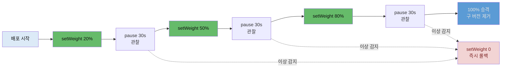

# 점진적 배포 Canary와 claude-context


## 📌 핵심 요약

6장은 배포 전략을 한 단계 더 발전시킵니다. 5장의 Blue/Green이 트래픽을 **한 번에** 전환했다면, Canary는 **조금씩** 전환합니다. 새 버전에 트래픽을 20% → 50% → 80%로 단계적으로 늘리고, 각 단계 사이에 멈춰(pause) 이상이 없는지 지켜본 뒤 다음 단계로 넘어갑니다. 문제가 초기 단계에서 드러나면 소수 사용자만 영향을 받고 즉시 되돌릴 수 있습니다. 광부가 유독가스를 먼저 감지하려고 데려간 카나리아 새에서 이름을 따왔습니다.

Notiflex는 이것도 Argo Rollouts로 구현합니다. 5장에서 쓴 `Rollout` 오브젝트의 `strategy`만 `blueGreen`에서 `canary`로 바꾸고, `steps`에 `setWeight`와 `pause`를 번갈아 나열합니다. 저자 완성본의 최종 배포 전략이 바로 이 Canary입니다.

6장의 Claude 협업 산출물은 **`claude-context/`**입니다. 3장의 `CLAUDE.md`(행동 규칙), 4장의 메모리 컨텍스트, 5장의 ADR에 이어, 이제 현재 아키텍처의 **스냅샷**을 한 페이지로 정리해 AI가 매 대화에서 시스템 전체 그림을 빠르게 잡게 합니다. 세 종류의 문서가 각자 다른 역할과 갱신 주기를 갖는 **3층 지식 구조**가 여기서 완성됩니다.


## 🎯 학습 목표

이 노트를 다 읽으면 다음을 설명할 수 있습니다.

- Canary와 Blue/Green의 차이를 트래픽 전환 방식과 위험 노출 관점에서 말할 수 있습니다.
- Argo Rollouts의 `canary` 전략에서 `setWeight`·`pause`·`steps`가 어떻게 동작하는지 설명할 수 있습니다.
- `claude-context/`가 무엇이고 `CLAUDE.md`·ADR과 어떻게 역할이 나뉘는지 구분할 수 있습니다.
- 3층 지식 구조(규칙·스냅샷·결정 이력)가 AI 협업에서 왜 유용한지 설명할 수 있습니다.


## 📖 본문 정리

### 점진적 배포: Canary

Canary의 핵심은 **위험을 소수에게 먼저 노출**하는 것입니다. 새 버전을 전체 사용자에게 한 번에 열지 않고, 먼저 20%에게만 보냅니다. 이 상태로 잠시 멈춰 오류율·지연을 지켜봅니다. 문제가 없으면 50%로, 다시 80%로 늘려 갑니다. 만약 20% 단계에서 오류가 터지면 영향받는 사용자는 5분의 1뿐이고, `setWeight: 0`으로 되돌리면 즉시 복구됩니다.

Argo Rollouts에서는 `Rollout`의 `strategy`를 `canary`로 두고 `steps`를 나열합니다(저자 저장소 `rollout.yaml` 실물 — 완성본의 최종 전략).

```yaml
  strategy:
    canary:
      canaryService: notiflex-api-preview   # 새 버전으로 가는 서비스
      stableService: notiflex-api           # 기존 안정 버전 서비스
      steps:
      - setWeight: 20            # 새 버전에 트래픽 20%
      - pause: {duration: 30s}   # 30초 관찰
      - setWeight: 50            # 50%로 증가
      - pause: {duration: 30s}   # 30초 관찰
      - setWeight: 80            # 80%로 증가
      - pause: {duration: 30s}   # 30초 관찰
      # 마지막 단계 후 100%로 승격, 구 버전 제거
```

`canaryService`와 `stableService`는 각각 새 버전과 기존 버전을 가리키는 Service입니다. 5장 Blue/Green에서 만든 `notiflex-api-preview`를 Canary에서는 `canaryService`로 재사용합니다. Argo Rollouts는 `setWeight` 값에 맞춰 두 서비스 사이의 트래픽 비율을 조정하고, `pause` 동안 멈춰 다음 지시를 기다립니다. `pause: {duration: 30s}`는 30초 뒤 자동으로 다음 단계로 넘어가고, `pause: {}`처럼 duration을 비우면 사람이 `promote`할 때까지 무한 대기합니다.

### Blue/Green과 Canary — 언제 무엇을

두 전략은 배타적이지 않고, 상황에 따라 고릅니다.

| 구분 | Blue/Green | Canary |
|------|------------|--------|
| 트래픽 전환 | 한 번에 100% | 20%→50%→80% 점진 |
| 위험 노출 | 전환 후 전체 | 초기엔 소수만 |
| 검증 방식 | preview로 전환 전 검증 | 각 단계 pause로 실사용 관찰 |
| 자원 | 두 배(두 환경) | 소폭(가중치만큼) |
| 적합한 상황 | 원자적 전환·즉각 롤백 | 점진적 신뢰 축적·실트래픽 검증 |

Blue/Green은 "전부 아니면 전무"의 깔끔한 전환이 필요할 때, Canary는 실제 트래픽으로 조금씩 신뢰를 쌓으며 위험을 줄이고 싶을 때 유리합니다. Notiflex는 6장에서 Canary를 최종 전략으로 채택합니다.

### 마무리: claude-context/

6장의 Claude 협업 산출물은 현재 아키텍처를 한 페이지로 요약한 **`claude-context/`** 디렉터리입니다. 프로젝트가 6개 장을 거치며 커지자, AI가 매 대화에서 "지금 시스템이 어떤 모습인지"를 빠르게 파악하기 어려워졌습니다. `claude-context/architecture.md`는 클러스터 토폴로지·컴포넌트·파이프라인을 한눈에 담아 이 문제를 풉니다.

여기서 **3층 지식 구조**가 완성됩니다. 각 문서는 역할과 갱신 주기가 다릅니다(저자 저장소 `claude-context/architecture.md` 실물).

| 문서 | 역할 | 갱신 주기 |
|------|------|----------|
| `CLAUDE.md` | 프로젝트 메타데이터 (GCP 프로젝트·리전·Artifact Registry) | 초기 설정 시 |
| `claude-context/` | 현재 아키텍처 스냅샷 (토폴로지·컴포넌트·파이프라인) | 챕터 완료 시 |
| `docs/architecture-decisions.md` | 결정 누적 기록 (왜 이 도구를 골랐는가) | 결정 시점마다 |

세 문서는 로드되는 시점도 다릅니다. `CLAUDE.md`는 매 대화 자동 로드, `claude-context/`는 AI가 구조를 참조 요청할 때, ADR은 사람·AI가 결정 근거를 검토할 때 봅니다. 규칙(`CLAUDE.md`)·현재 모습(`claude-context/`)·결정 역사(ADR)를 분리하면, 매번 로드되는 문서는 가볍게 유지하면서도 필요할 때 깊은 맥락을 끌어올 수 있습니다.


## 🔍 심화 학습

> 이 절은 책 본문 밖에서 조사한 배경입니다. Canary 자동화·컨텍스트 패턴의 맥락 보강이며, 책 원문이 아닙니다.

### Canary에 analysis를 붙이면 자동 판단이 된다

Notiflex의 Canary는 `pause: {duration: 30s}`로 시간만 기다립니다. 학습 환경에는 충분하지만, 운영에서는 "30초 지났으니 다음"이 아니라 "지표가 정상이니 다음"이어야 합니다. Argo Rollouts는 각 step에 **AnalysisTemplate**을 붙여 이를 자동화합니다. Prometheus에서 새 버전(canary)의 오류율·지연을 실시간으로 읽어, 임계치를 넘으면 롤아웃을 멈추거나 자동으로 `setWeight: 0`으로 되돌립니다. 사람이 대시보드를 지켜볼 필요 없이, 지표가 나쁘면 배포가 스스로 멈추는 점진적 배포(progressive delivery)가 완성됩니다.

- 출처: [Argo Rollouts로 Blue/Green·Canary 자동화 (Akuity)](https://akuity.io/blog/automating-blue-green-and-canary-deployments-with-argo-rollouts)
- 출처: [Blue/Green vs Canary 5가지 차이 (Codefresh)](https://codefresh.io/learn/software-deployment/blue-green-deployment-vs-canary-5-key-differences-and-how-to-choose/)

### claude-context는 공식 memory 패턴의 프로젝트 응용

Claude Code에는 프로젝트 컨텍스트를 파일로 두고 참조하게 하는 공식 패턴이 있습니다. `CLAUDE.md`는 매 세션 자동 주입되는 규칙·메타데이터 자리이고, 그 외의 깊은 맥락은 별도 문서로 분리해 필요할 때만 로드하는 편이 토큰 효율에 유리합니다. Notiflex의 3층 구조는 이 원리를 프로젝트에 맞춰 구체화한 것입니다. 매번 로드되는 `CLAUDE.md`는 짧게 두고, 커지는 아키텍처 그림은 `claude-context/`로, 늘어나는 결정 이력은 ADR로 빼내 각각을 필요 시점에만 참조합니다. AI에게 "매번 전부 읽히기"와 "필요할 때 깊이 읽기"를 나눈 설계입니다.

- 출처: [Claude Code memory 관리 (Anthropic 공식 문서)](https://docs.claude.com/en/docs/claude-code/memory)


## 💡 실무 적용 포인트

- **위험을 단계로 쪼개기**: 큰 변경일수록 한 번에 100%로 열지 말고, 소수 트래픽으로 먼저 실사용 반응을 봅니다. 20% 단계에서 문제가 드러나면 영향 범위가 5분의 1로 줄고 복구도 빠릅니다.
- **pause를 시간이 아니라 지표로**: 학습 환경은 `duration`으로 넘겨도 되지만, 운영에서는 AnalysisTemplate으로 오류율·지연을 게이트로 걸어 "지표가 정상일 때만 다음 단계"가 되게 하세요. 사람 감시 의존을 줄입니다.
- **preview 서비스를 두 전략에서 재사용**: Blue/Green의 `previewService`와 Canary의 `canaryService`는 같은 "새 버전을 가리키는 서비스"입니다. 전략을 바꿔도 서비스 구성은 대부분 재사용됩니다.
- **AI 컨텍스트를 3층으로 나누기**: 규칙(`CLAUDE.md`)·현재 스냅샷(`claude-context/`)·결정 이력(ADR)을 분리하면, 매번 로드되는 문서는 가볍게 유지하면서 필요할 때만 깊은 맥락을 끌어옵니다. 하나의 거대 문서에 다 넣으면 로드 비용도 크고 갱신도 어렵습니다.
- **스냅샷은 챕터·마일스톤마다 갱신**: `claude-context/`는 매 커밋이 아니라 큰 단위(챕터·기능 완료) 때 갱신하는 게 적절합니다. 너무 자주 바꾸면 유지 부담이, 너무 드물게 바꾸면 낡은 그림이 문제입니다.

### Canary 단계적 트래픽 전환




## ✅ 핵심 개념 체크리스트

- [ ] Canary와 Blue/Green의 차이(점진 전환 vs 원자적 전환, 위험 노출 범위)를 설명할 수 있습니다.
- [ ] `setWeight`·`pause`·`steps`가 Argo Rollouts Canary에서 어떻게 동작하는지 압니다.
- [ ] `canaryService`/`stableService`의 역할과 preview 서비스 재사용을 이해합니다.
- [ ] `pause: {duration}`과 `pause: {}`(무한 대기)의 차이를 압니다.
- [ ] 3층 지식 구조(`CLAUDE.md`·`claude-context/`·ADR)의 역할·갱신 주기·로드 시점을 구분할 수 있습니다.


## 면접 관점 정리

- **"Canary와 Blue/Green 중 무엇을 언제 쓰나요?"** — Blue/Green은 트래픽을 한 번에 전환해 버전 혼재가 없고 즉각 롤백되지만 전환 후 전체가 새 버전에 노출됩니다. Canary는 20%→50%→80%로 점진 전환해 초기엔 소수만 위험에 노출되므로, 실트래픽으로 신뢰를 쌓으며 위험을 줄이고 싶을 때 유리합니다. 원자적 전환이 필요하면 Blue/Green, 점진적 검증이 목적이면 Canary입니다.
- **"Canary에서 pause를 시간으로 두는 것과 지표로 두는 것의 차이는?"** — `pause: {duration: 30s}`는 시간만 기다려 지표와 무관하게 다음 단계로 넘어갑니다. AnalysisTemplate을 붙이면 Prometheus 지표(오류율·지연)를 게이트로 삼아 "정상일 때만 진행, 나쁘면 자동 롤백"이 됩니다. 후자가 사람 감시 없이 안전한 progressive delivery입니다.
- **"AI 협업용 문서를 왜 세 개로 나누나요?"** — 매 대화 자동 로드되는 `CLAUDE.md`는 규칙·메타데이터만 가볍게 담고, 커지는 아키텍처 스냅샷은 `claude-context/`로, 늘어나는 결정 이력은 ADR로 분리합니다. 하나에 다 넣으면 매번 로드 비용이 크고 갱신도 어렵지만, 역할·갱신 주기·로드 시점으로 나누면 필요할 때만 깊은 맥락을 끌어올 수 있어 효율적입니다.


## 🔗 참고 자료

- 저자 저장소: [sysnet4admin/notiflex-platform · k8s/smb/rollout.yaml (Canary 전략)](https://github.com/sysnet4admin/notiflex-platform/blob/main/k8s/smb/rollout.yaml)
- 저자 저장소: [claude-context/architecture.md (3층 지식 구조)](https://github.com/sysnet4admin/notiflex-platform/blob/main/claude-context/architecture.md)
- 저자 저장소: [docs/architecture-decisions.md](https://github.com/sysnet4admin/notiflex-platform/blob/main/docs/architecture-decisions.md)
- [Argo Rollouts로 Blue/Green·Canary 자동화 (Akuity)](https://akuity.io/blog/automating-blue-green-and-canary-deployments-with-argo-rollouts)
- [Blue/Green vs Canary 5가지 차이 (Codefresh)](https://codefresh.io/learn/software-deployment/blue-green-deployment-vs-canary-5-key-differences-and-how-to-choose/)
- [Claude Code memory 관리 (Anthropic 공식 문서)](https://docs.claude.com/en/docs/claude-code/memory)
- 형제 노트: [06-01 Valkey 캐시와 Google Secret Manager](./06-01.Valkey%20캐시와%20Google%20Secret%20Manager.md) · [05-02 Blue/Green 무중단 전환과 아키텍처 결정 기록](./05-02.Blue-Green%20무중단%20전환과%20아키텍처%20결정%20기록.md)
