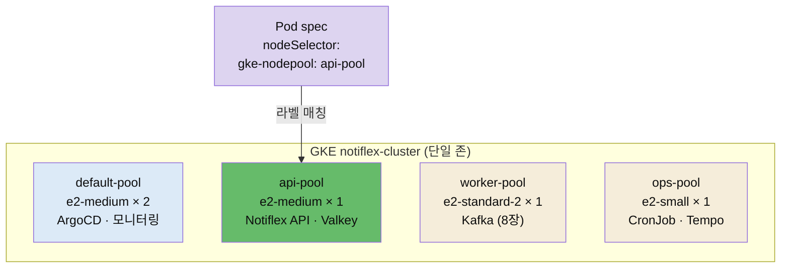

# SMB 구조의 한계와 멀티 노드풀


## 📌 핵심 요약

6장까지 Notiflex는 노드 2개(default-pool)에 모든 워크로드를 몰아넣고 돌아갔습니다. API·Valkey·Prometheus·Grafana·Loki·ArgoCD가 같은 노드풀에서 경합하고, 네임스페이스도 하나뿐입니다. 이 구조는 소규모(SMB)에는 충분하지만, 대형 고객사가 생기면 두 군데서 막힙니다. 하나는 **리소스 경합**입니다. Prometheus가 메트릭을 수집하며 CPU를 많이 쓰면 같은 노드의 API 응답이 느려집니다. 다른 하나는 **격리 불가**입니다. 고객사가 요구하는 "우리 데이터·워크로드가 다른 고객과 섞이면 안 된다"를 네임스페이스 하나로는 만족시킬 수 없습니다.

7장은 이 한계를 세 가지로 풉니다. 멀티 노드풀로 워크로드별 노드를 분리하고, App of Apps로 늘어나는 앱을 체계적으로 관리하고, 멀티테넌시로 고객별 격리 환경을 만듭니다. 이 노트는 그 첫걸음인 **멀티 노드풀**을 다룹니다. GKE에서 역할별 노드풀(API 전용·워커·운영)을 만들고, Pod의 `nodeSelector`로 어떤 노드풀에 배치할지 지정합니다. `notiflex-api`는 `api-pool`에, 8장에서 추가할 Kafka는 `worker-pool`에 배치해 서로의 자원 경합을 끊습니다.


## 🎯 학습 목표

이 노트를 다 읽으면 다음을 설명할 수 있습니다.

- 단일 노드풀 구조가 규모가 커질 때 부딪히는 두 한계(리소스 경합·격리 불가)를 말할 수 있습니다.
- 노드풀·`nodeSelector`가 무엇이고 워크로드를 특정 노드에 배치하는 원리를 설명할 수 있습니다.
- 워크로드 배치 4방식(`nodeSelector`·taint/toleration·nodeAffinity·topology spread)의 차이를 구분할 수 있습니다.
- Spot VM이 무엇이고 학습·테스트 환경에 왜 적합한지 설명할 수 있습니다.


## 📖 본문 정리

### 성장통: SMB 구조의 한계

지금까지의 구조에는 두 가지 문제가 있습니다.

- **리소스 경합**: Prometheus가 메트릭을 수집하며 CPU를 많이 쓰면, 같은 노드에 있는 Notiflex API의 응답이 느려집니다. 모니터링 때문에 서비스가 느려지는 상황입니다. 8장에서 메모리를 많이 쓰는 Kafka를 추가하면 메모리 경합까지 심해집니다.
- **격리 불가**: 대형 고객사가 요구하는 것은 "자신의 데이터가 다른 고객과 섞이지 않고, 자신의 워크로드가 다른 고객의 영향을 받지 않는 것"입니다. 네임스페이스 하나에 모든 리소스가 모여 있는 지금 구조로는 불가능합니다.

해결 방향은 두 가지입니다. 하나는 **노드풀 분리** — 역할별로 노드를 나눠 API는 API 전용 노드에서, 모니터링은 모니터링 전용 노드에서 실행합니다. 다른 하나는 **테넌트 분리** — 고객별로 네임스페이스를 나누고 리소스를 격리합니다(§7.4에서 다룹니다). 여기에 더해 ArgoCD Application이 이미 여러 개인데 테넌트와 Kafka까지 추가되면 관리가 번거로워지므로, App of Apps 패턴으로 체계를 잡습니다(§7.3).

### 워크로드별 노드 배치: 멀티 노드풀

노드풀(Node Pool)은 GKE에서 동일한 머신 타입과 설정을 가진 노드 그룹입니다. 풀별로 머신 타입·Spot 여부·라벨을 다르게 설정할 수 있습니다. Notiflex는 역할별로 4개 풀을 나눕니다.

| 노드풀 | 머신 타입 | 담당 워크로드 |
|--------|-----------|--------------|
| default-pool | e2-medium × 2 | 시스템 컴포넌트(ArgoCD·모니터링) |
| api-pool | e2-medium × 1 | Notiflex API·Valkey |
| worker-pool | e2-standard-2 × 1 | Kafka(8장에서 배치, 메모리 8GB) |
| ops-pool | e2-small × 1 | CronJob·운영 도구 |

Pod를 특정 노드풀에 배치하는 방법으로 클로드 코드는 **`nodeSelector`**를 추천합니다. GKE는 노드풀 생성 시 `cloud.google.com/gke-nodepool` 라벨을 자동으로 붙여 주므로, Pod spec에 이 라벨 한 줄만 넣으면 바로 연결됩니다. 저자 저장소의 `rollout.yaml`에 추가된 내용입니다.

```yaml
spec:
  template:
    spec:
      nodeSelector:
        cloud.google.com/gke-nodepool: api-pool  # 이 라벨을 가진 노드에만 배치
```

노드풀 생성은 `gcloud`로 합니다. Spot VM(`--spot`)과 HDD(`--disk-type=pd-standard`)를 써서 학습 비용을 아낍니다.

```bash
gcloud container node-pools create api-pool \
    --cluster=notiflex-cluster --zone=asia-northeast3-a \
    --machine-type=e2-medium --disk-type=pd-standard --disk-size=50 \
    --num-nodes=1 --spot \
    --workload-metadata=GKE_METADATA   # Workload Identity 연동
```

노드풀 3개를 추가하면 vCPU 5개가 더 필요합니다(e2-medium 2 + e2-standard-2 2 + e2-small 1). GCP 프로젝트의 기본 vCPU 쿼터는 리전당 24개이므로, 미리 `gcloud compute regions describe`로 쿼터 여유를 확인한 뒤 생성합니다. 노드풀 생성 후에는 `rollout.yaml`에 `nodeSelector`를 넣고 replicas를 2로 복원해(6장에서 리소스 부족으로 1로 줄였음) 깃에 커밋합니다. ArgoCD가 sync하면 Notiflex API Pod 2개가 모두 api-pool 노드에 배치됩니다.

### 배치 방법을 왜 nodeSelector로 골랐는가

워크로드를 특정 노드에 배치하는 방법은 네 가지가 있습니다. 각각 복잡도와 격리 강도가 다릅니다.

| 방식 | 복잡도 | 동작 | Notiflex 적합도 |
|------|--------|------|:---:|
| nodeSelector | 낮음 | "나는 api-pool에 가고 싶어"(라벨 매칭만) | 높음 |
| taint/toleration | 중간 | 노드가 "나는 특정 Pod만 받겠다"(거부 가능) | 중간 |
| nodeAffinity | 높음 | required/preferred 유연한 규칙 | 낮음 |
| topology spread | 높음 | AZ·노드 간 균등 분배 | 낮음 |

`nodeSelector`는 Pod가 "나는 api-pool에 가고 싶다"고 선언하는 방식입니다. 단순하지만 "다른 Pod도 api-pool에 올 수 있다"는 제약이 있습니다(거부는 못 함). Notiflex가 `nodeSelector`로 충분한 이유는 세 가지입니다. 단일 존 클러스터(asia-northeast3-a)만 쓰므로 topology spread가 불필요하고, 학습 환경에서 taint를 걸면 DaemonSet(Fluent Bit·CSI 등)에도 toleration을 추가해야 해 관리 복잡도가 오르며, GKE가 노드풀 라벨을 자동 부여하므로 `nodeSelector`와 바로 연결됩니다. 프로덕션에서는 `nodeSelector` + taint를 함께 써서 "다른 Pod의 배치까지 거부"하지만, 이 책은 개념을 익히는 단계라 `nodeSelector`만 씁니다.


## 🔍 심화 학습

> 이 절은 책 본문 밖에서 조사한 배경입니다. GKE 스케줄링 메커니즘의 맥락을 넓히기 위한 보강이며, 책 원문이 아닙니다.

### nodeSelector와 taint는 방향이 반대다

`nodeSelector`(와 nodeAffinity)는 **Pod가 노드를 고르는** 규칙이고, taint는 **노드가 Pod를 거부하는** 규칙입니다. 방향이 반대라 둘을 함께 써야 강한 격리가 됩니다. `nodeSelector`만 걸면 그 Pod는 원하는 노드로 가지만, toleration 없는 다른 Pod가 그 노드에 끼어드는 걸 막지 못합니다. taint를 노드에 걸면 "이 taint를 견딜(toleration) 수 있는 Pod만 받겠다"가 되어, 그 노드를 특정 워크로드 전용으로 만들 수 있습니다. GKE 공식 권고도 "엄격한 격리에는 toleration + nodeSelector를 둘 다 쓰라"입니다. Notiflex 학습 환경은 단순함을 위해 `nodeSelector`만 쓰지만, DNS 같은 시스템 워크로드를 불안정한 노드에서 떼어내야 하는 프로덕션에서는 taint가 필수입니다.

- 출처: [GKE Spot VM 스케줄링·워크로드 격리 (Google Cloud 공식)](https://docs.cloud.google.com/kubernetes-engine/docs/concepts/spot-vms)

### Spot VM — 싸지만 30초 후 회수될 수 있다

Spot VM은 GCP가 여유 용량을 60~91% 할인해 제공하는 VM입니다. 언제든 회수될 수 있어 프로덕션 핵심 워크로드에는 위험하지만, 학습·테스트 환경에는 비용 이점이 큽니다. GKE는 Spot 노드에 `cloud.google.com/gke-spot=true` 라벨을 자동으로 붙이고, 회수 시 **30초 전 종료 통지**를 보냅니다. 그래서 프로덕션에서 Spot을 쓸 때는 `terminationGracePeriodSeconds`를 두어 SIGTERM을 받고 우아하게 종료할 시간을 줍니다. Notiflex는 학습 환경이라 모든 노드풀을 Spot으로 만들어 비용을 최소화합니다.

- 출처: [GKE Spot VM 비용·회수 (Google Cloud 공식)](https://docs.cloud.google.com/kubernetes-engine/docs/concepts/spot-vms)


## 💡 실무 적용 포인트

- **경합을 노드 단위로 끊기**: "모니터링이 API를 느리게 한다" 같은 소음 이웃(noisy neighbor) 문제는 리밋만으로는 완전히 안 풀립니다. 자원을 많이 쓰는 워크로드(모니터링·메시징)를 별도 노드풀로 물리적으로 분리하면 경합의 뿌리를 끊습니다.
- **머신 타입을 역할에 맞추기**: 모든 워크로드를 같은 머신 타입에 몰면 낭비이거나 부족합니다. API는 e2-medium, 메모리 많이 쓰는 Kafka는 e2-standard-2, 가벼운 운영 도구는 e2-small처럼 역할별로 머신을 골라 비용과 성능을 맞추세요.
- **쿼터를 먼저 확인하기**: 노드풀을 여러 개 추가하면 vCPU 쿼터를 초과해 생성이 실패할 수 있습니다. `gcloud compute regions describe`로 CPU·SSD 쿼터 여유를 먼저 확인하고, HDD(pd-standard)를 쓰면 SSD 쿼터에 영향이 없습니다.
- **학습엔 nodeSelector, 프로덕션엔 +taint**: 개념을 익힐 때는 `nodeSelector` 한 줄로 충분합니다. 다른 워크로드의 침입까지 막아야 하는 프로덕션에서는 taint를 더해 노드를 전용화하세요.

### 워크로드별 노드풀 배치




## ✅ 핵심 개념 체크리스트

- [ ] 단일 노드풀의 두 한계(리소스 경합·격리 불가)를 설명할 수 있습니다.
- [ ] 노드풀과 `nodeSelector`의 관계, `cloud.google.com/gke-nodepool` 자동 라벨을 압니다.
- [ ] 배치 4방식(nodeSelector·taint/toleration·nodeAffinity·topology spread)의 차이를 말할 수 있습니다.
- [ ] `nodeSelector`와 taint의 방향이 반대이며 함께 써야 강한 격리가 되는 이유를 압니다.
- [ ] Spot VM의 이점(60~91% 할인)과 위험(30초 후 회수)을 설명할 수 있습니다.


## 면접 관점 정리

- **"한 노드에 다 올렸더니 API가 느려집니다. 왜죠?"** — 자원을 많이 쓰는 워크로드(모니터링·메시징)가 같은 노드에서 CPU·메모리를 경합하는 소음 이웃 문제입니다. 리밋으로 완화되지만 완전히는 안 풀리므로, 역할별 노드풀로 물리적으로 분리해 경합의 뿌리를 끊습니다. Pod는 `nodeSelector`로 원하는 노드풀에 배치합니다.
- **"nodeSelector와 taint/toleration은 뭐가 다른가요?"** — 방향이 반대입니다. `nodeSelector`는 Pod가 노드를 고르는 규칙이고, taint는 노드가 Pod를 거부하는 규칙입니다. `nodeSelector`만 걸면 다른 Pod가 그 노드에 끼어들 수 있으므로, 노드를 전용화하려면 taint를 더해 toleration 없는 Pod의 배치를 거부해야 합니다.
- **"Spot VM을 프로덕션에 써도 되나요?"** — 30초 전 통지 후 언제든 회수될 수 있어 핵심 워크로드에는 위험합니다. 다만 60~91% 할인이 커서 학습·테스트·재시작 가능한 워크로드에는 적합합니다. 프로덕션에서 쓴다면 `terminationGracePeriodSeconds`로 우아한 종료를 보장하고, 시스템 컴포넌트는 표준 VM 노드풀에 남겨 두는 편이 안전합니다.


## 🔗 참고 자료

- 저자 저장소: [sysnet4admin/notiflex-platform · k8s/smb/rollout.yaml (nodeSelector)](https://github.com/sysnet4admin/notiflex-platform/blob/main/k8s/smb/rollout.yaml)
- 저자 저장소: [docs/architecture-decisions.md · ADR-011 멀티 노드풀](https://github.com/sysnet4admin/notiflex-platform/blob/main/docs/architecture-decisions.md)
- [GKE Spot VM·워크로드 격리 (Google Cloud 공식)](https://docs.cloud.google.com/kubernetes-engine/docs/concepts/spot-vms)
- 형제 노트: [06-02 점진적 배포 Canary와 claude-context](./06-02.점진적%20배포%20Canary와%20claude-context.md) · [07-02 App of Apps와 멀티테넌시](./07-02.App%20of%20Apps와%20멀티테넌시.md)
