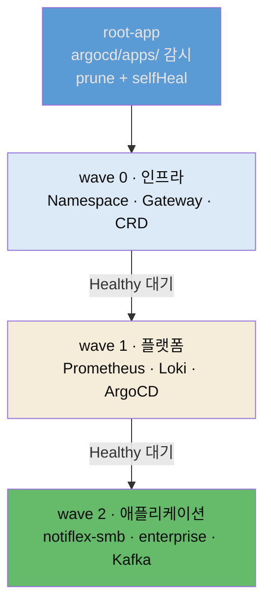

# App of Apps와 멀티테넌시


## 📌 핵심 요약

노드풀로 워크로드를 물리적으로 나눴으니, 이제 늘어나는 ArgoCD Application 자체를 체계적으로 관리하고 고객별 환경을 격리합니다. §7.3은 **App of Apps** 패턴을 도입합니다. 하나의 "루트 Application"이 `argocd/apps/` 디렉터리를 감시하고, 그 안의 개별 Application YAML을 자동으로 배포합니다. 디렉터리에 YAML을 넣으면 앱이 생기고, 삭제하면 앱이 사라집니다. 여기에 **Sync Wave**로 설치 순서를 정해, 인프라(wave 0) → 플랫폼(wave 1) → 애플리케이션(wave 2) 순으로 배포되게 합니다.

§7.4는 **멀티테넌시**를 네임스페이스 분리로 구현합니다. Notiflex는 B2B 알림 SaaS라 여러 기업 고객(테넌트)에게 서비스를 제공하는데, 대형 고객사는 "우리 데이터가 다른 고객과 섞이면 안 된다"고 요구합니다. 기존 `notiflex` 네임스페이스(SMB 고객)에 더해 `enterprise` 네임스페이스(대형 고객)를 만들고, RBAC로 격리합니다. 두 테넌트는 하나의 Valkey를 cross-namespace DNS로 공유합니다. §7.5 마무리는 `settings.local.json`으로 위험 명령을 차단·승인하는 권한 분리를 체험합니다.


## 🎯 학습 목표

이 노트를 다 읽으면 다음을 설명할 수 있습니다.

- App of Apps 패턴이 무엇이고 루트 Application이 어떻게 하위 앱을 자동 관리하는지 설명할 수 있습니다.
- Sync Wave가 배포 순서를 어떻게 제어하며 왜 필요한지 말할 수 있습니다.
- 멀티테넌시를 네임스페이스 분리로 구현하는 방법과 cross-namespace DNS를 설명할 수 있습니다.
- `settings.local.json`의 deny·ask·allow 세 권한 수준이 AI의 명령 실행을 어떻게 통제하는지 구분할 수 있습니다.


## 📖 본문 정리

### 다수 앱 관리: App of Apps 패턴

3~6장을 거치며 ArgoCD Application이 여러 개(Notiflex·모니터링·Argo Rollouts·Valkey)가 됐고, 앞으로 Kafka·테넌트까지 추가되면 하나하나 `kubectl apply`로 관리하기 어려워집니다. App of Apps는 이를 **하나의 루트 Application**으로 묶습니다. 루트 앱이 `argocd/apps/` 디렉터리를 `source`로 지정하면, ArgoCD가 그 안의 모든 Application YAML을 자동으로 생성·삭제합니다. 저자 저장소의 `root-app.yaml` 핵심입니다.

```yaml
apiVersion: argoproj.io/v1alpha1
kind: Application
metadata:
  name: root-app
  namespace: argocd
spec:
  source:
    repoURL: https://github.com/USER/notiflex-platform.git
    path: argocd/apps          # 이 디렉터리를 감시
    directory:
      recurse: true            # 하위 디렉터리까지 재귀 탐색
  syncPolicy:
    automated:
      prune: true              # 깃에서 YAML 삭제 시 앱도 삭제
      selfHeal: true           # kubectl로 직접 바꿔도 깃 상태로 복원
```

핵심은 네 필드입니다. `path: argocd/apps`는 이 디렉터리의 YAML을 모두 Application으로 적용하고, `directory.recurse: true`는 하위까지 탐색하며, `prune: true`는 깃에서 YAML을 지우면 해당 앱도 삭제하고, `selfHeal: true`는 kubectl로 직접 바꿔도 깃 상태로 되돌립니다. 이제 `argocd/apps/`에 새 YAML을 추가하는 것만으로 앱이 자동 생성됩니다.

App of Apps를 대안과 비교하면 이렇습니다.

| 패턴 | 복잡도 | 장점 | 단점 |
|------|--------|------|------|
| App of Apps | 낮음 | 직관적, 순수 YAML, 깃 디렉터리 감시 | 앱마다 개별 YAML 필요 |
| ApplicationSet | 중간 | 템플릿으로 대량 생성, 동적 환경 지원 | Go 템플릿 학습 필요 |
| 수동 관리 | 낮음 | 추가 설정 없음 | 앱 누락 가능, 일괄 관리 불가 |

`ApplicationSet`은 "같은 앱을 10개 환경에 배포"하는 시나리오에서 빛나지만, Notiflex는 단일 클러스터라 템플릿 이점이 크지 않습니다. 순수 YAML로 디버깅이 쉬운 App of Apps가 적합합니다.

### Sync Wave로 설치 순서 정하기

App of Apps가 동작해도 앱 간 설치 순서가 필요합니다. Gateway API가 있어야 HTTPRoute를 만들 수 있고, 네임스페이스가 있어야 그 안에 리소스를 배포할 수 있습니다. ArgoCD의 **Sync Wave**는 각 Application에 `argocd.argoproj.io/sync-wave` 어노테이션을 붙여, 숫자가 낮은 것부터 순서대로 배포합니다.

| Wave | 대상 | 예시 |
|------|------|------|
| 0 | 인프라 | Namespace, Gateway, CRD |
| 1 | 플랫폼 | Prometheus, Loki, ArgoCD 자체 |
| 2 | 애플리케이션 | Notiflex, Valkey, Kafka |

```yaml
metadata:
  name: monitoring
  annotations:
    argocd.argoproj.io/sync-wave: "1"   # 플랫폼 계층
```

이렇게 하면 "전체를 처음부터 다시 설치"해도 순서가 보장됩니다. 클러스터를 삭제하고 다시 만들어도, `root-app` 하나만 적용하면 인프라 → 플랫폼 → 애플리케이션 순으로 전체 환경이 복원됩니다.

### 멀티 테넌시: 네임스페이스 격리

여러 기업 고객에게 서비스를 제공하면서 서로의 데이터·리소스에 접근할 수 없도록 격리하는 것을 멀티 테넌시(Multi-tenancy)라고 합니다. Notiflex는 클로드 코드의 추천대로 **Namespace 분리 + RBAC**로 구현합니다. Kubernetes 기본 기능만으로 테넌트를 격리합니다.

- `notiflex` namespace → SMB 고객(기존)
- `enterprise` namespace → Enterprise 고객(신규)
- 두 테넌트 모두 Valkey를 공유(cross-namespace DNS)

격리 방식도 대안이 여럿입니다. vCluster(가상 클러스터)나 클러스터 분리는 격리가 강하지만 리소스·운영 비용이 큽니다. e2-medium 노드 5개 환경에서는 Namespace 분리가 적합합니다. 실제 B2B SaaS도 초기에는 Namespace 분리로 시작하고, 고객이 늘면 NetworkPolicy → ResourceQuota → vCluster 순으로 격리를 강화합니다.

enterprise 테넌트의 Rollout은 SMB와 같은 구조이되 `namespace: enterprise`, `tenant: enterprise` 라벨을 갖고, Valkey는 다른 네임스페이스의 것을 씁니다. 그래서 **cross-namespace DNS**로 접근합니다.

```yaml
env:
- name: VALKEY_ADDR
  # <service>.<namespace>.svc.cluster.local 형식으로 다른 NS의 서비스 접근
  value: valkey-primary.notiflex.svc.cluster.local:6379
- name: VALKEY_PASSWORD
  valueFrom:
    secretKeyRef:
      name: valkey-enterprise   # enterprise NS에 만든 Secret
      key: password
```

Valkey는 하나를 공유하므로 ID 카운터가 SMB와 Enterprise 사이에서 이어집니다(SMB가 1~9를 쓰면 Enterprise는 10부터). 새 대형 고객이 오면 Namespace와 매니페스트를 추가하고 깃에 Push하면, App of Apps가 자동으로 enterprise Application을 관리합니다. `ResourceQuota`를 걸면 한 테넌트가 CPU·메모리를 독점하는 노이지 네이버 문제도 막습니다.

### 마무리: settings.local.json으로 권한 분리 체험

멀티 노드풀·멀티 테넌시를 구성하면서, 잘못된 명령 하나로 다른 테넌트의 리소스가 삭제되거나 운영 중인 노드풀이 사라질 수 있는 상황이 됐습니다. 3장에서 `CLAUDE.md`에 자연어 규칙(`kubectl delete`를 직접 실행하지 마)을 넣었지만, 자연어 규칙은 클로드 코드가 참고할 뿐 강제하지는 않습니다. `.claude/settings.local.json`은 클로드 코드의 동작을 **기술적으로** 제어합니다.

```json
{
  "permissions": {
    "deny": [
      "Bash(kubectl delete *)",
      "Bash(kubectl apply *)"
    ],
    "ask": [
      "Bash(helm install *)",
      "Bash(helm upgrade *)",
      "Bash(gcloud container node-pools delete *)"
    ]
  }
}
```

권한은 세 수준입니다.

- **allow**: 승인 없이 실행(조회 명령 — `kubectl get`, `kubectl logs`)
- **ask**: 실행 전 사용자에게 확인 요청(변경·비용 명령 — `helm install`, `gcloud node-pools delete`)
- **deny**: 실행 자체를 거부(위험 명령 — `kubectl delete`, `kubectl apply`)

`kubectl apply`까지 막은 이유가 있습니다. ArgoCD가 깃 저장소를 기준으로 클러스터 상태를 관리하는데, `kubectl apply`로 직접 리소스를 만들면 ArgoCD가 모르는 리소스가 생겨 GitOps 원칙(모든 변경은 깃을 통해)이 깨지기 때문입니다. 다만 자연어 요청이 매번 같은 명령으로 매핑된다는 보장은 없으므로, 현업에서는 `settings.local.json`을 직접 편집해 deny·ask 목록을 명시적으로 확정하는 편이 안전합니다. 이 체험은 학습용이라 마무리에서 파일을 되돌립니다.


## 🔍 심화 학습

> 이 절은 책 본문 밖에서 조사한 배경입니다. ArgoCD 패턴의 공식 근거를 보강한 것이며, 책 원문이 아닙니다.

### Sync Wave는 "낮은 wave가 Healthy가 될 때까지 기다린다"

Sync Wave의 핵심은 단순한 순서가 아니라 **의존성 대기**입니다. ArgoCD는 낮은 wave의 모든 리소스가 **Healthy 상태**가 될 때까지 기다린 뒤에야 다음 wave로 넘어갑니다. 어노테이션이 없는 리소스는 기본 wave 0입니다. 그래서 "Gateway(wave 0)가 Healthy → 그 위에 HTTPRoute를 얹는 앱(wave 2) 배포" 같은 의존 순서가 보장됩니다. 루트 앱에 `resources-finalizer.argocd.argoproj.io`를 붙이면, 루트를 삭제할 때 하위 앱과 그 리소스까지 연쇄 삭제(cascading deletion)됩니다.

- 출처: [ArgoCD App of Apps·Sync Wave (Wasil Zafar)](https://www.wasilzafar.com/pages/series/distributed-systems-k8s/argocd-part03-app-of-apps-sync-waves.html)
- 출처: [ArgoCD Sync Waves 공식 문서](https://argo-cd.readthedocs.io/en/stable/user-guide/sync-waves/)

### GitOps 4원칙 — 왜 kubectl apply를 막는가

`settings.local.json`이 `kubectl apply`를 막는 건 GitOps의 근본 원칙과 맞닿아 있습니다. OpenGitOps는 네 원칙을 정의합니다 — 선언적(Declarative), 버전 관리·불변(Versioned & Immutable), 자동 풀(Pulled Automatically), 지속적 조정(Continuously Reconciled). `kubectl apply`로 클러스터를 직접 바꾸면 "깃이 단일 진실 소스"라는 선언적 원칙이 깨지고, ArgoCD의 지속적 조정(selfHeal)이 그 변경을 지우거나 반대로 관리되지 않는 고아 리소스가 남습니다. 그래서 모든 변경을 깃 → ArgoCD 경로로만 흐르게 강제하는 것이 GitOps의 일관성을 지키는 길입니다.

- 출처: [OpenGitOps 4원칙 (opengitops.dev)](https://opengitops.dev/)


## 💡 실무 적용 포인트

- **앱 목록도 깃으로 관리하기**: Application을 하나씩 `kubectl apply`하면 누락이 생기고 전체 상태 파악이 어렵습니다. App of Apps로 `argocd/apps/` 디렉터리를 단일 진실 소스로 삼으면, PR만으로 앱을 추가·삭제하고 이력을 추적할 수 있습니다.
- **의존성은 Sync Wave로 선언하기**: "A가 준비돼야 B를 설치"하는 순서를 스크립트나 수동 대기로 풀지 마세요. `sync-wave` 어노테이션으로 선언하면 ArgoCD가 낮은 wave의 Healthy를 확인한 뒤 다음으로 넘어가, 클러스터 재구축 시에도 순서가 재현됩니다.
- **테넌시는 가벼운 것부터**: 처음부터 vCluster나 클러스터 분리로 가면 비용·운영 부담이 큽니다. Namespace + RBAC로 시작하고, 필요해지면 NetworkPolicy → ResourceQuota → vCluster 순으로 격리를 강화하세요.
- **자연어 규칙 위에 기술적 강제를 얹기**: `CLAUDE.md`의 "하지 마" 규칙은 참고일 뿐 강제가 아닙니다. 정말 막아야 할 위험 명령(`kubectl delete`·`apply`)은 `settings.local.json`의 deny로, 비용·변경 명령은 ask로 기술적으로 통제하세요.

### App of Apps + Sync Wave 배포 순서




## ✅ 핵심 개념 체크리스트

- [ ] App of Apps에서 루트 Application이 `argocd/apps/`를 감시해 하위 앱을 자동 관리하는 원리를 압니다.
- [ ] `prune`·`selfHeal`·`recurse` 필드가 각각 무엇을 하는지 설명할 수 있습니다.
- [ ] Sync Wave가 낮은 wave의 Healthy를 기다린 뒤 다음으로 넘어간다는 것을 압니다.
- [ ] 멀티테넌시를 Namespace 분리로 구현하고 cross-namespace DNS로 공유 자원에 접근하는 방법을 압니다.
- [ ] `settings.local.json`의 deny·ask·allow 세 수준과 `kubectl apply`를 막는 이유(GitOps 일관성)를 압니다.


## 면접 관점 정리

- **"ArgoCD Application이 많아지면 어떻게 관리하나요?"** — App of Apps 패턴으로 루트 Application 하나가 `argocd/apps/` 디렉터리를 감시하게 합니다. 디렉터리에 YAML을 넣으면 앱이 생기고 지우면 사라지며(prune), kubectl로 직접 바꿔도 깃 상태로 복원됩니다(selfHeal). 앱 목록 자체가 깃으로 버전 관리되어 PR만으로 추가·삭제가 추적됩니다.
- **"앱 설치 순서는 어떻게 보장하나요?"** — Sync Wave 어노테이션으로 인프라(0)→플랫폼(1)→앱(2) 순서를 선언합니다. ArgoCD는 낮은 wave의 모든 리소스가 Healthy가 될 때까지 기다린 뒤 다음 wave로 넘어가므로, Gateway가 준비된 뒤 HTTPRoute를 얹는 의존 순서가 보장되고 클러스터 재구축 시에도 재현됩니다.
- **"멀티테넌시를 어떻게 구현하나요?"** — 규모에 따라 다릅니다. 소규모는 Namespace + RBAC로 논리 격리하고 cross-namespace DNS(`<svc>.<ns>.svc.cluster.local`)로 공유 자원에 접근합니다. 네트워크 격리가 필요하면 NetworkPolicy, 자원 독점을 막으려면 ResourceQuota, 완전 격리가 필요하면 vCluster나 클러스터 분리로 강화합니다. 비용·운영 부담이 커지는 순서라 초기엔 가벼운 것부터 씁니다.


## 🔗 참고 자료

- 저자 저장소: [sysnet4admin/notiflex-platform · argocd/apps/](https://github.com/sysnet4admin/notiflex-platform/tree/main/argocd/apps)
- 저자 저장소: [k8s/enterprise/ (멀티테넌시 매니페스트)](https://github.com/sysnet4admin/notiflex-platform/tree/main/k8s/enterprise)
- 저자 저장소: [docs/architecture-decisions.md · ADR-012 App of Apps · ADR-013 멀티테넌시](https://github.com/sysnet4admin/notiflex-platform/blob/main/docs/architecture-decisions.md)
- [ArgoCD App of Apps·Sync Wave (Wasil Zafar)](https://www.wasilzafar.com/pages/series/distributed-systems-k8s/argocd-part03-app-of-apps-sync-waves.html)
- [ArgoCD Sync Waves 공식 문서](https://argo-cd.readthedocs.io/en/stable/user-guide/sync-waves/)
- [OpenGitOps 4원칙 (opengitops.dev)](https://opengitops.dev/)
- 형제 노트: [07-01 SMB 구조의 한계와 멀티 노드풀](./07-01.SMB%20구조의%20한계와%20멀티%20노드풀.md) · [03-01 푸시 배포의 한계와 ArgoCD GitOps](./03-01.푸시%20배포의%20한계와%20ArgoCD%20GitOps%20—%20설치·연결·롤링·롤백.md)
