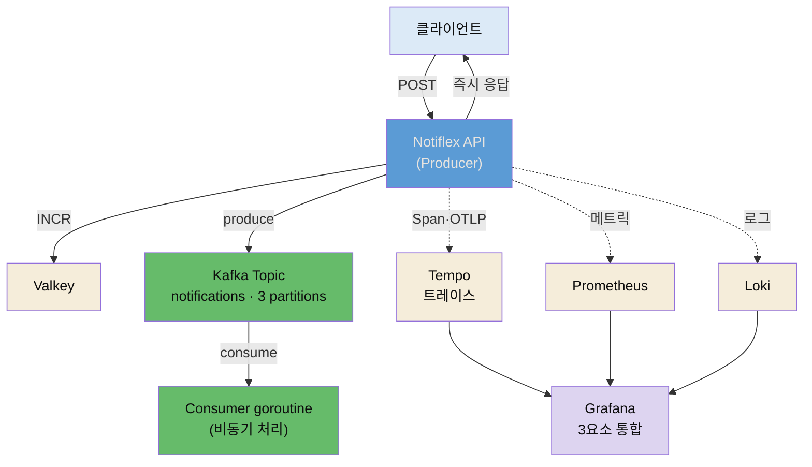

# Kafka 이벤트 드리븐과 Tempo 분산 트레이싱


## 📌 핵심 요약

8장의 제목은 "고도화"입니다. 규모를 키운 뒤(7장) 시스템을 한 단계 성숙시킵니다. 첫 두 조각이 **비동기 메시징**과 **분산 트레이싱**입니다.

지금 Notiflex는 클라이언트가 POST 요청을 보내면 API가 알림을 직접 처리하고 끝나야 응답합니다. 알림 발송이 오래 걸리면 API 응답도 느려지고, 요청이 몰리면 타임아웃이 납니다. §8.1은 **Kafka**로 요청 수신과 처리를 분리합니다. API는 메시지를 Kafka에 넣고 즉시 응답하며(Producer), 백그라운드 Consumer가 비동기로 처리합니다. Kafka는 메시지를 디스크에 저장하므로 Consumer가 죽어도 유실되지 않습니다. Strimzi Operator로 설치하고 ZooKeeper 없는 KRaft 모드로 단일 브로커를 운영합니다.

API에서 Kafka를 거쳐 Consumer로 이어지는 흐름이 생기자, 알림이 안 갔을 때 어디서 막혔는지 추적하기 어려워집니다. §8.2는 **Tempo**로 분산 트레이싱을 추가합니다. 하나의 요청이 시스템을 통과하는 전체 경로(API → Valkey → Kafka)를 추적합니다. 4장의 메트릭(Prometheus)·로그(Loki)에 트레이스(Tempo)가 더해져 **관측 가능성 3요소**가 완성됩니다. 앱은 OpenTelemetry SDK로 트레이스를 만들고 OTLP로 Tempo에 보냅니다.


## 🎯 학습 목표

이 노트를 다 읽으면 다음을 설명할 수 있습니다.

- 동기 처리와 이벤트 드리븐(비동기) 처리의 차이, Kafka가 요청 수신과 처리를 분리하는 방식을 설명할 수 있습니다.
- KRaft 모드가 ZooKeeper와 무엇이 다르고 왜 리소스를 절약하는지 말할 수 있습니다.
- Consumer Group·offset·파티션이 메시지 처리와 재시작에 어떻게 작동하는지 설명할 수 있습니다.
- 관측 3요소(메트릭·로그·트레이스)의 역할 차이와 Tempo·OpenTelemetry의 관계를 구분할 수 있습니다.


## 📖 본문 정리

### 이벤트 드리븐: Kafka

지금 구조는 동기입니다. `클라이언트 → API(수신 + 처리) → 응답(처리 완료까지 대기)`. 알림 처리가 오래 걸리면 응답이 지연되고, 요청이 몰리면 타임아웃이 나며, 처리 중 Pod가 죽으면 알림이 유실됩니다. 이벤트 드리븐 아키텍처는 수신과 처리를 분리합니다.

```
이벤트 드리븐(비동기):
클라이언트 → API(수신만) → Kafka → Consumer(비동기 처리)
                           ↓ 메시지가 디스크에 저장
                           Consumer가 죽어도 유실 없음
```

Notiflex는 클로드 코드의 추천대로 **Kafka(Strimzi)**를 씁니다. Kafka는 분산 이벤트 스트리밍 플랫폼으로, 직접 설치하려면 Broker·Topic·인증을 StatefulSet과 ConfigMap으로 따로 구성해야 하지만, Strimzi Operator를 쓰면 이를 CRD 하나로 선언해 지금까지 구축한 ArgoCD + 깃 기반 관리 흐름에 그대로 얹을 수 있습니다. RabbitMQ·NATS·Redis Streams와 비교했을 때 Kafka는 업계 표준이라 학습 가치가 크고, 메시지를 디스크에 보관해 Consumer 재시작 시 처음부터 다시 읽을 수 있는 리플레이가 가능합니다.

Kafka 클러스터는 KafkaNodePool과 Kafka CRD로 선언합니다(저자 저장소 실물 — controller와 broker 역할을 단일 pool이 겸함).

```yaml
apiVersion: kafka.strimzi.io/v1
kind: KafkaNodePool
metadata:
  name: controller
  namespace: kafka
  labels:
    strimzi.io/cluster: notiflex-kafka
spec:
  replicas: 1
  roles:
    - controller    # KRaft 메타데이터 관리
    - broker        # 메시지 데이터 처리
  # ... worker-pool에 nodeAffinity로 배치 ...
---
apiVersion: kafka.strimzi.io/v1
kind: Kafka
metadata:
  name: notiflex-kafka
  annotations:
    strimzi.io/kraft: enabled        # ZooKeeper 없이 운영
    strimzi.io/node-pools: enabled
spec:
  kafka:
    version: 4.1.0
```

토픽은 KafkaTopic CRD로 만들고 파티션을 3개로 둡니다.

```yaml
apiVersion: kafka.strimzi.io/v1
kind: KafkaTopic
metadata:
  name: notifications
spec:
  partitions: 3     # Consumer 최대 3개까지 병렬 처리
  replicas: 1
```

파티션 수는 Consumer의 병렬 처리 단위입니다. 파티션이 3개면 Consumer를 최대 3개까지 병렬로 붙일 수 있습니다. 애플리케이션(Go)은 `github.com/IBM/sarama` 클라이언트로 Producer(ID 생성 후 `notifications` 토픽에 발행)와 Consumer(백그라운드에서 토픽 구독·처리)를 구현합니다. 이제 흐름은 `클라이언트 → Valkey INCR(ID) → Kafka produce → 즉시 응답 / Consumer goroutine이 비동기 수신`으로 바뀝니다.

### 분산 트레이싱: Tempo

API → Kafka → Consumer로 흐름이 길어지자, 알림이 안 갔을 때 API가 발행을 실패했는지·Kafka에는 들어갔는데 Consumer가 소비를 못 했는지 Pod별로 로그를 뒤져야 합니다. 4장에서 메트릭과 로그를 구축했으니, 트레이스가 추가되면 관측 가능성 3요소가 완성됩니다.

| 요소 | 도구 | 도입 시점 | 역할 |
|------|------|:---:|------|
| 메트릭 | Prometheus + Grafana | 4장 | 무엇이 일어났는지(숫자) |
| 로그 | Loki + Fluent Bit | 4장 | 왜 일어났는지(텍스트) |
| 트레이스 | Tempo | 8장 | 어디서 일어났는지(경로) |

분산 트레이싱은 하나의 요청이 시스템을 통과하는 전체 경로를 추적합니다. `/id` 요청 하나가 **Trace**(전체 경로)이고, 그 안의 각 구간(Valkey INCR·Kafka produce)이 **Span**입니다. 코드에서 Valkey를 호출하기 전에 Span을 시작하고, 호출이 끝나면 Span을 닫아 소요 시간이 자동 기록됩니다. 여러 Span이 모여 하나의 Trace가 됩니다.

Notiflex는 클로드 코드의 추천대로 **Grafana Tempo**를 씁니다. 4장에서 설치한 Grafana에 데이터 소스만 추가하면 되고, Prometheus(메트릭)·Loki(로그)·Tempo(트레이스)가 Grafana 하나에서 연결됩니다. 단일 바이너리 모드로 25m CPU·128Mi 메모리면 충분해 ops-pool에 배치합니다. 앱은 **OpenTelemetry SDK**로 계측합니다.

```bash
go get go.opentelemetry.io/otel
go get go.opentelemetry.io/otel/exporters/otlp/otlptrace/otlptracegrpc
go get go.opentelemetry.io/otel/sdk/trace
```

```yaml
env:
- name: OTEL_EXPORTER_OTLP_ENDPOINT
  value: tempo.monitoring.svc.cluster.local:4317   # OTLP gRPC
```

Span은 모든 함수에 넣지 않고 **경계를 넘는 지점**에만 넣습니다. HTTP 핸들러(진입점)·외부 서비스 호출(Valkey·Kafka)·비동기 처리(Consumer 수신)입니다. Grafana의 Explore 탭에서 데이터 소스를 Tempo로 골라 트레이스를 조회하면 `notiflex-api /id [55ms] ├ valkey-incr [3ms] ├ kafka-produce [12ms]`처럼 각 구간 소요 시간이 보여, 어디서 느린지 한눈에 파악할 수 있습니다.


## 🔍 심화 학습

> 이 절은 책 본문 밖에서 조사한 배경입니다. 도구의 공식 개념을 보강한 것이며, 책 원문이 아닙니다.

### KRaft — Kafka가 ZooKeeper를 버린 이유

Kafka는 원래 메타데이터(브로커 목록·토픽 정보·파티션 리더)를 별도 ZooKeeper 클러스터에 저장했습니다. ZooKeeper 3+ 노드가 따로 필요해 리소스와 운영 부담이 컸습니다. **KRaft(Kafka Raft)**는 Kafka 4.0부터 기본이 된 모드로, Kafka 내부에서 Raft 합의 알고리즘으로 메타데이터를 직접 관리합니다. ZooKeeper가 불필요해집니다. Strimzi는 `KafkaNodePool` CRD로 `controller`(메타데이터·리더 선출)와 `broker`(데이터) 역할을 관리하는데, 한 pool이 두 역할을 겸할 수 있습니다. Notiflex처럼 단일 pool에 controller+broker를 두면 ZooKeeper 3노드 없이 Kafka 1노드만으로 동작해 학습 환경에서 리소스를 크게 절약합니다.

- 출처: [Strimzi KafkaNodePool과 KRaft (Strimzi 공식 블로그)](https://strimzi.io/blog/2023/09/11/kafka-node-pools-supporting-kraft/)

### offset과 Consumer Group — 죽어도 이어 읽는 원리

Kafka가 "Consumer가 죽어도 유실 없음"을 보장하는 핵심은 **offset**입니다. 각 Consumer Group이 어디까지 읽었는지를 offset으로 내부 토픽(`__consumer_offsets`)에 기록(commit)합니다. Consumer가 죽었다가 다시 떠도 마지막 commit한 offset부터 이어 읽습니다. 파티션이 여러 개면 같은 그룹의 Consumer들이 파티션을 나눠 처리하고, 멤버가 들어오거나 빠지면 파티션을 재분배(리밸런싱)합니다. 프로덕션에서는 Consumer를 별도 Deployment로 분리하고 HPA로 트래픽에 따라 자동 확장하며, Kafka Exporter로 컨슈머 랙(Producer offset − Consumer offset)을 Prometheus에서 감시합니다.

- 출처: [Kafka 리밸런싱·offset (Confluent 공식)](https://docs.confluent.io/cloud/current/client-apps/consumer.html)

### OpenTelemetry — 왜 Tempo에 직접 안 보내는가

Tempo에 트레이스를 직접 보낼 수도 있지만, 그러면 앱 코드가 Tempo에 종속됩니다. 나중에 Jaeger로 바꾸거나 여러 백엔드에 동시에 보내려면 앱 코드를 전부 고쳐야 합니다. **OpenTelemetry(OTel)**는 트레이싱·메트릭·로그 수집의 벤더 중립 표준입니다. 앱은 OTel SDK로 트레이스를 만들고 **OTLP** 프로토콜(gRPC 4317, HTTP 4318)로 내보내며, 받는 쪽이 Tempo인지 Jaeger인지는 환경변수(`OTEL_EXPORTER_OTLP_ENDPOINT`) 하나로 바꿉니다. 앱은 "트레이스를 OTLP로 보낸다"만 알면 됩니다. Tempo는 인덱스 없이 TraceID로 직접 조회하고 오브젝트 스토리지에 저장해 Elasticsearch 대비 가볍습니다.

- 출처: [Grafana Tempo + OpenTelemetry (OneUptime)](https://oneuptime.com/blog/post/2026-02-06-grafana-tempo-opentelemetry-trace-backend/view)


## 💡 실무 적용 포인트

- **응답과 처리를 분리하기**: "요청이 몰리면 API가 느려진다"는 대개 무거운 처리를 동기로 하기 때문입니다. Kafka 같은 메시지 큐로 API는 수신·발행만 하고 즉시 응답한 뒤 Consumer가 비동기로 처리하면, 응답 지연과 처리 중 유실이 함께 해결됩니다.
- **파티션 수 = 병렬 처리 상한**: 파티션이 1개면 Consumer를 아무리 늘려도 하나만 메시지를 받습니다. 향후 트래픽 증가를 고려해 파티션을 미리 여유 있게(예: 3) 잡되, 무한정 늘리면 관리 부담이 커지니 예상 병렬도에 맞춥니다.
- **관측은 3요소를 연결해서**: 메트릭만으로는 "무엇이 이상한지"만 알고, 로그만으로는 "왜"만 알며, 트레이스만으로는 "어디서"만 압니다. 셋을 Grafana 하나로 묶어 에러 로그의 TraceID로 트레이스를 조회하고 그 시간대 메트릭을 확인하는 식으로 연결해야 근본 원인에 도달합니다.
- **트레이싱은 벤더 중립으로**: 특정 트레이싱 백엔드에 직접 코드를 붙이지 마세요. OpenTelemetry SDK + OTLP로 계측하면 백엔드(Tempo·Jaeger·Datadog)를 환경변수 하나로 바꿀 수 있어, 재계측 없이 이전이 가능합니다.

### 이벤트 드리븐 + 3요소 관측




## ✅ 핵심 개념 체크리스트

- [ ] 동기 처리의 한계(응답 지연·타임아웃·유실)와 이벤트 드리븐이 수신·처리를 분리하는 방식을 압니다.
- [ ] KRaft가 ZooKeeper 없이 Raft로 메타데이터를 관리해 리소스를 절약하는 것을 설명할 수 있습니다.
- [ ] offset과 Consumer Group으로 Consumer가 죽어도 이어 읽는 원리, 파티션 = 병렬 상한을 압니다.
- [ ] 관측 3요소(메트릭·로그·트레이스)의 역할 차이를 말할 수 있습니다.
- [ ] Trace·Span 개념과 OpenTelemetry가 벤더 중립인 이유(OTLP·환경변수로 백엔드 교체)를 압니다.


## 면접 관점 정리

- **"요청이 몰리면 API가 느려집니다. 어떻게 하나요?"** — 무거운 처리를 동기로 하는 게 원인입니다. Kafka 같은 메시지 큐를 두고 API는 메시지 발행 후 즉시 응답하며, 백그라운드 Consumer가 비동기로 처리합니다. Kafka는 메시지를 디스크에 저장하므로 처리 중 Consumer가 죽어도 offset부터 이어 읽어 유실이 없습니다.
- **"Kafka를 KRaft 모드로 쓰면 뭐가 좋나요?"** — 기존 Kafka는 메타데이터를 별도 ZooKeeper 3+ 노드에 저장해 운영 부담이 컸습니다. KRaft는 Kafka 4.0 기본 모드로 Raft 합의로 메타데이터를 자체 관리해 ZooKeeper가 불필요합니다. Strimzi에서 controller+broker 역할을 단일 pool로 겸하면 1노드만으로 동작해 학습 환경에 유리합니다.
- **"메트릭·로그·트레이스는 뭐가 다른가요?"** — 메트릭(Prometheus)은 "무엇이 얼마나"를 숫자로, 로그(Loki)는 "왜"를 텍스트로, 트레이스(Tempo)는 "어디서"를 요청 경로로 보여줍니다. 하나만으로는 부족해 셋을 Grafana에서 연결합니다 — 메트릭에서 에러율 급등을 발견하고, 로그의 TraceID로 트레이스를 조회해 어느 Span에서 막혔는지 짚고, 그 컴포넌트의 메트릭으로 근본 원인을 특정합니다.


## 🔗 참고 자료

- 저자 저장소: [sysnet4admin/notiflex-platform · k8s/kafka/kafka-cluster.yaml](https://github.com/sysnet4admin/notiflex-platform/blob/main/k8s/kafka/kafka-cluster.yaml)
- 저자 저장소: [docs/architecture-decisions.md · ADR-014 Kafka · ADR-015 Tempo](https://github.com/sysnet4admin/notiflex-platform/blob/main/docs/architecture-decisions.md)
- [Strimzi KafkaNodePool과 KRaft (Strimzi 공식 블로그)](https://strimzi.io/blog/2023/09/11/kafka-node-pools-supporting-kraft/)
- [Kafka 리밸런싱·offset (Confluent 공식)](https://docs.confluent.io/cloud/current/client-apps/consumer.html)
- [Grafana Tempo + OpenTelemetry (OneUptime)](https://oneuptime.com/blog/post/2026-02-06-grafana-tempo-opentelemetry-trace-backend/view)
- 형제 노트: [07-02 App of Apps와 멀티테넌시](./07-02.App%20of%20Apps와%20멀티테넌시.md) · [08-02 CronJob 배치 자동화와 command-guardrails](./08-02.CronJob%20배치%20자동화와%20command-guardrails.md)
