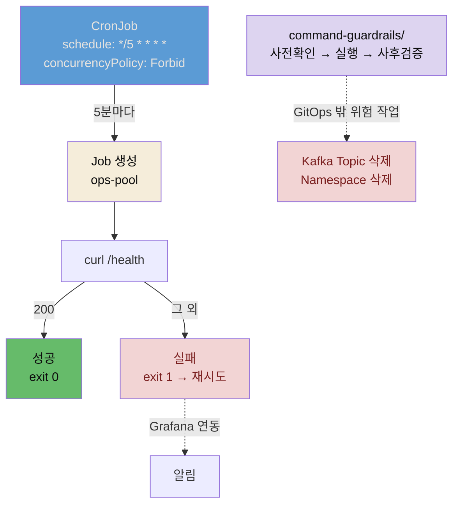

# CronJob 배치 자동화와 command-guardrails


## 📌 핵심 요약

8장 고도화의 마지막 두 조각은 **주기적 작업 자동화**와 **위험 작업 절차서**입니다.

시스템이 복잡해지자 API → Kafka → Consumer로 이어지는 흐름에서, API가 정상 응답하는지 주기적으로 확인하고 싶어집니다. 지금은 사람이 직접 `curl`로 확인해 빠뜨리는 날이 생깁니다. §8.3은 쿠버네티스 기본 리소스인 **CronJob**으로 이를 자동화합니다. 5분마다 `/health`를 호출해 200이면 성공, 아니면 실패로 기록하는 헬스체크 Job을 스케줄합니다. ops-pool에 배치해 API 트래픽에 영향을 주지 않습니다.

§8.4 마무리는 **command-guardrails/**를 작성합니다. 7장에서 `settings.local.json`으로 위험 명령을 차단·승인하는 메커니즘을 잠시 체험했지만, 리소스 삭제 자체가 불필요한 것은 아닙니다. Kafka 토픽을 정리하거나 테넌트 네임스페이스를 제거해야 할 때가 있습니다. 그때 "어떤 순서로, 무엇을 확인하고, 어떻게 실행하는지"를 정리한 절차서가 command-guardrails/입니다. `settings.local.json`이 "하지 마"라면, command-guardrails/는 "해야 한다면 이렇게 해"입니다.


## 🎯 학습 목표

이 노트를 다 읽으면 다음을 설명할 수 있습니다.

- CronJob이 무엇이고 cron 표현식·concurrencyPolicy·restartPolicy가 어떻게 작동하는지 설명할 수 있습니다.
- CronJob이 GitOps·App of Apps와 어떻게 결합되는지 말할 수 있습니다.
- command-guardrails/가 무엇이고 위험 작업을 어떤 3단 절차로 문서화하는지 설명할 수 있습니다.
- `settings.local.json`(차단)과 command-guardrails/(절차)의 역할 차이를 구분할 수 있습니다.


## 📖 본문 정리

### 배치 자동화: CronJob

주기적 작업을 사람이 직접 하면 빠뜨립니다. K8s CronJob은 주기적 작업을 위한 쿠버네티스 기본 리소스라 추가 설치가 필요 없고, cron 문법(Linux cron과 동일)으로 스케줄을 정하며, YAML 선언 → 깃 커밋 → ArgoCD 관리 흐름에 그대로 얹힙니다. Argo Workflows(복잡한 DAG)나 Airflow(데이터 파이프라인)는 별도 CRD·서버가 필요해 단순 헬스체크에는 과합니다.

저자 저장소의 헬스체크 CronJob 실물입니다.

```yaml
apiVersion: batch/v1
kind: CronJob
metadata:
  name: notiflex-healthcheck
  namespace: notiflex
spec:
  schedule: "*/5 * * * *"          # 5분마다
  concurrencyPolicy: Forbid        # 이전 Job이 끝날 때까지 대기
  successfulJobsHistoryLimit: 3    # 성공 Job 3개만 보관
  failedJobsHistoryLimit: 3
  jobTemplate:
    spec:
      template:
        spec:
          nodeSelector:
            cloud.google.com/gke-nodepool: ops-pool   # 운영 노드에 격리
          restartPolicy: OnFailure  # 실패 시 같은 Pod에서 재시도
          containers:
          - name: healthcheck
            image: curlimages/curl:latest
            command:
            - /bin/sh
            - -c
            - |
              STATUS=$(curl -s -o /dev/null -w "%{http_code}" \
                http://notiflex-api.notiflex.svc.cluster.local/health)
              if [ "$STATUS" = "200" ]; then
                echo "헬스체크 성공: HTTP $STATUS"; exit 0
              else
                echo "헬스체크 실패: HTTP $STATUS"; exit 1
              fi
```

핵심 설정은 네 가지입니다.

- `schedule`: cron 표현식(분 시 일 월 요일). `*/5 * * * *`은 5분마다입니다.
- `concurrencyPolicy: Forbid`: 이전 Job이 아직 돌고 있으면 새 실행을 건너뜁니다.
- `restartPolicy: OnFailure`: 실패 시 같은 Pod에서 재시도합니다(재시도 간격은 10·20·40초로 지수적으로 늘어 최대 5분).
- `successfulJobsHistoryLimit`/`failedJobsHistoryLimit`: 성공·실패 Job 보관 개수를 정해 리소스를 정리합니다.

CronJob은 `k8s/smb/` 디렉터리에 생성해 App of Apps의 `notiflex-smb` Application이 자동 배포합니다. 4장에서 구축한 Grafana 알림과 연결하면 CronJob 실패 시 자동으로 알림을 받을 수 있습니다.

### 마무리: command-guardrails/로 위험 작업 절차 정리

8장까지 오면서 시스템이 복잡해졌습니다. Kafka 토픽 삭제, 크론잡 수동 실행, 테넌트 네임스페이스 삭제 등, 실수로 실행하면 데이터가 사라지거나 중복 처리가 발생할 수 있습니다. 7장의 `settings.local.json`은 이런 명령을 아예 **차단**하거나 **승인**받게 했습니다. 그런데 리소스 삭제 자체가 불필요한 건 아닙니다. Kafka 토픽을 정리하거나 테넌트 네임스페이스를 제거해야 할 때가 있습니다. 그때 "어떤 순서로, 무엇을 확인하고, 어떻게 실행하는지"를 정리한 것이 command-guardrails/입니다.

위험 작업은 **사전 확인 → 실행 → 사후 검증** 3단으로 문서화합니다. Kafka Topic 삭제 절차의 예입니다.

```markdown
# Kafka Topic 삭제

## 사전 확인
1. Topic에 미처리 메시지가 있는지 확인
2. Consumer가 모두 처리를 완료했는지 확인
3. 이 Topic을 사용하는 Producer 목록 파악

## 실행
1. 관련 Producer를 먼저 중지(메시지 유입 차단)
2. Consumer가 잔여 메시지를 모두 처리할 때까지 대기
3. KafkaTopic 리소스 삭제

## 사후 검증
1. Topic이 삭제되었는지 확인
2. 관련 Producer/Consumer에 에러가 없는지 로그 확인
```

CronJob 수동 실행, 테넌트 Namespace 삭제도 같은 형식으로 작성합니다. `settings.local.json`은 체험으로 메커니즘만 익히고 끝났지만, command-guardrails/는 운영용 절차서로 깃에 누적합니다. 위험한 명령 요청 시 클로드 코드가 이 절차서를 참조하여 안전한 단계를 제시합니다.

이것이 §7.5 체험과의 핵심 차이입니다. `settings.local.json`(7장 체험)은 "`kubectl delete` → 차단"이고, command-guardrails/(8장 영구)는 "삭제가 필요하면 이 절차를 따라라"입니다. GitOps 방식(깃에서 YAML 삭제 → ArgoCD가 정리)이 대부분의 경우 올바른 방법이지만, GitOps로 안 되는 예외적 위험 작업을 이 절차서가 안전하게 만듭니다.


## 🔍 심화 학습

> 이 절은 책 본문 밖에서 조사한 배경입니다. CronJob 설정의 공식 근거를 보강한 것이며, 책 원문이 아닙니다.

### concurrencyPolicy 세 값의 차이

CronJob의 `concurrencyPolicy`는 이전 Job이 아직 도는 중에 다음 스케줄이 오면 어떻게 할지를 정합니다. 세 값이 있습니다.

- `Allow`(기본): 동시 실행을 허용합니다. 이전 Job이 끝나지 않아도 새 Job을 시작합니다.
- `Forbid`: 이전 Job이 아직 돌고 있으면 새 실행을 건너뜁니다. 헬스체크처럼 겹치면 안 되는 작업에 적합합니다.
- `Replace`: 이전 Job을 종료하고 새 Job으로 교체합니다.

Notiflex 헬스체크는 `Forbid`를 씁니다. 5분 주기인데 한 번의 체크가 5분을 넘겨 다음 체크와 겹치면, 이전 체크가 아직 안 끝났다는 신호이므로 새 체크를 건너뛰는 게 맞습니다. 주의할 점은 `concurrencyPolicy`가 CronJob의 `.spec` 바로 아래에 와야 한다는 것입니다. Pod 템플릿 안에 두면 검증 에러가 납니다.

- 출처: [Kubernetes CronJob 공식 문서](https://kubernetes.io/docs/concepts/workloads/controllers/cron-jobs/)

### 절차서가 GitOps를 보완하는 자리

GitOps는 "모든 변경은 깃을 통해"가 원칙입니다. 대부분의 삭제는 깃에서 YAML을 지우면 ArgoCD의 prune이 리소스를 정리하므로 절차서가 필요 없습니다. command-guardrails/가 필요한 건 GitOps 흐름 밖의 작업입니다 — Kafka 토픽의 미처리 메시지 확인처럼 삭제 전 상태 점검이 필요하거나, Consumer가 잔여 메시지를 처리할 때까지 기다려야 하는 순서 의존이 있는 경우입니다. 이런 작업은 단순히 YAML을 지우는 것으로 안전하지 않아, 사람과 AI가 함께 참조할 명시적 절차가 필요합니다. 절차서를 깃에 두면 사람도 AI도 같은 순서를 따르게 됩니다.

- 출처: [OpenGitOps 원칙 (opengitops.dev)](https://opengitops.dev/)


## 💡 실무 적용 포인트

- **주기 작업은 클러스터 내장 CronJob으로**: 외부 cron 서버나 Argo Workflows를 먼저 떠올리기 전에, 단순 주기 작업이면 K8s CronJob으로 충분합니다. 별도 설치 없이 YAML 한 파일로 선언하고 ArgoCD가 관리하며, 스케줄 변경도 깃 커밋으로 추적됩니다.
- **겹치면 안 되는 작업은 Forbid**: 헬스체크·백업처럼 이전 실행이 끝나기 전에 다음이 시작되면 안 되는 작업은 `concurrencyPolicy: Forbid`로 겹침을 막으세요. 겹침 자체가 이전 작업 지연의 신호이기도 합니다.
- **배치 작업을 전용 노드에 격리**: CronJob이 API 노드에서 돌면 배치 부하가 서비스에 영향을 줍니다. `nodeSelector`로 ops-pool 같은 운영 전용 노드에 배치해 서비스 트래픽과 분리하세요.
- **차단과 절차를 분리하기**: 위험 명령을 무조건 막기만 하면 정당한 삭제도 못 합니다. `settings.local.json`으로 실수 방지 차단선을 두되, 정말 삭제가 필요한 작업은 command-guardrails/에 사전확인→실행→사후검증 절차를 문서화해 사람도 AI도 안전하게 수행하게 하세요.

### CronJob 실행 흐름과 절차서의 자리




## ✅ 핵심 개념 체크리스트

- [ ] CronJob의 cron 표현식·`concurrencyPolicy`·`restartPolicy`·history limit이 각각 무엇을 하는지 압니다.
- [ ] `concurrencyPolicy` 세 값(Allow·Forbid·Replace)의 차이와 헬스체크에 Forbid가 맞는 이유를 압니다.
- [ ] CronJob이 App of Apps로 자동 배포되고 Grafana 알림과 연결되는 흐름을 설명할 수 있습니다.
- [ ] command-guardrails/의 3단 절차(사전확인→실행→사후검증)를 압니다.
- [ ] `settings.local.json`(차단)과 command-guardrails/(절차)의 역할 차이를 구분할 수 있습니다.


## 면접 관점 정리

- **"주기적 헬스체크를 어떻게 자동화하나요?"** — 쿠버네티스 CronJob으로 cron 표현식(`*/5 * * * *` = 5분마다)에 맞춰 `/health`를 호출하는 Job을 스케줄합니다. 별도 설치 없이 YAML로 선언해 ArgoCD가 관리하고, `nodeSelector`로 운영 전용 노드에 격리하며, 실패 시 Grafana 알림과 연결합니다. 겹치면 안 되므로 `concurrencyPolicy: Forbid`를 씁니다.
- **"위험한 삭제 작업을 무조건 막으면 되나요?"** — 아닙니다. 정당한 삭제(오래된 토픽 정리·테넌트 제거)도 있습니다. `settings.local.json`으로 실수성 명령을 차단하는 동시에, 정말 필요한 삭제는 command-guardrails/에 사전확인(미처리 메시지·Consumer 완료 확인)→실행(Producer 중지→대기→삭제)→사후검증 절차를 문서화합니다. "하지 마"와 "이렇게 해"를 나눠 관리합니다.
- **"GitOps인데 절차서가 왜 필요한가요?"** — 대부분의 삭제는 깃에서 YAML을 지우면 ArgoCD prune이 정리하므로 절차가 필요 없습니다. 하지만 Kafka 토픽처럼 삭제 전 미처리 메시지 확인·Consumer 완료 대기 같은 순서 의존이 있는 작업은 단순 YAML 삭제로 안전하지 않습니다. 이런 GitOps 흐름 밖 작업을 위해 사람과 AI가 함께 따를 명시적 절차서가 필요합니다.


## 🔗 참고 자료

- 저자 저장소: [sysnet4admin/notiflex-platform · k8s/smb/healthcheck-cronjob.yaml](https://github.com/sysnet4admin/notiflex-platform/blob/main/k8s/smb/healthcheck-cronjob.yaml)
- 저자 저장소: [docs/architecture-decisions.md · ADR-016 CronJob](https://github.com/sysnet4admin/notiflex-platform/blob/main/docs/architecture-decisions.md)
- [Kubernetes CronJob 공식 문서](https://kubernetes.io/docs/concepts/workloads/controllers/cron-jobs/)
- [OpenGitOps 원칙 (opengitops.dev)](https://opengitops.dev/)
- 형제 노트: [08-01 Kafka 이벤트 드리븐과 Tempo 분산 트레이싱](./08-01.Kafka%20이벤트%20드리븐과%20Tempo%20분산%20트레이싱.md) · [09-01 GitAIOps — 살아있는 운영 표준의 탄생](./09-01.GitAIOps%20—%20살아있는%20운영%20표준의%20탄생.md)
