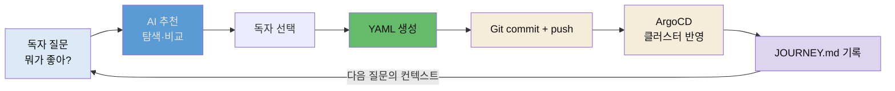

# GitAIOps — 살아있는 운영 표준의 탄생

## 📌 핵심 요약

9장은 회고 장입니다. 새로운 설치나 배포가 없습니다. 대신 클로드 코드에게 저장소를 분석시키고, 그동안 쌓인 것을 돌아보며, 깃과 AI와 Ops가 어떻게 연결되어 있는지 정리합니다. 2장에서 아무것도 없는 깃허브 저장소를 만들었는데, 8장까지 문제를 하나씩 해결했을 뿐인데, 돌아보니 "운영 표준"이 이미 만들어져 있습니다.

핵심 발견이 셋입니다. 하나는 저장소를 분석하면 **코드보다 매니페스트가 4.7배** 많다는 점입니다(Go 95줄 : YAML 450줄). GitOps 프로젝트의 본질은 "코드를 짜는 것"보다 "어떻게 배포하고 운영할 것인가"에 있습니다. 또 하나는 저장소의 문서 7개 중 절반 이상이 **AI를 위한 문서**라는 점입니다(CLAUDE.md·claude-context·memory 등). 사람만 읽는 문서가 아니라 AI가 함께 읽는 문서가 GitAIOps의 핵심 자산입니다. 마지막은 이 모든 것이 "운영 표준을 만들자"는 기획이 아니라 **매 장에서 문제를 해결하고, 깃에 기록하고, AI와 작업하는 패턴을 반복한 결과**라는 점입니다. GitOps에 AI를 더한 이 패턴이 **GitAIOps**입니다.

## 🎯 학습 목표

이 노트를 다 읽으면 다음을 설명할 수 있습니다.

- GitOps 프로젝트에서 코드보다 매니페스트가 많은 이유와 그 의미를 설명할 수 있습니다.
- "사람이 읽는 문서"와 "AI가 읽는 문서"의 차이, 살아있는 문서가 무엇인지 말할 수 있습니다.
- GitOps와 GitAIOps의 차이를 다섯 축(YAML 작성·도구 선택·문서화·트러블슈팅·동기화)으로 구분할 수 있습니다.
- GitAIOps 6가지 자산이 어떻게 자연스럽게 누적되며 프로덕션 전환에 무엇이 필요한지 설명할 수 있습니다.

## 📖 본문 정리

### AI에게 저장소 분석시키기

클로드 코드에게 저장소 구조를 분석시키면, `notiflex-platform`은 13 디렉터리·24 파일로 커졌습니다. 코드(`app/`)·매니페스트(`k8s/`·`argocd/`)·설정(`.claude/`)·문서(`docs/`·`claude-context/`)로 나뉩니다. 파일 통계를 보면 흥미로운 비율이 나옵니다.

- Go 코드: 95줄(`main.go` 하나)
- K8s 매니페스트: 450줄(24개 YAML)
- 비율: 코드 1 : 매니페스트 4.7

이것이 GitOps 프로젝트의 특징입니다. 앱 코드가 "무엇을 하는가"를 정의한다면, 매니페스트는 "어떻게 배포하고, 어떻게 라우팅하고, 어떻게 모니터링하고, 어떻게 롤백하는가"를 정의합니다. 기능이 복잡해지는 게 아니라 **운영 요구사항이 복잡해지는** 것입니다. 그래서 매니페스트의 변경 이력을 관리하는 것이 앱 코드 이력 관리만큼 중요하고, 깃이 그 역할을 합니다.

커밋 히스토리를 챕터별로 정리하면 프로젝트의 성장이 드러납니다.

| 챕터 | 커밋 내용 | 추가된 컴포넌트 |
|------|-----------|----------------|
| ch2 | 환경 구성·첫 배포 | GKE, Go API, Dockerfile |
| ch3 | ArgoCD, CI/CD | ArgoCD Application, GitHub Actions CI |
| ch4 | 관측 가능성 | kube-prometheus-stack, Loki, PrometheusRule |
| ch5 | 무중단 배포 | Gateway API, Argo Rollouts |
| ch6 | Enterprise 기반 | Valkey, CSI Driver, Canary |
| ch7 | 규모 확장 | 멀티 노드풀, App of Apps, 멀티테넌시 |
| ch8 | 고도화 | Strimzi Kafka, Tempo, CronJob |

단순한 Go API에서 시작해 완전한 클라우드 네이티브 플랫폼으로 발전한 과정이 커밋 히스토리에 고스란히 담겨 있습니다. 현재 클러스터에는 28개 Pod가 8개 네임스페이스에 분산되어 실행 중이고, 4개 ArgoCD Application이 모두 Synced + Healthy 상태입니다.

### 쌓인 것들을 돌아보기 — 의사결정 종합

저장소 분석이 "지금 무엇이 있는가"라면, 이번에는 "왜 이렇게 되었는가"입니다. 8개 장에 걸친 도구 선택과 그 이유를 정리하면 일관된 패턴이 보입니다.

- **GKE 네이티브 우선**: Gateway API, Workload Identity, CSI Driver. 별도 설치 없이 GKE가 제공하는 기능을 먼저 씁니다.
- **Argo 생태계**: ArgoCD와 Rollouts를 함께 씁니다. 같은 생태계라 CRD 경험이 일관됩니다.
- **Grafana 통합**: Prometheus·Loki·Tempo가 모두 Grafana 하나로 연결됩니다.
- **GitOps 호환**: 모든 도구가 YAML로 선언되고 깃에 커밋할 수 있습니다.

이 네 기준을 처음부터 정한 게 아닙니다. 매 장에서 "왜?"를 물어보고 AI가 답하고, 그 과정을 `JOURNEY.md`에 기록하면서 자연스럽게 형성된 기준입니다. `CLAUDE.md`도 마찬가지로 성장했습니다 — ch2 환경 정보에서 시작해 ch3 행동 규칙, ch5 배포 규칙, ch6 보안 규칙, ch7 스케줄링 규칙으로 "어떤 환경인가"에서 "어떻게 행동해야 하는가"로 성숙했습니다.

### 기대하지 않았던 효과 — 살아있는 문서

이 구조가 만들어낸 효과 중에는 처음부터 의도하지 않았던 것들이 있습니다. 전통적인 운영 문서는 별도의 Wiki나 Confluence에 작성되어, 시간이 지나면 코드와 괴리가 생깁니다. 문서 업데이트를 잊기 때문입니다. `notiflex-platform`의 문서는 코드와 같은 저장소에 있고, `/update-docs`가 코드 변경과 동시에 문서를 갱신합니다. 문서가 코드와 함께 살아있습니다.

더 흥미로운 건 문서의 독자입니다. 저장소의 문서 7개를 누가 읽는지로 나누면 절반 이상이 AI를 위한 것입니다.

| 문서 | 누구를 위한 문서? | 활용 방식 |
|------|:---:|------|
| docs/JOURNEY.md | 사람 | 진행 점검·결정 히스토리 검토 |
| docs/architecture-decisions.md (ADR) | 사람과 AI | 결정 누적·AI가 의사결정 맥락 참조 |
| CLAUDE.md | AI | AI에게 프로젝트 메타데이터 안내(매 대화 로드) |
| claude-context/ | AI | AI에게 현재 아키텍처 스냅샷 제공 |
| .claude/memory/ | AI | AI가 작업 컨텍스트를 떠올리도록 |
| settings.local.json | AI | AI의 명령 실행 동작 제어 |
| command-guardrails/ | 사람과 AI | 위험 작업 절차서 |

전통적 운영 문서는 사람만을 위한 것이라 시간이 지나면 아무도 안 봐 정보가 죽습니다. 반면 이 책의 자산은 다수가 AI를 위해 설계됐고, AI가 매 대화 시작 시 자동으로 읽어 프로젝트 맥락을 이해합니다. "왜 Gateway API를 쓰나요?"라고 물으면 ADR에서 결정 기록을 찾고, "테넌트 네임스페이스를 정리하려면?"이라고 물으면 command-guardrails/에서 절차를 찾아 맥락 있는 답변을 합니다. 이 구조가 만드는 것은 온보딩 자동화입니다 — "온보딩 문서 만들어줘"라고 하면 AI가 현재 클러스터 상태와 저장소 구조를 조회해 새 팀원용 가이드를 생성합니다.

### GitAIOps의 출현

깃·AI·Ops가 어떻게 연결되어 있는지 클로드 코드에게 분석시키면, 세 요소의 역할이 드러납니다.

- **Git(단일 진실 공급원)**: 모든 인프라 상태가 YAML로 선언되어 깃에 저장됩니다. 커밋 히스토리가 인프라 변경 이력, `JOURNEY.md`가 의사결정 기록, `CLAUDE.md`가 AI에게 프로젝트를 이해시키는 메타데이터입니다.
- **AI(의사결정 보조 + 코드 생성)**: 3-프롬프트 패턴으로 탐색("뭐가 좋아?")·비교("비교해줘")·실행("설치해줘")을 진행합니다. AI가 컨텍스트를 이해하고 최적의 도구를 추천하며, 코드를 생성하고 트러블슈팅을 돕고, `JOURNEY.md`에 의사결정을 기록해 살아있는 문서를 만듭니다.
- **Ops(자동화된 운영)**: ArgoCD가 깃 상태를 클러스터에 자동 동기화하고, Argo Rollouts가 안전한 배포 전략을 실행하며, Prometheus·Alertmanager가 이상을 감지하고, CronJob이 주기적 운영을 자동화합니다.

이 셋이 **GitAIOps 루프**를 이룹니다 — 독자 질문 → AI 추천 → 독자 선택 → YAML 생성 → Git commit + push → ArgoCD가 클러스터 반영 → JOURNEY.md 기록 → 다음 질문의 컨텍스트. 이 루프가 매 서브챕터마다 반복되며 인프라가 성장합니다. AI가 이전 선택을 기억하고(CLAUDE.md·JOURNEY.md·memory), 일관된 아키텍처를 유지하면서 점진적으로 고도화합니다.

GitOps와 GitAIOps의 차이는 이렇습니다.

| 항목 | GitOps | GitAIOps |
|------|--------|----------|
| YAML 작성 | 사람이 직접 | AI가 자연어로부터 생성 |
| 도구 선택 | 사람이 조사하고 결정 | AI가 추천하고 사람이 확인 |
| 문서화 | 별도로 해야 함(보통 빠짐) | AI와의 대화가 자동으로 기록 |
| 트러블슈팅 | 에러 메시지로 검색 | AI가 분석하고 해결책 제시 |
| 동기화 | Git → ArgoCD → 클러스터 | 동일 |

AI가 실행자이면서 동시에 기록자입니다. 이것이 기존 GitOps에서 부족했던 "문서화"와 "지식 축적"을 자동으로 해결합니다. 중요한 건 "GitAIOps 표준을 설계하자"라고 한 적이 없다는 점입니다. 매 장에서 문제를 해결했을 뿐인데, 깃에 기록하고 AI와 작업하고 그 과정을 문서로 남기는 패턴을 반복했더니 운영 표준이 자연스럽게 만들어졌습니다.

## 🔍 심화 학습

> 이 절은 책 본문 밖에서 조사한 배경입니다. GitOps 원전의 맥락으로 GitAIOps를 위치시키는 보강이며, 책 원문이 아닙니다.

### GitAIOps는 GitOps 4원칙 위에 AI를 얹은 것

GitAIOps를 이해하려면 GitOps의 뿌리를 봐야 합니다. OpenGitOps는 네 원칙을 정의합니다 — 선언적(Declarative), 버전 관리·불변(Versioned & Immutable), 자동 풀(Pulled Automatically), 지속적 조정(Continuously Reconciled). 이 네 원칙은 "인프라의 원하는 상태를 깃에 선언하고, 에이전트가 실제 상태를 지속적으로 그에 맞춘다"로 요약됩니다. GitAIOps는 이 위에 AI를 두 자리에 얹습니다 — 원하는 상태를 **작성**하는 자리(자연어 → YAML 생성)와 그 결정을 **기록**하는 자리(대화 → 문서). GitOps의 자동화(ArgoCD의 조정)는 그대로 두고, 사람이 하던 "선언 작성"과 "문서화"를 AI가 돕는 구조입니다. 그래서 GitAIOps는 GitOps를 대체하는 게 아니라 그 약점(문서화·지식 축적)을 메우는 확장입니다.

- 출처: [OpenGitOps 4원칙 (opengitops.dev)](https://opengitops.dev/)
- 관련 개념: [01-02 GitOps에서 GitAIOps로](./01-02.GitOps에서%20GitAIOps로.md)

### 자산이 쌓이는 두 방향 — 문제 해결 중심 vs 계획 중심

이 책은 매 장에서 문제가 생기면 해결하고, 그 과정에서 필요한 자산이 하나씩 추가되는 **문제 해결 중심** 방식입니다. CLAUDE.md(ch3)·memory(ch4)·ADR(ch5)·claude-context/(ch6)·command-guardrails/(ch8)가 누적됐습니다. 소규모 프로젝트나 학습 과정에서 자연스러운 방향입니다. 반대로 대규모 마이그레이션이나 전면 재설계처럼 전체 그림을 먼저 그려야 하는 프로젝트는 **계획 중심**으로 접근합니다 — 사람이 읽는 상세 계획서(work-plans)를 먼저 만들고, 그 핵심을 AI가 읽을 수 있는 형태로 증류(distill)한 뒤, 실행 절차(command-guardrails)와 값 고정(helm-values)을 설계합니다. 어떤 방향이든 결과적으로 만들어지는 것은 같습니다 — 사람과 AI가 함께 읽을 수 있는, 깃으로 관리되는 운영 표준입니다.

## 💡 실무 적용 포인트

- **매니페스트 이력을 코드만큼 챙기기**: GitOps 프로젝트는 코드보다 매니페스트가 많습니다. "어떻게 배포·운영하는가"의 변경 이력이 "무엇을 하는가"만큼 중요하므로, 매니페스트도 PR 리뷰·커밋 메시지 규칙을 코드와 동등하게 적용하세요.
- **AI가 읽을 문서를 따로 설계하기**: 사람용 문서만 두면 AI는 매번 코드를 처음부터 읽습니다. CLAUDE.md(규칙)·claude-context(스냅샷)·ADR(결정 이력)을 AI가 읽을 자산으로 분리하면, 온보딩·보안 감사·아키텍처 질의를 AI가 맥락 있게 답합니다.
- **결정을 그 순간에 기록하기**: "왜 이 도구를 골랐나"는 6개월 지나면 잊힙니다. 도구를 고른 그 커밋에 ADR·JOURNEY 기록을 함께 넣으면, 나중에 사람도 AI도 결정 근거를 되짚을 수 있습니다.
- **운영 표준을 기획하지 말고 축적하기**: "운영 표준을 만들자"고 대규모로 설계하면 아무도 안 씁니다. 매 문제를 해결할 때 깃에 기록하고 AI와 작업하고 문서로 남기는 패턴을 반복하면, 운영 표준이 자연스럽게 쌓입니다.

### GitAIOps 루프

## ✅ 핵심 개념 체크리스트

- [ ] GitOps 프로젝트에서 코드보다 매니페스트가 많은 이유(운영 요구사항의 복잡도)를 설명할 수 있습니다.
- [ ] "사람이 읽는 문서"와 "AI가 읽는 문서"의 차이, 살아있는 문서의 의미를 압니다.
- [ ] GitAIOps 루프(질문→추천→선택→YAML→커밋→반영→기록)를 설명할 수 있습니다.
- [ ] GitOps와 GitAIOps의 다섯 축 차이(특히 문서화·지식 축적)를 구분할 수 있습니다.
- [ ] 6가지 자산이 "기획"이 아니라 문제 해결의 부산물로 누적된다는 것을 압니다.

## 면접 관점 정리

- **"GitOps 프로젝트인데 왜 코드보다 YAML이 많나요?"** — 앱 코드는 "무엇을 하는가"를 정의하지만, 매니페스트는 "어떻게 배포·라우팅·모니터링·롤백하는가"를 정의합니다. 기능이 아니라 운영 요구사항이 복잡해지는 것이 클라우드 네이티브의 특징이라, 매니페스트가 코드의 4~5배가 되는 게 흔합니다. 그래서 매니페스트의 변경 이력 관리(깃)가 코드 이력만큼 중요합니다.
- **"GitOps와 GitAIOps는 무엇이 다른가요?"** — GitOps는 깃을 단일 진실 소스로 삼아 ArgoCD가 클러스터를 자동 조정하는 방식입니다. GitAIOps는 그 위에 AI를 얹어, 사람이 하던 YAML 작성을 자연어로부터 생성하고, 도구 선택을 AI가 추천하며, 대화가 자동으로 문서화됩니다. 동기화(Git→ArgoCD)는 동일하되, GitOps의 약점이던 문서화·지식 축적을 AI가 실행자이자 기록자로서 메웁니다.
- **"AI를 위한 문서를 따로 두는 게 왜 중요한가요?"** — 전통적 운영 문서는 사람만 읽어 시간이 지나면 코드와 괴리되고 죽습니다. CLAUDE.md·claude-context·ADR을 AI가 매 대화에서 읽는 자산으로 설계하면, AI가 프로젝트 맥락을 이해해 온보딩 문서 생성·보안 감사·"왜 이 결정을 했나" 같은 질의에 맥락 있게 답합니다. 기록의 품질이 곧 AI 응답의 품질을 결정하므로, AI가 읽을 문서의 설계가 GitAIOps의 핵심 자산이 됩니다.

## 🔗 참고 자료

- 저자 저장소: [sysnet4admin/notiflex-platform · claude-context/architecture.md](https://github.com/sysnet4admin/notiflex-platform/blob/main/claude-context/architecture.md)
- 저자 저장소: [docs/architecture-decisions.md (전체 ADR 누적)](https://github.com/sysnet4admin/notiflex-platform/blob/main/docs/architecture-decisions.md)
- [OpenGitOps 4원칙 (opengitops.dev)](https://opengitops.dev/)
- [Claude Code memory 관리 (Anthropic 공식 문서)](https://docs.claude.com/en/docs/claude-code/memory)
- 형제 노트: [08-02 CronJob 배치 자동화와 command-guardrails](./08-02.CronJob%20배치%20자동화와%20command-guardrails.md) · [01-02 GitOps에서 GitAIOps로](./01-02.GitOps에서%20GitAIOps로.md)
