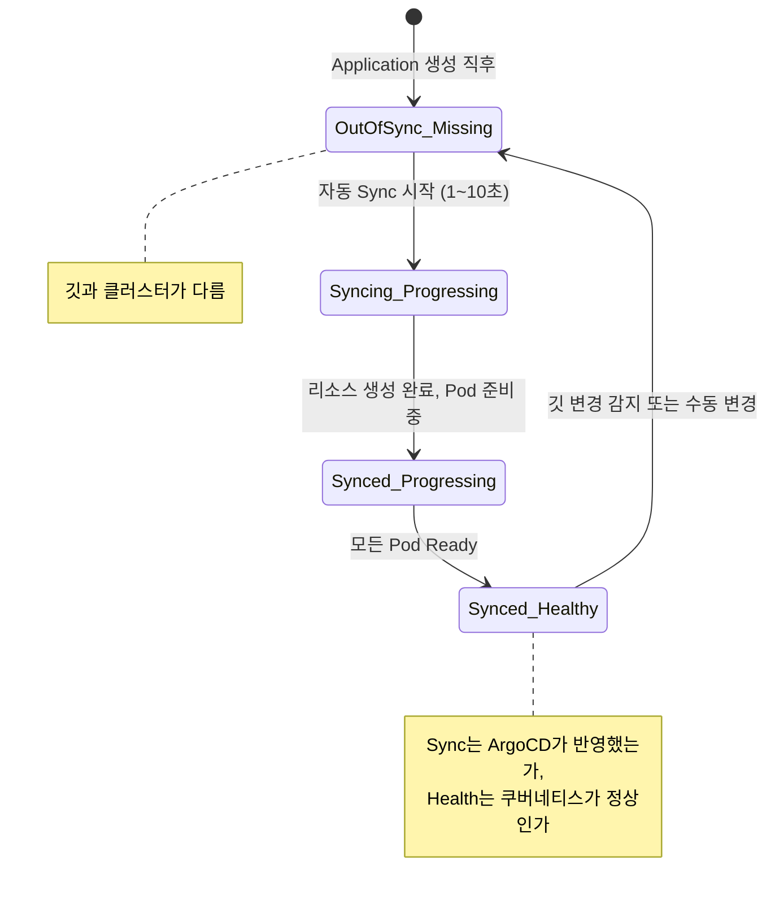
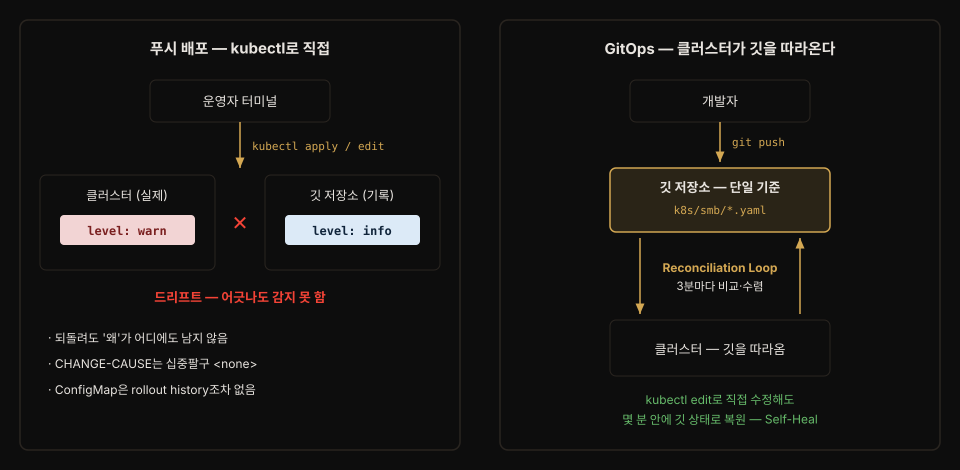
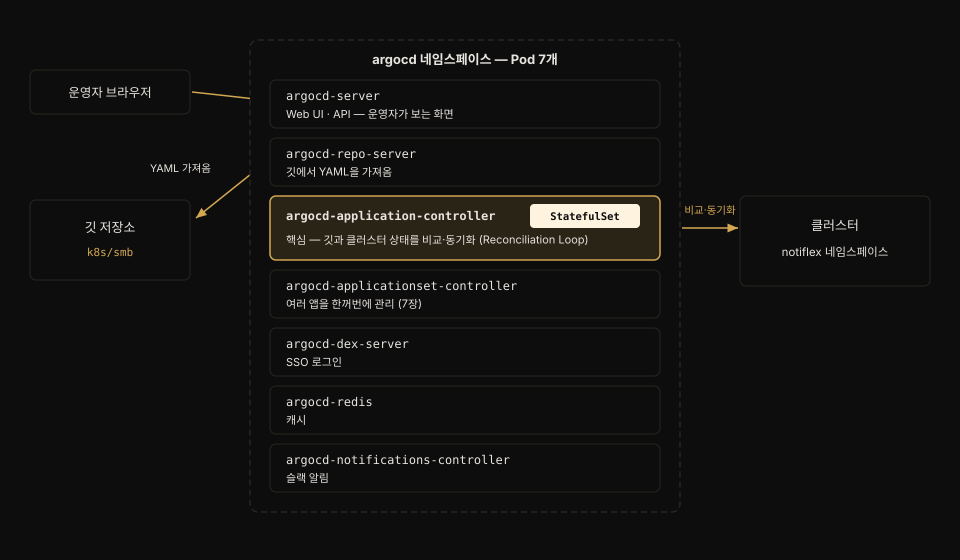

# 푸시 배포의 한계와 ArgoCD GitOps — 설치·연결·롤링·롤백
---
> **kubectl로 직접 미는 푸시 배포가 왜 구조적으로 위험한지(드리프트·'왜'의 부재·리소스별 제각각인 롤백 기준) 두 가지 실제 사례로 설명할 수 있고, ArgoCD를 설치해 Application 리소스 하나로 깃과 클러스터를 연결하는 절차를 답할 수 있으며, 깃 푸시만으로 롤링 업데이트가 일어나고 git revert만으로 롤백되는 것을 확인하는 흐름까지 말할 수 있다.**


## 📌 핵심 요약

> 2장의 "빌드하고 배포해줘"는 편했지만 흔적이 없습니다. 3장 전반부는 그 문제를 사례로 보여주고, ArgoCD를 설치해 "깃에 적힌 YAML이 기준"인 체계로 전환한 뒤, 푸시만으로 배포·revert만으로 롤백되는 것을 눈으로 확인합니다.

2장에서 클로드 코드에게 "빌드하고 배포해줘"라고 말해 Notiflex를 GKE에 올렸습니다. 편리했지만 이 방식에는 구조적인 문제가 있습니다 — 클러스터에 지금 무엇이 배포돼 있는지 확신할 수 없고, 되돌릴 근거도 남지 않습니다. 3장 전반부는 이 문제를 정리하고 ArgoCD로 GitOps를 활성화합니다. Application을 만들면 상태가 네 단계를 거쳐 수렴합니다.




## 🎯 학습 목표

> 이 절을 읽고 나면 다음 세 가지를 할 수 있습니다.

1. 푸시 기반 배포의 세 가지 구조적 문제(드리프트 감지 불가·'왜'의 부재·리소스별 롤백 기준 상이)를 실제 사례로 설명할 수 있습니다.
2. ArgoCD Application YAML의 핵심 필드(source.path·destination.namespace·syncPolicy.automated)를 읽고 어떤 동작을 선언하는지 답할 수 있습니다.
3. 깃 푸시 → 롤링 업데이트 → git revert 롤백의 한 바퀴를 명령 수준에서 재현할 수 있습니다.


## 1. 푸시 기반 배포의 한계

> 클러스터에 무엇이 있는지 확신할 수 없고, 되돌려도 '왜'가 남지 않습니다. 문제는 사람이 아니라 방식에 있습니다.

책은 운영 팀이 반복해 겪는 두 사례로 시작합니다.

**사례 1은 "ConfigMap을 잠깐만 고칠게"입니다**. 긴급히 `kubectl edit configmap app-config -n notiflex`로 로그 레벨을 한 줄 바꾸고 상황을 정리했는데, 깃 저장소에는 `level: info`, 클러스터에는 `level: warn`이 남습니다. 긴급 수정을 깃에 반영하는 걸 잊은 것입니다. 이것이 설정 드리프트(configuration drift)입니다. 한 번 생기면 '진짜 소스'가 어디에 있는지 아무도 모르게 됩니다.

**사례 2는 "kubectl set image 한 줄인데"입니다. 태그를 `v0.1.2`로 바꾸려다 `v0.12`로 잘못 입력해 Pod가 `ImagePullBackOff`에 갇힙니다.** `kubectl rollout undo`로 직전 ReplicaSet으로 되돌릴 수는 있지만 '왜 이 배포를 했는지'는 어디에도 남지 않습니다.

되돌린 뒤의 흔적도 부실합니다. `rollout history`의 CHANGE-CAUSE는 십중팔구 `<none>`이고(과거의 `--record` 옵션은 deprecated), revision 보관 개수도 기본 10개라 과거 이력이 조용히 지워집니다. 사례 1의 ConfigMap처럼 rollout history 자체가 없는 리소스는 복원할 근거가 아예 없습니다.

정리하면 구조적 문제는 세 가지입니다.

- 드리프트를 알 수 없다 — 클러스터에 실제 적용된 것과 깃·문서 내용이 같은지 보장할 방법이 없습니다.
- '왜'가 남지 않는다 — 되돌릴 수는 있어도 배포의 이유가 어디에도 기록되지 않습니다.
- 리소스마다 기준이 다르다 — Deployment는 rollout history라도 있지만 ConfigMap은 그마저 없습니다.

해결의 첫 단계는 명령형에서 선언형으로 사고를 옮기는 것입니다. 명령형(`kubectl set image ...`)은 "지금 이걸 해"라는 동작이라 실행 순간에만 의미가 있습니다. 선언형(YAML에 `image: ...`를 적어 둠)은 "상태가 이래야 해"라는 약속이라 언제 다시 적용해도 같습니다.

쿠버네티스는 철학 자체가 선언형입니다. GitOps는 여기서 한 발 더 나아가 "깃에 적힌 YAML이 기준이고 클러스터는 그걸 계속 따라오면 된다"는 관점을 취합니다. 이렇게 하면 누군가 `kubectl edit`로 수정해도 몇 분 안에 깃 기준으로 되돌려지므로 드리프트가 지속되지 못합니다.



## 2. ArgoCD 설치 및 GitOps 연결

> 클로드 코드에게 도구를 묻고(탐색), 대안과 비교하고(비교), ArgoCD 설치를 진행합니다(실행) — 3장부터 등장하는 3-프롬프트 패턴입니다.

"배포 자동화 도구는 어느 걸 쓰는 게 좋아?"라고 물으면 클로드 코드가 GitOps와 ArgoCD를 추천합니다(CNCF Graduated, 가장 활발한 커뮤니티, Web UI 기본 제공). 책이 정리하는 GitOps 핵심 원칙은 세 가지입니다.

- 모든 변경은 Git commit으로만 이루어집니다.
- 클러스터는 깃의 상태를 자동으로 반영합니다 (**Reconciliation Loop**, 기본 약 3분마다 비교).[^reconcile-interval]
- 직접 수정해도 깃 상태로 자동 복원됩니다 (Self-Heal).

[^reconcile-interval]: "3분"은 실제로는 두 설정의 합입니다. `argocd-cm`의 `timeout.reconciliation` 기본값이 120초이고 여기에 `timeout.reconciliation.jitter` 최대 60초가 더해져, 앱마다 조금씩 흩어진 채 실질 약 3분 주기로 폴링합니다(동시 폴링 쏠림을 막는 jitter). 값을 0으로 두면 폴링이 꺼지고 웹훅·수동 Refresh에만 의존합니다. 출처: [ArgoCD FAQ](https://argo-cd.readthedocs.io/en/stable/faq/).

대안 비교표도 클로드 코드가 제시합니다. e2-medium×2(메모리 4GB) 환경 판단이 핵심입니다.

| 구분 | ArgoCD | Flux | Jenkins X | Spinnaker |
|------|--------|------|-----------|-----------|
| 추천도 | ★★★ | ★★ | ★ | ★ |
| 메모리 | ~500MB | ~100MB | ~2GB | ~4GB |
| Pod 수 | 7개 | 4개 | 20개+ | 10개+ |
| Web UI | 기본 제공 | 별도 설치 | 있음 | 있음 |
| CNCF | Graduated | Graduated | Sandbox | - |
| 학습 곡선 | 보통 | 가파름 | 가파름 | 가장 가파름 |

Flux가 더 가볍지만 UI가 없어 Capacitor 같은 대시보드를 따로 깔아야 하고("최소한의 코어만 제공" 철학), ArgoCD는 "한 번에 다 제공" 철학이라 처음 배우는 입장에서 설치하자마자 화면으로 볼 수 있습니다. 학습 목적에는 시각적 피드백이 중요하므로 ArgoCD로 결정합니다.

설치는 공식 `install.yaml` 하나로 50개가 넘는 리소스를 만듭니다(책 시점 v2.14.11):

```bash
# 네임스페이스 생성 후 공식 매니페스트를 서버사이드로 적용 — 책 §3.2.3 실습 명령
kubectl --context gke-sysnet4admin_book_gitaiops create namespace argocd

kubectl --context gke-sysnet4admin_book_gitaiops apply -n argocd \
    -f https://raw.githubusercontent.com/argoproj/argo-cd/v2.14.11/manifests/install.yaml \
    --server-side=true --force-conflicts=true
```

- `--server-side=true`를 붙이는 이유가 흥미롭습니다. 일반 client-side apply는 `last-applied-configuration` 애너테이션으로 변경을 추적하는데, 다른 도구(ArgoCD·Helm)가 같은 리소스를 수정하면 충돌이 납니다. 
- server-side는 kube-apiserver가 필드 소유권(field ownership)을 직접 관리합니다. 어떤 도구가 어떤 필드를 수정했는지 서버가 기록하므로 충돌이 줄어듭니다.

Pod 7개의 역할 분담은 다음과 같습니다.



- `argocd-server` — Web UI와 API. 운영자가 보는 화면입니다.
- `argocd-repo-server` — 깃에서 YAML을 가져옵니다.
- `argocd-application-controller` — 핵심. 깃과 클러스터 상태를 비교·동기화하는 Reconciliation Loop를 돌립니다.
- `argocd-applicationset-controller` — 여러 앱을 한꺼번에 관리합니다 (7장).
- `argocd-dex-server` — SSO 로그인.
- `argocd-redis` — 캐시.
- `argocd-notifications-controller` — 슬랙 알림.

application-controller만 StatefulSet인 것도 짚어 둘 지점입니다 — Reconciliation 상태를 안정적으로 유지해야 하기 때문입니다.

UI는 초기 비밀번호를 `argocd-initial-admin-secret`에서 꺼내(`base64 -d`) `port-forward svc/argocd-server 8443:443`으로 접속합니다. 서버(클러스터 안 본체)와 별개로 로컬 `argocd` CLI도 설치해 둡니다 — 서버는 데이터베이스 서버, CLI는 psql 같은 클라이언트라는 비유가 책의 설명입니다.

## 3. Application 리소스로 깃 저장소 연결

> '이 깃 경로를 감시해서 이 클러스터에 배포해'라는 선언 한 장 — Application CRD가 GitOps 연결의 전부입니다.

"이제 ArgoCD랑 내 깃허브 저장소 연결해줘"라고 하면 클로드 코드가 Application 객체를 만듭니다. 쿠버네티스 CRD(Custom Resource Definition — 사용자가 새 리소스 종류를 추가하는 방법)로 만들어져 있어 YAML 한 장으로 관리됩니다:

```yaml
# argocd/notiflex-smb.yaml — 책 §3.2.4 실습본
apiVersion: argoproj.io/v1alpha1
kind: Application
metadata:
  name: notiflex-smb
  namespace: argocd            # Application 자체는 argocd 네임스페이스에
spec:
  project: default
  source:
    repoURL: https://github.com/{user}/notiflex-platform.git
    targetRevision: main
    path: k8s/smb              # 이 디렉터리를 감시
  destination:
    server: https://kubernetes.default.svc
    namespace: notiflex        # 배포 대상은 notiflex 네임스페이스
  syncPolicy:
    automated:                 # 깃이 바뀌면 자동 반영
      prune: true              # 깃에서 삭제한 것은 클러스터에서도 삭제
      selfHeal: true           # 직접 수정해도 깃 상태로 복원
    syncOptions:
      - CreateNamespace=true
```

이 세 필드는 각각 "어떤 Repo에서(source.repoURL) · 어떤 Cluster에(destination.server) · 어떤 규칙으로 묶을지(project)"를 정하는 재료입니다. ArgoCD의 Settings 탭이 Repositories·Clusters·Projects 세 항목으로 나뉜 것과 같은 구조라, Application 한 장은 이 셋을 한데 엮은 선언으로 읽으면 됩니다.

특히 `source.path`는 **저장소 루트를 기준으로 한 상대 경로**입니다. ArgoCD는 저장소를 통째로 clone한 뒤 그 루트에서 이 경로를 찾으므로, 매니페스트가 `notiflex-platform/`처럼 하위 폴더 밑에 있으면 `path`도 그 깊이를 그대로 반영해야 합니다.

실습에서 이 함정에 실제로 빠졌습니다. `path: k8s/smb`로 뒀다가 `app path does not exist`로 Sync가 Unknown에 갇혔습니다. repo 루트가 상위 저장소여서 `notiflex-platform/k8s/smb`로 고쳐야 했습니다. 책 저자 저장소는 `notiflex-platform`이 곧 루트라 `k8s/smb`가 맞지만, 저장소 구조가 다르면 경로가 달라집니다.

apply 직후 상태가 OutOfSync/Missing → Syncing/Progressing → Synced/Progressing → Synced/Healthy 네 단계로 바뀝니다(도입부 상태 전이도). 여기서 Sync와 Health를 분리해서 보는 것이 중요합니다. Sync는 'ArgoCD가 깃을 반영했는가'를 묻고, Health는 '쿠버네티스가 정상으로 돌고 있는가'를 묻습니다. UI 카드의 Sync 아이콘(체크/동그라미/물음표)과 Health 아이콘(하트/시계/삼각형/X)이 독립적으로 움직이는 것도 같은 이유입니다.

복습 실습에서 이 둘의 한계를 실물로 만났습니다. 비용을 아끼려 노드풀을 0으로 내려 둔 클러스터를 다시 열었더니, Application은 여전히 `Synced / Healthy`(둘 다 초록)인데 정작 Pod는 2개 모두 `Pending`이었습니다(`no nodes available to schedule pods`, 9시간째). 노드가 0이라 스케줄러가 Pod를 어느 노드에도 못 붙인 상태였습니다. Sync에는 애초에 '스케줄 성공'이라는 개념이 없고 Health는 Pod보다 상위 오브젝트(Deployment)를 보기 때문에, 이 사실은 두 지표 어디에도 안 걸렸습니다.

**Sync/Health가 초록이어도 앱이 안 떠 있을 수 있으므로, 배포 성공은 카드 색이 아니라 `kubectl get pods`로 Pod 레벨까지 내려가 확인해야 합니다.** Sync·Health를 하나로 합치지 않고 둘로 나눠 보여 주는 이유도 이런 층위 차이를 드러내기 위해서입니다.

상단 액션 버튼은 네 가지입니다.

- Refresh — 3분 폴링을 안 기다리고 즉시 재비교합니다.
- Sync — 수동으로 동기화를 트리거합니다.
- Rollback — History에서 커밋을 골라 되돌립니다.
- Delete — Cascade 여부를 선택해 삭제합니다.

Rollback 버튼은 `git revert`(§5)와 다르게 동작하니 구분해 둬야 합니다. UI Rollback은 깃을 거치지 않고 ArgoCD가 클러스터만 이전 리비전으로 되돌립니다. 깃(정본)과 어긋나므로 곧바로 `OutOfSync`가 됩니다. 스스로 드리프트를 만드는 셈입니다.

복습 실습에서 UI로 v0.1.1로 롤백해 보니, `selfHeal`이 켜져 있는데도 깃 상태로 자동 복원되지 않고 v0.1.1에 머물렀습니다. 원인은 롤백을 누른 순간 그 앱의 자동 동기화(`syncPolicy.automated`)가 꺼졌기 때문입니다. ArgoCD 공식 문서는 이 방향을 못 박아 둡니다 — **auto-sync가 켜진 앱은 Rollback을 할 수 없어서, ArgoCD가 롤백을 수행하려면 먼저 auto-sync를 꺼야 합니다.**[^rollback-autosync] auto-sync가 살아 있으면 되돌린 직후 다시 깃 상태로 끌어올려 롤백이 무의미해지기 때문입니다.

문제는 그 뒤입니다. 롤백된 앱은 auto-sync가 꺼진 채 방치될 수 있습니다. 이후 누가 깃에 새 버전을 푸시해도 자동 배포가 안 되는, 장애의 씨앗이 됩니다. 그래서 UI Rollback 뒤에는 Sync로 깃에 재수렴시키고 App Details의 Sync Policy에서 auto-sync를 다시 켜 두는 정리가 필요합니다.

[^rollback-autosync]: ArgoCD 공식 문서 [Automated Sync Policy](https://argo-cd.readthedocs.io/en/stable/user-guide/auto_sync/) — "Rollback cannot be performed against an application with automated sync enabled." 즉 롤백과 auto-sync는 공존할 수 없고, UI에서 롤백을 누르면 그 전제를 맞추기 위해 auto-sync가 해제됩니다.

Private 저장소라면 깃허브 토큰을 담은 Secret(`argocd.argoproj.io/secret-type: repository`)을 argocd 네임스페이스에 만들어야 합니다. 이때 `forceHttpBasicAuth: "true"`를 함께 넣어야 인증이 깔끔하게 붙는 경우가 있습니다. 이 필드는 ArgoCD가 저장소에 붙을 때 하는 **인증 방식 협상(auth negotiation)을 건너뛰고 HTTP basic auth로 곧장 접속하게** 강제하는 옵션입니다(기본값 `false`).[^basic-auth] 협상 과정에서 basic auth가 선택되지 않아 실패하는 서버(일부 사설 깃 호스팅)에서 유효한 우회로라, ArgoCD 버전 자체가 basic auth를 끈 것은 아닙니다. 이 Secret에는 GitHub PAT(`ghp_...`)가 들어 있으므로 절대 깃에 커밋하지 않습니다. `.gitignore`에 `argocd/repo-*.yaml` 패턴을 추가하는 것이 최소 방어선이고, 6장의 Secret Manager + CSI Driver로 격상합니다.

[^basic-auth]: ArgoCD 공식 문서 [Private Repositories](https://argo-cd.readthedocs.io/en/stable/user-guide/private-repositories/) — `forceHttpBasicAuth`는 "Skip auth method negotiation and force usage of HTTP basic auth. Defaults to false." v2.14→3.0 업그레이드 가이드에는 basic auth를 기본 비활성화했다는 서술이 없습니다.

## 4. 깃 푸시만으로 롤링 업데이트

> /version 엔드포인트를 추가하고 빌드 → 태그 변경 → 깃 푸시만 하면 ArgoCD가 감지해 Rolling Update를 시작합니다.

GitOps가 실제로 동작하는지 `/version` 엔드포인트(앱 버전·Go 런타임 버전·Pod 이름 반환)를 추가하며 확인합니다. 흐름은 코드 수정(v0.1.1) → `gcloud builds submit`으로 이미지 빌드 → 매니페스트 이미지 태그 변경 → 깃 푸시 → ArgoCD 감지 → Rolling Update → 배포 확인입니다.

푸시한 순간 ArgoCD가 변경을 감지합니다(기본 폴링 3분이지만 대부분 몇 초 안에 반응). `kubectl get pods -w`로 보면 새 Pod가 Pending → ContainerCreating → Running으로 올라오고 기존 Pod가 Terminating으로 내려가는 교체가 하나씩 반복됩니다.

Rolling Update의 속도는 Deployment 전략 필드가 제어합니다:

```yaml
# k8s/smb/deployment.yaml 발췌 — 책 §3.3.1
spec:
  replicas: 2
  strategy:
    type: RollingUpdate
    rollingUpdate:
      maxSurge: 1        # 원하는 개수보다 최대 1개 더 띄울 수 있음
      maxUnavailable: 0  # 가용 Pod가 replicas보다 줄어드는 건 허용하지 않음
```

replicas 2에 maxSurge 1·maxUnavailable 0이면 "새 Pod 1개 뜸(총 3) → 준비되면 기존 1개 내림(총 2) → 반복"으로 진행되는 가용성 우선 기본값입니다.

다만 이 `strategy` 블록은 명시해야 적용됩니다. 복습 실습에서 쓴 매니페스트에는 `strategy`가 아예 없었는데, 그 경우 쿠버네티스가 기본값 maxSurge 25%·maxUnavailable 25%를 적용합니다. replicas 2에서 25%는 내림하면 maxUnavailable이 0으로 계산되어 결과는 비슷했습니다. 다만 이는 "우리가 보장한 값"이 아니라 "우연히 그렇게 나온 값"입니다. 무중단을 확실히 하려면 위처럼 `maxUnavailable: 0`을 명시해 두는 편이 안전합니다.


무중단 여부는 말이 아니라 눈으로 확인합니다. 다른 터미널에서 `while true; do curl -s localhost:8080/id; echo; sleep 1; done`을 돌리면 에러 없이 매 초 응답이 오되, 교체 중간에 v0.1.0과 v0.1.1이 섞여 응답하는 구간이 분명히 보입니다.

이 관측에는 함정이 하나 있습니다. 위 루프를 `kubectl port-forward` 위에서 돌리면, 롤링 업데이트가 진행되는 순간 오히려 응답이 끊깁니다. port-forward는 로드밸런서가 아니라 특정 Pod 하나에 고정된 터널이기 때문입니다. 그 Pod가 교체로 사라지면 터널째 끊깁니다.

실제 사용자는 다릅니다. Service(로드밸런싱)를 거쳐 살아 있는 Pod로 자동 재라우팅되므로 무중단입니다. port-forward로 보는 관측 창만 그 혜택을 못 받아 교체 순간 멈추는 것입니다. 그래서 무중단의 진짜 판정은 curl 루프가 아니라 `kubectl get pods -w`의 Pod 교체 순서로 하는 편이 안전합니다 — 새 Pod가 Ready가 된 뒤에 옛 Pod가 Terminating으로 내려가면 무중단이 지켜진 것입니다. 이 한계는 5장 Gateway API에서 프로덕션이 왜 port-forward가 아니라 Ingress/Gateway로 트래픽을 받아야 하는지의 동기가 됩니다.

교체를 관측하다 옛 Pod가 `Terminating` 뒤에 `Completed`가 아니라 `Error`로 끝나는 것도 눈에 띄었습니다. 원인은 앱(main.go)에 SIGTERM 처리(graceful shutdown)가 없기 때문입니다. 쿠버네티스가 종료 신호(SIGTERM)를 보내도 앱이 이를 잡아 정리하고 스스로 끝내지 않으면 0이 아닌 코드로 죽어 `Error`가 됩니다.

여기서 무중단이 두 층위로 나뉜다는 점을 봐 둘 만합니다. 첫째 층위인 Pod 교체 순서는 쿠버네티스가 `maxSurge`/`maxUnavailable`로 보장합니다. 둘째 층위, 즉 죽는 Pod가 처리 중이던 요청을 마저 끝내는지(graceful shutdown)는 앱의 책임입니다. 쿠버네티스는 "언제 죽여도 되는가"만 관리하고, "죽기 전에 뭘 정리하는가"는 앱이 SIGTERM을 받아 스스로 해야 합니다.

이번엔 `/version` 같은 즉답 엔드포인트라 티가 안 났습니다. DB 트랜잭션이나 긴 요청 중이었다면 그 요청이 중간에 잘렸을 것입니다. 앱이 어떤 언어·프레임워크냐에 따라 이 둘째 층위를 다루는 방법이 갈리는데, Spring Boot의 경우는 아래 §Spring 앱 개발 관점에서 이어 봅니다.

이 혼재 구간이 Rolling Update의 구조적 한계입니다. API 하위 호환이 깨지는 변경이나 DB 스키마 변경에서는 문제가 되므로, 5장 Blue/Green과 6장 Canary로 해결하기 전까지는 '하위 호환되는 변경만 Rolling Update로 배포'라는 규칙으로 버팁니다. `rollout history`의 CHANGE-CAUSE가 `<none>`인 것은 여기서는 신경 쓰지 않아도 됩니다 — ArgoCD가 커밋 SHA로 이력을 추적하고 UI의 History and Rollback 탭에 깃 커밋 메시지와 함께 모든 배포 이력이 나오기 때문입니다.

## 5. 롤백 테스트 — git revert 한 줄

> GitOps가 왜 유용한지는 롤백할 때 가장 확실해집니다. 클러스터를 만지지 않고 깃만 되돌립니다.

새 버전에 문제가 있다고 가정하고 되돌립니다. `git revert HEAD --no-edit && git push` 한 줄이면 ArgoCD가 변경을 감지해 v0.1.0으로 자동 롤백합니다. git revert는 히스토리를 삭제하는 게 아니라 '이 변경을 취소한다'는 새 커밋을 추가하는 것이라, git log에 롤백 기록과 원래 커밋이 모두 남습니다.

누가, 언제, 왜 롤백했는지가 깃에 남는다는 점 — 이것이 푸시 기반 배포(`kubectl apply`)와의 결정적 차이입니다. 롤백 확인 후 revert를 한 번 더 revert해서 v0.1.1로 복귀하고 다음 절(CI)로 넘어갑니다.


## 🔍 심화 학습

> 책 서술을 공식 문서와 완성본 저장소 실물로 뒷받침합니다. 책 밖 조사 내용입니다.

### 책의 GitOps 3원칙 ↔ OpenGitOps 4원칙

책이 정리한 3원칙(Git commit으로만 변경·Reconciliation Loop·Self-Heal)은 CNCF OpenGitOps v1.0의 4원칙(Declarative·Versioned and Immutable·Pulled Automatically·Continuously Reconciled)과 그대로 포개집니다. 원칙 대응표와 push vs pull 모델의 상세는 [01-02 GitOps에서 GitAIOps로](./01-02.GitOps에서%20GitAIOps로.md) 심화 학습이 정본이므로 여기서는 반복하지 않습니다. 3장의 기여는 그 원칙이 어긴 결과(드리프트·이력 부재)를 사례로 먼저 보여 준다는 점입니다.

### Server-Side Apply — 쿠버네티스 1.22+ 표준 메커니즘

책이 `--server-side=true`로 지나간 부분은 쿠버네티스의 Server-Side Apply(SSA) 기능입니다. 필드 관리자(field manager) 정보가 리소스의 `managedFields`에 기록되어, 여러 컨트롤러가 같은 오브젝트의 서로 다른 필드를 소유하는 것을 서버가 중재합니다. ArgoCD·Helm·HPA처럼 한 리소스를 여러 주체가 만지는 GitOps 환경에서 특히 중요해서, ArgoCD 자체도 Sync Option으로 SSA를 지원합니다. 상세는 [쿠버네티스 공식 문서 — Server-Side Apply](https://kubernetes.io/docs/reference/using-api/server-side-apply/)를 참고하면 됩니다.

### 완성본 저장소의 Application은 한 단계 진화해 있다

완성본 [notiflex-platform의 argocd/apps/notiflex-smb.yaml](https://github.com/sysnet4admin/notiflex-platform/blob/main/argocd/apps/notiflex-smb.yaml)(2026-07 확인)을 열어 보면 3장 실습본과 두 가지가 다릅니다. 파일 위치가 `argocd/` 루트가 아니라 `argocd/apps/` 아래로 내려가 있고 `argocd.argoproj.io/sync-wave: "2"` 애너테이션이 붙어 있습니다. 7장 App of Apps 패턴에서 루트 Application(`argocd/root-app.yaml`)이 여러 자식 Application을 거느리고 Sync Wave로 적용 순서를 제어하는 구조로 확장되기 때문입니다. 3장의 Application 한 장이 최종 구조의 씨앗임을 미리 봐 두면 7장이 수월해집니다.


## 💡 실무 적용 포인트

> 드리프트 사례와 도구 선택 논리는 실무 회고·기술 선정 자리에서 그대로 재사용됩니다.

### 이런 상황에서 사용하세요

- 장애 회고에서 "누가 클러스터를 직접 고쳤는지 모르겠다"가 나올 때 — §1의 드리프트 사례 2건이 GitOps 도입을 설득하는 시나리오가 됩니다.
- GitOps 도구를 선정할 때 — 메모리·Pod 수·UI·CNCF 성숙도·학습 곡선 5축 비교표가 판단 틀이 됩니다.
- 배포 실수를 되돌릴 때 — 클러스터를 만지는 rollout undo보다 git revert가 이력을 남기는 정상 경로임을 기준으로 삼습니다.

### 주의할 점

- ⚠️ ArgoCD를 깔았다고 드리프트가 사라지는 게 아닙니다 — `selfHeal`·`prune`을 syncPolicy에 명시해야 동작합니다(01-02 심화 참조).
- ⚠️ 저장소 인증 Secret(GitHub PAT)은 절대 깃에 커밋하지 않습니다 — `.gitignore` 패턴 추가가 최소 방어선이고 6장에서 Secret Manager로 격상합니다.
- ⚠️ Rolling Update 중에는 두 버전이 동시에 트래픽을 받습니다 — 하위 호환이 깨지는 변경은 5장 Blue/Green 전까지 배포하지 않는 규칙이 필요합니다.
- ⚠️ 책은 install.yaml을 v2.14.11로 고정하지만 `stable`(현재 v3.x)로 설치하면 서버가 기본 HTTPS(self-signed)라 로컬 UI 접속 시 인증서 경고를 넘겨야 합니다 — 학습 환경에선 `argocd-cmd-params-cm`의 `server.insecure`로 HTTP 전환이 가능합니다.
- ⚠️ `server.insecure`로 바꿨다면 접속도 HTTPS가 아니라 HTTP로 해야 합니다 — 복습 실습에서 `port-forward ... 8443:443`에 `https://`로 접속하니 서버는 평문 HTTP인데 브라우저는 TLS를 시도해 `connection reset by peer`로 계속 끊겼습니다. `svc/argocd-server ... :80`으로 포워딩한 뒤 `http://`로 접속하니 바로 열렸습니다.
- ⚠️ ArgoCD UI의 앱 목록 화면은 port-forward 위에서 스켈레톤(회색 박스)에 갇히기도 합니다 — 목록은 실시간 watch 스트림으로 받는데 그 지속 연결이 port-forward 터널에서 잘 안 서기 때문입니다. 목록을 건너뛰고 `/applications/argocd/<앱이름>` 상세 URL로 직행하면 정상적으로 리소스 트리가 뜹니다.
- ⚠️ v3.x는 NetworkPolicy가 함께 깔려 드물게 repo-server의 깃 접근을 막을 수 있습니다 — 증상은 Sync는 최신 SHA인데 rollout이 안 바뀌는 것이고 NetworkPolicy 삭제 후 전체 `rollout restart`로 풉니다.


## ✅ 핵심 개념 체크리스트

- [ ] 푸시 기반 배포의 세 가지 구조적 문제를 사례와 함께 설명할 수 있는가?
- [ ] 명령형과 선언형의 차이, 그리고 GitOps가 선언형에서 한 발 더 나아간 지점을 말할 수 있는가?
- [ ] Application YAML의 source/destination/syncPolicy가 각각 무엇을 선언하는지 답할 수 있는가?
- [ ] Sync 상태와 Health 상태가 왜 분리되어 있는지 설명할 수 있는가?
- [ ] git revert 롤백이 rollout undo와 결정적으로 다른 점을 말할 수 있는가?


## ☕ Spring 앱 개발 관점

> 이 책은 Notiflex를 Go로 짜지만, GitOps 배포 파이프라인은 언어와 무관합니다. Spring Boot 앱으로 바꿔도 무엇이 그대로이고 무엇이 달라지는지 짚어 둡니다. 책에 Spring 예제는 없으므로 아래는 공식 문서로 보강한 내용입니다.

먼저 그대로인 부분을 봅니다. Application YAML(`source`/`destination`/`syncPolicy`), Rolling Update 전략(`maxSurge`/`maxUnavailable`), `git revert` 롤백은 배포 대상이 Go든 Spring이든 **똑같이** 동작합니다. ArgoCD는 컨테이너 이미지와 매니페스트만 보지 앱이 무슨 언어인지 모르기 때문입니다. 그래서 이 절에서 배운 GitOps 골격은 Spring 프로젝트에 그대로 옮겨집니다.

갈라지는 지점은 두 곳입니다. 하나는 이미지를 만드는 방식이고, 다른 하나는 §4에서 만난 graceful shutdown입니다.

### 이미지 빌드 — gcloud builds submit의 자리

책은 `gcloud builds submit`으로 Go 바이너리를 이미지로 굽습니다. Spring Boot는 `Dockerfile`을 손으로 쓰는 대신 **빌드 도구가 이미지를 직접 만드는** 경로가 표준으로 자리 잡았습니다. Gradle·Maven 플러그인의 `bootBuildImage`(Cloud Native Buildpacks 기반)나 구글의 Jib이 그것으로, JAR을 만든 뒤 레이어를 나눠 이미지까지 한 번에 뽑습니다. GitOps 관점에서 중요한 건 **이미지 태그가 매니페스트에 박히고 그 매니페스트가 깃에 커밋된다**는 점이라, 이미지를 어떤 도구로 굽든 이후 흐름(태그 변경 → 푸시 → ArgoCD 감지)은 이 절과 동일합니다.

### graceful shutdown — Go는 직접, Spring은 프레임워크가

§4에서 옛 Pod가 `Error`로 죽은 원인은 앱이 SIGTERM을 잡아 정리하지 않았기 때문이었습니다. Go에서는 `signal.Notify`로 SIGTERM을 직접 받아 서버를 닫는 코드를 개발자가 짜야 합니다. Spring Boot는 이 둘째 층위를 **프레임워크가 대신 처리**하며, 심지어 최신 버전은 기본값으로 켜져 있습니다.

```yaml
# application.yml — Spring Boot graceful shutdown (server.shutdown 기본값이 이미 graceful)
server:
  shutdown: graceful            # IMMEDIATE 로 바꾸면 즉시 종료 (기본은 graceful)
spring:
  lifecycle:
    timeout-per-shutdown-phase: 20s   # 진행 중 요청을 최대 20초까지 기다렸다 종료
```

`server.shutdown`은 Spring Boot의 기본값이 이미 `graceful`이라, SIGTERM을 받으면 새 요청은 거절하고 처리 중이던 요청은 `timeout-per-shutdown-phase`(기본 30초) 안에서 마저 끝낸 뒤 종료합니다. §4에서 걱정한 "DB 트랜잭션이 중간에 잘리는" 상황을 프레임워크가 막아 주는 셈입니다. 다만 쿠버네티스의 `terminationGracePeriodSeconds`(기본 30초)가 이 값보다 짧으면 그 안에 못 끝낸 Pod가 강제 종료되므로, 둘을 함께 맞춰 둬야 합니다.

### readinessProbe·livenessProbe — Actuator로 붙인다

이 절의 §3에서 배운 교훈("Sync/Health 초록이어도 `kubectl get pods`로 Pod까지 확인")을 Spring에서는 Actuator가 표준으로 받쳐 줍니다. `spring-boot-starter-actuator`를 넣으면 liveness·readiness가 별도 엔드포인트로 노출됩니다.

```yaml
# deployment.yaml — Spring Boot Actuator health probe 연결
livenessProbe:
  httpGet:
    path: /actuator/health/liveness    # 죽었으면 재시작 (앱 자체 생존)
    port: 8080
readinessProbe:
  httpGet:
    path: /actuator/health/readiness   # 준비 안 됐으면 트래픽 제외 (의존성 준비)
    port: 8080
```

liveness는 "앱이 살아 있는가"(죽었으면 Pod 재시작), readiness는 "트래픽을 받을 준비가 됐는가"(DB·캐시 연결 등, 안 됐으면 Service가 라우팅에서 제외)를 나눠 봅니다. 이 둘을 나눠 붙이면 §4의 Rolling Update에서 **readiness가 통과한 새 Pod에만 트래픽이 가므로**, 새 Pod가 아직 준비 중인데 요청이 쏟아지는 사고를 막습니다. Actuator는 쿠버네티스 환경을 감지하면 이 두 그룹을 자동으로 켜 줍니다.


## 면접에서 받을 만한 질문

> "왜 GitOps인가"를 물으면 사례(드리프트) → 원칙(선언형+자동 수렴) → 검증(revert 롤백) 순서로 답하는 흐름이 좋습니다.

1. `kubectl`로 직접 배포하는 방식의 구조적 문제는 무엇인가요? 되돌리기가 되는데도 왜 부족한가요?
2. ArgoCD의 Reconciliation Loop는 무엇을 하고, 어떤 주기로 도나요?
3. Sync 상태와 Health 상태는 왜 하나로 합치지 않고 둘로 나눠 보여 주나요? 둘 다 초록인데도 앱이 안 떠 있을 수 있는 경우는?
4. `git revert` 롤백이 `kubectl rollout undo`와 결정적으로 다른 점은 무엇인가요?
5. Rolling Update 중에 무중단이 깨질 수 있는 두 층위는 각각 누구의 책임인가요?

### 빈칸 채우기 — Application YAML 핵심 필드

```yaml
spec:
  source:
    repoURL: https://github.com/{user}/notiflex-platform.git
    path: k8s/smb              # ①이 필드는 무엇을 기준으로 한 경로인가?
  syncPolicy:
    automated:
      prune: _____             # ②깃에서 삭제한 리소스를 클러스터에서도 지우는 옵션
      selfHeal: _____          # ③kubectl edit로 직접 바꿔도 깃 상태로 되돌리는 옵션
```

> 세 빈칸의 답과 위 5개 질문의 답은 아래 §정답에 있습니다. 먼저 스스로 답한 뒤 펼쳐 보세요.

이 절에서 배포는 자동화됐지만 이미지 빌드는 아직 수동입니다(`gcloud builds submit`을 매번 실행). 다음 절 [03-02 깃허브 액션 CI와 ArgoCD 연결](./03-02.깃허브%20액션%20CI와%20ArgoCD%20연결%20—%20빌드부터%20배포까지.md)에서 이 마지막 수동 작업을 없앱니다.


## 정답 (자답 후 펼치기)

> 위 §면접에서 받을 만한 질문의 5개와 빈칸 3개에 *먼저 자답한 뒤* 아래를 읽으세요. 자답 없이 먼저 읽으면 학습 효과가 0입니다.

### 정답 1 — kubectl 직접 배포의 구조적 문제

세 가지입니다. 드리프트를 알 수 없고(클러스터 실물과 깃이 어긋나도 감지할 방법이 없음), '왜'가 남지 않으며(되돌릴 수는 있어도 배포 이유가 기록되지 않음), 리소스마다 복원 기준이 다릅니다(Deployment는 rollout history라도 있지만 ConfigMap은 그마저 없음). 되돌리기가 되는데도 부족한 이유는, 되돌림 자체가 클러스터에서 일어날 뿐 그 판단 근거가 어디에도 남지 않기 때문입니다.

### 정답 2 — Reconciliation Loop

ArgoCD가 깃에 적힌 YAML을 기준으로 클러스터 실제 상태를 계속 비교하고, 어긋나면 깃 상태로 수렴시키는 반복 루프입니다. 기본 주기는 약 3분입니다(`timeout.reconciliation` 120초 + jitter 최대 60초). 이 루프가 있어서 누가 `kubectl edit`로 손대도 몇 분 안에 깃 기준으로 되돌아가고, 드리프트가 지속되지 못합니다.

### 정답 3 — Sync와 Health를 나누는 이유

두 지표가 서로 다른 질문에 답하기 때문입니다. Sync는 'ArgoCD가 깃을 반영했는가', Health는 '쿠버네티스가 정상으로 돌고 있는가'를 묻습니다. 둘 다 초록인데 앱이 안 떠 있는 경우는 실제로 있었습니다 — 노드풀을 0으로 내린 클러스터에서 Application은 `Synced / Healthy`인데 Pod는 `Pending`이었습니다. Sync에는 '스케줄 성공' 개념이 없고 Health는 Pod보다 상위 오브젝트(Deployment)를 보기 때문에, 그 층위 아래의 사실은 두 지표 어디에도 안 걸립니다. 그래서 배포 성공 판정은 카드 색이 아니라 `kubectl get pods`로 내려가 확인합니다.

### 정답 4 — git revert vs rollout undo

`rollout undo`는 클러스터만 이전 ReplicaSet으로 되돌리고 '왜 되돌렸는지'는 어디에도 남기지 않습니다. `git revert`는 클러스터가 아니라 깃(정본)을 되돌리며, 그 되돌림 자체가 새 커밋으로 기록됩니다. 누가·언제·왜 롤백했는지가 깃 히스토리에 남고, ArgoCD가 그 커밋을 감지해 클러스터를 수렴시킵니다. 즉 롤백이 정상 배포 경로와 똑같은 흐름을 탑니다.

### 정답 5 — 무중단의 두 층위

첫째 층위인 Pod 교체 순서(새 Pod가 Ready가 된 뒤 옛 Pod를 내림)는 쿠버네티스가 `maxSurge`/`maxUnavailable`로 보장합니다. 둘째 층위, 즉 죽는 Pod가 처리 중이던 요청을 마저 끝내는지(graceful shutdown)는 앱의 책임입니다. 쿠버네티스는 "언제 죽여도 되는가"만 관리하고, "죽기 전에 뭘 정리하는가"는 앱이 SIGTERM을 받아 스스로 해야 합니다. Spring Boot는 이 둘째 층위를 프레임워크가 처리하지만(§Spring 관점), Go는 직접 구현해야 합니다.

### 정답 빈칸 — ①저장소 루트 기준 상대 경로 ②`true` ③`true`

`path`는 ArgoCD가 저장소를 통째로 clone한 뒤 그 루트에서 찾는 상대 경로라, 매니페스트가 하위 폴더 밑에 있으면 그 깊이를 그대로 반영해야 합니다(실습에서 `k8s/smb`가 `app path does not exist`로 막힌 원인). `prune: true`는 깃에서 지운 리소스를 클러스터에서도 지우고, `selfHeal: true`는 직접 수정해도 깃 상태로 복원합니다 — 둘 다 명시해야 동작하지 기본 활성이 아닙니다.


## 🔗 참고 자료

- ArgoCD 공식 문서: [Declarative Setup(Application 스펙)](https://argo-cd.readthedocs.io/en/latest/operator-manual/declarative-setup/) · [Automated Sync Policy](https://argo-cd.readthedocs.io/en/latest/user-guide/auto_sync/)
- 쿠버네티스 Server-Side Apply: [kubernetes.io — Server-Side Apply](https://kubernetes.io/docs/reference/using-api/server-side-apply/)
- 완성본 Application 실물: [notiflex-platform/argocd/apps/notiflex-smb.yaml](https://github.com/sysnet4admin/notiflex-platform/blob/main/argocd/apps/notiflex-smb.yaml)
- 직접 실습한 저장소(GitAIOps): [github.com/scofe97/GitAIOps](https://github.com/scofe97/GitAIOps) — Application YAML·매니페스트·CI 워크플로 실물과 배포 커밋 이력(원본→revert→reapply)을 여기서 확인. 실습 기록·ArgoCD UI 스크린샷은 `infra_ai/practice-screenshots/ch3/`(앱 트리·배포 이력)
- GitOps·브랜치 전략 일반론(정본): [02_Jenkins 06_infra 05-03 CD와 GitOps](../../02_Jenkins/06_infra/05-03.CD%EC%99%80%20GitOps%20%E2%80%94%20%EA%B0%9C%EB%85%90%C2%B7%EB%B8%8C%EB%9E%9C%EC%B9%98%20%EC%A0%84%EB%9E%B5.md) · [05-04 Argo CD로 CD 설계](../../02_Jenkins/06_infra/05-04.Argo%20CD%EB%A1%9C%20CD%20%EC%84%A4%EA%B3%84%20%E2%80%94%20Jenkins%20%EC%97%AD%ED%95%A0%EB%B6%84%EB%8B%B4%C2%B7staging%E2%86%92prod.md)
- 다음 절 정독 노트: [03-02 깃허브 액션 CI와 ArgoCD 연결](./03-02.깃허브%20액션%20CI와%20ArgoCD%20연결%20—%20빌드부터%20배포까지.md)
