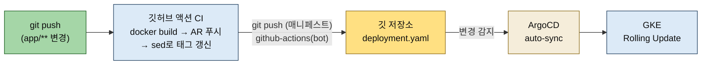
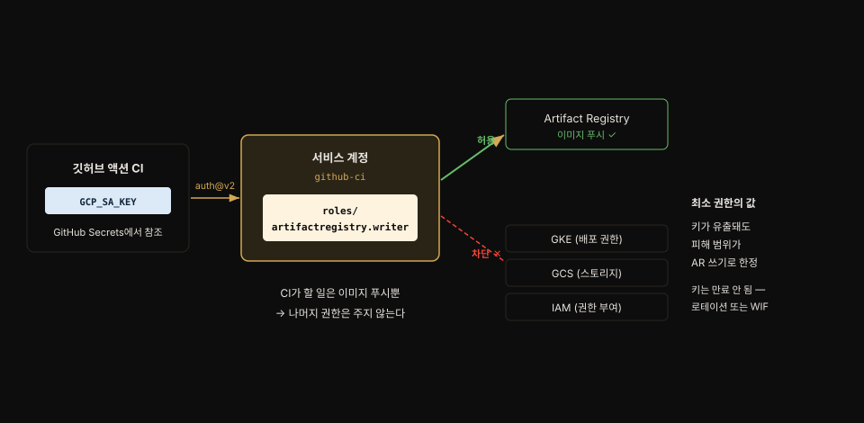
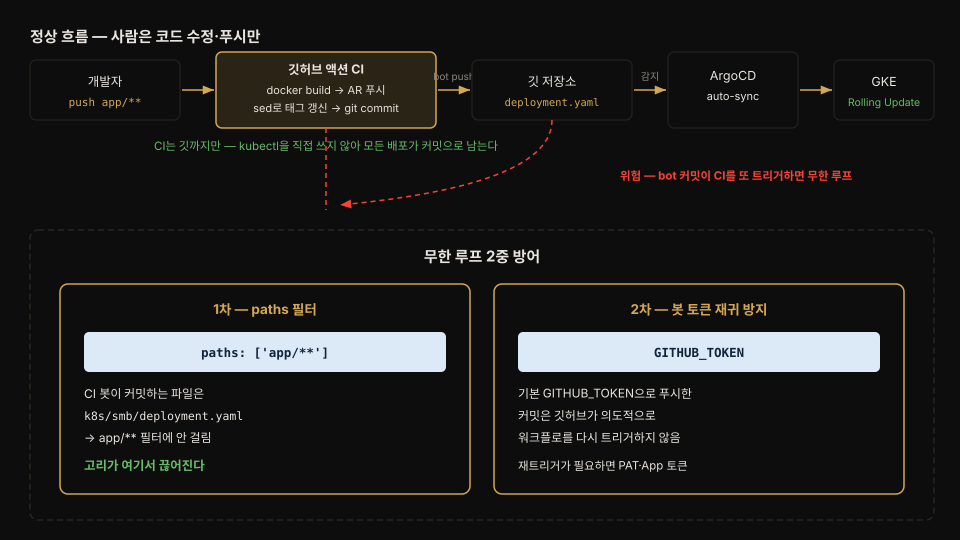
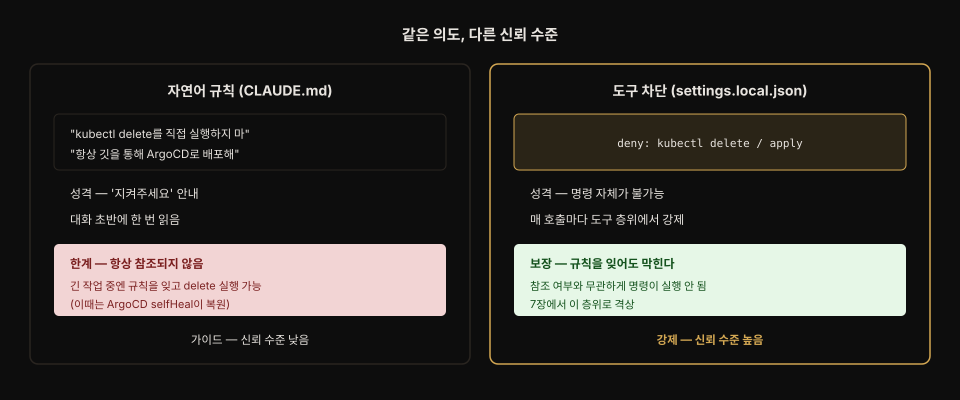

# 깃허브 액션 CI와 ArgoCD 연결 — 빌드부터 배포까지
---
> **매번 '빌드해줘'라고 말하던 수동 빌드를 깃허브 액션 CI로 자동화하는 절차(서비스 계정 최소 권한 → GitHub Secrets → 워크플로 YAML)를 설명할 수 있고, CI가 빌드한 SHA 태그를 매니페스트에 커밋해 ArgoCD가 배포하게 하는 연결에서 왜 CI가 kubectl을 직접 쓰지 않는지 답할 수 있으며, CI 봇 커밋이 CI를 다시 트리거하는 무한 루프를 두 겹으로 막는 원리와 CLAUDE.md 행동 규칙 체험까지 말할 수 있다.**


## 📌 핵심 요약

> 3장 후반부는 마지막 수동 작업 두 가지(이미지 빌드, 매니페스트 태그 반영)를 CI에 넘겨, "코드 수정 → git push" 두 단계로 배포가 끝나는 파이프라인을 완성합니다.

배포는 자동화했지만(03-01) 이미지 빌드는 아직 수동입니다. 깃허브 액션으로 빌드를 자동화하고 CI가 매니페스트 태그까지 갱신해 깃에 커밋하면, ArgoCD가 이어받아 배포합니다. 사람의 일은 코드를 고치고 푸시하는 것뿐입니다.




## 🎯 학습 목표

> 이 절을 읽고 나면 다음 세 가지를 할 수 있습니다.

1. CI용 GCP 서비스 계정에 `artifactregistry.writer` 하나만 주는 최소 권한 설계와 그 이유를 설명할 수 있습니다.
2. CI-ArgoCD 연결에서 "CI는 깃까지만, 배포는 ArgoCD가"라는 역할 분리가 GitOps 원칙과 어떻게 이어지는지 답할 수 있습니다.
3. CI 봇 커밋의 무한 루프를 막는 2중 방어(paths 필터 + GITHUB_TOKEN 재귀 방지)를 말할 수 있습니다.


## 1. 아직 남은 수동 작업과 CI 도구 선택

> 코드를 고칠 때마다 '빌드해줘'를 말하는 것이 마지막 불편입니다. CI를 도입하면 푸시 이후가 전부 자동이 됩니다.

**CI(Continuous Integration)는 코드를 깃에 푸시할 때마다 자동으로 빌드하고 테스트하는 것입니다.** 지금은 코드 수정 → '빌드해줘'(수동) → 빌드 완료 대기 → 매니페스트 태그 변경 → git push 다섯 단계인데, CI를 도입하면 코드 수정 → git push 두 단계로 끝나고 나머지는 자동입니다.

클로드 코드가 GitHub Actions를 추천하는 이유는 네 가지입니다.

- GitHub 네이티브 — 별도 서버 설치 없이 YAML 파일만 추가합니다.
- YAML 선언적 — CI 설정 자체가 코드로 관리됩니다.
- 월 2,000분 무료 — Notiflex 실습에 충분합니다.
- GCP 연동 간편 — `google-github-actions`로 한 번에 인증합니다.

비교 대상과의 차이도 표로 정리됩니다.

| 구분 | GitHub Actions | Cloud Build | GitLab CI | Jenkins |
|------|---------------|-------------|-----------|---------|
| 추천도 | ★★★ | ★★ | ★ | ★ |
| 서버 | 불필요 | 불필요 | 불필요 | GKE에 배포 필요 |
| 무료 | 월 2,000분 | 월 120분 | 월 400분 | 무료(서버 비용) |
| 깃허브 연동 | 네이티브 | 별도 트리거 | GitLab 전용 | 플러그인 |

"Cloud Build는 이미 쓰고 있잖아?"라는 의문에 대한 답이 좋은 구분점입니다. `gcloud builds submit`은 로컬에서 수동 실행한 것이고, 깃허브 푸시 이벤트로 자동 트리거하려면 Cloud Build Trigger를 별도로 설정하고 깃허브-GCP 연결 설정도 추가해야 합니다. 깃허브 액션은 깃허브 안에 내장되어 있어 YAML 파일만 추가하면 바로 동작합니다. Jenkins는 별도 서버를 GKE에 배포해야 해서 e2-medium 클러스터에는 부담이 큽니다.


## 2. 깃허브 액션 CI 만들기

> 서비스 계정(최소 권한) → GitHub Secrets → 워크플로 YAML → 테스트 푸시, 네 단계로 CI를 만듭니다.

CI가 Artifact Registry에 이미지를 푸시하려면 GCP 인증이 필요합니다. 사람 계정(`gcloud auth login`)이 아니라 프로그램용 서비스 계정을 만들고, 필요한 최소 권한만 부여합니다:

```bash
# 서비스 계정 생성 + artifactregistry.writer 권한 하나만 부여 — 책 §3.4.2
gcloud iam service-accounts create github-ci --display-name="GitHub Actions CI"
gcloud projects add-iam-policy-binding {PROJECT} \
    --member="serviceAccount:github-ci@{PROJECT}.iam.gserviceaccount.com" \
    --role="roles/artifactregistry.writer"

# 키 발급 → GitHub Secrets 등록 → 로컬 키 파일 즉시 삭제
gcloud iam service-accounts keys create /tmp/github-ci-key.json \
    --iam-account=github-ci@{PROJECT}.iam.gserviceaccount.com
gh secret set GCP_PROJECT_ID --body "{PROJECT}"
gh secret set GCP_SA_KEY < /tmp/github-ci-key.json
rm /tmp/github-ci-key.json
```

권한을 `artifactregistry.writer` 하나만 준 이유가 핵심입니다. CI가 할 일은 이미지 푸시뿐이므로 GKE·GCS·IAM에는 접근할 필요가 없고, 권한이 좁을수록 키가 유출됐을 때 피해 범위도 좁아집니다.



GitHub Secrets는 비밀 정보를 저장소에 안전하게 두는 기능입니다. 워크플로에서 `${{ secrets.GCP_SA_KEY }}`로 참조하고 로그에도 `***`로 마스킹됩니다.

책은 노트로 서비스 계정 키가 만료되지 않는다는 점도 경고합니다. 명시적으로 삭제하기 전까지 영원히 유효하므로, 분기·반기 단위 키 로테이션 규칙을 두는 팀이 많습니다.

실무에서는 한 발 더 나갑니다. 아예 장기 키를 두지 않고, 그때그때 짧게 유효한 인증을 발급받는 방식으로 전환하는 것이 일반적입니다. 이것이 **WIF(Workload Identity Federation)입니다.** 깃허브 OIDC 토큰을 GCP가 임시 자격증명으로 교환해 주므로 저장소에 보관할 키 자체가 사라집니다. 구글도 공식 문서에서 '가능하면 WIF를 쓰세요'라고 권장하지만, 초기 설정이 복잡해 책은 키 기반으로 시작합니다.

워크플로 YAML의 골격은 push 트리거(main 브랜치, `paths: ['app/**']`) → checkout → GCP 인증(auth@v2) → gcloud 설치 → Docker-AR 인증 → 빌드·푸시입니다. 태그는 `$(echo $GITHUB_SHA | cut -c1-7)`로, 커밋 SHA 앞 7자리입니다.

왜 v0.1.2 같은 버전 대신 SHA일까요? 사람이 붙이는 태그는 실수로 다른 코드에 같은 태그를 붙일 수 있지만, 깃 SHA는 커밋마다 자동으로 생기는 고유 ID입니다. 이미지 태그만 보고 `git log a1b2c3d`로 정확히 어떤 코드인지 추적할 수 있습니다. 같은 커밋을 다시 빌드해도 태그가 그대로 결정되므로 태그와 커밋의 대응이 늘 재현됩니다.

푸시하면 `gh run watch`로 48초 만에 성공을 확인합니다. 실패 시에는 Workflow → Job → Step 3단 구조에서 실패 Step으로 원인을 좁힙니다.

- Checkout 실패 → 토큰 권한
- auth 실패 → GCP_SA_KEY
- Build and Push 실패 → Dockerfile 문제


## 3. CI + ArgoCD 연결

> CI가 빌드한 태그를 매니페스트에 반영하는 마지막 수동 작업을 CI 자신에게 맡깁니다 — 단 kubectl이 아니라 깃을 통해서.

빠진 조각은 하나입니다. CI가 빌드 완료 후 `deployment.yaml`의 이미지 태그를 자동으로 수정하고 깃에 푸시하면 됩니다. 전체 흐름은 코드 푸시 → GHA Docker 빌드(SHA 태그) → Artifact Registry 푸시 → sed로 태그 교체 → git commit & push(CI가 자동으로) → ArgoCD 감지 → 자동 배포입니다.

핵심 원칙은 CI가 `kubectl apply`를 직접 호출하지 않는다는 것입니다. CI가 kubectl을 쓰면 깃에 기록이 남지 않지만, 깃을 통하면 모든 배포가 커밋으로 추적됩니다. 역할이 분리되어(CI = 빌드+매니페스트 업데이트+push, ArgoCD = 깃 감시+동기화) 문제가 생겼을 때 어디서 잘못됐는지 찾기도 쉽습니다.

기존 ci.yaml에 Step 3개를 추가한 전체 파일입니다. 이 실습본은 **키 기반 인증**(뒤에 나오는 WIF가 아님 — §"인증을 WIF로 바꾸기" 참조)이며, YAML·GitHub Actions 문법이 처음이라도 읽히도록 줄마다 주석을 답니다.

```yaml
# .github/workflows/ci.yaml — 책 §3.5.2 실습본 (키 기반 인증)
# 이 파일 하나가 "워크플로 1개"다. 저장소의 .github/workflows/ 아래에 두면 GitHub이 자동 인식한다.

# 워크플로 표시 이름 (Actions 탭에 이 이름으로 뜬다)
name: CI

# on = 언제 이 워크플로를 돌릴지 (트리거 조건)
on:
  # git push가 일어날 때
  push:
    # 그중 main 브랜치로의 push만
    branches: [main]
    # 그중 app/ 아래 파일이 바뀐 push만 (매니페스트 변경은 제외 → 무한 루프 1차 방어)
    paths: ['app/**']

# permissions = 이 워크플로가 쓰는 자동 토큰(GITHUB_TOKEN)의 권한
permissions:
  # 저장소 내용을 쓸 수 있게(=커밋·푸시 허용). 안 적으면 읽기 전용이라 push가 403
  contents: write

# jobs = 실행 단위 묶음. job은 여러 개 둘 수 있고 기본은 병렬 실행
jobs:
  # build-and-push = job의 id (이름은 자유. 아래 steps가 이 job에 속한다)
  build-and-push:
    # 이 job을 돌릴 가상머신 종류 (GitHub이 제공하는 우분투 최신)
    runs-on: ubuntu-latest
    # steps = job이 위→아래 순서로 실행할 단계들.
    # 아래에서 `- `(하이픈)으로 시작하는 항목 하나가 "1 Step(한 단계)"다.
    # 그 단계를 여는 키가 uses(남의 액션 실행)든 name+run(셸 명령 실행)든, 둘 다 한 단계다.
    steps:
      # ── Step 1: 내 저장소 코드를 VM에 내려받기 ──
      # uses = 남이 만든 액션을 불러다 씀
      - uses: actions/checkout@v4
        # with = 그 액션에 넘기는 입력값들
        with:
          # ${{ }} = 표현식, secrets.X = 저장소에 등록해 둔 비밀값 꺼내기
          token: ${{ secrets.GITHUB_TOKEN }}
          # 0 = 전체 히스토리 받기. 기본은 얕은 클론(1개 커밋만)이라 push가 거부될 수 있음
          fetch-depth: 0

      # ── Step 2: GCP에 로그인 (GCP에 로그인시켜 주는 공식 액션) ──
      - uses: google-github-actions/auth@v2
        with:
          # 서비스 계정 키(JSON)로 인증 ← 이게 "키 기반". WIF면 이 줄이 사라진다
          credentials_json: ${{ secrets.GCP_SA_KEY }}

      # ── Step 3: gcloud CLI 설치 (name 없이 uses만 있어도 한 단계다) ──
      - uses: google-github-actions/setup-gcloud@v2

      # ── Step 4: Docker가 Artifact Registry에 붙도록 인증 ──
      # name = 이 Step의 표시 이름 (Actions 로그에 이 줄로 뜬다)
      - name: Configure Docker for AR
        # run = VM에서 실행할 셸 명령 (한 줄)
        run: gcloud auth configure-docker {REGION}-docker.pkg.dev

      # ── Step 5: 이미지 빌드 + Artifact Registry로 푸시 ──
      - name: Build and Push
        # id = 이 Step에 이름표. 아래 Step에서 steps.build.outputs.X 로 결과를 꺼내려고 붙임
        id: build
        # run: | = 아래 여러 줄을 통째로 셸 스크립트로 실행 (| 는 "여러 줄 문자열" YAML 문법)
        run: |
          # 이미지 주소를 변수에 담음
          IMAGE={REGION}-docker.pkg.dev/{PROJECT}/notiflex/api
          # $GITHUB_SHA = 현재 커밋 SHA(GitHub이 자동 주입). cut -c1-7 = 앞 7자리만
          TAG=$(echo $GITHUB_SHA | cut -c1-7)
          # app/ 폴더로 이미지 빌드, 태그는 위에서 만든 SHA
          docker build -t $IMAGE:$TAG app/
          # Artifact Registry로 이미지 업로드
          docker push $IMAGE:$TAG
          # 다음 Step에 넘길 출력값 저장 ($GITHUB_OUTPUT은 GitHub이 읽는 특수 파일)
          echo "image=$IMAGE:$TAG" >> $GITHUB_OUTPUT

      # ↓↓ 여기서부터 추가된 Step 3개 — CI가 매니페스트를 고쳐 깃에 커밋하는 부분 ↓↓

      # ── Step 6: 매니페스트의 이미지 태그를 방금 빌드한 것으로 교체 ──
      - name: Update manifest image tag
        run: |
          # sed -i = 파일을 직접 치환. deployment.yaml의 이미지 줄을 새 태그로 교체
          # ${{ steps.build.outputs.image }} = 위 build Step이 내보낸 image 값
          sed -i "s|image: .*notiflex/api:.*|image: ${{ steps.build.outputs.image }}|" \
            k8s/smb/deployment.yaml

      # ── Step 7: 커밋 작성자(봇) 이름·이메일 설정 ──
      # 커밋을 남기려면 "누가 커밋했는지" 이름·이메일이 있어야 함
      - name: Configure git identity
        run: |
          # 커밋 작성자를 봇 이름으로
          git config user.name "github-actions[bot]"
          # 봇 전용 이메일
          git config user.email "41898282+github-actions[bot]@users.noreply.github.com"

      # ── Step 8: 매니페스트 변경을 깃에 커밋 + 푸시 ──
      - name: Commit and push manifest
        run: |
          # 변경된 매니페스트를 스테이징
          git add k8s/smb/deployment.yaml
          # 바뀐 게 없으면(재빌드 등) 여기서 정상 종료 (exit 0)
          git diff --cached --quiet && echo "no changes" && exit 0
          # 커밋 메시지에 SHA 기록
          git commit -m "ci: update image tag to $(echo $GITHUB_SHA | cut -c1-7)"
          # 매니페스트 변경을 깃에 push → 이 push는 paths 필터 밖이라 CI를 다시 안 부름
          git push
```

책이 짚는 핵심 변경은 네 가지입니다.

1. `permissions: contents: write` — GitHub Actions가 2023년부터 기본 GITHUB_TOKEN을 읽기 전용으로 발급하므로, 명시하지 않으면 마지막 git push가 403으로 실패합니다(가장 많이 막히는 지점).
2. `fetch-depth: 0` — 기본값인 얕은 클론(depth=1)이면 푸시가 거부될 수 있습니다.
3. `id: build` + `$GITHUB_OUTPUT` — Build Step의 이미지 태그를 다음 Step으로 넘기는 깃허브 액션 표준 방법입니다.
4. `git diff --cached --quiet && exit 0` — 같은 커밋을 재빌드하면 매니페스트가 안 바뀔 수 있는데, 이 안전장치가 없으면 'nothing to commit' 에러로 워크플로가 실패합니다.

가장 흔한 사고인 무한 루프(CI가 커밋을 푸시 → 그 푸시가 다시 CI를 트리거)는 두 겹으로 막혀 있습니다.



1차 방어는 `paths: ['app/**']` 필터입니다. CI 봇이 커밋하는 파일은 `k8s/smb/deployment.yaml`이라 필터에 걸리지 않아 고리가 끊어집니다. 2차 방어는 깃허브 자체의 봇 재귀 방지입니다. 기본 GITHUB_TOKEN으로 푸시한 커밋은 깃허브가 의도적으로 워크플로를 다시 트리거하지 않습니다(이 동작이 필요하면 PAT이나 GitHub App 토큰을 따로 써야 합니다).

"ArgoCD 감지가 3분이나 걸린다면?"에는 GitHub Webhook을 ArgoCD로 연결하면 푸시 즉시 Sync가 시작됩니다. 다만 지금은 포트포워딩으로만 접근하고 있어 외부 URL이 없으므로, 5장에서 Gateway API를 붙인 뒤가 자연스러운 순서라고 정리합니다.

"sed가 거칠다"는 지적에는 대안 둘을 소개합니다.

- Kustomize — `kustomize edit set image`로 구조적으로 수정합니다(7장 App of Apps에서 본격 사용).
- ArgoCD Image Updater — CI는 이미지 푸시까지만 하고, 별도 컴포넌트가 레지스트리를 감시해 매니페스트를 갱신합니다.

다만 지금은 'CI가 매니페스트를 수정해 깃에 커밋한다'는 기본 메커니즘을 눈으로 확인하는 게 중요하므로 첫 구현은 단순한 sed로 갑니다.

### 인증을 WIF로 바꾸기 — 위 코드에 WIF가 없는 이유

위 실습본 코드에는 WIF가 없습니다. §2에서 "실무는 WIF가 일반적"이라 했는데 코드는 키 기반이라 헷갈릴 수 있어, 둘의 차이를 여기서 정리합니다.

먼저 두 방식이 무엇이 다른지 봅니다. 인증이 필요한 이유는 같습니다 — CI(깃허브)가 GCP의 Artifact Registry에 이미지를 올리려면 "나는 이걸 할 권한이 있다"를 GCP에 증명해야 합니다. 그 증명 방법이 갈립니다.

| 항목 | 키 기반 (위 실습본) | WIF (완성본) |
|------|--------------------|-------------|
| 증명 수단 | 서비스 계정 키(JSON 파일) | 깃허브가 발급한 OIDC 토큰 |
| 저장소에 두는 것 | `GCP_SA_KEY`(장기 키) | 없음 — 토큰은 매 실행마다 새로 발급 |
| 유효 기간 | 삭제 전까지 영원 | 몇 분(실행이 끝나면 소멸) |
| 유출 시 위험 | 키가 새면 계속 악용 가능 | 이미 만료돼 재사용 불가 |

WIF(Workload Identity Federation)는 "장기 키를 저장소에 두지 말고, 실행할 때마다 깃허브가 신분증(OIDC 토큰)을 발급하면 GCP가 그걸 확인하고 짧은 임시 자격증명으로 바꿔 준다"는 방식입니다. 저장소에 보관할 키 자체가 사라지므로, 위 표의 마지막 두 줄(유효 기간·유출 위험)에서 키 기반보다 안전합니다.

바꾸는 건 워크플로에서 **딱 두 곳**입니다. 나머지(빌드·커밋·푸시)는 그대로입니다.

```yaml
# ── 변경 1: permissions에 id-token 추가 ──
# 깃허브가 OIDC 토큰을 발급하려면 이 권한이 필요하다
permissions:
  contents: write
  # ↓ 이 한 줄 추가. OIDC 토큰 발급 허용
  id-token: write

# ── 변경 2: auth Step에서 키 대신 WIF 좌표를 넘김 ──
      - uses: google-github-actions/auth@v2
        with:
          # 키 기반이던 이 줄을 삭제:
          # credentials_json: ${{ secrets.GCP_SA_KEY }}
          # GCP에 만들어 둔 "깃허브를 신뢰하는 창구"의 주소
          workload_identity_provider: projects/{PROJECT_NUM}/locations/global/workloadIdentityPools/{POOL}/providers/{PROVIDER}
          # 그 창구를 통과한 뒤 권한을 빌려 쓸 서비스 계정
          service_account: github-ci@{PROJECT}.iam.gserviceaccount.com
```

`workload_identity_provider`는 "GCP에 미리 만들어 둔, 깃허브를 신뢰하도록 설정한 창구"의 주소입니다. `service_account`는 "그 창구를 통과한 뒤 빌려 쓸 권한"(여기선 §2에서 만든 `artifactregistry.writer` 서비스 계정)입니다. 즉 키를 넘기는 대신, GCP 쪽에 창구(Provider)와 신뢰 관계를 한 번 세팅해 두면 이후로는 키 없이 인증됩니다.

다만 그 GCP 쪽 초기 설정(Workload Identity Pool·Provider 생성, 깃허브 저장소와 신뢰 연결)이 몇 단계 더 필요해서, 책은 개념을 먼저 이해하도록 키 기반으로 시작한 것입니다. 실습 저장소(GitAIOps)의 실물은 이미 WIF로 되어 있으므로, 처음부터 WIF로 세팅하면 완성본과 일치합니다.


## 4. 전체 파이프라인 테스트

> /version을 복원 커밋하고 푸시한 뒤, 사람은 아무것도 하지 않습니다.

3.3에서 만들었다 되돌렸던 `/version` 엔드포인트를 다시 넣고 커밋·푸시합니다. CI가 55초 만에 완료됩니다. `git pull` 후 로그를 보면 CI가 자동으로 만든 커밋이 보입니다:

```text
g7h8i9j ci: update image tag to f6g7h8i   ← CI(github-actions[bot])가 만든 커밋
f6g7h8i feat: restore /version endpoint for CI test
e5f6g7h ci: add GitHub Actions CI pipeline
```

커밋 주체가 `github-actions[bot]`이라 git log에서 사람의 커밋과 CI의 커밋이 구분됩니다. `kubectl get application`은 Synced/Healthy, 두 Pod의 이미지는 모두 CI가 빌드한 `f6g7h8i` — git push(app/**) → GitHub Actions CI → git push(매니페스트) → ArgoCD auto-sync → GKE Rolling Update로 이어지는 파이프라인이 완성됐습니다.

복습 실습에서 이 파이프라인을 직접 돌려 보니, CI가 매니페스트를 커밋한 직후에 잠시 어정쩡한 구간이 있었습니다. CI 봇 커밋은 깃에 올라왔는데 클러스터는 아직 이전 이미지였습니다. 그런데도 ArgoCD는 `Synced`로 보였습니다.

원인은 ArgoCD가 아직 새 커밋을 감지하기 전이었기 때문입니다. 그 `Synced`는 "자기가 아는 마지막 커밋과 클러스터가 일치한다"는 뜻이었습니다. `reconciledAt`(ArgoCD가 마지막으로 깃을 본 시각)이 CI 푸시보다 앞서 있으면 이 상태가 나옵니다. 기본 폴링(약 3분)이 한 바퀴 돌자 ArgoCD가 새 커밋을 인식했고, 곧 롤링 업데이트가 시작됐습니다.

여기서 `Synced`의 의미를 구분해 둘 만합니다. "최신 깃과 맞다"가 아니라 "내가 본 깃과 맞다"입니다. 즉시 배포를 원하면 UI의 Refresh(폴링을 안 기다리고 재비교)나 GitHub Webhook(위 §3.5.1의 즉시 Sync 방식)으로 당길 수 있습니다.


## 5. 마무리: CLAUDE.md에 행동 규칙 추가하기

> GitOps 원칙과 직결된 세 줄 규칙을 체험 삼아 넣어 보고, 자연어 규칙의 힘과 한계를 확인한 뒤 되돌립니다.

2장의 CLAUDE.md에는 환경 정보와 행동 규칙 8가지가 있었습니다(특히 5번 — 모든 kubectl 명령에 `--context gke-sysnet4admin_book_gitaiops` 지정). ArgoCD를 도입했으니 모든 변경은 깃을 통해야 하는데, 클로드 코드가 습관적으로 `kubectl delete`나 `kubectl apply`를 실행하면 GitOps 원칙이 깨집니다. 체험용 규칙 세 줄을 추가합니다 — "이 클러스터에서 kubectl delete를 직접 실행하지 마 / kubectl apply도 직접 하지 말고, 항상 깃을 이용해 ArgoCD로 배포해 / 변경 전에 항상 diff를 먼저 보여줘".

이후 "notiflex-api deployment를 지워줘"라고 요청하면, 클로드 코드가 규칙에 따라 kubectl delete를 직접 실행하지 않고 이 리소스가 ArgoCD Application 관리 대상임을 알린 뒤 올바른 절차(깃에서 제거 → commit & push → prune 자동 삭제)를 제안하고 영향 범위 확인을 먼저 권합니다. 규칙이 없었다면 그대로 delete를 실행할 위험이 컸습니다. 사용자가 일일이 가르치지 않아도 AI가 팀의 운영 원칙을 따르게 만드는 것이 CLAUDE.md의 역할입니다.

다만 한계도 정직하게 적혀 있습니다. 이 규칙이 항상 참조되는 것은 아닙니다. 클로드 코드는 대화 초반에 CLAUDE.md를 한 번 읽지만, 긴 설치 과정이 이어지면 규칙을 다시 참조하지 않고 kubectl delete를 실행하는 경우도 있습니다(이때는 ArgoCD selfHeal이 곧 복원). 자연어 규칙은 가이드지 강제가 아니라는 뜻입니다.

그래서 실무에서는 7장의 `settings.local.json`처럼 도구 차원에서 명령 자체를 차단하는 방법으로 격상하는 것을 권장합니다. 자연어 규칙은 '지켜주세요' 안내이고, 도구 차단은 명령 자체가 불가능해 신뢰 수준이 다릅니다.



책 실습은 4장 이후 헬름 설치와 ArgoCD 외 리소스 최초 등록에 `helm install`·`kubectl apply`를 쓰는 편이 흐름상 명확해서, 체험 규칙을 제거하고 진행합니다. 마지막으로 `/update-docs`로 JOURNEY.md에 3장 진행 현황(도구 선택: ArgoCD·GitHub Actions, 현재 버전 v0.1.1)을 기록하고 커밋합니다.


## 6. 3장 가드레일 살펴보기

> 3장부터 3-프롬프트 패턴(탐색 → 비교 → 실행)이 등장합니다. 도구를 고르는 서브챕터마다 참조 파일이 나뉘어 있습니다.

| 서브챕터 | 유형 | 참조 파일 | 역할 |
|----------|------|----------|------|
| 3.2 탐색/비교 | 탐색과 비교 | decision-guides/ch3/3.2-gitops-tool.md | ArgoCD 추천 이유 + 대안 비교 |
| 3.2 실행 | 실행 | prompt-guardrails/ch3/3.2-argocd.md | ArgoCD 설치 절차 |
| 3.3 실행 | 실행 | prompt-guardrails/ch3/3.3-rolling-update.md | 롤링 업데이트 + 롤백 |
| 3.4 탐색/비교 | 탐색과 비교 | decision-guides/ch3/3.4-ci-tool.md | 깃허브 액션 추천 + 대안 비교 |
| 3.4 실행 | 실행 | prompt-guardrails/ch3/3.4-github-actions.md | CI 워크플로우 작성 |
| 3.5 실행 | 실행 | prompt-guardrails/ch3/3.5-ci-argocd.md | CI-ArgoCD 연결 |
| 3장 마무리 체험 | 실행 | prompt-guardrails/ch3/claudemd-example.md | 예시 규칙 추가 → 삭제 테스트 → 되돌림 |

두 폴더의 역할이 다릅니다. decision-guides/는 독자가 '어떤 걸 쓸까?', '비교해줘'라고 물을 때 참조하는 파일입니다(추천 이유·비교 테이블의 출처). prompt-guardrails/는 '진행해줘'라고 할 때 실행 순서를 안내하는 파일입니다.


## 🔍 심화 학습

> 책이 지나가듯 언급한 배경들의 원전과, 완성본 저장소의 진화를 확인합니다. 책 밖 조사 내용입니다.

### "2023년부터 기본 GITHUB_TOKEN이 읽기 전용" — 원전 확인

핵심 변경 ①의 근거는 GitHub 공식 changelog입니다. 2023년 2월 2일부터 신규 저장소·조직의 GITHUB_TOKEN 기본 권한이 read-only로 바뀌었습니다. 워크플로 YAML의 `permissions` 키로 필요한 scope만 열어 주는 것이 권장 패턴이 됐습니다. `permissions` 키를 쓰면 명시하지 않은 scope는 자동으로 none이 된다는 점도 알아 둘 지점입니다 — `contents: write` 한 줄이 곧 최소 권한 선언입니다.

### 완성본 ci.yaml은 키 기반에서 WIF로 진화해 있다

책 §3.4가 "일단 키 기반으로 시작하고, 실무에서는 WIF로 전환하는 게 일반적"이라고 예고했는데, 완성본 [notiflex-platform의 .github/workflows/ci.yaml](https://github.com/sysnet4admin/notiflex-platform/blob/main/.github/workflows/ci.yaml)(2026-07 확인)을 열어 보면 실제로 전환이 끝나 있습니다. `permissions`에 `id-token: write`가 추가되고, `google-github-actions/auth@v2`가 `credentials_json` 대신 `workload_identity_provider`와 `service_account`를 받습니다. 키 파일(GCP_SA_KEY)이 저장소 어디에도 없습니다. 이미지 태그도 `sha-${GITHUB_SHA::7}` 형식으로 정돈돼 있습니다. 책의 예고가 완성본에서 실물로 확인되는 좋은 대조 지점입니다.

복습 실습에서 직접 쓰는 저장소의 `ci.yaml`도 같은 WIF 형태였습니다. 본문 §3.4.2가 보여 주는 키 기반 코드(`credentials_json: ${{ secrets.GCP_SA_KEY }}`)와는 실물이 달랐습니다. `id-token: write` 권한과 `workload_identity_provider`·`service_account` 두 줄이 있고 `GCP_SA_KEY`는 없습니다.

코드를 한 줄 고쳐 푸시해 CI를 돌려 봤습니다. `google-github-actions/auth@v2` 단계가 키 없이 통과했습니다. GitHub이 발급한 OIDC 토큰을 GCP가 몇 분짜리 임시 자격증명으로 교환해 준 것입니다. 따라서 이 절을 따라 할 때는 본문의 키 기반 코드를 그대로 쓰기보다, 처음부터 WIF로 세팅하는 편이 실물·완성본과 일치합니다.

### 봇 재귀 방지의 공식 근거

2차 방어(GITHUB_TOKEN 푸시는 워크플로를 재트리거하지 않음)는 GitHub 공식 문서에 명시된 의도적 설계입니다 — GITHUB_TOKEN을 사용한 이벤트는 새 워크플로 실행을 만들지 않으며, 우발적인 재귀 워크플로 실행을 막기 위한 것이라고 문서가 밝힙니다. 반대로 말하면, CI 커밋이 다른 워크플로를 트리거해야 하는 설계(예: 매니페스트 저장소가 분리된 경우)에서는 PAT/GitHub App 토큰이 필요하다는 뜻이기도 합니다.


## 💡 실무 적용 포인트

> CI 파이프라인 설계와 권한 논리는 어느 조직의 CI 구축에서든 같은 형태로 반복됩니다.

### 이런 상황에서 사용하세요

- CI에서 클라우드 인증을 설계할 때 — 최소 권한 서비스 계정 → Secrets → (성숙하면) WIF 전환의 단계가 표준 경로입니다.
- 이미지 태그 전략을 정할 때 — 커밋 SHA 태그의 추적성·멱등성 논리가 `latest`·수동 버전 태그를 배제하는 근거가 됩니다.
- CI가 깃에 커밋하는 파이프라인을 만들 때 — permissions·fetch-depth·outputs·no-changes 가드 4종과 무한 루프 2중 방어를 체크리스트로 씁니다.

### 주의할 점

- ⚠️ `permissions: contents: write` 누락은 마지막 push에서야 403으로 드러납니다 — 빌드가 성공하고 나서 실패하므로 원인을 엉뚱한 곳에서 찾기 쉽습니다.
- ⚠️ 서비스 계정 키는 만료되지 않습니다 — 로테이션 규칙을 정하거나 WIF로 전환하기 전까지는 키 자체가 상시 리스크입니다.
- ⚠️ CLAUDE.md 자연어 규칙은 항상 참조된다는 보장이 없습니다 — 반드시 지켜야 할 통제는 permissions·hooks 층위로 내려야 합니다(01-03 심화와 같은 결론).


## ✅ 핵심 개념 체크리스트

- [ ] CI 도입 전후의 배포 단계 변화(5단계 → 2단계)를 설명할 수 있는가?
- [ ] 서비스 계정에 artifactregistry.writer만 주는 이유를 말할 수 있는가?
- [ ] CI가 kubectl 대신 깃 커밋으로 배포를 전달하는 이유(추적성·역할 분리)를 답할 수 있는가?
- [ ] 무한 루프 2중 방어(paths 필터, 봇 토큰 재귀 방지)를 설명할 수 있는가?
- [ ] SHA 태그가 버전 태그보다 나은 두 가지 근거(추적성·멱등성)를 말할 수 있는가?


## ☕ Spring 앱 개발 관점

> 이 절의 CI 골격(서비스 계정 최소 권한 → Secrets → 워크플로 YAML → SHA 태그 → 매니페스트 커밋 → ArgoCD)은 언어와 무관하게 그대로 쓰입니다. 달라지는 건 워크플로 안에서 이미지를 만드는 Step뿐입니다. 책에 Spring 예제는 없으므로 아래는 공식 문서로 보강한 내용입니다.

그대로 옮겨지는 부분부터 봅니다. `permissions: contents: write`, `fetch-depth: 0`, `id: build` + `$GITHUB_OUTPUT`, no-changes 가드, 무한 루프 2중 방어(paths 필터 + GITHUB_TOKEN 재귀 방지), SHA 태그의 추적성·멱등성 — 이 논리는 빌드 대상이 Go든 Spring이든 똑같습니다. GitHub Actions가 이미지와 매니페스트만 다루지 앱 언어를 모르기 때문입니다.

갈라지는 지점은 **이미지를 만드는 Step 하나**입니다. 책은 Go 바이너리를 `docker build`로 굽지만, Spring Boot는 JDK를 얹고 Gradle/Maven으로 JAR을 만든 뒤 이미지를 뽑는 과정이 필요합니다.

### 워크플로에서 갈리는 Step — Dockerfile 없이 굽기

Spring Boot는 `Dockerfile`을 손으로 쓰는 대신 **빌드 도구가 이미지를 직접 만드는** 경로가 표준입니다. Gradle의 `bootBuildImage`(Cloud Native Buildpacks 기반)나 구글의 Jib이 JAR을 레이어로 나눠 이미지까지 한 번에 뽑고, 레지스트리 푸시까지 옵션 하나로 처리합니다.

```yaml
# .github/workflows/ci.yaml — Spring Boot일 때 Build Step만 교체 (나머지는 이 절과 동일)
      - uses: actions/setup-java@v4
        with:
          distribution: temurin         # JDK 배포판
          java-version: '21'
          cache: gradle                  # 의존성 캐시로 빌드 시간 단축

      - name: Build and Push image
        id: build
        run: |
          IMAGE={REGION}-docker.pkg.dev/{PROJECT}/notiflex/api
          TAG=$(echo $GITHUB_SHA | cut -c1-7)
          # Dockerfile 없이 Buildpacks로 이미지 빌드 + 레지스트리 푸시를 한 번에
          ./gradlew bootBuildImage \
            --imageName=$IMAGE:$TAG --publishImage
          echo "image=$IMAGE:$TAG" >> $GITHUB_OUTPUT
```

`bootBuildImage`는 JAR을 OCI 이미지로 만들고 `--publishImage`로 레지스트리에 바로 올립니다. `docker build` + `docker push` 두 명령을 한 Step으로 합친 셈이라, 이 뒤의 매니페스트 태그 갱신·커밋·ArgoCD 감지는 이 절 §3과 완전히 같습니다. `setup-java`의 `cache: gradle`은 의존성을 회차마다 다시 받지 않게 해 CI 시간을 줄이는데, Go 빌드에는 없던 Spring/JVM 특유의 최적화입니다.

### 태그 전략은 그대로, 다만 이미지가 무겁다

SHA 태그의 추적성·멱등성 논리는 언어와 무관하게 유효합니다. 다만 Spring 앱 이미지는 JRE를 포함해 Go 정적 바이너리보다 무겁습니다(수십 MB → 수백 MB). Rolling Update(03-01 §4)에서 새 Pod가 이미지를 당겨오는 시간이 그만큼 길어지므로, 이미지 pull 시간이 readiness 지연으로 이어지지 않게 03-01 §Spring 관점에서 본 `readinessProbe`의 `initialDelaySeconds`·`failureThreshold`를 넉넉히 두는 편이 안전합니다. 이미지를 더 줄이려면 GraalVM 네이티브 이미지(`bootBuildImage`가 지원)로 JVM을 빼는 선택지도 있지만, 학습 단계에서는 기본 JRE 이미지로 충분합니다.


## 면접에서 받을 만한 질문

> "CI/CD 파이프라인을 어떻게 구성했나"라는 질문에 이 절의 역할 분리 논리가 그대로 답이 됩니다.

1. CI와 CD의 경계를 어디에 두었나요? CI는 어디까지 하고 배포는 누가 하나요?
2. CI가 `kubectl apply`로 직접 배포하지 않고 굳이 깃에 커밋해서 ArgoCD에 넘기는 이유는 무엇인가요?
3. CI 봇이 매니페스트를 커밋하면 그 푸시가 다시 CI를 트리거하는 무한 루프가 생길 수 있는데, 어떻게 막나요? 두 겹으로 설명해 보세요.
4. 이미지 태그를 `v0.1.2` 같은 버전 대신 커밋 SHA로 붙이면 뭐가 좋은가요?
5. CI용 서비스 계정에 권한을 `artifactregistry.writer` 하나만 준 이유는 무엇인가요? 실무에서는 이 키를 어떻게 없애나요?

### 빈칸 채우기 — ci.yaml 무한 루프 방어

```yaml
on:
  push:
    branches: [main]
    paths: ['app/**']       # ①이 필터가 무한 루프를 막는 원리는?
permissions:
  contents: _____           # ②CI가 매니페스트를 커밋/푸시하려면 필요한 scope
steps:
  - uses: actions/checkout@v4
    with:
      fetch-depth: _____    # ③얕은 클론이면 푸시가 거부될 수 있어 필요한 값
```

> 세 빈칸의 답과 위 5개 질문의 답은 아래 §정답에 있습니다. 먼저 스스로 답한 뒤 펼쳐 보세요.

3장으로 GitOps + CI/CD 파이프라인이 완성됐지만, 서비스가 잘 돌아가는지 어디서 문제가 나는지는 여전히 알 수 없습니다. 새벽에 "서비스가 안 된다"는 연락이 오면 어디서부터 봐야 할까요 — 다음 절 [04-01 관측 가능성과 메트릭](./04-01.관측%20가능성과%20메트릭%20—%20프로메테우스·그라파나.md)이 그 답을 만듭니다.


## 정답 (자답 후 펼치기)

> 위 §면접에서 받을 만한 질문의 5개와 빈칸 3개에 *먼저 자답한 뒤* 아래를 읽으세요. 자답 없이 먼저 읽으면 학습 효과가 0입니다.

### 정답 1 — CI와 CD의 경계

CI는 빌드하고 매니페스트 태그를 갱신해 깃에 커밋하는 데까지입니다. 배포는 ArgoCD가 그 깃을 감지해 수행합니다. 경계선은 "깃"입니다 — CI는 깃에 쓰는 것으로 끝내고, 클러스터에 반영하는 일은 ArgoCD에 넘깁니다. 이렇게 나누면 문제가 났을 때 CI 로그(빌드·커밋)와 ArgoCD(동기화) 어느 쪽인지 원인을 좁히기도 쉽습니다.

### 정답 2 — CI가 kubectl을 안 쓰는 이유

CI가 `kubectl apply`를 직접 호출하면 그 배포가 깃에 기록되지 않아, "지금 클러스터에 뭐가 떠 있는지"의 근거가 사라집니다(03-01의 드리프트·이력 부재 문제가 그대로 재발). 깃을 통하면 모든 배포가 커밋으로 남아 누가·언제·무엇을 배포했는지 추적됩니다. GitOps 원칙("깃이 정본")을 CI 단계에서 지키는 방법이 곧 "CI는 깃까지만"입니다.

### 정답 3 — 무한 루프 2중 방어

1차는 `paths: ['app/**']` 필터입니다. CI 봇이 커밋하는 파일은 `k8s/smb/deployment.yaml`이라 이 필터에 걸리지 않아, 봇 커밋이 CI를 다시 부르지 못합니다. 2차는 GitHub 자체의 봇 재귀 방지입니다. 기본 `GITHUB_TOKEN`으로 푸시한 커밋은 GitHub이 의도적으로 새 워크플로를 트리거하지 않습니다(우발적 재귀 실행 방지). 두 겹 중 하나만 있어도 막히지만, 둘 다 두면 필터를 실수로 넓혀도 토큰 방어가 남습니다.

### 정답 4 — SHA 태그의 이점

두 가지입니다. 추적성 — 이미지 태그(커밋 SHA 앞 7자리)만 보고 `git log a1b2c3d`로 정확히 어떤 코드인지 역추적할 수 있습니다. 멱등성 — 같은 커밋을 다시 빌드해도 태그가 그대로 결정되므로 태그와 커밋의 대응이 늘 재현됩니다. 사람이 붙이는 버전 태그는 실수로 다른 코드에 같은 태그를 붙일 수 있어 이 두 성질이 깨집니다.

### 정답 5 — 최소 권한 서비스 계정과 키 제거

CI가 할 일은 이미지 푸시뿐이라 `artifactregistry.writer` 하나면 충분하고, GKE·GCS·IAM 권한은 필요 없습니다. 권한이 좁을수록 키가 유출됐을 때 피해 범위도 좁아집니다. 다만 서비스 계정 키는 기본적으로 만료되지 않아 그 자체가 상시 리스크라, 실무에서는 아예 장기 키를 두지 않고 WIF(Workload Identity Federation)로 전환합니다 — GitHub OIDC 토큰을 GCP가 몇 분짜리 임시 자격증명으로 교환해 주므로 저장소에 보관할 키가 사라집니다.

### 정답 빈칸 — ①봇 커밋 파일이 필터 밖이라 재트리거 안 됨 ②`write` ③`0`

`paths: ['app/**']`은 CI를 `app/` 변경에만 반응하게 하는데, CI 봇이 커밋하는 건 `k8s/smb/deployment.yaml`이라 필터 밖이므로 고리가 끊어집니다. `contents: write`는 CI가 매니페스트를 커밋·푸시하려면 필요한 scope로, 2023-02-02 이후 기본 `GITHUB_TOKEN`이 read-only라 명시하지 않으면 마지막 push가 403으로 실패합니다. `fetch-depth: 0`은 기본값인 얕은 클론(depth=1)에서 푸시가 거부되는 것을 막습니다(전체 히스토리 확보).


## 🔗 참고 자료

- GITHUB_TOKEN 기본 권한 read-only 변경(2023-02-02): [GitHub changelog](https://github.blog/changelog/2023-02-02-github-actions-updating-the-default-github_token-permissions-to-read-only/)
- 깃허브 액션 워크플로 문법: [docs.github.com — Workflow syntax](https://docs.github.com/en/actions/writing-workflows/workflow-syntax-for-github-actions)
- GCP 인증 액션(키·WIF 겸용): [github.com/google-github-actions/auth](https://github.com/google-github-actions/auth)
- 완성본 ci.yaml 실물(WIF 전환본): [notiflex-platform/.github/workflows/ci.yaml](https://github.com/sysnet4admin/notiflex-platform/blob/main/.github/workflows/ci.yaml)
- 직접 실습한 저장소(GitAIOps): [github.com/scofe97/GitAIOps](https://github.com/scofe97/GitAIOps) — 이 절에서 만들 CI 워크플로·서비스 계정 연동·매니페스트 자동 커밋의 실물을 여기서 확인
- 다음 절 정독 노트: [04-01 관측 가능성과 메트릭](./04-01.관측%20가능성과%20메트릭%20—%20프로메테우스·그라파나.md)
