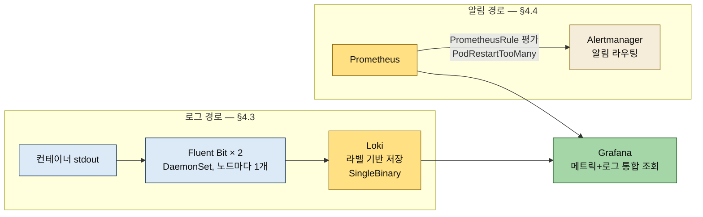

# 로그와 알림 — Loki·Fluent Bit·PrometheusRule
---
> **Loki의 라벨 기반 인덱싱이 풀텍스트 인덱싱(Elasticsearch)과 무엇을 맞바꿔 128Mi로 돌아가는지 설명할 수 있고, Fluent Bit가 DaemonSet으로 모든 노드의 컨테이너 로그를 Loki에 모으는 경로와 LogQL 조회를 답할 수 있으며, PrometheusRule로 알림 규칙을 YAML(깃)로 관리하는 것이 Grafana UI 알림보다 GitOps에 맞는 이유와 release 라벨·for 필드 같은 함정, 그리고 클로드 코드 메모리에 작업 컨텍스트를 남기는 마무리까지 말할 수 있다.**


## 📌 핵심 요약

> 4장 후반부는 로그 축(Fluent Bit → Loki → Grafana)과 알림 축(PrometheusRule → Alertmanager)을 세워, 메트릭·로그·알림 세 가지를 Grafana 하나에서 보는 관측 체계를 완성합니다.

메트릭은 '무엇이 잘못됐는지'를 알려주지만 '왜 잘못됐는지'는 로그에서 찾아야 합니다. 그리고 대시보드를 24시간 지켜볼 수는 없으므로 문제가 생기면 자동으로 알려주는 알림을 더합니다. 두 경로가 이번 절의 뼈대입니다.




## 🎯 학습 목표

> 이 절을 읽고 나면 다음 세 가지를 할 수 있습니다.

1. 라벨 기반 인덱싱과 풀텍스트 인덱싱의 트레이드오프(검색 속도 ↔ 메모리)를 수치와 함께 설명할 수 있습니다.
2. PrometheusRule YAML의 expr·for·labels(release)가 각각 무엇을 하는지, 왜 release 라벨이 없으면 규칙이 무시되는지 답할 수 있습니다.
3. CLAUDE.md(사용자 지시)와 클로드 코드 메모리(자동 작업 컨텍스트)의 역할 구분, 그리고 메모리의 한계(머신 로컬)를 말할 수 있습니다.


## 1. 로그 도구 선택 — Loki + Fluent Bit

> Fluent Bit가 모든 노드의 컨테이너 로그를 모아 Loki로 보내고, Loki는 라벨만 인덱싱해 저비용으로 저장합니다.

Prometheus로 '에러가 발생했다'는 알 수 있지만 '어떤 에러인지'는 모릅니다. Pod 로그를 보려면 `kubectl logs`를 일일이 실행해야 하고, Pod가 재시작되면 이전 로그가 사라집니다.

클로드 코드가 추천하는 조합은 Fluent Bit + Loki입니다. Fluent Bit는 DaemonSet으로 모든 노드에 1개씩 배포되어, 해당 노드의 모든 컨테이너 로그를 자동 수집해 Loki로 전송합니다. Loki는 로그를 라벨 기반으로 저장하고(풀텍스트 인덱싱이 없어 저장 비용이 낮습니다), LogQL 쿼리 언어(`{namespace="notiflex"} |= "error"`)로 조회합니다. 4.2에서 설치한 Grafana에 Loki 데이터소스만 추가하면 메트릭과 로그를 같은 대시보드에서 확인할 수 있습니다.

라벨 기반 인덱싱이 이 절의 핵심 개념입니다. 두 방식을 대비하면 트레이드오프가 선명해집니다.

- **풀텍스트 인덱싱**(Elasticsearch)은 로그 본문의 모든 단어를 색인합니다. "connection"이라는 단어가 어떤 로그에 있는지 바로 찾을 수 있지만, 인덱스가 거대해져 메모리를 많이 씁니다(최소 요구사항 2GB).
- **라벨 기반 인덱싱**(Loki)은 `{namespace, pod, container}` 같은 메타데이터만 인덱싱하고 본문은 색인하지 않습니다. 검색할 때는 먼저 라벨로 범위를 좁히고(`{namespace="notiflex"}`), 그 안에서 본문을 grep합니다(`|= "error"`). 풀텍스트보다 검색이 느릴 수 있지만 메모리 128Mi면 충분합니다.

LogQL은 PromQL과 구조가 비슷합니다. 둘 다 `{라벨}` 필터로 시작해 파이프로 조건을 연결하므로, Prometheus를 배웠으면 금방 익힙니다.

도구 비교의 결정 근거도 리소스입니다.

| 구분 | Loki + Fluent Bit | ELK Stack | Google Cloud Logging | Datadog Logs |
|------|------------------|-----------|---------------------|--------------|
| 추천도 | ★★★ | ★ | ★★ | ★★ |
| 메모리 | ~140Mi | ~2.5Gi | 0 (GKE 기본) | 에이전트 의존 |
| 인덱싱 | 라벨 기반 | 풀텍스트 | 풀텍스트 | 풀텍스트 |
| Grafana 통합 | 네이티브 | 별도 Kibana | 미통합 | 자체 UI |
| 비용 | 무료 | 무료(운영 비용 높음) | 무료 티어 | 유료 |

이미 ArgoCD(~500m CPU·500Mi)·kube-prometheus-stack(~210m·500Mi)·notiflex-api(~20m)가 올라가 있는 e2-medium 클러스터에서 Elasticsearch(Memory 2Gi 최소)는 불가능하고 Loki는 128Mi면 충분합니다. Google Cloud Logging은 GKE에서 자동 수집되므로 추가 설치가 없지만 Grafana와 통합되지 않아 'Prometheus에서 에러 발견 → Grafana에서 바로 Loki 로그 확인' 워크플로우가 불가능하다는 점이 탈락 사유입니다.


## 2. Loki + Fluent Bit 설치

> Loki는 SingleBinary 모드로 최소 리소스, Fluent Bit는 [OUTPUT]으로 Loki 서비스 DNS를 가리키게 설치합니다.

Loki는 SingleBinary 모드로 설치합니다. 이 모드는 Loki의 모든 기능을 하나의 Pod에서 실행해 리소스를 절약합니다. 트래픽이 많은 프로덕션에서는 read·write·backend 컴포넌트로 나눠 배포하는 Simple Scalable 모드나, 더 잘게 쪼개는 마이크로서비스 모드로 확장할 수 있고, 나중에 트래픽이 늘면 그때 전환하면 됩니다.[^loki-mode]

```yaml
# helm-values/loki.yaml — 책 §4.3.3 실습본 (발췌)
deploymentMode: SingleBinary
loki:
  useTestSchema: true      # schema_config 미설정 에러를 기본 스키마로 대체 — 학습용
  auth_enabled: false
  storage:
    type: filesystem
  commonConfig:
    replication_factor: 1
singleBinary:
  replicas: 1
  resources:
    requests:
      cpu: 10m
      memory: 128Mi
read:
  replicas: 0              # 마이크로서비스 모드 컴포넌트는 전부 0
write:
  replicas: 0
backend:
  replicas: 0
gateway:
  enabled: false
chunksCache:
  enabled: false
resultsCache:
  enabled: false
```

`useTestSchema: true`는 최신 Loki Helm chart가 schema_config를 직접 설정하지 않으면 'You must provide a schema_config' 에러를 내기 때문에 기본 스키마를 자동 생성하게 하는 학습용 우회입니다. `helm repo add grafana` 후 `helm install loki grafana/loki -n monitoring -f helm-values/loki.yaml`로 설치하면 `loki-0`이 Running이 됩니다.

Fluent Bit values의 핵심은 출력 대상입니다:

```yaml
# helm-values/fluent-bit.yaml — 책 §4.3.3 실습본 (발췌)
config:
  outputs: |
    [OUTPUT]
        Name                   loki
        Match                  *
        Host                   loki.monitoring.svc.cluster.local
        Port                   3100
        Labels                 job=fluent-bit
        Auto_Kubernetes_Labels on
resources:
  requests:
    cpu: 10m
    memory: 64Mi
```

`loki.monitoring.svc.cluster.local`은 쿠버네티스 내부에서 Service를 찾는 DNS 주소로, 형식은 {서비스이름}.{네임스페이스}.svc.cluster.local입니다 — 쿠버네티스가 이 DNS를 자동 해석해 Loki Pod의 IP로 연결해 줍니다. `helm install fluent-bit grafana/fluent-bit`로 설치하면 DaemonSet이라 노드 2개에 각각 1개씩 배포됩니다. 설치 시 "This chart is deprecated" 경고가 뜨는데, Grafana가 관리하던 Fluent Bit 차트가 공식 fluent/fluent-bit 차트로 이관되었다는 안내로 현재 버전은 정상 동작하며 이후 마이그레이션이 필요하면 그때 전환하면 됩니다.


## 3. 그라파나에서 로그 확인

> Grafana Explore에서 라벨 쿼리 한 줄, CLI에서는 labels·query_range API로 수집을 검증합니다.

Loki 데이터소스는 자동으로 추가되어 있어, Grafana Explore → Loki에서 `{namespace="notiflex"}`를 입력하면 로그가 바로 나타납니다. CLI 검증은 `port-forward svc/loki 3100:3100` 후 labels API(`/loki/api/v1/labels` → app·container·job·namespace·node_name·pod)와 query_range API로 합니다 — labels 응답에 나온 것들이 바로 Loki가 인덱싱하는 라벨이고, 검색은 이 라벨로 범위를 좁힌 뒤 본문을 훑는 구조입니다. 책이 알려주는 유용한 LogQL 세 가지는 다음과 같습니다.

- `{namespace="notiflex"} |= "error"` — 에러 로그만 필터
- `{namespace="argocd", container="argocd-server"}` — ArgoCD 서버 로그
- `{job="fluent-bit"} | json | level="warn"` — JSON 로그 파싱 후 warn만 필터

values 두 파일을 커밋하면("feat: add Loki + Fluent Bit for centralized logging") 관측 가능성 구조가 정리됩니다 — 메트릭(Prometheus)은 숫자("CPU 90%"), 로그(Loki)는 텍스트("connection refused at line 42"), 알림(Alertmanager)은 감지("에러율 5% 초과 → Slack 알림"), 세 가지 모두 Grafana 하나에서 확인합니다.


## 4. 알림 설정 — PrometheusRule

> 알림 조건을 YAML로 선언해 깃에 커밋하면 Prometheus가 감시하고 Alertmanager가 전송합니다 — 알림 규칙도 GitOps를 탑니다.

대시보드를 24시간 지켜볼 수는 없습니다. PrometheusRule + Alertmanager 조합을 추천받는데, Alertmanager는 4.2의 kube-prometheus-stack에 이미 포함되어 있으므로 알림 조건을 PrometheusRule YAML로 작성하기만 하면 됩니다.

Grafana UI에서도 알림을 만들 수 있지만 차이는 관리 방식입니다. PrometheusRule은 YAML 파일 → 깃 커밋 → ArgoCD 자동 반영으로 코드로 관리되고, Grafana Alerting은 UI 설정이 Grafana DB에 저장되어 깃에 남지 않습니다. 알림이 늘어날수록 세 지점에서 차이가 벌어집니다.

- 자산이 어디에 남는가 — 깃 vs Grafana DB
- 변경을 어떻게 검토하는가 — PR 리뷰 vs 누가 언제 바꿨는지 불명
- 장애 회고에서 '이 알림이 언제 왜 추가됐지?'에 답할 수 있는가 — git blame vs 추적 불가

GitOps로 ArgoCD까지 깔아온 흐름에서 알림만 UI로 빠지면 패턴이 끊깁니다. 실무에서 자주 쓰는 알림 4종(Pod 재시작 과다·CPU/메모리 임계치·5xx 에러율·배포 실패) 중 책은 Pod 재시작 알림으로 기본 개념을 익힙니다:

```yaml
# k8s/monitoring/pod-restart-alert.yaml — 책 §4.4.3 실습본
apiVersion: monitoring.coreos.com/v1
kind: PrometheusRule
metadata:
  name: pod-restart-alert
  namespace: monitoring
  labels:
    release: kube-prometheus   # 이 라벨이 없으면 Prometheus가 규칙을 무시
spec:
  groups:
    - name: notiflex-alerts
      rules:
        - alert: PodRestartTooMany
          expr: increase(kube_pod_container_status_restarts_total{namespace="notiflex"}[5m]) > 2
          for: 1m               # 조건이 1분간 지속되어야 발동 — 순간 spike 무시
          labels:
            severity: warning
          annotations:
            summary: "Pod {{ $labels.pod }} 재시작 과다"
            description: "네임스페이스 {{ $labels.namespace }}의 {{ $labels.pod }}가 5분 내 {{ $value }}회 재시작되었습니다."
```

두 함정이 실전적입니다.

하나는 `release: kube-prometheus` 라벨입니다. Prometheus Operator가 PrometheusRule을 자동으로 찾아 로드할 때 이 라벨이 없으면 무시합니다. Helm 설치 시 release 이름을 kube-prometheus로 지정했기 때문에 이 라벨과 일치해야 하며, `helm install my-prom ...`으로 설치했다면 `release: my-prom`이어야 합니다.

또 하나는 `for: 1m`입니다. 조건이 1분간 지속되어야 알림이 발동합니다(조건 충족 → Pending → 1분 지속 → Firing → 해소 → Resolved). CPU가 순간적으로 튀었다가 내려오는 spike로 불필요한 알림이 발생하는 걸 막습니다.

검증은 rules API로 합니다 — `curl .../api/v1/rules | jq`에서 PodRestartTooMany가 조회되면 정상 로드입니다.

> **복습 실습 메모: release 라벨 함정을 직접 재현했습니다.** GKE에서 규칙을 배포하고 라벨을 일부러 뺀 버전으로 덮어써 봤습니다. 그러자 `kubectl get prometheusrule`에는 오브젝트가 그대로 보이는데 rules API에서는 `notiflex-alerts` 그룹이 통째로 사라졌습니다. 라벨을 다시 붙이자 rules API에 다시 나타났습니다. 즉 오브젝트 존재와 Prometheus 로드는 별개입니다. `get`으로 보이니 배포됐다고 안심하면 알림이 영원히 안 울려도 원인을 못 찾습니다. 이것이 04-01의 'Sync/Health 초록이어도 파드는 Pending'과 같은 구조입니다. 한 계층의 초록불이 다른 계층의 정상을 보장하지 않습니다. 그래서 알림이 안 올 때 첫 확인이 `kubectl get prometheus -o yaml`의 `ruleSelector`와 규칙 라벨 일치 여부입니다.

한 가지 검증 함정도 있었습니다. Prometheus 컨테이너는 최소 이미지라 `wget`·`curl`이 없습니다. `kubectl exec ... -- wget`으로 파드 안에서 rules API를 부르면 `executable file not found`가 납니다. 검증은 파드 안이 아니라 `port-forward`로 터널을 뚫고 로컬에서 `curl`하는 방식이 맞습니다.

재미있는 것은 테스트의 반전입니다. `kubectl delete pod`로 Pod를 지워도 알림이 발동하지 않을 수 있습니다. `restarts_total`은 같은 Pod가 재시작되는 횟수를 추적하는데, delete로 지우면 기존 Pod가 없어지고 새 Pod가 재시작 카운터 0부터 시작하기 때문입니다. 실제로 알림을 보려면 잘못된 설정으로 컨테이너가 시작 직후 죽는 CrashLoopBackOff 같은 상황이 필요합니다. 다만 여기서 중요한 것은 규칙이 올바르게 로드되었는지의 확인이고, 그건 위에서 마쳤습니다.

Alertmanager 상태도 API(`:9093/api/v2/status`·`/alerts`)로 확인합니다. Slack 연동은 Alertmanager config의 receivers에 `slack_configs`(채널·api_url)를 추가하면 되지만, 책은 규칙 설정과 동작 확인까지만 다룹니다.


## 5. 마무리 — 메모리에 작업 컨텍스트 기록

> CLAUDE.md는 사용자가 적는 지시, 메모리는 클로드 코드가 자동으로 관리하는 작업 컨텍스트 — 두 기억 메커니즘의 역할이 다릅니다.

3~4장을 거치며 두 종류의 컨텍스트가 쌓였습니다. 하나는 결정입니다 — ArgoCD를 GitOps에, Loki를 로그 수집에 골랐고 왜 골랐는지에 대한 영구 기록입니다. 다른 하나는 작업 컨텍스트입니다 — PrometheusRule 임계값을 운영 데이터를 보고 조정하기로 한 TODO, 헬름 차트 사용을 선호한다는 작업 패턴, 분산 트레이싱은 8장으로 미뤄둔 항목. 두 종류는 보존 방식이 달라야 합니다 — 4장은 작업 컨텍스트(메모리), 결정 기록은 5장(아키텍처 결정 기록)에서 다룹니다.

클로드 코드의 기억 메커니즘은 두 가지입니다. CLAUDE.md는 사용자가 직접 적어 두는 지시 사항으로, 프로젝트 루트에 두면 매 세션 시작 시 전체가 로드됩니다. 메모리는 클로드 코드가 자동으로 기억·관리하는 것으로, 의미 있는 컨텍스트(반복되는 선호, 보류한 결정, 특정 도구에 대한 의도)가 발견되면 토픽 파일로 분류해 저장합니다.

메모리는 프로젝트가 아닌 홈 디렉터리 아래 `~/.claude/projects/<프로젝트>/memory/`에 저장됩니다. MEMORY.md는 세션 시작 시 첫 200줄까지 함께 로드되어 '어떤 기억이 있는지' 알려주는 목차 역할을 하고, 개별 토픽 파일은 관련 주제가 나올 때 클로드 코드가 직접 읽어 갑니다.

자동 기록이 항상 일어난다는 보장은 없으므로 명시 요청('메모리에 기록해줘' 한 줄)을 알아 두는 게 좋습니다. "PrometheusRule 임계값은 일단 5분/3회로 뒀는데, 운영 데이터를 보고 조정해야 해. 메모리에 TODO로 적어 둬"라고 하면 토픽 파일이 생기고 MEMORY.md 인덱스에 한 줄이 추가됩니다. 새 대화에서 "그 TODO가 있었지?"라고 물으면 인덱스에서 토픽을 찾아 이어 줍니다.

한계도 분명합니다 — 메모리는 머신 로컬이라 팀과 공유되지 않습니다. 'ArgoCD를 왜 골랐는지' 같은 영구 결정 기록은 깃에 두는 것이 자연스럽고, 5장에서 이 한계를 보완하는 방법(아키텍처 결정 기록)을 다룹니다. 마지막으로 `/update-docs`로 JOURNEY.md에 4장 시점의 도구 선택·리소스 사용량·아키텍처 상태를 기록하고 커밋합니다("ch4: 관측 가능성 스택 구축(메트릭, 로그, 알림)"). 메모리는 머신 로컬 저장이라 git status에는 보이지 않는다는 것도 확인 지점입니다.


## 6. 4장 가드레일 살펴보기

> 4장은 세 서브챕터(4.2·4.3·4.4) 모두 3-프롬프트 패턴을 씁니다 — 각각 독립적인 도구 선택이 필요하기 때문입니다.

| 서브챕터 | 유형 | 참조 파일 | 역할 |
|----------|------|----------|------|
| 4.2 탐색/비교 | 탐색과 비교 | decision-guides/ch4/4.2-metrics-monitoring.md | Prometheus 추천 + 대안 비교 |
| 4.2 실행 | 실행 | prompt-guardrails/ch4/4.2-prometheus-grafana.md | kube-prometheus-stack 설치 |
| 4.3 탐색/비교 | 탐색과 비교 | decision-guides/ch4/4.3-logging.md | Loki 추천 + ELK 비교 |
| 4.3 실행 | 실행 | prompt-guardrails/ch4/4.3-loki-fluentbit.md | Loki + Fluent Bit 설치 |
| 4.4 탐색/비교 | 탐색과 비교 | decision-guides/ch4/4.4-alerting.md | PrometheusRule 추천 + 비교 |
| 4.4 실행 | 실행 | prompt-guardrails/ch4/4.4-alerting.md | PrometheusRule 작성 |

가드레일의 resource-budget.md를 참조해 e2-medium 노드에 맞는 리소스 requests를 적용한 것도 이 장의 특징입니다 — 도구 선택만이 아니라 리소스 예산까지 가드레일이 통제합니다.


## 🔍 심화 학습

> Loki 설계 철학의 공식 근거와 Alertmanager의 다음 단계를 보강합니다. 책 밖 조사 내용입니다.

### Loki 라벨 인덱싱 — "Prometheus처럼, 그러나 로그를"

Loki의 공식 슬로건이 "Like Prometheus, but for logs"입니다. 시계열 메트릭의 라벨 모델을 로그에 그대로 가져와, 인덱스는 라벨(스트림 식별자)만 잡고 본문은 압축 청크로 오브젝트 스토리지에 두는 설계입니다.

그 덕분에 Elasticsearch 대비 운영 비용이 낮아지는 대신, 라벨 카디널리티 관리가 운영 핵심이 됩니다. Pod 이름처럼 값이 무한히 늘어나는 것을 라벨로 잡으면 스트림이 폭발합니다. 책 values의 `Auto_Kubernetes_Labels on`은 Pod에 붙은 라벨을 로그 스트림에 자동으로 부여하는데, 이때도 고카디널리티 라벨이 딸려 오지 않는지 살펴야 합니다. 상세 아키텍처는 [Grafana Loki 공식 문서](https://grafana.com/docs/loki/latest/get-started/overview/)와 이 저장소의 [06_observability 02-03 Grafana Loki](../../../../06_observability/02_LGTMStack/02-03.Grafana%20Loki.md)가 정본입니다.

### Alertmanager의 다음 단계 — 라우팅·그룹핑·억제

책은 Alertmanager를 '알림 라우팅' 한 줄로 지나가지만, 실무에서 만나는 본 기능은 그 라우팅 트리입니다. 세 축으로 나뉩니다.

- **route** — severity·team 라벨로 알림을 수신자별로 나눕니다.
- **grouping** — 같은 원인에서 쏟아지는 알림 폭주를 하나로 묶습니다.
- **inhibition** — 상위 장애가 발동 중일 때 그에 딸린 하위 알림을 잠재웁니다.

알림 설계를 임계치 나열이 아니라 SLO·Error Budget 기반으로 끌어올리는 관점은 [06_observability 01-04 SLO와 알림](../../../../06_observability/01_Foundations/01-04.SLO와%20알림%20—%20Error%20Budget,%20Burn%20Rate.md)이 정본이므로, PodRestartTooMany 같은 증상 알림에서 시작해 그쪽으로 확장하면 됩니다.

### PrometheusRule의 자동 발견 메커니즘

`release: kube-prometheus` 라벨 함정의 정체는 Prometheus CR(Custom Resource)의 `ruleSelector`입니다. kube-prometheus-stack이 만든 Prometheus 리소스는 "이 라벨이 붙은 PrometheusRule만 로드하라"는 셀렉터를 갖고 있고, Helm이 그 값을 release 이름으로 채웁니다. 즉 라벨은 관례가 아니라 셀렉터 매칭 조건입니다 — 규칙이 로드되지 않을 때 첫 확인 지점이 `kubectl get prometheus -o yaml | grep -A3 ruleSelector`인 이유입니다. 공식 설명은 [prometheus-operator 문서](https://prometheus-operator.dev/docs/developer/alerting/)에 있습니다.


## 💡 실무 적용 포인트

> 로그 스택 선택과 알림 규칙 관리는 소규모 클러스터 운영의 단골 결정입니다.

### 이런 상황에서 사용하세요

- 로그 스택을 고를 때 — 메모리 예산(2Gi vs 128Mi)과 Grafana 통합 여부가 ELK vs Loki를 가르는 첫 축이 됩니다.
- 알림 규칙을 추가할 때 — YAML(깃) 관리 vs UI 관리의 4가지 비교(자산 위치·PR 리뷰·git blame·추가 비용)가 판단 근거가 됩니다.
- 알림이 안 올 때 — release 라벨(셀렉터 매칭) → rules API 로드 확인 → for 지속 시간 순서로 좁히면 대부분 잡힙니다.

### 주의할 점

- ⚠️ 라벨 기반 인덱싱은 라벨 카디널리티가 생명입니다 — 요청 ID나 사용자 ID처럼 무한히 늘어나는 값을 라벨로 잡으면 Loki의 저비용 전제가 무너집니다.
- ⚠️ `kubectl delete pod`는 재시작 알림 테스트가 되지 않습니다 — restarts_total은 같은 Pod의 재시작 카운터라, 삭제 후 새 Pod는 0부터 시작합니다.
- ⚠️ deprecated 차트 경고(grafana/fluent-bit)는 당장 문제는 아니지만 이관 대상입니다 — 신규 구축이라면 공식 fluent/fluent-bit 차트에서 시작하는 것을 검토합니다.
- ⚠️ 복습 실습에서 확인한 알림 상태 판독: 규칙을 배포해도 조건이 거짓이면 알림은 `inactive`(Prometheus Alerts 화면에서 초록)로 대기합니다. 조건이 참이 되면 `pending`(노랑, `for` 시간 카운트다운)을 거쳐 `firing`(빨강, Alertmanager로 전송)이 됩니다. 파드가 건강하면 `inactive`가 정상이라, 알림이 안 울리는 것과 규칙이 고장 난 것을 혼동하면 안 됩니다. '알림을 본다'는 이 세 색을 읽는 것입니다.


## ✅ 핵심 개념 체크리스트

- [ ] 라벨 기반 인덱싱이 풀텍스트 대비 무엇을 포기하고 무엇을 얻는지 말할 수 있는가?
- [ ] {서비스}.{네임스페이스}.svc.cluster.local DNS가 어떻게 Loki Pod로 연결되는지 설명할 수 있는가?
- [ ] PrometheusRule의 release 라벨과 for 필드가 각각 어떤 사고를 막는지 답할 수 있는가?
- [ ] PrometheusRule(깃)과 Grafana Alerting(UI)의 관리 방식 차이 4가지를 나열할 수 있는가?
- [ ] CLAUDE.md와 메모리의 역할 구분, 메모리의 한계(머신 로컬)를 설명할 수 있는가?


## ☕ Spring 앱 개발 관점

> 이 절의 LogQL `{job="fluent-bit"} | json | level="warn"`은 로그가 **JSON**이어야 제대로 먹습니다. 그런데 Spring Boot 앱은 기본으로 사람이 읽는 텍스트 로그를 뱉습니다. 이 간극을 메우는 게 구조화 로깅입니다. 책은 Go 앱이라 다루지 않으므로 공식 문서(Spring Boot 로깅)로 보강합니다.

Loki에서 로그를 라벨로 좁힌 뒤 본문을 필터할 때, `| json`은 로그 한 줄을 JSON으로 파싱해 `level`·`logger` 같은 필드를 꺼내 씁니다. Spring Boot의 기본 로그는 `2026-07-13 10:15:00.111 WARN 1 --- [main] c.e.Demo : ...` 같은 텍스트라, 이대로는 `| json` 파싱이 되지 않습니다. Loki에서 필드 단위로 조회하려면 앱이 처음부터 JSON으로 로그를 찍어야 합니다.

Spring Boot 3.4부터는 구조화 로깅이 프레임워크에 내장되어, 프로퍼티 한 줄이면 콘솔 로그가 JSON으로 바뀝니다. 별도 인코더 의존성도 필요 없습니다:

```yaml
# application.yml — 콘솔 로그를 JSON(Logstash 포맷)으로 출력
logging:
  structured:
    format:
      console: logstash   # 또는 ecs (Elastic Common Schema)
```

이렇게 하면 로그 한 줄이 `{"@timestamp":"...","message":"...","logger_name":"...","level":"WARN",...}` 형태로 나옵니다. 앱은 이 JSON을 그냥 stdout으로 뱉기만 하면 됩니다. 그다음은 이 절 본문의 경로 그대로입니다 — Fluent Bit가 컨테이너 stdout을 긁어 Loki로 보내고, Grafana에서 `{namespace="notiflex"} | json | level="WARN"`으로 레벨별 조회가 됩니다. 즉 이 노트가 그린 로그 파이프라인에 Spring 앱을 얹으려면, 앱 쪽에서 바꿀 것은 프로퍼티 한 줄뿐입니다.

한 가지 주의는 로그 필드가 곧 라벨이 아니라는 점입니다. `| json`이 꺼내는 `level`·`logger_name`은 조회 시점에 파싱하는 값이지 Loki 인덱스 라벨이 아닙니다. 심화의 카디널리티 경고와 같은 맥락으로, 이런 필드를 인덱스 라벨로 승격하면 스트림이 폭발하므로 조회용 필터로만 두는 편이 안전합니다.


## 면접에서 받을 만한 질문

> 먼저 스스로 답을 소리 내어 말해 본 뒤, 아래 정답 섹션을 펼쳐 맞춰 봅니다. "로그·알림을 어떻게 설계했나"에는 리소스 트레이드오프와 GitOps 일관성 두 축으로 답하면 됩니다.

1. 왜 ELK(Elasticsearch)가 아니라 Loki를 골랐습니까? 인덱싱 방식의 트레이드오프와 함께 설명해 보세요.
2. 알림 규칙을 Grafana UI가 아니라 PrometheusRule YAML로 관리하면 무엇이 좋습니까? GitOps 관점에서 답해 보세요.
3. PrometheusRule을 배포했는데 알림이 오지 않습니다. 어디부터 확인하겠습니까?
4. `kubectl delete pod`로 Pod를 지웠는데 재시작 알림이 안 울립니다. 왜입니까?
5. CLAUDE.md와 클로드 코드 메모리는 각각 어떤 기억이고, 메모리의 한계는 무엇입니까?

### 빈칸 채우기 — PrometheusRule 두 필드

Pod 재시작 알림 YAML에서, Prometheus Operator가 이 규칙을 찾아 로드하게 하는 라벨은 `labels.①____: kube-prometheus`이고, 조건이 잠깐 튀었다 내려오는 spike로 오알림이 뜨는 걸 막는 필드는 `②____: 1m`입니다. 이 규칙이 Prometheus에 실제로 로드됐는지는 `/api/v1/③____` API로 확인합니다.

메트릭·로그·알림이 이제 Grafana 하나에 모였습니다. 남은 문제는 배포할 때마다 순간적으로 서비스가 끊긴다는 것입니다 — 5장 '무중단 배포'(week3)가 Gateway API와 Blue/Green으로 이 문제를 풉니다.


## 정답 (자답 후 펼치기)

### 정답 1 — 왜 Loki인가

라벨(메타데이터)만 인덱싱하고 본문은 색인하지 않아, 검색 일부를 양보하는 대신 메모리를 Elasticsearch의 2Gi에서 128Mi로 줄입니다. ArgoCD·kube-prometheus-stack까지 올라간 e2-medium 클러스터에서는 그 교환이 남는 장사입니다. 게다가 Grafana에 네이티브로 통합되어 'Prometheus에서 에러 발견 → 같은 화면에서 Loki 로그 확인' 워크플로우가 됩니다.

### 정답 2 — 왜 PrometheusRule YAML인가

PrometheusRule은 YAML 파일 → 깃 커밋 → ArgoCD 반영으로 코드가 되어, 자산이 깃에 남고 변경은 PR 리뷰를 거치며 '이 알림이 언제 왜 추가됐지?'에 git blame으로 답할 수 있습니다. Grafana UI 알림은 설정이 Grafana DB에만 남아 이 세 가지가 안 됩니다. ArgoCD까지 깔아온 GitOps 흐름에서 알림만 UI로 빠지면 패턴이 끊깁니다.

### 정답 3 — 알림이 안 올 때

먼저 `release: kube-prometheus` 라벨이 붙었는지 봅니다. 이 라벨이 Prometheus CR의 `ruleSelector`와 매칭돼야 규칙이 로드되고, 없으면 `kubectl get prometheusrule`에는 오브젝트가 보여도 rules API에서는 통째로 사라집니다. 라벨을 확인했으면 rules API로 규칙이 실제 로드됐는지 보고, 그다음 `for` 지속 조건을 봅니다.

### 정답 4 — delete로는 재시작 알림이 안 뜨는 이유

`restarts_total`은 **같은 Pod**가 재시작되는 횟수를 추적합니다. `kubectl delete pod`로 지우면 기존 Pod가 없어지고 새 Pod가 카운터 0부터 시작하므로 증가량이 잡히지 않습니다. 실제로 알림을 보려면 컨테이너가 시작 직후 죽는 CrashLoopBackOff 같은 상황이 필요합니다.

### 정답 5 — CLAUDE.md vs 메모리

CLAUDE.md는 사용자가 직접 적어 매 세션 전체가 로드되는 지시입니다. 메모리는 클로드 코드가 반복 선호·보류 결정 같은 작업 컨텍스트를 자동으로 토픽 파일에 저장하고 MEMORY.md 인덱스로 관리하는 기억입니다. 한계는 머신 로컬이라는 점 — 팀과 공유되지 않으므로, 'ArgoCD를 왜 골랐나' 같은 영구 결정은 깃(5장 아키텍처 결정 기록)에 두는 편이 자연스럽습니다.

### 정답 빈칸 — ①`release` ②`for` ③`rules`

`release: kube-prometheus`는 Prometheus의 `ruleSelector`와 매칭되어야 규칙이 발견되는 셀렉터 조건이고, `for: 1m`은 조건이 1분간 지속돼야 Firing으로 발동해 순간 spike를 거릅니다. 로드 여부는 `/api/v1/rules` API에서 규칙 이름이 조회되는지로 확인합니다.


## 🔗 참고 자료

- Loki 공식 문서(라벨 인덱싱 설계): [grafana.com/docs/loki — Overview](https://grafana.com/docs/loki/latest/get-started/overview/)
- Prometheus Operator 알림 규칙 발견: [prometheus-operator.dev — Alerting](https://prometheus-operator.dev/docs/developer/alerting/)
- Alertmanager 공식 문서(라우팅·그룹핑·억제): [prometheus.io — Alertmanager](https://prometheus.io/docs/alerting/latest/alertmanager/)
- 저자 실물 파일: [helm-values/loki.yaml](https://github.com/sysnet4admin/notiflex-platform/blob/main/helm-values/loki.yaml) · [k8s/monitoring/pod-restart-alert.yaml](https://github.com/sysnet4admin/notiflex-platform/blob/main/k8s/monitoring/pod-restart-alert.yaml)
- Loki 배포 모드(Monolithic/SSD/마이크로서비스): [grafana.com/docs/loki — Deployment modes](https://grafana.com/docs/loki/latest/get-started/deployment-modes/)
- Spring 구조화 로깅(JSON 콘솔 출력): [Spring Boot — Structured Logging](https://docs.spring.io/spring-boot/reference/features/logging.html#features.logging.structured)
- Loki·알림 설계 정본 노트: [06_observability 02-03 Grafana Loki](../../../../06_observability/02_LGTMStack/02-03.Grafana%20Loki.md) · [01-04 SLO와 알림](../../../../06_observability/01_Foundations/01-04.SLO와%20알림%20—%20Error%20Budget,%20Burn%20Rate.md)
- 앞 절 정독 노트: [04-01 관측 가능성과 메트릭](./04-01.관측%20가능성과%20메트릭%20—%20프로메테우스·그라파나.md)

[^loki-mode]: 이 절이 쓰는 `deploymentMode: SingleBinary`는 Loki Helm chart v12.0.0부터 `Monolithic`으로 이름이 바뀌었습니다(SingleBinary도 하위호환으로 계속 동작). 엄밀히는 read·write·backend 3분할은 Simple Scalable(SSD) 모드의 컴포넌트 구성이고, Monolithic은 이 전부를 한 Pod(target `all`)로 실행하는 별개 모드입니다. 출처: [Grafana Loki — Deployment modes](https://grafana.com/docs/loki/latest/get-started/deployment-modes/).
