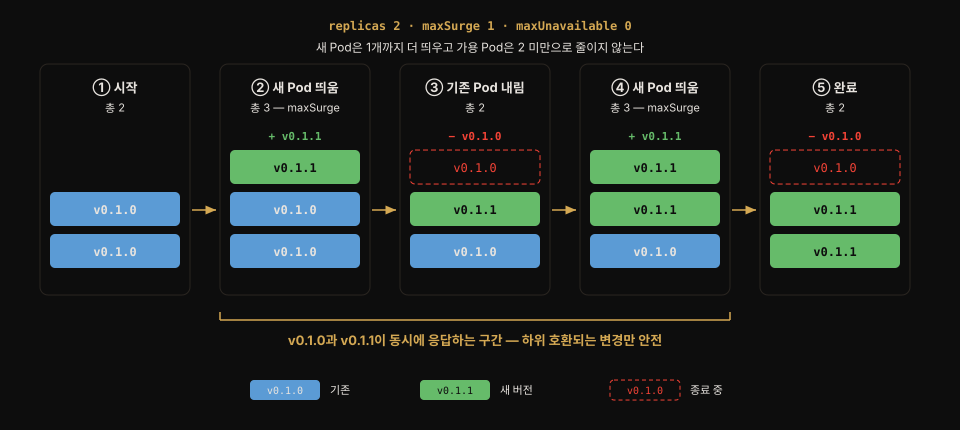
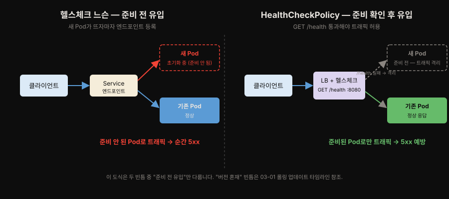
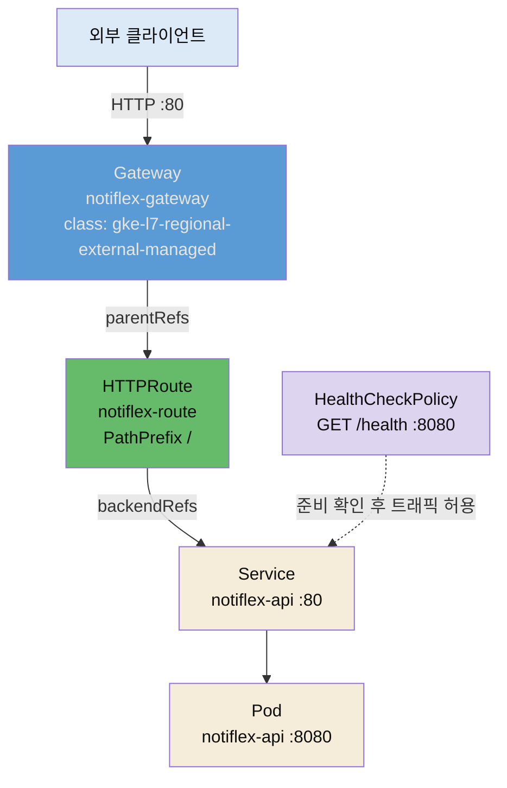

# Rolling Update의 한계와 Gateway API
---
> **Rolling Update가 "무중단"이라 불리면서도 남기는 두 빈틈(버전 혼재 · 준비 전 유입)을 짚고, 그 트래픽을 세밀하게 다루기 위해 Ingress를 대체하는 Gateway API의 3계층 역할 분리(GatewayClass·Gateway·HTTPRoute)를 설명하며, GKE `HealthCheckPolicy`가 준비 전 유입 빈틈을 트래픽 계층에서 막는 구조까지 답할 수 있다.**


## 📌 핵심 요약

> Rolling Update는 무중단처럼 보이지만 버전 혼재·준비 전 유입 두 빈틈을 남깁니다. 5장은 이 빈틈을 트래픽 계층에서 먼저 손보고, 그 첫 수단으로 Gateway API를 도입합니다.

3장에서 도입한 Rolling Update는 Pod를 한 개씩 교체하며 배포합니다. 무중단처럼 보이지만 실제로는 두 가지 빈틈이 남습니다. 하나는 교체 순간 이전 버전과 새 버전이 동시에 트래픽을 받아 응답이 섞이는 구간이고, 다른 하나는 새 Pod가 준비되기 전에 트래픽이 흘러들어 순간적으로 오류가 나는 구간입니다. 5장은 이 빈틈을 메우기 위해 트래픽을 세밀하게 제어할 수단부터 마련합니다. 그 수단이 **Gateway API**입니다.

Gateway API는 쿠버네티스의 표준 트래픽 진입 API로, 낡은 Ingress를 대체하는 후속 규격입니다. Ingress가 하나의 오브젝트에 인프라 설정과 라우팅 규칙을 뭉뚱그렸다면, Gateway API는 이를 세 계층으로 분리합니다. GatewayClass는 인프라 제공자, Gateway는 플랫폼 운영자, HTTPRoute는 앱 개발자의 몫입니다.

Notiflex는 GKE가 관리하는 `gke-l7-regional-external-managed` 클래스를 써서, 별도 Ingress 컨트롤러 설치 없이 Google 관리형 L7 로드밸런서를 얻습니다. 여기에 `HealthCheckPolicy`로 헬스체크 경로 `/health`와 포트 8080을 명시해, 준비되지 않은 Pod로 트래픽이 새는 두 번째 빈틈을 막습니다.


## 🎯 학습 목표

> 이 절을 읽고 나면 다음 네 가지를 할 수 있습니다.

1. Rolling Update가 "무중단"이라 불리면서도 남기는 두 가지 빈틈(버전 혼재·준비 전 유입)이 무엇인지 말할 수 있습니다.
2. Ingress와 Gateway API의 근본 차이를 역할 분리(role-oriented)와 표준 필드 관점에서 설명할 수 있습니다.
3. GatewayClass·Gateway·HTTPRoute가 각각 누구의 책임이고 무엇을 선언하는지 구분할 수 있습니다.
4. GKE에서 `HealthCheckPolicy`가 왜 필요하며 어떤 실패를 예방하는지, 어떤 필드로 경로·포트를 지정하는지 설명할 수 있습니다.


## 1. Rolling Update는 왜 서비스가 끊기는가

> Rolling Update는 서비스를 계속 살려 두지만, 교체 중 버전이 섞이고 준비 안 된 Pod로 트래픽이 새는 두 빈틈을 남깁니다.

Rolling Update는 `maxSurge`(잠시 늘려도 되는 Pod 수)와 `maxUnavailable`(잠시 줄여도 되는 Pod 수) 만큼 Pod를 조금씩 교체합니다. Deployment 기본 전략이라 별도 설정 없이 동작하고, 겉보기에는 서비스가 계속 살아 있으니 무중단으로 느껴집니다. 그런데 교체가 진행되는 동안 클러스터에는 이전 버전 Pod와 새 버전 Pod가 **동시에** 존재합니다. 이때 두 가지 문제가 생깁니다.

- **버전 혼재**: 같은 사용자가 연속으로 요청을 보내도 한 번은 v1, 다음은 v2 Pod로 라우팅될 수 있습니다. API 응답 형식이 바뀌었다면 클라이언트가 깨집니다. Rolling Update에는 "전부 v1이거나 전부 v2" 같은 원자적 전환 개념이 없습니다.
- **준비 전 트래픽 유입**: 새 Pod가 뜨자마자 Service의 엔드포인트에 등록되면, 애플리케이션이 아직 초기화 중이어도 트래픽이 들어옵니다. `readinessProbe`가 이를 막아 주지만, 프로브 설정이 느슨하면 순간적으로 5xx가 발생합니다.

즉 Rolling Update는 "롤백은 되지만, 전환의 정밀 제어는 안 되는" 전략입니다. 5장은 이 한계를 트래픽 계층에서 먼저 손봅니다.

버전 혼재 빈틈이 교체 타임라인에서 어떻게 벌어지는지는 3장의 롤링 업데이트 타임라인 도식이 단계별로 보여 줍니다(같은 도식을 여기서 다시 그리지 않고 참조합니다).



두 번째 빈틈인 준비 전 유입은 헬스체크 유무로 갈립니다. 헬스체크가 느슨하면 초기화 중인 새 Pod로 트래픽이 들어와 5xx가 나고, `HealthCheckPolicy`(또는 readiness)가 준비를 확인한 뒤에야 트래픽을 흘리면 이 빈틈이 닫힙니다. 이 대비가 이 노트가 §3에서 세우는 장치입니다.




## 2. 외부 트래픽 관리 — Gateway API

> Gateway API는 Ingress를 대체하는 표준 트래픽 진입 규격으로, 인프라·플랫폼·앱의 관심사를 세 오브젝트로 쪼개 이식성과 권한 위임을 얻습니다.

트래픽을 세밀하게 나누려면 먼저 트래픽이 들어오는 문을 제대로 관리해야 합니다. 3~4장까지 Notiflex는 `Service`(ClusterIP/LoadBalancer)로 외부를 노출했습니다. 그런데 가중치 기반 분할이나 경로별 라우팅 같은 세밀한 제어에는 이 방식이 부족합니다. 그래서 5장은 표준 트래픽 진입 규격인 Gateway API를 도입합니다.

Gateway API는 쿠버네티스 1.27부터 GA(정식) 상태로 제공됩니다.[^ga] 오브젝트의 apiVersion은 `gateway.networking.k8s.io/v1`을 씁니다.

Gateway API의 핵심은 **역할 분리**입니다. Ingress는 인프라 설정과 라우팅을 한 오브젝트에 담고, 부족한 기능은 벤더별 어노테이션으로 우회했습니다. 이 방식은 이식성이 낮고 규칙이 흩어집니다. Gateway API는 세 오브젝트로 관심사를 쪼갭니다.

- **GatewayClass**: 어떤 컨트롤러 구현을 쓸지 정의합니다. `StorageClass`가 스토리지 제공자를 고르는 것과 같은 역할이고, 인프라 제공자의 책임입니다. Notiflex는 GKE가 제공하는 `gke-l7-regional-external-managed`를 씁니다. 이 클래스 하나로 Google 관리형 리전 L7 외부 로드밸런서가 뒤에 붙습니다.
- **Gateway**: 진입점을 인스턴스화합니다. 어떤 포트(80)와 프로토콜(HTTP)로 받을지, 어떤 네임스페이스의 라우트를 허용할지(`allowedRoutes`)를 선언합니다. 클러스터(플랫폼) 운영자의 책임입니다.
- **HTTPRoute**: 실제 라우팅 규칙입니다. "경로가 `/`로 시작하면 `notiflex-api` 서비스의 80 포트로 보낸다" 같은 규칙을 앱 개발자가 자기 네임스페이스에서 독립적으로 관리합니다.

GKE에는 GatewayClass가 네 종류 설치되어 있고, 그중 하나를 골라 씁니다. 무엇을 뒤에 붙이느냐가 다릅니다.

| GatewayClass | 무엇을 붙이는가 |
|---|---|
| `gke-l7-global-external-managed` | 글로벌 외부 HTTP(S) 로드밸런서 |
| `gke-l7-regional-external-managed` | 리전 외부 HTTP(S) 로드밸런서 (Notiflex 선택) |
| `gke-l7-rilb` | 내부 HTTP(S) 로드밸런서 |
| `gke-l7-gxlb` | 글로벌 외부(클래식) |

Notiflex는 단일 리전(asia-northeast3)에서 운영하므로 `gke-l7-regional-external-managed`를 씁니다. 글로벌 로드밸런서는 전 세계에 분산된 프런트엔드를 거쳐 고정 요금이 높은 편이라 멀티 리전 서비스에 적합하고, 학습 환경에서는 리전 로드밸런서가 비용·설정 모두 효율적입니다.

Notiflex의 Gateway·HTTPRoute는 아래와 같습니다(저자 저장소 `k8s/smb/gateway.yaml` 실물).

```yaml
apiVersion: gateway.networking.k8s.io/v1
kind: Gateway
metadata:
  name: notiflex-gateway
  namespace: notiflex
spec:
  gatewayClassName: gke-l7-regional-external-managed  # GKE 관리형 L7 LB
  listeners:
  - name: http
    port: 80
    protocol: HTTP
    allowedRoutes:
      namespaces:
        from: Same        # 같은 네임스페이스의 라우트만 허용 (경계 통제)
---
apiVersion: gateway.networking.k8s.io/v1
kind: HTTPRoute
metadata:
  name: notiflex-route
  namespace: notiflex
spec:
  parentRefs:
  - name: notiflex-gateway   # 위 Gateway에 이 라우트를 붙임
  rules:
  - matches:
    - path:
        type: PathPrefix
        value: /
    backendRefs:
    - name: notiflex-api      # /로 시작하는 요청을 이 서비스로
      port: 80
```


## 3. HealthCheckPolicy로 준비 전 트래픽 막기

> Gateway API 표준만으로는 GKE 로드밸런서가 어떤 경로로 헬스체크할지 모르므로, GKE는 `HealthCheckPolicy` 확장으로 애플리케이션 레벨 헬스체크 경로·포트를 직접 지정합니다.

Gateway API 표준만으로는 GKE 로드밸런서가 "어떤 경로로 헬스체크를 해야 하는지"를 정확히 알 수 없습니다. 기본값은 `/` 경로로 헬스체크를 수행합니다. 그런데 Notiflex API의 헬스체크 엔드포인트는 `/health`이고 포트는 8080입니다. 기본 헬스체크가 `/`로 요청하면 정상 응답을 못 받고, 로드밸런서는 모든 백엔드를 `unhealthy`로 판단합니다. 그 결과 `no healthy upstream` 에러가 발생합니다. GKE는 이를 막으려고 `HealthCheckPolicy`라는 확장 오브젝트를 제공합니다.

```yaml
apiVersion: networking.gke.io/v1
kind: HealthCheckPolicy
metadata:
  name: notiflex-healthcheck
  namespace: notiflex
spec:
  default:
    checkIntervalSec: 15
    timeoutSec: 5
    healthyThreshold: 1     # 1회 성공하면 정상으로 판단
    unhealthyThreshold: 2   # 2회 실패하면 비정상으로 격리
    config:
      type: HTTP
      httpHealthCheck:
        port: 8080          # 앱이 실제로 듣는 포트
        requestPath: /health # 앱이 정의한 헬스 엔드포인트
  targetRef:
    group: ""
    kind: Service
    name: notiflex-api      # 이 서비스의 백엔드에 정책 적용
```

`requestPath: /health`와 `port: 8080`을 직접 지정하면, 로드밸런서가 애플리케이션 레벨에서 "정말 요청을 받을 준비가 됐는지"를 확인한 뒤에야 트래픽을 흘립니다. Rolling Update의 두 번째 빈틈(준비 전 트래픽 유입)을 트래픽 계층에서 막는 장치입니다. §2 위 도식의 오른쪽 패널이 바로 이 흐름입니다. `/health`를 통과한 Pod로만 트래픽이 가는 구조입니다.

### readinessProbe와 HealthCheckPolicy는 왜 둘 다 필요한가

`/health`를 확인하는 장치가 이미 `readinessProbe`에도 있는데, 왜 `HealthCheckPolicy`가 또 필요한지 의문이 들 수 있습니다. 두 장치는 확인하는 **레이어가 다릅니다**.

- **readinessProbe**: kubelet이 Pod 수준에서 "이 Pod를 Service 엔드포인트에 포함할지"를 결정합니다.
- **HealthCheckPolicy**: GKE 로드밸런서가 백엔드 수준에서 "이 백엔드에 트래픽을 보낼지"를 결정합니다.

둘 중 하나만 있어도 클러스터 내부에서는 동작합니다. 그런데 외부 로드밸런서는 kubelet의 판단을 신뢰하지 않고 자기가 직접 한 번 더 확인합니다. 로드밸런서와 Pod 사이에 네트워크 구간이 있어, 그 구간까지 포함해 "진짜 요청을 받을 수 있는가"를 봐야 하기 때문입니다. 그래서 외부에서 오는 요청은 두 단계의 헬스체크를 통과한 Pod에만 도달합니다.


## 🔍 심화 학습

> 이 절은 책 본문 밖에서 조사한 배경입니다. 표준 규격의 맥락을 더 넓게 잡기 위한 보강이며, 책 원문이 아닙니다.

### Ingress는 왜 "동결"되었는가

쿠버네티스 공식은 Ingress API를 **동결(frozen)** 상태로 두고 새 기능을 추가하지 않습니다. 공식 문서 원문이 "The Ingress API has been frozen … no further changes or updates made to it"이라고 못 박습니다. 다만 동결은 폐기와 다릅니다. Ingress는 GA로 계속 지원되고 제거 계획도 없어, 기존 배포는 그대로 두고 새 기능만 Gateway API로 옮기는 점진 이전이 가능합니다.

동결의 배경에는 표현력의 한계가 있습니다. HTTP/HTTPS 위주였던 Ingress는 가중치 분할이나 헤더 매칭 같은 세밀한 제어를 표준으로 담지 못했습니다. 그래서 각 컨트롤러가 어노테이션으로 기능을 확장했습니다. 그 결과 NGINX용과 GKE용 어노테이션이 서로 호환되지 않는 파편화가 생겼습니다.

Gateway API는 이 기능들을 **스펙 레벨**로 끌어올립니다. 트래픽 분할(weighted backends)·헤더 매칭·리다이렉트를 표준 필드로 제공하고, HTTP뿐 아니라 gRPC·TCP·UDP까지 다룬다는 점이 Ingress와의 근본 차이입니다.

- 출처: [Kubernetes 공식 — Ingress (frozen 명시)](https://kubernetes.io/docs/concepts/services-networking/ingress/)
- 출처: [Kubernetes Gateway API 개요 (techplained)](https://www.techplained.com/kubernetes-gateway-api)
- 출처: [Ingress vs Gateway API 실무 비교 (Tigera)](https://www.tigera.io/blog/is-it-time-to-migrate-a-practical-look-at-kubernetes-ingress-vs-gateway-api/)

### 역할 분리가 조직에 주는 이점

Gateway API의 3계층 분리는 단지 오브젝트를 쪼갠 게 아니라 **조직의 책임 경계**를 코드에 반영한 설계입니다. 공식 문서의 role-oriented 모델은 각 오브젝트를 특정 역할에 명시적으로 매핑합니다.

- **Infrastructure Provider**는 GatewayClass로 어떤 컨트롤러를 쓸지 정합니다.
- **Cluster Operator**는 Gateway로 진입점·TLS·포트를 통제합니다.
- **Application Developer**는 자기 네임스페이스의 HTTPRoute만 자유롭게 바꿉니다.

이 분리 덕분에 앱 팀이 라우팅을 바꾸려고 플랫폼 팀에 매번 요청할 필요가 없어집니다. `allowedRoutes`로 어떤 네임스페이스의 라우트를 이 Gateway에 붙일 수 있는지 통제하므로, 권한 위임과 경계 통제를 동시에 만족합니다.

- 출처: [Kubernetes Gateway API — API 개요·역할 모델](https://kubernetes.io/docs/concepts/services-networking/gateway/)
- 출처: [Ingress vs Gateway API 역할 분리 (Plural)](https://www.plural.sh/blog/kubernetes-ingress-vs-gateway-api)

### 다른 트래픽 도구와의 비교

책은 Gateway API를 추천하기 전에 NGINX Ingress·Istio·Traefik과 나란히 비교합니다. 도구 선택의 근거를 남기는 습관이라, 그 표를 그대로 옮깁니다.

| 구분 | Gateway API | Ingress NGINX | Istio Gateway | Traefik |
|------|-------------|---------------|---------------|---------|
| 추천도 | ★★★ | ★★ | ★ | ★★ |
| 설치 | GKE 내장 | Helm 설치 | Helm 설치 | Helm 설치 |
| 추가 리소스 | 0 (관리형) | ~100m/90Mi | ~500m/1Gi+ | ~100m/50Mi |
| weight 라우팅 | 표준 지원 | 애너테이션 | 강력 지원 | 지원 |
| GKE 연동 | 네이티브 | 수동 설정 | 수동 설정 | 수동 설정 |
| 학습 곡선 | 낮음 | 낮음 | 높음 | 중간 |

Notiflex 환경에서 Gateway API가 최적인 이유는 세 가지입니다.

1. 설치가 필요 없습니다. 클러스터를 `--gateway-api=standard` 옵션으로 만들어 GatewayClass가 이미 존재하고, NGINX·Traefik은 별도 Helm 설치가 필요합니다.
2. 리소스가 빠듯합니다. Spot VM 2대(e2-medium, 총 2 vCPU / 8GB)에 4장에서 Prometheus·Loki·Fluent Bit까지 올라가 있어, Istio(Pod당 128Mi+)는 사실상 불가능합니다. Gateway API는 GKE 관리형이라 클러스터 리소스를 쓰지 않습니다.
3. 무중단 배포와 연동됩니다. 5.3에서 Argo Rollouts가 Blue/Green을 진행할 때 HTTPRoute의 `backendRefs` 가중치로 트래픽을 전환하는데, Gateway API가 아니면 이 연동이 복잡해집니다.

- 출처: 《AI 인프라 — Claude로》 5장 §5.2.2 도구 비교


## 💡 실무 적용 포인트

> 무중단이라는 통념을 두 빈틈으로 나눠 의심하고, 어노테이션 파편화 탈출·애플리케이션 레벨 헬스체크·네임스페이스 경계를 라우트에 반영하는 것이 이 절의 실무 축입니다.

- **무중단이라는 말을 의심하기**: "Rolling Update니까 무중단"이라는 통념은 정확하지 않습니다. 버전 혼재와 준비 전 유입이라는 두 빈틈을 먼저 확인하고, 필요하면 트래픽 제어(Gateway) + readiness 강화 + 원자적 전환(Blue/Green)까지 함께 설계해야 합니다.
- **어노테이션 파편화에서 탈출**: 기존 Ingress를 벤더 어노테이션으로 도배해 운영 중이라면, 같은 규칙을 Gateway API 표준 필드로 옮겨 이식성을 확보할 수 있습니다. 클라우드를 옮겨도 HTTPRoute는 거의 그대로 재사용됩니다.
- **헬스체크는 애플리케이션 레벨로**: TCP 헬스체크만 걸어 두면 프로세스는 살아 있지만 요청 처리는 못 하는 상태를 못 걸러냅니다. `/health` 같은 애플리케이션 엔드포인트를 만들고 `HealthCheckPolicy`(또는 readinessProbe)로 그 경로를 확인하게 하세요.
- **네임스페이스 경계를 라우트에 반영**: `allowedRoutes.namespaces.from: Same`처럼 라우트 허용 범위를 좁혀 두면, 다른 팀이 실수로 이 Gateway에 라우트를 붙이는 사고를 예방합니다.

### 트래픽 경로 한눈에 보기




## ✅ 핵심 개념 체크리스트

- [ ] Rolling Update가 남기는 두 빈틈(버전 혼재·준비 전 유입)을 설명할 수 있습니다.
- [ ] Ingress와 Gateway API의 차이를 역할 분리·표준 필드 관점에서 말할 수 있습니다.
- [ ] GatewayClass / Gateway / HTTPRoute의 책임 주체와 선언 내용을 구분할 수 있습니다.
- [ ] `gke-l7-regional-external-managed` 클래스가 무엇을 뒤에 붙여 주는지 압니다.
- [ ] `HealthCheckPolicy`가 어떤 실패(준비 전 유입)를 막는지, 어떤 필드로 경로·포트를 지정하는지 압니다.


## ☕ Spring 앱 개발 관점

> 이 절의 두 번째 빈틈 — "준비 안 된 Pod로 트래픽이 샌다" — 는 Spring Boot에서 Actuator의 Kubernetes probe로 앱 레벨에서 막습니다. 책은 Go 앱(Notiflex)이라 헬스체크를 LB 레벨(`HealthCheckPolicy`)로 걸었지만, Spring Boot라면 오케스트레이션 레벨(readiness probe)에서 같은 목적을 이룹니다. 책에 없는 내용이라 공식 문서(Spring Boot Actuator)로 보강합니다.

GKE `HealthCheckPolicy`가 **로드밸런서 레벨**에서 준비 전 유입을 막았다면, 쿠버네티스는 **오케스트레이션 레벨**에서 같은 일을 readiness probe로 합니다. Spring Boot는 이 두 probe를 Actuator가 이미 자리에 넣어 두어, 별도 컨트롤러 코드 없이 상태만 노출하면 됩니다.

```yaml
# application.yml — K8s 배포가 감지되면 probes.enabled는 자동 true가 되므로
# 명시는 선택입니다. 끄려면 false로 둡니다.
management:
  endpoint:
    health:
      probes:
        enabled: true
```

이 설정이 켜지면 두 엔드포인트가 열립니다.

- `/actuator/health/liveness` — 그룹 `livenessstate`. "프로세스가 살아 있나"에 답합니다. 실패하면 쿠버네티스가 **컨테이너를 재시작**합니다.
- `/actuator/health/readiness` — 그룹 `readinessstate`. "지금 트래픽을 받을 준비가 됐나"에 답합니다. 실패하면 쿠버네티스가 해당 Pod를 **엔드포인트에서 제외**합니다.

Rolling Update 중 "준비 전 유입"을 막는 것은 이 readiness입니다. 앱이 시작(Starting) 단계면 상태가 `REFUSING_TRAFFIC`이라 쿠버네티스가 그 Pod를 서비스 엔드포인트에 넣지 않습니다 — 503을 돌려주는 게 아니라 애초에 라우팅 대상에서 빼는 것입니다. 초기화가 끝나 준비(Started) 상태가 되면 `ACCEPTING_TRAFFIC`으로 바뀌고, 그때 비로소 트래픽이 들어옵니다. 이 노트 §3의 GKE `HealthCheckPolicy`가 LB 앞단에서 하던 "준비 확인 후 유입"을, Spring에서는 이 readiness가 쿠버네티스 엔드포인트 계층에서 수행합니다.

메인 서버 포트로도 확인 경로를 노출하고 싶으면 다음을 켭니다.

```yaml
# /livez, /readyz 를 메인 포트로도 노출 — LB 헬스체크가 관리 포트에 못 붙을 때 유용
management:
  endpoint:
    health:
      probes:
        add-additional-paths: true
```

한 가지 주의는 liveness probe에 **외부 시스템 의존을 넣지 않는 것**입니다. liveness가 DB·외부 API 상태까지 보게 만들면, 그 외부가 흔들릴 때 컨테이너가 재시작되고 재시작이 부하를 키워 연쇄 장애로 번집니다. liveness는 "이 프로세스 자체가 정상인가"만, 외부 의존성 판단은 readiness에 둡니다.


## 면접에서 받을 만한 질문

> 먼저 스스로 답을 소리 내어 말해 본 뒤, 아래 §정답 섹션을 펼쳐 맞춰 봅니다. "무중단 배포를 어떻게 보장했나"에는 두 빈틈 → 트래픽 제어(Gateway) → 헬스체크(HealthCheckPolicy/readiness) 순서로 답하면 됩니다.

1. Rolling Update가 무중단 배포라고 하는데, 정말 무중단입니까? 어떤 빈틈이 남습니까?
2. Ingress 대신 Gateway API를 쓰는 이유는 무엇입니까? 역할 분리와 표준 필드 관점에서 설명해 보세요.
3. GatewayClass·Gateway·HTTPRoute는 각각 누구의 책임이며 무엇을 선언합니까?
4. GKE에서 애플리케이션 레벨 헬스체크 경로를 어떻게 지정합니까? TCP 헬스체크만으로는 왜 부족합니까?
5. (Spring 관점) Spring Boot 앱에서 "준비 전 트래픽 유입"을 어떻게 막습니까? liveness와 readiness의 차이는 무엇입니까?

### 빈칸 채우기 — HealthCheckPolicy 핵심 필드

GKE `HealthCheckPolicy`에서 애플리케이션이 실제로 듣는 포트를 지정하는 필드는 `spec.default.config.httpHealthCheck.①____`이고, 헬스 엔드포인트 경로를 지정하는 필드는 `②____`입니다. 이 정책을 어떤 Service의 백엔드에 적용할지는 `spec.③____`로 지정합니다.


## 정답 (자답 후 펼치기)

> 위 §면접에서 받을 만한 질문의 5개에 *먼저 자답한 뒤* 아래를 읽으세요. 자답 없이 먼저 읽으면 학습 효과가 0입니다.

### 정답 1 — Rolling Update는 무중단인가

부분적으로만 맞습니다. 서비스는 계속 살아 있지만 두 빈틈이 남습니다. 교체 중 이전/새 버전 Pod가 공존해 응답이 섞이고(버전 혼재), readiness가 느슨하면 준비 전 Pod로 트래픽이 새어 5xx가 납니다(준비 전 유입). 원자적 전환이 필요하면 Blue/Green을, 점진적 검증이 필요하면 Canary를 씁니다.

### 정답 2 — 왜 Gateway API인가

Ingress는 동결 상태라 새 기능이 안 들어오고, 세밀한 제어는 벤더 어노테이션으로 우회해 파편화됩니다. Gateway API는 가중치 분할·헤더 매칭을 표준 필드로 제공하고(gRPC·TCP·UDP까지), GatewayClass/Gateway/HTTPRoute로 인프라·플랫폼·앱의 책임을 분리해 이식성과 권한 위임을 동시에 얻습니다.

### 정답 3 — 3계층의 책임

GatewayClass는 인프라 제공자가 어떤 컨트롤러 구현을 쓸지 정하고(`StorageClass`와 같은 역할), Gateway는 클러스터 운영자가 진입점(포트·프로토콜·허용 네임스페이스)을 인스턴스화하며, HTTPRoute는 앱 개발자가 자기 네임스페이스에서 라우팅 규칙을 독립적으로 관리합니다.

### 정답 4 — GKE 헬스체크 경로 지정

`HealthCheckPolicy`(`networking.gke.io/v1`)의 `config.httpHealthCheck.requestPath`와 `port`로 애플리케이션 엔드포인트를 직접 지정합니다. TCP 확인만으로는 프로세스는 살아 있으나 요청 처리는 못 하는 상태를 못 거르므로, `/health` 같은 앱 레벨 경로를 확인하게 만듭니다.

### 정답 5 — Spring에서 준비 전 유입 막기

Actuator의 Kubernetes probe를 씁니다. `management.endpoint.health.probes.enabled`가 켜지면(K8s 환경 감지 시 자동 true) `/actuator/health/readiness`와 `/actuator/health/liveness`가 열립니다. readiness가 `REFUSING_TRAFFIC`이면 쿠버네티스가 그 Pod를 엔드포인트에서 제외해 준비 전 유입을 막고, 준비되면 `ACCEPTING_TRAFFIC`으로 전환됩니다. 이때 503을 돌려주는 게 아니라 라우팅 대상에서 아예 빼는 것입니다.

두 probe는 관심사가 다릅니다. liveness는 "프로세스가 살아 있나"를 보고 실패 시 컨테이너를 재시작하며, readiness는 "트래픽 받을 준비가 됐나"를 보고 실패 시 엔드포인트에서 제외합니다.

### 정답 빈칸 — ①`port` ②`requestPath` ③`targetRef`

`config.httpHealthCheck.port`가 앱이 실제로 듣는 포트(8080), `config.httpHealthCheck.requestPath`가 헬스 엔드포인트 경로(`/health`)이고, `spec.targetRef`(group/kind/name)로 이 정책을 적용할 Service를 지정합니다.


## 관련 문서

> 이 노트는 3장 롤링 업데이트의 한계를 트래픽 계층에서 이어받아, 다음 절의 원자적 전환(Blue/Green)으로 넘어가는 다리입니다.

- [03-01. 푸시 배포의 한계와 ArgoCD GitOps](./03-01.%ED%91%B8%EC%8B%9C%20%EB%B0%B0%ED%8F%AC%EC%9D%98%20%ED%95%9C%EA%B3%84%EC%99%80%20ArgoCD%20GitOps%20%E2%80%94%20%EC%84%A4%EC%B9%98%C2%B7%EC%97%B0%EA%B2%B0%C2%B7%EB%A1%A4%EB%A7%81%C2%B7%EB%A1%A4%EB%B0%B1.md) § "롤링·롤백" — 버전 혼재 빈틈이 벌어지는 교체 타임라인의 원 출처
- [05-02. Blue-Green 무중단 전환과 아키텍처 결정 기록](./05-02.Blue-Green%20%EB%AC%B4%EC%A4%91%EB%8B%A8%20%EC%A0%84%ED%99%98%EA%B3%BC%20%EC%95%84%ED%82%A4%ED%85%8D%EC%B2%98%20%EA%B2%B0%EC%A0%95%20%EA%B8%B0%EB%A1%9D.md) — 버전 혼재 빈틈을 원자적 전환으로 닫는 다음 단계
- [04-01. 관측 가능성과 메트릭 — 프로메테우스·그라파나](./04-01.%EA%B4%80%EC%B8%A1%20%EA%B0%80%EB%8A%A5%EC%84%B1%EA%B3%BC%20%EB%A9%94%ED%8A%B8%EB%A6%AD%20%E2%80%94%20%ED%94%84%EB%A1%9C%EB%A9%94%ED%85%8C%EC%9A%B0%EC%8A%A4%C2%B7%EA%B7%B8%EB%9D%BC%ED%8C%8C%EB%82%98.md) § "Spring 앱 개발 관점" — Actuator `/metrics`·probe 노출의 같은 계열 보강

[^ga]: 책 본문은 "쿠버네티스 1.27부터 GA"로 서술합니다. 이와 별개로 Gateway API 스펙 자체는 v1.0(2023-10-31)에서 GatewayClass·Gateway·HTTPRoute가 v1으로 승격되며 GA가 되었습니다. 노트는 책 표현을 따르되, 스펙 GA 시점을 함께 적어 둡니다. 출처: [Gateway API v1.0 GA 발표](https://kubernetes.io/blog/2023/10/31/gateway-api-ga/).
