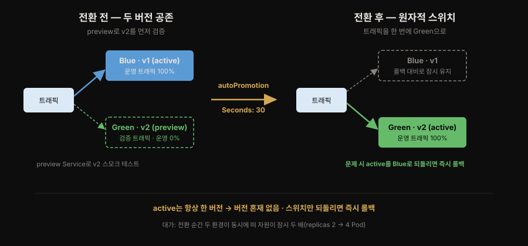
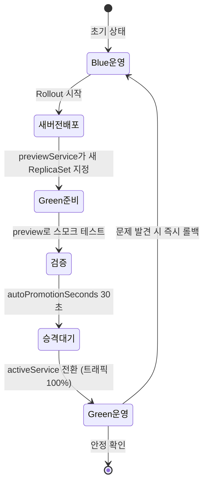

# Blue/Green 무중단 전환과 아키텍처 결정 기록
---
> **Blue/Green이 두 버전을 나란히 띄워 트래픽을 원자적으로 전환함으로써 Rolling Update의 버전 혼재를 없애고 즉각 롤백을 얻는 원리를 설명하고, 이를 Argo Rollouts의 `Rollout` CRD와 `blueGreen` 전략으로 구현하며, 도구 선택의 근거를 ADR로 깃에 남기는 습관까지 답할 수 있다.**


## 📌 핵심 요약

> Blue/Green은 두 버전을 나란히 띄워 트래픽을 한 번에 전환합니다. 버전 혼재가 사라지고 롤백이 즉각적이며, Argo Rollouts로 구현하고 그 선택의 근거를 ADR로 남깁니다.

Gateway API로 트래픽 진입을 정돈했으니, 이제 배포 전략 자체를 원자적으로 바꿉니다. 5장의 무중단 전환 방식은 **Blue/Green**입니다. 같은 애플리케이션의 두 버전을 나란히 띄우고, 트래픽을 받는 쪽(active)과 검증만 받는 쪽(preview)을 분리합니다. 준비가 끝나면 트래픽을 **한 번에** 새 버전으로 넘깁니다. 이렇게 하면 Rolling Update의 버전 혼재 문제가 사라집니다. 문제가 생겨도 active를 이전 버전으로 되돌리기만 하면 되니 롤백도 즉각적입니다.

Notiflex는 이 전략을 **Argo Rollouts**로 구현합니다. Deployment 대신 `Rollout` 오브젝트를 쓰고, `blueGreen` 전략에 운영 트래픽용 `activeService`와 검증 트래픽용 `previewService`를 지정합니다. `autoPromotionEnabled: true` + `autoPromotionSeconds: 30`으로 두면 새 버전이 뜬 뒤 30초를 기다렸다가 자동으로 트래픽을 승격합니다.

5장은 여기에 더해 **왜 이 도구를 골랐는가**를 남기는 습관을 세웁니다. 그 그릇이 아키텍처 결정 기록(**ADR**, Architecture Decision Record)입니다.


## 🎯 학습 목표

> 이 절을 읽고 나면 다음 네 가지를 할 수 있습니다.

1. Blue/Green 배포가 Rolling Update와 무엇이 다르며 어떤 문제(버전 혼재·롤백 속도)를 해결하는지 말할 수 있습니다.
2. Argo Rollouts의 `Rollout` CRD와 `activeService`/`previewService`의 역할을 구분할 수 있습니다.
3. `autoPromotionEnabled`·`autoPromotionSeconds`가 승격 흐름을 어떻게 제어하는지, 수동 승격은 어떻게 하는지 설명할 수 있습니다.
4. ADR이 무엇이고 Status·Context·Decision·Consequences 네 부분과 supersede 원칙을 설명할 수 있습니다.


## 1. 무중단 전환 — Blue/Green 배포

> Blue/Green은 두 환경을 동시에 유지하다 트래픽 전체를 한 번에 전환해, active가 항상 한 버전이라 버전 혼재가 없고 스위치만 되돌리면 즉각 롤백됩니다.

Blue/Green의 핵심은 **트래픽 전환을 원자적으로** 만드는 것입니다. 두 개의 완전한 환경(Blue=현재 운영, Green=새 버전)을 동시에 유지하다가, 스위치를 한 번에 넘기듯 트래픽 전체를 Green으로 보냅니다. 전환 전에는 Green이 운영 트래픽을 전혀 받지 않으므로, preview 서비스로 실제 배포 전에 스모크 테스트를 돌려 볼 수 있습니다. 전환 후 문제가 발견되면 다시 Blue로 스위치를 되돌리면 끝입니다.

이 전환 순간을 그림으로 보면 다음과 같습니다.



Rolling Update와 비교하면 차이가 분명합니다.

| 구분 | Rolling Update | Blue/Green |
|------|----------------|------------|
| 전환 방식 | Pod 하나씩 점진 교체 | 트래픽 전체를 한 번에 전환 |
| 버전 혼재 | 발생 (교체 중 공존) | 없음 (active는 항상 한 버전) |
| 롤백 속도 | 역방향 롤아웃 필요 | active 서비스 스위치만 되돌림 |
| 자원 사용 | 소폭 증가(maxSurge) | 두 배(두 환경 동시 유지) |
| 사전 검증 | 어려움 | preview로 실제 트래픽 전에 검증 |

두 배의 자원을 잠시 쓴다는 비용을 감수하는 대신, 버전 혼재를 없애고 즉각 롤백을 얻는 거래입니다.

### 자원 2배가 감당되는가 — e2-medium 2대 계산

두 배의 자원이라는 말이 나오면 노드가 감당할 수 있는지 따져야 합니다. Notiflex API는 2 replica이고 Pod당 요청량은 CPU 50m / 메모리 64Mi입니다. Blue/Green이 진행되는 짧은 시간(30초) 동안에는 Blue 2 + Green 2 = 총 4 Pod가 동시에 떠 CPU 200m / 메모리 256Mi가 듭니다.

e2-medium 노드 2대의 할당 가능 리소스는 대략 CPU 3.8 core, 메모리 약 6Gi입니다. 이미 Prometheus·Grafana·Loki·Fluent Bit·ArgoCD가 약 1 core / 1.5Gi를 차지하고 있어도 4 Pod 동시 실행은 문제가 되지 않습니다.

진짜 리스크는 replica가 훨씬 많은 서비스일 때입니다. replica 20개짜리 서비스를 Blue/Green으로 배포하면 일시적으로 40개가 떠야 합니다. 그런 규모에서는 Canary가 리소스 효율적이고, 그래서 6장에서 Canary로 발전합니다. 지금은 2 replica 정도라 Blue/Green으로 충분히 안전합니다.


## 2. Argo Rollouts로 구현하기

> Argo Rollouts는 Deployment를 대체하는 `Rollout` CRD로, Blue/Green·Canary를 선언적으로 구현하고 ArgoCD와 통합됩니다.

Argo Rollouts는 Deployment를 대체하는 `Rollout` CRD를 제공합니다. 스펙 대부분은 Deployment와 같고, `strategy`만 `blueGreen`(또는 `canary`)으로 바뀝니다.

`Deployment`가 이미 있는데 왜 `Rollout`이 또 필요한지 의문이 들 수 있습니다. 쿠버네티스 기본 Deployment는 Rolling Update만 지원합니다. Blue/Green이나 Canary는 설계 철학상 "단순한 Pod 교체"를 넘어선 영역이라 쿠버네티스 코어에 포함되지 않았습니다. 두 버전의 Pod를 동시에 띄우고 트래픽만 바꾸거나, 메트릭을 보면서 트래픽 비율을 조절하려면 별도의 상태 관리 로직이 필요합니다. 그래서 쿠버네티스는 이런 고급 전략을 CRD로 확장하는 길을 열어 뒀고, Argo Rollouts가 그 공간을 채운 구현체입니다.

Blue/Green 전략의 뼈대는 아래와 같습니다(본문 예시 — 저자 완성본은 6장에서 Canary로 진화합니다).

```yaml
apiVersion: argoproj.io/v1alpha1
kind: Rollout
metadata:
  name: notiflex-api
  namespace: notiflex
spec:
  replicas: 2
  revisionHistoryLimit: 3       # 이전 ReplicaSet을 3개까지 보존 → 즉시 롤백 근거
  selector:
    matchLabels:
      app: notiflex-api
  template:
    # ... Pod 스펙은 Deployment와 동일 ...
  strategy:
    blueGreen:
      activeService: notiflex-api           # 운영 트래픽을 받는 서비스
      previewService: notiflex-api-preview  # 검증용 트래픽만 받는 서비스
      autoPromotionEnabled: true            # 준비되면 자동 승격
      autoPromotionSeconds: 30              # 30초 대기 후 트래픽 전환
```

`previewService`는 별도의 Service 오브젝트로, 새 ReplicaSet만 가리킵니다. 저자 저장소의 preview 서비스는 이렇게 단순합니다.

```yaml
apiVersion: v1
kind: Service
metadata:
  name: notiflex-api-preview
  namespace: notiflex
spec:
  selector:
    app: notiflex-api
  ports:
  - port: 80
    targetPort: 8080
```

배포가 시작되면 Argo Rollouts는 새 버전 ReplicaSet을 만들고 `previewService`가 그것을 가리키게 합니다. 이 시점에 `notiflex-api-preview`로 접속하면 아직 운영에 반영되지 않은 새 버전을 미리 확인할 수 있습니다.

`autoPromotionSeconds: 30`이 지나면 `activeService`가 새 ReplicaSet으로 전환돼 트래픽 전체가 새 버전으로 넘어갑니다. `autoPromotionEnabled: false`로 두면 이 승격이 멈춰 있어, `kubectl argo rollouts promote notiflex-api`로 사람이 직접 스위치를 넘겨야 합니다.

### 다른 무중단 배포 도구와의 비교

책은 Argo Rollouts를 추천하기 전에 Flagger·K8s native Rolling과 나란히 비교합니다. 도구 선택의 근거를 남기는 습관이라, 그 표를 그대로 옮깁니다.

| 구분 | Argo Rollouts | Flagger | K8s native Rolling |
|------|---------------|---------|--------------------|
| Blue/Green | 지원 | 제한적 | 불가 |
| Canary | 지원 | 지원 | 불가 |
| 메트릭 기반 분석 | 지원 | 강력 지원 | 없음 |
| ArgoCD 통합 | 네이티브 | 약함 | 해당 없음 |
| Istio 의존성 | 없음 | 있음(기본) | 없음 |
| 메모리 | ~50Mi | ~100Mi + Istio | 0 |

Notiflex 환경에서 Argo Rollouts가 최적인 이유는 세 가지입니다.

1. ArgoCD와 자연스럽게 통합됩니다. 같은 Argo 프로젝트라 ArgoCD가 Rollout 리소스를 인식하고, UI에서 배포 상태(Progressing·Paused·Healthy)를 직접 확인합니다.
2. 발견 방향이 명확합니다. 5장의 Blue/Green에서 6장 Canary로 전략을 바꿀 때 `strategy` 필드만 변경하면 됩니다. Flagger는 별도의 Canary CRD를 써서 전환이 더 복잡합니다.
3. 경량입니다. Argo Rollouts Controller는 약 50Mi 메모리만 씁니다. Flagger + Istio 조합은 1GB 이상 필요해, Spot VM 2대 환경에서는 사실상 불가능합니다.

### apiVersion이 v1alpha1인 이유

Rollout의 apiVersion은 `argoproj.io/v1alpha1`입니다. `alpha`라는 단어에 불안해 보일 수 있지만, 쿠버네티스 API 버전은 성숙도를 나타내는 표기일 뿐입니다.

| 버전 | 의미 |
|------|------|
| `v1alpha1` | 실험 단계, 스펙이 바뀔 수 있음 |
| `v1beta1`/`v1beta2` | 기능은 안정적, 세부 스펙 변경 가능 |
| `v1` | 정식(GA), 하위 호환성 보장 |

2장에서 본 Deployment가 `apps/v1`인 것은 쿠버네티스 코어 팀이 정식 승격했기 때문입니다. CRD는 각 프로젝트가 자체적으로 버전을 관리합니다. Argo Rollouts는 아직 `v1`으로 올리지 않았을 뿐, 실제 안정성과는 별개입니다.


## 3. 마무리 — 아키텍처 결정 기록하기 (ADR)

> ADR은 결정 하나를 한두 페이지 마크다운으로 남기는 형식으로, 결정·대안·이유·결과를 깃에 누적해 팀과 AI가 나중에 근거를 되짚게 합니다.

5장의 Claude 협업 산출물은 **ADR(Architecture Decision Record)**입니다. 3장에서 ArgoCD를, 4장에서 Prometheus를, 5장에서 Gateway API와 Argo Rollouts를 골랐습니다. 이런 선택은 시간이 지나면 "왜 Flux가 아니라 ArgoCD였지?" 같은 질문으로 되돌아옵니다. 결정의 근거가 사람 머릿속에만 있으면 팀이 커질수록, 또 AI가 코드를 분석할수록 그 맥락이 사라집니다.

ADR은 결정 하나를 한두 페이지 마크다운으로 남기는 형식입니다. Notiflex는 `docs/architecture-decisions.md` 한 파일에 3·4·5장의 결정을 시간 순서로 누적합니다. 저자 저장소의 실제 파일은 ADR-001부터 007까지 쌓여 있습니다.

```markdown
# Architecture Decision Records
## ADR-001: 배포 자동화는 ArgoCD (3장)
## ADR-002: CI 도구는 GitHub Actions (3장)
## ADR-003: 메트릭은 Prometheus와 Grafana (4장)
## ADR-004: 로그는 Loki와 Fluent Bit (4장)
## ADR-005: 알림은 PrometheusRule과 Alertmanager (4장)
## ADR-006: 외부 진입점은 Gateway API (5장)
**시점**: 2026-04 / **결정**: GKE Gateway API로 외부 진입점을 만든다. Ingress는 사용하지 않는다.
**이유**:
- GKE 네이티브 지원 — 별도 Controller 설치 불필요
- 리소스 효율 — NGINX Ingress는 100m/90Mi 추가, Gateway API는 0
- Blue/Green 연동 — HTTPRoute의 backendRefs weight로 트래픽 분배
- K8s 공식 표준 — Ingress의 후속 세대
## ADR-007: 무중단 배포는 Blue/Green (5장)
**시점**: 2026-04 / **결정**: Argo Rollouts의 Blue/Green 전략을 사용한다. Canary는 도입하지 않는다.
**이유**:
- Rolling Update 한계 — 배포와 검증이 분리되지 않음
- 2 replica 규모에서 리소스 2배 부담이 크지 않음
- Canary는 메트릭 기반 자동 판정이 선행되어야 안전 (현재 미확보)
```

핵심은 **결정·대안·이유**를 함께 남긴다는 점입니다. "Argo Rollouts를 채택했다"만 있으면 반쪽입니다. "Flagger·Istio 대신 골랐고, 그 이유는 즉각 롤백과 ArgoCD 통합"까지 있어야 나중에 재검토할 때 판단 근거가 살아 있습니다. 이 파일이 깃에 함께 커밋되므로, 결정 이력이 코드 변경 이력과 같은 자리에서 추적됩니다.


## 🔍 심화 학습

> 이 절은 책 본문 밖에서 조사한 배경입니다. 도구·형식의 원전 맥락을 보강한 것이며, 책 원문이 아닙니다.

### ADR의 원전 — Michael Nygard(2011)

ADR은 2011년 Michael Nygard가 제안한 형식입니다. 큰 설계 문서는 아무도 안 읽어 "집단적 기억상실(collective amnesia)"에 빠진다는 문제의식에서 출발했습니다. 그래서 결정 하나당 한두 페이지짜리 작은 파일을 소스 코드 옆 버전 관리에 두자고 제안했습니다. 원본 형식은 네 부분입니다.

- **Status**: proposed / accepted / deprecated / superseded 같은 생애주기 상태
- **Context**: 결정을 부른 기술·조직·프로젝트상의 힘. 가치판단 없이 사실 위주로 적습니다.
- **Decision**: "We will…" 형태의 능동형 결정 진술
- **Consequences**: 결정이 적용된 뒤의 결과. 긍정·부정·중립을 모두 적습니다.

특히 **결정은 수정하지 않고 supersede한다**는 원칙이 중요합니다. 낡은 ADR을 지우는 대신 "superseded by ADR-N"으로 표시하고 새 기록을 추가합니다. 결정의 역사 자체가 자산이기 때문입니다. Notiflex의 `architecture-decisions.md`는 이 형식을 프로젝트에 맞게 압축한 변형입니다.

- 출처: [Documenting Architecture Decisions — Michael Nygard (2011)](https://www.cognitect.com/blog/2011/11/15/documenting-architecture-decisions)
- 출처: [Architecture Decision Record — Martin Fowler](https://martinfowler.com/bliki/ArchitectureDecisionRecord.html)

### Blue/Green과 Canary — analysis로 자동 판단

Argo Rollouts는 Blue/Green과 Canary 양쪽에서 **Analysis**를 붙일 수 있습니다. Prometheus·Datadog 같은 모니터링에서 오류율·지연 같은 지표를 실시간으로 읽어 임계치를 넘으면 승격을 멈추거나 자동 롤백합니다. Blue/Green에서는 트래픽 전환 전에 `prePromotionAnalysis`로 Green을 검증합니다. 전환 후에는 `postPromotionAnalysis`로 안정성을 확인하는 식으로 나눠 겁니다. Notiflex 학습 환경은 `autoPromotionSeconds`로 단순화했지만, 운영에서는 이 analysis가 무중단 배포의 안전판 역할을 합니다.

- 출처: [Argo Rollouts로 Blue/Green·Canary 자동화 (Akuity)](https://akuity.io/blog/automating-blue-green-and-canary-deployments-with-argo-rollouts)
- 출처: [Argo Rollouts Blue/Green 공식 문서](https://argo-rollouts.readthedocs.io/en/stable/features/bluegreen/)


## 💡 실무 적용 포인트

> 자원 2배 비용을 먼저 계산하고, preview에 실제 검증을 붙이며, ADR은 결정하는 순간에 대안과 함께 적는 것이 이 절의 실무 축입니다.

- **자원 두 배 비용을 계산하기**: Blue/Green은 전환 순간 두 환경을 동시에 유지하므로 순간 자원이 두 배로 뜁니다. 노드 오토스케일러가 이 급증을 받아낼 수 있는지, ResourceQuota에 걸리지 않는지 먼저 확인하세요.
- **preview로 실제 검증을 붙이기**: `previewService`를 만들어 두고 자동 승격 전에 스모크 테스트를 걸면, 운영 트래픽에 노출되기 전에 회귀를 잡습니다. 학습 환경이라 `autoPromotionSeconds`로 넘겼다면, 운영에서는 `autoPromotionEnabled: false` + analysis로 승격 게이트를 세우는 편이 안전합니다.
- **ADR은 결정하는 그 순간에 적기**: 나중에 몰아 쓰면 이유가 이미 휘발됩니다. 도구를 고른 그 커밋에 ADR 항목을 함께 넣으면, 결정과 근거가 같은 시점에 박제됩니다.
- **대안을 반드시 남기기**: "무엇을 골랐나"보다 "무엇 대신 골랐고 왜"가 재검토에서 더 값집니다. `vs Flagger, Istio`처럼 탈락한 후보와 그 이유를 한 줄이라도 남기세요.

### Blue/Green 전환 상태도




## ✅ 핵심 개념 체크리스트

- [ ] Blue/Green과 Rolling Update의 차이(원자적 전환·버전 혼재 없음·즉각 롤백·자원 두 배)를 말할 수 있습니다.
- [ ] `Rollout` 오브젝트가 Deployment와 무엇이 같고 무엇이 다른지, 왜 별도 CRD인지 압니다.
- [ ] `activeService`와 `previewService`의 역할, `autoPromotionEnabled`/`autoPromotionSeconds`의 효과를 설명할 수 있습니다.
- [ ] ADR이 무엇이고 Status·Context·Decision·Consequences 네 부분을 압니다.
- [ ] 결정을 수정하지 않고 supersede하는 원칙과 그 이유(역사 보존)를 설명할 수 있습니다.


## ☕ Spring 앱 개발 관점

> Blue/Green이 트래픽을 한 번에 넘길 수 있으려면 앱이 무상태여야 하고, 전환 순간 종료되는 Pod가 처리 중이던 요청을 잃지 않아야 합니다. Spring Boot에서 앞은 세션 외부화로, 뒤는 graceful shutdown으로 풉니다. 책은 Go 앱(Notiflex)이라 이 부분을 앱 밖 인프라로만 다루므로, 공식 문서(Spring Boot)로 보강합니다.

Blue/Green의 "원자적 전환"은 앱이 무상태(stateless)라는 전제 위에서 성립합니다. 트래픽이 Blue에서 Green으로 한 번에 넘어갈 때, 사용자의 로그인 세션이 Blue Pod의 메모리에만 있었다면 전환 순간 그 세션은 사라집니다. Spring에서는 세션을 Redis·Valkey 같은 외부 저장소로 빼(Spring Session), 어느 Pod가 받아도 같은 세션을 읽게 만듭니다. 그래야 스위치를 넘겨도 사용자가 다시 로그인할 필요가 없습니다.

전환의 다른 쪽 문제는 종료되는 Blue Pod입니다. `activeService`가 Green으로 넘어가면 Blue Pod는 곧 종료되는데, 그 순간 처리 중이던 요청(in-flight request)이 있으면 잘려 나갑니다. Spring Boot는 이를 graceful shutdown으로 막습니다.

```yaml
# application.yml — 종료 시 처리 중인 요청을 끝까지 마친 뒤 내려갑니다
server:
  shutdown: graceful
spring:
  lifecycle:
    timeout-per-shutdown-phase: 30s   # 기본값 30초 — 이 시간 안에 못 끝내면 강제 종료
```

`server.shutdown: graceful`을 켜면, 종료 신호를 받은 순간부터 새 요청은 거부하고 이미 들어와 처리 중인 요청은 `timeout-per-shutdown-phase`(기본 30초) 안에서 끝까지 처리합니다. 쿠버네티스의 `preStop` 훅과 짝지으면 더 안전합니다. preStop에 짧은 sleep을 두어 로드밸런서가 이 Pod를 엔드포인트에서 뺄 시간을 준 뒤 graceful shutdown이 시작되게 하면, 종료 중인 Pod로 새 요청이 들어오는 창을 없앨 수 있습니다.

즉 05-01의 readiness probe가 "준비 안 된 Pod로 트래픽이 들어오는" 앞쪽 빈틈을 막았다면, graceful shutdown은 "종료되는 Pod가 처리 중이던 요청을 잃는" 뒤쪽 빈틈을 막습니다. 두 장치가 짝을 이뤄야 배포 전환의 양 끝이 매끄러워집니다.


## 면접에서 받을 만한 질문

> 먼저 스스로 답을 소리 내어 말해 본 뒤, 아래 §정답 섹션을 펼쳐 맞춰 봅니다. "무중단 배포를 어떻게 했나"에는 Blue/Green 원리 → Argo Rollouts 구현 → ADR로 근거 기록 순서로 답하면 됩니다.

1. Blue/Green과 Rolling Update 중 언제 무엇을 씁니까? Blue/Green의 대가는 무엇입니까?
2. Deployment가 이미 있는데 Argo Rollouts의 `Rollout` CRD가 왜 따로 필요합니까?
3. `activeService`와 `previewService`는 각각 무엇이며, `autoPromotionEnabled: false`면 어떻게 됩니까?
4. ADR을 왜 씁니까? 코드 주석으로는 왜 부족합니까? supersede 원칙은 무엇입니까?
5. (Spring 관점) Blue/Green 전환에서 무상태와 graceful shutdown은 각각 어떤 문제를 막습니까?

### 빈칸 채우기 — Blue/Green 전략 핵심 필드

Argo Rollouts `Rollout`의 `strategy.blueGreen`에서 운영 트래픽을 받는 서비스는 `①____`, 검증 트래픽만 받는 서비스는 `②____`로 지정합니다. 새 버전이 준비된 뒤 자동 승격까지 기다리는 시간은 `③____` 필드로 정합니다.


## 정답 (자답 후 펼치기)

> 위 §면접에서 받을 만한 질문의 5개에 *먼저 자답한 뒤* 아래를 읽으세요. 자답 없이 먼저 읽으면 학습 효과가 0입니다.

### 정답 1 — Blue/Green vs Rolling Update

버전 혼재를 절대 허용하면 안 되거나(예: API 스키마 변경) 즉각 롤백이 중요하면 Blue/Green이 낫습니다. 대신 전환 순간 자원이 두 배 필요합니다. 자원이 빠듯하고 점진적 검증이 목적이면 Canary를, 단순한 상황이면 Rolling Update를 씁니다.

### 정답 2 — Rollout CRD가 필요한 이유

쿠버네티스 기본 Deployment는 Rolling Update만 지원합니다. Blue/Green·Canary는 두 버전을 동시에 띄우고 트래픽을 조절하는 별도의 상태 관리 로직이 필요해 코어에 포함되지 않았습니다. 쿠버네티스는 이런 고급 전략을 CRD로 확장하는 길을 열어 뒀고, Argo Rollouts가 그 자리를 채운 구현체입니다. `Rollout`은 스펙 대부분이 Deployment와 같고 `strategy`만 다릅니다.

### 정답 3 — active/preview와 수동 승격

`activeService`는 운영 트래픽을 받는 Service, `previewService`는 새 버전만 가리켜 승격 전 검증에 쓰는 Service입니다. `autoPromotionEnabled: false`면 새 ReplicaSet이 Ready돼도 Rollout이 Paused 상태로 멈추고, 사람이 `kubectl argo rollouts promote notiflex-api`를 직접 실행해야 트래픽이 전환됩니다.

### 정답 4 — ADR을 쓰는 이유

주석은 "무엇을 하는가"는 담지만 "왜 이 대안을 골랐는가"는 담기 어렵고 흩어집니다. ADR은 결정·대안·이유·결과를 한 파일에 누적해 깃으로 추적하고, 낡은 결정은 지우지 않고 supersede해 결정의 역사 자체를 자산으로 보존합니다. 팀이 커지거나 AI가 코드를 분석할 때 이 맥락이 살아 있는지가 유지보수성을 좌우합니다.

### 정답 5 — 무상태와 graceful shutdown

무상태는 전환 순간 세션 유실을 막습니다. 세션이 Blue Pod 메모리에만 있으면 Green으로 넘어갈 때 사라지므로, Redis·Valkey로 세션을 외부화해 어느 Pod가 받아도 같은 세션을 읽게 합니다. graceful shutdown은 종료되는 Blue Pod의 in-flight 요청 유실을 막습니다. `server.shutdown: graceful`이면 새 요청은 거부하고 처리 중인 요청은 `timeout-per-shutdown-phase`(기본 30초) 안에서 끝까지 마칩니다.

### 정답 빈칸 — ①`activeService` ②`previewService` ③`autoPromotionSeconds`

`activeService`가 운영 트래픽을 받는 서비스, `previewService`가 새 ReplicaSet만 가리키는 검증용 서비스이고, `autoPromotionSeconds`가 새 버전 Ready 후 자동 승격까지의 대기 시간(예: 30초)입니다.


## 관련 문서

> 이 노트는 05-01의 트래픽 제어(Gateway API) 위에서 배포 전략을 원자적으로 바꾸고, 다음 장의 점진적 배포(Canary)로 넘어가는 다리입니다.

- [05-01. Rolling Update의 한계와 Gateway API](./05-01.Rolling%20Update%EC%9D%98%20%ED%95%9C%EA%B3%84%EC%99%80%20Gateway%20API.md) § "준비 전 트래픽 유입" — 이 노트의 graceful shutdown과 짝을 이루는 앞쪽 빈틈(readiness)
- [06-02. 점진적 배포 Canary와 claude-context](./06-02.%EC%A0%90%EC%A7%84%EC%A0%81%20%EB%B0%B0%ED%8F%AC%20Canary%EC%99%80%20claude-context.md) — 리소스 2배 부담을 점진 전환으로 푸는 다음 단계(같은 Argo Rollouts, `strategy`만 canary로)
- [README](./README.md) — 5장 전체 지도와 형제 노트 목록
