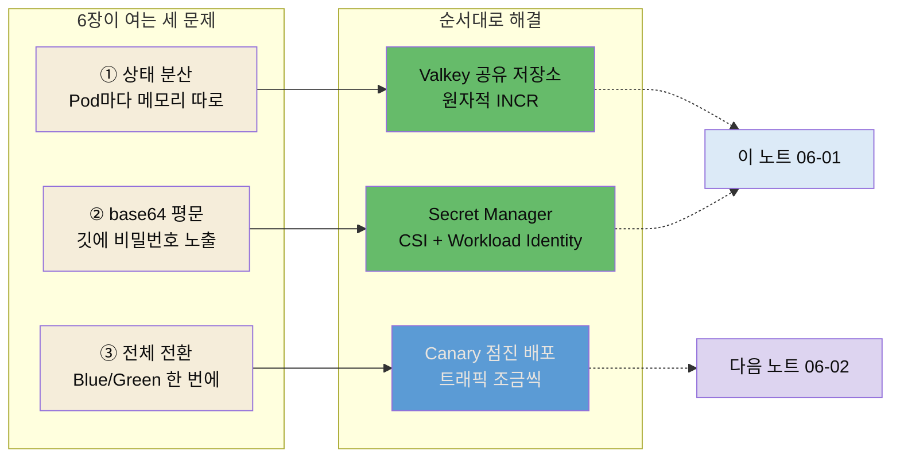
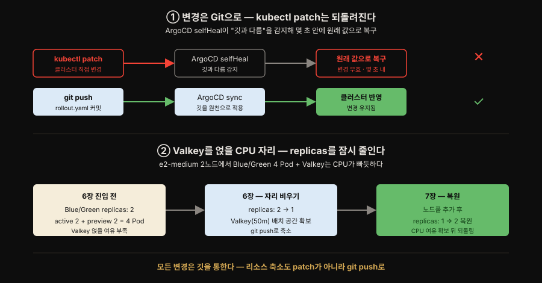
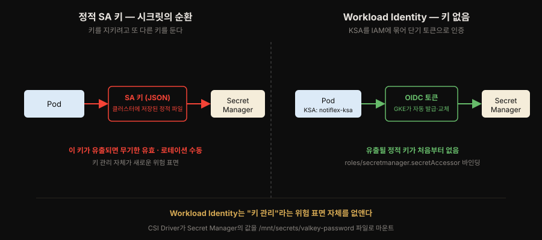
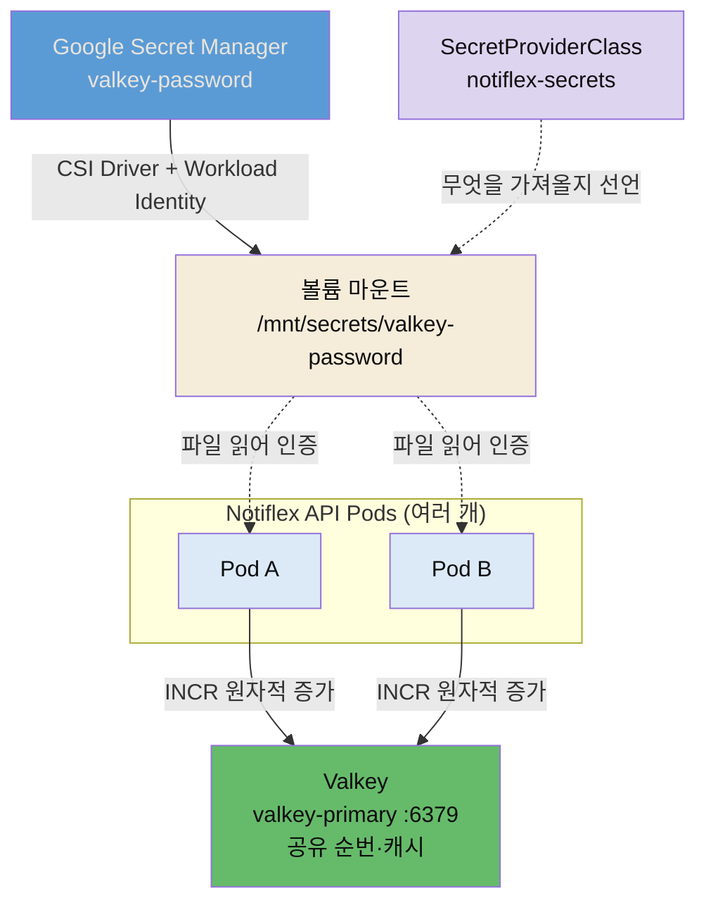

# Valkey 캐시와 Google Secret Manager
---
> **Pod가 여러 개로 늘 때 인메모리 상태가 왜 어긋나는지, 그리고 Valkey 공유 저장소의 원자적 `INCR`이 어떻게 분산 순번을 지키는지 설명하고, K8s Secret의 base64 한계를 Google Secret Manager + CSI Driver + Workload Identity로 넘어 정적 키 없이 시크릿을 파일로 주입하는 구조까지 답할 수 있다.**


## 📌 핵심 요약

> 수평 확장은 상태 분산과 시크릿 노출이라는 두 문제를 부릅니다. 상태는 Valkey 공유 저장소로, 시크릿은 Secret Manager + CSI + Workload Identity로 풉니다.

6장은 Notiflex를 엔터프라이즈 수준으로 끌어올리는 기반을 놓습니다. 그 첫 두 조각이 **상태 공유**와 **시크릿 관리**입니다.

Pod가 여러 개로 늘어나면 각 Pod가 메모리에 상태를 들고 있어, 같은 사용자의 요청이 다른 Pod로 갈 때마다 상태가 어긋납니다. 순번(sequence)을 Pod마다 따로 세면 중복이나 누락이 생깁니다. 해법은 상태를 Pod 밖 **공유 저장소**로 빼는 것입니다. Notiflex는 이 저장소로 **Valkey**를 씁니다. Redis가 2024년 라이선스를 바꾸자 Linux Foundation이 마지막 BSD 버전에서 포크한 오픈소스로, Redis와 프로토콜이 호환됩니다. Pod들은 Valkey의 `INCR` 명령으로 원자적 증가 카운터를 공유해 분산 환경에서도 일관된 순번을 얻습니다.

상태를 공유하려면 Valkey 접속 비밀번호가 필요합니다. 그런데 이 비밀번호를 담은 K8s Secret은 base64 인코딩일 뿐 암호화가 아니라, 깃에 커밋하면 누구나 원문을 볼 수 있습니다. 6장의 두 번째 조각은 이 시크릿을 안전하게 주입하는 방법입니다. **Google Secret Manager + CSI Driver + Workload Identity** 조합으로, 정적 키 파일 없이 Pod의 신원만으로 시크릿을 볼륨으로 마운트합니다. 비밀번호는 Secret Manager에만 있고, Pod는 `/mnt/secrets/valkey-password` 파일로 그것을 읽습니다.

책은 6장을 세 가지 문제로 엽니다. 고객이 늘면서 드러난 문제입니다.

1. **상태 분산** — Pod가 여러 개인데 각자 메모리에 데이터를 따로 들고 있어 API 응답이 어긋납니다.
2. **base64 평문** — 비밀번호가 YAML에 평문으로 들어 있습니다. base64는 암호화가 아닙니다.
3. **전체 전환** — Blue/Green 배포는 새 버전을 한 번에 전환해, 문제가 생기면 전체 고객이 영향을 받습니다.

6장은 이 셋을 순서대로 풉니다. 이 노트가 앞의 두 문제를, 다음 노트인 06-02가 셋째 문제를 다룹니다.




## 🎯 학습 목표

> 이 절을 읽고 나면 다음 네 가지를 할 수 있습니다.

1. Pod가 늘어날 때 인메모리 상태가 왜 문제가 되고, 공유 저장소가 어떻게 해결하는지 말할 수 있습니다.
2. Valkey가 왜 등장했는지(Redis 라이선스 변경)와 Redis와의 관계, `INCR`이 분산 순번에 적합한 이유를 설명할 수 있습니다.
3. Secret Manager + CSI Driver + Workload Identity 조합이 정적 키 없이 어떻게 시크릿을 주입하는지 설명할 수 있습니다.
4. `SecretProviderClass`와 Pod 볼륨 마운트가 어떻게 연결되는지 구분할 수 있습니다.


## 1. Pod 간 상태 공유 — Valkey 캐시

> 수평 확장의 대가는 상태 분산입니다. 세션·캐시·순번처럼 공유되어야 할 상태를 Valkey 같은 외부 저장소로 빼고, 원자적 `INCR`로 분산 순번을 지킵니다.

수평 확장의 대가는 상태 분산입니다. Pod 하나일 때는 카운터를 메모리 변수로 둬도 됐지만 Pod가 둘 이상이면 각자 다른 값을 셉니다. 로드밸런서가 요청을 이 Pod, 저 Pod로 흩뿌리면 순번이 중복되거나 건너뜁니다. 실제로 책은 이 문제를 세 요청으로 보여 줍니다. 요청 1이 Pod A에서 ID 1을 받고, 요청 2가 Pod B에서 또 ID 1을 받아 **중복**이 납니다. 요청 3은 Pod A에서 ID 2를 받습니다. 세션·캐시·순번 같은 **공유되어야 할 상태**는 Pod 바깥의 한 곳에 모아야 합니다.

Notiflex는 그 한 곳으로 Valkey를 세웁니다. Valkey는 인메모리 키-값 저장소로, 여러 Pod가 같은 Valkey에 붙어 상태를 공유합니다. 분산 순번 생성에는 Valkey의 `INCR` 명령을 씁니다. `INCR`은 **원자적**이라, 여러 Pod가 동시에 호출해도 값이 겹치지 않고 하나씩 증가합니다. 키가 없으면 0에서 시작해 1을 반환하므로 초기화도 따로 필요 없습니다. 애플리케이션은 Valkey 주소를 환경변수로 받습니다(저자 저장소 Rollout 발췌).

```yaml
env:
- name: POD_NAME
  valueFrom:
    fieldRef:
      fieldPath: metadata.name          # 어느 Pod가 처리했는지 관측용
- name: VALKEY_ADDR
  value: valkey-primary.notiflex.svc.cluster.local:6379  # 공유 저장소 주소
- name: VALKEY_PASSWORD_FILE
  value: /mnt/secrets/valkey-password   # 비밀번호는 파일에서 읽음(§2에서 완성)
```

`VALKEY_ADDR`는 클러스터 내부 DNS로 Valkey 서비스를 가리킵니다. `POD_NAME`을 함께 주입하는 이유는, 응답에 어느 Pod가 처리했는지 실어 상태 공유가 실제로 되는지 눈으로 확인하기 위해서입니다. 여러 번 요청해도 순번이 이어지면 공유가 성공한 것입니다.

### 왜 Valkey인가 — 캐시 도구 비교

책은 Valkey를 추천하기 전에 Redis·Memcached·DragonflyDB와 나란히 비교합니다.

| 도구 | 특징 | 단점 | 리소스(standalone) | Notiflex 적합도 |
|------|------|------|----------------|----------------|
| Valkey | Redis 포크, BSD 라이선스 | 커뮤니티 아직 성장 중 | 50m / 64Mi | ★★★ |
| Redis | 인메모리 DB 표준 | SSPL 라이선스(상용 제한) | 50m / 64Mi (엔진 동일) | ★★ |
| Memcached | 단순 키-값 캐시 | 영속성 없음, INCR 원자성 제한 | 50m / 64Mi | ★ |
| DragonflyDB | Redis 호환, 멀티 스레드 | 아직 성숙하지 않음, Helm Chart 미성숙 | 500m / 256Mi | ★ |

리소스 열이 도구 선택에 실제로 작용합니다. 세 도구는 standalone 모드에서 `requests 50m/64Mi`로 같습니다. 반면 DragonflyDB는 멀티 스레드 구조라 `500m/256Mi`로 10배가 듭니다. e2-medium 2노드에 Blue/Green 4 Pod가 이미 올라간 환경에서는 이 차이가 배치 가능 여부를 가릅니다. Valkey와 Redis는 엔진이 같아 리소스도 동일합니다. 둘의 차이는 라이선스뿐입니다.

Notiflex 환경에서 Valkey가 최적인 이유는 세 가지입니다.

1. 라이선스가 안전합니다. Redis의 SSPL 변경 이후 많은 기업이 Valkey로 이전 중이라, Redis를 추천하면 프로덕션에서 라이선스 이슈를 겪을 수 있습니다.
2. `INCR` 동작이 적합합니다. ID 생성에 원자적 `INCR`이 필요한데, Memcached는 키가 없을 때 동작이 달라 초기화 처리가 번거롭지만 Valkey/Redis는 키가 없으면 0에서 시작해 1을 반환합니다.
3. 영속성이 있습니다. Pod 재시작 후에도 카운터가 유지되어야 하는데, Valkey/Redis는 RDB/AOF로 영속성을 지원하지만 Memcached는 지원하지 않습니다.

### 연결 재시도 — CrashLoopBackOff 피하기

Valkey에 붙는 앱 코드에는 재시도 로직이 필요합니다. Pod가 시작될 때 Valkey DNS가 아직 전파되지 않았거나 Valkey가 먼저 기동하지 않은 경우가 있기 때문입니다. 재시도 없이 첫 연결 실패로 즉시 종료하면 `CrashLoopBackOff`에 빠집니다. 책의 Go 앱은 3초 간격 10회 재시도를 겁니다. 실제 로그를 보면 처음 1~2회는 `context deadline exceeded`로 실패하고 3번째에 성공하는데, 재시도 로직이 없었다면 이 앱은 그대로 죽었을 것입니다.

3초 간격과 10회에는 근거가 있습니다. Valkey Pod가 Ready 상태까지 걸리는 시간이 보통 5~15초라 1초 간격이면 불필요한 시도가 너무 많고, 10초 간격이면 이미 준비된 후에도 오래 기다립니다. 3초 × 10회 = 30초는 쿠버네티스 기본 `initialDelaySeconds`와 비슷한 실용값입니다. 프로덕션에서는 지수 백오프(1→2→4→8초)를 쓰기도 합니다.

### Valkey 설치 — GitOps 경로와 자리 확보

설치 자체에도 두 가지 함정이 있습니다. 하나는 *어떻게 변경하는가*, 다른 하나는 *어디에 얹을 자리를 만드는가*입니다.



첫째, replicas 같은 값을 바꿀 때 `kubectl patch`로 클러스터를 직접 건드리면 안 됩니다. 3장에서 켠 ArgoCD의 `selfHeal: true`가 "깃과 다르다"고 판단해 몇 초 안에 원래 값(깃에 적힌 값)으로 되돌리기 때문입니다. 변경은 반드시 깃을 통해야 합니다. rollout.yaml을 고쳐 커밋·푸시하면 ArgoCD가 그것을 원천으로 삼아 반영하고, 그제야 변경이 유지됩니다.

```bash
# ❌ 클러스터 직접 변경 — ArgoCD selfHeal이 몇 초 뒤 replicas: 2로 되돌림
kubectl patch rollout notiflex-api -n notiflex --type=merge -p '{"spec":{"replicas":1}}'

# ✅ 깃 경로 — rollout.yaml을 고쳐 커밋하면 ArgoCD가 원천으로 반영, 유지됨
sed -i '' 's/replicas: 2/replicas: 1/' k8s/smb/rollout.yaml
git commit -am "chore: reduce replicas to 1 for ch6 resource budget"
git push origin main
```

둘째, Valkey를 얹을 CPU 자리를 먼저 비웁니다. 현재 Blue/Green 전략은 replicas가 2라, 배포 시 active와 preview를 합쳐 4개 Pod가 동시에 뜹니다. 여기에 Valkey까지 더하면 e2-medium 2노드에서 CPU가 부족해질 수 있습니다. 그래서 6장에서는 replicas를 잠시 1로 줄여 자리를 확보하고, 7장에서 노드풀을 추가한 뒤 다시 2로 복원합니다. 축소도 위 원칙대로 `kubectl patch`가 아니라 git push로 합니다.

설치는 Bitnami Helm Chart로 하되 두 가지를 명시적으로 지정합니다. `architecture=standalone`은 단일 노드 학습 환경에 맞추기 위해서이고, `primary.resourcesPreset=none`은 Bitnami 기본 preset이 높은 리소스를 요청하므로 비활성화하고 위에서 계산한 `50m/64Mi`를 직접 지정하기 위해서입니다. 설치 후 `valkey-cli ... PING`이 `PONG`을 반환하면 접속이 확인됩니다.


## 2. 시크릿 관리 — Google Secret Manager

> K8s Secret은 base64 인코딩일 뿐 암호화가 아닙니다. Secret Manager에 값을 두고 CSI Driver로 파일 마운트하며 Workload Identity로 정적 키 없이 인증해, 비밀번호를 깃에서 완전히 걷어냅니다.

`VALKEY_PASSWORD_FILE`이 파일 경로라는 점이 §1과 §2를 잇는 고리입니다. §1에서 Valkey 비밀번호는 Helm이 자동 생성한 K8s Secret으로 시작했습니다. 그런데 K8s Secret은 base64 인코딩일 뿐 암호화가 아니라, `base64 -d` 한 줄이면 누구나 원문을 봅니다. 깃에 커밋되면 그대로 노출됩니다. §2는 이 비밀번호를 Secret Manager로 옮겨, 앱이 환경변수 값이 아니라 파일에서 읽게 만듭니다.

과거 방식은 서비스 계정 키(JSON 파일)를 클러스터에 넣고 그 키로 Secret Manager에 접근했습니다. 이 키 자체가 또 다른 시크릿이라, "시크릿을 지키려고 시크릿을 두는" 순환에 빠집니다. Notiflex는 **정적 키 없는** 방식을 씁니다. 세 조각이 맞물립니다.

- **Secret Manager**: 비밀번호의 진짜 보관소. 값은 여기에만 있습니다.
- **Secret Manager CSI Driver**: 시크릿을 Pod에 **볼륨**으로 마운트하는 드라이버. Pod는 시크릿을 평범한 파일처럼 읽습니다.
- **Workload Identity**: Pod의 쿠버네티스 서비스 계정(KSA)을 Google IAM 신원에 묶어, 키 파일 없이 Pod의 신원만으로 인증합니다.

정적 키 방식과 Workload Identity의 차이를 그림으로 보면 다음과 같습니다.



### 왜 CSI Driver + Secret Manager인가 — 시크릿 도구 비교

책은 시크릿 관리 도구도 네 가지를 비교합니다.

| 방식 | 장점 | 단점 | Notiflex 적합도 |
|------|------|------|----------------|
| CSI Driver + Secret Manager | Workload Identity로 SA 키 불필요, 감사 로그 | 설정 단계 많음 | ★★★ |
| Sealed Secrets | GitOps 100% 호환, 설치 간편 | 키 관리 필요, GCP 통합 없음 | ★★ |
| External Secrets Operator | 다양한 프로바이더 지원, 설정 직관적 | 별도 Operator 설치 | ★★ |
| kubectl create secret | 가장 간단 | 깃 커밋 불가, base64만, 감사 없음 | ★ |

CSI Driver + Secret Manager는 설정 단계가 가장 많습니다. 하지만 한 번 설정하면 이후 시크릿 추가·변경이 Secret Manager에서만 이루어져, 장기적으로 관리 부담이 가장 적습니다. GKE에서는 Workload Identity로 SA 키 관리 부담이 사라지고, Google Secret Manager가 Cloud Audit Logs와 통합돼 누가 언제 시크릿에 접근했는지 추적됩니다.

### SecretProviderClass와 볼륨 마운트

무엇을 가져올지는 `SecretProviderClass`가 선언합니다(저자 저장소 `secretproviderclass.yaml` 실물).

```yaml
apiVersion: secrets-store.csi.x-k8s.io/v1
kind: SecretProviderClass
metadata:
  name: notiflex-secrets
  namespace: notiflex
spec:
  provider: gke                    # GKE managed 사용 (오픈소스는 gcp)
  parameters:
    secrets: |
      - resourceName: "projects/PROJECT_ID/secrets/valkey-password/versions/latest"
        path: "valkey-password"    # 마운트될 파일 이름
```

`resourceName`은 Secret Manager의 시크릿을 가리키고, `path`는 그것이 볼륨 안에서 어떤 파일명으로 나타날지 정합니다. Pod는 이 SecretProviderClass를 CSI 볼륨으로 연결합니다.

```yaml
spec:
  template:
    spec:
      serviceAccountName: notiflex-ksa   # Workload Identity에 묶인 KSA
      volumes:
      - name: secrets
        csi:
          driver: secrets-store-gke.csi.k8s.io   # GKE managed 드라이버 (오픈소스는 secrets-store.csi.k8s.io)
          readOnly: true
          volumeAttributes:
            secretProviderClass: notiflex-secrets
      containers:
      - name: api
        volumeMounts:
        - name: secrets
          mountPath: /mnt/secrets    # 여기 아래에 valkey-password 파일이 생김
          readOnly: true
```

`provider`와 `driver` 이름을 GKE managed용으로 정확히 써야 합니다. GKE managed는 provider `gke` / driver `secrets-store-gke.csi.k8s.io`이고, 오픈소스 Secrets Store CSI는 provider `gcp` / driver `secrets-store.csi.k8s.io`입니다. `--enable-secret-manager`로 켠 것은 GKE managed 버전이라 이 이름을 써야 합니다. 이름이 비슷해 섞어 쓰면 오설정이 두 지점에서 다르게 드러납니다.

- `SecretProviderClass`에 `provider: gcp`(오픈소스 이름)를 쓰면 → `provider not found` 에러가 납니다.
- 볼륨의 `csi.driver`에 오픈소스 이름 `secrets-store.csi.k8s.io`를 쓰면 → Pod가 `ContainerCreating` 상태에서 멈춥니다.

이름 하나 차이로 Pod가 아예 시작되지 않으므로, 매니페스트에서 provider와 driver가 둘 다 GKE managed 이름인지 확인해야 합니다.

이제 흐름이 완성됩니다. Pod가 뜨면 CSI 드라이버가 KSA의 Workload Identity로 Secret Manager에 접근해 `valkey-password`를 가져오고, `/mnt/secrets/valkey-password` 파일로 마운트합니다. 애플리케이션은 `VALKEY_PASSWORD_FILE`이 가리키는 그 파일을 읽어 Valkey에 인증합니다. 비밀번호는 매니페스트에도, 코드에도, 깃에도 남지 않습니다.

### 파일 우선, 환경변수 폴백 — 환경마다 코드는 하나로

앱 코드는 환경변수 값을 직접 읽던 것을 파일 우선으로 바꿉니다. 이유는 로컬 개발 환경과 클러스터의 시크릿 주입 방식이 다르기 때문입니다. 로컬에는 CSI Driver가 없어 파일 마운트를 못 하므로 환경변수로 비밀번호를 넘기고, 클러스터에서는 파일 마운트를 씁니다. 코드가 이 둘을 모두 받아 주면 환경별로 *설정*만 다르고 *코드*는 같아집니다.

```go
// 기본값은 환경변수 — 로컬처럼 CSI가 없는 환경의 폴백 경로
pass := os.Getenv("VALKEY_PASSWORD")

// 파일 경로가 주어지면 파일을 우선 — 클러스터의 CSI 마운트 경로
// 파일이 있다는 건 CSI가 시크릿을 볼륨으로 넣어 줬다는 신호
if pwFile := os.Getenv("VALKEY_PASSWORD_FILE"); pwFile != "" {
    if data, err := os.ReadFile(pwFile); err == nil {
        pass = string(data)
    }
}
```

`VALKEY_PASSWORD_FILE`이 있으면 그 파일에서 읽고, 없으면 기존 `VALKEY_PASSWORD` 환경변수를 씁니다. 로컬에서는 환경변수만 넣으면 되고, 클러스터에서는 파일 마운트가 자동으로 잡힙니다. 하위 호환을 유지하므로 기존 로컬 워크플로를 깨지 않습니다.

CSI addon을 켤 때는 리소스도 고려합니다. `--enable-secret-manager`로 활성화하면 노드당 2개의 DaemonSet(`csi-secrets-store-gke`·`csi-secrets-store-provider-gke`)이 배포돼 노드당 약 120m CPU(2노드 합계 240m)가 추가로 듭니다. 그래서 책은 이 단계 전에 Prometheus·Alertmanager의 CPU requests를 최소화해 자리를 비워 둡니다.


## 🔍 심화 학습

> 이 절은 책 본문 밖에서 조사한 배경입니다. 라이선스 역사·인증 구조·이미지 정책의 맥락 보강이며, 책 원문이 아닙니다.

### Valkey는 왜 태어났는가 — Redis 라이선스 변경

2024년 3월, Redis Ltd.는 Redis의 라이선스를 관대한 **BSD-3-Clause**에서 **SSPL + RSALv2** 이중 라이선스로 바꿨습니다(Redis 7.4부터). SSPL·RSALv2는 오픈소스 이니셔티브(OSI)가 오픈소스로 인정하지 않는 라이선스로, 클라우드 사업자가 Redis를 관리형 서비스로 제공하려면 상업 계약을 맺어야 하는 제약을 둡니다.

이에 Linux Foundation이 곧바로 **Valkey**를 띄웠습니다. 마지막 BSD 버전인 Redis 7.2.4에서 포크해 원래의 BSD-3-Clause로 개발을 이어갑니다. AWS·Google Cloud·Oracle 같은 대형 사업자들이 뒤를 받칩니다. Redis Ltd.가 단독 통제하던 것과 달리 Linux Foundation의 중립적 커뮤니티 거버넌스로 운영됩니다.

Fedora 41에서 패키지 매니저의 `redis`가 Valkey로 대체되었을 정도로 사실상 후계자로 자리잡았습니다. Redis 7.2와 와이어 프로토콜·API가 호환되는 **드롭인 대체재**로 설계돼, 기존 Redis 클라이언트 코드를 그대로 쓸 수 있습니다.

- 출처: [Redis vs Valkey 포크 해설 (OneUptime)](https://oneuptime.com/blog/post/2026-03-31-redis-vs-valkey-fork-explained/view)
- 출처: [Valkey — 오픈소스 Redis 포크 (linkconfig)](https://linkconfig.com/blog/valkey-open-source-redis-fork)

### Bitnami 이미지 유료화 — 학습용 :latest만 무료

Notiflex는 Valkey를 Bitnami Helm Chart로 설치합니다. 그런데 2025년 8월부터 Bitnami의 모회사 Broadcom이 컨테이너 이미지 접근 정책을 바꿨습니다. Helm Chart 소스 코드는 Apache 2.0으로 그대로지만, 컨테이너 이미지 정책이 달라졌습니다.

- `:latest` 태그만 무료라, 학습·개발 환경은 문제가 없습니다.
- `valkey:7.2.5` 같은 버전 고정 이미지는 Bitnami Secure Images(BSI) 구독(연 약 $50,000~72,000)이 필요합니다.

프로덕션에서는 Docker Hub 공식 이미지(`docker.io/valkey/valkey`)를 Helm values의 `image.registry`·`image.repository`로 오버라이드하거나 Chainguard 같은 호환 보안 이미지로 바꾸는 편이 안전합니다. 이 책에서 Bitnami 유료화의 영향 범위는 Valkey 한 곳으로 제한됩니다.

- 출처: [Bitnami/Broadcom 이미지 정책 변경 (Bitnami 공지)](https://github.com/bitnami/containers/issues/83267)

### Workload Identity가 없애는 것 — 정적 키의 위험

Workload Identity의 가치는 "무엇을 없애는가"로 보면 분명합니다. 정적 서비스 계정 키(JSON)는 한 번 유출되면 무기한 유효하고 로테이션이 수동이며 어디에 복사됐는지 추적하기 어렵습니다. Workload Identity는 이 키 자체를 없앱니다. KSA에 IAM 역할(`roles/secretmanager.secretAccessor`)을 바인딩하면, GKE가 Pod의 신원을 Google에 증명하는 단기 OIDC 토큰을 자동 발급·교체합니다. 유출될 정적 크리덴셜이 처음부터 존재하지 않으니 키 관리라는 위험 표면 자체가 사라집니다.

단 클러스터와 노드풀 양쪽 모두에서 Workload Identity가 활성화돼야 합니다. 한쪽만 켜면 `metadata server not available` 에러가 납니다. Notiflex는 2장에서 클러스터를 만들 때 `--workload-pool` 옵션을 이미 포함했으므로, 6장 시점에는 새로 켤 필요 없이 활성 여부만 확인하면 됩니다. 확인 명령과 기대 출력은 다음과 같습니다.

```bash
# 클러스터 측 — workloadPool이 PROJECT_ID.svc.id.goog로 나오면 활성
gcloud container clusters describe notiflex-cluster --zone=asia-northeast3-a \
  --format='value(workloadIdentityConfig.workloadPool)'
# → PROJECT_ID.svc.id.goog

# 노드풀 측 — mode가 GKE_METADATA면 노드도 활성 (양쪽 다 켜져야 함)
gcloud container node-pools describe default-pool --cluster=notiflex-cluster \
  --zone=asia-northeast3-a --format='value(config.workloadMetadataConfig.mode)'
# → GKE_METADATA
```

클러스터 쪽 `workloadPool`과 노드풀 쪽 `GKE_METADATA`가 둘 다 나와야 조합이 동작합니다. 하나만 켜져 있으면 Pod가 메타데이터 서버에 닿지 못해 인증이 실패합니다.

- 출처: [GKE에서 Secret Manager를 볼륨으로 마운트 (Google Cloud 문서)](https://cloud.google.com/secret-manager/docs/secret-manager-managed-csi-component)


## 💡 실무 적용 포인트

> 상태를 밖으로 빼는 순간을 놓치지 않고, 원자성은 저장소에 위임하며, 시크릿은 파일 마운트 + 정적 키 제거로 다루는 것이 이 절의 실무 축입니다.

- **상태를 밖으로 빼는 순간을 놓치지 않기**: Pod를 1개에서 2개로 늘리는 그 시점이 인메모리 상태를 공유 저장소로 옮겨야 하는 순간입니다. 순번·세션·캐시가 Pod 로컬 메모리에 있다면 확장 전에 먼저 외부화하세요.
- **원자성이 필요한 연산은 저장소에 위임**: 분산 순번처럼 "동시에 호출해도 겹치면 안 되는" 연산은 애플리케이션에서 락을 걸기보다 Valkey `INCR` 같은 원자적 명령에 맡기는 편이 단순하고 안전합니다.
- **외부 의존 연결에는 재시도 로직을**: Valkey·DB처럼 앱보다 늦게 뜰 수 있는 의존성은 시작 시 재시도(3초 간격 10회 또는 지수 백오프)를 넣어야 첫 연결 실패로 `CrashLoopBackOff`에 빠지지 않습니다.
- **시크릿은 파일 마운트로, 값 주입은 피하기**: 비밀번호를 환경변수 값(`value:`)으로 넣으면 매니페스트에 남습니다. CSI 볼륨으로 파일 마운트하고 애플리케이션이 파일을 읽게 하면, 깃에는 경로만 남고 값은 Secret Manager에만 있습니다.
- **정적 키를 만들지 않기**: 서비스 계정 키 JSON을 클러스터에 넣는 방식은 그 키가 새 위험이 됩니다. Workload Identity로 KSA를 IAM에 바인딩해 정적 크리덴셜 자체를 없애세요.
- **드라이버 이름을 정확히**: GKE managed는 `secrets-store-gke.csi.k8s.io`(provider `gke`)입니다. 오픈소스 이름을 섞으면 지점마다 다르게 터집니다 — `SecretProviderClass`에 `provider: gcp`면 `provider not found`, 볼륨 `csi.driver`에 오픈소스 이름이면 Pod가 `ContainerCreating`에서 멈춥니다. 매니페스트에서 둘 다 확인하세요.
- **변경은 깃으로**: `selfHeal`이 켜진 ArgoCD 환경에서 `kubectl patch`로 클러스터를 직접 바꾸면 몇 초 뒤 되돌려집니다. replicas 축소 같은 리소스 조정도 rollout.yaml을 고쳐 git push하세요.
- **환경마다 코드는 하나로**: 로컬은 CSI가 없어 환경변수로, 클러스터는 파일 마운트로 시크릿을 받습니다. `VALKEY_PASSWORD_FILE`이 있으면 파일, 없으면 환경변수로 폴백하면 설정만 다르고 코드는 같아집니다.

### 상태 공유·시크릿 주입 경로




## ✅ 핵심 개념 체크리스트

- [ ] Pod 확장 시 인메모리 상태가 왜 깨지는지, 공유 저장소가 어떻게 해결하는지 압니다.
- [ ] Valkey가 Redis 라이선스 변경(2024, BSD→SSPL)의 결과로 태어난 BSD 포크임을 압니다.
- [ ] `INCR`이 원자적이고 키가 없으면 0에서 시작하는 이유로 분산 순번에 적합함을 설명할 수 있습니다.
- [ ] Secret Manager·CSI Driver·Workload Identity 세 조각의 역할을 각각 구분할 수 있습니다.
- [ ] `SecretProviderClass`의 `resourceName`/`path`와 Pod 볼륨 마운트가 어떻게 연결되는지 압니다.
- [ ] GKE managed CSI 드라이버 이름이 `secrets-store-gke.csi.k8s.io`(provider `gke`)임을 압니다.
- [ ] `selfHeal` 환경에서 변경은 `kubectl patch`가 아니라 git push로 해야 하는 이유를 압니다.
- [ ] `VALKEY_PASSWORD_FILE` 파일 우선 + 환경변수 폴백이 로컬·클러스터를 한 코드로 묶는 방식임을 압니다.


## ☕ Spring 앱 개발 관점

> Valkey는 Redis 프로토콜 호환이라 Spring Data Redis로 그대로 붙고, `INCR`은 `RedisAtomicLong`으로 씁니다. 시크릿은 Spring Cloud GCP Secret Manager 스타터로 프로퍼티에 직접 주입합니다. 책은 Go 앱이라 클라이언트를 직접 다루지만, Spring이면 스타터 두 개로 끝납니다. 책에 없는 내용이라 공식 문서로 보강합니다.

Notiflex의 Go 앱은 `valkey-go` 클라이언트로 연결·재시도·`INCR`을 직접 코딩합니다. Spring Boot라면 Valkey가 Redis 와이어 프로토콜 호환이라, 별도 Valkey 라이브러리 없이 `spring-boot-starter-data-redis`(기본 Lettuce)로 그대로 붙습니다.

```gradle
// build.gradle — Valkey는 Redis 호환이라 Redis 스타터를 그대로 씁니다
implementation 'org.springframework.boot:spring-boot-starter-data-redis'
```

분산 순번의 원자적 `INCR`은 `RedisAtomicLong`으로 감쌉니다. Go의 `client.B().Incr()...`와 같은 일을, 자바에서는 다음 한 줄이 합니다.

```java
// 여러 Pod가 동시에 호출해도 겹치지 않는 원자적 순번
RedisAtomicLong counter = new RedisAtomicLong("notiflex:id", redisConnectionFactory);
long id = counter.incrementAndGet();   // 키 없으면 0에서 시작해 1 반환 — Go INCR과 동일
```

시크릿 주입은 Spring Cloud GCP가 Secret Manager를 프로퍼티 소스로 노출해 더 매끄럽습니다. CSI 파일 마운트 대신, `spring-cloud-gcp-starter-secretmanager`를 넣고 프로퍼티에서 Secret Manager 값을 직접 참조할 수 있습니다.

```gradle
implementation 'com.google.cloud:spring-cloud-gcp-starter-secretmanager'
```

```yaml
# application.yml — Spring Cloud GCP 6.x 표기법
spring:
  config:
    import: sm@          # Secret Manager를 프로퍼티 소스로 가져옴
  data:
    redis:
      password: ${sm@valkey-password}   # Secret Manager의 valkey-password 주입
```

`sm@` 표기가 6.x의 정식 방식입니다. 이전 5.x의 `sm://` placeholder는 레거시라, 새로 작성한다면 `spring.config.import=sm@`와 `${sm@시크릿이름}`을 씁니다. 인증은 책과 동일하게 Workload Identity가 처리합니다. GKE에서 KSA를 IAM에 바인딩해 두면 Spring Cloud GCP가 그 신원으로 Secret Manager에 접근하므로, 애플리케이션에 SA 키 파일을 넣을 필요가 없습니다.

즉 이 노트가 Go 클라이언트로 직접 푼 Valkey 연결과 시크릿 주입이, Spring에서는 스타터 두 개(`data-redis`·`gcp-starter-secretmanager`)와 프로퍼티 몇 줄로 끝납니다.


## 면접에서 받을 만한 질문

> 먼저 스스로 답을 소리 내어 말해 본 뒤, 아래 §정답 섹션을 펼쳐 맞춰 봅니다. "상태 공유와 시크릿을 어떻게 했나"에는 인메모리 문제 → Valkey INCR → Secret Manager+CSI+WI 순서로 답하면 됩니다.

1. Pod를 여러 개로 늘렸더니 순번이 중복됩니다. 왜죠? 어떻게 해결합니까?
2. Redis 대신 Valkey를 쓰는 이유는 무엇입니까? 둘의 관계는?
3. K8s Secret이 있는데 왜 Secret Manager가 또 필요합니까?
4. 시크릿을 코드나 매니페스트에 안 넣고 어떻게 Pod에 전달합니까? Workload Identity의 역할은?
5. (Spring 관점) Spring Boot 앱에서 Valkey 연결과 시크릿 주입을 각각 어떻게 합니까?

### 빈칸 채우기 — SecretProviderClass와 CSI 볼륨

GKE managed CSI에서 `SecretProviderClass`의 `spec.provider`는 `①____`이고, Pod 볼륨의 `csi.driver`는 `②____`입니다. Secret Manager의 어떤 시크릿을 가져올지는 `parameters.secrets`의 `③____` 필드로 지정합니다.


## 정답 (자답 후 펼치기)

> 위 §면접에서 받을 만한 질문의 5개에 *먼저 자답한 뒤* 아래를 읽으세요. 자답 없이 먼저 읽으면 학습 효과가 0입니다.

### 정답 1 — 순번 중복과 공유 저장소

각 Pod가 순번을 자기 메모리에서 세기 때문입니다. 인메모리 상태는 Pod 간 공유되지 않으므로, 요청이 다른 Pod로 갈 때마다 값이 어긋납니다. Valkey 같은 공유 저장소로 상태를 외부화하고 `INCR` 같은 원자적 연산으로 순번을 생성하면, 여러 Pod가 동시에 호출해도 겹치지 않습니다.

### 정답 2 — 왜 Valkey인가

2024년 Redis가 BSD에서 SSPL/RSALv2로 라이선스를 바꿔 OSI 기준 오픈소스가 아니게 됐고, 클라우드 관리형 제공에 제약이 생겼습니다. Linux Foundation이 마지막 BSD 버전(Redis 7.2.4)에서 포크한 Valkey는 원래 BSD 라이선스를 유지하고 Redis 7.2와 프로토콜이 호환돼 드롭인 대체가 가능합니다. 기존 Redis 클라이언트 코드를 그대로 씁니다.

### 정답 3 — K8s Secret이 있는데 왜 Secret Manager인가

K8s Secret은 base64 인코딩일 뿐 암호화가 아니라서 `base64 -d` 한 줄로 원문이 드러납니다. 깃에 커밋되면 그대로 노출됩니다. Secret Manager는 값을 클러스터 밖 관리형 저장소에 둡니다. Cloud Audit Logs로 접근을 추적하고, 버전 관리와 롤백을 제공합니다. base64 한계를 넘어 "깃에 값이 남지 않는" 상태를 만듭니다.

### 정답 4 — 정적 키 없는 시크릿 주입

Secret Manager에 값을 두고 CSI Driver로 볼륨 마운트하며, Workload Identity로 Pod의 KSA를 IAM에 바인딩해 정적 키 없이 인증합니다. Workload Identity는 SA 키 파일 대신 GKE가 자동 발급·교체하는 단기 OIDC 토큰을 쓰므로 유출될 정적 크리덴셜이 처음부터 없습니다. `SecretProviderClass`가 어떤 시크릿을 가져올지 선언하면, CSI 드라이버가 `/mnt/secrets/` 아래 파일로 마운트하고 애플리케이션은 그 파일을 읽습니다.

### 정답 5 — Spring에서 Valkey·시크릿

Valkey는 Redis 프로토콜 호환이라 `spring-boot-starter-data-redis`(Lettuce)로 그대로 연결하고, 원자적 순번은 `RedisAtomicLong.incrementAndGet()`으로 씁니다. 시크릿은 `spring-cloud-gcp-starter-secretmanager`를 넣고 `spring.config.import=sm@` + `${sm@valkey-password}`로 Secret Manager 값을 프로퍼티에 직접 주입합니다. 인증은 Workload Identity가 처리하므로 SA 키 파일이 필요 없습니다.

### 정답 빈칸 — ①gke ②secrets-store-gke.csi.k8s.io ③resourceName

GKE managed는 provider `gke` / driver `secrets-store-gke.csi.k8s.io`이고(오픈소스는 `gcp`/`secrets-store.csi.k8s.io`), `parameters.secrets`의 `resourceName`으로 `projects/.../secrets/valkey-password/versions/latest` 형태의 대상 시크릿을 가리킵니다.


## 관련 문서

> 이 노트는 05-02의 배포 전략 위에서 상태·시크릿 기반을 놓고, 다음 절의 Canary 점진 배포와 3층 지식 구조로 이어집니다.

- [05-02. Blue-Green 무중단 전환과 아키텍처 결정 기록](./05-02.Blue-Green%20%EB%AC%B4%EC%A4%91%EB%8B%A8%20%EC%A0%84%ED%99%98%EA%B3%BC%20%EC%95%84%ED%82%A4%ED%85%8D%EC%B2%98%20%EA%B2%B0%EC%A0%95%20%EA%B8%B0%EB%A1%9D.md) § "Spring 앱 개발 관점" — 무상태 앱 전제가 여기의 상태 외부화(Valkey)로 실현됨
- [06-02. 점진적 배포 Canary와 claude-context](./06-02.%EC%A0%90%EC%A7%84%EC%A0%81%20%EB%B0%B0%ED%8F%AC%20Canary%EC%99%80%20claude-context.md) — 6장 세 문제 중 ③(전체 전환 위험)을 Canary로 푸는 편. 이 노트가 앞의 두 문제를 맡습니다
- [README](./README.md) — 6장 전체 지도와 형제 노트 목록
