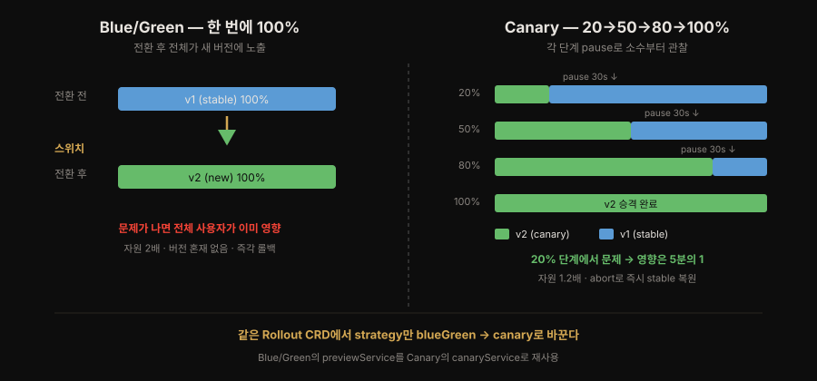
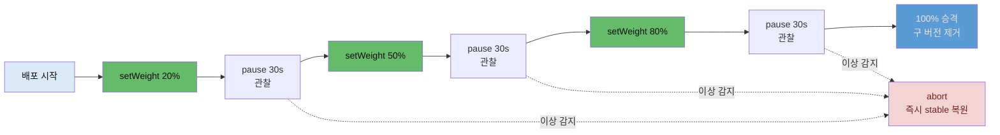

# 점진적 배포 Canary와 claude-context
---
> **Canary가 트래픽을 20→50→80→100%로 점진 전환하며 각 단계 pause로 소수부터 위험을 관찰하는 원리를 설명하고, 5장 Blue/Green과 같은 `Rollout` CRD에서 `strategy`만 바꿔 구현하며, 현재 아키텍처 스냅샷을 `claude-context/`로 남겨 CLAUDE.md·memory와 함께 3층 지식 구조를 이루는 것까지 답할 수 있다.**


## 📌 핵심 요약

> Blue/Green이 트래픽을 한 번에 전환했다면 Canary는 조금씩 전환합니다. 같은 Argo Rollouts에서 strategy만 바꿔 구현하고, 6장의 산출물로 현재 아키텍처를 claude-context에 스냅샷으로 남깁니다.

6장은 배포 전략을 한 단계 더 발전시킵니다. 5장의 Blue/Green이 트래픽을 **한 번에** 전환했다면, Canary는 **조금씩** 전환합니다. 새 버전에 트래픽을 20% → 50% → 80%로 단계적으로 늘리고, 각 단계 사이에 멈춰(pause) 이상이 없는지 지켜본 뒤 다음 단계로 넘어갑니다. 문제가 초기 단계에서 드러나면 소수 사용자만 영향을 받고 즉시 되돌릴 수 있습니다. 광부가 유독가스를 먼저 감지하려고 데려간 카나리아 새에서 이름을 따왔습니다.

Notiflex는 이것도 Argo Rollouts로 구현합니다. 5장에서 쓴 `Rollout` 오브젝트의 `strategy`만 `blueGreen`에서 `canary`로 바꾸고, `steps`에 `setWeight`와 `pause`를 번갈아 나열합니다. 저자 완성본의 최종 배포 전략이 바로 이 Canary입니다.

6장의 Claude 협업 산출물은 **`claude-context/`**입니다. 3장의 `CLAUDE.md`(행동 규칙), 4장의 `.claude/memory/`(결정의 이유), 5장의 ADR에 이어, 이제 현재 아키텍처의 **스냅샷**을 한 페이지로 정리해 AI가 매 대화에서 시스템 전체 그림을 빠르게 잡게 합니다. 여러 문서가 각자 다른 역할과 갱신 주기를 갖는 **지식의 계층 구조**가 여기서 완성됩니다.


## 🎯 학습 목표

> 이 절을 읽고 나면 다음 네 가지를 할 수 있습니다.

1. Canary와 Blue/Green의 차이를 트래픽 전환 방식과 위험 노출 관점에서 말할 수 있습니다.
2. Argo Rollouts의 `canary` 전략에서 `setWeight`·`pause`·`steps`·`abort`가 어떻게 동작하는지 설명할 수 있습니다.
3. `claude-context/`가 무엇이고 `CLAUDE.md`·`.claude/memory/`와 어떻게 역할이 나뉘는지 구분할 수 있습니다.
4. 3층 지식 구조(규칙·결정 이유·현재 스냅샷)가 AI 협업에서 왜 유용한지 설명할 수 있습니다.


## 1. 점진적 배포 — Canary

> Canary는 위험을 소수에게 먼저 노출합니다. 트래픽을 20→50→80%로 늘리며 각 단계 pause로 관찰하고, 문제가 나면 `abort`로 즉시 stable로 되돌립니다.

Canary의 핵심은 **위험을 소수에게 먼저 노출**하는 것입니다. 새 버전을 전체 사용자에게 한 번에 열지 않고 먼저 20%에게만 보냅니다. 이 상태로 잠시 멈춰 오류율·지연을 지켜봅니다. 문제가 없으면 50%로, 다시 80%로 늘려 갑니다. 만약 20% 단계에서 오류가 터지면 영향받는 사용자는 5분의 1뿐입니다. `kubectl argo rollouts abort`로 중단하면 트래픽 전체가 즉시 stable 버전으로 돌아갑니다.

이 점진 전환을 Blue/Green과 나란히 놓고 보면 차이가 분명합니다.



Argo Rollouts에서는 `Rollout`의 `strategy`를 `canary`로 두고 `steps`를 나열합니다(저자 저장소 `rollout.yaml` 실물 — 완성본의 최종 전략).

```yaml
  strategy:
    canary:
      canaryService: notiflex-api-preview   # 새 버전으로 가는 서비스 (Blue/Green의 preview 재사용)
      stableService: notiflex-api           # 기존 안정 버전 서비스
      steps:
      - setWeight: 20            # 새 버전에 트래픽 20%
      - pause: {duration: 30s}   # 30초 관찰
      - setWeight: 50            # 50%로 증가
      - pause: {duration: 30s}   # 30초 관찰
      - setWeight: 80            # 80%로 증가
      - pause: {duration: 30s}   # 30초 관찰
      # 마지막 단계 후 100%로 승격, 구 버전 제거
```

`canaryService`와 `stableService`는 각각 새 버전과 기존 버전을 가리키는 Service입니다. 5장 Blue/Green에서 만든 `notiflex-api-preview`를 Canary에서는 `canaryService`로 재사용합니다. 이 서비스를 삭제하면 안 됩니다. Argo Rollouts는 `setWeight` 값에 맞춰 두 서비스 사이의 트래픽 비율을 조정하고, `pause` 동안 멈춰 다음 지시를 기다립니다. `pause: {duration: 30s}`는 30초 뒤 자동으로 다음 단계로 넘어가고, `pause: {}`처럼 duration을 비우면 사람이 `promote`할 때까지 무한 대기합니다.

한 가지 정확히 짚을 점은 트래픽 분할 방식입니다. Argo Rollouts는 트래픽 라우터(Gateway API·Istio·NGINX 등) 없이도 replica 비율로 근사 분할을 하지만, `setWeight`를 정확한 비율로 지키려면 라우터가 필요합니다. Notiflex는 5장에서 세운 Gateway API가 그 역할을 맡아, HTTPRoute의 가중치로 정밀하게 트래픽을 나눕니다.

### 왜 Canary인가 — 무중단 배포 도구 비교

책은 Canary를 채택하기 전에 Flagger·K8s native와 비교합니다.

| 구분 | Argo Rollouts | Flagger | K8s native Rolling |
|------|---------------|---------|--------------------|
| Blue/Green | 지원 | 제한적 | 불가 |
| Canary | 지원 | 지원 | 불가 |
| 메트릭 기반 분석 | 지원 | 강력 지원 | 없음 |
| ArgoCD 통합 | 네이티브 | 약함 | 해당 없음 |
| Istio 의존성 | 없음 | 있음(기본) | 없음 |

Notiflex가 Argo Rollouts를 유지하는 결정적 이유는 **전환 비용**입니다. 5장에서 Blue/Green을 이미 Argo Rollouts로 구현했으므로, Canary로 바꿀 때 같은 `Rollout` CRD에서 `strategy` 필드만 고치면 됩니다. Flagger는 별도의 Canary CRD를 써서 전환이 더 복잡하고, Istio를 기본 의존성으로 요구해 Spot VM 2대 환경에는 무겁습니다. 자원도 Blue/Green이 2배인 데 비해 Canary는 약 1.2배라 소규모 클러스터에 더 맞습니다.

### 전략 전환은 Git 먼저 — ArgoCD auto-sync 함정

배포 전략을 Blue/Green에서 Canary로 바꿀 때는 순서가 중요합니다. ArgoCD가 auto-sync 상태라, 클러스터에서 `Rollout`을 먼저 삭제하면 ArgoCD가 깃의 이전(Blue/Green) 버전으로 즉시 되돌려 전략 전환이 실패합니다. 반드시 **Git push로 깃에 Canary 버전을 올린 뒤** Rollout을 삭제하고, ArgoCD를 hard refresh해 재적용하는 순서를 따릅니다. 3장에서 세운 GitOps 원칙(모든 변경은 깃을 통해)이 여기서도 그대로 작동합니다.


## 2. 마무리 — claude-context로 현재 아키텍처 정리하기

> `claude-context/`는 현재 아키텍처의 스냅샷입니다. CLAUDE.md(규칙)·.claude/memory/(결정 이유)와 함께 3층으로 나뉘어, 매번 로드되는 문서는 가볍게 두면서 필요할 때 깊은 맥락을 끌어옵니다.

6장의 Claude 협업 산출물은 현재 아키텍처를 한 페이지로 요약한 **`claude-context/`** 디렉터리입니다. 프로젝트가 6개 장을 거치며 커지자, AI가 매 대화에서 "지금 시스템이 어떤 모습인지"를 빠르게 파악하기 어려워졌습니다. `claude-context/architecture.md`는 클러스터 토폴로지·컴포넌트·파이프라인을 한눈에 담아 이 문제를 풉니다.

여기서 **3층 지식 구조**가 완성됩니다. 책 표 6-1의 세 문서는 역할과 로드 시점이 다릅니다.

| 파일 | 역할 | 로드 시점 |
|------|------|----------|
| `CLAUDE.md` | 항상 지켜야 할 규칙 | 매 세션 전문 로드 |
| `.claude/memory/` | 개별 결정의 이유와 작업 컨텍스트 | 인덱스만 로드, 필요할 때 참조 |
| `claude-context/` | 현재 아키텍처의 전체 그림 | CLAUDE.md에서 참조 시 로드 |

세 문서를 비유하면 이렇습니다. `CLAUDE.md`는 팀의 코딩 컨벤션 문서라 새 멤버가 오면 첫날 읽습니다. `.claude/memory/`는 개인 노트로 "왜 Valkey를 골랐지?" 같은 결정 이유를 적어 둡니다. `claude-context/`는 시스템 구성도라 "지금 뭐가 어디에 어떻게 돌아가는지"를 한눈에 보여 줍니다. 매번 로드되는 `CLAUDE.md`는 가볍게 유지하면서, 커지는 아키텍처 그림과 늘어나는 결정 이유는 별도 문서로 빼내 필요할 때만 참조하는 설계입니다.

여기에 5장에서 도입한 ADR(`docs/architecture-decisions.md`)이 결정의 *역사*를 담는 축으로 함께 섭니다. memory가 "내가 왜 이렇게 이해했나"라면 ADR은 "팀이 무엇을 왜 결정했나"를 깃에 커밋해 공유합니다. 규칙·현재 모습·결정 이유·결정 역사가 각자 자리를 가지면, 사람과 AI가 같은 그림을 보고 시작할 수 있습니다.


## 🔍 심화 학습

> 이 절은 책 본문 밖에서 조사한 배경입니다. Canary 자동화·컨텍스트 패턴의 맥락 보강이며, 책 원문이 아닙니다.

### Canary에 analysis를 붙이면 자동 판단이 된다

Notiflex의 Canary는 `pause: {duration: 30s}`로 시간만 기다립니다. 학습 환경에는 충분하지만, 운영에서는 "30초 지났으니 다음"이 아니라 "지표가 정상이니 다음"이어야 합니다. Argo Rollouts는 각 step에 **AnalysisTemplate**을 붙여 이를 자동화합니다. Prometheus에서 새 버전(canary)의 오류율·지연을 실시간으로 읽어, 임계치를 넘으면 롤아웃을 멈추거나 자동으로 `abort`합니다. 사람이 대시보드를 지켜볼 필요 없이, 지표가 나쁘면 배포가 스스로 멈추는 점진적 배포(progressive delivery)가 완성됩니다.

- 출처: [Argo Rollouts로 Blue/Green·Canary 자동화 (Akuity)](https://akuity.io/blog/automating-blue-green-and-canary-deployments-with-argo-rollouts)
- 출처: [Blue/Green vs Canary 5가지 차이 (Codefresh)](https://codefresh.io/learn/software-deployment/blue-green-deployment-vs-canary-5-key-differences-and-how-to-choose/)

### claude-context는 공식 memory 패턴의 프로젝트 응용

Claude Code에는 프로젝트 컨텍스트를 파일로 두고 참조하게 하는 공식 패턴이 있습니다. `CLAUDE.md`는 매 세션 자동 주입되는 규칙·메타데이터 자리입니다. 그 외의 깊은 맥락은 별도 문서로 분리해 필요할 때만 로드하는 편이 토큰 효율에 유리합니다. Notiflex의 3층 구조는 이 원리를 프로젝트에 맞춰 구체화한 것입니다. 매번 로드되는 `CLAUDE.md`는 짧게 두고, 커지는 아키텍처 그림은 `claude-context/`로, 결정의 이유는 `.claude/memory/`로 빼내 각각을 필요 시점에만 참조합니다. AI에게 "매번 전부 읽히기"와 "필요할 때 깊이 읽기"를 나눈 설계입니다.

- 출처: [Claude Code memory 관리 (Anthropic 공식 문서)](https://docs.claude.com/en/docs/claude-code/memory)


## 💡 실무 적용 포인트

> 위험을 단계로 쪼개고, pause를 시간이 아니라 지표로 걸며, AI 컨텍스트를 층으로 나누는 것이 이 절의 실무 축입니다.

- **위험을 단계로 쪼개기**: 큰 변경일수록 한 번에 100%로 열지 말고, 소수 트래픽으로 먼저 실사용 반응을 봅니다. 20% 단계에서 문제가 드러나면 영향 범위가 5분의 1로 줄고 복구도 빠릅니다.
- **pause를 시간이 아니라 지표로**: 학습 환경은 `duration`으로 넘겨도 되지만, 운영에서는 AnalysisTemplate으로 오류율·지연을 게이트로 걸어 "지표가 정상일 때만 다음 단계"가 되게 하세요. 사람 감시 의존을 줄입니다.
- **전략 전환은 Git 먼저**: ArgoCD auto-sync 환경에서 클러스터의 Rollout을 먼저 삭제하면 깃의 옛 버전으로 되돌아갑니다. Git push로 새 전략을 올린 뒤 Rollout을 삭제하고 refresh하는 순서를 지키세요.
- **preview 서비스를 두 전략에서 재사용**: Blue/Green의 `previewService`와 Canary의 `canaryService`는 같은 "새 버전을 가리키는 서비스"입니다. 전략을 바꿔도 서비스 구성은 대부분 재사용됩니다.
- **AI 컨텍스트를 층으로 나누기**: 규칙(`CLAUDE.md`)·결정 이유(`.claude/memory/`)·현재 스냅샷(`claude-context/`)·결정 역사(ADR)를 분리하면, 매번 로드되는 문서는 가볍게 유지하면서 필요할 때만 깊은 맥락을 끌어옵니다. 하나의 거대 문서에 다 넣으면 로드 비용도 크고 갱신도 어렵습니다.

### Canary 단계적 트래픽 전환




## ✅ 핵심 개념 체크리스트

- [ ] Canary와 Blue/Green의 차이(점진 전환 vs 원자적 전환, 위험 노출 범위, 자원 1.2배 vs 2배)를 설명할 수 있습니다.
- [ ] `setWeight`·`pause`·`steps`·`abort`가 Argo Rollouts Canary에서 어떻게 동작하는지 압니다.
- [ ] `canaryService`/`stableService`의 역할과 preview 서비스 재사용을 이해합니다.
- [ ] `pause: {duration}`과 `pause: {}`(무한 대기)의 차이를 압니다.
- [ ] 3층 지식 구조(`CLAUDE.md`·`.claude/memory/`·`claude-context/`)의 역할·로드 시점을 구분할 수 있습니다.


## ☕ Spring 앱 개발 관점

> Canary가 Blue/Green과 결정적으로 다른 점은 전환 중 v1·v2가 **동시에 실트래픽을 받는다**는 것입니다. 그래서 API·DB 스키마가 두 버전을 함께 견뎌야 하는 version skew가 Canary의 진짜 전제입니다. Spring/DB에서는 Expand-Contract(확장-수축) 마이그레이션으로 이를 풉니다. 배포 3부작(readiness·graceful·skew)의 마지막 조각이라, 앞 둘은 짧게 회수하고 skew에 집중합니다. 책에 없는 내용이라 일반 CD 패턴으로 보강합니다.

05-01의 readiness probe가 "준비 전 유입"(앞쪽 빈틈)을, 05-02의 graceful shutdown이 "종료 중 유실"(뒤쪽 빈틈)을 막았습니다. Canary는 세 번째 빈틈을 엽니다. 20%/80% 공존 구간에서는 v1과 v2가 **동시에** 실트래픽을 받으므로, 같은 요청·같은 DB를 두 버전이 함께 다뤄도 깨지지 않아야 합니다. 이것이 version skew 문제입니다.

Blue/Green은 트래픽이 한 순간에만 겹쳐 이 문제가 짧지만, Canary는 20→50→80% 내내 두 버전이 공존해 skew가 배포 시간만큼 지속됩니다. 그래서 Canary에서는 앱과 스키마의 **하위호환**이 선택이 아니라 필수입니다.

Spring/DB에서 이를 다루는 정석은 **Expand-Contract**(= Parallel Change, Martin Fowler) 패턴입니다. 스키마를 한 번에 바꾸지 않고 세 단계로 나눕니다.

1. **Expand(확장)**: 새 컬럼·테이블을 *추가만* 합니다. 기존 v1은 이 변경을 모른 채 그대로 돕니다. `ALTER TABLE ... ADD COLUMN`은 하되 `NOT NULL` 제약이나 컬럼 삭제는 이 단계에서 하지 않습니다.
2. **Migrate(이행)**: v2를 Canary로 점진 배포합니다. v1은 옛 컬럼을, v2는 새 컬럼을 쓰되 둘 다 읽고 쓸 수 있게 코드를 양쪽 호환으로 둡니다. 이 구간이 version skew가 살아 있는 시간입니다.
3. **Contract(수축)**: v2가 100% 승격되고 안정되면, 그때 비로소 옛 컬럼을 제거하고 `NOT NULL` 같은 제약을 겁니다.

핵심은 "파괴적 스키마 변경은 항상 다음 배포로 미룬다"는 것입니다. 예를 들어 컬럼 이름을 `name`에서 `full_name`으로 바꾸고 싶으면, ① `full_name`을 추가하고 둘 다 채우는 배포, ② 코드가 `full_name`만 읽도록 바꾸는 배포, ③ `name`을 지우는 배포로 세 번에 나눕니다. Spring에서는 Flyway·Liquibase 마이그레이션을 이 세 단계에 맞춰 쪼개고, 엔티티는 두 컬럼을 함께 매핑해 두었다가 Contract 단계에서 걷어냅니다. Canary가 안전하려면 이 규율이 앱 쪽에 갖춰져 있어야 합니다.

- 출처: [Parallel Change (Expand and Contract) — Martin Fowler](https://martinfowler.com/bliki/ParallelChange.html)


## 면접에서 받을 만한 질문

> 먼저 스스로 답을 소리 내어 말해 본 뒤, 아래 §정답 섹션을 펼쳐 맞춰 봅니다. "점진 배포를 어떻게 했나"에는 Canary 원리 → strategy만 교체 → 3층 컨텍스트 순서로 답하면 됩니다.

1. Canary와 Blue/Green 중 무엇을 언제 씁니까? 각각의 자원 비용은?
2. Argo Rollouts에서 Canary 배포 중 문제가 나면 어떻게 되돌립니까? `pause: {}`와 `pause: {duration}`의 차이는?
3. Blue/Green에서 Canary로 전략을 바꿀 때 왜 Git을 먼저 push해야 합니까?
4. AI 협업용 문서를 왜 여러 층으로 나눕니까? `CLAUDE.md`·`.claude/memory/`·`claude-context/`는 각각 무엇입니까?
5. (Spring 관점) Canary에서 version skew가 왜 생기며, Expand-Contract로 어떻게 막습니까?

### 빈칸 채우기 — Canary 전략 핵심 필드

Argo Rollouts `Rollout`의 `strategy.canary`에서 새 버전으로 가는 서비스는 `①____`, 기존 안정 버전 서비스는 `②____`입니다. 각 단계의 트래픽 비율은 `steps`의 `③____` 필드로 정하고, 문제 발견 시 `kubectl argo rollouts ④____` 명령으로 즉시 stable로 되돌립니다.


## 정답 (자답 후 펼치기)

> 위 §면접에서 받을 만한 질문의 5개에 *먼저 자답한 뒤* 아래를 읽으세요. 자답 없이 먼저 읽으면 학습 효과가 0입니다.

### 정답 1 — Canary vs Blue/Green

Blue/Green은 트래픽을 한 번에 전환해 버전 혼재가 없고 즉각 롤백되지만 전환 후 전체가 새 버전에 노출되고 자원이 2배 듭니다. Canary는 20%→50%→80%로 점진 전환해 초기엔 소수만 위험에 노출되고 자원은 약 1.2배입니다. 원자적 전환이 필요하면 Blue/Green, 실트래픽으로 신뢰를 쌓으며 위험을 줄이려면 Canary입니다.

### 정답 2 — 롤백과 pause

문제가 나면 `kubectl argo rollouts abort`로 중단하면 트래픽 전체가 즉시 stable 버전으로 돌아갑니다. `pause: {duration: 30s}`는 30초 뒤 자동으로 다음 단계로 넘어가고, `pause: {}`는 duration이 없어 사람이 `promote`할 때까지 무한 대기합니다.

### 정답 3 — 왜 Git을 먼저 push하나

ArgoCD가 auto-sync 상태라, 클러스터의 Rollout을 먼저 삭제하면 ArgoCD가 깃의 이전(Blue/Green) 버전으로 즉시 되돌려 전략 전환이 실패합니다. Git push로 깃에 Canary 버전을 올린 뒤 Rollout을 삭제하고 refresh해야 합니다. GitOps 원칙(모든 변경은 깃을 통해)이 여기서도 작동합니다.

### 정답 4 — 3층 지식 구조

`CLAUDE.md`는 항상 지켜야 할 규칙으로 매 세션 전문 로드되고, `.claude/memory/`는 개별 결정의 이유·작업 컨텍스트로 인덱스만 로드해 필요할 때 참조하며, `claude-context/`는 현재 아키텍처의 전체 그림으로 CLAUDE.md에서 참조 시 로드됩니다. 매번 로드되는 문서는 가볍게 두고 깊은 맥락은 필요 시점에만 끌어오려는 설계입니다. 여기에 ADR이 결정의 역사를 담는 축으로 더해집니다.

### 정답 5 — version skew와 Expand-Contract

Canary는 20/80 공존 구간에서 v1·v2가 동시에 실트래픽을 받아, API·DB 스키마가 두 버전을 함께 견뎌야 합니다(version skew). Expand-Contract(Parallel Change)로 풉니다. ① Expand: 새 컬럼을 추가만 하고 파괴적 변경은 미룸, ② Migrate: v2를 점진 배포하며 양쪽 호환 유지, ③ Contract: v2 안정 후 옛 컬럼·제약 제거. 파괴적 스키마 변경을 항상 다음 배포로 미루는 것이 핵심입니다.

### 정답 빈칸 — ①`canaryService` ②`stableService` ③`setWeight` ④`abort`

`canaryService`가 새 버전, `stableService`가 기존 버전을 가리키는 서비스이고, `steps`의 `setWeight`로 단계별 트래픽 비율(20/50/80)을 정하며, `kubectl argo rollouts abort`로 즉시 stable로 되돌립니다.


## 관련 문서

> 이 노트는 06-01의 상태·시크릿 기반 위에서 배포 전략을 점진화하고, 5장 Blue/Green을 잇는 6장 배포 축의 종착점입니다.

- [05-02. Blue-Green 무중단 전환과 아키텍처 결정 기록](./05-02.Blue-Green%20%EB%AC%B4%EC%A4%91%EB%8B%A8%20%EC%A0%84%ED%99%98%EA%B3%BC%20%EC%95%84%ED%82%A4%ED%85%8D%EC%B2%98%20%EA%B2%B0%EC%A0%95%20%EA%B8%B0%EB%A1%9D.md) § "Spring 앱 개발 관점" — 같은 Rollout CRD의 Blue/Green 전략과 graceful shutdown(배포 3부작의 앞 조각)
- [06-01. Valkey 캐시와 Google Secret Manager](./06-01.Valkey%20%EC%BA%90%EC%8B%9C%EC%99%80%20Google%20Secret%20Manager.md) — 같은 6장의 상태 공유·시크릿 기반, Canary가 그 위에서 돎
- [README](./README.md) — 6장 전체 지도와 형제 노트 목록
