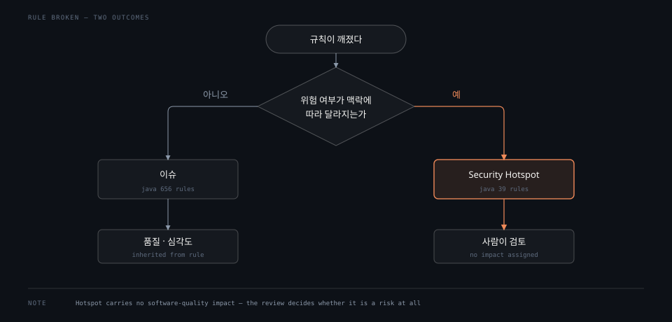

# 정적 분석이 푸는 결함

> SonarQube 는 코드를 실행하지 않고 읽어서 결함을 찾습니다. 규칙이 깨지면 이슈가 생기고, 그 이슈는 보안·신뢰성·유지보수성 중 하나 이상에 심각도를 매깁니다. 이 편은 그 어휘를 정착시키고, 실제 규칙 695개를 세어 문서가 말하지 않는 분포까지 확인합니다.

## 학습 목표

> 이 편을 읽고 나면 아래 네 가지를 스스로 해낼 수 있습니다.

1. 정적 분석이 컴파일러·테스트와 무엇을 다르게 잡는지 설명할 수 있습니다.
2. 규칙과 이슈의 관계를 말하고, 이슈가 어떤 축으로 분류되는지 댈 수 있습니다.
3. 세 가지 소프트웨어 품질이 무엇이며 실제 규칙이 어느 쪽에 몰려 있는지 판단할 수 있습니다.
4. Security Hotspot 이 왜 이슈와 다르게 취급되는지 근거를 들어 설명할 수 있습니다.

아래는 규칙이 깨진 뒤 결과가 두 갈래로 갈리는 길을 그린 것입니다. 왼쪽은 2절과 3절이 다루는 보통의 이슈 경로이고, 오른쪽 주황이 4절에서 볼 Security Hotspot 경로입니다.

갈림길의 질문 하나가 두 경로를 가릅니다. 위험 여부가 맥락에 따라 달라지면 도구는 판정을 미루고 사람에게 넘깁니다.

## 1. 실행하지 않고 무엇을 보는가

> 정적 분석은 코드를 돌리지 않고 소스만 읽어 결함을 찾습니다. 실행이 필요한 검증과는 잡는 것이 다릅니다.

프로그램의 결함을 찾는 방법은 크게 둘입니다. 하나는 코드를 실행해서 결과가 기대와 다른지 보는 것이고, 다른 하나는 실행하지 않고 소스 자체를 읽어 문제가 될 형태를 찾는 것입니다. 앞이 테스트이고 뒤가 정적 분석입니다.

이 둘은 경쟁 관계가 아닙니다. 잡는 대상이 다르기 때문입니다. 테스트는 "이 입력에 이 출력이 나오는가"를 보므로 테스트가 다루지 않은 입력에 대해서는 아무 말도 하지 못합니다. 정적 분석은 반대로 입력과 무관하게 "이 형태의 코드는 위험하다"를 봅니다. 예를 들어 닫지 않은 리소스나 조건문 안의 대입은 특정 입력에서만 터지는 문제라 테스트로는 재현이 어렵지만, 코드 형태만 보고도 지적할 수 있습니다.

컴파일러와도 겹치지 않습니다. 컴파일러는 언어 명세를 어긴 코드를 거부하는 것이 일이고, 명세를 지켰지만 나쁜 코드는 통과시킵니다. 정적 분석 도구는 그 통과한 코드를 다시 읽습니다.

한계도 분명합니다. 실행하지 않으므로 런타임에만 결정되는 값은 모릅니다. 설정 파일에서 읽어 온 문자열이 SQL 로 흘러가는 경로처럼, 값의 출처가 코드 밖에 있으면 판단이 보수적으로 흐릅니다. 이 지점이 뒤에 나올 Security Hotspot 의 존재 이유입니다.

## 2. 규칙이 깨지면 이슈가 생깁니다

> 규칙은 코드가 어떻게 쓰여야 하는지를 정의하고, 규칙이 깨진 자리마다 이슈가 하나씩 생깁니다.

SonarQube 의 판단 단위는 규칙(Rule)입니다. 규칙은 보안·신뢰성·유지보수성을 지키기 위해 코드를 어떻게 쓰고 구성해야 하는지를 정의합니다. 규칙이 깨지면 그 자리에 이슈(Issue)가 하나 생깁니다.[^basic]

어떤 규칙을 적용할지는 언어별로 묶어 관리하며, 그 묶음을 품질 프로파일(Quality Profile)이라고 부릅니다. 분석할 때 언어 분석기는 프로파일에 담긴 규칙만 적용합니다.

로컬 인스턴스에서 세어 보면 규모가 잡힙니다.

| 항목 | 실측값 |
|------|-------:|
| Java 규칙 총수 | 695 |
| 내장 프로파일 `Sonar way` 의 Java 활성 규칙 | 537 |
| 내장 프로파일 총수 (모든 언어) | 27 |

전체 규칙 695개 중 537개만 기본 프로파일에 켜져 있습니다. 나머지는 존재하지만 꺼져 있습니다. 규칙이 있다고 해서 다 적용되는 것이 아니라는 뜻이며, 프로파일을 바꾸면 같은 코드에서 나오는 이슈가 달라집니다.

## 3. 세 가지 소프트웨어 품질

> 이슈는 보안·신뢰성·유지보수성 중 하나 이상에 영향을 주고, 각각에 심각도가 붙습니다. 다만 실제 규칙의 대부분은 품질 하나만 건드립니다.

SonarQube 는 코드 품질을 세 축으로 나눕니다.[^sq]

- **보안(Security)**: 허가되지 않은 접근·사용·파괴로부터 소프트웨어를 지키는 정도
- **신뢰성(Reliability)**: 정해진 조건에서 정해진 기간 동안 성능을 유지하는 정도
- **유지보수성(Maintainability)**: 코드를 고치고 개선하고 이해하기 쉬운 정도

규칙 하나는 이 중 하나 이상과 연결되고, 연결된 품질마다 심각도가 따로 붙습니다. 심각도는 Blocker, High, Medium, Low, Info 다섯 단계입니다. 규칙이 깨지면 그 규칙이 가진 품질과 심각도를 이슈가 그대로 물려받습니다.

여기서 문서가 말하지 않는 것이 하나 있습니다. "여러 품질에 영향을 준다"는 설명은 원리로는 맞지만, 실제로 그런 규칙은 드뭅니다. Java 규칙 695개를 전수로 세어 보면 이렇습니다.

| 규칙이 가진 품질 개수 | 규칙 수 | 비율 |
|---|---:|---:|
| 0개 | 39 | 5.6% |
| 1개 | 643 | 92.5% |
| 2개 | 8 | 1.2% |
| 3개 | 5 | 0.7% |

품질을 둘 이상 건드리는 규칙은 13개로 **1.9%** 에 그칩니다. 나머지 92.5% 는 여전히 품질 하나만 가집니다. 다차원 모델을 도입했다고 해서 모든 규칙이 다차원이 된 것은 아닙니다.

품질별로 보면 쏠림이 더 뚜렷합니다.

| 소프트웨어 품질 | 연결된 규칙 수 |
|---|---:|
| 유지보수성 | 455 |
| 신뢰성 | 181 |
| 보안 | 38 |

유지보수성이 674건 중 455건으로 3분의 2를 넘습니다. 보안은 38건입니다. SonarQube 를 붙였을 때 처음 쏟아지는 지적이 대개 가독성·중복·복잡도인 이유가 여기 있습니다. 보안 도구로 기대하고 도입하면 첫인상이 어긋납니다.

세 품질을 모두 건드리는 규칙 5개는 전부 Spring 관련이었습니다. `@Scheduled` 를 인자 있는 메서드에 붙이거나, 정적 필드에 주입을 시도하거나, `Page` 를 반환하면서 `Pageable` 을 받지 않는 경우입니다. 이런 규칙은 신뢰성이 High 이고 보안과 유지보수성이 Low 인 형태로 심각도가 갈립니다.

## 4. 이슈가 아닌 것 — Security Hotspot

> 위험할 수도 있지만 단정할 수 없는 코드는 이슈가 아니라 검토 대상으로 올라옵니다. 그래서 품질 영향이 비어 있습니다.

앞 표에서 품질이 0개인 규칙 39개가 눈에 걸립니다. 이 39개를 확인해 보면 전부 `SECURITY_HOTSPOT` 타입입니다. 우연이 아니라 정의상 그렇습니다.

Security Hotspot 은 "보안에 민감한 코드"이지 "취약점"이 아닙니다. 느린 정규식을 쓰거나 CSRF 보호를 끄거나 디버그 기능을 켠 채 배포하는 코드가 여기 해당합니다. 이런 코드는 맥락에 따라 문제일 수도 아닐 수도 있습니다. 내부망 관리 도구에서 CSRF 를 끈 것과 공개 서비스에서 끈 것은 위험도가 다릅니다.

도구는 그 맥락을 모릅니다. 그래서 "고쳐야 할 결함"이라고 단정하는 대신 "사람이 봐야 할 자리"로 표시합니다. 품질에 미치는 영향을 미리 매기지 않는 것도 같은 이유입니다. 영향이 정해지려면 먼저 사람이 위험 여부를 판정해야 합니다.

이 구분은 두 모드의 분류를 나란히 놓으면 더 분명해집니다.

| 분류 축 | 값 | 규칙 수 |
|---|---|---:|
| 타입 (Standard) | `CODE_SMELL` | 456 |
| | `BUG` | 168 |
| | `SECURITY_HOTSPOT` | 39 |
| | `VULNERABILITY` | 32 |
| 품질 (MQR) | 유지보수성 | 455 |
| | 신뢰성 | 181 |
| | 보안 | 38 |

`SECURITY_HOTSPOT` 39개가 품질 0개인 39개와 정확히 같습니다. 반면 나머지 셋은 품질 쪽 숫자와 딱 맞아떨어지지 않습니다. `CODE_SMELL` 456 과 유지보수성 455, `BUG` 168 과 신뢰성 181, `VULNERABILITY` 32 와 보안 38 이 어긋납니다. 품질을 둘 이상 가진 규칙 13개가 양쪽에서 다르게 세어지기 때문입니다. 두 분류는 같은 것을 다르게 부르는 관계가 아니라 실제로 다른 분류입니다. 이 차이는 [01-03](01-03.Clean as You Code와 MQR.md) 에서 다룹니다.

[^basic]: SonarQube Server 2026.1 — 분석의 기본 원리와 Rule·Issue 정의.
<https://docs.sonarsource.com/sonarqube-server/2026.1/discovering/analysis-overview/basic-principles>

[^sq]: SonarQube Server 2026.1 — 소프트웨어 품질 세 축과 심각도 정의.
<https://docs.sonarsource.com/sonarqube-server/2026.1/quality-standards-administration/managing-rules/software-qualities>

## 면접에서 받을 만한 질문

1. 모든 테스트가 통과하는데도 정적 분석이 잡아내는 결함은 어떤 종류입니까.
2. Java 규칙이 695개인데 기본 프로파일의 활성 규칙은 537개입니다. 이 차이가 무엇을 뜻합니까.
3. Security Hotspot 규칙에는 왜 소프트웨어 품질 영향이 매겨져 있지 않습니까.

> 3개 질문에 *먼저 스스로 답해 보세요.* 자답이 끝나면 아래 §정답 (자답 후 펼치기) 으로 내려갑니다.

## 정답 (자답 후 펼치기)

> 위 §면접에서 받을 만한 질문 의 3개에 *먼저 자답한 뒤* 아래를 읽으세요. 자답 없이 먼저 읽으면 학습 효과가 0 입니다.

### 정답 1 — 테스트·컴파일러와 잡는 대상이 다름

테스트는 "이 입력에 이 출력이 나오는가"를 보므로 다루지 않은 입력에 대해서는 아무 말도 하지 못합니다. 정적 분석은 입력과 무관하게 "이 형태의 코드는 위험하다"를 봅니다. 닫지 않은 리소스나 조건문 안의 대입처럼 특정 입력에서만 터지는 문제가 여기 해당합니다.

컴파일러와도 겹치지 않습니다. 컴파일러는 언어 명세를 어긴 코드를 거부하는 것이 일이고 명세를 지켰지만 나쁜 코드는 통과시킵니다. 정적 분석은 그 통과한 코드를 다시 읽습니다.

### 정답 2 — 규칙 존재와 적용은 다름

규칙이 존재한다고 해서 적용되는 것이 아닙니다. 어떤 규칙을 적용할지는 품질 프로파일이 정하고, 분석기는 프로파일에 켜진 규칙만 적용합니다.

따라서 같은 코드라도 프로파일을 바꾸면 나오는 이슈가 달라집니다. 두 인스턴스의 이슈 수를 비교하기 전에 프로파일이 같은지 확인해야 하는 이유입니다.

### 정답 3 — 판정 주체가 사람이라서

Hotspot 은 "보안에 민감한 코드"이지 "취약점"이 아닙니다. 내부망 관리 도구에서 CSRF 를 끈 것과 공개 서비스에서 끈 것은 위험도가 다른데 도구는 그 맥락을 모릅니다.

영향이 정해지려면 먼저 사람이 위험 여부를 판정해야 하므로 판정 전에는 비워 둡니다. 실측에서도 품질이 0개인 규칙 39개가 `SECURITY_HOTSPOT` 39개와 정확히 일치했습니다.

## 관련 문서

- [서버 구성 요소와 분석 흐름](01-02.서버 구성 요소와 분석 흐름.md) — 이 편의 규칙과 이슈가 어느 프로세스에서 계산되는지
- [Clean as You Code와 MQR](01-03.Clean as You Code와 MQR.md) — 타입과 품질, 두 분류가 갈라진 배경
- [docs/sonarqube MOC](README.md) — 이 카테고리의 장 구성과 기준 버전
