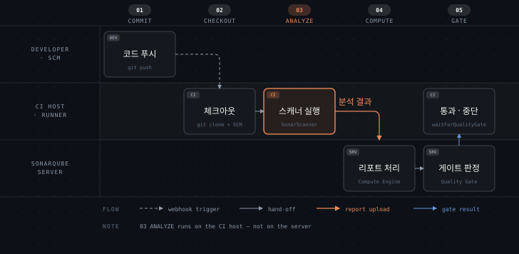

# 서버 구성 요소와 분석 흐름

> SonarQube 서버는 Java 프로세스 네 개로 돕니다. 분석은 서버가 아니라 CI 호스트에서 일어나고, 서버는 그 결과를 받아 계산합니다. 이 분업을 알아야 어디가 느린지, 어디를 늘려야 하는지 판단할 수 있습니다.

## 학습 목표

> 이 편을 읽고 나면 아래 네 가지를 스스로 해낼 수 있습니다.

1. 서버를 구성하는 프로세스 네 개의 이름과 역할을 댈 수 있습니다.
2. 어떤 데이터가 데이터베이스에 있고 어떤 것이 Elasticsearch 에 있는지 구분할 수 있습니다.
3. 커밋에서 Quality Gate 판정까지 분석 한 번이 지나는 경로를 순서대로 설명할 수 있습니다.
4. 스캐너가 분석기를 미리 담아두지 않고 분석 시점에 내려받는 이유를 설명할 수 있습니다.

아래는 커밋부터 Quality Gate 판정까지를 역할별로 이은 지도입니다. 가로축은 다섯 단계이고 세로축은 그 일을 누가 맡는지를 나눕니다. 3절이 이 순서를 하나씩 풀고, 1절과 2절은 맨 아래 줄에 있는 서버가 내부적으로 어떻게 구성되는지를 다룹니다.

주황으로 표시한 03 ANALYZE 가 이 그림의 논점입니다. 분석은 서버가 아니라 CI 호스트에서 돌고, 서버는 그 결과를 받아 계산합니다.

## 1. 프로세스 넷

> Web, Compute Engine, Elasticsearch 세 프로세스가 일을 하고, Sonar 프로세스가 이들을 관리합니다.

SonarQube 서버는 다음 Java 프로세스를 띄웁니다.[^comp]

- **Web**: 사용자 인터페이스와 Web API 를 제공합니다
- **Compute Engine(CE)**: 분석 리포트를 처리해 데이터베이스에 저장합니다
- **Elasticsearch(ES)**: 데이터베이스의 색인 사본을 관리합니다
- **Sonar**: 위 세 프로세스의 가용성을 관리합니다

문서만 보면 넷이 나란히 있는 것처럼 읽히지만, 실제로는 계층이 있습니다. 로컬 인스턴스의 프로세스 트리를 뜨면 이렇습니다.

| PID | 부모 PID | 역할 |
|---:|---:|---|
| 1 | 0 | Sonar |
| 27 | 1 | Elasticsearch 런처 |
| 101 | 27 | Elasticsearch |
| 267 | 1 | Web |
| 424 | 1 | Compute Engine |

Sonar 가 PID 1 로 뜨고 나머지를 자식으로 띄웁니다. 컨테이너를 하나 띄웠는데 Java 프로세스가 다섯 개 잡히는 이유가 여기 있습니다. Elasticsearch 는 런처를 한 번 더 거치므로 손자 프로세스입니다.

이 구조가 운영에서 의미하는 바가 있습니다. 힙을 잡을 때 값 하나로는 부족합니다. Web, CE, ES 가 각자 JVM 이라 따로 잡아야 하며, 컨테이너 메모리 한도는 이 셋의 합에 여유를 더한 값이어야 합니다. 셋 중 하나만 크게 잡고 한도를 그대로 두면 나머지가 기동에 실패합니다.

## 2. 데이터가 어디 있는가

> 원본은 데이터베이스에 있고 Elasticsearch 는 검색용 사본입니다. 사본이 깨지면 Web 프로세스가 다시 만듭니다.

데이터베이스에는 세 가지가 들어갑니다.[^comp]

- 스캔에서 만들어진 코드 품질·보안 관련 지표와 이슈
- 인스턴스 설정
- 스캐너가 채우고 Compute Engine 이 꺼내 쓰는 리포트 작업 큐

로컬 인스턴스의 `public` 스키마를 세어 보면 테이블이 **123개** 입니다. 규모가 작지 않으므로, 뒤에 나올 백업 이야기에서 데이터베이스가 1순위가 되는 것은 당연한 귀결입니다.

Elasticsearch 는 원본이 아니라 색인 사본입니다. 그래서 유실되어도 복구할 수 있습니다. 실제로 Web 프로세스가 색인을 다시 만드는 책임을 집니다. 백업 전략에서 데이터베이스와 Elasticsearch 의 우선순위가 갈리는 근거가 이것입니다.

Web 과 CE 두 프로세스가 모두 Elasticsearch 와 데이터베이스에 쓰기 때문에, 둘 다 데이터 정합성을 보장하는 책임을 나눠 집니다.

기동 로그를 보면 Elasticsearch 가 `127.0.0.1:9001` 에서만 듣습니다. 외부에 열리지 않으므로 별도 인증을 두지 않는 대신 루프백에 묶어 두는 설계입니다.

## 3. 분석 한 번이 지나는 경로

> 분석은 CI 호스트에서 일어나고 서버는 결과를 계산합니다. 이 경계를 놓치면 서버 사양을 잘못 잡습니다.

CI 파이프라인에 붙였을 때 한 번의 분석은 다음 순서를 지납니다.[^steps]

1. 개발자가 브랜치에 코드를 푸시합니다.
2. 해당 브랜치에 대해 CI 파이프라인이 시작됩니다. SCM 웹훅이 쏘거나 Jenkins 같은 도구가 감시하다 띄웁니다.
3. 파이프라인이 저장소를 클론해 대상 브랜치를 CI 호스트에 체크아웃합니다. 이때 코드와 함께 SCM 메타데이터도 받습니다.
4. 컴파일 언어라면 빌드합니다.
5. 파이프라인이 알맞은 SonarScanner 를 실행해 코드를 분석합니다.
6. 스캐너가 분석 결과를 서버로 보냅니다.
7. 서버가 Quality Gate 계산 결과를 파이프라인에 돌려줍니다. 이 단계는 선택입니다.
8. 파이프라인이 통과면 진행하고 실패면 멈춥니다.

여기서 자주 어긋나는 부분이 있습니다. **분석 자체는 서버가 아니라 CI 호스트에서 돕니다.** 서버는 결과를 받아 계산하고 저장할 뿐입니다. 그래서 분석이 느릴 때 서버 사양을 올리는 것은 대개 헛돈입니다. 느린 쪽은 CI 호스트의 CPU 와 메모리입니다.

반대로 서버 사양이 문제가 되는 경우도 있습니다. 여러 프로젝트가 동시에 결과를 올리면 Compute Engine 의 작업 큐가 밀립니다. 3단계에서 SCM 메타데이터를 함께 받는 이유도 짚어둘 만합니다. 이슈를 마지막 커미터에게 자동으로 배정하고 New Code 를 판정하려면 커밋 이력이 필요한데, 얕은 클론을 쓰면 이 정보가 없어 배정이 비고 New Code 판정이 어긋납니다.

## 4. 스캐너는 분석기를 미리 담지 않습니다

> SonarScanner 는 부트스트랩만 하고 스캐너 엔진과 언어 분석기는 분석 시점에 서버에서 받습니다.

SonarScanner 는 그 자체로 분석기를 품고 있지 않습니다. 부트스트래퍼여서, 분석할 때 서버에서 스캐너 엔진과 언어 분석기를 내려받습니다.[^steps] 순서는 이렇습니다.

1. CI 파이프라인이 SonarScanner 를 실행합니다.
2. 스캐너가 서버에 접속해 쓸 엔진 버전을 확인하고, 캐시에 없으면 내려받아 캐시에 넣습니다.
3. 엔진이 코드를 훑어 프로젝트가 쓰는 언어를 식별합니다.
4. 필요한 언어 분석기를 캐시에서 찾고, 없으면 서버에서 받아 캐시에 넣습니다.

이렇게 하는 이유는 둘입니다. 엔진과 분석기 버전이 서버와 항상 호환되도록 맞추기 위해서이고, 프로젝트에 실제로 쓰인 언어의 분석기만 받기 위해서입니다.

운영에서 따라오는 결과가 있습니다. CI 호스트는 서버에 네트워크로 닿아야 하고, 첫 분석은 내려받는 시간만큼 느립니다. 캐시가 비는 환경, 예를 들어 매번 새 컨테이너를 띄우는 파이프라인에서는 이 비용이 매번 발생합니다. 캐시 디렉터리를 볼륨으로 유지하면 줄어듭니다.

[^comp]: SonarQube Server 2026.1 — 서버 구성 요소와 데이터베이스·Elasticsearch 의 역할.
<https://docs.sonarsource.com/sonarqube-server/2026.1/server-installation/server-components-overview>

[^steps]: SonarQube Server 2026.1 — CI 파이프라인 통합 순서와 스캐너 엔진·분석기 다운로드.
<https://docs.sonarsource.com/sonarqube-server/2026.1/discovering/analysis-overview/process-steps>

## 면접에서 받을 만한 질문

1. 서버 프로세스는 몇 개이며 각각 무엇을 맡습니까.
2. 분석이 느릴 때 서버 사양을 올리면 해결됩니까.
3. 체크아웃 단계에서 SCM 메타데이터를 함께 받는 이유는 무엇입니까.

> 3개 질문에 *먼저 스스로 답해 보세요.* 자답이 끝나면 아래 §정답 (자답 후 펼치기) 으로 내려갑니다.

## 정답 (자답 후 펼치기)

> 위 §면접에서 받을 만한 질문 의 3개에 *먼저 자답한 뒤* 아래를 읽으세요. 자답 없이 먼저 읽으면 학습 효과가 0 입니다.

### 정답 1 — 일하는 셋 + 관리하는 하나

넷입니다. 일하는 셋과 그것을 관리하는 하나로 나뉩니다.

- **Web**: 사용자 인터페이스와 Web API 를 제공합니다
- **Compute Engine**: 분석 리포트를 처리해 데이터베이스에 저장합니다
- **Elasticsearch**: 데이터베이스의 색인 사본을 관리합니다
- **Sonar**: 위 셋의 가용성을 관리합니다

실제 프로세스 트리를 뜨면 Sonar 가 PID 1 로 뜨고 나머지를 자식으로 띄웁니다. Elasticsearch 는 런처를 한 번 더 거쳐 손자 프로세스가 됩니다.

### 정답 2 — 분석은 CI 호스트에서 돈다

대개 아닙니다. 분석 자체는 서버가 아니라 CI 호스트에서 돌고 서버는 결과를 받아 계산할 뿐입니다. 느린 쪽은 CI 호스트의 CPU 와 메모리입니다.

서버 사양이 문제가 되는 경우는 따로 있습니다. 여러 프로젝트가 동시에 결과를 올려 Compute Engine 의 작업 큐가 밀릴 때입니다. 증상이 "분석이 느리다"로 같아 보여도 원인이 다릅니다.

### 정답 3 — 이슈 배정과 New Code 판정에 필요

이슈를 마지막 커미터에게 자동으로 배정하고 New Code 를 판정하려면 커밋 이력이 필요합니다.

얕은 클론을 쓰면 이 정보가 없어 배정이 비고 New Code 판정이 어긋납니다. 코드만 받고 이력을 버리면 분석은 돌지만 결과의 절반이 빕니다.

## 관련 문서

- [정적 분석이 푸는 결함](01-01.정적 분석이 푸는 결함.md) — 여기서 계산되는 이슈와 규칙의 정의
- [Clean as You Code와 MQR](01-03.Clean as You Code와 MQR.md) — 7단계 Quality Gate 판정이 무엇을 기준으로 하는지
- [docs/sonarqube MOC](README.md) — 이 카테고리의 장 구성과 기준 버전
