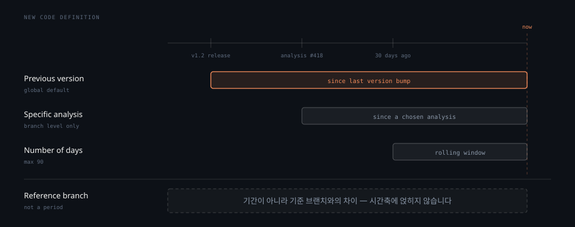

# Clean as You Code와 MQR

> SonarQube 의 두 축을 다룹니다. Clean as You Code 는 새 코드에만 기준을 걸어 오래된 코드베이스에서도 도입이 가능하게 만드는 전략이고, MQR 은 규칙 하나가 여러 품질에 각각 심각도를 매기는 분류 모드입니다. 둘 다 26.1 의 기본값입니다.

## 학습 목표

> 이 편을 읽고 나면 아래 네 가지를 스스로 해낼 수 있습니다.

1. 오래된 코드베이스에 정적 분석을 붙일 때 전체 기준이 왜 실패하는지 설명할 수 있습니다.
2. New Code 정의 네 가지를 대고 프로젝트 성격에 맞는 것을 고를 수 있습니다.
3. MQR 과 Standard Experience 가 규칙을 어떻게 다르게 분류하는지 구분할 수 있습니다.
4. 두 모드의 심각도 어휘가 다르다는 점과 그것이 왜 문제인지 판단할 수 있습니다.

아래는 2절에서 다룰 New Code 정의 네 가지가 같은 커밋 이력을 어떻게 다르게 자르는지 보인 것입니다. 위 셋은 시작일만 다른 구간이고, 모두 지금 시점에서 끝납니다.

맨 아래 Reference branch 만 구분선 밑에 따로 두었습니다. 이것은 기간이 아니라 브랜치 사이의 차이라서 같은 축에 얹을 수 없습니다.

## 1. 전체를 기준으로 잡으면 실패합니다

> 오래된 코드베이스에 전체 기준을 걸면 첫날부터 실패 상태라 아무도 고치지 않습니다. 새 코드에만 기준을 걸어야 움직입니다.

10년 된 프로젝트에 SonarQube 를 붙이면 이슈가 수천 건 나옵니다. 여기서 "이슈 0건" 같은 기준을 걸면 파이프라인은 첫날부터 빨간불이고, 그 빨간불은 누구의 책임도 아닙니다. 몇 주 지나면 팀은 그 신호를 무시하게 됩니다. 기준이 항상 실패하면 기준이 아니라 소음입니다.

Clean as You Code 는 이 문제를 기준의 범위를 좁혀 풉니다. 오래된 코드는 그대로 두고 **새로 쓰거나 고친 코드에만** 기준을 겁니다. 새 코드가 깨끗하면 파이프라인은 통과하고, 시간이 지나면서 손대는 부분마다 깨끗해집니다.

부수 효과가 하나 있습니다. 새 코드를 추가할 때는 대개 주변의 오래된 코드도 함께 건드리게 되므로, 새 코드만 신경 써도 옛 코드가 조금씩 정리됩니다. 전체를 한 번에 고치는 계획보다 이쪽이 실제로 굴러갑니다.

그래서 SonarQube 는 분석 결과를 새 코드와 전체 코드로 나눠 보여줍니다. 두 값은 범위가 다르므로 다르게 나옵니다. 전체 코드의 유지보수성 등급이 A 인데 새 코드가 B 를 받을 수 있습니다. 내장 Quality Gate 인 `Sonar way` 도 새 코드에만 조건을 겁니다.

## 2. 무엇이 새 코드인가

> New Code 정의는 네 가지이고 설정 층은 셋입니다. 프로젝트 성격에 맞춰 고릅니다.

새 코드의 경계는 자동으로 정해지지 않습니다. New Code Definition 이 그것을 지정하며 네 가지 중에 고릅니다.

- **Previous version**: 프로젝트 버전이 마지막으로 올라간 이후 바뀐 코드
- **Number of days**: 최근 X 일 안에 바뀐 코드. 기본 30일이며 최대 90일까지 지정합니다
- **Specific analysis**: 지정한 특정 분석 이후 바뀐 코드. 브랜치 수준에서만 설정합니다
- **Reference branch**: 지정한 기준 브랜치와의 차이

Reference branch 를 뺀 셋은 시작일과 종료일을 가진 기간으로 계산됩니다. 마지막 분석일과 시작일 사이에 들어오는 코드가 새 코드입니다.

로컬 인스턴스에서 전역 기본값을 확인하면 `PREVIOUS_VERSION` 입니다. 문서가 말하는 기본값과 일치합니다.

설정은 전역, 프로젝트, 브랜치 세 층에서 가능하고 아래층이 위층을 덮습니다. 브랜치 설정이 프로젝트 설정을, 프로젝트 설정이 전역 설정을 이깁니다. 다만 층마다 쓸 수 있는 옵션이 제한됩니다. 전역에서는 Previous version 과 Number of days 만 되고, Specific analysis 는 브랜치에서만 됩니다.

프로젝트 성격에 따라 고르는 기준이 갈립니다. 버전을 찍어 릴리스하는 프로젝트는 Previous version 이 자연스럽고, 계속 배포하는 프로젝트는 날짜 기준이나 Specific analysis 가 맞습니다. Pull Request 를 쓰지 않는 트렁크 기반 개발에서는 Reference branch 가 유용합니다.

Pull Request 분석에서는 새 코드가 따로 정의됩니다. PR 브랜치가 대상 브랜치와 비교해 바뀐 코드가 새 코드이고, 새 코드의 이슈만 보고됩니다.

## 3. 같은 규칙을 다르게 부르는 두 모드

> MQR 은 규칙 하나가 영향을 주는 품질을 전부 드러내고, Standard 는 가장 크게 영향받는 하나만 씁니다. 심각도 어휘도 다릅니다.

SonarQube 는 규칙을 분류하는 방식을 두 가지 모드로 나눠 둡니다.

**MQR 모드**는 규칙이 영향을 주는 모든 소프트웨어 품질을 드러내는 데 초점을 둡니다. 가장 크게 영향받는 하나만 보지 않습니다.[^mqr] 규칙 하나가 신뢰성과 유지보수성 둘에 영향을 주면 둘 다 표시하고 각각에 심각도를 답니다.

**Standard Experience** 는 반대입니다. 규칙이 가장 크게 영향을 주는 품질 하나를 골라 거기에만 심각도를 매깁니다.[^std]

심각도 어휘가 모드마다 다릅니다. 이 점이 실무에서 혼선을 부릅니다.

| 순위 | MQR 모드 | Standard Experience |
|---|---|---|
| 1 | Blocker | Blocker |
| 2 | High | Critical |
| 3 | Medium | Major |
| 4 | Low | Minor |
| 5 | Info | Info |

양 끝의 Blocker 와 Info 는 같지만 가운데 셋이 다릅니다. 사내 문서나 대시보드에 "Major 이상 차단" 같은 규칙을 적어 두었다면, 모드가 바뀌는 순간 그 문장은 가리키는 대상이 없어집니다.

로컬 인스턴스에서 확인하면 `sonar.multi-quality-mode.enabled` 가 `true` 입니다. 26.1 에서 MQR 이 기본값이라는 뜻입니다.

두 분류가 실제로 어떻게 갈리는지는 Java 규칙 695개를 세면 보입니다.

| Standard 타입 | 규칙 수 | MQR 품질 | 연결 수 |
|---|---:|---|---:|
| `CODE_SMELL` | 456 | 유지보수성 | 455 |
| `BUG` | 168 | 신뢰성 | 181 |
| `VULNERABILITY` | 32 | 보안 | 38 |
| `SECURITY_HOTSPOT` | 39 | (없음) | 0 |

`SECURITY_HOTSPOT` 만 정확히 대응하고 나머지 셋은 어긋납니다. `BUG` 는 168개인데 신뢰성에 연결된 것은 181건입니다. 품질을 둘 이상 가진 규칙 13개가 양쪽에서 다르게 세어지기 때문입니다. 두 모드는 같은 것에 다른 이름을 붙인 관계가 아니라 실제로 다른 분류입니다.

한 가지 더 짚어둡니다. MQR 이 다차원이라고 해서 모든 규칙이 다차원이 되지는 않았습니다. [01-01](01-01.정적 분석이 푸는 결함.md) 에서 센 대로 품질을 둘 이상 가진 규칙은 **1.9%** 입니다. 나머지는 여전히 하나만 가집니다. 모드를 바꿔서 얻는 실익은 대개 심각도 어휘가 바뀌는 쪽이 더 큽니다.

[^mqr]: SonarQube Server 2026.1 — MQR 모드와 심각도 정의.
<https://docs.sonarsource.com/sonarqube-server/2026.1/instance-administration/analysis-functions/instance-mode/mqr-mode>

[^std]: SonarQube Server 2026.1 — Standard Experience 와 심각도 정의.
<https://docs.sonarsource.com/sonarqube-server/2026.1/instance-administration/analysis-functions/instance-mode/standard-experience>

## 면접에서 받을 만한 질문

1. 오래된 코드베이스에 "이슈 0건" 기준을 걸면 왜 실패합니까.
2. MQR 모드가 "여러 품질에 영향을 매긴다"고 하는데 실제 규칙은 얼마나 그렇습니까.
3. New Code 정의 네 가지 중 하나만 성격이 다릅니다. 무엇이며 왜 다릅니까.

> 3개 질문에 *먼저 스스로 답해 보세요.* 자답이 끝나면 아래 §정답 (자답 후 펼치기) 으로 내려갑니다.

## 정답 (자답 후 펼치기)

> 위 §면접에서 받을 만한 질문 의 3개에 *먼저 자답한 뒤* 아래를 읽으세요. 자답 없이 먼저 읽으면 학습 효과가 0 입니다.

### 정답 1 — 항상 실패하는 기준은 소음이 됨

10년 된 프로젝트에 붙이면 이슈가 수천 건 나옵니다. 그 기준이면 파이프라인은 첫날부터 실패이고 그 실패는 누구의 책임도 아닙니다. 몇 주 지나면 팀은 그 신호를 무시합니다.

Clean as You Code 는 기준의 범위를 좁혀 이 문제를 풉니다. 오래된 코드는 두고 새로 쓰거나 고친 코드에만 기준을 겁니다. 새 코드를 추가할 때 주변 옛 코드도 함께 건드리게 되므로 손대는 부분마다 조금씩 정리됩니다.

### 정답 2 — 원리는 맞지만 실물은 1.9%

Java 규칙 695개 중 품질을 둘 이상 가진 규칙은 13개로 1.9% 입니다. 92.5% 인 643개는 여전히 품질 하나만 가집니다.

다차원 모델을 도입했다고 해서 모든 규칙이 다차원이 되지는 않았습니다. 모드를 바꿔 실제로 달라지는 것은 다차원 표시보다 심각도 어휘 쪽이 큽니다. Blocker 와 Info 만 같고 가운데 셋이 High/Medium/Low 와 Critical/Major/Minor 로 갈립니다.

### 정답 3 — Reference branch 는 기간이 아님

Reference branch 입니다. 나머지 셋은 시작일과 종료일을 가진 기간으로 계산되지만 이것은 지정한 기준 브랜치와의 차이라서 시간축 위에 구간으로 얹을 수 없습니다.

그래서 쓰임도 갈립니다. Pull Request 를 만들기 전의 브랜치 분석이나 PR 을 쓰지 않는 트렁크 기반 개발에서 유용합니다.

## 관련 문서

- [정적 분석이 푸는 결함](01-01.정적 분석이 푸는 결함.md) — 규칙과 품질 분포를 센 근거
- [서버 구성 요소와 분석 흐름](01-02.서버 구성 요소와 분석 흐름.md) — 새 코드 판정에 SCM 메타데이터가 필요한 이유
- [docs/sonarqube MOC](README.md) — 이 카테고리의 장 구성과 기준 버전
