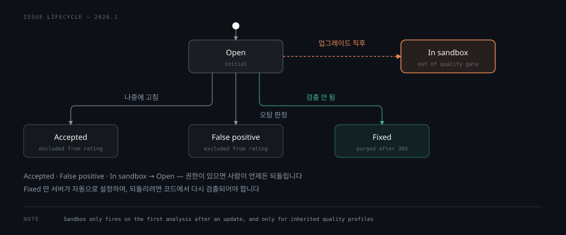

# Issue 라이프사이클과 추적

> 이슈는 분석마다 새로 만들어지는 것이 아니라 이전 분석의 이슈와 대조해 이어집니다. 이 대조가 줄 해시로 이뤄지기 때문에 코드를 옮기거나 들여쓰기를 바꿔도 이슈가 살아남습니다. 상태 모델은 최근에 한 번 바뀌었고, API 에는 옛 축이 아직 남아 있습니다.

## 학습 목표

> 이 편을 읽고 나면 아래 네 가지를 스스로 해낼 수 있습니다.

1. 현행 이슈 상태 다섯 가지를 대고 각각이 무엇을 뜻하는지 설명할 수 있습니다.
2. 두 분석 사이에서 같은 이슈인지 판정하는 세 가지 매칭 규칙을 댈 수 있습니다.
3. 백데이팅이 왜 필요하며 어떤 조건에서 일어나는지 판단할 수 있습니다.
4. 업그레이드가 만든 이슈를 Sandbox 가 어떻게 처리하는지, 그 전제가 무엇인지 말할 수 있습니다.

아래는 이슈가 처음 발견된 뒤 어떤 상태를 오가는지 그린 것입니다. 1절이 이 전이를, 4절이 오른쪽 Sandbox 갈래를 다룹니다.

## 1. 상태 축이 둘 있습니다

> 현행 모델은 Open·Accepted·False positive·Fixed·In sandbox 다섯입니다. 옛 축은 API 파라미터로 아직 살아 있습니다.

이슈는 라이프사이클 동안 상태를 갖습니다. 현행 모델은 다섯 가지입니다.

- **Open**: 첫 분석 이후의 초깃값입니다
- **Accepted**: 나중에 고치기로 하거나 고치지 않기로 한 이슈입니다. 등급 계산에서 제외되지만 개수는 표시됩니다
- **False positive**: 분석이 잘못됐다고 판단한 이슈입니다. 품질 리포트와 등급에서 제외됩니다
- **Fixed**: 이후 분석에서 더 이상 검출되지 않아 서버가 자동으로 설정합니다. 기본 30일 뒤 정리됩니다
- **In sandbox**: 업그레이드에서 생긴 이슈 중 조건을 만족한 것입니다. 4절에서 다룹니다

상태를 바꾸려면 Administer Issues 권한이 필요합니다. Accepted 와 False positive 는 되돌릴 수 있어 다시 Open 으로 돌아갑니다.

여기서 실측으로 확인한 사실이 하나 있습니다. **API 에는 상태 파라미터가 둘 있습니다.**

| 파라미터 | 값 |
|---|---|
| `issueStatuses` | `OPEN` `CONFIRMED` `FALSE_POSITIVE` `ACCEPTED` `FIXED` `IN_SANDBOX` |
| `statuses` | `OPEN` `CONFIRMED` `REOPENED` `RESOLVED` `CLOSED` `IN_SANDBOX` |
| `resolutions` | `FALSE-POSITIVE` `WONTFIX` `FIXED` `REMOVED` |

`statuses` 와 `resolutions` 가 옛 모델입니다. 예전에는 상태와 해소 사유가 두 필드로 갈려 있었고, `RESOLVED` + `WONTFIX` 조합이 지금의 `ACCEPTED` 에 해당했습니다. 현행 UI 는 `issueStatuses` 한 축만 보여 주지만 옛 파라미터는 하위 호환으로 남아 있습니다.

오래된 스크립트나 문서가 `RESOLVED`·`WONTFIX` 를 쓴다면 틀린 것이 아니라 옛 축을 쓰는 것입니다. 다만 새로 짜는 쿼리는 `issueStatuses` 를 쓰는 편이 UI 와 맞습니다.

## 2. 같은 이슈인지 줄 해시로 판정합니다

> 파일마다 이전 분석의 이슈와 이번 분석의 이슈를 대조합니다. 대조의 근거는 줄 번호가 아니라 줄 내용의 해시입니다.

분석이 끝나면 서버는 파일 단위로 이전 이슈와 이번 이슈를 맞춰 봅니다. 판정은 이렇게 흐릅니다.

이전 분석의 각 이슈를 이번 분석의 이슈들과 비교해, 짝이 없으면 **Fixed** 로 봅니다. 짝이 있는데 이전 상태가 Fixed 였다면 다시 엽니다. 반대로 이번 분석의 이슈 중 이전에 짝이 없는 것은 **새 이슈**입니다.

짝을 찾는 기준은 셋입니다.

- 같은 규칙이고 **줄 해시가 같으면** 일치입니다. 메시지가 달라도 됩니다
- 같은 규칙이고 **줄 번호와 메시지가 같으면** 일치입니다. 줄 해시가 달라도 됩니다
- 같은 규칙이고 블록이 파일 안에서 옮겨졌다면, 옮겨진 블록 안에서 같은 줄이고 메시지가 같으면 일치입니다

줄 해시는 이슈가 보고된 **첫 줄의 내용**으로 계산하며 **공백은 제외**합니다. 그래서 들여쓰기를 바꾸거나 위에 코드를 삽입해 줄 번호가 밀려도 이슈는 이어집니다.

이 성질이 실무에서 도움이 됩니다. 포매터를 한 번 돌려 파일 전체의 들여쓰기가 바뀌어도 이슈의 상태와 담당자가 유지됩니다. 반대로 한 줄의 내용 자체를 고치면 줄 해시가 달라지므로, 옛 이슈는 Fixed 가 되고 새 이슈가 생길 수 있습니다.

## 3. 새 이슈가 옛 코드에 달릴 때

> 분석일을 이슈 날짜로 쓰면 옛 코드의 이슈가 전부 새 코드로 몰립니다. 백데이팅이 이것을 막습니다.

새 이슈의 날짜는 보통 분석일입니다. 그런데 예외가 있습니다. 오래전부터 있던 코드인데 이번 분석에서야 발견되는 경우입니다. 규칙이 프로파일에 새로 추가되면 이런 일이 생깁니다.

이때 분석일을 그대로 쓰면 그 이슈는 새 코드에 속하게 되고, [02-04](02-04.Quality%20Gate.md) 에서 본 `new_violations` 조건이 걸려 Quality Gate 가 무너집니다. 코드를 한 줄도 안 고쳤는데 파이프라인이 빨간불이 됩니다.

그래서 서버는 이런 이슈의 날짜를 **그 줄이 마지막으로 바뀐 날짜**로 되돌립니다. 이것이 백데이팅입니다. 조건은 다섯입니다.

- 프로젝트나 브랜치의 첫 분석일 때
- 규칙이 프로파일에 새로 들어왔거나 규칙 파라미터가 바뀌었을 때
- SonarQube 를 막 업그레이드했을 때
- 외부 분석기가 관리하는 규칙일 때
- 이전에 분석에서 제외됐던 파일이 이제 분석될 때

줄이 마지막으로 바뀐 날짜를 알 수 있어야 하므로 SCM 메타데이터가 필요합니다. [01-02](01-02.서버%20구성%20요소와%20분석%20흐름.md) 에서 얕은 클론을 쓰지 말라고 한 이유가 여기서도 걸립니다.

Pull Request 분석에는 이 이야기가 적용되지 않습니다. PR 은 새 코드의 이슈만 보고하므로 옛 코드의 새 이슈는 아예 나타나지 않습니다. 그래서 **병합 후 대상 브랜치의 첫 분석에서 PR 이 보여 주지 않던 이슈가 나타날 수 있습니다.**

## 4. 업그레이드가 만든 이슈는 격리할 수 있습니다

> Sandbox 는 업그레이드로 새로 생긴 이슈를 Quality Gate 에서 빼 둡니다. 다만 프로파일 상속을 쓰고 있어야 작동합니다.

업그레이드는 분석기를 개선하고 내장 프로파일에 규칙을 추가합니다. 그 결과 **바꾸지 않은 코드에서 새 이슈가 쏟아집니다.** 백데이팅이 날짜는 되돌려 주지만, 전체 코드 조건을 건 게이트나 등급에는 여전히 영향이 갑니다. 릴리스 직전에 이런 일이 생기면 원인을 모른 채 파이프라인이 막힙니다.

Sandbox 는 이 이슈들을 격리합니다. 격리된 이슈는 Quality Gate 에 영향을 주지 않고, 등급과 측정값 계산에서도 빠집니다. 개수는 표시되므로 존재 자체는 보입니다. 사용자는 자기 속도로 하나씩 판정해 Open, Accepted, False positive 중 하나로 옮깁니다.

적용 범위에 제한이 있습니다. **업데이트 직후의 첫 분석에서만** 동작하고 이후 분석에는 영향을 주지 않습니다. 발동 조건은 둘입니다.

- Sonar 가 규칙을 개선했을 때
- 내장 프로파일 `Sonar way` 에 규칙이 추가됐을 때

여기에 중요한 전제가 붙습니다. **내장 프로파일을 상속받는 커스텀 프로파일만 이 갱신을 받습니다.** 복제해서 쓰는 프로파일은 업그레이드 후 규칙을 손으로 넣어야 합니다. 그리고 손으로 넣은 규칙은 Sandbox 대상이 아닙니다.

[02-03](02-03.Rule과%20Quality%20Profile.md) 에서 상속을 권한 이유가 여기서 한 번 더 나옵니다. 상속을 안 쓰면 새 규칙을 못 받습니다. 손으로 받으면 Sandbox 보호를 못 받습니다.

주의할 점도 문서가 명시합니다. 격리된 이슈를 오래 방치하면 부채가 쌓입니다. 특히 보안이나 신뢰성 이슈를 격리해 두면 위험이 그대로 남습니다.

## 면접에서 받을 만한 질문

1. 파일 전체에 포매터를 돌려 들여쓰기가 바뀌었습니다. 기존 이슈의 담당자와 상태는 유지됩니까. 근거는 무엇입니까.
2. 코드를 한 줄도 고치지 않았는데 업그레이드 직후 Quality Gate 가 실패했습니다. 무엇이 일어났고 어떤 장치들이 이것을 막습니까.
3. 오래된 스크립트가 `statuses=RESOLVED&resolutions=WONTFIX` 로 이슈를 조회합니다. 이 쿼리는 틀렸습니까.

> 3개 질문에 *먼저 스스로 답해 보세요.* 자답이 끝나면 아래 §정답 (자답 후 펼치기) 으로 내려갑니다.

## 정답 (자답 후 펼치기)

> 위 §면접에서 받을 만한 질문 의 3개에 *먼저 자답한 뒤* 아래를 읽으세요. 자답 없이 먼저 읽으면 학습 효과가 0 입니다.

### 정답 1 — 줄 해시가 공백을 무시함

유지됩니다. 이슈 매칭의 기준이 줄 번호가 아니라 줄 해시이고, 줄 해시는 이슈가 보고된 첫 줄의 내용에서 **공백을 제외하고** 계산하기 때문입니다.

들여쓰기만 바뀌면 해시가 그대로이므로 같은 이슈로 이어지고 상태·담당자·코멘트가 유지됩니다. 위에 코드를 삽입해 줄 번호가 밀린 경우도 마찬가지입니다. 반대로 그 줄의 내용 자체를 고치면 해시가 달라져 옛 이슈는 Fixed 가 되고 새 이슈가 생길 수 있습니다.

### 정답 2 — 규칙 추가가 옛 코드에서 이슈를 깨움

업그레이드가 분석기를 개선하고 내장 프로파일에 규칙을 추가하면, 바꾸지 않은 코드에서 새 이슈가 발견됩니다.

막는 장치가 둘입니다. 백데이팅은 그 이슈의 날짜를 줄이 마지막으로 바뀐 날짜로 되돌려 새 코드로 몰리는 것을 막습니다. Sandbox 는 조건을 만족한 이슈를 격리해 Quality Gate 와 등급 계산에서 아예 빼 둡니다.

다만 Sandbox 는 업데이트 직후 첫 분석에서만 동작하고, 내장 프로파일을 **상속**받는 프로파일에만 적용됩니다. 복제해서 쓰면 규칙을 손으로 넣어야 하고 그렇게 넣은 규칙은 격리 대상이 아닙니다.

### 정답 3 — 옛 축이지 틀린 것은 아님

틀리지 않았습니다. API 에는 상태 파라미터가 둘 있습니다. `issueStatuses` 가 현행 축이고 `statuses` + `resolutions` 가 옛 축인데, 하위 호환으로 아직 살아 있습니다.

옛 축의 `RESOLVED` + `WONTFIX` 조합이 지금의 `ACCEPTED` 에 해당합니다. 다만 현행 UI 는 `issueStatuses` 한 축만 보여 주므로, 새로 짜는 쿼리는 `issueStatuses=ACCEPTED` 를 쓰는 편이 화면과 맞습니다.

## 관련 문서

- [Security Hotspot](03-02.Security%20Hotspot.md) — 이슈와 다른 라이프사이클을 갖는 검토 대상
- [Rule과 Quality Profile](02-03.Rule과%20Quality%20Profile.md) — Sandbox 가 전제하는 상속 구조
- [Quality Gate](02-04.Quality%20Gate.md) — 백데이팅과 Sandbox 가 지키려는 판정
