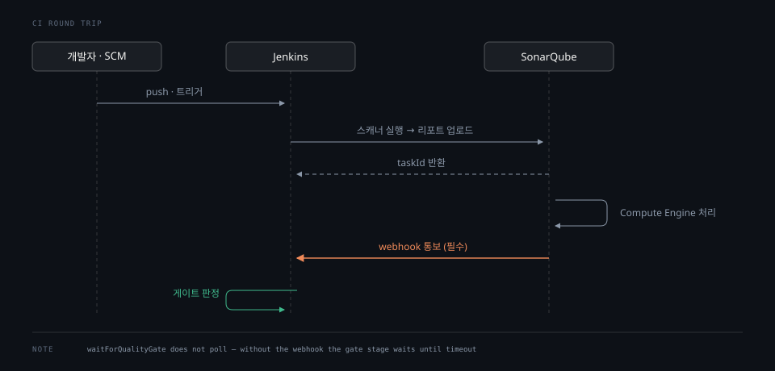

# Jenkins 연계

> Jenkins 에서 SonarQube 를 붙이는 일은 셋으로 나뉩니다. 서버를 등록하고, 파이프라인에서 스캐너를 돌리고, 게이트 판정을 기다립니다. 세 번째가 웹훅을 필수로 요구하는데 이 조건을 놓치면 파이프라인이 영원히 멈춥니다.

## 학습 목표

> 이 편을 읽고 나면 아래 네 가지를 스스로 해낼 수 있습니다.

1. Jenkins 쪽에 무엇을 등록해야 파이프라인이 SonarQube 를 찾는지 설명할 수 있습니다.
2. `withSonarQubeEnv` 가 무엇을 파이프라인 컨텍스트에 넘기는지 말할 수 있습니다.
3. `waitForQualityGate` 가 웹훅을 필수로 요구하는 이유를 설명할 수 있습니다.
4. 첫 분석에서 게이트가 통과하는 이유를 판단할 수 있습니다.

아래는 커밋 한 번이 판정까지 가는 동안 세 주체가 주고받는 메시지입니다. 2절이 앞의 두 메시지를, 3절이 주황으로 표시한 웹훅 통보를 다룹니다.

그 웹훅이 이 그림의 논점입니다. 없으면 마지막 두 단계가 오지 않아 게이트 스테이지가 타임아웃까지 멈춥니다.




## 1. Jenkins 쪽에 등록할 것 셋

> 토큰 크레덴셜, SonarQube 서버 정의, 스캐너 도구입니다. 이 셋이 있어야 파이프라인이 돌아갑니다.

**크레덴셜**은 SonarQube 분석 토큰을 Secret text 로 담습니다. 토큰 종류는 [04-03](04-03.인증과%20토큰.md) 에서 다루는데, CI 에는 Global Analysis Token 이나 Project Analysis Token 을 씁니다.

**SonarQube 서버 정의**는 이름과 URL 과 크레덴셜을 묶은 것입니다. 여기서 정한 **이름이 곧 `withSonarQubeEnv` 의 인자**가 됩니다. 이름을 `sq-local` 로 두었다면 파이프라인에서 `withSonarQubeEnv('sq-local')` 로 부릅니다.

URL 을 정할 때 주의할 점이 있습니다. Jenkins 가 컨테이너 안에서 돈다면 `localhost` 는 Jenkins 자신을 가리킵니다. 같은 네트워크의 SonarQube 컨테이너 이름을 써야 합니다. 로컬 실습에서는 `http://sq-server:9000` 이 그것입니다.

**스캐너 도구**는 Jenkins 도구 설정에 등록합니다. 자동 설치를 쓰면 빌드 시점에 내려받습니다. 버전은 서버가 요구하는 최소 이상이어야 하는데, [02-01](02-01.Scanner%20종류와%20선택.md) 표대로 2026.1 LTA 는 CLI `8.0.1` 이상을 요구합니다.

플러그인 버전도 같은 제약을 받습니다. 실측 환경의 Jenkins 는 sonar 플러그인 `2.18.3` 이었고, 공식 문서가 2026.1 LTA 최소로 명시한 `2.18` 을 만족합니다.


## 2. 파이프라인의 두 스테이지

> 분석 스테이지가 `withSonarQubeEnv` 로 감싸고, 게이트 스테이지가 `waitForQualityGate` 로 기다립니다.

Declarative 파이프라인의 골격은 이렇습니다.

```bash
pipeline {
  agent any
  stages {
    stage('SonarQube analysis') {
      steps {
        script {
          def scannerHome = tool 'sonar-scanner'
          withSonarQubeEnv('sq-local') {
            sh "${scannerHome}/bin/sonar-scanner"
          }
        }
      }
    }
    stage('Quality Gate') {
      steps {
        timeout(time: 5, unit: 'MINUTES') {
          waitForQualityGate abortPipeline: true
        }
      }
    }
  }
}
```

`withSonarQubeEnv` 는 서버 URL 과 토큰을 환경 변수로 넣어 주고, **분석이 만든 taskId 를 파이프라인 컨텍스트에 붙입니다.** 이것이 핵심입니다. 다음 스테이지의 `waitForQualityGate` 는 그 taskId 를 이어받아 어떤 분석의 결과를 기다릴지 압니다.

실행 로그가 이 연결을 그대로 보여 줍니다.

```bash
INFO  ANALYSIS SUCCESSFUL, you can find the results at: http://sq-server:9000/dashboard?id=demo-app
INFO  More about the report processing at http://sq-server:9000/api/ce/task?id=e37f0f3b-6563-484e-8d2a-51136c70c6b6
...
Checking status of SonarQube task 'e37f0f3b-6563-484e-8d2a-51136c70c6b6' on server 'sq-local'
SonarQube task 'e37f0f3b-6563-484e-8d2a-51136c70c6b6' completed. Quality gate is 'OK'
```

분석 스테이지가 남긴 taskId 를 게이트 스테이지가 그대로 조회합니다. `withSonarQubeEnv` 로 감싸지 않으면 이 연결이 끊겨 `waitForQualityGate` 가 무엇을 기다릴지 모릅니다.

`timeout` 을 두는 이유도 분명합니다. 서버가 응답하지 않거나 웹훅이 도착하지 않으면 이 스테이지는 끝나지 않습니다. 공식 예제도 1시간 `timeout` 을 감싸 둡니다.

같은 로그가 [02-01](02-01.Scanner%20종류와%20선택.md) 의 JRE 이야기도 증명합니다. Jenkins 컨테이너의 Java 는 17 인데 스캐너 로그에 이렇게 찍힙니다.

```bash
INFO  JRE provisioning: os[linux], arch[aarch64]
```

CI 호스트의 Java 를 맞추지 않아도 스캐너가 자기 JRE 를 받아 쓴다는 뜻입니다.


## 3. 웹훅이 없으면 게이트 스테이지가 멈춥니다

> `waitForQualityGate` 는 폴링하지 않습니다. 서버가 웹훅으로 알려 줄 때까지 기다립니다.

공식 문서가 웹훅 설정을 **필수**라고 못 박습니다. SonarQube 에서 `<Jenkins주소>/sonarqube-webhook/` 을 가리키는 웹훅을 만들어야 합니다.

이유는 `waitForQualityGate` 의 구현 방식에 있습니다. 이 스텝은 노드를 점유하고 폴링하지 않습니다. 덕분에 실행 노드를 붙잡지 않고 Jenkins 가 재시작해도 스텝이 복원됩니다. 대신 서버가 처리를 마쳤다는 사실을 **웹훅으로 통보받아야** 합니다.

경쟁 상태 대비도 들어 있습니다. 스텝이 시작하거나 재시작할 때 서버에 직접 한 번 호출해 작업이 이미 끝났는지 확인합니다. 웹훅이 그 사이에 이미 도착해 버린 경우를 놓치지 않으려는 장치입니다.

웹훅이 없으면 어떻게 될까요. 분석은 성공하고 서버도 처리를 마치지만 Jenkins 는 그 사실을 통보받지 못합니다. 게이트 스테이지는 `timeout` 이 만료될 때까지 기다리다 실패합니다. 증상이 "SonarQube 는 멀쩡한데 파이프라인이 멈춘다"로 나타나 원인을 찾기 어렵습니다.

실측에서 웹훅 전달을 확인하면 이렇습니다.

| 항목 | 값 |
|---|---|
| URL | `http://sq-jenkins:8080/sonarqube-webhook/` |
| HTTP 상태 | 200 |
| 소요 | 332ms |
| `ceTaskId` | 분석 로그의 taskId 와 동일 |

전달이 성공하고 나서야 게이트 스테이지가 풀립니다.


## 4. 첫 분석은 왜 항상 통과합니까

> `Sonar way` 의 조건 넷이 전부 새 코드 지표인데, 첫 분석에는 비교할 이전 버전이 없어 잴 값이 없습니다.

실측에서 눈에 걸린 것이 있습니다. 일부러 규칙을 어긴 코드를 넣어 이슈가 4건 나왔는데도 게이트가 `OK` 였습니다.

API 로 판정을 조회하면 이유가 보입니다.

```bash
{ "projectStatus": { "status": "OK", "conditions": [], "caycStatus": "compliant" } }
```

평가된 조건이 **0건**입니다. 웹훅 페이로드는 더 친절해서 네 조건을 다 보여 주는데 상태가 모두 `NO_VALUE` 입니다.

| 지표 | 조건 | 상태 |
|---|---|---|
| `new_coverage` | `LESS_THAN` 80 | `NO_VALUE` |
| `new_duplicated_lines_density` | `GREATER_THAN` 3 | `NO_VALUE` |
| `new_security_hotspots_reviewed` | `LESS_THAN` 100 | `NO_VALUE` |
| `new_violations` | `GREATER_THAN` 0 | `NO_VALUE` |

[02-04](02-04.Quality%20Gate.md) 에서 본 대로 네 조건이 전부 `new_` 지표입니다. 그런데 New Code 기준이 `PREVIOUS_VERSION` 이고 분석이 처음이라 **비교할 이전 버전이 없습니다.** 새 코드가 정의되지 않으니 잴 값도 없고, 값이 없으면 조건은 평가되지 않습니다.

여기서 실무 판단이 하나 나옵니다. **파이프라인에 SonarQube 를 처음 붙인 날 게이트가 통과한 것은 코드가 깨끗하다는 뜻이 아닙니다.** 잴 기준이 아직 없다는 뜻입니다. 실제 판정은 두 번째 분석부터 시작됩니다.

같은 이유로 `sonar.projectVersion` 을 넘기는 것이 중요합니다. 버전을 안 넘기면 분석 이력에 `not provided` 로 남고, `PREVIOUS_VERSION` 기준은 기준점을 잡지 못합니다. [02-02](02-02.분석%20한%20번의%20흐름.md) 에서 이 파라미터가 UI 에서 설정할 수 없는 축에 있다고 한 이유가 여기 있습니다.

API 와 웹훅이 같은 판정을 다르게 보여 준다는 점도 기억해 둘 만합니다. API 는 **평가된 조건만** 반환하고 웹훅 페이로드는 **정의된 조건 전부**를 상태와 함께 실어 보냅니다. 게이트가 왜 그렇게 판정됐는지 파헤칠 때는 웹훅 쪽이 정보가 많습니다.

기준점을 만든 뒤 이슈가 있는 코드를 추가하니 판정이 달라졌습니다.

| 조건 | 값 | 판정 |
|---|---|---|
| `new_violations` `>` 0 | 18 | **ERROR** |
| `new_coverage` `<` 80 | 0.0 | **ERROR** |
| `new_duplicated_lines_density` `>` 3 | 0.0 | OK |

파이프라인 로그도 그대로 따라갔습니다.

```bash
SonarQube task '0c71d532-1298-4a1e-a28f-dccc702ca792' completed. Quality gate is 'ERROR'
ERROR: Pipeline aborted due to quality gate failure: ERROR
Finished: FAILURE
```

`abortPipeline: true` 가 실제로 빌드를 실패시킵니다. 그리고 이번에는 커버리지 조건까지 살아났습니다. 새로 들어온 줄이 20을 넘어 [02-04](02-04.Quality%20Gate.md) 의 fudge factor 면제가 풀렸기 때문입니다. 같은 게이트라도 변경 크기에 따라 평가되는 조건 수가 달라집니다.


## 면접에서 받을 만한 질문

1. 분석은 성공했는데 Quality Gate 스테이지에서 파이프라인이 멈춰 타임아웃으로 실패합니다. 무엇을 먼저 확인하겠습니까.
2. `withSonarQubeEnv` 로 감싸지 않고 스캐너만 실행하면 `waitForQualityGate` 는 어떻게 됩니까.
3. SonarQube 를 처음 붙인 날 게이트가 통과했습니다. 코드가 깨끗하다고 봐도 됩니까.

> 3개 질문에 *먼저 스스로 답해 보세요.* 자답이 끝나면 아래 §정답 (자답 후 펼치기) 으로 내려갑니다.


## 정답 (자답 후 펼치기)

> 위 §면접에서 받을 만한 질문 의 3개에 *먼저 자답한 뒤* 아래를 읽으세요. 자답 없이 먼저 읽으면 학습 효과가 0 입니다.

### 정답 1 — 웹훅 등록 여부

웹훅부터 봅니다. `waitForQualityGate` 는 폴링하지 않고 서버가 `<Jenkins주소>/sonarqube-webhook/` 으로 보내는 통보를 기다리기 때문입니다. 공식 문서도 이 설정을 필수라고 명시합니다.

웹훅이 없으면 분석도 성공하고 서버 처리도 끝나지만 Jenkins 는 그 사실을 모릅니다. 그래서 증상이 "SonarQube 는 멀쩡한데 파이프라인만 멈춘다"로 나타납니다.

확인은 SonarQube 쪽 웹훅 전달 이력으로 합니다. 전달이 아예 없으면 웹훅 미등록이고, 있는데 실패면 URL 이나 네트워크를 봅니다. 10초 안에 응답이 없으면 실패로 기록되며 서버는 재시도하지 않습니다.

### 정답 2 — taskId 가 컨텍스트에 안 붙음

`waitForQualityGate` 가 어떤 분석을 기다릴지 알 수 없게 됩니다.

`withSonarQubeEnv` 는 서버 URL 과 토큰을 환경 변수로 넣어 주는 것에 더해, 분석이 만든 **taskId 를 파이프라인 컨텍스트에 붙이는** 일을 합니다. 다음 스테이지는 그 taskId 로 서버에 조회합니다.

감싸지 않으면 이 연결이 끊깁니다. 스캐너 자체는 돌 수 있지만 게이트 스테이지가 대상을 잃습니다.

### 정답 3 — 잴 기준이 없었을 뿐

아닙니다. `Sonar way` 의 조건 넷은 전부 `new_` 로 시작하는 새 코드 지표입니다. 첫 분석에는 비교할 이전 버전이 없어 새 코드가 정의되지 않고, 값이 없으면 조건이 평가되지 않습니다.

실측에서도 일부러 규칙을 어긴 코드로 이슈가 4건 났는데 게이트는 `OK` 였고, 웹훅 페이로드의 네 조건이 모두 `NO_VALUE` 였습니다.

실제 판정은 두 번째 분석부터입니다. 그래서 `sonar.projectVersion` 을 넘겨 기준점을 만드는 일이 중요합니다. 안 넘기면 분석 이력에 `not provided` 로 남아 `PREVIOUS_VERSION` 기준이 기준점을 못 잡습니다.


## 관련 문서

- [Webhook](04-04.Webhook.md) — 게이트 스테이지를 푸는 통보 경로의 상세
- [Quality Gate](02-04.Quality%20Gate.md) — `Sonar way` 네 조건이 전부 새 코드인 배경
- [분석 한 번의 흐름](02-02.분석%20한%20번의%20흐름.md) — 스캐너 종료와 서버 처리 완료의 시차
