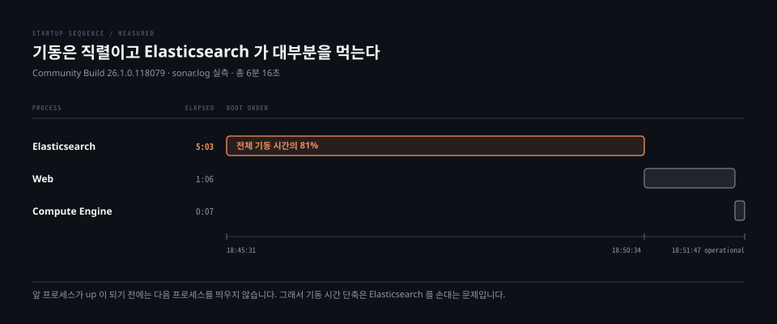

# 설치와 용량 산정

> 요구사항 표만 읽으면 SonarQube 가 왜 최소 4GB 를 달라고 하는지 알 수 없습니다. 답의 대부분은 그 안에 들어 있는 Elasticsearch 입니다. 그리고 코드를 한 줄도 분석하지 않은 인스턴스에도 이미 상당한 바닥 비용이 깔려 있습니다.

## 학습 목표

> 이 편을 읽고 나면 아래 네 가지를 스스로 해낼 수 있습니다.

1. 세 프로세스의 기동 순서와 그 순서가 고정된 이유를 설명할 수 있습니다.
2. 하드웨어 권고 대부분이 Elasticsearch 에서 나온다는 것을 근거와 함께 말할 수 있습니다.
3. 디스크 여유가 왜 권고가 아니라 요구인지, 다 차면 무엇이 잠기는지 판단할 수 있습니다.
4. 신규 인스턴스의 바닥 용량이 어디서 오는지 수치로 설명할 수 있습니다.




## 1. 서버는 JVM 프로세스 세 개입니다

> Web · Elasticsearch · Compute Engine 이 각자 JVM 으로 뜨고, Sonar 라는 관리 프로세스가 이 셋을 띄우고 지켜봅니다.

공식 문서가 정의하는 역할은 이렇습니다.

| 프로세스 | 역할 |
|---|---|
| Web | 사용자 인터페이스와 Web API 를 제공합니다 |
| Elasticsearch | 데이터베이스의 색인 사본을 관리합니다 |
| Compute Engine | 분석 리포트를 처리해 데이터베이스에 저장합니다 |
| Sonar | 위 셋의 가용성을 관리하는 메인 프로세스입니다 |

데이터베이스는 품질·보안 지표와 이슈, 인스턴스 설정, 그리고 스캐너가 채우고 Compute Engine 이 꺼내 가는 리포트 작업 큐를 담습니다. 3장에서 본 이슈 데이터가 실제로 앉는 자리가 여기입니다.

Elasticsearch 는 사본이지 원본이 아닙니다. 공식 문서는 Elasticsearch 가 망가졌을 때 색인을 다시 만드는 책임이 Web 프로세스에 있다고 못 박습니다. 원본은 언제나 데이터베이스 쪽입니다.

### 기동은 직렬입니다

로컬 인스턴스의 `sonar.log` 를 그대로 읽으면 순서가 드러납니다.

```bash
18:45:31  Cleaning or creating temp directory
18:45:35  Launch process[ELASTICSEARCH]
18:45:37  Waiting for Elasticsearch to be up and running
18:50:34  Process[es] is up            ← 5분 3초 대기
18:50:34  Launch process[WEB_SERVER]
18:51:40  Process[web] is up           ← 1분 6초
18:51:40  Launch process[COMPUTE_ENGINE]
18:51:47  Process[ce] is up            ← 7초
18:51:47  SonarQube is operational
```

앞 프로세스가 `up` 이 되기 전에는 다음을 띄우지 않습니다. Web 은 부팅 중에 데이터베이스 마이그레이션 여부를 확인하고 필요하면 색인을 다시 세우는데, 그 대상인 Elasticsearch 가 없으면 할 일이 성립하지 않기 때문입니다.

총 6분 16초 중 5분 3초가 Elasticsearch 대기였습니다. **기동이 느리다고 느껴질 때 손댈 곳은 대개 SonarQube 자체가 아닙니다.**


## 2. 하드웨어 권고는 Elasticsearch 가 정합니다

> 공식 문서의 하드웨어 권고 항목은 디스크·RAM·CPU·I/O 스케줄러 넷인데, 넷 다 근거가 Elasticsearch 입니다.

출발점으로 제시되는 수치는 두 단입니다.

| 규모 | RAM | CPU | 디스크 |
|---|---|---|---|
| 소규모 (100만 줄 이하) | 4 GB | 2 코어 | 30 GB |
| 대규모 (5000만 줄 이하 단일 노드) | 16 GB | 8 코어 | 규모에 비례 |

이 값들은 신규 설치의 **출발점**이지 정답이 아닙니다. 문서 스스로 사용 패턴이 인스턴스마다 다르니 CPU·메모리·저장소를 계속 관측하고 주기적으로 조정하라고 덧붙입니다.

### 메모리는 절반만 힙에 줍니다

가용 메모리의 50%만 Elasticsearch 힙에 주고 나머지 절반은 비워 두라는 것이 Elastic 의 권고이고 SonarQube 문서가 이를 그대로 인용합니다. 이유는 Lucene 이 자기 자료구조를 운영체제의 페이지 캐시에 얹도록 설계됐기 때문입니다. 힙을 키우면 그 캐시가 줄어 오히려 느려집니다. 32GB 를 넘겨 할당하지 말라는 상한도 함께 붙습니다.

실습 인스턴스는 Docker 여유가 넉넉하지 않아 세 프로세스의 힙을 각각 512MB 로 고정했습니다.

```bash
sonar.web.javaOpts     = -Xmx512m -Xms128m
sonar.ce.javaOpts      = -Xmx512m -Xms128m
sonar.search.javaOpts  = -Xmx512m -Xms512m
```

Elasticsearch 만 최소와 최대를 같은 값으로 맞춘 것은 우연이 아닙니다. 공식 문서가 검색 프로세스에 한해 최소와 최대를 같게 두라고 따로 권고합니다. 실행 중에 힙이 재조정되면 JVM 자원이 그쪽으로 쏠려 처리 중인 요청의 응답 시간이 크게 늘어나기 때문입니다.

### CPU 는 빠른 코어보다 많은 코어입니다

클럭이 조금 빠른 쪽과 코어가 많은 쪽 중 하나를 골라야 한다면 코어 수를 택하라고 문서가 지시합니다. 데이터가 여러 노드에 분산되므로 전체 실행 시간이 가장 느린 노드에 묶이고, 그래서 빠른 한 대와 느린 한 대보다 중간짜리 여러 대가 낫다는 설명입니다.

저장소 쪽 지침은 더 구체적입니다.

- **SSD 를 씁니다.** 회전 디스크를 써야 한다면 15,000 RPM 급을 구합니다
- **RAID 0 은 유효합니다.** Elasticsearch 복제본과 데이터베이스 원본이 있으므로 미러링이나 패리티는 필요 없습니다
- **원격 마운트는 쓰지 않습니다.** NFS·SMB·NAS 는 느린 데다 지연 편차가 크고 그 자체가 단일 장애점이 됩니다


## 3. 디스크 여유 10%는 권고가 아니라 요구입니다

> Elasticsearch 는 디스크가 차면 색인을 읽기 전용으로 잠급니다. 공간을 비워도 저절로 풀리지 않습니다.

임계는 세 단계입니다.

| 사용률 | 일어나는 일 |
|---|---|
| 85% | Elasticsearch 가 로그에 경고를 냅니다 |
| 90% | high watermark. 이 지점을 넘기면 crash 위험이 있다고 문서가 경고합니다 |
| 95% | flood stage. **모든 색인이 읽기 전용으로 잠깁니다** |

95%에 닿으면 Web 과 Compute Engine 양쪽에서 오류가 납니다. 여기서 중요한 것은 회복 절차입니다. **디스크를 비우는 것만으로는 읽기 전용이 풀리지 않습니다.** 단일 노드라면 SonarQube 를 재시작해야 하고, Data Center Edition 이면 애플리케이션 노드를 전부 내렸다가 다시 올려야 합니다.

재시작 후에도 색인이 데이터베이스보다 뒤처져 있으면 내장 복원 기능이 시간을 들여 따라잡습니다. 그래도 불일치가 남으면 색인을 통째로 다시 만드는 수밖에 없습니다.

```bash
# 단일 노드 색인 재구축 — 이슈·컴포넌트 수에 따라 오래 걸립니다
1. SonarQube 정지
2. data/es8 디렉터리 삭제
3. SonarQube 재시작
```

실습 인스턴스의 상태를 확인해 보면 아직 한참 여유가 있습니다. `api/system/info` 의 Search State 가 `Disk Available 10.7 GB`, 상태 `GREEN` 을 보고했고 로그 전체에 watermark 관련 경고가 한 건도 없었습니다.


## 4. 데이터베이스는 H2 를 쓰지 않습니다

> 내장 H2 는 기본값이지만 문서가 운영 사용을 명시적으로 반대합니다.

2026.1 LTA 가 지원하는 외부 엔진은 셋입니다.

| 엔진 | 버전 |
|---|---|
| PostgreSQL | 14 ~ 18 |
| Microsoft SQL Server | 2017 · 2019 · 2022 (Express 포함) |
| Oracle | 19C · 21C · 23ai · XE |

H2 를 운영에 쓰지 말라는 근거로 문서가 드는 것은 확장 한계와 동시성, 그리고 복제·고가용성·백업 기능의 부재입니다. 여기에 SQL 방언 차이 때문에 나중에 진짜 데이터베이스로 옮길 때 문제가 생길 수 있다는 항목이 붙습니다. 개발과 시험, 그리고 설정 없이 한번 써 보는 체험까지가 H2 의 자리입니다.

운영 설치라면 데이터베이스를 SonarQube 호스트와 물리적으로 분리하되 둘 사이 지연은 낮게 유지하라고 권고합니다.

엔진별 필수 설정도 있습니다. SQL Server 는 collation 이 대소문자와 악센트를 모두 구분해야 하고 `READ_COMMITTED_SNAPSHOT` 이 켜져 있어야 합니다. 공유 잠금 전략 때문에 부하가 걸리면 교착에 빠질 수 있다는 것이 이유입니다. PostgreSQL 은 UTF-8 문자셋이 조건입니다.

실습 인스턴스는 PostgreSQL 16.15 에 JDBC 드라이버 42.7.8 조합으로 돌고 있습니다.


## 5. 빈 인스턴스에도 바닥 비용이 있습니다

> 용량 산정의 출발점은 0 이 아닙니다. 분석한 코드가 54줄인 인스턴스가 이미 70MB 를 쓰고 있었습니다.

실습 인스턴스를 그대로 재 보면 이렇습니다.

| 항목 | 값 |
|---|---|
| 분석한 코드 | 54 줄 |
| PostgreSQL 데이터베이스 | 45 MB |
| Elasticsearch 전체 store | 27.3 MB |
| 그중 `rules` 색인 | 25.8 MB |
| `issues` 색인 | 63.1 kB |

**Elasticsearch 저장 용량의 94%가 규칙 색인입니다.** 이슈 색인은 63kB 로 그 400분의 1입니다. 규칙은 분석한 코드의 양과 무관하게 플러그인이 정의한 만큼 고정으로 실립니다. 코드가 한 줄도 없어도 이 비용은 그대로 발생합니다.

### 색인 안을 열어 보면

Elasticsearch 에 직접 물어보면 숫자 세 개가 서로 다릅니다.

```bash
_cat/indices 의 docs.count            32,275
match_all 로 조회되는 문서             16,313
api/rules/search 의 total              4,060
```

첫째 간극부터 봅니다. `docs.count` 는 Lucene 이 세는 물리 문서 수라 **nested 필드의 하위 문서까지 포함합니다.** 이 색인의 매핑에는 `impacts` 와 `activeRule_impacts` 두 nested 필드가 있고, 규칙 하나가 갖는 영향도 항목마다 별도 문서가 하나씩 더 생깁니다. 그래서 `docs.count` 를 "규칙 개수"로 읽으면 8배 가까이 부풀려 읽게 됩니다.

둘째 간극은 조회되는 16,313 안에서 갈립니다.

| 종류 | 개수 |
|---|---|
| `rule` 문서 | 13,127 |
| `activeRule` 문서 | 3,186 |

`rule` 13,127 중 9,067 이 `isExternal: true` 였습니다. SpotBugs 나 ESLint 처럼 외부 린터가 낸 결과를 받아 넣기 위한 정의들입니다. 13,127 에서 9,067 을 빼면 4,060 이고, 이 값이 `api/rules/search` 가 돌려주는 총계와 **정확히 일치합니다.** API 는 기본적으로 외부 규칙을 빼고 보여 줍니다.

`activeRule` 3,186 도 맞아떨어집니다. 인스턴스의 품질 프로파일 27개의 `activeRuleCount` 를 전부 더하면 같은 3,186 입니다. 2장에서 본 프로파일별 활성 규칙이 색인에서는 이 형태로 앉아 있습니다.


## 6. 참조 아키텍처는 1000만 줄까지를 한 대로 잡습니다

> 공식 참조 아키텍처는 규격만 주지 않고 "정상 사용"의 정의와 그 경계를 함께 적습니다.

1000만 줄 기준 구성입니다.

| 구성 요소 | 규격 |
|---|---|
| SonarQube 호스트 | 4 vCPU · 8 GB RAM · 50 GB SSD |
| 데이터베이스 호스트 | 2 vCPU · 8 GB RAM · 30 GB 테이블 공간 |
| 앞단 | nginx 리버스 프록시 + SSL |

여기서 말하는 정상 사용이란 저장소 평균 5만 줄, 하루 한 번 주 브랜치 스캔에 풀 리퀘스트 몇 건이 더해지는 정도입니다. 이 가정을 벗어나면 자원을 더 줘야 한다고 문서가 네 가지를 짚습니다.

- **고빈도 분석** — 스캔이 잦으면 Compute Engine 워커를 늘려야 하는데, 워커 증설은 Enterprise Edition 기능입니다
- **대형 저장소** — 평균 50만 줄 이상이면 Compute Engine 의 메모리와 CPU 를 더 줍니다
- **API 과다 사용** — Web 프로세스 쪽 자원을 늘립니다
- **서드파티 플러그인** — 오픈소스 개발자가 만든 확장이라 성능 영향이 구현마다 다르니 신중히 판단하고 계속 관측하라고 권고합니다

마지막 항목은 실습 환경에 그대로 걸립니다. 우리는 branch plugin 을 넣었고, 그 대가로 기동 로그에 이런 경고가 찍혔습니다.

```bash
WARN app[][startup] Plugin(s) detected. Plugins are not provided by SonarSource
                    and are therefore installed at your own risk.
```

같은 이유로 `api/system/info` 의 `Official Distribution` 이 `False` 로 내려옵니다. 6장에서 이 선택의 값과 비용을 따로 다룹니다.

### 문서끼리 어긋나는 자리

Java 요구사항은 두 페이지가 다른 값을 적고 있습니다. 호스트 요구사항 페이지는 ZIP 설치에 한해 **JDK 21 또는 25** 를 요구한다고 적고, 같은 2026.1 문서의 참조 아키텍처 페이지는 소프트웨어 구성에 **OpenJDK 17** 을 적어 두었습니다.

실측이 판정합니다. 26.1 컨테이너의 Elasticsearch 기동 로그가 `JVM[Eclipse Adoptium/OpenJDK 64-Bit Server VM/21.0.9]` 를 찍었고, Elasticsearch 8.19.8 이 그 위에서 돕니다. 요구사항 페이지 쪽이 현행이고 참조 아키텍처의 17 은 갱신이 밀린 값으로 보입니다.

혼동하지 말아야 할 것이 하나 더 있습니다. 이 Java 버전은 **서버가 실행되는 런타임**이지 분석할 수 있는 Java 버전이 아닙니다. 스캐너 쪽 런타임은 또 별개이며, 그 구분은 2장에서 다뤘습니다.


## 면접에서 받을 만한 질문

1. 8GB 서버에 SonarQube 를 올리면서 Elasticsearch 힙을 6GB 로 잡았습니다. 어떤 일이 생깁니까.
2. 모니터링이 디스크 사용률 92%를 알렸습니다. 지금 인스턴스는 어떤 상태이고, 공간을 확보하면 끝납니까.
3. 분석할 코드가 5만 줄뿐인데 왜 30GB 를 요구합니까.

> 3개 질문에 *먼저 스스로 답해 보세요.* 자답이 끝나면 아래 §정답 (자답 후 펼치기) 으로 내려갑니다.


## 정답 (자답 후 펼치기)

> 위 §면접에서 받을 만한 질문 의 3개에 *먼저 자답한 뒤* 아래를 읽으세요. 자답 없이 먼저 읽으면 학습 효과가 0 입니다.

### 정답 1 — 절반 규칙을 어겨 오히려 느려집니다

권고는 가용 메모리의 50%까지입니다. 8GB 라면 4GB 가 상한이고 6GB 는 그 선을 넘습니다.

이유가 직관과 반대라 짚어 둘 만합니다. Elasticsearch 밑의 Lucene 은 자기 자료구조를 JVM 힙이 아니라 **운영체제 페이지 캐시**에 얹도록 설계됐습니다. 힙을 키우면 그만큼 캐시가 줄어 디스크를 더 자주 때리게 됩니다. 힙을 늘렸는데 검색이 느려지는 상황이 여기서 나옵니다.

게다가 이 서버에는 Web 과 Compute Engine 이 각자 JVM 으로 함께 떠 있습니다. 6GB 를 검색에 몰아주면 나머지 둘과 운영체제가 쓸 몫이 2GB 도 안 남습니다.

힙을 늘려야 하는 진짜 신호는 따로 있습니다. 문서가 드는 기준은 이슈 색인의 store size 가 Elasticsearch 힙과 같거나 커진 경우입니다. 실습 인스턴스는 이슈 색인 63kB 에 힙 536.9MB 라 아직 근처도 아닙니다.

### 정답 2 — 아직 잠기지는 않았지만 공간 확보만으로는 안 끝납니다

92%는 high watermark(90%)를 넘었고 flood stage(95%)에는 닿지 않은 구간입니다. 로그에 경고가 쌓이고 있을 것이고 색인은 아직 쓰기가 됩니다. 95%에 닿는 순간 **모든 색인이 읽기 전용으로 잠기고** Web·Compute Engine 양쪽에서 오류가 나기 시작합니다.

핵심은 회복이 자동이 아니라는 점입니다. 디스크를 비워도 읽기 전용은 저절로 풀리지 않습니다. 단일 노드는 SonarQube 재시작이 필요하고, Data Center Edition 이면 애플리케이션 노드를 전부 내렸다가 올려야 합니다.

재시작 뒤에도 색인이 데이터베이스보다 뒤처졌으면 내장 복원 기능이 따라잡습니다. 그래도 불일치가 남으면 정지 후 `data/es8` 을 지우고 재시작해 색인을 다시 만듭니다.

### 정답 3 — 코드량과 무관한 바닥 비용이 있기 때문입니다

디스크 요구가 분석 대상 코드 크기에 선형으로 비례하지 않습니다. 실습 인스턴스가 그 증거입니다. 분석한 코드가 54줄인데 데이터베이스가 45MB, Elasticsearch store 가 27.3MB 였습니다.

Elasticsearch 쪽 27.3MB 중 25.8MB, 즉 94%가 `rules` 색인입니다. 규칙은 플러그인이 정의한 만큼 실리므로 코드가 0줄이어도 그대로 잡힙니다. 실제로 이 색인에는 외부 린터용 정의 9,067건까지 포함해 규칙 문서 13,127건이 들어 있었습니다.

여기에 디스크 여유 10%를 항상 남겨야 한다는 별도 요구가 겹칩니다. 5만 줄에 30GB 는 코드를 담는 값이 아니라 **고정 비용 더하기 성장 여유 더하기 Elasticsearch 안전 마진**의 합으로 읽어야 맞습니다.


## 관련 문서

- [서버 구성 요소와 분석 흐름](01-02.서버%20구성%20요소와%20분석%20흐름.md) — 세 프로세스가 분석 한 번에서 맡는 역할
- [업그레이드와 LTA 정책](05-02.업그레이드와%20LTA%20정책.md) — 이 설치를 어느 주기로 올릴 것인가
- [모니터링과 트러블슈팅](05-03.모니터링과%20트러블슈팅.md) — 여기서 정한 용량이 맞았는지 확인하는 방법
- [Rule과 Quality Profile](02-03.Rule과%20Quality%20Profile.md) — `rules` 색인에 실리는 규칙과 프로파일
