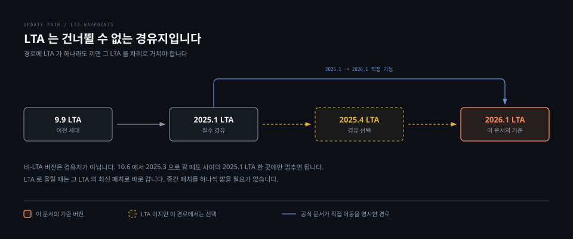

# 업그레이드와 LTA 정책

> 언제 올릴지는 취향이 아니라 정책이 정합니다. 어느 경로로 올릴지도 고를 수 없습니다. 그리고 Server 와 Community Build 는 이 규칙 자체가 서로 다른 제품입니다.

## 학습 목표

> 이 편을 읽고 나면 아래 네 가지를 스스로 해낼 수 있습니다.

1. Server 와 Community Build 의 릴리스 주기가 어떻게 다른지 설명할 수 있습니다.
2. 내 버전이 지원 대상인지 판정하고, 더 새 버전이 먼저 지원 종료되는 이유를 말할 수 있습니다.
3. 임의의 두 버전 사이 업그레이드 경로를 규칙으로 도출할 수 있습니다.
4. 폐기 예고를 어디서 확인하고 언제까지 대응해야 하는지 판단할 수 있습니다.




## 1. 두 제품은 릴리스 주기가 다릅니다

> Server 는 두 달마다, Community Build 는 매달 나옵니다. 그리고 Community Build 에는 LTA 라는 개념 자체가 없습니다.

| | SonarQube Server | SonarQube Community Build |
|---|---|---|
| 주기 | 2개월마다, 연 6회 | 매월 |
| 버전 형식 | `YYYY.릴리스번호.패치번호` | `YY.M.0.빌드번호` |
| LTA | 연초에 한 번 | **없음** |
| active version | 있음 | **없음** |

버전 형식은 10.8 에서 갈렸습니다. 그 전까지 SonarQube 는 `MAJOR.MINOR.PATCH` 를 썼고, 이후 Server 는 연도 기반으로 바뀌었습니다. 그래서 `9.9` 다음이 `10.0` 이고 `10.8` 다음이 `2025.1` 입니다. 숫자만 보면 뒷걸음질처럼 보이지만 같은 축이 아닙니다.

실습 인스턴스가 Community Build 라 이 주기를 직접 관찰할 수 있습니다. `api/system/upgrades` 를 부르면 업데이트 센터가 알려 준 상위 버전이 그대로 나옵니다.

```bash
latestLTA               2026.1
installedVersionActive  true
updateCenterRefresh     2026-08-22T10:02:08+0000

26.2   2026-02-04        26.6   2026-06-03
26.3   2026-03-03        26.7   2026-07-08
26.4   2026-04-10        26.8   2026-08-05
26.5   2026-05-11
```

일곱 건의 릴리스 날짜가 2월 4일부터 8월 5일까지 한 달에 하나씩 찍혀 있습니다. **문서가 말한 월 1회 주기가 실제 배포 이력으로 확인됩니다.**

여기서 나오는 실무적 결론이 하나 있습니다. Community Build 에는 "이 버전에 머무르며 보안 패치만 받는다"는 선택지가 정책상 존재하지 않습니다. 장기 지원을 받으려면 Server 로 가야 합니다.


## 2. active version 이 지원 여부를 정합니다

> 지원 정책은 버전 번호가 아니라 active 여부로 갈립니다. 그래서 더 새 버전이 더 먼저 죽습니다.

공식 지원 정책은 세 줄입니다.

- **최신 버전** — 신기능·개선·패치·기술 지원을 모두 받습니다
- **최신 -1 버전** — 기술 지원만 받습니다
- **최신 LTA** — 취약점과 블로커 버그 패치를 최대 12개월, 기술 지원을 최대 18개월 받습니다

active version 의 정의도 같은 축입니다. 최신 버전, 최신 -1, 그리고 각 LTA 가 출시 후 18개월까지입니다.

문서의 active 목록을 그대로 옮기면 직관에 어긋나는 지점이 보입니다.

| 버전 | active |
|---|---|
| 2026.4 | 예 |
| 2026.3 | 예 |
| 2026.2 | **아니오** |
| 2026.1 LTA | **예** |
| 2025.4 LTA | 예 |
| 2025.1 LTA | 아니오 |

**2026.2 는 지원 대상이 아닌데 그보다 오래된 2026.1 LTA 는 지원 대상입니다.** 2026.2 는 최신도 최신 -1 도 아니고 LTA 도 아니라 어느 조건에도 걸리지 않기 때문입니다. 중간 버전에 오래 머무르면 바로 다음 릴리스가 두 번 나오는 순간 지원 밖으로 밀려납니다.

내 인스턴스가 active 인지는 두 곳에서 확인합니다. 웹 화면 하단의 버전 번호 옆에 상태가 표시되고, 관리자는 **Administration > System** 에서 같은 표시를 봅니다. API 로는 `api/system/upgrades` 의 `installedVersionActive` 가 같은 값을 내려 줍니다. 실습 인스턴스는 `true` 였습니다.


## 3. 경로는 LTA 를 건너뛸 수 없습니다

> 경로에 LTA 가 하나라도 끼면 그 LTA 를 차례로 거쳐야 합니다. 이것이 업그레이드 계획의 뼈대입니다.

규칙은 다섯 개입니다.

- 경로에 LTA 가 없으면 비-LTA 버전끼리는 직접 올릴 수 있습니다
- 경로에 LTA 가 하나라도 있으면 **각 중간 LTA 를 차례로** 거친 뒤 목표로 갑니다
- LTA 로 올릴 때는 그 LTA 의 **최신 패치**로 바로 갑니다
- 최신 LTA 에서 최신 비-LTA 로는 직접 갈 수 있습니다
- LTA 의 이전 패치 버전에서 다음 LTA 로 갈 때 중간 패치를 밟을 필요는 없습니다

문서가 제시하는 예시 중 성격이 다른 넷을 골라 보면 규칙이 어떻게 적용되는지 보입니다.

| 현재 | 목표 | 경로 |
|---|---|---|
| 2025.1 LTA | 2026.1 LTA | 직접 |
| 9.9 LTA | 2026.1 LTA | 9.9 → 2025.1 LTA → 2026.1 LTA |
| 10.6 | 2025.1 LTA | 직접 |
| 10.6 | 2025.3 | 10.6 → 2025.1 LTA → 2025.3 |

아래 두 줄을 붙여 읽으면 규칙이 선명해집니다. `10.6 → 2025.1 LTA` 는 직접인데 `10.6 → 2025.3` 은 중간에 한 번 멈춰야 합니다. 목표가 더 멀어서가 아니라 **경로 안에 LTA 가 들어왔기 때문**입니다.

### 2025년에는 LTA 가 둘이었습니다

문서를 통째로 읽으면 어긋나는 자리가 하나 있습니다. 릴리스 주기 페이지는 LTA 가 매년 연초에 하나 나온다고 적어 두었는데, 같은 페이지의 active 목록에는 `2025.1 LTA` 와 `2025.4 LTA` 가 둘 다 올라 있습니다.

경로 규칙과 함께 읽으면 이 둘의 지위가 갈립니다. 공식 문서는 **2025.1 LTA 에서 2026.1 LTA 로 직접 갈 수 있다**고 두 페이지에서 명시합니다. 중간 LTA 를 모두 거쳐야 한다는 규칙을 문자 그대로 적용하면 2025.4 LTA 에 들러야 하지만, 문서는 들르지 않아도 된다고 말합니다. 위 도식에서 2025.4 를 점선으로 그린 이유입니다.

이런 자리를 만나면 규칙 문장보다 **경로 표와 LTA 간 릴리스 노트**를 따릅니다. 규칙은 요약이고 표가 실제 지원되는 이동입니다.


## 4. 올리기 전과 후에 하는 일

> 업그레이드의 위험은 대부분 데이터베이스에 있습니다. 준비 절차의 절반이 데이터베이스 이야기인 이유입니다.

### 올리기 전

- **릴리스 노트를 전부 읽습니다.** 현재 버전과 목표 버전 *사이의 모든 버전* 이 각자 권고를 갖고 있습니다
- **데이터베이스를 백업합니다.** 되돌릴 수단인 동시에 리허설용 데이터가 됩니다
- **데이터베이스 디스크 사용률을 50% 아래로 내립니다.** 마이그레이션 중 속도를 위해 테이블을 복제하므로 사용량이 최대 두 배까지 일시적으로 늘어납니다
- **대형 인스턴스라면 사전 정비를 돌립니다.** 아래 명령은 테이블을 잠그므로 반드시 다운타임 창 안에서 실행합니다

```bash
# PostgreSQL — 순서대로 이어서 돌릴 때 효과가 가장 큽니다
VACUUM FULL
REINDEX DATABASE <db>
ANALYZE
```

- **스캐너 최소 버전을 확인합니다.** 2026.1 LTA 는 Jenkins 확장 2.18, SonarScanner CLI 8.0.1, Gradle 용 7.2.2.6593 을 요구합니다
- **스테이징에서 리허설합니다.** 목적은 성공 여부만이 아니라 *얼마나 걸리는지* 를 재는 것입니다

실습 환경의 Jenkins 확장은 2.18.3 이라 2026.1 요구선을 넘습니다. 4장에서 파이프라인이 문제없이 돈 이유이기도 합니다.

### 올린 뒤

- 스캐너 버전을 확인합니다
- PostgreSQL 은 vacuum 으로 부풀어 오른 공간을 회수하고, 필요하면 재색인합니다
- Oracle 은 제거된 컬럼이 물리적으로 지워지지 않고 `UNUSED` 로 표시만 됩니다. 공간 회수는 선택이며, 대형 테이블에서 `DROP UNUSED COLUMNS` 는 전체 구간 배타 잠금이라 몇 시간이 걸릴 수 있습니다
- 스크립트나 서비스로 서버를 제어한다면 설치 디렉터리 경로를 새 값으로 고칩니다
- **폐기된 Web API 사용 현황을 점검합니다**

일부 프로젝트가 색인에 실패하면 프로젝트 단위 재색인 절차가 따로 있습니다. 색인은 데이터베이스에서 다시 만들 수 있으므로 데이터 손실 사건이 아닙니다.


## 5. LTA 사이에서 실제로 깨지는 것들

> 2026.1 LTA 는 조용한 파괴적 변경을 하나 담고 있습니다. JRE 로는 서버가 뜨지 않습니다.

공식 LTA 간 릴리스 노트에서 의존성 변화만 추려 보면 이렇습니다.

| 항목 | 2025.1 LTA | 2026.1 LTA |
|---|---|---|
| 서버 런타임 | Java 17 또는 21 | **Java 21 또는 25, JRE 불가 JDK 필요** |
| PostgreSQL | 13 ~ 17 | 14 ~ 18 |
| Microsoft SQL Server | 13.0 ~ 16.0 | 14.0 ~ 16.0 |
| Elasticsearch | — | 8.x, `/tmp` 읽기·쓰기 필수 |
| Jenkins 확장 최소 | 2.17.3 | 2.18 |
| Helm 차트의 PostgreSQL | 폐기 | 제거 |

가장 눈에 띄는 것은 첫 줄입니다. 문서 표현 그대로 옮기면 "이전의 JRE 요구는 더 이상 충분하지 않으며 전체 JDK 가 필요하다"입니다. Java 17 지원이 사라졌고 25 가 추가됐습니다. Java 17 JRE 로 잘 돌던 인스턴스가 2026.1 로 올리는 순간 뜨지 않습니다.

스캐너 쪽 Java 요구는 별개 줄로 적혀 있습니다. 조건이 붙습니다.

- 자동 프로비저닝을 **끈 경우에 한해** 2025.1 은 Java 17, 2026.1 은 Java 21 을 요구합니다
- Java 17 은 2025.6 에서 폐기 예고됐고 2026.3 에서 제거될 예정입니다
- **자동 프로비저닝을 켜 두면 이 줄은 해당되지 않습니다**

서버 런타임과 스캐너 런타임과 분석 대상 언어 버전은 서로 다른 세 축입니다. 그 구분은 2장에서 다뤘습니다.

Elasticsearch 8.x 요구도 놓치기 쉽습니다. `/tmp` 에 읽기와 쓰기가 되어야 하고 이 요구는 끌 수 없다고 문서가 못 박습니다. 컨테이너 보안 정책으로 `/tmp` 를 `noexec` 로 잠근 환경이라면 업그레이드 전에 풀거나 `sonar.path.temp` 를 옮겨야 합니다.


## 6. 폐기는 달력으로 움직입니다

> 무엇이 언제 사라지는지가 정책으로 고정돼 있습니다. 그래서 대응 기한을 미리 계산할 수 있습니다.

| 대상 | 폐기 후 제거 시점 |
|---|---|
| 기능·워크플로 | 폐기한 해의 다음 해, 새 LTA 이후. 최소 6개월 |
| Web API | 폐기한 해의 다음 해 1월 이후. 최소 6개월 |
| Plugin API | 폐기 후 최소 **2년** |

문서가 드는 예가 명확합니다. 2025.2 에서 폐기된 기능은 2026.1 LTA 까지는 남아 있고 2026.2 이후에 사라집니다. **LTA 는 폐기된 기능이 마지막으로 살아 있는 정거장**인 셈입니다.

Web API 쪽에는 부가 보장이 둘 붙습니다. 기능 자체가 사라지는 게 아니라면 대체 구성 요소가 즉시 제공돼야 하고, 폐기된 구성 요소는 제거 전까지 **완전히 동작해야** 합니다. 껍데기만 남기고 예외를 던지는 식은 정책 위반입니다.

### 내가 폐기된 것을 쓰고 있는지 확인하는 법

SonarQube 는 폐기된 Web API 호출을 별도 로그 파일에 기록합니다. 실습 인스턴스의 `deprecation.log` 를 열어 보니 **이 문서를 쓰면서 내가 호출한 것들이 그대로 잡혀 있었습니다.**

```bash
/api/system/db_migration_status
  Web service is deprecated since 10.6 and will be removed in a future version.

/api/webhooks/deliveries
  Parameter 'componentKey' is deprecated since 10.7 and will be removed in a future version.
```

두 줄의 성격이 다릅니다. 앞은 **엔드포인트 전체**가 폐기됐고, 뒤는 엔드포인트는 멀쩡한데 **파라미터 하나**가 폐기됐습니다. 후자가 더 위험합니다. 호출이 성공하므로 아무도 눈치채지 못한 채 살아 있다가, 파라미터가 제거되는 날 조용히 깨집니다.

4장에서 본 것처럼 229개 액션 중 25개가 폐기 표시였고 `api/user_groups` 는 7개 전부였습니다. 그 목록은 "언젠가 볼 문서"지만 `deprecation.log` 는 **내가 실제로 쓰고 있는 것만** 알려 줍니다. 업그레이드 준비에서 먼저 볼 것은 로그 쪽입니다.


## 면접에서 받을 만한 질문

1. 9.9 LTA 를 운영 중이고 2026.1 LTA 로 가려 합니다. 경로를 어떻게 잡습니까.
2. 2026.2 를 쓰고 있습니다. 지원을 받고 있는 상태입니까.
3. 3년 전 만든 CI 스크립트가 Web API 를 호출합니다. 다음 업그레이드에서 깨질지 미리 어떻게 압니까.

> 3개 질문에 *먼저 스스로 답해 보세요.* 자답이 끝나면 아래 §정답 (자답 후 펼치기) 으로 내려갑니다.


## 정답 (자답 후 펼치기)

> 위 §면접에서 받을 만한 질문 의 3개에 *먼저 자답한 뒤* 아래를 읽으세요. 자답 없이 먼저 읽으면 학습 효과가 0 입니다.

### 정답 1 — 2025.1 LTA 를 한 번 거칩니다

경로는 `9.9 LTA → 2025.1 LTA → 2026.1 LTA` 이고 중간 단계가 한 번입니다. 경로 안에 LTA 가 끼어 있으므로 직접 갈 수 없습니다.

두 가지를 덧붙여야 정확합니다. 첫째, 2025.1 LTA 로 올릴 때는 **그 LTA 의 최신 패치**로 바로 갑니다. 패치를 순서대로 밟을 필요가 없습니다. 둘째, 사이에 있는 2025.4 LTA 는 이 경로에서 들르지 않아도 됩니다. 문서가 2025.1 LTA 에서 2026.1 LTA 로 직접 이동할 수 있다고 명시하기 때문입니다.

실행 측면에서는 단계마다 준비 절차가 통째로 반복됩니다. 두 번 올리는 것은 백업도 두 번, 리허설도 두 번, 릴리스 노트 읽기도 두 구간이라는 뜻입니다.

### 정답 2 — 받지 못합니다

2026.2 는 active 가 아닙니다. 최신은 2026.4, 최신 -1 은 2026.3 이고 2026.2 는 LTA 도 아니라 세 조건 어디에도 걸리지 않습니다.

같은 시점에 더 오래된 2026.1 LTA 는 active 입니다. LTA 는 출시 후 18개월까지 active 로 유지되기 때문입니다. **번호가 큰 쪽이 더 오래 지원받는다는 직관이 여기서 깨집니다.**

여기서 나오는 운영 판단은 분명합니다. 중간 릴리스에 정착할 생각이라면 두 번의 릴리스 안에 다시 올릴 계획이 함께 있어야 합니다. 그럴 여력이 없으면 LTA 에 머무는 편이 낫습니다.

확인은 화면 하단이나 **Administration > System** 의 상태 표시, 또는 `api/system/upgrades` 의 `installedVersionActive` 로 합니다.

### 정답 3 — deprecation 로그를 봅니다

두 가지를 함께 씁니다. 정책은 언제까지 시간이 있는지를 알려 주고, 로그는 내가 실제로 무엇을 쓰는지를 알려 줍니다.

정책 쪽부터 보면 Web API 구성 요소는 폐기된 해의 다음 해 1월 이후에 제거될 수 있고 최소 6개월은 보장됩니다. 그리고 제거 전까지는 완전히 동작해야 합니다. 즉 지금 조용히 잘 도는 호출이라도 폐기 표시가 붙어 있으면 다음 LTA 이후가 마감입니다.

실제 확인은 로그입니다. 서버가 폐기된 엔드포인트와 파라미터 호출을 `deprecation.log` 에 따로 기록하므로, 그 파일에 우리 CI 의 호출이 찍히는지 보면 됩니다. 실습 인스턴스에서도 폐기된 엔드포인트 호출과 폐기된 파라미터 사용이 각각 기록됐습니다.

파라미터 폐기가 특히 위험합니다. 엔드포인트가 살아 있어 호출이 성공하므로 정상으로 보이지만, 제거되는 순간 깨집니다. 로그 없이 코드만 훑어서는 잡히지 않는 종류입니다.


## 관련 문서

- [설치와 용량 산정](05-01.설치와%20용량%20산정.md) — 업그레이드가 요구하는 데이터베이스 여유 공간의 근거
- [모니터링과 트러블슈팅](05-03.모니터링과%20트러블슈팅.md) — `deprecation.log` 를 포함한 로그 파일 전체
- [Web API 구조](04-02.Web%20API%20구조.md) — 폐기 표시가 붙은 액션의 분포
- [Scanner 종류와 선택](02-01.Scanner%20종류와%20선택.md) — 서버·스캐너·분석 대상의 Java 축 구분
