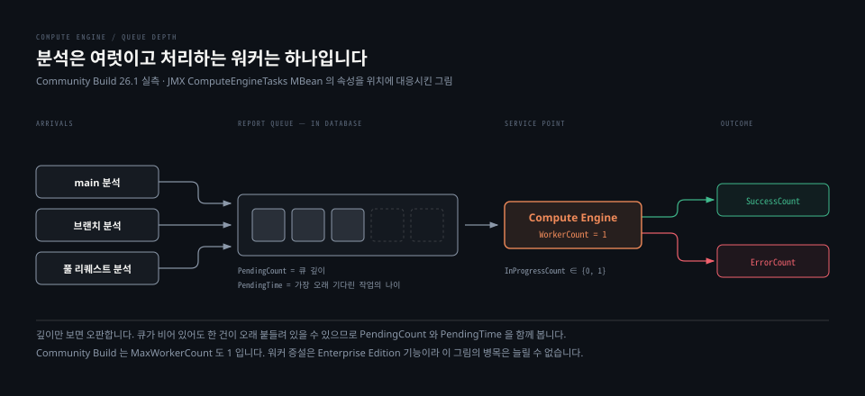

# 모니터링과 트러블슈팅

> 고장이 났을 때 어느 파일을 열지 아는 것이 절반입니다. 나머지 절반은 고장이 나기 전에 어떤 숫자를 보고 있었느냐입니다. 그리고 그 숫자 목록은 버전마다 다릅니다.

## 학습 목표

> 이 편을 읽고 나면 아래 네 가지를 스스로 해낼 수 있습니다.

1. 증상을 보고 여섯 로그 파일 중 어디를 열지 고를 수 있습니다.
2. 상태 확인용 엔드포인트 셋을 목적에 따라 구분해 쓸 수 있습니다.
3. 지표 수집 경로 두 가지의 차이와 제약을 설명할 수 있습니다.
4. 백그라운드 태스크 적체를 두 지표의 조합으로 판정하고, 백업 대상이 무엇인지 말할 수 있습니다.




## 1. 로그는 여섯 갈래로 나뉩니다

> 프로세스마다 자기 로그를 씁니다. 어느 프로세스의 문제인지 정하면 열 파일이 하나로 좁혀집니다.

실습 인스턴스의 `logs` 디렉터리를 그대로 보면 이렇습니다.

```bash
sonar.log        메인 프로세스. 기동·종료의 전체 상태
web.log          DB 최초 연결, 마이그레이션·재색인, HTTP 요청 처리
ce.log           백그라운드 태스크 처리
es.log           검색 엔진 기동, 상태 변화, 클러스터·노드·인덱스 작업
access.log       접근 로그
deprecation.log  폐기된 Web API 엔드포인트·파라미터 호출
```

파일이 날짜별로 회전한 흔적도 함께 보입니다. `access.2026-08-20.log` 처럼 지난 날짜가 파일명에 붙고 현재 파일만 접미사 없이 남습니다.

`sonar.log` 는 개요만 담습니다. 공식 문서 표현대로 "전체 상태는 여기서 얻지만 세부는 얻지 못하므로 다른 로그를 보라"는 성격입니다. 5-01 에서 본 기동 순서를 확인한 곳이 이 파일입니다.

### 스택트레이스는 두 줄만 봅니다

문서가 알려 주는 읽기 요령이 실용적입니다. 그 코드를 직접 쓴 사람이 아니라면 두 곳만 보면 됩니다.

- **첫 줄** — 콜론 뒤에 사람이 읽을 수 있는 메시지가 있습니다
- **`Caused by` 로 시작하는 줄** — 여러 개면 전부 읽되, 진짜 원인은 대개 마지막이나 마지막 직전에 있습니다

### 레벨은 프로세스별로 따로 조절합니다

기본값은 `INFO` 이고 `DEBUG` 와 `TRACE` 가 있습니다. `DEBUG` 부터는 개인 정보가 로그에 남을 수 있다고 문서가 경고합니다. `TRACE` 는 모든 SQL 과 Elasticsearch 요청을 찍기 때문에 서버를 느리게 만들며, 웹 요청 성능 문제를 추적할 때만 쓰라고 못 박습니다.

프로세스별로 따로 줄 수 있습니다.

```bash
sonar.log.level.app   메인 프로세스
sonar.log.level.web   Web
sonar.log.level.ce    Compute Engine
sonar.log.level.es    Search
```

**Administration > System** 화면에서도 레벨을 바꿀 수 있는데 이 변경은 임시입니다. 재시작하면 `sonar.properties` 에 적힌 값으로 되돌아갑니다. 급한 조사에는 화면이 편하고, 유지되어야 하는 값은 설정 파일에 적어야 합니다.

회전 정책은 `sonar.log.rollingPolicy` 로 정합니다. `time:yyyy-MM-dd` 는 일 단위, `size:10MB` 는 크기 단위이며 `none` 은 회전하지 않습니다. 외부 logrotate 에 맡길 때 `none` 을 씁니다. `sonar.log.maxFiles` 로 보관 개수를 정하되 `none` 일 때는 무시됩니다.

로그를 수집 도구로 보낼 계획이라면 `sonar.log.jsonOutput` 을 `true` 로 둡니다. 실습 인스턴스는 `false` 였고, 대신 `sonar.log.console` 이 `true` 라 컨테이너 표준 출력으로도 나옵니다.


## 2. 상태는 세 엔드포인트가 답합니다

> 셋의 용도가 다릅니다. 뜬 상태인지, 건강한지, 왜 그런지 순서입니다.

| 엔드포인트 | 답하는 질문 | 인증 |
|---|---|---|
| `api/system/status` | 떴는가 | 불필요 |
| `api/system/health` | 건강한가 | 필요 |
| `api/system/info` | 왜 그런가 | 필요 |

실습 인스턴스의 응답입니다.

```bash
api/system/status
  {"id":"243B8A4D-...","version":"26.1.0.118079","status":"UP"}

api/system/health
  {"health":"GREEN","causes":[]}

api/system/db_migration_status
  {"state":"NO_MIGRATION","message":"Database is up-to-date, no migration needed."}
```

`health` 의 `causes` 배열이 핵심입니다. `GREEN` 이 아닐 때 이 배열에 이유가 들어옵니다. 상태만 보고 넘기면 진단의 절반을 버리는 셈입니다.

`api/system/info` 는 스무 개 섹션을 한 번에 내려 줍니다. System · Database · Plugins · Web JVM State · Compute Engine Tasks · Search State · Search Indexes · Settings 같은 이름이고, 5-01 의 용량 수치를 뽑아낸 곳도 여기입니다.

`info` 에서 특히 자주 보게 될 자리를 셋만 꼽으면 이렇습니다.

- **Search State** — `Disk Available`, `Store Size`, `JVM Heap Usage`. 디스크 경고의 조기 신호
- **Compute Engine Tasks** — `Pending`, `In Progress`, `Worker Count`. 적체 판정
- **Web Database Connection** — `Pool Active`, `Pool Max`. 커넥션 고갈 판정

실습 인스턴스는 커넥션 풀이 전체 10개 중 활성 1개, 상한 60이었습니다. 부하가 없는 상태의 기준선으로 기록해 둘 만합니다.


## 3. 지표는 두 경로로 나갑니다

> Web API 경로는 어디서든 되고, JMX 익스포터 경로는 Kubernetes 와 OpenShift 에서만 됩니다.

| 경로 | 가능한 배포 | 수집 방법 |
|---|---|---|
| `api/monitoring/metrics` | 베어메탈 · Docker · Kubernetes 전부 | HTTP GET, 시스템 패스코드 또는 베어러 토큰 |
| JMX Exporter 자바 에이전트 | **Kubernetes · OpenShift 만** | Helm 차트가 여는 별도 포트를 Prometheus 가 긁습니다 |

이 구분이 실무에서 중요합니다. Docker Compose 로 띄운 인스턴스에서 JVM 힙이나 Tomcat 커넥터 지표를 Prometheus 로 긁으려 하면 나오지 않습니다. Helm 차트가 자바 에이전트를 붙여 주는 배포에서만 나오는 값이기 때문입니다. Kubernetes 가 아니라면 JMX 를 직접 여는 것이 대안입니다.

### 지표 목록은 버전이 정합니다

실습 인스턴스에서 `api/monitoring/metrics` 를 긁으니 17개가 나왔습니다. 그런데 공식 목록에는 있는데 나오지 않는 것이 둘 있었습니다.

```bash
sonarqube_elasticsearch_read_only_indices_total   ← 없음
sonarqube_elasticsearch_disk_usage_percent        ← 없음
```

문서가 이 둘 옆에 이유를 적어 두었습니다. **SonarQube Server 2026.3 과 Community Build 26.4 에서 추가됐다**는 표시입니다. 우리 인스턴스는 26.1 이라 아직 없는 것이 맞습니다.

문서를 보고 대시보드를 먼저 만든 뒤 인스턴스를 붙이면 이런 패널이 조용히 비어 있게 됩니다. **지표 문서는 최신 버전 기준으로 쓰여 있고 내 인스턴스는 그보다 뒤일 수 있습니다.** 패널을 만들기 전에 엔드포인트를 한 번 긁어서 실제로 나오는 이름을 확인하는 편이 빠릅니다.

나온 17개 중 알람으로 값어치가 있는 것을 꼽으면 이렇습니다.

| 지표 | 무엇을 잡는가 |
|---|---|
| `sonarqube_compute_engine_pending_tasks_total` | 분석 결과가 늦어지는 상황 |
| `sonarqube_elasticsearch_disk_space_free_bytes` | 읽기 전용 잠금으로 가는 길목 |
| `sonarqube_health_web_status` · `_compute_engine_status` · `_elasticsearch_status` | 프로세스별 생사 |
| `sonarqube_compute_engine_tasks_running_duration_seconds` | 처리 시간 분포. 프로젝트별 라벨이 붙습니다 |

라이선스 관련 지표 셋도 함께 나옵니다. Community Build 에는 라이선스가 없는데도 노출되는 자리라 대시보드에서는 빼는 편이 낫습니다.

### JMX MBean

Prometheus 를 쓰지 않는 환경에서는 JMX 로 같은 정보를 봅니다. 표준 자바 MBean 외에 SonarQube 가 셋을 더 노출합니다.

- **ComputeEngineTasks** — 태스크 처리 통계
- **Database** — 커넥션 풀과 마이그레이션 상태
- **SonarQube** — 로그 레벨, 서버 ID, 버전

전부 읽기 전용이라 값을 바꾸거나 초기화할 수 없습니다. 같은 서버에서 도구를 돌리면 별도 설정 없이 보이고, 원격에서 붙으려면 `sonar.web.javaAdditionalOpts` 에 JMX 옵션을 넣어야 합니다. 비밀번호 파일에는 반드시 `600` 이나 `400` 권한을 주라고 문서가 덧붙입니다.


## 4. 적체는 두 지표의 조합으로 판정합니다

> 큐 깊이만 보면 오판합니다. 깊이와 나이를 함께 봐야 합니다.

`ComputeEngineTasks` MBean 의 속성을 위 도식의 위치에 대응시켜 읽으면 이렇습니다.

| 속성 | 의미 |
|---|---|
| `PendingCount` | 처리를 기다리는 태스크 수. 워커가 여럿이어도 큐는 하나라 값이 같습니다 |
| `PendingTime` | 가장 오래 기다린 태스크가 기다린 시간(ms) |
| `InProgressCount` | 처리 중인 수. **0 아니면 1** 입니다 |
| `WorkerCount` | 동시에 처리 가능한 수 |
| `SuccessCount` · `ErrorCount` | 마지막 재시작 이후 누적 |
| `ProcessingTime` | 마지막 재시작 이후 누적 처리 시간(ms) |

문서가 `PendingTime` 에 붙인 설명이 판정 기준을 그대로 알려 줍니다. `PendingCount` 와 함께 보면 분석이 쌓이고 있는지, 처리 시작이 너무 늦어지는지 알 수 있고 그 결과로 워커나 노드를 늘릴 값어치가 있는지 판단하게 된다는 것입니다.

두 값이 필요한 이유는 서로 다른 고장을 잡기 때문입니다. 깊이가 깊으면 도착이 처리보다 빠르다는 뜻이고, 깊이가 얕은데 나이가 많으면 한 건이 오래 붙들려 있다는 뜻입니다. 뒤쪽은 워커를 늘려도 해결되지 않습니다.

`ProcessingTime` 과 `SuccessCount` 를 나누면 태스크당 평균이 나옵니다. 실습 인스턴스의 값으로 계산해 보면 이렇습니다.

```bash
Processed With Success   3
Processing Time (ms)     35,129
평균                     11.7 초/건
```

그런데 태스크별로 뜯어보면 평균이 실제를 가립니다. `api/ce/activity` 로 개별 실행 시간을 보면 21,086ms · 6,865ms · 7,178ms 입니다. **첫 분석만 세 배 걸렸습니다.** 첫 분석은 프로젝트를 새로 만들고 참조 데이터를 채우는 일이 함께 일어나기 때문입니다. 기준선을 잡을 때 첫 실행을 포함하면 값이 부풀려집니다.

마지막으로 짚어 둘 제약이 하나 있습니다. 실습 인스턴스는 `Worker Count` 와 `Max Worker Count` 가 둘 다 1 이었습니다. Community Build 에서는 이 값을 올릴 수 없고, 워커 증설은 Enterprise Edition 기능입니다. **큐가 밀린다는 진단을 내려도 이 배포에서는 실행할 수 있는 조치가 아닙니다.**


## 5. 백업은 데이터베이스만 뜹니다

> Elasticsearch 는 백업 대상이 아닙니다. 복구 절차가 그것을 지우라고 지시합니다.

공식 문서의 백업 지침은 한 문장입니다. 데이터베이스에 딸린 백업 도구를 쓰라는 것이고, **핫 백업이 지원된다**고 명시합니다. 서비스를 멈추지 않고 떠도 됩니다.

주목할 것은 복구 절차입니다.

```bash
1. 서버 정지
2. 백업 복원
3. data/es8 디렉터리 내용 삭제      ← 색인을 버립니다
4. 서버 재시작
```

**3번이 이 절의 요점입니다.** Elasticsearch 색인을 함께 복원하지 않고 아예 지웁니다. 재시작하면 Web 프로세스가 데이터베이스를 읽어 색인을 다시 만듭니다.

이유는 1절에서 본 구조 그대로입니다. Elasticsearch 는 데이터베이스의 색인 사본이고 원본이 아닙니다. 사본을 따로 백업하면 데이터베이스 시점과 어긋날 위험만 생깁니다. 지우고 다시 만드는 편이 정합성 면에서 안전합니다.

여기서 나오는 운영 판단이 둘입니다. 백업 계획에 Elasticsearch 스냅샷을 넣을 필요가 없습니다. 대신 **복구에 재색인 시간이 포함된다**는 점을 복구 목표 시간에 반영해야 합니다. 5-01 에서 본 대로 이 인스턴스의 규칙 색인만 25.8MB 였고, 이슈가 쌓인 운영 인스턴스라면 재색인이 훨씬 오래 걸립니다.


## 6. 자주 만나는 고장 다섯

> 공식 트러블슈팅 문서에서 원인이 구조적인 것만 골랐습니다.

### Elasticsearch 색인이 읽기 전용으로 잠겼습니다

디스크 사용률 95%에 닿으면 색인이 잠깁니다. 공간을 비워도 자동으로 풀리지 않고 재시작이 필요합니다. 상세는 5-01 §3 에 있습니다.

### root 로는 실행되지 않습니다

SonarQube 가 Elasticsearch 프로세스를 자기 계정으로 띄우는데, Elasticsearch 는 root 로 돌 수 없습니다. 따라서 SonarQube 도 root 로 돌릴 수 없습니다. 전용 계정을 하나 만들어 쓰는 것이 권고입니다.

### `Failed to allocate closure` 또는 JNA 초기화 실패

리눅스에서만 나옵니다. `/tmp` 에 `noexec` 가 걸려 있어 JNA 가 임시 파일을 실행하지 못하는 상황입니다. `noexec` 를 풀거나 `sonar.path.temp` 로 임시 디렉터리를 다른 곳으로 옮깁니다. 2026.1 이 Elasticsearch 8.x 를 담으면서 `/tmp` 읽기·쓰기가 필수가 됐고 이 요구는 끌 수 없습니다.

### 재색인 중 태스크가 실패합니다

실패한 태스크가 몇 건이면 해당 브랜치나 풀 리퀘스트를 다시 분석합니다. 버전 관리에서 이미 사라져 재분석할 수 없는 브랜치는 Web API 로 지웁니다. 실패가 많으면 Elasticsearch 디렉터리를 지우고 처음부터 다시 색인하는 편이 낫습니다.

### 지표는 정상인데 결과가 안 보입니다

`api/system/health` 가 `GREEN` 이고 큐도 비어 있는데 개발자가 결과를 못 본다면, 태스크가 아예 도착하지 않았을 가능성을 먼저 봅니다. 스캐너가 리포트를 올리지 못했다면 `ce.log` 에는 아무것도 남지 않고 `access.log` 에만 흔적이 남습니다. 서버 쪽 로그가 조용하다는 것 자체가 신호입니다.


## 면접에서 받을 만한 질문

1. 공식 문서를 보고 Prometheus 대시보드를 만들었는데 Elasticsearch 디스크 사용률 패널만 계속 비어 있습니다. 무엇을 확인합니까.
2. 백그라운드 태스크 큐 깊이가 0인데 개발자들이 결과가 안 나온다고 합니다. 어디를 봅니까.
3. 문제를 조사하려고 화면에서 로그 레벨을 `DEBUG` 로 바꿨는데 다음 날 다시 `INFO` 였습니다. 왜 그렇습니까.

> 3개 질문에 *먼저 스스로 답해 보세요.* 자답이 끝나면 아래 §정답 (자답 후 펼치기) 으로 내려갑니다.


## 정답 (자답 후 펼치기)

> 위 §면접에서 받을 만한 질문 의 3개에 *먼저 자답한 뒤* 아래를 읽으세요. 자답 없이 먼저 읽으면 학습 효과가 0 입니다.

### 정답 1 — 그 지표가 내 버전에 있는지 확인합니다

대시보드 설정이나 스크레이프 문제이기 전에 **지표 자체가 없을 가능성**을 먼저 봅니다.

`sonarqube_elasticsearch_disk_usage_percent` 는 SonarQube Server 2026.3 과 Community Build 26.4 에서 추가된 지표입니다. 그보다 낮은 버전에서는 엔드포인트가 이 이름을 아예 내보내지 않습니다. 실습 인스턴스(26.1)에서 실제로 이 지표와 `sonarqube_elasticsearch_read_only_indices_total` 둘 다 나오지 않았습니다.

확인은 한 줄이면 끝납니다. `api/monitoring/metrics` 를 직접 긁어 이름이 목록에 있는지 봅니다. 없으면 원인은 버전이고, 조치는 업그레이드이거나 대체 지표 사용입니다. 대체로는 `sonarqube_elasticsearch_disk_space_free_bytes` 와 `_total_bytes` 를 나눠 쓸 수 있습니다.

여기서 얻을 습관이 하나 있습니다. **지표 문서는 최신 버전 기준으로 쓰여 있습니다.** 패널을 만들기 전에 인스턴스가 실제로 내보내는 이름을 한 번 확인합니다.

### 정답 2 — 태스크가 도착하지 않았을 가능성부터 봅니다

큐 깊이가 0이라는 것은 두 가지를 동시에 뜻할 수 있습니다. 처리가 다 끝났거나, **애초에 들어온 것이 없거나**입니다. 개발자가 결과를 못 본다면 뒤쪽을 먼저 의심합니다.

확인 순서는 이렇습니다. `PendingCount` 와 함께 `PendingTime` 을 봅니다. 둘 다 0이면 대기 중인 일이 없다는 뜻이므로 적체가 아닙니다. 다음으로 `SuccessCount` 와 `ErrorCount` 를 봐서 최근에 처리된 것이 있는지 확인합니다.

그다음은 로그입니다. `ce.log` 에 해당 시각의 태스크 기록이 없다면 리포트가 서버에 도달하지 못한 것입니다. 이 경우 `access.log` 에만 흔적이 남거나 그마저 없습니다. 원인은 서버가 아니라 CI 쪽에 있습니다. 스캐너 실패, 인증 실패, 네트워크 차단 순으로 좁혀 갑니다.

반대로 `PendingCount` 는 0인데 `PendingTime` 이 크다면 성격이 다릅니다. 한 건이 오래 붙들려 있다는 뜻이고, 이때는 워커를 늘려도 풀리지 않습니다.

### 정답 3 — 화면에서 바꾼 값은 임시이기 때문입니다

**Administration > System** 에서 조절한 로그 레벨은 재시작 전까지만 유지됩니다. 재시작하면 `sonar.properties` 에 적힌 영구 값으로 되돌아갑니다. 밤사이 인스턴스가 재시작됐다면 그것으로 설명이 끝납니다.

영구히 바꾸려면 `sonar.log.level` 을 설정 파일에 적어야 합니다. 프로세스별로 나눠 줄 수도 있어서, Web 요청만 자세히 보고 싶으면 `sonar.log.level.web` 하나만 올리면 됩니다.

다만 되돌아가는 동작 자체는 안전장치에 가깝습니다. 문서도 `INFO` 에서 내렸으면 가능한 한 빨리 되돌리라고 권고합니다. 이유가 셋입니다.

- 낮은 레벨에서는 로그 파일이 순식간에 커집니다
- `DEBUG` 부터는 개인 정보가 로그에 남을 수 있습니다
- `TRACE` 는 모든 SQL 과 Elasticsearch 요청을 찍어 서버를 느리게 만듭니다

조사가 길어질 것 같으면 설정 파일에 적되 회전 정책을 함께 손보는 편이 안전합니다. `sonar.log.rollingPolicy` 를 `size:10MB` 처럼 두고 `sonar.log.maxFiles` 로 보관 개수를 제한합니다.


## 관련 문서

- [설치와 용량 산정](05-01.설치와%20용량%20산정.md) — 여기서 보는 수치의 기준선과 디스크 임계
- [업그레이드와 LTA 정책](05-02.업그레이드와%20LTA%20정책.md) — `deprecation.log` 가 업그레이드 준비에서 하는 일
- [서버 구성 요소와 분석 흐름](01-02.서버%20구성%20요소와%20분석%20흐름.md) — 로그를 나눠 쓰는 네 프로세스
- [Jenkins 연계](04-01.Jenkins%20연계.md) — 태스크가 도착하지 않을 때 거슬러 올라갈 CI 쪽
