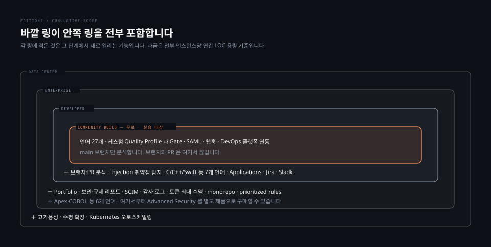

# 에디션 경계와 branch plugin

> 무엇이 유료인지 아는 것보다 **유료 기능이 어떤 형태로 없는지** 아는 편이 쓸모 있습니다. 잠긴 버튼이 아니라 아예 실리지 않은 규칙과 언어입니다. 그래서 서드파티 플러그인이 메울 수 있는 자리와 메울 수 없는 자리가 갈립니다.

## 학습 목표

> 이 편을 읽고 나면 아래 네 가지를 스스로 해낼 수 있습니다.

1. 네 에디션의 경계를 기능 축으로 설명할 수 있습니다.
2. Community Build 에서 유료 기능이 어떤 형태로 부재한지 확인 방법과 함께 말할 수 있습니다.
3. branch plugin 이 메우는 자리와 메우지 못하는 자리를 구분할 수 있습니다.
4. 서드파티 플러그인을 얹는 대가를 세 가지 이상 들 수 있습니다.




## 1. 에디션은 넷이고 과금은 LOC 기준입니다

> 무료인 Community Build 위에 유료 세 단계가 얹힙니다. 셋 다 인스턴스당 연간, 코드 줄 수 용량으로 과금합니다.

공식 문서가 각 단계를 겨냥한 대상을 명시합니다.

| 에디션 | 대상 | 초점 |
|---|---|---|
| Community Build | 개인·소규모, 무료 | 주 브랜치 분석 |
| Developer | 단일 인스턴스를 쓰는 소규모 팀 | 브랜치·PR 분석, 언어 추가, 보안 강화 |
| Enterprise | 팀과 프로젝트가 많은 조직 | 중앙 거버넌스, Portfolio, 규제 리포트 |
| Data Center | 대규모·미션 크리티컬 | 고가용성, 수평 확장, 부하 내성 |

과금 단위가 **인스턴스당 LOC 용량**이라는 점이 설계에 영향을 줍니다. 프로젝트를 여러 인스턴스로 쪼개도 각각 용량을 사야 하므로 대개 한 인스턴스에 모으게 됩니다. 5-01 의 참조 아키텍처가 단일 호스트에 1000만 줄까지를 잡은 배경이기도 합니다.


## 2. 경계는 잠금이 아니라 부재입니다

> 유료 기능은 비활성 버튼으로 보이지 않습니다. 규칙도 언어도 인스턴스에 존재하지 않습니다.

실습 인스턴스에 직접 물어보면 경계가 어떤 형태인지 드러납니다.

### 언어는 27개뿐입니다

```bash
azureresourcemanager, cloudformation, cs, css, docker, flex, go, ipynb, java,
js, json, jsp, kotlin, kubernetes, php, py, ruby, rust, scala, secrets,
terraform, text, ts, vbnet, web, xml, yaml
```

여기에 `c` · `cpp` · `objc` · `swift` · `abap` · `tsql` · `plsql` 이 없습니다. 에디션 매트릭스가 Developer 에서 더해진다고 적은 일곱 개와 정확히 같습니다. `apex` · `cobol` · `jcl` · `pli` · `rpg` · `vb6` 도 없는데, 이 여섯은 Enterprise 항목입니다.

C++ 프로젝트를 Community Build 로 분석하려 하면 설정이 잘못됐다는 오류가 아니라 **인식할 언어가 없는 상태**를 만나게 됩니다.

### injection 탐지는 규칙 자체가 없습니다

taint 분석 규칙은 `javasecurity` 같은 별도 저장소에 담깁니다. 인스턴스를 뒤져 보면 이렇습니다.

| 조회 | 결과 |
|---|---:|
| `repositories=javasecurity` 규칙 수 | **0** |
| `rule_key=javasecurity:S3649` (SQL injection) | **0** |
| `repositories=java` 규칙 수 | 695 |
| 전체 규칙 저장소 수 | 52 |

일반 Java 규칙 695개는 멀쩡히 있는데 taint 저장소만 통째로 없습니다. 보안 성격의 규칙이 전혀 없는 것은 아닙니다. `secrets` 저장소에 30개가 있고 `external_findsecbugs` 처럼 외부 보안 린터의 결과를 받아 넣는 저장소도 있습니다. 없는 것은 **SonarQube 자신의 taint 엔진**입니다.

헷갈리기 쉬운 자리가 하나 더 있습니다. `javasymbolicexecution` 플러그인은 번들로 실려 있습니다. 메서드 안에서 널 참조나 자원 누수를 잡는 기호 실행과, 파일과 함수를 넘나들며 오염된 입력을 추적하는 taint 분석은 다른 엔진입니다. 앞은 무료고 뒤는 Developer 부터입니다.

### Quality Gate 는 하나뿐입니다

```bash
Sonar way | builtIn=True | default=True | isAiCodeSupported=False
```

공식 문서는 AI 코드를 위한 `Sonar way for AI Code` 게이트를 권장 게이트로 소개하는데, 실습 인스턴스에는 없습니다. 대신 API 응답에 `isAiCodeSupported` 라는 필드가 남아 있고 값이 `false` 입니다. **데이터 모델은 공유하되 그 자격을 가진 게이트가 실리지 않은** 형태입니다.

### 플러그인은 번들 19 + 외부 1 입니다

`api/plugins/installed` 가 `type` 을 함께 내려 줍니다. `BUNDLED` 19개와 `EXTERNAL` 1개이며 후자가 `communityBranchPlugin 26.1.0` 입니다. 이 구분이 다음 절의 이야기 전부입니다.


## 3. branch plugin 이 메우는 자리

> 서드파티 플러그인 하나가 브랜치와 PR 분석을 되돌려 놓습니다. 그 자리만 메웁니다.

`mc1arke/sonarqube-community-branch-plugin` 은 SonarSource 가 만들지 않은 오픈소스입니다. 동작 방식이 특이합니다. 일반 플러그인처럼 확장점에 등록되는 데 그치지 않고 **자바 에이전트로 Web 과 Compute Engine 프로세스에 붙습니다.**

```bash
sonar.web.javaAdditionalOpts = -javaagent:.../sonarqube-community-branch-plugin-26.1.0.jar=web
sonar.ce.javaAdditionalOpts  = -javaagent:.../sonarqube-community-branch-plugin-26.1.0.jar=ce
```

같은 jar 를 프로세스마다 다른 인자(`=web`, `=ce`)로 붙입니다. 5-01 의 기동 로그에서 두 프로세스의 실행 명령에 이 옵션이 각각 찍힌 것을 확인할 수 있습니다.

### 실제로 되는지 돌려 봤습니다

`main` 하나만 있던 프로젝트에 브랜치 이름을 지정해 분석을 한 번 넣었습니다.

```bash
sonar-scanner -Dsonar.branch.name=feature/ch6-boundary
```

스캐너 로그에 `Load branch configuration` 과 `Branch name: feature/ch6-boundary` 가 찍히고 `ANALYSIS SUCCESSFUL` 로 끝났습니다. 결과 URL 에도 `&branch=feature%2Fch6-boundary` 가 붙습니다.

분석 뒤 브랜치 목록이 둘이 됐습니다.

| 브랜치 | main 여부 | Quality Gate |
|---|---|---|
| `main` | 예 | **ERROR** |
| `feature/ch6-boundary` | 아니오 | **OK** |

순정 Community Build 라면 두 번째 줄이 생기지 않습니다. 브랜치 이름을 줘도 무시되고 같은 프로젝트를 덮어씁니다.

### 메우지 못하는 자리

플러그인이 되돌리는 것은 브랜치와 PR 축뿐입니다. 앞 절에서 본 언어 열세 개와 taint 분석 규칙, Portfolio, 보안 리포트, SCA 는 그대로 없습니다. **경계가 규칙과 언어의 부재로 구현돼 있으므로 플러그인이 만들어 낼 수 없습니다.**


## 4. 새 브랜치는 게이트가 비어 있습니다

> 같은 코드인데 판정이 반대로 나왔습니다. 브랜치를 새로 따면 기준선이 사라지기 때문입니다.

위 표에서 `main` 은 `ERROR` 인데 새 브랜치는 `OK` 였습니다. 코드는 한 글자도 바꾸지 않았습니다. 게이트 상세를 열어 보면 이유가 드러납니다.

```bash
main
  new_coverage                  LT 80  actual=0.0  → ERROR
  new_duplicated_lines_density  GT  3  actual=0.0  → OK
  new_violations                GT  0  actual=18   → ERROR
  period = PREVIOUS_VERSION (2026-08-21)

feature/ch6-boundary
  (조건 없음)
  period = 없음
```

새 브랜치에는 **평가된 조건이 하나도 없습니다.** New Code 기간 자체가 잡히지 않아 비교 대상이 없고, 그래서 조건이 성립하지 않은 채 통과합니다.

4장에서 본 "첫 분석은 항상 통과한다"가 프로젝트가 아니라 **브랜치 단위로 다시 일어난 것**입니다. 이슈 18건은 그대로 있는데 게이트만 조용합니다.

실무에서 이 성질은 두 방향으로 작용합니다. 새 기능 브랜치를 딸 때마다 게이트가 빈손으로 시작하므로 브랜치 게이트를 머지 조건으로 삼으면 첫 실행이 무의미하게 통과합니다. 반대로 오래된 코드를 새 브랜치로 옮겨 놓으면 과거 부채가 New Code 에서 사라집니다. 판정을 믿기 전에 **어떤 기준선과 비교했는지**를 먼저 봐야 합니다.


## 5. 플러그인을 얹는 대가

> 기능을 되찾는 대신 넷을 내줍니다.

**첫째, 배포가 공식이 아니게 됩니다.** `api/system/info` 의 `Official Distribution` 이 `False` 로 바뀌고 기동 로그에 경고가 남습니다.

```bash
WARN app[][startup] Plugin(s) detected. Plugins are not provided by SonarSource
                    and are therefore installed at your own risk.
                    A SonarQube administrator needs to acknowledge this risk once logged in.
```

**둘째, 성능 영향이 미지수입니다.** 5-01 에서 본 참조 아키텍처가 서드파티 플러그인을 "정상 사용" 밖으로 분류하고, 구현마다 영향이 다르니 신중히 판단하고 계속 관측하라고 적습니다.

**셋째, 버전을 따라가야 합니다.** 플러그인은 서버와 major.minor 를 맞춰야 합니다. 그런데 릴리스 이력을 보면 추종이 끊겨 있습니다.

| | 최신 |
|---|---|
| SonarQube Community Build | **26.8** (2026-08-05) |
| branch plugin | **26.5.0** (2026-06-01) |

**플러그인이 세 릴리스 뒤처져 있고 두 달 넘게 새 릴리스가 없습니다.** 실습 버전을 26.1 로 고정한 이유가 여기에도 있습니다. 서버를 올리고 싶어도 플러그인이 따라오지 않으면 올릴 수 없습니다. 5-02 에서 본 지원 정책과 겹쳐 읽으면, 서버는 active version 을 유지해야 하는데 플러그인이 그 발목을 잡는 구도입니다.

**넷째, 지원 대상이 아닙니다.** SonarSource 제품이 아니므로 문제가 생겨도 지원 티켓의 대상이 되지 않습니다.

### 실무에서도 같은 선택을 합니다

제가 관측한 사내 운영 인스턴스도 같은 조합이었습니다. Community Build 25.9.0.112764 에 branch plugin 25.9.0 을 얹고 Helm 차트로 배포한 형태입니다. 브랜치별 분석이 필요한데 라이선스를 사기 어려운 상황에서 나오는 전형적인 결론입니다.

다만 실습 환경(26.1)과 그 인스턴스(25.9)는 네 달 차이가 납니다. Community Build 에는 LTA 개념이 없어 **머무는 것 자체가 정책적으로 뒷받침되지 않는다**는 점이 5-02 의 결론이었습니다. 장기 지원이 필요하면 결국 Server 로 가야 합니다.


## 면접에서 받을 만한 질문

1. Community Build 에서 SQL injection 취약점이 하나도 안 잡힙니다. 설정 문제입니까.
2. branch plugin 을 넣으면 Developer Edition 과 같아집니까.
3. 기능 브랜치의 Quality Gate 가 통과했으니 머지해도 됩니까.

> 3개 질문에 *먼저 스스로 답해 보세요.* 자답이 끝나면 아래 §정답 (자답 후 펼치기) 으로 내려갑니다.


## 정답 (자답 후 펼치기)

> 위 §면접에서 받을 만한 질문 의 3개에 *먼저 자답한 뒤* 아래를 읽으세요. 자답 없이 먼저 읽으면 학습 효과가 0 입니다.

### 정답 1 — 설정이 아니라 규칙이 없습니다

injection 탐지는 Developer Edition 부터 열리는 기능이라 Community Build 에는 해당 규칙이 실리지 않습니다. 프로파일에서 켜지지 않은 것이 아니라 **인스턴스에 존재하지 않습니다.**

확인은 규칙 조회로 합니다. `javasecurity` 저장소의 규칙 수를 물어보면 0이 나오고, SQL injection 규칙 키를 직접 지정해도 0이 나옵니다. 같은 인스턴스에서 `java` 저장소는 695개를 돌려주므로 조회 방법의 문제가 아닙니다.

헷갈리기 쉬운 자리가 있습니다. `javasymbolicexecution` 플러그인은 무료 배포에도 번들로 실려 있습니다. 기호 실행으로 메서드 안의 널 참조나 자원 누수를 잡는 엔진이고, 파일과 함수를 넘나들며 오염된 입력을 추적하는 taint 분석과는 다릅니다. **보안 엔진이 있어 보이는데 injection 이 안 잡히는** 상황이 여기서 나옵니다.

### 정답 2 — 브랜치와 PR 축만 같아집니다

플러그인이 되돌리는 것은 브랜치 분석과 PR 분석뿐입니다. Developer Edition 이 더하는 나머지는 그대로 없습니다.

빠지는 것을 꼽으면 이렇습니다.

- C·C++·Obj-C·Swift·ABAP·T-SQL·PL/SQL 일곱 개 언어
- injection 취약점 탐지
- Applications, Jira Cloud, Slack 연동
- GitHub·GitLab 으로 보안 이슈 리포트

근본 이유는 경계가 구현된 방식입니다. 유료 기능이 플래그로 잠긴 것이라면 우회가 가능하겠지만, **규칙과 언어 분석기가 배포에 아예 포함되지 않는 형태**라 플러그인이 만들어 낼 수 없습니다.

여기에 대가가 따라옵니다.

- `Official Distribution` 이 `False` 로 바뀝니다
- 기동할 때 자기 책임이라는 경고가 뜹니다
- 서버와 플러그인의 major.minor 를 맞춰야 합니다

마지막 항목이 실제로 발목을 잡습니다. 서버는 26.8 까지 나왔는데 플러그인은 26.5 에서 멈춰 있어 최신 서버로 올릴 수 없는 상태입니다.

### 정답 3 — 기준선이 있었는지부터 봅니다

통과했다는 사실만으로는 판단할 수 없습니다. 새로 딴 브랜치라면 **평가된 조건이 아예 없어서** 통과했을 수 있습니다.

실측이 그랬습니다. 이슈 18건이 있는 코드를 그대로 새 브랜치에 올렸더니 `main` 은 `ERROR` 인데 새 브랜치는 `OK` 였습니다. 게이트 상세를 열어 보니 `main` 에는 조건 세 개와 `PREVIOUS_VERSION` 기간이 잡혀 있었고, 새 브랜치에는 조건도 기간도 없었습니다.

`Sonar way` 의 조건이 전부 `new_` 지표라서 생기는 일입니다. 비교할 이전 상태가 없으면 조건이 값을 갖지 못하고, 값이 없으면 어길 것도 없습니다.

확인 방법은 게이트 상태만 보지 않고 `qualitygates/project_status` 로 **조건 목록과 기간을 함께 보는 것**입니다. 조건 배열이 비어 있으면 판정이 아니라 판정 부재입니다. 머지 조건으로 쓰려면 브랜치의 New Code 정의를 참조 브랜치 방식으로 두어 기준선을 명시적으로 잡아 줘야 합니다.


## 관련 문서

- [Advanced Security와 AI 기능](06-02.Advanced%20Security와%20AI%20기능.md) — Enterprise 위에 얹히는 별도 유료 제품
- [설치와 용량 산정](05-01.설치와%20용량%20산정.md) — 서드파티 플러그인을 정상 사용 밖으로 두는 참조 아키텍처
- [업그레이드와 LTA 정책](05-02.업그레이드와%20LTA%20정책.md) — Community Build 에 LTA 가 없다는 사실의 무게
- [Quality Gate](02-04.Quality%20Gate.md) — 조건이 비면 통과하는 구조
