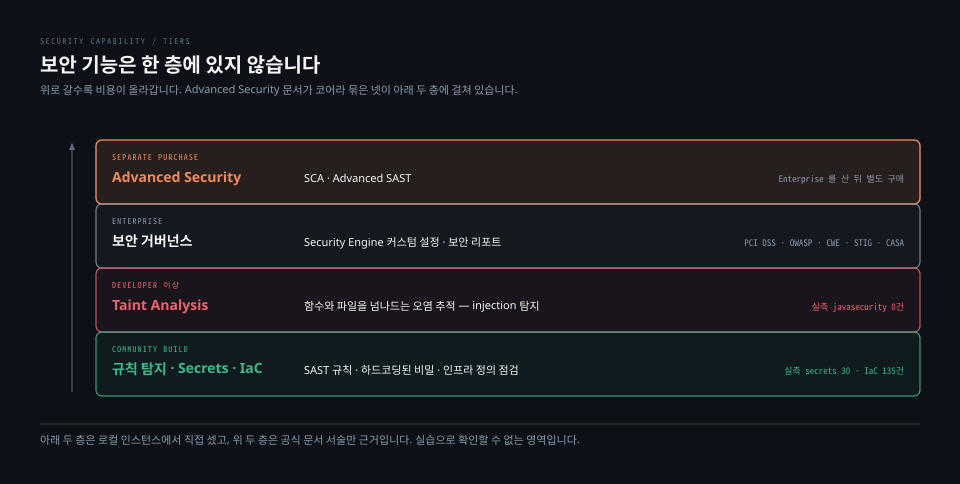

# Advanced Security와 AI 기능

> 이 편은 실습으로 확인할 수 없는 영역입니다. Enterprise 위에서만 열리기 때문입니다. 그래서 기능 소개보다 **경계를 정확히 긋는 일**에 무게를 둡니다. 문서끼리 어긋나는 자리도 그대로 적어 둡니다.

## 학습 목표

> 이 편을 읽고 나면 아래 네 가지를 스스로 해낼 수 있습니다.

1. Advanced Security 가 무엇 위에 얹히는 제품인지 층으로 설명할 수 있습니다.
2. SCA 가 다루는 네 가지 관심사를 말할 수 있습니다.
3. 일반 SAST 와 Advanced SAST 의 시야 차이를 설명할 수 있습니다.
4. AI 기능 네 갈래를 구분하고 그중 폐기 예고된 것을 짚을 수 있습니다.




## 1. Advanced Security 는 Enterprise 위의 별도 제품입니다

> Enterprise 를 사면 딸려 오는 기능이 아닙니다. 공식 문서 표현이 "Enterprise edition 부터 구매할 수 있는 유료 제품"입니다.

문서는 Advanced Security 가 무엇 위에 세워졌는지를 두 묶음으로 적습니다. 하나는 SonarQube 코어 보안 기능이고 다른 하나는 이미 Enterprise 에 포함된 기능입니다.

| 묶음 | 항목 |
|---|---|
| 코어 보안 | SAST · Taint Analysis · Secrets Detection · IaC Scanning |
| Enterprise 기능 | Security Engine 커스텀 설정 · 보안 리포트(PCI DSS, OWASP Top 10, CWE Top 25, STIG, CASA) |
| Advanced Security 가 더하는 것 | **SCA · Advanced SAST** |

### 코어라는 묶음이 한 층이 아닙니다

첫 줄의 네 항목을 실습 인스턴스에서 하나씩 재 보면 같은 층이 아닙니다.

| 항목 | Community Build 에서 | 근거 |
|---|---|---|
| SAST 규칙 | 있음 | `java` 저장소 695개 등 |
| Secrets Detection | **있음** | `secrets` 저장소 30개 |
| IaC Scanning | **있음** | `terraform` 52 · `cloudformation` 29 · `docker` 28 · `kubernetes` 26 |
| Taint Analysis | **없음** | `javasecurity` 저장소 0개 |

**넷 중 셋은 무료 배포에 이미 있고 하나만 유료입니다.** 문서가 이 넷을 "코어"라는 한 단어로 묶어 놓아서, Advanced Security 소개만 읽으면 넷 다 상위 에디션의 것으로 오해하기 쉽습니다. 하드코딩된 비밀이나 Terraform 오설정을 잡고 싶다면 라이선스를 살 필요가 없습니다.


## 2. SCA 는 의존성을 봅니다

> 내가 쓴 코드가 아니라 내가 끌어다 쓴 코드를 봅니다. 관심사가 넷입니다.

- **취약점 식별** — CVE 로 추적되는 서드파티 의존성의 취약점을 찾습니다
- **악성 패키지 탐지** — 알려진 악성 패키지 목록과 대조합니다
- **라이선스 관리** — 조직이 허용한 라이선스 정책을 따르는지 봅니다
- **SBOM** — 의존성 목록을 명세로 내보냅니다

취약점 데이터의 출처를 문서가 명시합니다. NIST NVD, OSV(OpenSSF Malicious Packages 포함), EPSS, CISA KEV 넷이고 **최소 시간당 한 번 갱신**합니다. 여기에 수작업 조사와 오픈소스 관리자로부터 얻은 정보를 보탠다고 적혀 있습니다.

지원 범위는 언어가 아니라 **패키지 매니저** 기준입니다.

| 언어 | 패키지 매니저 |
|---|---|
| Java · Kotlin · Scala | Maven · Gradle |
| JavaScript | NPM · Yarn · PNPM · Bun |
| Python | Pip · Pipenv · Poetry · uv |
| C# · VB.NET | NuGet |
| Go · Ruby · Rust · PHP | go · Rubygems · Cargo · Composer |
| C/C++ | Conan · VCPkg |
| (매니저 무관) | CycloneDX · SPDX 형식 SBOM 직접 입력 |

매니저마다 매니페스트 파일과 잠금 파일이 정해져 있고, 잠금 파일이 없는 조합은 **분석 시점에 생성**한다고 적혀 있습니다. Maven 과 Gradle 이 여기 해당합니다.

운영상 걸리는 조건이 하나 있습니다. SCA 결과를 보려면 **주 브랜치를 빌드하거나 다시 빌드해야** 합니다. 켜기만 하고 재분석하지 않으면 의존성 탭이 비어 있습니다.

5-01 의 참조 아키텍처에도 이 제품이 등장합니다. Enterprise 에 Advanced Security 를 함께 쓰면 데이터베이스 테이블 공간을 **30% 더 잡으라**는 단서가 붙어 있습니다.


## 3. Advanced SAST 는 의존성 안까지 추적합니다

> 일반 SAST 는 내가 쓴 코드를 봅니다. Advanced SAST 는 그 코드가 호출하는 오픈소스 내부까지 따라갑니다.

문서 표현을 그대로 옮기면 "코드 분석과 스캔을 오픈소스 의존성 안에 있는 알려지지 않은 부분까지 확장한다"입니다. 내 애플리케이션 코드와 서드파티 코드가 **상호작용하면서 생기는** 더 깊고 복잡한 취약점을 찾는 것이 목적입니다.

이 확장이 왜 필요한지는 taint 분석의 성질에서 나옵니다. 오염된 입력이 내 코드에서 라이브러리 함수로 들어갔다가 다시 나오는 경로가 있으면, 라이브러리 내부를 보지 못하는 분석기는 그 지점에서 추적을 멈춥니다. 경로가 끊기면 취약점은 보고되지 않습니다.

대신 범위가 좁습니다. 지원 언어가 셋뿐입니다.

```bash
JavaScript / TypeScript
Java
C# / .NET
```

SCA 가 패키지 매니저 기준으로 열두 개 넘는 조합을 다루는 것과 대비됩니다. 같은 제품 안에서도 두 축의 성숙도가 다릅니다.


## 4. AI 기능은 네 갈래입니다

> 코드를 판정하는 쪽과 코드를 고쳐 주는 쪽, 그리고 라벨을 붙이는 쪽과 에이전트에 물리는 쪽으로 나뉩니다.

| 기능 | 하는 일 |
|---|---|
| AI Code Assurance | AI 생성 코드를 담은 프로젝트에 라벨을 붙이고 자격을 갖춘 Quality Gate 를 적용합니다 |
| AI CodeFix | LLM 으로 이슈 수정안을 만들어 제안합니다 |
| Autodetect AI code | GitHub Copilot 사용을 감지해 프로젝트 관리자에게 알립니다 |
| MCP Server | 에이전트가 SonarQube 를 도구로 호출하게 합니다 |

### AI Code Assurance 는 게이트에 자격이 필요합니다

이름과 달리 별도 분석 엔진이 아닙니다. 세 가지 장치의 조합입니다.

1. 프로젝트에 AI 코드 라벨을 붙입니다
2. **AI Code Assurance 자격을 갖춘 Quality Gate** 를 적용합니다
3. 그 결과를 배지로 외부에 게시합니다

권장 게이트로 `Sonar way for AI Code` 가 제공되며, 기존 게이트에 자격을 부여해 쓸 수도 있습니다. 자격 없는 게이트를 쓰면 라벨을 붙여도 Assurance 상태가 되지 않습니다. 실제로 문서가 이행 시 주의를 적어 두었습니다. 10.7 에서는 `Sonar way` 가 AI 코드 프로젝트에 강제됐는데, 그 버전에서 올라오면 **해당 프로젝트들이 Assurance 상태를 잃습니다.**

### Autodetect AI code 는 폐기 예고됐습니다

2026.1 LTA 에 아직 있지만 앞으로 제거된다고 문서가 명시합니다. 수동 라벨링은 그대로 남습니다.

5-02 의 폐기 정책을 대입하면 시점이 계산됩니다. 기능은 폐기한 해의 다음 해, 새 LTA 이후에 제거될 수 있고 최소 6개월이 보장됩니다. 2026.1 에서 폐기 표시가 붙었으므로 **2027.1 LTA 까지는 남아 있고 그 뒤 릴리스에서 사라질 수 있습니다.** 이 기능에 의존해 자동화를 짜 두었다면 그때까지 수동 라벨링으로 옮겨야 합니다.


## 5. AI CodeFix 의 에디션이 문서마다 다릅니다

> 같은 2026.1 문서 안에서 세 페이지가 한 가지를 말하고 한 페이지가 다른 것을 말합니다.

| 출처 | AI CodeFix 를 쓸 수 있는 에디션 |
|---|---|
| 에디션 기능 매트릭스 | Developer · Enterprise · Data Center **모두 체크** |
| AI 기능 개요 페이지 | "Enterprise and Data Center editions" |
| 같은 개요 페이지 하단 | "available with SonarQube Server, Enterprise and Data Center editions" |
| AI CodeFix 전용 페이지 첫 줄 | "**only available** in Enterprise and Data Center editions" |

전용 페이지가 "only"라는 단어까지 써 가며 못 박고 개요 페이지가 두 번 같은 말을 하므로, **매트릭스의 Developer 체크 쪽이 잘못됐다고 읽는 편이 안전합니다.** Community Build 비교표는 Server 열에 체크만 있어 에디션을 구분해 주지 않아서 이 판정에 도움이 되지 않습니다.

도입을 검토한다면 이런 자리는 문서로 결론 내지 말고 영업 쪽에 확인하는 편이 낫습니다. 여기서 얻을 일반 원칙은 하나입니다. **요약표와 전용 페이지가 어긋나면 전용 페이지를 믿습니다.** 5-02 의 LTA 경로에서도 같은 판단을 했습니다.

기능 자체의 조건도 함께 적어 둡니다.

- 지원 언어는 Java · JavaScript · TypeScript · Python · HTML · CSS · C# · C++ 이며 그중 **일부 규칙에만** 동작합니다
- 자체 호스팅 LLM 을 쓰면 코드가 망 밖으로 나가지 않습니다. 다만 최신 프롬프트와 규칙 설명을 받아야 하므로 **인스턴스는 여전히 인터넷 연결이 필요합니다**
- Sonar 가 제공하는 LLM 을 쓰면 코드 조각이 전송됩니다. 월별 사용 할당량이 있고 매월 1일에 초기화됩니다


## 6. 실습으로 확인되는 것과 확인할 수 없는 것

> 이 편의 대부분은 문서 근거뿐입니다. 그 경계를 흐리지 않는 것이 이 절의 목적입니다.

확인된 것부터 적습니다.

| 확인 항목 | 결과 |
|---|---|
| Quality Gate 목록 | `Sonar way` 하나. `isAiCodeSupported=false` |
| `Sonar way for AI Code` 게이트 | **없음** |
| Secrets · IaC 규칙 | 있음 (secrets 30 · IaC 135) |
| Taint 규칙 | 없음 (`javasecurity` 0) |

게이트 응답에 `isAiCodeSupported` 필드가 남아 있다는 점이 흥미롭습니다. 데이터 모델은 무료 배포와 공유하되 그 자격을 가진 게이트를 싣지 않는 방식입니다. 6-01 에서 본 "잠금이 아니라 부재"와 같은 패턴입니다.

확인할 수 없는 것은 넷입니다.

- SCA 의 의존성 탭과 SBOM 내보내기
- Advanced SAST 가 의존성 내부까지 추적하는 동작
- AI CodeFix 의 수정 제안
- Portfolio 의 AI Code Assurance 등급

전부 Enterprise 이상이 필요하고 실습 인스턴스로는 재현할 수 없습니다.

그럼에도 이 층을 알아 둘 값어치는 있습니다. 도입 검토에서 "이건 지금 되나요"라는 질문이 나올 때 **경계를 정확히 답할 수 있어야** 하기 때문입니다. 무료로 되는 Secrets 와 IaC 를 유료로 착각해 예산을 잡거나, 반대로 injection 탐지를 무료로 착각해 계획을 세우는 일이 실제로 생깁니다.


## 면접에서 받을 만한 질문

1. Enterprise Edition 을 구매했습니다. 이제 SCA 로 의존성 취약점을 볼 수 있습니까.
2. 하드코딩된 비밀번호와 Terraform 오설정을 잡고 싶습니다. 어느 에디션이 필요합니까.
3. AI CodeFix 를 쓰려는데 자체 LLM 을 붙이면 인스턴스를 폐쇄망에 둘 수 있습니까.

> 3개 질문에 *먼저 스스로 답해 보세요.* 자답이 끝나면 아래 §정답 (자답 후 펼치기) 으로 내려갑니다.


## 정답 (자답 후 펼치기)

> 위 §면접에서 받을 만한 질문 의 3개에 *먼저 자답한 뒤* 아래를 읽으세요. 자답 없이 먼저 읽으면 학습 효과가 0 입니다.

### 정답 1 — Enterprise 만으로는 안 됩니다

SCA 는 Advanced Security 제품에 속하고, Advanced Security 는 공식 문서 표현대로 "Enterprise edition 부터 **구매할 수 있는** 유료 제품"입니다. Enterprise 는 구매 자격 조건이지 포함 관계가 아닙니다.

Enterprise 를 사면 함께 오는 보안 기능은 따로 있습니다. Security Engine 커스텀 설정과 보안 리포트(PCI DSS, OWASP Top 10, CWE Top 25, STIG, CASA), 커스텀 시크릿 패턴이 그것입니다. 의존성 취약점과 SBOM 은 그 위 단계입니다.

덧붙일 조건이 둘 있습니다. 구매한 뒤에도 **주 브랜치를 다시 빌드해야** 의존성 탭에 결과가 나타납니다. 그리고 5-01 의 참조 아키텍처가 Advanced Security 를 함께 쓰면 데이터베이스 테이블 공간을 30% 더 잡으라고 권고합니다.

### 정답 2 — 둘 다 무료 배포에서 됩니다

Community Build 로 충분합니다. 실습 인스턴스에서 직접 셌습니다.

| 저장소 | 규칙 수 |
|---|---:|
| `secrets` | 30 |
| `terraform` | 52 |
| `cloudformation` | 29 |
| `docker` | 28 |
| `kubernetes` | 26 |

헷갈리는 원인은 Advanced Security 소개 페이지에 있습니다. 그 문서가 SAST, Taint Analysis, Secrets Detection, IaC Scanning 을 "코어 보안 기능"이라는 한 묶음으로 적어 두었는데, 그 넷이 같은 에디션에 있지 않습니다. **셋은 무료고 Taint Analysis 하나만 Developer 부터입니다.**

유료가 필요한 경우는 injection 계열입니다. SQL injection 이나 XSS 처럼 오염된 입력이 함수와 파일을 건너 흘러가는 것을 추적하려면 taint 엔진이 있어야 하고, 그 규칙은 무료 배포에 실리지 않습니다.

### 정답 3 — 완전한 폐쇄망은 안 됩니다

자체 호스팅 LLM 을 고르면 **코드는 망 안에 남습니다.** 이 점은 문서가 명확히 보장합니다.

그런데 같은 문단이 단서를 답니다. AI CodeFix 서비스가 최신 프롬프트와 지원 규칙 설명을 내려받아야 하므로 **인스턴스에는 여전히 인터넷 연결이 필요합니다.** 코드가 나가지 않는 것과 인스턴스가 고립되는 것은 다른 이야기입니다.

Sonar 가 제공하는 LLM 을 쓰는 경우는 조건이 달라집니다. 해당 코드 조각이 전송되며, 다만 Sonar 와 LLM 사업자 간 계약으로 그 코드가 모델 학습에 쓰이지 않도록 되어 있다고 문서가 밝힙니다. 이쪽은 월별 사용 할당량이 있고 매월 1일에 초기화됩니다. 자체 호스팅 LLM 은 Sonar 의 할당량을 받지 않는 대신 자체 LLM 제공자의 속도 제한에 걸릴 수 있습니다.

여기에 에디션 문제가 겹칩니다. 본문 5절에서 정리했듯 이 기능이 Developer 에서도 되는지는 문서가 서로 다르게 적고 있어, 도입 전에 확인이 필요합니다.


## 관련 문서

- [에디션 경계와 branch plugin](06-01.에디션%20경계와%20branch%20plugin.md) — 유료 경계가 부재로 구현되는 방식
- [업그레이드와 LTA 정책](05-02.업그레이드와%20LTA%20정책.md) — Autodetect AI code 제거 시점을 계산한 폐기 정책
- [Security Hotspot](03-02.Security%20Hotspot.md) — 무료 배포에서도 되는 보안 검토 축
- [Quality Gate](02-04.Quality%20Gate.md) — AI Code Assurance 가 요구하는 자격 있는 게이트
